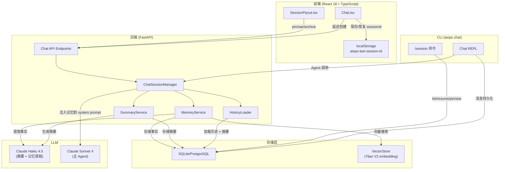
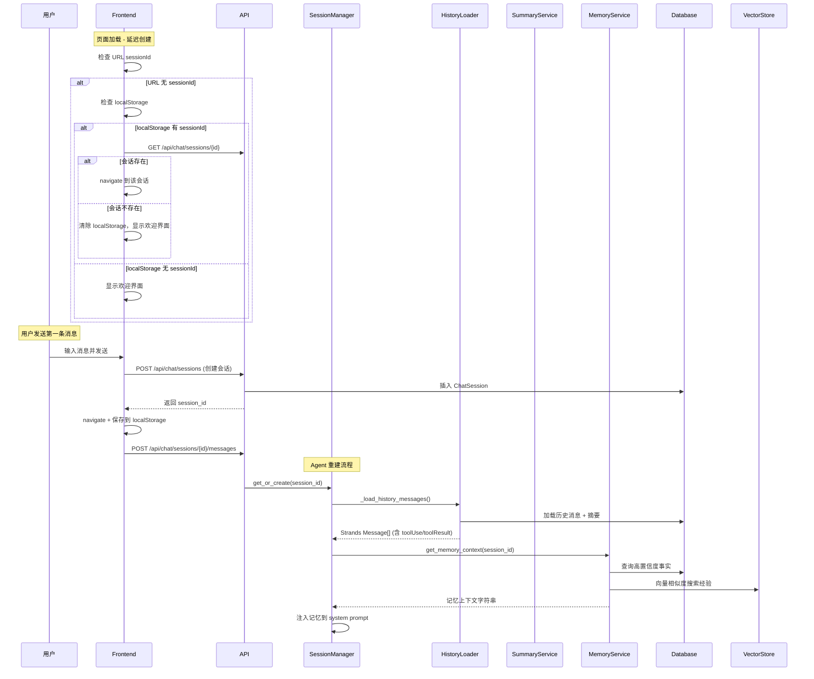
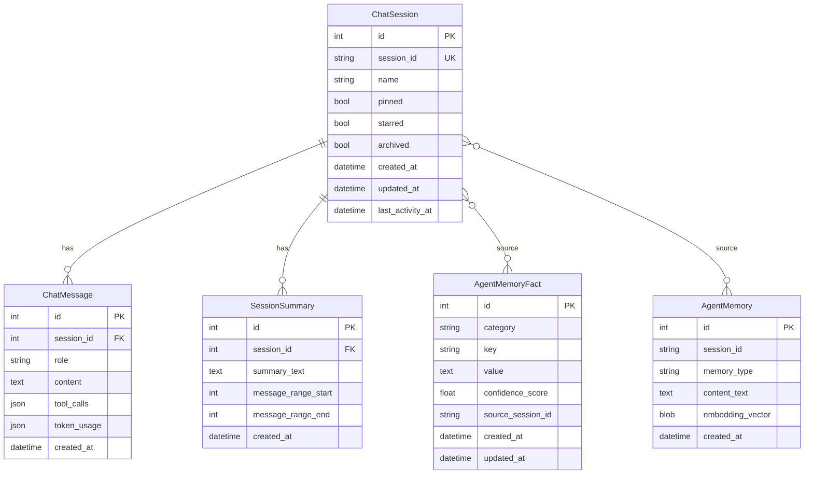

# 设计文档：Chat Session 持久化与 Agent 长期记忆

## 概述

本设计为 AgenticOps Chat 系统提供三层记忆增强架构：

1. **短期层（Session Persistence）**：前端延迟创建会话 + localStorage 恢复 + Agent 历史消息保真重建 + 会话元数据（pin/star/archive）
2. **中期层（Conversation Summary）**：SlidingWindow 裁剪前自动生成摘要，Agent 重建时注入摘要上下文
3. **长期层（Cross-Session Memory）**：结构化事实记忆（key-value）+ 向量化经验记忆（embedding similarity search）

核心设计原则：
- **延迟创建**：不在页面加载时自动创建空会话，仅在用户首次发送消息时创建
- **保真重建**：Agent 实例过期后重建时，完整还原 `toolUse`/`toolResult` 消息结构
- **渐进增强**：三层记忆独立工作，任一层失败不影响其他层
- **复用基础设施**：向量化经验记忆复用现有 KB 的 VectorStore + Titan V2 embedding

## 架构

### 整体架构图



### 数据流



## 组件与接口

### 1. 前端组件变更

#### Chat.tsx — 延迟创建逻辑

当前行为：`useEffect` 在无 `urlSessionId` 时立即调用 `createMut.mutateAsync()` 创建空会话。

新行为：
- 移除自动创建的 `useEffect`
- 无 `urlSessionId` 时检查 `localStorage.getItem('aiops-last-session-id')`
- 有有效 sessionId → 验证后 navigate
- 无有效 sessionId → 显示欢迎界面 + 输入框
- 用户发送第一条消息时 → 先创建会话，再发送消息

```typescript
// 新增 hook: useLazySessionCreate
interface UseLazySessionCreateReturn {
  sendFirstMessage: (content: string, file?: File) => Promise<void>;
  creating: boolean;
}
```

#### SessionFlyout.tsx — 元数据支持

扩展会话列表项，支持：
- 📌 置顶图标 + 右键/hover 菜单切换
- ⭐ 收藏图标 + 右键/hover 菜单切换
- 归档操作 + "显示归档"开关
- 排序：pinned → starred → 普通（按 last_activity_at 降序）

#### ChatSession TypeScript 类型扩展

```typescript
export interface ChatSession {
  // ... 现有字段
  pinned: boolean;
  starred: boolean;
  archived: boolean;
}
```

### 2. CLI 会话管理变更

#### 现有行为

当前 `/session` 命令将 context 元数据（account、output_format、detail_level）保存到 `~/.aiops/sessions/*.json` 本地文件，不涉及数据库中的 ChatSession/ChatMessage。CLI 对话历史不持久化。

#### 新行为

CLI 的 `/session` 命令扩展为同时支持 DB-backed 的 ChatSession 管理，实现 CLI ↔ Web Dashboard 会话互通。

##### 启动参数

```bash
aiops chat                          # 创建新 DB Session
aiops chat --resume                 # 恢复最近活跃的 Session
aiops chat --session <session_id>   # 恢复指定 Session
```

##### Slash 命令扩展

| 命令 | 行为 |
|------|------|
| `/session list` | 从 DB 查询 ChatSession 列表（显示 id、name、message_count、last_activity、pinned/starred） |
| `/session resume [id\|name]` | 切换到指定 Session（无参数 = 最近活跃的非归档会话） |
| `/session rename <id> <name>` | 更新 DB 中会话名称 |
| `/session pin <id>` | 切换 pinned 状态 |
| `/session star <id>` | 切换 starred 状态 |
| `/session archive <id>` | 切换 archived 状态 |
| `/session save [name]` | （向后兼容）保存 context 到本地 JSON |
| `/session load <name>` | （向后兼容）加载 context 从本地 JSON |

##### CLI 消息持久化

CLI 中的每条用户消息和 Agent 回复都写入 `chat_messages` 表，与 Web Dashboard 共享。ChatContext 增加 `db_session_id` 字段追踪当前 DB Session。

```python
class ChatContext:
    # ... 现有字段
    db_session_id: Optional[int] = None      # ChatSession.id (DB PK)
    db_session_uuid: Optional[str] = None    # ChatSession.session_id (UUID)
```

##### Resume 流程

```
aiops chat --resume
  ↓
查询 DB: SELECT * FROM chat_sessions WHERE archived=false ORDER BY last_activity_at DESC LIMIT 1
  ↓
加载历史: _load_history_messages(session_id, depth=20)
  ↓
注入到 Agent.messages
  ↓
显示: "Resumed session: <name> (<message_count> messages)"
  ↓
继续 REPL 循环
```

### 3. 后端服务

#### HistoryLoader 保真重建

当前行为：assistant 消息的 `tool_calls` 被转为文本前缀 `[Used tools: ...]`。

新行为：将 `tool_calls` 还原为 Strands SDK 的 `toolUse` + `toolResult` 消息对。

```python
def _rebuild_tool_messages(tool_calls: list) -> list[dict]:
    """将 DB 中的 tool_calls JSON 还原为 Strands toolUse/toolResult 消息对。

    Returns:
        包含 assistant(toolUse) + user(toolResult) 的消息列表。
        解析失败时返回空列表（调用方回退到文本前缀）。
    """
```

Strands SDK 消息格式：
```python
# assistant 消息中的 toolUse
{"role": "assistant", "content": [{"toolUse": {"toolUseId": "xxx", "name": "tool_name", "input": {...}}}]}
# user 消息中的 toolResult
{"role": "user", "content": [{"toolResult": {"toolUseId": "xxx", "content": [{"text": "(result from previous session)"}], "status": "success"}}]}
```

#### SummaryService

```python
class SummaryService:
    """对话摘要生成服务，使用 Haiku 模型。"""

    def generate_summary(self, messages: list[dict], session_id: int) -> str | None:
        """对即将被裁剪的消息生成摘要（≤500 tokens）。"""

    def get_summaries(self, session_id: int) -> list[SessionSummary]:
        """获取会话的所有摘要，按时间排序。"""
```

#### MemoryService

```python
class MemoryService:
    """跨会话记忆服务，管理结构化事实和向量化经验。"""

    def extract_facts(self, session_id: str, messages: list[dict]) -> list[MemoryFact]:
        """从对话历史中提取结构化事实。"""

    def get_facts(self, min_confidence: float = 0.7) -> list[MemoryFact]:
        """获取高置信度事实。"""

    def extract_experiences(self, session_id: str, messages: list[dict]) -> list[AgentMemory]:
        """从对话中提取经验片段并生成 embedding。"""

    def search_experiences(self, query_text: str, top_k: int = 3, min_score: float = 0.6) -> list[AgentMemory]:
        """向量相似度搜索历史经验。"""

    def build_memory_context(self, session_id: str, initial_context: str = "") -> str:
        """构建注入 system prompt 的记忆上下文字符串。"""
```

#### ChatSessionManager 变更

- TTL 从 `settings.session_ttl_minutes` 读取（默认 30）
- `get_or_create()` 中调用 `MemoryService.build_memory_context()` 注入记忆
- 会话结束/归档时触发 `SummaryService` 和 `MemoryService` 的提取流程

#### API 端点变更

| 端点 | 变更 |
|------|------|
| `PATCH /api/chat/sessions/{id}` | 扩展 `ChatSessionUpdate` 支持 `pinned`、`starred`、`archived` 字段 |
| `GET /api/chat/sessions` | 返回 `pinned`、`starred`、`archived` 字段；支持 `include_archived` 查询参数 |
| `GET /api/memory/facts` | 新增：查询结构化事实 |
| `DELETE /api/memory/facts/{id}` | 新增：删除指定事实 |
| `GET /api/memory/experiences` | 新增：查询向量化经验 |


## 数据模型

### 现有模型变更

#### ChatSession（扩展）

```python
class ChatSession(Base):
    __tablename__ = "chat_sessions"

    # ... 现有字段保持不变
    id: Mapped[int] = mapped_column(primary_key=True)
    session_id: Mapped[str] = mapped_column(String(36), unique=True, index=True)
    name: Mapped[str] = mapped_column(String(200))
    im_platform: Mapped[Optional[str]] = mapped_column(String(20), nullable=True)
    im_chat_id: Mapped[Optional[str]] = mapped_column(String(200), nullable=True)
    created_at: Mapped[datetime] = mapped_column(DateTime, default=datetime.utcnow)
    updated_at: Mapped[datetime] = mapped_column(DateTime, default=datetime.utcnow, onupdate=datetime.utcnow)
    last_activity_at: Mapped[datetime] = mapped_column(DateTime, default=datetime.utcnow)

    # 新增字段
    pinned: Mapped[bool] = mapped_column(Boolean, default=False)
    starred: Mapped[bool] = mapped_column(Boolean, default=False)
    archived: Mapped[bool] = mapped_column(Boolean, default=False)
```

#### ChatSessionUpdate（扩展 Pydantic 模型）

```python
class ChatSessionUpdate(BaseModel):
    name: Optional[str] = Field(None, min_length=1, max_length=200)
    pinned: Optional[bool] = None
    starred: Optional[bool] = None
    archived: Optional[bool] = None
```

#### ChatSessionResponse（扩展 Pydantic 模型）

```python
class ChatSessionResponse(BaseModel):
    # ... 现有字段
    pinned: bool = False
    starred: bool = False
    archived: bool = False
```

### 新增模型

#### SessionSummary

```python
class SessionSummary(Base):
    """滑动窗口裁剪时生成的对话摘要。"""
    __tablename__ = "session_summaries"

    id: Mapped[int] = mapped_column(primary_key=True)
    session_id: Mapped[int] = mapped_column(ForeignKey("chat_sessions.id", ondelete="CASCADE"))
    summary_text: Mapped[str] = mapped_column(Text)
    message_range_start: Mapped[int] = mapped_column(Integer)  # ChatMessage.id
    message_range_end: Mapped[int] = mapped_column(Integer)    # ChatMessage.id
    created_at: Mapped[datetime] = mapped_column(DateTime, default=datetime.utcnow)
```

#### AgentMemoryFact

```python
class AgentMemoryFact(Base):
    """跨会话结构化事实记忆（key-value 形式）。"""
    __tablename__ = "agent_memory_facts"

    id: Mapped[int] = mapped_column(primary_key=True)
    category: Mapped[str] = mapped_column(String(50))  # user_preference, infra_context, team_info
    key: Mapped[str] = mapped_column(String(200))
    value: Mapped[str] = mapped_column(Text)
    confidence_score: Mapped[float] = mapped_column(Float, default=0.8)
    source_session_id: Mapped[str] = mapped_column(String(36))  # ChatSession.session_id
    created_at: Mapped[datetime] = mapped_column(DateTime, default=datetime.utcnow)
    updated_at: Mapped[datetime] = mapped_column(DateTime, default=datetime.utcnow, onupdate=datetime.utcnow)

    __table_args__ = (
        UniqueConstraint("category", "key", name="uq_fact_category_key"),
    )
```

#### AgentMemory

```python
class AgentMemory(Base):
    """跨会话向量化经验记忆。"""
    __tablename__ = "agent_memories"

    id: Mapped[int] = mapped_column(primary_key=True)
    session_id: Mapped[str] = mapped_column(String(36))  # ChatSession.session_id
    memory_type: Mapped[str] = mapped_column(String(20))  # problem, root_cause, solution
    content_text: Mapped[str] = mapped_column(Text)
    embedding_vector: Mapped[bytes] = mapped_column(LargeBinary, nullable=True)  # numpy array as BLOB
    created_at: Mapped[datetime] = mapped_column(DateTime, default=datetime.utcnow)
```

### 配置变更

#### settings.yaml 新增

```yaml
session_ttl_minutes: 30  # Agent 实例 TTL（分钟）
```

#### config.py 新增

```python
session_ttl_minutes: int = Field(
    default=30,
    description="Agent instance TTL in minutes before cleanup",
)
```

### ER 图




## 正确性属性（Correctness Properties）

*属性（Property）是指在系统所有有效执行中都应成立的特征或行为——本质上是对系统应做什么的形式化陈述。属性是人类可读规范与机器可验证正确性保证之间的桥梁。*

### Property 1: toolUse 结构还原正确性

*For any* 有效的 `tool_calls` JSON 数组（包含 name 和 input 字段），`_rebuild_tool_messages()` 生成的 assistant 消息应包含符合 Strands SDK 格式的 `toolUse` 结构，其中 `toolUseId` 非空、`name` 与原始 tool_calls 中的 name 一致、`input` 与原始 input 一致。

**Validates: Requirements 2.1**

### Property 2: toolResult 配对与占位内容

*For any* 有效的 `tool_calls` JSON 数组，`_rebuild_tool_messages()` 生成的消息序列中，每个 `toolUse` 都应有且仅有一个对应的 `toolResult`（通过 `toolUseId` 匹配），且每个 `toolResult` 的 content text 应为 `"(result from previous session)"`。

**Validates: Requirements 2.2, 2.4**

### Property 3: 会话列表排序不变量

*For any* 会话列表（包含任意组合的 pinned、starred、普通会话），排序后的结果应满足：所有 pinned 会话出现在所有 starred 会话之前，所有 starred 会话出现在所有普通会话之前，且每个分组内按 `last_activity_at` 降序排列。

**Validates: Requirements 3.7**

### Property 4: 归档会话默认隐藏

*For any* 会话列表，默认过滤后的结果不应包含任何 `archived === true` 的会话。

**Validates: Requirements 3.9**

### Property 5: TTL 过期清理

*For any* Agent 实例和任意正整数 TTL 值，当该实例的最后活动时间距当前时间超过 TTL 分钟时，`_remove_stale()` 应将其从 `_agents` 字典中移除。

**Validates: Requirements 4.3**

### Property 6: 摘要注入完整性

*For any* 会话（拥有 N 条摘要记录，N ≥ 1），当 HistoryLoader 重建消息历史时，返回的消息列表应包含所有 N 条摘要的内容，且摘要内容出现在历史消息之前。

**Validates: Requirements 5.3**

### Property 7: 摘要长度约束

*For any* 由 SummaryService 生成的摘要文本，其 token 数量应不超过 500。

**Validates: Requirements 5.4**

### Property 8: 事实 Upsert 幂等性

*For any* 事实提取序列（包含相同 category + key 的多次提取），数据库中该 (category, key) 组合应始终只有一条记录，且其 value 和 confidence_score 为最后一次提取的值。

**Validates: Requirements 6.3**

### Property 9: 高置信度事实过滤

*For any* 事实集合（包含不同 confidence_score 的记录），`get_facts(min_confidence=0.7)` 返回的结果应仅包含 `confidence_score >= 0.7` 的记录，且不遗漏任何满足条件的记录。

**Validates: Requirements 6.4**

### Property 10: 经验注入格式完整性

*For any* 检索到的历史经验列表（非空），注入到 system prompt 的文本应为每条经验包含来源 `session_id` 和 `created_at` 时间戳。

**Validates: Requirements 7.4**

### Property 11: 相似度阈值过滤

*For any* 向量搜索结果集合，`search_experiences(min_score=0.6)` 返回的结果应仅包含 `score >= 0.6` 的记录。

**Validates: Requirements 7.5**

### Property 12: 记忆序列化往返一致性

*For any* 有效的 MemoryFact 对象、AgentMemory 对象（不含 embedding_vector）或 SessionSummary 对象，序列化存储到数据库再反序列化读取后，应产生与原始对象等价的结果。

**Validates: Requirements 10.1, 10.2, 10.3**

### Property 13: CLI 会话消息持久化一致性

*For any* CLI 中发送的用户消息和接收的 Agent 回复，写入 `chat_messages` 表后，通过 Web Dashboard 的 `GET /api/chat/sessions/{id}` 查询应能获取到相同的消息内容和角色。

**Validates: Requirements 9.4**

## 错误处理

| 场景 | 处理策略 |
|------|----------|
| localStorage 中的 sessionId 对应会话已删除 | 前端捕获 404，清除 localStorage，显示欢迎界面 |
| tool_calls JSON 格式损坏 | HistoryLoader 回退到文本前缀 `[Used tools: ...]`，记录 `warning` 日志 |
| 摘要生成失败（LLM 调用超时/错误） | SummaryService 记录 `error` 日志，跳过摘要生成，正常裁剪消息 |
| 事实提取失败 | MemoryService 记录 `error` 日志，不影响会话正常结束 |
| 向量 embedding 生成失败 | MemoryService 记录 `error` 日志，跳过该经验片段的存储 |
| 向量搜索失败 | MemoryService 返回空列表，Agent 正常启动（无历史经验注入） |
| PATCH 更新 pinned/starred/archived 失败 | 前端显示 toast 错误提示，回滚 UI 状态 |
| 延迟创建会话时 POST 失败 | 前端显示错误提示，保留用户输入内容，允许重试 |
| CLI `/session resume` 指定的会话不存在 | 显示错误提示，列出最近 5 个可用会话供选择 |
| CLI `--resume` 无任何非归档会话 | 创建新会话并提示用户 |
| CLI 消息写入 DB 失败 | 记录 `warning` 日志，不中断对话（降级为非持久化模式） |

核心原则：**三层记忆独立容错**。任何一层的失败都不应阻塞用户的正常对话流程。摘要和记忆是增强功能，降级后系统仍可正常工作。

## 测试策略

### 双轨测试方法

本功能采用单元测试 + 属性测试的双轨方法：

- **单元测试**：验证具体示例、边界情况和错误条件
- **属性测试**：验证跨所有输入的通用属性

两者互补，缺一不可。

### 属性测试配置

- **库**：Python 后端使用 `hypothesis`；TypeScript 前端使用 `fast-check`
- **每个属性测试最少运行 100 次迭代**
- **每个属性测试必须用注释引用设计文档中的属性编号**
- **标签格式**：`Feature: chat-session-persistence, Property {number}: {property_text}`
- **每个正确性属性由一个属性测试实现**

### 测试分层

#### 后端属性测试（hypothesis）

| Property | 测试文件 | 生成器 |
|----------|----------|--------|
| P1: toolUse 结构还原 | `tests/test_history_loader_props.py` | 随机 tool_calls JSON（name: 随机字符串, input: 随机 dict） |
| P2: toolResult 配对 | `tests/test_history_loader_props.py` | 同 P1 |
| P5: TTL 过期清理 | `tests/test_session_manager_props.py` | 随机 TTL 值 + 随机 last_activity 时间 |
| P6: 摘要注入完整性 | `tests/test_history_loader_props.py` | 随机摘要列表 + 随机历史消息 |
| P7: 摘要长度约束 | `tests/test_summary_service_props.py` | 随机消息序列 → 生成摘要 → 验证 token 数 |
| P8: 事实 Upsert 幂等性 | `tests/test_memory_service_props.py` | 随机 (category, key, value) 序列，含重复 key |
| P9: 高置信度过滤 | `tests/test_memory_service_props.py` | 随机 confidence_score 列表 |
| P10: 经验注入格式 | `tests/test_memory_service_props.py` | 随机经验列表 |
| P11: 相似度阈值过滤 | `tests/test_memory_service_props.py` | 随机 score 列表 |
| P12: 序列化往返 | `tests/test_memory_roundtrip_props.py` | 随机 MemoryFact / AgentMemory / SessionSummary 对象 |

#### 前端属性测试（fast-check）

| Property | 测试文件 | 生成器 |
|----------|----------|--------|
| P3: 会话列表排序 | `src/__tests__/sessionSort.prop.test.ts` | 随机会话列表（随机 pinned/starred/archived + 随机时间戳） |
| P4: 归档隐藏 | `src/__tests__/sessionSort.prop.test.ts` | 同 P3 |

#### 单元测试

| 范围 | 测试文件 | 覆盖内容 |
|------|----------|----------|
| 延迟创建 | `src/__tests__/Chat.test.tsx` | 1.1-1.8 的具体场景 |
| 元数据 CRUD | `tests/test_chat_api.py` | 3.1-3.6, 3.8, 3.10 的 API 行为 |
| TTL 配置 | `tests/test_session_manager.py` | 4.1, 4.2 的配置读取 |
| 摘要存储 | `tests/test_summary_service.py` | 5.1, 5.2 的存储行为 |
| 记忆 API | `tests/test_memory_api.py` | 6.1, 6.2, 6.5, 7.1-7.3, 7.6 的 API 行为 |
| 错误回退 | `tests/test_error_handling.py` | 2.3, 5.5 的错误处理 |
| CLI 会话管理 | `tests/test_cli_session.py` | 9.1-9.9 的 CLI 命令行为 |
