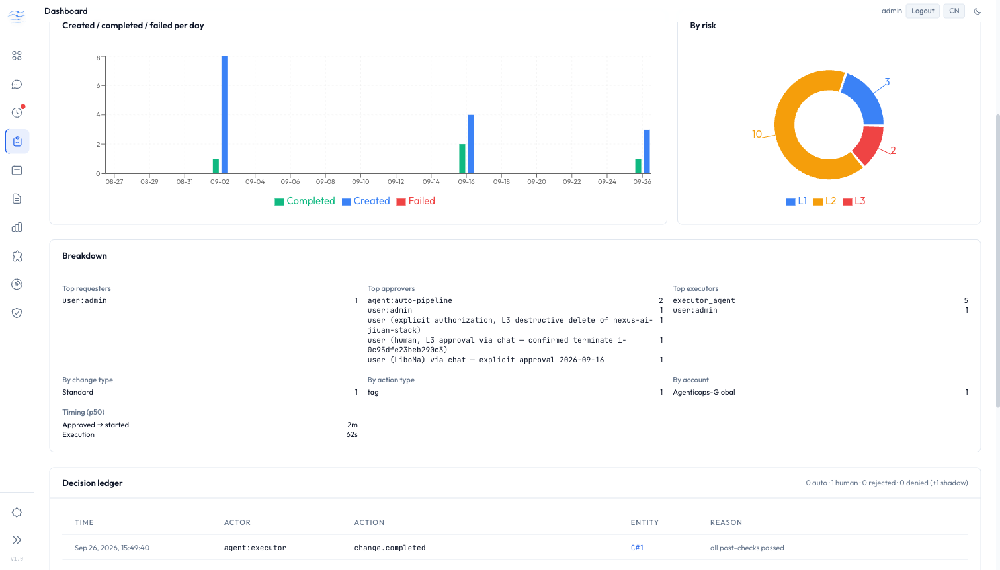
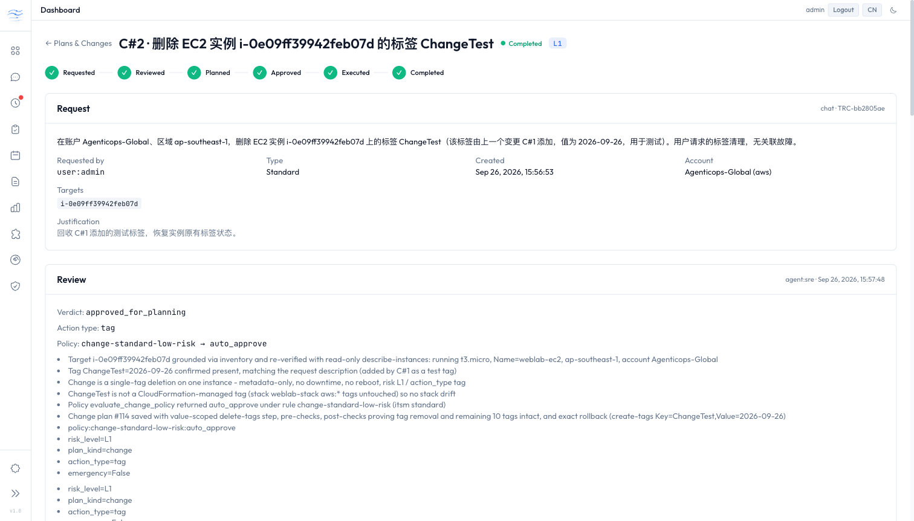

# MVP-2.6.0 Change Management (ITSM) — Live E2E Evidence Report

> **Date:** 2026-09-26 (run) · **Branch:** `MVP-2.5.0` · **Deployed commit:** `5f95120` · **Scope:** design §7 seven-step live E2E + §8 acceptance criteria
> (`docs/superpowers/specs/2026-09-16-change-management-p1-design.md`, release note `docs/MVP-2.6.0-RELEASE.md`)
>
> **AWS writes in this run were limited to EC2 tags on one lab instance** (`i-0e09ff39942feb07d`, `weblab-ec2`), and every tag written was removed again —
> see [Writes performed](#writes-performed). The instance ended with the same 10 tags it started with.

---

## Environment

| Item | Value |
|------|-------|
| Box | dev single host `i-0935450a95f321942` (ap-southeast-1), deployed via `iac/deploy-sg/deploy.sh` + SSM; served at the dev CloudFront URL, SPA under `/app/` |
| Service | 4 uvicorn workers, SQLite `data/agenticops.db`, **API auth ON** (`admin`), `rbac_enforce=false` (shadow) |
| Target account | `Agenticops-Global` (account id 2), region `ap-southeast-1`, credentials resolved through the provider layer (`get_subprocess_env_for_account`) — no ambient fallback |
| Models (committed defaults) | main **Opus 5**, sre **Fable 5.1**, executor **Opus 4.6** |
| Change settings | `change_management_enabled=true`, `change_auto_approve_standard=false` (a policy `auto_approve` still waits for a human), `command_audit_enabled=true` |
| Policy | `change-standard-low-risk` (plan_kind=change, L0/L1, tag/config/scale → `auto_approve`, standard); `change_required` patterns incl. `aws ec2 modify-security-group` |
| DB backup before migration | `/opt/agenticops-backups/pre-2.6.0-20260926-153507/` (online-backup copy of the DB + box-local agent-memory/skills patch and tarball) |

---

## Test 0 — Gates

| Gate | At `5f95120` (pre-deploy) | At `518f1cd` (after the E2E fixes below) |
|------|------|------|
| `pytest tests/` (`AIOPS_NOTIFICATIONS_ENABLED=false`) | 5449 passed, 2 known local failures | **5450 passed, 85 skipped, 3 failed** — see below |
| `npx tsc --noEmit` | OK | OK |
| `npx vitest run` | 189 passed | **190 passed** (+1 new) |
| `vite build` | OK | OK |
| Locale parity | 505 keys, en = zh | unchanged |

The 3 failures at `518f1cd`, each checked:

- `test_web_tools::test_invalid_headers_json` — the documented local-DNS false failure (`example.com` resolves to a reserved address on this machine, so the SSRF guard fires first).
- `test_prompt_budget::test_no_cjk_in_base_prompts` — caused by an **uncommitted** one-line local edit to `agents/reporter_agent.py` that is not part of any commit; the committed file has no CJK.
- `test_session_manager_props::test_all_agents_removed_when_all_stale` — hypothesis `DeadlineExceeded` (257 ms vs 200 ms) on a loaded 5.4-minute run; the file passes alone, **9/9**.

The one frontend file that fails to load, `e2e/galaxy.spec.ts`, is a Playwright spec picked up by vitest (`Cannot find package '@playwright/test'`). That problem predates this release.

---

## Step 0 — Deploy + migration of the live dev DB

The service was stopped, the DB was copied with the SQLite online-backup API, and `init_db()` ran once, **single-process**, as the service user before the 4 workers started.
Running it single-process sidesteps the migration race described in Finding 4.

**Zero data loss:** every backup row was compared with the live DB, column by column over the shared columns, after the E2E:

| Table | Backup rows | Missing in live | Changed | New columns |
|------|------|------|------|------|
| `fix_plans` (rebuilt) | 110 | 0 | 0 | `change_request_id`, `plan_kind`, `rejected_at`, `rejected_by`, `rejection_reason`, `updated_at` |
| `fix_executions` (rebuilt) | 33 | 0 | 0 | — |
| `pipeline_events` (rebuilt) | 793 | 0 | 0 | `change_request_id` |
| `health_issues` | 118 | 0 | 0 | `issue_type` |
| `audit_logs` | 0 | 0 | 0 | `actor` |

`PRAGMA integrity_check` returns `ok`. `PRAGMA foreign_key_check` returns **8 rows in both the backup and the live DB**. Those orphans predate this release and the migration neither created nor removed any.
`fix_plans.health_issue_id` is nullable and `change_requests` / `command_audits` exist.

---

## Step 1 — Chat: add a tag → C#1, SRE review, L1, plan with post-check + rollback — **PASS**

Chat (web session, SSE), in Chinese: add tag `ChangeTest=2026-09-26` to `i-0e09ff39942feb07d`.

- 80 s end to end. Main called exactly `get_active_account` → `request_change` → `review_change`. There were no stream errors and **no `sre_query` write path** (CHANGE ROUTING rule 5.7).
- Reply: **C#1**, status `planned`, risk **L1**, target grounded in inventory (R#1425) and re-verified with a read-only `describe-instances`, policy `change-standard-low-risk`.
  The SRE also noted that the instance belongs to CloudFormation stack `weblab-stack`, so drift detection may flag the out-of-band tag.
- Change plan **#111**: step `aws ec2 create-tags … Key=ChangeTest,Value=2026-09-26`.
  - Pre-checks: identity/state, tag absent, fewer than 50 tags.
  - Post-checks: `describe-tags` shows the tag, the instance is still running, tag count is 11.
  - Rollback: `delete-tags` with the exact key and value.
- DB: `change_requests` row 1 has `source=chat`, `requested_by=user:admin`, `effective_change_type=standard`, `action_type=tag`, `trace_id=TRC-187fa4ee`.
  Plan 111 has `plan_kind=change` and **`health_issue_id IS NULL`**. **No HealthIssue was created.**

## Step 2 — Zero executed writes before approval — **PASS**

For every change request, the count of `command_audits` rows that match its id **or** its trace, have `outcome=executed`, and were written before `approved_at` is **0**. That holds for C#1–C#4.
During review the SRE ran only read-only commands, and read-only commands are not recorded by design.

## Step 3 — Web approval (with reason) → Executor → `describe-tags` evidence → completed — **PASS**

The owner performed this step in the Web UI (`/app/changes/1`), in their own session.

| Time (UTC) | Event |
|------|------|
| 15:47:06.421 | `authz.denied_shadow` (audit 4): SoD `sod-change-approver-not-requester`. The approver is the requester, and shadow mode audits the denial and allows the request |
| 15:47:06.440 | `change.approved` (audit 5), reason `approved`, `approved_by=user:admin` from the session, `approver_user_id=1`. Plan 111 `plan.approved` (audit 6) |
| 15:48:34 | `change.execution_started` (audit 7), execution **#34** |
| 15:49:23 | `command_audits` row 1: `agent:executor` on behalf of `user:admin`, tool `provider_aws_cli`, tier `write`, `aws ec2 create-tags … Key=ChangeTest,Value=2026-09-26`, **executed**, exit 0, 1329 ms, `fix_plan_id=111`, `change_request_id=1`, `TRC-187fa4ee` |
| 15:49:40 | execution #34 `succeeded`. Post-checks: ① *Tag ChangeTest=2026-09-26 is present* → `pass`, output `[{"Key":"ChangeTest","Value":"2026-09-26"}]`; ② *still running, tag count = 11* → `pass`, `[{"State":"running","TagCount":11}]` |
| 15:49:40.84 | `change.completed` (audit 8) by `agent:executor`, *all post-checks passed*. C#1 `completed`, plan 111 `executed` |

## Step 4 — Audit tab: decision ledger + command ledger — **PASS**

- Decision ledger for C#1 has **8 `audit_logs` rows**, every one with a non-null `actor`: requested, review started, reviewed, `authz.denied_shadow`, approved, `plan.approved`, execution_started, completed.
- The change timeline adds **3 `notification_sent`** pipeline events, one each for requested, awaits approval and COMPLETED. Every change notification went to `feishu-alert`, `default` and `ops-ses-email`, and all were `sent` (C#2's are ids 1433–1575).
- Command ledger has the `create-tags` row with `change_request_id=1` (row 1 above). `/api/command-audits` lists it.
- The Audit tab renders the plan/change KPIs, charts and both ledgers:

## Step 5 — Second change removes the tag (same path) → stats show 2 completed — **PASS**

- **C#2** was created from Chat (`requested_by=user:admin`, `TRC-bb2805ae`) and reviewed to `planned` in about 55 s: L1, tag, `change-standard-low-risk`, plan **#114**.
- It was approved via the API with reason *"E2E approval (Step 5, removal of C#1 test tag)"* at 16:00:46. The SoD shadow row is audit 12, and approved / `plan.approved` / execution_started are audits 13–15.
- `command_audits` row 2: `agent:executor` on behalf of `user:admin`, `aws ec2 delete-tags … Key=ChangeTest,Value=2026-09-26`, executed, exit 0, `fix_plan_id=114`, `change_request_id=2`.
- Execution **#35** `succeeded` with three post-checks, all `pass`:
  - `ChangeTest` absent (`[]`);
  - the other 10 keys unchanged;
  - the instance is `running`.
  C#2 `completed` at 16:01:39 (audit 16, `agent:executor`).
- `GET /api/plans/stats`: `totals.by_kind_status.change.completed == 2`, approvals `human: 2, auto: 0` (auto-approve is off), `outcomes.success_rate: 1.0`, `by_action_type: {tag: 2}`.
- Independent live check through the provider-layer credentials: `describe-tags` for `Key=ChangeTest` returns none; the instance has **10 tags**.

*(The top bar in this screenshot reads "Dashboard". That is BUG-2 below, now fixed locally.)*

## Step 6 — `rbac_enforce=true`: the requester approving their own change → 403 — **PASS**

The live service stayed in shadow mode, and `/etc/agenticops.env` was not edited, so no restart of the 4 workers was needed. The probe ran instead as a **one-off process as the service user with `AIOPS_RBAC_ENFORCE=true`**.
It ran against the same DB, calling the same `change_service.approve` path the router uses.

- **C#4** was created via the Web API and reviewed to `planned` (L1, tag, `change-standard-low-risk`, plan #116) in about 42 s.
- Probe: `rbac_enforce=True`, and the actor `user:admin` equals `requested_by` → **HTTP 403 — *user:admin is not allowed to change.approve: separation of duties: actor equals requested_by***. The router maps `ChangeForbidden` to 403.
  - C#4 status after the probe: still **`planned`** (the authz check runs before the status claim).
  - `authz.denied` written as audit 24. It is written in its own session, so it survives the rollback.
  - Positive control: `decide(other user, change.approve)` → `(True, 'allowed')`.
- C#4 was then cancelled through the running service (audit 25, `change.cancelled`). Plan 116 → `rejected` / *withdrawn: E2E Step 6 done: RBAC probe request, never to be executed*.
- Stats: `approvals.authz_denied: 1`, `authz_denied_shadow: 2`, `change.cancelled: 2`.

**Invalid first attempt (C#3):** the first probe script never ran its check. `runuser` is not on the SSM shell's PATH, and a wrong column name failed the query. The script still cancelled C#3 at 16:04:43 (plan 115 withdrawn). C#3 is counted as an invalid attempt, not as evidence.
A later run failed on a wrong import (`User` lives in `agenticops.auth.models`); its guard correctly left C#4 `planned`, and the corrected run above passed.

## Step 7 — Direct writes: confirmed write is ledgered; `change_required` is refused — **PASS (tool layer)**

In Chat, Main follows rule 5.7 and turns *any* modification without a HealthIssue into `request_change`; Steps 1 and 5 show exactly that. A chat prompt therefore cannot make the model run `create-tags` directly, and trying to force one would only test prompt compliance.
So Step 7 drives the gate itself: a one-off process as the service user calls `run_aws_cli` with a run context of `user:admin`, agent `sre`, trace `TRC-e2e-step7`.

| Row | Command | Outcome | Evidence |
|------|------|------|------|
| 3 | `aws ec2 create-tags … Key=Direct,Value=1` (no confirmation) | **refused / `confirmation`** | tool asks to present the command and call again with `require_confirmation=True` |
| 4 | same, `require_confirmation=True` | **executed**, exit 0, 2743 ms | tag written |
| 5 | `aws ec2 modify-security-group-rules --group-id sg-0000000000000000e …` | **refused / `change_required`** | *"matches the high-risk pattern 'aws ec2 modify-security-group' (config/policies.yaml change_required) and can only run inside an approved plan. Open a change request instead: in Chat type /change …"*. Nothing was sent to AWS; the group id is a dummy |
| 6 | `aws ec2 delete-tags … Key=Direct,Value=1` (confirmed) | **executed**, exit 0, 1331 ms | cleanup |

- `/api/command-audits` returns rows 1–6.
- Stats `commands`: `by_outcome {executed: 4, refused: 2}`, `by_tool {provider_aws_cli: 2, run_aws_cli: 4}`.
- Final live check: `Direct` absent, **10 tags**.

---

## Bugs found by this run (fixed locally, not yet redeployed)

| ID | Symptom on dev | Cause | Fix (commit) |
|------|------|------|------|
| **BUG-1** | `GET /api/fix-plans` → **500**, so the new Fix Plans tab failed as a whole | Legacy plans #74 and #80 hold `steps` / `rollback_plan` / `post_checks` as JSON *strings whose content is JSON* (an agent once passed pre-encoded JSON). The ORM returns `str` and `FixPlanResponse` rejects it. The data predates 2.6.0; the new tab is what exposed it | `FixPlanResponse` decodes such values (up to 3 levels). Undecodable text is kept and wrapped, never dropped. 2 tests, red without the fix (`1633ea9`) |
| **BUG-2** | Top bar reads "Dashboard" on `/app/plans` and `/app/changes/:id` | No `ROUTE_LABELS` entry | Both map to `nav.plans` (`518f1cd`) |
| **BUG-3** | ChangeDetail lists the policy reasons twice (Review and Policy) | The backend copies policy reasons into `review_reasons` (`change_service.py`) | `policySummary()` drops reasons already shown, +1 test (`518f1cd`) |

## Findings and observations (no code change in this run)

1. **Double `policy_decision` event.** Each change's timeline has two `policy_decision` rows about 30 s apart: one from the SRE's tool call during review and one from finalize. They agree with each other, so this is cosmetic, but the timeline reads as two decisions.
2. **Notification flood after deploy.** 501 notifications in the 15:00 UTC hour and 135 in the 16:00 hour, against 6 earlier in the day. The first security review on the newly deployed build fanned out across 3 channels.
   The change notifications themselves are 3 per change × 3 channels. The consolidation / security-signal volume should be tuned separately.
3. **Plans #112 / #113.** Two L2 **fix** drafts created by the pipeline during the run are waiting for a human decision. They were deliberately left alone.
4. **Migration race.** `_migrate_2_6_0` guards with an in-process lock only. Four workers starting on an un-migrated SQLite DB could each try the table rebuild.
   This run avoided the race with a single-process `init_db()` before start. Proposed fix: a cross-process lock (`fcntl.flock` on a lock file for SQLite, `pg_advisory_xact_lock` for PostgreSQL).
5. **8 foreign-key orphans.** These predate this release and are identical before and after the migration. They were left untouched.
6. **`deploy.sh` checkout fragility.** Box-local agent-memory/skills edits block a plain `git checkout`. They were saved to the backup directory first, then `checkout -f`.
7. **Legacy free-text approvers in "Top approvers".** Before 2.6.0, approvers were free text such as *"user (LiboMa) via chat — explicit approval 2026-09-16"*, so they appear as separate actors next to `user:admin`. This is historical data; new approvals are identity-bound.
8. **`fix_executions.duration_ms` is the executor's self-report.** It is passed as a tool argument, not measured. Both executions report 18500 ms against about 41 s wall clock between start and completion. This behavior predates 2.6.0.

---

## Acceptance criteria (design §8)

| # | Criterion | Result | Evidence |
|------|------|------|------|
| 1 | Chat → completed with no HealthIssue; plan `plan_kind=change`, `health_issue_id IS NULL` | **PASS (live)** | Steps 1, 3, 5; plans 111 / 114 |
| 2 | No `executed` write command in `command_audits` before `approved` | **PASS (live)** | Step 2: 0 for C#1–C#4 |
| 3 | `approved_by` = authenticated actor; enforce → requester self-approve 403, agent L2/L3 403 | **PASS (live)** for identity binding + SoD 403; agent L2/L3 403 by test (`test_authz.py::test_agent_cannot_approve_l2_l3_and_this_is_always_enforced`) | Steps 3, 5, 6 |
| 4 | `completed` only when all post-checks pass; missing results → `needs_review` | **PASS (live)** for the pass branch (5/5 post-checks); missing results by test (`test_change_pipeline.py::test_needs_review_when_post_checks_missing`) | Steps 3, 5 |
| 5 | ≥ 5 decision rows per CR lifecycle, `actor` non-null; fix-flow human approvals also ledgered | **PASS (live)** for changes (C#1 8, C#2 8, C#4 5; 0 null actors); fix-flow ledger by test — no fix plan was approved in this run | Step 4 |
| 6 | `GET /api/plans/stats` `totals.by_kind_status` = DB aggregate | **PASS (live)** — API `change {completed 2, cancelled 2}`, `fix {executed 3, draft 9, approved 2}`; the SQL aggregate over the same 30 days is identical | Steps 5, 6 |
| 7 | Old SQLite DB migrates with zero loss; full suite passes | **PASS (live)** — 0 missing / 0 changed rows over 5 tables, same 8 pre-existing orphans; suite: see Test 0 | Step 0 |
| 8 | `change_management_enabled=false` keeps the 2.5.0 fix flow | **By test only** (`test_change_service.py::test_disabled_flag`, `test_changes_api.py::test_disabled_returns_404`) — the dev box keeps the flag on | — |

## Writes performed

| What | Where | Net effect |
|------|------|------|
| Tag `ChangeTest=2026-09-26` added (C#1, exec #34) and removed (C#2, exec #35) | EC2 `i-0e09ff39942feb07d`, Agenticops-Global / ap-southeast-1 | none — back to 10 tags |
| Tag `Direct=1` added and removed (Step 7 rows 4 and 6) | same instance | none |
| `modify-security-group-rules` | — | refused before any AWS call |
| Change requests C#1–C#4, plans 111 / 114 / 115 / 116, executions 34 / 35, audit rows 1–25, command-audit rows 1–6 | dev DB | kept as evidence (C#1/C#2 completed; C#3/C#4 cancelled, plans 115/116 withdrawn) |
| Two E2E login sessions | dev DB `sessions` | logged out after the run; the owner's sessions were not touched |

## Conclusion

The seven §7 steps pass on a real AWS account (Step 7 at the tool layer, by design). Acceptance criteria 1, 2, 6 and 7 are verified live. Criteria 3, 4 and 5 are verified live on the paths the run exercises, with the rest covered by named tests. Criterion 8 is covered by tests only.

The run found three UI/API defects (BUG-1..3). They are fixed and tested locally in `1633ea9` and `518f1cd`, which are **not pushed or redeployed**. Per the owner's rule, push (`git push --no-verify`) and redeploy wait for the owner's confirmation.
