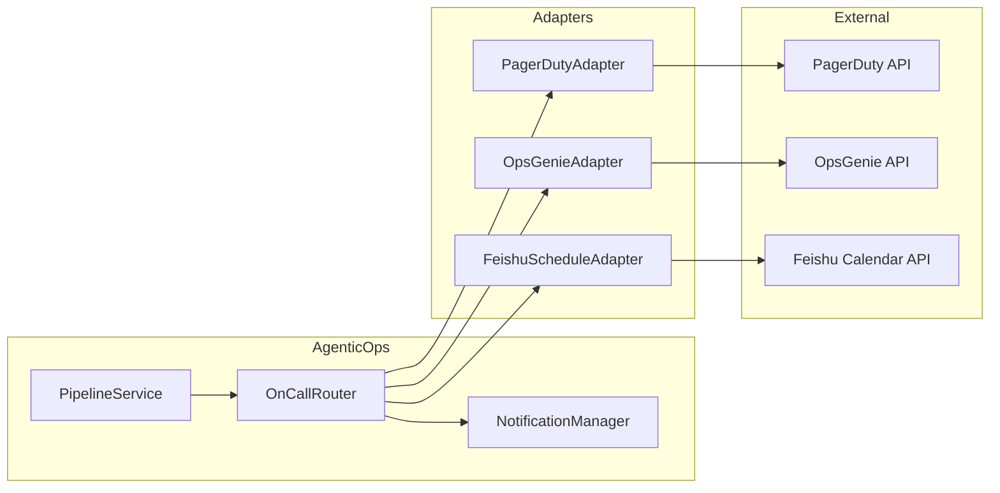
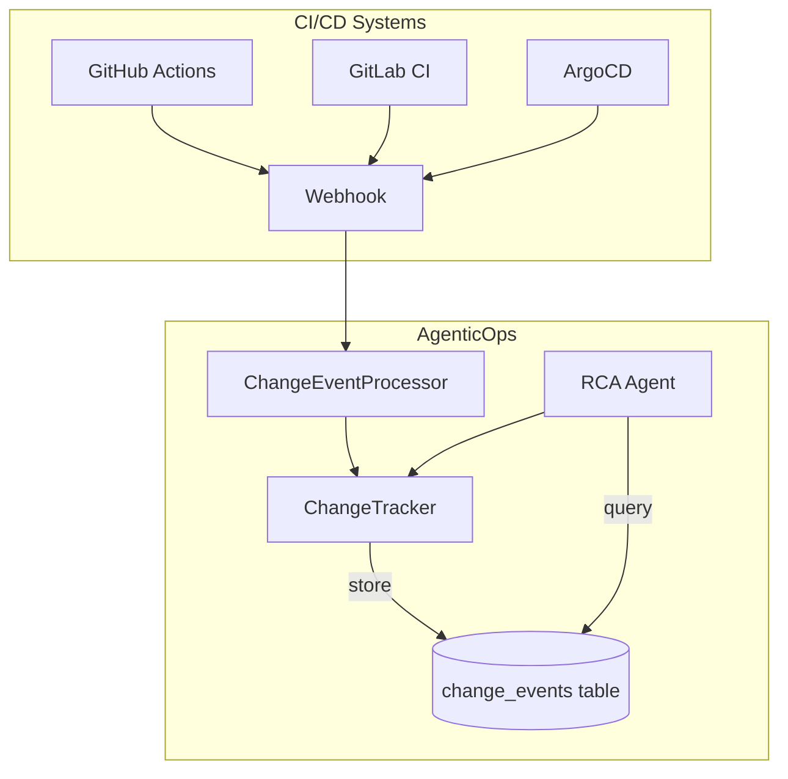
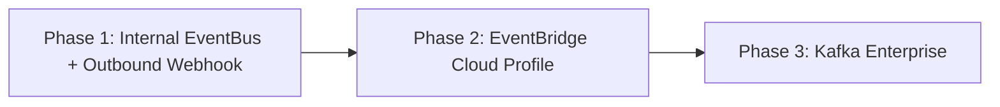
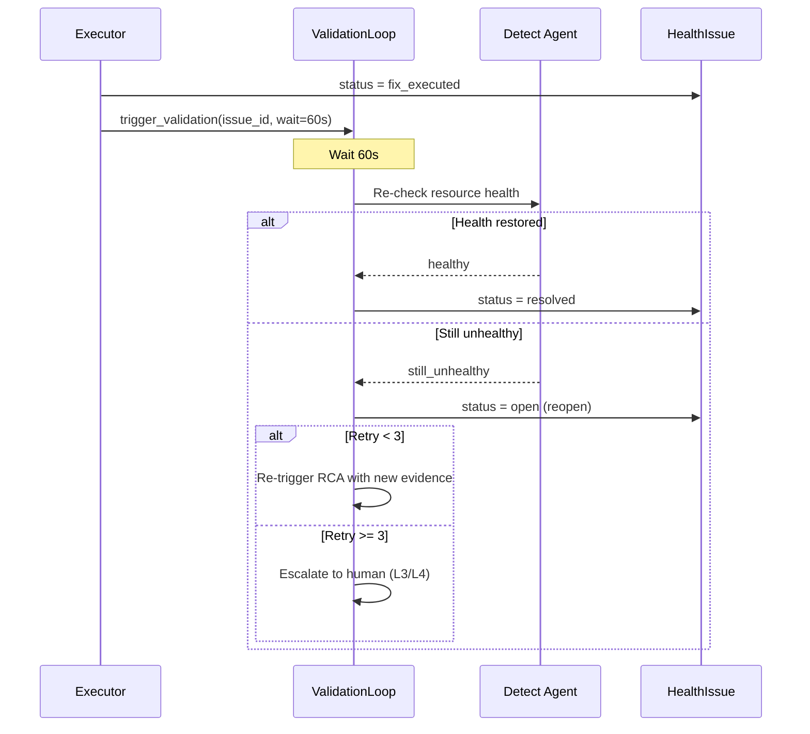

# AgenticOps 综合战略分析报告

> 日期: 2026-03-12 | 多角色团队讨论产出
>
> 参与角色: 产品战略师、平台架构师、资深 SRE、企业售前解决方案架构师

---

## 目录

- [一、产品战略分析](#一产品战略分析)
- [二、平台集成架构分析](#二平台集成架构分析)
- [三、SRE 实战评估](#三sre-实战评估)
- [四、企业采购就绪度分析](#四企业采购就绪度分析)
- [五、综合 Roadmap 建议](#五综合-roadmap-建议)

---

# 一、产品战略分析

> 角色: 产品战略师

## 1.1 当前核心价值主张

AgenticOps 解决的核心问题是：**SRE/运维团队在告警响应中的重复劳动和认知负荷**。

1. **告警疲劳** -- 从告警到修复的链路太长，需要人跳转多个工具
2. **知识碎片化** -- 排查经验在人的脑子里，新人上手慢，runbook 永远过期
3. **MTTR 过长** -- 人工介入的每一步都是延迟，L0/L1 问题不值得叫醒人

AgenticOps 的回答：**用 AI Agent 替代人在告警 -> 诊断 -> 修复链路中的重复操作，同时沉淀知识**。

### 与竞品的差异化

| 维度 | PagerDuty/Datadog | ServiceNow AIOps | AgenticOps |
|------|-------------------|-------------------|------------|
| 核心定位 | 监控+告警路由 | IT 工单自动化 | 自动诊断+修复 |
| AI 用途 | 降噪、优先级排序 | 工单分类、知识推荐 | 根因分析+修复计划生成+执行 |
| 闭环程度 | Alert -> Notify（到人为止） | Alert -> Ticket -> 人工处理 | Alert -> RCA -> Fix -> Resolve |
| 执行能力 | 无 | 有限（依赖 ITIL 流程） | 原生（Agent 直接执行修复命令） |
| 知识沉淀 | 无自动化 | 知识库需人工维护 | 自动：修复案例 -> RAG -> SOP |
| 部署模式 | SaaS only | SaaS / on-prem | 本地/云端，完全自控 |
| 成本 | $20-50/用户/月 | $100+/用户/月 | 按 LLM 调用计费，单次修复 ~$0.25-$1 |

**真正的差异化在三个点**：
1. **执行能力** -- 不止告诉你问题在哪，还能修
2. **知识飞轮** -- 每次修复自动沉淀为 SOP/KB，下次更快
3. **成本结构** -- 没有 per-seat 费用，按使用量付费

### "Agentic" 是真正的差异化还是营销噱头？

**是真正的差异化，但有条件**。系统具备多步推理、自主决策、工具使用、知识积累四项能力。但 "Agentic" 的价值需要**用户能感知到的 MTTR 降低**来证明。EKS Lab 10/10 是实验室环境，**真实生产环境的修复率和用户信任度才是检验标准**。

## 1.2 闭环缺口分析（Alert -> Diagnose -> Fix -> Learn -> Prevent）

| 环节 | 当前状态 | 强度评分 | 说明 |
|------|----------|---------|------|
| **Alert（感知）** | 强 | 8/10 | Webhook 多源接入 + IM 双管道，指纹去重 |
| **Diagnose（诊断）** | 强 | 8/10 | RCA Agent + KB/SOP 检索 + 10 个领域 Skills |
| **Fix（修复）** | 强 | 7/10 | 四级风险分级 + 自动执行 + 状态机 |
| **Learn（学习）** | 中 | 5/10 | RAG 蒸馏 + SOP 自动生成有了，但缺乏反馈循环和效果度量 |
| **Prevent（预防）** | 弱 | 2/10 | 几乎缺失。巡检是定时扫描，不是真正的预测性维护 |

### Learn 环节缺口

- **修复效果反馈** -- 修复后是否真的解决了？有没有回退？系统不追踪
- **SOP 质量评估** -- 自动生成的 SOP 被使用了多少次？成功率如何？
- **Skills 自评估** -- 哪些 Skills 用得多、效果好？缺乏数据驱动的优化
- **跨案例模式识别** -- 10 个 OOM 案例背后是否有共性？当前只存个案

### Prevent 环节缺口

- **趋势预测** -- 磁盘使用率 +2%/天，14 天后满（代码中未实现）
- **变更风险评估** -- CI/CD 部署前评估"这个变更会不会导致告警"
- **架构反思** -- 同一个组件反复出问题，是否建议架构调整
- **容量规划** -- 基于历史数据预测未来资源需求

## 1.3 业务聚焦建议

### 定位：专精场景，不做"大而全"

1. 个人/小团队项目，不可能在 PagerDuty ($4B) 和 Datadog ($40B) 的赛道上全面竞争
2. 差异化在深度，不在功能多
3. "又一个 AIOps 平台"没人记得住，但"能自动修 K8s 问题的 AI SRE"一句话就说清楚了

### 最锐利的市场切入点

**AWS EKS/Kubernetes 自动修复**：
- EKS Lab 10/10 已验证
- K8s 是运维复杂度最高的领域，痛点最强
- K8s 问题模式相对标准化，适合 Agent 学习
- AWS 用户付费意愿强
- 竞品在 K8s 自动修复上做得不好

### 目标用户画像

**第一优先级：10-50 人的 SRE/DevOps 团队 Lead**
- 公司规模：100-1000 人的科技公司
- 云规模：月消费 $10K-$100K AWS
- 痛点：团队小、告警多、值班累、MTTR 长
- 预算：$500-$2000/月

### 一句话定位

**"AgenticOps -- 能自动修复 Kubernetes 故障的 AI SRE 助手"**

---

# 二、平台集成架构分析

> 角色: 平台架构师

## 2.1 当前架构评估

### Agent-as-Tool 架构优势

1. **关注点分离明确**：每个 Agent 有独立的 prompt、model tier、知识域
2. **Pipeline 解耦良好**：`pipeline_service.py` 通过 daemon thread 串联，每个阶段独立 gated
3. **可组合性强**：Main Agent 可以根据用户意图灵活调度子 Agent

### 架构局限

1. **缺少标准化事件总线**：各阶段直接函数调用 + daemon thread 串联，没有统一的发布/订阅
2. **通知是单向的**：fire-and-forget 模式，无法接收外部系统的响应
3. **集成点硬编码**：每个 parser 是独立实现，没有标准化 adapter 注册机制
4. **线程模型限制**：daemon thread 无法做重试、超时、回调

### 数据流闭环缺失

- **Post-fix validation**：执行修复后没有自动验证修复效果
- **修复失败 -> 回滚**：失败只记日志，不触发回滚
- **模式学习反馈**：RAG 生成 SOP 但没有衡量 SOP 质量的反馈机制

## 2.2 On-call 集成架构设计

**推荐：Adapter 模式**（轻量，排班信息是只读消费）



**接口设计**:
```python
class OnCallProvider(ABC):
    def get_current_oncall(self, team: str) -> list[OnCallPerson]: ...
    def get_escalation_chain(self, team: str) -> list[EscalationLevel]: ...

class OnCallRouter:
    def route_approval_request(self, fix_plan: FixPlan) -> None: ...
    def escalate(self, issue_id: int, reason: str) -> None: ...
```

## 2.3 CI/CD 集成架构设计

### 核心场景

1. **变更事件关联**：deploy/rollback 事件 -> 关联近期 HealthIssue
2. **自动回滚触发**：FixPlan -> 触发 CI/CD pipeline
3. **部署后自动巡检**：deploy 完成 -> 触发 health check

### 变更事件 -> HealthIssue 关联



**新增数据模型**:
```python
class ChangeEvent(Base):
    id: int
    source: str          # github_actions, gitlab_ci, argocd, jenkins
    event_type: str      # deploy, rollback, config_change, scale
    environment: str     # prod, staging, dev
    service: str
    version: str         # commit sha or tag
    actor: str
    status: str          # started, succeeded, failed, rolled_back
    metadata: dict
    created_at: datetime
```

### CI/CD Adapter 接口

```python
class CICDProvider(ABC):
    def trigger_rollback(self, service: str, target_version: str, environment: str) -> RunResult: ...
    def get_recent_deployments(self, service: str, hours: int = 4) -> list[ChangeEvent]: ...
    def get_run_status(self, run_id: str) -> RunStatus: ...
```

## 2.4 事件总线设计

**推荐分阶段**:



### Phase 1: 内部事件总线 + Outbound Webhook

```python
class EventBus:
    _subscribers: dict[str, list[Callable]] = {}

    def publish(self, event_type: str, payload: dict) -> None:
        # 1. Internal subscribers
        for handler in self._subscribers.get(event_type, []):
            threading.Thread(target=handler, args=(payload,), daemon=True).start()
        # 2. Outbound webhooks
        self._dispatch_outbound_webhooks(event_type, payload)

    def subscribe(self, event_type: str, handler: Callable) -> None:
        self._subscribers.setdefault(event_type, []).append(handler)
```

### MCP vs EventBus

**MCP 适合 Tool 集成（Agent 主动调用外部系统），不适合 Event 集成**。事件层用 Webhook + EventBus。

## 2.5 Post-fix Validation Loop



## 2.6 集成优先级

### Phase 1: MVP+1 (1.0.1 - 1.0.2)

| 集成项 | 价值 | 复杂度 |
|--------|------|--------|
| 内部 EventBus | 高 | 低 |
| Post-fix Validation | 高 | 中 |
| Outbound Webhook | 中 | 低 |
| ChangeEvent 模型 | 中 | 低 |

### Phase 2: Enterprise Ready (1.1.0)

| 集成项 | 价值 | 复杂度 |
|--------|------|--------|
| PagerDuty/OpsGenie Adapter | 高 | 中 |
| GitHub Actions Adapter | 高 | 中 |
| EventBridge (Cloud Profile) | 中 | 中 |
| API v1 标准化 | 中 | 中 |
| Pattern Analyzer | 中 | 中 |

### Phase 3: Platform (1.2.0+)

| 集成项 | 价值 | 复杂度 |
|--------|------|--------|
| ServiceNow/JIRA 双向同步 | 高 | 高 |
| GitOps Adapter (ArgoCD/Flux) | 中 | 高 |
| Multi-tenant API Gateway | 高 | 高 |

### 核心建议

1. **先建 EventBus，后接一切** -- 所有集成的基础设施
2. **闭环比集成更重要** -- Post-fix Validation 比接入 PagerDuty 更有价值
3. **Adapter 模式统一外部集成** -- 保持核心 pipeline 干净
4. **ChangeEvent 是 RCA 的杀手级特性** -- 能自动关联"部署后故障"

---

# 三、SRE 实战评估

> 角色: 资深 SRE (10+ 年经验)

## 3.1 日常运维工作流覆盖

| 时间段 | 工作内容 | AgenticOps 覆盖情况 |
|--------|----------|-------------------|
| 早上 9:00 | 看昨晚 on-call 交接 | 部分覆盖：Dashboard 可看 issue 列表，但无 on-call 交接摘要 |
| 9:30 | 检查 SLO 状态 | 不覆盖：无 SLO/SLI 追踪 |
| 10:00 | 处理低优先级告警 | 良好覆盖：HealthPatrol + 定时 Schedule |
| 11:00 | Incident review / post-mortem | 不覆盖：无 post-mortem 模板和流程 |
| 14:00 | 处理变更请求 | 不覆盖：无 CI/CD 集成 |
| 15:00 | 容量规划 | 部分覆盖：图引擎有容量风险分析，但无趋势预测 |
| 16:00 | 编写/更新 runbook | 良好覆盖：SOP 自动生成是亮点 |
| On-call | 响应告警、诊断、修复 | 核心覆盖：自动闭环修复是最大价值点 |

### 真正能减少 toil 的环节

1. **告警响应 + RCA**：传统需要 15-60 分钟人工排查，AgenticOps 平均 2 分钟自动完成
2. **Runbook/SOP 维护**：解决了"文档腐烂"问题
3. **重复性修复**：L0/L1 级别修复占 SRE 日常工作 40-60%，自动修复直接消除
4. **资源巡检**：替代了人工"每天看一遍 CloudWatch"

### 当前空白

1. **SLO/Error Budget** -- SRE 的核心工作围绕 SLO 展开，这是理念级缺失
2. **On-call 管理** -- 没有排班、交接、升级链
3. **变更管理** -- 不了解 deploy 事件，事故的 #1 原因是变更
4. **跨服务依赖分析** -- 有 Graph Engine 但缺少运行时依赖追踪
5. **容量预测** -- 只有"当前状态"检测

## 3.2 真实事故场景分析

### 场景 1：API 延迟飙升 (P99 200ms -> 2s)

**痛点**: 需要 APM + 分布式追踪 + DB 诊断的三联查，AgenticOps 只有 CloudWatch 这一个数据源，覆盖不够。无法追踪分布式调用链。

### 场景 2：数据库连接池满

**痛点**: DB 问题需要深入到 DB 内部（processlist、slow query、lock waits）。当前 Skills 里有 database-admin，但工具层只有 AWS CLI，没有 DB 连接能力。

### 场景 3：K8s Pod CrashLoopBackOff

**评价**: 这是 AgenticOps 的甜蜜区。kubernetes-admin Skill + run_kubectl + EKS Lab 验证 = 可靠的闭环。但仅限于单集群、单 namespace 的简单故障。

### 最痛的断点总结

1. **数据源太窄**：只有 CloudWatch + CloudTrail + kubectl。还需要 APM、DB 内部诊断、日志聚合
2. **修复能力边界**：只能做 K8s workload 级和 AWS 资源级操作
3. **缺少运行时依赖视图**：知道"有哪些资源"，不知道"谁在调谁"

## 3.3 On-call 与升级机制

**当前状态: 基本没有**

理想的 On-call 集成：
```
告警 -> AgenticOps 自动处理 -> L2/L3 需人工 ->
    -> 查 on-call schedule -> 通知当前 on-call ->
    -> 5 分钟无响应 -> 升级给 backup on-call ->
    -> 15 分钟无响应 -> 升级给 Engineering Manager ->
    -> 同时提供：RCA 结果 + 修复建议 + 一键审批按钮
```

**人工介入点**:

| 风险级别 | 行为 | 理由 |
|---------|------|------|
| L0 (只读) | 全自动 | 零风险 |
| L1 (单工作负载) | 全自动 + 通知 | 风险可控，人要知情 |
| L2 (多资源) | 需 on-call 审批（5 分钟超时升级） | 影响面大 |
| L3 (高风险) | 需双人审批 | 不可逆操作 |
| L4 (架构级) | 禁止自动，只提供建议 | 架构变更必须由人决策 |

## 3.4 SRE 最想要的 Top 5 功能

1. **Deploy 事件接入 + 变更关联分析 (P0)** -- 70% 的事故直接关联到变更
2. **On-call 排班 + 升级策略 (P0)** -- 没有升级策略 = MTTR 从分钟级退化到小时级
3. **Post-mortem 自动生成 (P1)** -- 数据已经有了，差一个模板就能从 2 小时写作变 10 分钟 review
4. **趋势预测 + 容量规划 (P1)** -- "3 周后磁盘满"的告警比"磁盘满了"价值高 10 倍
5. **APM / 分布式追踪数据源接入 (P2)** -- 没有 APM 数据的 RCA 只能停在资源层面

### SRE 总体评价

> AgenticOps 在 K8s 自动修复和知识沉淀方面做到了 L4 级别（行业领先），但在 on-call 管理、变更关联、预测性运维方面还在 L2 级别（需要大量人工补位）。建议先补齐"人的维度"（on-call + deploy），再扩展数据源。

---

# 四、企业采购就绪度分析

> 角色: 企业售前解决方案架构师

## 4.1 企业买家决策因素

| # | 决策因素 | 权重 | 得分 | 说明 |
|---|----------|------|------|------|
| 1 | 安全合规 & 数据治理 | 30% | 1.5/5 | 无 RBAC、无 SSO、无加密存储、无合规认证 |
| 2 | 集成生态 & 互操作性 | 25% | 2/5 | 仅 AWS + 有限 IM，无 ITSM 集成 |
| 3 | 可靠性 & 可扩展性 | 20% | 2/5 | 单实例架构、无 HA/横向扩展 |
| 4 | ROI & 价值证明 | 15% | 3.5/5 | EKS Lab 10/10 修复率、6.3min MTTR |
| 5 | 供应商稳定性 & 支持 | 10% | 1/5 | 个人项目阶段 |

**综合加权得分: 1.85/5**

## 4.2 竞品详细对比

| 维度 | AgenticOps | ServiceNow ITOM | PagerDuty + Rundeck | Datadog Watchdog | Shoreline.io |
|------|-----------|-----------------|--------------------|--------------------|-------------|
| 自动修复 | L0-L3 四级 Agent 驱动 | Now Assist GenAI，需大量配置 | Rundeck 脚本式 | Workflow 规则式 | 半自动 Notebooks |
| AI 原生度 | 多 Agent + LLM 推理 | 后加 GenAI 层 | 无原生 AI | Watchdog ML | 有限 AI |
| 知识自进化 | 自动 KB + SOP 生成 | ITIL KB 人工维护 | 人工 runbook | 无 | 人工 |
| 部署复杂度 | 低 (pip install) | 极高 (6-12月) | 中等 | 低 (SaaS) | 低-中 |
| 成本 | ~$0.25-3/次 | $100K+/年 | $40K+/年 | 按量高 | $50K+/年 |
| 企业功能 | 基础 | 完整 | 较完整 | 完整 | 中等 |
| 集成生态 | AWS + IM | 3000+ | 700+ | 600+ | AWS/K8s |

### 差异化武器

1. **AI-Native 闭环修复** -- L3-L4 级别，竞品大多在 L1-L2
2. **单次修复成本极低** -- ~$0.25 vs 年费制
3. **知识自进化** -- 唯一"越用越聪明"的方案
4. **轻量级部署** -- pip install vs 6-12 个月实施
5. **多 Agent 架构可扩展** -- 新能力通过 Agent/Skill 扩展

### 竞品定位矩阵

```
          自动修复能力
              高
              |
              |  AgenticOps (目标位置)
              |       *
              |
              |  Shoreline.io
              |  Rootly + Runbook
              |
    低 -------+------------- 高  AI 诊断能力
              |
              |
    PagerDuty |      Datadog AI
    OpsGenie  |      ServiceNow AIOps
              |
              低
```

## 4.3 合规 & 安全差距

| 合规领域 | 当前状态 | 企业要求 | 差距 |
|----------|---------|----------|------|
| RBAC | 无角色模型 | Admin/Operator/Viewer 三级 | 严重缺失 |
| SSO/SAML | 无 | SAML 2.0 / OIDC | 完全缺失 |
| 审计日志 | 有基础模块 | 不可篡改、可导出、SOC2 CC6.1 | 需加强 |
| 数据加密 | SQLite 无加密 | AES-256 + TLS + KMS | 部分缺失 |
| 多租户 | 无 | Schema/DB 级别隔离 | 完全缺失 |
| SOC2/ISO27001 | 无 | Type II 认证 | 完全缺失 |

### AI 决策审计

- **当前**: Pipeline Events 记录了 12 种事件类型 + 追踪 ID，但 LLM 推理过程没有结构化记录
- **企业要求**: 输入数据 -> AI 推理摘要 -> 决策依据 -> 执行动作 -> 结果验证

## 4.4 集成生态要求

### Day 1 (必须有)
- ServiceNow ITSM -- 70%+ 大型企业使用
- SSO (Okta/Azure AD) -- 安全基线
- PagerDuty 双向同步
- Slack 双向通信

### Day 30 (POC 后期)
- Jira Service Management
- Terraform/CloudFormation
- Datadog 双向
- Confluence/Wiki

### Day 90 (长期价值)
- GCP/Azure 多云
- CI/CD (GitHub Actions, Jenkins, ArgoCD)
- CMDB (ServiceNow CMDB)

## 4.5 定价模型建议

| 层级 | 价格 | 功能 |
|------|------|------|
| **Community (Free)** | $0 | CLI + 单账户 + 5 Skills + 手动修复 + 100 次/月 |
| **Pro** | $499/月 or $2/次 | Web Dashboard + 多账户 + 全部 Skills + L0-L1 自动修复 + 1000 次/月 |
| **Enterprise** | 联系销售 | RBAC + SSO + 审计合规 + ServiceNow + 自定义 Agent/Skill + SLA |

**ROI**: SRE 平均 $75/小时，手动修复 30-60 分钟 = $37.5-$75。AgenticOps 单次 ~$0.25-$3。**每次修复节省 $34-$72**。

## 4.6 企业就绪度评分: 2.5/10

| 维度 | 得分 |
|------|------|
| 核心技术 | 4/5 |
| 安全合规 | 0.5/5 |
| 集成生态 | 1/5 |
| 可靠性 | 1.5/5 |
| 商业运营 | 0/5 |

---

# 五、综合 Roadmap 建议

基于四个角色的分析，提炼出以下优先级排序。

## 功能增强优先级（必须做）

| 优先级 | 功能 | 来源 | 预计工作量 |
|--------|------|------|-----------|
| **P0** | Slack 双向通信 | 产品+企业 | 2-3 周 |
| **P0** | Post-fix Validation Loop | 架构+SRE | 2 周 |
| **P0** | ChangeEvent 模型 + CI/CD 变更关联 | 架构+SRE | 3 周 |
| **P0** | 内部 EventBus 替换直接函数调用 | 架构 | 2 周 |
| **P1** | On-call Adapter (PagerDuty/OpsGenie) | SRE+架构 | 3 周 |
| **P1** | Post-mortem 自动生成 | SRE | 1-2 周 |
| **P1** | RBAC (Admin/Operator/Viewer) + API 认证强制化 | 企业 | 2-3 周 |
| **P1** | Outbound Webhook (外部系统消费事件) | 架构 | 1-2 周 |
| **P1** | 重复问题检测 + Pattern Analyzer | 产品+SRE | 2 周 |
| **P2** | SSO (SAML 2.0 / OIDC) | 企业 | 2 周 |
| **P2** | ServiceNow ITSM 双向集成 | 企业 | 3-4 周 |
| **P2** | 趋势预测 (磁盘/连接数/证书到期) | SRE+产品 | 2-3 周 |
| **P2** | AI 决策审计链结构化记录 | 企业 | 2 周 |
| **P2** | API v1 标准化 + OpenAPI spec | 架构 | 1-2 周 |

## 可以忽略/推迟的功能

| 功能 | 理由 |
|------|------|
| HR/排班系统自建 | PagerDuty 已经做了，用 Adapter 接入即可 |
| Kafka 事件流 | 小规模杀鸡用牛刀，Phase 3 才需要 |
| 多云 (GCP/Azure) | 先把 AWS 做透，再横向扩展 |
| SaaS 多租户 | 短期主打 Self-hosted，中期再考虑 |
| ServiceNow/Jira/CMDB | 对中小客户不是刚需，企业版再做 |
| SLO/Error Budget 追踪 | 有价值但非核心竞争力，Datadog/Grafana 更擅长 |
| APM/分布式追踪接入 | 数据源扩展重要但工程量大，P2 |
| Terraform/CloudFormation 集成 | 有用但不紧急 |
| GitOps Adapter (ArgoCD/Flux) | 复杂度高，用户基数小 |

## 三阶段 Roadmap

### Phase 1: 生产验证 (0-6 周)

**目标**: 让系统可以在真实生产环境跑起来并建立信任

- Slack 双向通信
- Post-fix Validation Loop
- ChangeEvent + CI/CD 变更关联
- 内部 EventBus
- Outbound Webhook
- 找 2-3 个真实用户验证，收集 MTTR 数据

### Phase 2: 闭环完善 (6-12 周)

**目标**: 补齐 Learn/Prevent 闭环 + 初步企业功能

- On-call Adapter (PagerDuty)
- Post-mortem 自动生成
- Pattern Analyzer + 重复问题检测
- RBAC + API 认证
- 趋势预测 (线性外推起步)
- API v1 标准化

### Phase 3: 企业就绪 (12-24 周)

**目标**: 具备向中型企业销售的条件

- SSO (SAML 2.0 / OIDC)
- ServiceNow ITSM 双向集成
- AI 决策审计链
- 变更窗口控制 + 四眼审批
- HA 部署模式
- SOC2 Type I 准备

## 最大风险

**信任风险** -- 用户不敢让 AI 在生产环境自动执行修复命令。

应对策略:
- 默认 `auto_fix_enabled=false`（只建议不执行），让用户先建立信任
- 提供详细的修复前预览和回滚计划
- 提供"修复模拟"功能 -- 展示 Agent 会做什么，但不真正执行
- 收集修复成功率数据，用数据说服用户逐步开放权限

---

*报告完毕。核心结论：聚焦 K8s 自动修复，补齐 Learn/Prevent 闭环，先打中小云原生团队，用生产验证数据说话。*
