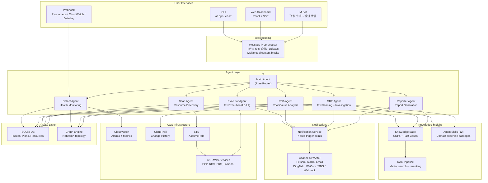
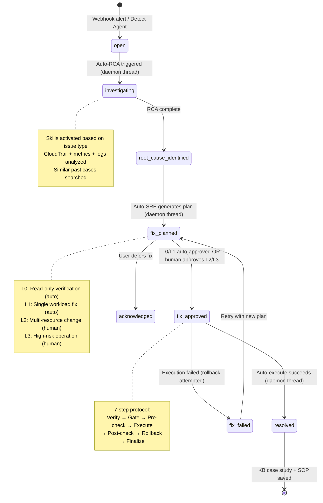
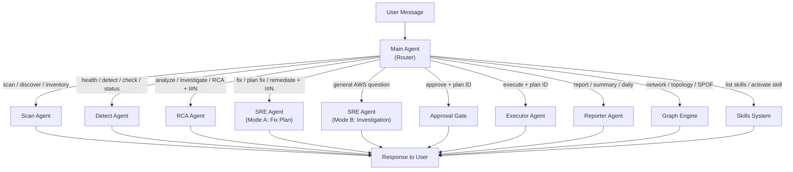
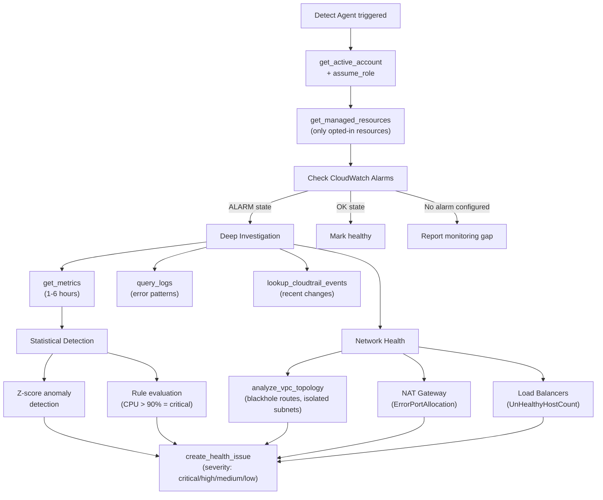
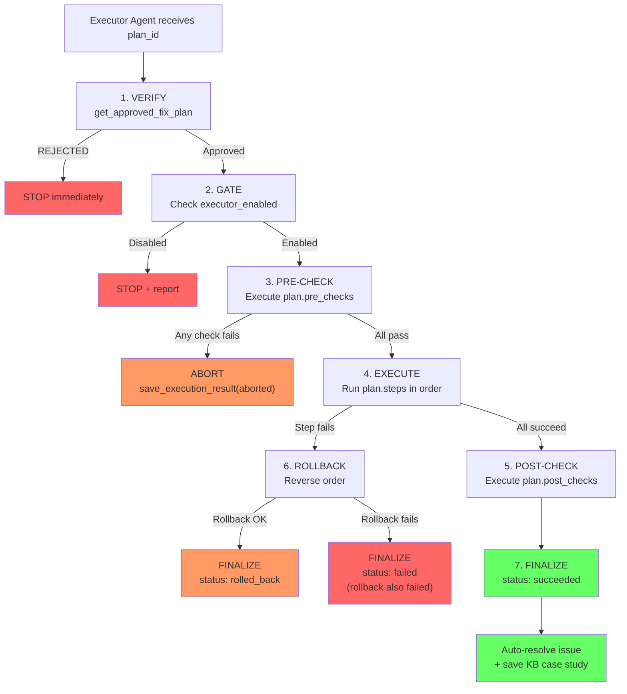
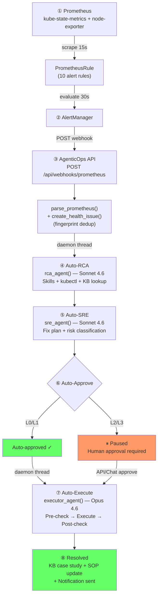
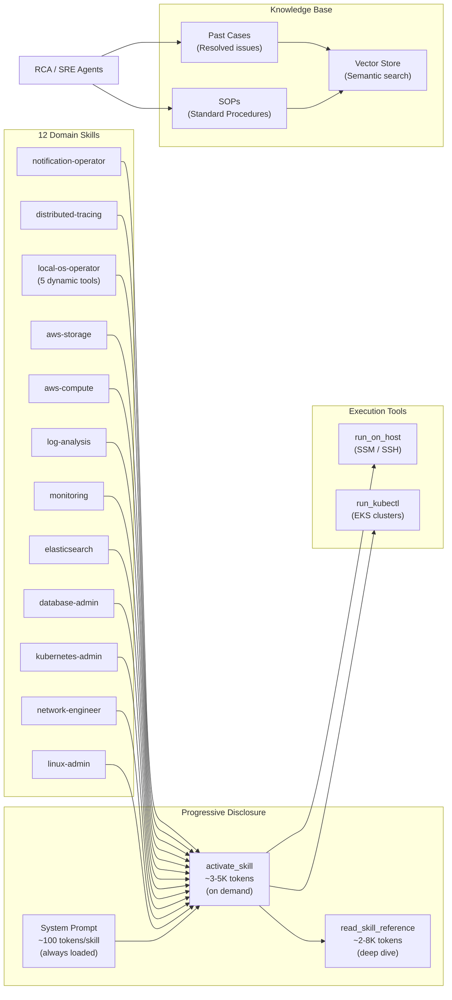
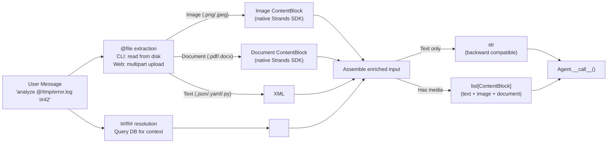

# AgenticOps — Business Workflow & Quick Start Guide

## How It Works (30-Second Overview)

AgenticOps is an AI operations assistant that **scans** your AWS infrastructure, **detects** health issues, performs **root cause analysis**, generates **fix plans**, and optionally **executes** them — all through natural language chat.

```
You: "check health of my prod services"
 └──► Main Agent (router) ──► Detect Agent ──► CloudWatch + metrics + logs
                                                      │
                                            HealthIssue created
                                                      │
You: "analyze I#42"                                   ▼
 └──► Main Agent ──► RCA Agent ──► Skills + CloudTrail + metrics + KB
                                          │
                              Root cause identified (confidence: 0.85)
                                          │
You: "fix I#42"                           ▼
 └──► Main Agent ──► SRE Agent ──► Fix plan generated (L2: resize instance)
                                          │
You: "approve fix plan 7"                 ▼
 └──► Approval gate ──► Plan status: approved
                                          │
You: "execute plan 7"                     ▼
 └──► Main Agent ──► Executor Agent ──► Pre-check → Execute → Post-check
                                          │
                                    Issue resolved ──► KB case study saved
```

---

## Architecture Overview



---

## Core Workflow: Issue Lifecycle



---

## Agent Routing Logic



---

## Detection & Analysis Flow (Detail)



---

## Fix Execution Pipeline (Detail)



---

## Auto-Fix Pipeline (Closed-Loop Remediation)

When alerts arrive via webhook, the entire pipeline runs automatically — no human intervention needed for L0/L1 risk fixes:



**Code path**: `app.py:_process_webhook_alert()` → `rca_service.trigger_auto_rca()` → `pipeline_service.trigger_auto_sre()` → `trigger_auto_approve()` → `trigger_auto_execute()` → `save_execution_result()` → resolved.

**Key settings**:

| Setting | Default | What it controls |
|---------|---------|-----------------|
| `AIOPS_AUTO_RCA_ENABLED` | `true` | Auto-trigger RCA on new HealthIssue |
| `AIOPS_AUTO_FIX_ENABLED` | `true` | Master switch for auto-fix pipeline |
| `AIOPS_EXECUTOR_AUTO_APPROVE_L0_L1` | `true` | Auto-approve low-risk plans |
| `AIOPS_EXECUTOR_ENABLED` | `true` | Enable fix execution |
| `AIOPS_NOTIFICATIONS_ENABLED` | `true` | Auto-notify on pipeline events |

> **See also**: [EKS Lab Auto-Fix Pipeline (Use Case 6)](use-cases/use-case-6-eks-lab-auto-fix-pipeline.md) for validated end-to-end test results.

---

## Skills & Knowledge Base Flow



---

## Chat Preprocessing Pipeline



---

## Quick Tutorials

### Tutorial 1: First Scan — Discover Your AWS Resources

```bash
# 1. Start interactive chat
aiops chat

# 2. Set your AWS account (if not already configured)
/account set prod

# 3. Scan all resources in all regions
scan all resources in all regions

# 4. Or scan specific services/regions
scan EC2 and RDS in us-east-1 and us-west-2

# 5. View results
/resource list
```

**What happens behind the scenes:**

Main Agent → routes to **Scan Agent** → calls `assume_role` → loops through services (`describe_ec2`, `describe_rds`, ...) → saves to SQLite → returns summary.

---

### Tutorial 2: Health Check — Detect Issues

```bash
# Quick health check (alarm-based, fast)
check health of all services

# Deep health check (adds z-score anomaly detection, slower)
run a deep health check on all services in us-east-1

# Check specific resource type
check health of EC2 instances
```

**What happens:**

Main Agent → **Detect Agent** → checks CloudWatch alarms → pulls metrics/logs for alarming resources → runs statistical detection → creates `HealthIssue` records.

**Output:** A severity-sorted table of issues found, with IDs you can reference as `I#N`.

---

### Tutorial 3: Root Cause Analysis

```bash
# Analyze a specific issue (use the I# from detect results)
analyze I#42

# Or describe the problem naturally
investigate the high CPU on i-0abc123def in us-east-1
```

**What happens:**

Main Agent → **RCA Agent** → activates domain skills (e.g., `linux-admin` for EC2) → searches KB for similar cases → checks CloudTrail for recent changes → gathers metrics/logs → synthesizes root cause with confidence score → generates fix recommendations.

**Output:** Root cause summary, confidence score (0.0–1.0), contributing factors, recommended fix.

---

### Tutorial 4: Generate & Execute a Fix Plan

```bash
# Generate a fix plan
generate a fix plan for I#42

# Review it
/fix 7

# Approve the plan (required before execution)
approve fix plan 7

# Execute
execute plan 7
```

**Risk levels determine approval requirements:**

| Level | Risk | Example | Approval |
|-------|------|---------|----------|
| L0 | Read-only | Verify metric recovered | Auto |
| L1 | Single workload | kubectl rollout undo, set resources, delete networkpolicy, scale | Auto |
| L2 | Multi-resource | Resize instance, modify SG rules, multi-namespace changes | **Manual** |
| L3 | High-risk | Service restart, failover, data migration, node drain | **Manual** |

**Execution flow:** Pre-checks → Execute steps → Post-checks → Auto-rollback on failure.

---

### Tutorial 5: Using the Web Dashboard

```bash
# Start the web server
aiops web
# or
uvicorn agenticops.web.app:app --reload --port 8000
```

Open `http://localhost:8000/app/dashboard` and explore:

| Page | What You Can Do |
|------|----------------|
| **Dashboard** | Overview stats, recent issues |
| **Chat** | Same as CLI but with SSE streaming, file upload button, session history |
| **Resources** | Browse all scanned AWS resources with filters |
| **Anomalies** | View health issues, click through to RCA and fix plans |
| **Fix Plans** | Review plans, approve, trigger execution |
| **Network** | Interactive topology graph with SRE analysis (SPOF detection, capacity risk) |
| **Reports** | Generate and view daily/incident/inventory reports |
| **Schedules** | Set up cron-based automated scans/detections |
| **Notifications** | Configure channels (Feishu, Slack, Email, DingTalk, WeCom, Webhook), view logs |
| **Accounts** | Manage AWS accounts (activate, deactivate) |
| **Audit Log** | View all system audit events |

> **See also**: [Web Service Workflow](web_service_workflow.md) — process model, SSE vs WebSocket, Feishu Bot, startup lifecycle.

**Web chat supports file uploads** — click the paperclip icon to attach screenshots (PNG/JPEG) for visual analysis or PDFs/docs for document analysis.

---

### Tutorial 6: Headless Mode (Scripting & Automation)

```bash
# Single-shot query (prints response and exits)
aiops chat "check health of prod"

# Pipe mode (machine-readable output)
echo "list all critical issues" | aiops chat

# With file attachment
aiops chat "analyze this error log @/tmp/error.log"

# With image analysis
aiops chat "what's wrong in this screenshot @/tmp/dashboard.png"

# Control output detail level (-d / --detail)
aiops chat -d concise "quick status of prod"     # ~500 tokens, bullets only
aiops chat -d medium "check health of EC2"        # ~1500 tokens (default)
aiops chat --detail detailed "deep dive on I#42"  # ~4000 tokens, full narrative

# Chain commands in CI/CD
aiops chat "scan EC2 in us-east-1" && \
aiops chat "check health of EC2" && \
aiops chat "generate daily report"
```

**TTY detection:** Rich formatting when running in terminal, plain text when piped.

**Detail levels:** Use `/detail` in interactive mode or `--detail` in headless mode to control how much detail agents return. `concise` gives root cause + bullets only; `medium` (default) adds evidence + recommendations; `detailed` provides full narrative with complete evidence chain.

---

### Tutorial 7: Network Topology & SRE Analysis

```bash
# View VPC topology
show me the network topology for vpc-0abc123

# Find single points of failure
detect single points of failure in vpc-0abc123

# Check capacity risks
analyze capacity risk in vpc-0abc123

# Simulate removing a network link
what happens if I remove the connection between subnet-aaa and nat-gw-bbb?

# Dependency chain (blast radius)
what depends on i-0abc123def?
```

**Web alternative:** Go to the **Network** page, select a VPC, toggle "Enriched" to see compute resources, and use the SRE Analysis panel for SPOF/capacity/dependency analysis.

---

### Tutorial 8: Using Agent Skills

```bash
# List available skills
list available skills

# Skills are auto-activated during RCA/SRE — but you can also ask directly
activate the kubernetes-admin skill and help me debug pod CrashLoopBackOff

# The agent will:
# 1. activate_skill("kubernetes-admin") — loads decision trees
# 2. Follow the decision tree for CrashLoopBackOff
# 3. Use run_kubectl to inspect the pod
# 4. Read references for deep-dive material if needed
```

**Adding your own skill:** See `skills/ADDING_SKILLS.md` — just create a directory with a `SKILL.md` file, no code changes needed.

---

### Tutorial 9: Reference Shortcuts in Chat

```bash
# Reference a health issue by ID
what is the status of I#42?

# Reference an AWS resource by ID
show me details of R#17

# Combine references
compare I#42 with the config of R#17

# Attach a file for context
analyze this error log @/var/log/app/error.log alongside I#42
```

The preprocessor resolves `I#N` and `R#N` references by querying the database and injecting context blocks into the message before the agent sees it.

---

### Tutorial 10: Reports & Scheduled Operations

```bash
# Generate reports
generate a daily report
generate an incident report for critical issues
generate an inventory report for EC2

# View reports
/report list
/report 3

# Set up scheduled automation
/schedule create

# Example schedules (via web dashboard):
# - Daily health check at 8:00 AM
# - Weekly inventory scan on Mondays
# - Hourly critical-issue detection
```

---

### Tutorial 11: Notification Channels & /send_to

```bash
# List configured channels (reads from config/channels.yaml)
/channel list

# Show channel details
/channel show feishu-ops

# Test a channel (sends a test message)
/channel test feishu-ops

# Update channel config (writes to YAML)
/channel set feishu-ops severity_filter critical,high
/channel set slack-incidents enabled true

# Send report to a channel
/send_to feishu-ops #R5

# Send local doc to a channel
/send_to slack-incidents #D3

# Send free text to an IM alias
/send_to ops-team "Production incident resolved"
```

**How it works:**

- `/channel` manages channels defined in `config/channels.yaml` (the sole source of truth)
- `/send_to` resolves target as: NotificationChannel name -> IMAlias name
- Content can be: `#R<id>` (Report), `#D<id>` (LocalDoc), or free text
- Available in CLI, Web chat, and IM bot

**Supported channel types:** Feishu, DingTalk, WeCom, Slack, Email (SES), SNS, Webhook.

**Auto-notifications:** When `AIOPS_NOTIFICATIONS_ENABLED=true`, the pipeline automatically sends notifications at 7 event points (issue created, RCA completed, fix planned, fix approved, execution result, report saved, schedule result).

---

### Tutorial 12: IM Bot (Feishu / DingTalk / WeCom)

```bash
# Start with embedded Feishu bot (default)
uvicorn agenticops.web.app:app --port 8000

# Or run Feishu bot standalone (no web)
python -m agenticops.im.feishu_ws
```

In any IM conversation with the bot, you can use the same natural language as CLI:

```
User: check health of EC2 in us-east-1
Bot:  Found 3 health issues: ...

User: analyze I#42
Bot:  Root cause: memory leak in container...

User: /send_to slack-incidents #R5
Bot:  Report sent to slack-incidents channel
```

**Setup:** Configure IM app credentials in `config/im-apps.yaml` and notification channels in `config/channels.yaml`.

---

## CLI Slash Command Quick Reference

| Command | Purpose |
|---------|---------|
| `/help` | Show all commands |
| `/account list` | List AWS accounts |
| `/account set <name>` | Switch active account |
| `/scan [region\|all]` | Trigger resource scan |
| `/detect [region\|all]` | Trigger health detection |
| `/issues` | List all health issues |
| `/issue <ID>` | Show issue details |
| `/analyze <ID>` | Trigger RCA |
| `/fix list` | List fix plans |
| `/approve <ID>` | Approve fix plan |
| `/execute <ID>` | Execute fix plan |
| `/report list` | List reports |
| `/context set <key> <val>` | Set chat context |
| `/detail [concise\|medium\|detailed]` | Set agent output detail level |
| `/channel list\|show\|test\|set` | Manage notification channels (YAML-backed) |
| `/send_to <target> <content>` | Send content to channel or IM alias |
| `/output json` | Switch to JSON output |
| `/pager auto` | Auto-paginate long output |
| `/exit` | Exit chat |

---

## API Quick Reference (curl)

```bash
BASE=http://localhost:8000/api

# Health check
curl $BASE/health

# Dashboard stats
curl $BASE/stats

# List resources
curl "$BASE/resources?type=ec2&region=us-east-1&limit=20"

# List issues
curl "$BASE/health-issues?severity=critical&status=detected&limit=10"

# Create chat session
curl -X POST $BASE/chat/sessions -H 'Content-Type: application/json' \
  -d '{"title": "My Session"}'

# Send message (SSE stream)
curl -N -X POST $BASE/chat/sessions/{id}/messages \
  -H 'Content-Type: application/json' \
  -d '{"content": "check health of EC2"}'

# Send message with detail level
curl -N -X POST $BASE/chat/sessions/{id}/messages \
  -H 'Content-Type: application/json' \
  -d '{"content": "deep dive on EC2", "detail_level": "detailed"}'

# Upload image for analysis
curl -X POST $BASE/chat/sessions/{id}/messages \
  -F "content=analyze this screenshot" \
  -F "file=@/tmp/dashboard.png"

# Approve fix plan
curl -X PUT $BASE/fix-plans/{id}/approve

# Get network topology
curl "$BASE/graph/vpc/{vpc_id}/enriched?region=us-east-1"

# Detect single points of failure
curl "$BASE/graph/vpc/{vpc_id}/spof?region=us-east-1"

# List notification channels
curl $BASE/notifications/channels

# Test a notification channel
curl -X POST $BASE/notifications/channels/feishu-ops/test

# List IM aliases
curl $BASE/im-aliases

# Submit webhook alert (Prometheus format)
curl -X POST $BASE/webhooks/prometheus -H 'Content-Type: application/json' \
  -d '{"alerts":[{"status":"firing","labels":{"alertname":"KubePodOOMKilled"}}]}'
```

---

## Configuration Quick Reference

All settings use env vars with `AIOPS_` prefix. Set via `.env` file or shell:

```bash
# Core — Tiered Model Configuration
export AIOPS_BEDROCK_MODEL_ID="global.anthropic.claude-sonnet-4-6-v1"          # Default (Sonnet 4.6)
export AIOPS_BEDROCK_MODEL_ID_CHEAP="global.anthropic.claude-haiku-4-5-20251001-v1:0"  # Economy (Haiku 4.5)
export AIOPS_BEDROCK_MODEL_ID_STRONG="global.anthropic.claude-opus-4-6-v1"     # Strong (Opus 4.6)
export AIOPS_BEDROCK_REGION="us-east-1"
export AIOPS_BEDROCK_MAX_TOKENS=16384
export AIOPS_BEDROCK_WINDOW_SIZE=40    # Sliding window conversation manager

# Auto-Fix Pipeline
export AIOPS_EXECUTOR_ENABLED=true              # Enable fix execution (default: true)
export AIOPS_AUTO_RCA_ENABLED=true              # Auto-trigger RCA on new issue (default: true)
export AIOPS_AUTO_FIX_ENABLED=true              # Auto-fix pipeline master switch (default: true)
export AIOPS_EXECUTOR_AUTO_APPROVE_L0_L1=true   # Auto-approve low-risk plans (default: true)
export AIOPS_NOTIFICATIONS_ENABLED=true         # Auto-notify on pipeline events (default: true)

# Features
export AIOPS_SKILLS_ENABLED=true       # Enable agent skills (default: true)
export AIOPS_EMBEDDING_ENABLED=true    # Enable vector embeddings (default: true)
export AIOPS_AGENT_OUTPUT_DETAIL=medium  # Agent output detail: concise, medium, detailed

# Web & Auth
export AIOPS_CORS_ORIGINS="http://localhost:3000,https://myapp.example.com"
export AIOPS_API_AUTH_ENABLED=false     # API key auth middleware (default: false)
export AIOPS_DATABASE_URL="sqlite:///path/to/agenticops.db"

# IM Bot
export AIOPS_FEISHU_WS_ENABLED=true    # Feishu WebSocket long connection (default: true)
```

---

## Closed-Loop Validation

### Running Validation

```bash
# Run all 10 cases sequentially on EKS Lab
cd infra/eks-lab/scenarios
AGENTICOPS_URL=http://localhost:8000 bash run-all-scenarios.sh

# Run individual case
bash case-1-oom/inject.sh && bash case-1-oom/verify.sh

# Run Phase 1 only (Cases 1-3)
AGENTICOPS_URL=http://localhost:8000 bash run-phase1.sh

# Run Phase 2 only (Cases 4-10)
AGENTICOPS_URL=http://localhost:8000 bash run-phase2.sh
```

### Validation Results (2026-03-06)

All 10 cases passed 5/5 on EKS Lab (`agenticops-lab`, ap-southeast-1):

| Case | Scenario | Score | MTTR |
|------|----------|-------|------|
| 1 | OOM Kill (adservice) | 5/5 | 5m 34s |
| 2 | Bad Image (productcatalog) | 5/5 | 6m 38s |
| 3 | Redis Crash (redis-cart) | 5/5 | 7m 3s |
| 4 | Node DiskPressure | 5/5 | 8m 41s |
| 5 | Pod Pending (CPU exhaustion) | 5/5 | 7m 30s |
| 6 | Unhealthy Targets (readiness) | 5/5 | 5m 24s |
| 7 | CoreDNS Down | 5/5 | 4m 42s |
| 8 | PVC Pending (wrong SC) | 5/5 | 6m 38s |
| 9 | HPA Maxed Out | 5/5 | 4m 7s |
| 10 | Service Crash (cartservice) | 5/5 | 6m 24s |

**Acceptance criteria**: auto-fix ≥7/10 ✅, detect ≤3min ✅, resolve ≤10min ✅, cost ≤$3/cycle ✅

### Pipeline Flow Per Case

Each case follows the same 5-step verification:

```
1. HealthIssue detection  → Alert fires → webhook → HealthIssue created
2. Root Cause Analysis    → RCA agent investigates (kubectl, metrics, KB)
3. Fix Plan creation      → SRE agent proposes fix (risk-classified L0-L3)
4. Execution + resolution → Executor runs fix → issue auto-resolved
5. Service recovery       → Verify target resource is healthy
```

### Case Documentation

Each case is documented in `docs/cases/case-N-*.md` with:
- Fault description (type, severity, target)
- Injection script and key commands
- Expected alert flow and pipeline flow
- Expected fix (command, risk level)
- Actual metrics (detection latency, MTTR, cost)
