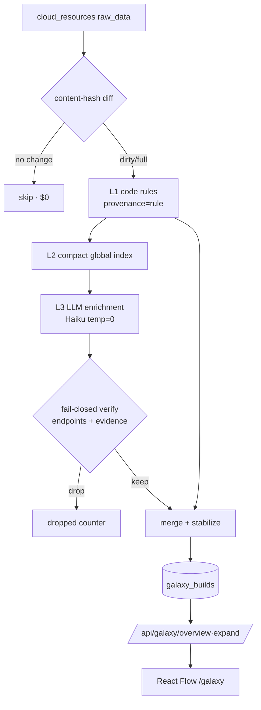

# Galaxy — Resource Relationship Graph (LLM-Hybrid) Implementation Plan

> **For agentic workers:** REQUIRED SUB-SKILL: Use superpowers:subagent-driven-development (recommended) or superpowers:executing-plans to implement this plan task-by-task. Steps use checkbox (`- [ ]`) syntax for tracking.

**Goal:** Build a `/galaxy` route: a draggable, drill-down whole-inventory relationship graph whose mechanical edges (containment, ID references, tag groups) are derived deterministically by code, and whose semantic edges (inferred grouping/relations) are proposed by an LLM analyzing `raw_data` — with every LLM edge passing fail-closed machine verification before entering the graph, and `provenance` tagged on every edge so LLM output can never drive autonomous action.

**Architecture:** A new lightweight, self-contained module `src/agenticops/galaxy/` (independent of the existing `graph/` SPOF engine). Build pipeline is three layers: **L1** code rules over `cloud_resources.raw_data` (free, deterministic, `provenance=rule`); **L2** a code-generated compact global index of all resources; **L3** an LLM enrichment pass (Bedrock Haiku, `temperature=0`) that receives the L2 index as read-only context and proposes semantic edges/groups per ≤40-resource batch, each verified fail-closed (endpoints must exist in inventory; evidence must be re-derivable from `raw_data`) before merge. Builds are content-hash incremental: unchanged resources skip the LLM and carry forward their prior LLM edges, so steady-state hourly checks cost ~$0. The completed build's `rule_graph` + `llm_graph` JSON are persisted; read APIs (`/overview`, `/expand`) merge them and overlay `HealthIssue` status. Frontend is React Flow + dagre.

**Tech Stack:** Python 3.12, SQLAlchemy (sync), FastAPI, pydantic-settings, boto3 Bedrock `converse`, pytest; React 18 + TypeScript + TanStack Query + `@xyflow/react` v12 + `@dagrejs/dagre`; Playwright (E2E).

## Global Constraints

- **Trust model (spec §0, non-negotiable):** every edge carries `provenance ∈ {rule, llm}`. Only `rule` edges may ever drive autonomous action (future). LLM edges are advisory only, rendered dashed in the UI.
- **Fail-closed verification:** an LLM edge is dropped if either endpoint node id is not in the inventory-derived valid-id set, or its `evidence` string cannot be corroborated against the target resource's `raw_data`/`tags`. Dropped edges are counted per build; drop-rate over `galaxy_drop_rate_alert` (default 0.05) logs a WARNING.
- **Node ids are always code-assigned:** resources are `res:{cloud_resources.id}`, groups `grp:{slug}`, accounts `acct:{cloud_accounts.id}`. The LLM may reference existing node ids and propose group slugs (text), but may never mint resource nodes.
- **Cloud-neutral prompts (project rule):** the L3 prompt describes relationship *concepts*; AWS service names appear only as examples. No provider hardcoding in prompt text.
- **Credential rule:** LLM calls use `get_bedrock_boto_session()` (the Bedrock control-plane session — the sanctioned exception in the credential rules). Never `boto3.Session()` directly.
- **Config rule:** `config.py` defines schema + defaults only; every runtime-tunable value also has a line in `config/settings.yaml`. No hardcoded tunables in module code — read from `settings`.
- **Determinism:** `temperature=0` on every LLM call; canonical JSON (`sort_keys=True`) for hashing.
- **All timestamps UTC** (`datetime.now(timezone.utc)`).
- **DB migrations are additive**: new tables are new `Base` subclasses picked up by `Base.metadata.create_all`; no Alembic, no destructive migration.
- Test commands run from repo root: `.venv/bin/python -m pytest tests/<file> -v -p no:cacheprovider`.
- Frontend gate: `cd src/agenticops/web/frontend && npx tsc --noEmit && npm run build` must pass.
- Commit with `git commit --no-verify` (Code Defender hook bypass, per repo policy). **Do not push** until Task 7 E2E passes AND the owner confirms (project rule 主人确认).

---

### Task 1: Backend tables + config schema

**Files:**
- Create: `src/agenticops/galaxy/__init__.py`
- Create: `src/agenticops/galaxy/models.py`
- Modify: `src/agenticops/models.py:1157-1163` (register galaxy tables before `create_all`)
- Modify: `src/agenticops/config.py:454` (add `galaxy_*` fields after the ACP block)
- Modify: `config/settings.yaml` (append galaxy defaults)
- Test: `tests/test_galaxy_models.py`

**Interfaces:**
- Produces (consumed by Tasks 2-5):
  - `agenticops.galaxy.models.GalaxyBuild` — ORM row; columns: `id:int PK`, `status:str` (`running`/`completed`/`failed`), `trigger:str` (`auto`/`manual`/`scan`), `full:bool`, `started_at:datetime`, `finished_at:datetime|None`, `model_id:str`, `prompt_version:str`, `input_tokens:int`, `output_tokens:int`, `cost_usd:float`, `node_count:int`, `edge_count:int`, `dropped_edge_count:int`, `rule_graph:dict` (JSON), `llm_graph:dict` (JSON), `error:str|None`.
  - `agenticops.galaxy.models.GalaxyResourceState` — `id:int PK`, `resource_pk:int` (unique), `content_hash:str`, `last_analyzed_build_id:int|None`.
  - `agenticops.galaxy.models.GalaxyGroup` — `id:int PK`, `slug:str` (unique), `display_name:str`, `kind:str`, `created_by_build:int|None`, `member_count:int`.
  - `settings.galaxy_enabled:bool`, `settings.galaxy_build_interval_minutes:int`, `settings.galaxy_model_id:str`, `settings.galaxy_batch_size:int`, `settings.galaxy_confidence_min:float`, `settings.galaxy_drop_rate_alert:float`, `settings.galaxy_expand_node_cap:int`, `settings.galaxy_llm_exclude_types:list[str]`.

- [ ] **Step 1: Create the galaxy package init**

Create `src/agenticops/galaxy/__init__.py`:

```python
"""Galaxy — whole-inventory resource relationship graph (LLM-hybrid build)."""
```

- [ ] **Step 2: Write the galaxy ORM tables**

Create `src/agenticops/galaxy/models.py`:

```python
"""Galaxy persistence tables. Registered into agenticops.models.Base metadata."""

from datetime import datetime, timezone
from typing import Optional

from sqlalchemy import JSON, Boolean, DateTime, Float, Integer, String, Text, UniqueConstraint
from sqlalchemy.orm import Mapped, mapped_column

from agenticops.models import Base


class GalaxyBuild(Base):
    """One graph build run (rule layer + llm layer stored together, merged on read)."""

    __tablename__ = "galaxy_builds"

    id: Mapped[int] = mapped_column(primary_key=True)
    status: Mapped[str] = mapped_column(String(20), default="running")  # running | completed | failed
    trigger: Mapped[str] = mapped_column(String(20), default="manual")  # auto | manual | scan
    full: Mapped[bool] = mapped_column(Boolean, default=False)
    started_at: Mapped[datetime] = mapped_column(DateTime, default=lambda: datetime.now(timezone.utc))
    finished_at: Mapped[Optional[datetime]] = mapped_column(DateTime, nullable=True)
    model_id: Mapped[str] = mapped_column(String(200), default="")
    prompt_version: Mapped[str] = mapped_column(String(50), default="")
    input_tokens: Mapped[int] = mapped_column(Integer, default=0)
    output_tokens: Mapped[int] = mapped_column(Integer, default=0)
    cost_usd: Mapped[float] = mapped_column(Float, default=0.0)
    node_count: Mapped[int] = mapped_column(Integer, default=0)
    edge_count: Mapped[int] = mapped_column(Integer, default=0)
    dropped_edge_count: Mapped[int] = mapped_column(Integer, default=0)
    rule_graph: Mapped[dict] = mapped_column(JSON, default=dict)  # {"nodes":[...], "edges":[...]}
    llm_graph: Mapped[dict] = mapped_column(JSON, default=dict)   # {"edges":[...]}
    error: Mapped[Optional[str]] = mapped_column(Text, nullable=True)


class GalaxyResourceState(Base):
    """Per-resource content hash for incremental (diff) builds."""

    __tablename__ = "galaxy_resource_state"
    __table_args__ = (UniqueConstraint("resource_pk", name="uq_galaxy_resource_state_pk"),)

    id: Mapped[int] = mapped_column(primary_key=True)
    resource_pk: Mapped[int] = mapped_column(Integer, index=True)
    content_hash: Mapped[str] = mapped_column(String(64), default="")
    last_analyzed_build_id: Mapped[Optional[int]] = mapped_column(Integer, nullable=True)


class GalaxyGroup(Base):
    """Group registry — stable slugs across builds (create-or-match)."""

    __tablename__ = "galaxy_groups"

    id: Mapped[int] = mapped_column(primary_key=True)
    slug: Mapped[str] = mapped_column(String(200), unique=True)
    display_name: Mapped[str] = mapped_column(String(200), default="")
    kind: Mapped[str] = mapped_column(String(30), default="untagged")  # project|system|cluster|stack|untagged
    created_by_build: Mapped[Optional[int]] = mapped_column(Integer, nullable=True)
    member_count: Mapped[int] = mapped_column(Integer, default=0)
```

- [ ] **Step 3: Register galaxy tables before create_all**

In `src/agenticops/models.py`, find the block near line 1157 that reads:

```python
    # Ensure all ORM models are registered in metadata before create_all
```

Immediately below that comment (before `Base.metadata.create_all(engine)` at line 1163), add:

```python
    import agenticops.galaxy.models  # noqa: F401 — register galaxy_* tables in Base metadata
```

- [ ] **Step 4: Add config schema fields**

In `src/agenticops/config.py`, immediately after the `acp_codex_args` field (ends at line 454, before the `file_tools_admin_mode` field at line 456), insert:

```python

    # ── Galaxy (resource relationship graph) ───────────────────────
    galaxy_enabled: bool = Field(
        default=True,
        description="Enable the Galaxy resource graph build pipeline + API (AIOPS_GALAXY_ENABLED)",
    )
    galaxy_build_interval_minutes: int = Field(
        default=60,
        description="Interval for the auto GalaxyBuild schedule (AIOPS_GALAXY_BUILD_INTERVAL_MINUTES)",
    )
    galaxy_model_id: str = Field(
        default="",
        description="Override model for Galaxy LLM enrichment; empty = bedrock_model_id_cheap (AIOPS_GALAXY_MODEL_ID)",
    )
    galaxy_batch_size: int = Field(
        default=40,
        description="Max resources per LLM enrichment batch (AIOPS_GALAXY_BATCH_SIZE)",
    )
    galaxy_confidence_min: float = Field(
        default=0.5,
        description="Minimum confidence to keep an LLM edge (AIOPS_GALAXY_CONFIDENCE_MIN)",
    )
    galaxy_drop_rate_alert: float = Field(
        default=0.05,
        description="LLM-edge drop rate above which a build logs a WARNING (AIOPS_GALAXY_DROP_RATE_ALERT)",
    )
    galaxy_expand_node_cap: int = Field(
        default=200,
        description="Max resource nodes returned by /api/galaxy/expand before truncation (AIOPS_GALAXY_EXPAND_NODE_CAP)",
    )
    galaxy_llm_exclude_types: list[str] = Field(
        default_factory=lambda: ["IAMRole", "KMS", "S3", "ECR_Repository"],
        description="Resource types excluded from LLM enrichment (relationship-sparse leaf types)",
    )
    galaxy_builds_keep: int = Field(
        default=24,
        description="Number of most-recent GalaxyBuild rows to retain; older rows pruned after each "
        "successful build to bound DB growth (each row stores full rule+llm graph blobs). "
        "0 = keep all (AIOPS_GALAXY_BUILDS_KEEP)",
    )
```

- [ ] **Step 5: Add settings.yaml defaults**

Append to `config/settings.yaml`:

```yaml
galaxy_enabled: true
galaxy_build_interval_minutes: 60
galaxy_model_id: ""
galaxy_batch_size: 40
galaxy_confidence_min: 0.5
galaxy_drop_rate_alert: 0.05
galaxy_expand_node_cap: 200
galaxy_llm_exclude_types:
- IAMRole
- KMS
- S3
- ECR_Repository
galaxy_builds_keep: 24
```

- [ ] **Step 6: Write the failing test**

Create `tests/test_galaxy_models.py`:

```python
"""Galaxy tables register in metadata, create cleanly, and round-trip JSON graph columns."""

import pytest

from agenticops.models import Base, get_session
from agenticops.galaxy.models import GalaxyBuild, GalaxyResourceState, GalaxyGroup


@pytest.fixture
def db_session(tmp_path):
    import agenticops.models as models_mod
    from agenticops.config import settings

    models_mod._engine = None
    settings.database_url = f"sqlite:///{tmp_path}/galaxy_models.db"
    engine = models_mod.get_engine()
    Base.metadata.create_all(engine)
    session = get_session()
    yield session
    session.close()
    models_mod._engine = None


def test_galaxy_tables_created(db_session):
    from sqlalchemy import inspect
    names = set(inspect(db_session.get_bind()).get_table_names())
    assert {"galaxy_builds", "galaxy_resource_state", "galaxy_groups"} <= names


def test_build_roundtrips_graph_json(db_session):
    b = GalaxyBuild(
        status="completed", trigger="manual",
        rule_graph={"nodes": [{"id": "res:1"}], "edges": [{"source": "res:1", "target": "res:2"}]},
        llm_graph={"edges": [{"source": "res:1", "target": "grp:x", "provenance": "llm"}]},
        node_count=1, edge_count=2,
    )
    db_session.add(b)
    db_session.commit()
    row = db_session.query(GalaxyBuild).first()
    assert row.rule_graph["nodes"][0]["id"] == "res:1"
    assert row.llm_graph["edges"][0]["provenance"] == "llm"


def test_resource_state_and_group(db_session):
    db_session.add(GalaxyResourceState(resource_pk=42, content_hash="abc"))
    db_session.add(GalaxyGroup(slug="1:project:demo", display_name="demo", kind="project", member_count=3))
    db_session.commit()
    assert db_session.query(GalaxyResourceState).filter_by(resource_pk=42).one().content_hash == "abc"
    assert db_session.query(GalaxyGroup).filter_by(slug="1:project:demo").one().kind == "project"


def test_config_defaults_present():
    from agenticops.config import settings
    assert settings.galaxy_enabled is True
    assert settings.galaxy_batch_size == 40
    assert "IAMRole" in settings.galaxy_llm_exclude_types
    assert settings.galaxy_builds_keep == 24
```

- [ ] **Step 7: Run tests, verify pass**

Run: `.venv/bin/python -m pytest tests/test_galaxy_models.py -v -p no:cacheprovider`
Expected: 4 passed. (If `test_config_defaults_present` fails on `galaxy_batch_size`, confirm Step 4 landed in the `Settings` class body, not after it.)

- [ ] **Step 8: Syntax check + commit**

```bash
.venv/bin/python -m py_compile src/agenticops/galaxy/models.py src/agenticops/models.py src/agenticops/config.py
git add src/agenticops/galaxy/__init__.py src/agenticops/galaxy/models.py src/agenticops/models.py src/agenticops/config.py config/settings.yaml tests/test_galaxy_models.py
git commit --no-verify -m "feat(galaxy): persistence tables + config schema"
```

---

### Task 2: L1 — content hashing + deterministic rule graph

**Files:**
- Create: `src/agenticops/galaxy/hashing.py`
- Create: `src/agenticops/galaxy/rules.py`
- Test: `tests/test_galaxy_hashing.py`
- Test: `tests/test_galaxy_rules.py`

**Interfaces:**
- Consumes: nothing from other tasks (pure functions over plain dicts).
- Produces (consumed by Task 3):
  - `hashing.strip_volatile(obj: Any) -> Any` — recursively drops volatile keys.
  - `hashing.canonical_json(obj: Any) -> str` — sorted-key compact JSON.
  - `hashing.content_hash(resource: dict) -> str` — sha256 hex of canonical(stripped `{resource_type, resource_id, name, tags, raw_data}`).
  - `hashing.compute_diff(prev: dict[int, str], current: dict[int, str]) -> Diff` where `Diff` is a dataclass with `added: set[int]`, `changed: set[int]`, `removed: set[int]`; `dirty` property = `added | changed`.
  - `rules.resource_node_id(pk: int) -> str` → `"res:{pk}"`; `rules.group_node_id(slug: str) -> str` → `"grp:{slug}"`; `rules.account_node_id(account_id: int) -> str` → `"acct:{account_id}"`.
  - `rules.group_slug(account_id: int, kind: str, value: str) -> str` → `"{account_id}:{kind}:{value}"`.
  - `rules.derive_rule_graph(resources: list[dict]) -> dict` → `{"nodes": list[dict], "edges": list[dict], "groups": list[dict]}`. Each resource dict has keys `id, account_id, provider, region, resource_type, resource_id, name, tags, raw_data`.
  - `rules.RELATION_TYPES: frozenset[str]` = `{contains, references, member_of, attached_to, secured_by, routes_to, inferred_group}`.
  - `rules.TAG_GROUP_KEYS: dict[str, str]` = `{"Project": "project", "Environment": "environment", "Env": "environment", "System": "system", "Stack": "stack"}`.

- [ ] **Step 1: Write hashing failing test**

Create `tests/test_galaxy_hashing.py`:

```python
"""Content hashing: stable, volatile-field-insensitive, correct diff."""

from agenticops.galaxy.hashing import strip_volatile, canonical_json, content_hash, compute_diff


def _res(**kw):
    base = {"resource_type": "EC2", "resource_id": "i-1", "name": "web",
            "tags": {"Project": "demo"}, "raw_data": {"State": {"Name": "running"}}}
    base.update(kw)
    return base


def test_canonical_json_key_order_stable():
    assert canonical_json({"b": 1, "a": 2}) == canonical_json({"a": 2, "b": 1})


def test_strip_volatile_removes_timestamps_recursively():
    stripped = strip_volatile({"LaunchTime": "t", "nested": {"AttachTime": "t", "keep": 1}})
    assert "LaunchTime" not in stripped
    assert "AttachTime" not in stripped["nested"]
    assert stripped["nested"]["keep"] == 1


def test_hash_ignores_volatile_fields():
    a = _res(raw_data={"State": {"Name": "running"}, "LaunchTime": "2024-01-01"})
    b = _res(raw_data={"State": {"Name": "running"}, "LaunchTime": "2025-09-09"})
    assert content_hash(a) == content_hash(b)


def test_hash_changes_on_material_field():
    a = _res(raw_data={"State": {"Name": "running"}})
    b = _res(raw_data={"State": {"Name": "stopped"}})
    assert content_hash(a) != content_hash(b)


def test_compute_diff():
    prev = {1: "h1", 2: "h2", 3: "h3"}
    current = {1: "h1", 2: "CHANGED", 4: "h4"}
    d = compute_diff(prev, current)
    assert d.added == {4}
    assert d.changed == {2}
    assert d.removed == {3}
    assert d.dirty == {2, 4}
```

- [ ] **Step 2: Run it, verify import failure**

Run: `.venv/bin/python -m pytest tests/test_galaxy_hashing.py -v -p no:cacheprovider`
Expected: collection/ImportError — `hashing` not found.

- [ ] **Step 3: Implement hashing.py**

Create `src/agenticops/galaxy/hashing.py`:

```python
"""Content-hash incremental build support. Pure functions, no DB."""

import hashlib
import json
from dataclasses import dataclass
from typing import Any

# Fields that change without changing a resource's identity/relationships.
VOLATILE_KEYS = frozenset({
    "LaunchTime", "AttachTime", "CreateTime", "CreatedTime", "createDate",
    "LastModified", "lastModified", "updatedAt", "UpdateTime",
    "AvailableIpAddressCount", "ClientToken", "RequesterId",
})

_HASH_FIELDS = ("resource_type", "resource_id", "name", "tags", "raw_data")


def strip_volatile(obj: Any) -> Any:
    """Return a deep copy of obj with all VOLATILE_KEYS removed at every depth."""
    if isinstance(obj, dict):
        return {k: strip_volatile(v) for k, v in obj.items() if k not in VOLATILE_KEYS}
    if isinstance(obj, list):
        return [strip_volatile(v) for v in obj]
    return obj


def canonical_json(obj: Any) -> str:
    """Deterministic JSON: sorted keys, compact separators, non-ASCII preserved."""
    return json.dumps(obj, sort_keys=True, separators=(",", ":"), ensure_ascii=False, default=str)


def content_hash(resource: dict) -> str:
    """sha256 over the stable subset of a resource, volatile fields stripped."""
    subset = {k: resource.get(k) for k in _HASH_FIELDS}
    return hashlib.sha256(canonical_json(strip_volatile(subset)).encode("utf-8")).hexdigest()


@dataclass
class Diff:
    added: set
    changed: set
    removed: set

    @property
    def dirty(self) -> set:
        return self.added | self.changed


def compute_diff(prev: dict, current: dict) -> Diff:
    """prev/current map resource_pk -> content_hash."""
    prev_keys, cur_keys = set(prev), set(current)
    added = cur_keys - prev_keys
    removed = prev_keys - cur_keys
    changed = {k for k in (cur_keys & prev_keys) if prev[k] != current[k]}
    return Diff(added=added, changed=changed, removed=removed)
```

- [ ] **Step 4: Run hashing tests, verify pass**

Run: `.venv/bin/python -m pytest tests/test_galaxy_hashing.py -v -p no:cacheprovider`
Expected: 5 passed.

- [ ] **Step 5: Write rules failing test**

Create `tests/test_galaxy_rules.py`:

```python
"""L1 rule derivation: containment, ID references, tag grouping, provenance=rule."""

from agenticops.galaxy.rules import derive_rule_graph, resource_node_id, group_node_id, group_slug


def _r(pk, rtype, rid, raw=None, tags=None, account_id=1):
    return {"id": pk, "account_id": account_id, "provider": "aws", "region": "cn-north-1",
            "resource_type": rtype, "resource_id": rid, "name": rid,
            "tags": tags or {}, "raw_data": raw or {}}


def test_node_ids():
    assert resource_node_id(7) == "res:7"
    assert group_node_id("1:project:demo") == "grp:1:project:demo"
    assert group_slug(1, "project", "demo") == "1:project:demo"


def test_account_contains_vpc():
    g = derive_rule_graph([_r(1, "VPC", "vpc-a")])
    edges = g["edges"]
    assert any(e["relation_type"] == "contains" and e["source"] == "acct:1"
               and e["target"] == "res:1" and e["provenance"] == "rule" for e in edges)


def test_vpc_contains_subnet():
    g = derive_rule_graph([
        _r(1, "VPC", "vpc-a"),
        _r(2, "Subnet", "subnet-a", raw={"VpcId": "vpc-a"}),
    ])
    assert any(e["source"] == "res:1" and e["target"] == "res:2"
               and e["relation_type"] == "contains" for e in g["edges"])


def test_subnet_contains_instance_via_nested_id():
    g = derive_rule_graph([
        _r(1, "VPC", "vpc-a"),
        _r(2, "Subnet", "subnet-a", raw={"VpcId": "vpc-a"}),
        _r(3, "EC2", "i-1", raw={"NetworkInterfaces": [{"SubnetId": "subnet-a", "VpcId": "vpc-a"}]}),
    ])
    assert any(e["source"] == "res:2" and e["target"] == "res:3"
               and e["relation_type"] == "contains" for e in g["edges"])


def test_instance_secured_by_group():
    g = derive_rule_graph([
        _r(1, "SecurityGroup", "sg-1", raw={"VpcId": "vpc-a"}),
        _r(2, "EC2", "i-1", raw={"NetworkInterfaces": [{"Groups": [{"GroupId": "sg-1"}]}]}),
    ])
    assert any(e["source"] == "res:2" and e["target"] == "res:1"
               and e["relation_type"] == "secured_by" for e in g["edges"])


def test_tag_grouping_member_of():
    g = derive_rule_graph([_r(1, "EC2", "i-1", tags={"Project": "demo"})])
    assert any(n["id"] == "grp:1:project:demo" and n["kind"] == "group" for n in g["nodes"])
    assert any(e["source"] == "res:1" and e["target"] == "grp:1:project:demo"
               and e["relation_type"] == "member_of" for e in g["edges"])
    assert any(gr["slug"] == "1:project:demo" and gr["kind"] == "project" for g_ in [g] for gr in g_["groups"])


def test_no_self_edges_and_dirty_tags_ignored():
    # A VPC whose raw_data echoes its own VpcId must not self-contain.
    g = derive_rule_graph([_r(1, "VPC", "vpc-a", raw={"VpcId": "vpc-a"}, tags="not-a-dict")])
    assert all(not (e["source"] == e["target"]) for e in g["edges"])
```

- [ ] **Step 6: Run it, verify import failure**

Run: `.venv/bin/python -m pytest tests/test_galaxy_rules.py -v -p no:cacheprovider`
Expected: ImportError — `rules` not found.

- [ ] **Step 7: Implement rules.py**

Create `src/agenticops/galaxy/rules.py`:

```python
"""L1 deterministic edge derivation. Pure function: resource rows -> nodes + edges.

Every edge produced here is provenance=rule with confidence 1.0 — the graph's
factual skeleton, which the LLM layer is never allowed to override.
"""

from typing import Any, Iterator

RELATION_TYPES = frozenset({
    "contains", "references", "member_of", "attached_to",
    "secured_by", "routes_to", "inferred_group",
})

# Tag key -> group kind. Order matters only for display; all matched tags group.
TAG_GROUP_KEYS = {
    "Project": "project", "Environment": "environment", "Env": "environment",
    "System": "system", "Stack": "stack",
}


def resource_node_id(pk: int) -> str:
    return f"res:{pk}"


def group_node_id(slug: str) -> str:
    return f"grp:{slug}"


def account_node_id(account_id: int) -> str:
    return f"acct:{account_id}"


def group_slug(account_id: int, kind: str, value: str) -> str:
    return f"{account_id}:{kind}:{value}"


def _iter_values(obj: Any, key: str) -> Iterator[str]:
    """Yield every string value stored under `key` anywhere in a nested dict/list."""
    if isinstance(obj, dict):
        for k, v in obj.items():
            if k == key and isinstance(v, str):
                yield v
            else:
                yield from _iter_values(v, key)
    elif isinstance(obj, list):
        for item in obj:
            yield from _iter_values(item, key)


def _rule_edge(source: str, target: str, relation_type: str, evidence: str) -> dict:
    return {
        "source": source, "target": target, "relation_type": relation_type,
        "provenance": "rule", "evidence": evidence, "confidence": 1.0,
        "model_id": None, "prompt_version": None,
    }


def _node(resource: dict) -> dict:
    return {
        "id": resource_node_id(resource["id"]), "kind": "resource",
        "resource_type": resource.get("resource_type", ""),
        "name": resource.get("name") or resource.get("resource_id", ""),
        "account_id": resource.get("account_id"),
        "region": resource.get("region", ""),
        "provider": resource.get("provider", ""),
        "resource_id": resource.get("resource_id", ""),
    }


def derive_rule_graph(resources: list) -> dict:
    """Build the deterministic rule layer. Returns {nodes, edges, groups}."""
    # Map cloud resource_id string -> node id (for ID-reference resolution).
    rid_to_node = {r["resource_id"]: resource_node_id(r["id"]) for r in resources}

    nodes: list = []
    edges: list = []
    account_ids: set = set()
    groups: dict = {}  # slug -> {slug, display_name, kind, member_count}

    for r in resources:
        self_node = resource_node_id(r["id"])
        nodes.append(_node(r))
        account_ids.add(r["account_id"])
        raw = r.get("raw_data") if isinstance(r.get("raw_data"), (dict, list)) else {}
        rid = r["resource_id"]
        rtype = r.get("resource_type", "")

        # --- Containment: attach to nearest resolvable parent (subnet > vpc > account) ---
        parent = None
        parent_evidence = ""
        subnet = next((s for s in _iter_values(raw, "SubnetId") if s != rid), None)
        if rtype != "Subnet" and subnet and subnet in rid_to_node and rid_to_node[subnet] != self_node:
            parent, parent_evidence = rid_to_node[subnet], f"raw_data.SubnetId={subnet}"
        if parent is None:
            vpc = next((v for v in _iter_values(raw, "VpcId") if v != rid), None)
            if rtype != "VPC" and vpc and vpc in rid_to_node and rid_to_node[vpc] != self_node:
                parent, parent_evidence = rid_to_node[vpc], f"raw_data.VpcId={vpc}"
        if parent is None:
            parent, parent_evidence = account_node_id(r["account_id"]), "account membership"
        if parent != self_node:
            edges.append(_rule_edge(parent, self_node, "contains", parent_evidence))

        # --- References: security groups guard compute ---
        for gid in sorted({g for g in _iter_values(raw, "GroupId") if g != rid}):
            tgt = rid_to_node.get(gid)
            if tgt and tgt != self_node:
                edges.append(_rule_edge(self_node, tgt, "secured_by", f"raw_data.GroupId={gid}"))

        # --- Tag grouping: member_of ---
        tags = r.get("tags") if isinstance(r.get("tags"), dict) else {}
        for tag_key, kind in TAG_GROUP_KEYS.items():
            val = tags.get(tag_key)
            if isinstance(val, str) and val.strip():
                slug = group_slug(r["account_id"], kind, val.strip())
                gnode = group_node_id(slug)
                g = groups.setdefault(slug, {"slug": slug, "display_name": val.strip(),
                                             "kind": kind, "member_count": 0})
                g["member_count"] += 1
                edges.append(_rule_edge(self_node, gnode, "member_of", f"tags.{tag_key}={val.strip()}"))

    # Account nodes.
    for aid in sorted(account_ids):
        nodes.append({"id": account_node_id(aid), "kind": "account", "account_id": aid,
                      "name": f"account:{aid}", "resource_type": "", "region": "", "provider": ""})
    # Group nodes.
    for slug, g in groups.items():
        nodes.append({"id": group_node_id(slug), "kind": "group", "name": g["display_name"],
                      "group_kind": g["kind"], "member_count": g["member_count"],
                      "resource_type": "", "region": "", "provider": "", "account_id": None})

    return {"nodes": nodes, "edges": edges, "groups": list(groups.values())}
```

- [ ] **Step 8: Run rules tests, verify pass**

Run: `.venv/bin/python -m pytest tests/test_galaxy_rules.py -v -p no:cacheprovider`
Expected: 7 passed.

- [ ] **Step 9: Commit**

```bash
.venv/bin/python -m py_compile src/agenticops/galaxy/hashing.py src/agenticops/galaxy/rules.py
git add src/agenticops/galaxy/hashing.py src/agenticops/galaxy/rules.py tests/test_galaxy_hashing.py tests/test_galaxy_rules.py
git commit --no-verify -m "feat(galaxy): L1 content hashing + deterministic rule graph"
```

---

### Task 3: L3 — LLM enrichment builder (batch, verify, merge, persist)

**Files:**
- Create: `src/agenticops/galaxy/builder.py`
- Test: `tests/test_galaxy_builder.py`

**Interfaces:**
- Consumes: `hashing.content_hash`, `hashing.compute_diff`, `rules.derive_rule_graph`, `rules.resource_node_id`, `rules.RELATION_TYPES`, `settings.galaxy_*`, `GalaxyBuild`/`GalaxyResourceState`, `get_db_session`, `get_bedrock_boto_session`, `compute_cost`.
- Produces (consumed by Tasks 4-5):
  - `builder.build_graph(trigger: str = "manual", full: bool = False) -> int` — synchronous; creates a `GalaxyBuild`, runs the full pipeline, persists, returns the build id. If a build is already `running`, returns its id without starting a new one (no-op guard). If no resources exist, still writes a completed empty build.
  - `builder.PROMPT_VERSION: str` — bumped when the prompt changes (for shadow-build diffing).
  - `builder._call_bedrock(prompt: str, model_id: str, max_tokens: int) -> tuple[str, dict]` — returns `(text, {"input": int, "output": int})`. **Tests monkeypatch this** to avoid live Bedrock.
  - `builder._verify_edges(edges: list[dict], valid_ids: set[str], node_by_id: dict[str, dict], resources_by_node: dict[str, dict]) -> tuple[list[dict], int]` — returns `(kept, dropped_count)`.

- [ ] **Step 1: Write the failing test**

Create `tests/test_galaxy_builder.py`:

```python
"""Builder pipeline: rule graph + verified LLM edges, fail-closed drops, persistence."""

import json
import pytest

from agenticops.models import Base, get_session, get_db_session, CloudAccount, CloudResource
from agenticops.galaxy.models import GalaxyBuild, GalaxyResourceState
from agenticops.galaxy import builder as B


@pytest.fixture
def db(tmp_path):
    import agenticops.models as models_mod
    from agenticops.config import settings
    models_mod._engine = None
    settings.database_url = f"sqlite:///{tmp_path}/galaxy_builder.db"
    engine = models_mod.get_engine()
    Base.metadata.create_all(engine)
    s = get_session()
    yield s
    s.close()
    models_mod._engine = None


@pytest.fixture
def seeded(db):
    acct = CloudAccount(name="acct-a", provider="aws", is_enabled=True)
    db.add(acct)
    db.flush()
    db.add_all([
        CloudResource(account_id=acct.id, provider="aws", region="cn-north-1",
                      resource_type="VPC", resource_id="vpc-a", name="vpc-a",
                      tags={}, raw_data={}),
        CloudResource(account_id=acct.id, provider="aws", region="cn-north-1",
                      resource_type="EC2", resource_id="i-1", name="web",
                      tags={"Purpose": "web"},
                      raw_data={"NetworkInterfaces": [{"VpcId": "vpc-a"}]}),
    ])
    db.commit()
    return acct.id


def test_verify_drops_edge_with_missing_endpoint(db):
    valid = {"res:1", "res:2"}
    edges = [
        {"source": "res:1", "target": "res:999", "relation_type": "references", "evidence": "x", "confidence": 0.9},
    ]
    kept, dropped = B._verify_edges(edges, valid, {}, {})
    assert kept == []
    assert dropped == 1


def test_verify_drops_edge_with_unfounded_evidence(db):
    valid = {"res:1", "res:2"}
    node_by_id = {"res:1": {"id": "res:1"}, "res:2": {"id": "res:2"}}
    resources_by_node = {"res:2": {"raw_data": {"Purpose": "web"}, "tags": {}}}
    edges = [
        # evidence references a value that does not appear in res:2 raw_data/tags -> drop
        {"source": "res:1", "target": "res:2", "relation_type": "inferred_group",
         "evidence": "Project=nonexistent", "confidence": 0.9},
    ]
    kept, dropped = B._verify_edges(edges, valid, node_by_id, resources_by_node)
    assert dropped == 1


def test_verify_keeps_grounded_edge(db):
    valid = {"res:1", "res:2"}
    resources_by_node = {"res:2": {"raw_data": {"Purpose": "web-frontend"}, "tags": {}}}
    edges = [
        {"source": "res:1", "target": "res:2", "relation_type": "inferred_group",
         "evidence": "Purpose=web-frontend", "confidence": 0.9},
    ]
    kept, dropped = B._verify_edges(edges, valid, {}, resources_by_node)
    assert dropped == 0 and len(kept) == 1
    assert kept[0]["provenance"] == "llm"


def test_build_graph_full_pipeline_with_mocked_llm(db, seeded, monkeypatch):
    # LLM proposes one valid grouping edge (grounded) and one hallucinated endpoint (dropped).
    def fake_call(prompt, model_id, max_tokens):
        payload = {"edges": [
            {"source": "res:2", "target": "res:1", "relation_type": "references",
             "evidence": "VpcId=vpc-a", "confidence": 0.95},
            {"source": "res:2", "target": "res:8888", "relation_type": "references",
             "evidence": "made up", "confidence": 0.9},
        ]}
        return json.dumps(payload), {"input": 1000, "output": 200}
    monkeypatch.setattr(B, "_call_bedrock", fake_call)

    build_id = B.build_graph(trigger="manual", full=True)
    assert build_id > 0
    with get_db_session() as s:
        b = s.query(GalaxyBuild).filter_by(id=build_id).one()
        assert b.status == "completed"
        # rule layer present (account contains vpc, vpc contains ec2)
        rule_edges = b.rule_graph["edges"]
        assert any(e["relation_type"] == "contains" for e in rule_edges)
        # one llm edge kept, one dropped
        assert b.dropped_edge_count == 1
        assert all(e["provenance"] == "llm" for e in b.llm_graph["edges"])
        assert len(b.llm_graph["edges"]) == 1
        # resource state persisted for incremental builds
        assert s.query(GalaxyResourceState).count() == 2


def test_incremental_skips_when_no_change(db, seeded, monkeypatch):
    calls = {"n": 0}
    def fake_call(prompt, model_id, max_tokens):
        calls["n"] += 1
        return json.dumps({"edges": []}), {"input": 10, "output": 10}
    monkeypatch.setattr(B, "_call_bedrock", fake_call)

    first = B.build_graph(trigger="manual", full=True)
    n_after_first = calls["n"]
    # Second auto build with no data change -> no new build row, LLM not called again.
    second = B.build_graph(trigger="auto", full=False)
    assert second == first
    assert calls["n"] == n_after_first
```

- [ ] **Step 2: Run it, verify failure**

Run: `.venv/bin/python -m pytest tests/test_galaxy_builder.py -v -p no:cacheprovider`
Expected: ImportError — `builder` not found.

- [ ] **Step 3: Implement builder.py**

Create `src/agenticops/galaxy/builder.py`:

```python
"""Galaxy build pipeline: diff -> L1 rules -> L2 index -> L3 LLM enrichment
-> fail-closed verification -> merge/stabilize -> persist.

Runs synchronously (call inside a background task / thread). Concurrency guard:
a single 'running' GalaxyBuild row acts as the lock — a second call is a no-op.
"""

import json
import logging
import re
from datetime import datetime, timezone

from agenticops.config import settings, get_bedrock_boto_session
from agenticops.cost import compute_cost
from agenticops.models import get_db_session, CloudResource
from agenticops.galaxy.models import GalaxyBuild, GalaxyResourceState, GalaxyGroup
from agenticops.galaxy import hashing
from agenticops.galaxy import rules

logger = logging.getLogger(__name__)

PROMPT_VERSION = "galaxy-v1"


def _model_id() -> str:
    return settings.galaxy_model_id or settings.bedrock_model_id_cheap


def _load_resources(session) -> list:
    """Load all cloud resources as plain dicts (detached from ORM)."""
    out = []
    for r in session.query(CloudResource).all():
        out.append({
            "id": r.id, "account_id": r.account_id, "provider": r.provider,
            "region": r.region, "resource_type": r.resource_type,
            "resource_id": r.resource_id, "name": r.name or r.resource_id,
            "tags": r.tags if isinstance(r.tags, dict) else {},
            "raw_data": r.raw_data if isinstance(r.raw_data, dict) else {},
        })
    return out


def _compact_index(resources: list) -> str:
    """L2 global index: one compact line per resource (~40 tok), given to every batch."""
    lines = []
    for r in resources:
        tags = r["tags"]
        tag_str = ",".join(f"{k}={v}" for k, v in list(tags.items())[:6]) if isinstance(tags, dict) else ""
        lines.append(f"{rules.resource_node_id(r['id'])} {r['resource_type']} name={r['name']} tags=[{tag_str}]")
    return "\n".join(lines)


def _batches(resources: list, size: int) -> list:
    """Locality batches: group by (account_id, region) then chunk to <= size."""
    from collections import defaultdict
    buckets = defaultdict(list)
    for r in resources:
        buckets[(r["account_id"], r["region"])].append(r)
    out = []
    for items in buckets.values():
        for i in range(0, len(items), size):
            out.append(items[i:i + size])
    return out


def _build_prompt(focus: list, global_index: str) -> str:
    """Cloud-neutral extraction prompt. Relation types are a closed enum; free text
    is only allowed in `evidence`. AWS names appear as examples only."""
    focus_json = json.dumps([
        {"node_id": rules.resource_node_id(r["id"]), "type": r["resource_type"],
         "name": r["name"], "tags": r["tags"], "raw_data": r["raw_data"]}
        for r in focus
    ], ensure_ascii=False, default=str)
    allowed = ", ".join(sorted(rules.RELATION_TYPES))
    return f"""You are analyzing cloud infrastructure inventory to infer SEMANTIC relationships
that are not already expressed by explicit id references. Examples of semantic links:
resources that belong to the same logical system/project/stack even without a shared tag;
a workload node and the data store it clearly serves.

You are given a GLOBAL INDEX of every resource (read-only context), then a FOCUS BATCH to analyze.

Rules you MUST follow:
- Only emit edges whose `source` and `target` are node_ids that appear in the GLOBAL INDEX. Never invent node ids.
- `relation_type` MUST be one of: {allowed}. Prefer `inferred_group` for logical grouping.
- Every edge MUST include an `evidence` string quoting the concrete field/value you relied on
  (e.g. "Purpose=web-frontend" or "name shares prefix payments-"). If you cannot ground it, do not emit it.
- `confidence` is a float 0..1.
- Do NOT re-derive containment or explicit id references (the system already has those).
- Respond with ONLY a JSON object: {{"edges": [{{"source","target","relation_type","evidence","confidence"}}]}}. No prose, no fences.

GLOBAL INDEX:
{global_index}

FOCUS BATCH:
{focus_json}
"""


def _call_bedrock(prompt: str, model_id: str, max_tokens: int) -> tuple:
    """One Bedrock converse call. Returns (text, {"input","output"}). temperature=0."""
    client = get_bedrock_boto_session().client("bedrock-runtime")
    resp = client.converse(
        modelId=model_id,
        messages=[{"role": "user", "content": [{"text": prompt}]}],
        inferenceConfig={"maxTokens": max_tokens, "temperature": 0},
    )
    text = resp["output"]["message"]["content"][0]["text"]
    usage = resp.get("usage", {})
    return text, {"input": int(usage.get("inputTokens", 0)), "output": int(usage.get("outputTokens", 0))}


def _parse_llm_edges(text: str) -> list:
    """Tolerant JSON extraction: strip fences, grab the first {...} object."""
    t = text.strip()
    if t.startswith("```"):
        t = t.split("\n", 1)[1] if "\n" in t else t
        if t.endswith("```"):
            t = t.rsplit("```", 1)[0]
    m = re.search(r"\{.*\}", t, re.DOTALL)
    if not m:
        return []
    try:
        data = json.loads(m.group(0))
    except json.JSONDecodeError:
        logger.warning("galaxy: could not parse LLM output as JSON")
        return []
    edges = data.get("edges", [])
    return edges if isinstance(edges, list) else []


def _evidence_grounded(evidence: str, resource: dict) -> bool:
    """The claimed evidence value must actually appear in the target's raw_data/tags."""
    if not isinstance(evidence, str) or not evidence.strip():
        return False
    haystack = hashing.canonical_json({"raw_data": resource.get("raw_data", {}),
                                       "tags": resource.get("tags", {})}).lower()
    # Extract the value after '=' if present, else use the whole string token.
    value = evidence.split("=", 1)[1] if "=" in evidence else evidence
    value = value.strip().strip('"').strip("'").lower()
    return bool(value) and value in haystack


def _verify_edges(edges: list, valid_ids: set, node_by_id: dict, resources_by_node: dict) -> tuple:
    """Fail-closed: endpoints must exist; evidence must be grounded in the target; confidence gate.
    Returns (kept_edges, dropped_count). Kept edges are tagged provenance=llm."""
    kept, dropped = [], 0
    seen = set()
    for e in edges:
        src, tgt = e.get("source"), e.get("target")
        rtype = e.get("relation_type")
        conf = float(e.get("confidence", 0) or 0)
        if src not in valid_ids or tgt not in valid_ids or src == tgt:
            dropped += 1
            continue
        if rtype not in rules.RELATION_TYPES:
            dropped += 1
            continue
        if conf < settings.galaxy_confidence_min:
            dropped += 1
            continue
        target_res = resources_by_node.get(tgt)
        if target_res is not None and not _evidence_grounded(e.get("evidence", ""), target_res):
            dropped += 1
            continue
        key = (src, tgt, rtype)
        if key in seen:
            continue
        seen.add(key)
        kept.append({
            "source": src, "target": tgt, "relation_type": rtype,
            "provenance": "llm", "evidence": str(e.get("evidence", ""))[:500],
            "confidence": conf, "model_id": _model_id(), "prompt_version": PROMPT_VERSION,
        })
    return kept, dropped


def _running_build_id(session) -> int:
    row = session.query(GalaxyBuild).filter_by(status="running").order_by(GalaxyBuild.id.desc()).first()
    return row.id if row else 0


def _latest_completed(session) -> GalaxyBuild:
    return (session.query(GalaxyBuild).filter_by(status="completed")
            .order_by(GalaxyBuild.id.desc()).first())


def build_graph(trigger: str = "manual", full: bool = False) -> int:
    """Run one build. Returns build id (or an existing running/latest id on no-op)."""
    # --- Concurrency guard + diff decision (short transaction) ---
    with get_db_session() as s:
        running = _running_build_id(s)
        if running:
            logger.info("galaxy: build already running (%s); skipping", running)
            return running
        resources = _load_resources(s)
        current_hashes = {r["id"]: hashing.content_hash(r) for r in resources}
        prev_rows = {row.resource_pk: row.content_hash for row in s.query(GalaxyResourceState).all()}
        diff = hashing.compute_diff(prev_rows, current_hashes)
        latest = _latest_completed(s)
        if not full and latest is not None and not diff.dirty and not diff.removed:
            logger.info("galaxy: no resource changes; skipping build")
            return latest.id
        prev_llm_edges = list(latest.llm_graph.get("edges", [])) if latest else []
        # Open the build row (acts as the lock).
        build = GalaxyBuild(status="running", trigger=trigger, full=full,
                            model_id=_model_id(), prompt_version=PROMPT_VERSION,
                            started_at=datetime.now(timezone.utc))
        s.add(build)
        s.flush()
        build_id = build.id

    # --- Heavy work outside the lock transaction ---
    try:
        rule_graph = rules.derive_rule_graph(resources)
        valid_ids = {n["id"] for n in rule_graph["nodes"]}
        node_by_id = {n["id"]: n for n in rule_graph["nodes"]}
        resources_by_node = {rules.resource_node_id(r["id"]): r for r in resources}

        # Which resources need LLM analysis this run?
        exclude = set(settings.galaxy_llm_exclude_types)
        candidates = [r for r in resources if r["resource_type"] not in exclude]
        dirty_pks = current_hashes.keys() if full else diff.dirty
        focus_pool = [r for r in candidates if (full or r["id"] in dirty_pks)]

        global_index = _compact_index(resources)
        max_tokens = settings.bedrock_max_tokens
        in_tok = out_tok = 0
        fresh_llm_edges: list = []
        total_dropped = 0

        for batch in _batches(focus_pool, settings.galaxy_batch_size):
            prompt = _build_prompt(batch, global_index)
            text, usage = _call_bedrock(prompt, _model_id(), max_tokens)
            in_tok += usage["input"]
            out_tok += usage["output"]
            proposed = _parse_llm_edges(text)
            kept, dropped = _verify_edges(proposed, valid_ids, node_by_id, resources_by_node)
            fresh_llm_edges.extend(kept)
            total_dropped += dropped

        # Carry forward prior LLM edges for resources NOT re-analyzed this run.
        if not full:
            dirty_nodes = {rules.resource_node_id(pk) for pk in dirty_pks}
            removed_nodes = {rules.resource_node_id(pk) for pk in diff.removed}
            for e in prev_llm_edges:
                if e["source"] in dirty_nodes or e["target"] in dirty_nodes:
                    continue  # will be re-proposed by fresh pass
                if e["source"] in removed_nodes or e["target"] in removed_nodes:
                    continue  # endpoint gone
                if e["source"] in valid_ids and e["target"] in valid_ids:
                    fresh_llm_edges.append(e)

        # Dedup carried + fresh by identity key.
        merged, seen = [], set()
        for e in fresh_llm_edges:
            k = (e["source"], e["target"], e["relation_type"])
            if k not in seen:
                seen.add(k)
                merged.append(e)

        drop_rate = total_dropped / max(1, total_dropped + len(merged))
        if drop_rate > settings.galaxy_drop_rate_alert:
            logger.warning("galaxy: LLM edge drop rate %.1f%% exceeds alert threshold", drop_rate * 100)

        cost = compute_cost(_model_id(), {"input": in_tok, "output": out_tok})

        with get_db_session() as s:
            _persist_groups(s, rule_graph["groups"], build_id)
            _persist_state(s, current_hashes, diff.removed, build_id)
            b = s.query(GalaxyBuild).filter_by(id=build_id).one()
            b.status = "completed"
            b.finished_at = datetime.now(timezone.utc)
            b.rule_graph = {"nodes": rule_graph["nodes"], "edges": rule_graph["edges"]}
            b.llm_graph = {"edges": merged}
            b.node_count = len(rule_graph["nodes"])
            b.edge_count = len(rule_graph["edges"]) + len(merged)
            b.dropped_edge_count = total_dropped
            b.input_tokens = in_tok
            b.output_tokens = out_tok
            b.cost_usd = cost
        logger.info("galaxy: build %s completed — %d nodes, %d edges, %d dropped, $%.4f",
                    build_id, len(rule_graph["nodes"]), len(rule_graph["edges"]) + len(merged),
                    total_dropped, cost)
        return build_id
    except Exception as e:
        logger.exception("galaxy: build %s failed", build_id)
        with get_db_session() as s:
            b = s.query(GalaxyBuild).filter_by(id=build_id).first()
            if b:
                b.status = "failed"
                b.finished_at = datetime.now(timezone.utc)
                b.error = str(e)[:2000]
        return build_id


def _persist_groups(session, groups: list, build_id: int) -> None:
    """Create-or-match group registry rows (stable slugs across builds)."""
    for g in groups:
        row = session.query(GalaxyGroup).filter_by(slug=g["slug"]).first()
        if row is None:
            session.add(GalaxyGroup(slug=g["slug"], display_name=g["display_name"],
                                    kind=g["kind"], created_by_build=build_id,
                                    member_count=g["member_count"]))
        else:
            row.member_count = g["member_count"]
            row.display_name = g["display_name"]


def _persist_state(session, current_hashes: dict, removed: set, build_id: int) -> None:
    existing = {row.resource_pk: row for row in session.query(GalaxyResourceState).all()}
    for pk, h in current_hashes.items():
        row = existing.get(pk)
        if row is None:
            session.add(GalaxyResourceState(resource_pk=pk, content_hash=h, last_analyzed_build_id=build_id))
        else:
            row.content_hash = h
            row.last_analyzed_build_id = build_id
    for pk in removed:
        if pk in existing:
            session.delete(existing[pk])
```

- [ ] **Step 4: Run builder tests, verify pass**

Run: `.venv/bin/python -m pytest tests/test_galaxy_builder.py -v -p no:cacheprovider`
Expected: 5 passed. (If `test_incremental_skips_when_no_change` fails, verify the diff short-circuit at the top of `build_graph` returns `latest.id` before opening a new build row.)

- [ ] **Step 5: Commit**

```bash
.venv/bin/python -m py_compile src/agenticops/galaxy/builder.py
git add src/agenticops/galaxy/builder.py tests/test_galaxy_builder.py
git commit --no-verify -m "feat(galaxy): L3 LLM enrichment builder with fail-closed verification"
```

---

### Task 4: Read API — rebuild / status / overview / expand

**Files:**
- Create: `src/agenticops/galaxy/api.py`
- Modify: `src/agenticops/web/app.py:264` (include the galaxy router after the cost router)
- Test: `tests/test_galaxy_api.py`

**Interfaces:**
- Consumes: `builder.build_graph`, `GalaxyBuild`, `settings.galaxy_*`, `HealthIssue`, `CloudResource`, `CloudAccount`.
- Produces (consumed by Task 6 frontend):
  - `agenticops.galaxy.api.router` — `APIRouter(prefix="/api/galaxy", tags=["galaxy"])`.
  - `POST /api/galaxy/rebuild?full=<bool>` → `202 {"build_id": int}`; `409 {"detail": "..."}` if a build is running. The blocking `build_graph` runs via `await asyncio.to_thread(...)` so it never blocks the event loop, but the endpoint still awaits completion so the returned id is the finished build.
  - `GET /api/galaxy/status` → `{"build": {...} | null, "next_check_minutes": int}`; build fields: `id, status, trigger, full, started_at, finished_at, node_count, edge_count, dropped_edge_count, cost_usd, error`.
  - `GET /api/galaxy/overview` → `{"nodes": [account+group nodes with health rollup + counts], "edges": [group-level edges], "build_id": int|null}`.
  - `GET /api/galaxy/expand?group=<node_id>&types=<csv>&health=<worst|all>` → `{"nodes": [resource nodes in group, health-colored], "edges": [rule+llm edges among them, with provenance], "truncated": bool}`.
- Health status per resource node: `health ∈ {healthy, warning, critical}` from open `HealthIssue` severity (critical→critical, high/medium→warning, else healthy). Group nodes roll up to their worst member state and carry `open_issues:int`.

- [ ] **Step 1: Write the failing test**

Create `tests/test_galaxy_api.py`:

```python
"""Galaxy API contract: rebuild mutex, status shape, overview/expand + health overlay."""

import json
import pytest
from starlette.testclient import TestClient

from agenticops.models import Base, get_session, get_db_session, CloudAccount, CloudResource, HealthIssue
from agenticops.galaxy.models import GalaxyBuild
from agenticops.galaxy import builder as B
from agenticops.web.app import app


@pytest.fixture
def client(tmp_path, monkeypatch):
    import agenticops.models as models_mod
    from agenticops.config import settings
    models_mod._engine = None
    settings.database_url = f"sqlite:///{tmp_path}/galaxy_api.db"
    engine = models_mod.get_engine()
    Base.metadata.create_all(engine)

    def fake_call(prompt, model_id, max_tokens):
        return json.dumps({"edges": []}), {"input": 10, "output": 10}
    monkeypatch.setattr(B, "_call_bedrock", fake_call)

    s = get_session()
    acct = CloudAccount(name="acct-a", provider="aws", is_enabled=True)
    s.add(acct); s.flush()
    s.add_all([
        CloudResource(account_id=acct.id, provider="aws", region="cn-north-1",
                      resource_type="VPC", resource_id="vpc-a", name="vpc-a",
                      tags={"Project": "demo"}, raw_data={}),
        CloudResource(account_id=acct.id, provider="aws", region="cn-north-1",
                      resource_type="EC2", resource_id="i-1", name="web",
                      tags={"Project": "demo"}, raw_data={"NetworkInterfaces": [{"VpcId": "vpc-a"}]}),
    ])
    s.add(HealthIssue(resource_id="i-1", severity="critical", source="manual",
                      title="down", description="d", status="open"))
    s.commit(); s.close()
    yield TestClient(app)
    models_mod._engine = None


def test_status_empty_then_rebuild(client):
    r = client.get("/api/galaxy/status")
    assert r.status_code == 200
    assert r.json()["build"] is None

    r = client.post("/api/galaxy/rebuild", params={"full": True})
    assert r.status_code == 202
    bid = r.json()["build_id"]
    assert bid > 0

    r = client.get("/api/galaxy/status")
    body = r.json()["build"]
    assert body["status"] == "completed"
    assert body["node_count"] >= 3  # account + vpc + ec2 (+ group)


def test_rebuild_conflict_when_running(client):
    with get_db_session() as s:
        s.add(GalaxyBuild(status="running", trigger="manual"))
    r = client.post("/api/galaxy/rebuild")
    assert r.status_code == 409


def test_overview_has_account_and_group_nodes(client):
    client.post("/api/galaxy/rebuild", params={"full": True})
    r = client.get("/api/galaxy/overview")
    assert r.status_code == 200
    kinds = {n["kind"] for n in r.json()["nodes"]}
    assert "account" in kinds and "group" in kinds


def test_expand_group_health_and_provenance(client):
    client.post("/api/galaxy/rebuild", params={"full": True})
    r = client.get("/api/galaxy/expand", params={"group": "grp:1:project:demo"})
    assert r.status_code == 200
    body = r.json()
    node_ids = {n["id"] for n in body["nodes"]}
    assert "res:2" in node_ids  # the EC2
    ec2 = next(n for n in body["nodes"] if n["id"] == "res:2")
    assert ec2["health"] == "critical"  # from the open critical HealthIssue on i-1
    assert body["truncated"] is False
    assert all("provenance" in e for e in body["edges"])
```

- [ ] **Step 2: Run it, verify failure**

Run: `.venv/bin/python -m pytest tests/test_galaxy_api.py -v -p no:cacheprovider`
Expected: 404s / router missing.

- [ ] **Step 3: Implement api.py**

Create `src/agenticops/galaxy/api.py`:

```python
"""Galaxy read/rebuild API. Reads the latest completed build's stored graph and
overlays live HealthIssue status. Mounted at /api/galaxy."""

import asyncio
from typing import Optional

from fastapi import APIRouter, Query, Response

from agenticops.config import settings
from agenticops.models import get_db_session, CloudResource, HealthIssue
from agenticops.galaxy.models import GalaxyBuild
from agenticops.galaxy import builder

router = APIRouter(prefix="/api/galaxy", tags=["galaxy"])

_SEVERITY_HEALTH = {"critical": "critical", "high": "warning", "medium": "warning", "low": "healthy"}
_HEALTH_RANK = {"healthy": 0, "warning": 1, "critical": 2}


def _health_by_resource_id() -> dict:
    """resource_id (cloud string) -> worst health among open issues."""
    out: dict = {}
    with get_db_session() as s:
        rows = s.query(HealthIssue.resource_id, HealthIssue.severity).filter(
            HealthIssue.status != "resolved").all()
    for rid, sev in rows:
        h = _SEVERITY_HEALTH.get((sev or "").lower(), "healthy")
        if _HEALTH_RANK[h] > _HEALTH_RANK.get(out.get(rid, "healthy"), 0):
            out[rid] = h
    return out


def _latest_completed(s) -> Optional[GalaxyBuild]:
    return (s.query(GalaxyBuild).filter_by(status="completed")
            .order_by(GalaxyBuild.id.desc()).first())


def _build_dict(b: GalaxyBuild) -> dict:
    return {
        "id": b.id, "status": b.status, "trigger": b.trigger, "full": b.full,
        "started_at": b.started_at.isoformat() if b.started_at else None,
        "finished_at": b.finished_at.isoformat() if b.finished_at else None,
        "node_count": b.node_count, "edge_count": b.edge_count,
        "dropped_edge_count": b.dropped_edge_count, "cost_usd": b.cost_usd,
        "input_tokens": b.input_tokens, "output_tokens": b.output_tokens,
        "error": b.error,
    }


@router.post("/rebuild")
async def rebuild(response: Response, full: bool = Query(False)):
    with get_db_session() as s:
        running = s.query(GalaxyBuild).filter_by(status="running").first()
        if running:
            response.status_code = 409
            return {"detail": f"build {running.id} already running"}
    # build_graph is fully blocking (sqlite + blocking Bedrock converse). This is an
    # async endpoint, so run it in a worker thread to avoid freezing the event loop
    # (matches the codebase pattern, e.g. app.py `await asyncio.to_thread(...)`).
    # Awaiting the result keeps the returned id = the actual completed build, which the
    # tests rely on; the single 'running' row guards against overlap.
    build_id = await asyncio.to_thread(builder.build_graph, "manual", full)
    response.status_code = 202
    return {"build_id": build_id}


@router.get("/status")
async def status():
    with get_db_session() as s:
        latest = (s.query(GalaxyBuild).order_by(GalaxyBuild.id.desc()).first())
        build = _build_dict(latest) if latest else None
    return {"build": build, "next_check_minutes": settings.galaxy_build_interval_minutes}


def _resource_ids_by_node(s) -> dict:
    """node_id -> cloud resource_id string (for health join)."""
    return {f"res:{r.id}": r.resource_id for r in s.query(CloudResource.id, CloudResource.resource_id).all()}


@router.get("/overview")
async def overview():
    with get_db_session() as s:
        latest = _latest_completed(s)
        if latest is None:
            return {"nodes": [], "edges": [], "build_id": None}
        rule = latest.rule_graph or {}
        nodes = rule.get("nodes", [])
        edges = rule.get("edges", [])
        node_res_id = _resource_ids_by_node(s)
    health = _health_by_resource_id()

    # Each resource counts toward its ACCOUNT (exactly one, from the node's own
    # account_id) AND every GROUP it is a member_of (zero or more). Do NOT use a
    # single containment parent — a resource nested under a VPC still belongs to
    # its account and tag-groups, so single-parent bucketing loses those counts.
    groups_of: dict = {}  # resource node id -> set of group node ids
    for e in edges:
        if e["relation_type"] == "member_of" and e["target"].startswith("grp:"):
            groups_of.setdefault(e["source"], set()).add(e["target"])

    top_nodes = [n for n in nodes if n["kind"] in ("account", "group")]
    counts: dict = {n["id"]: {"resource_count": 0, "open_issues": 0, "health": "healthy",
                              "types": {}} for n in top_nodes}

    def _bump(container_id: str, node: dict, h: str) -> None:
        c = counts.get(container_id)
        if c is None:
            return
        c["resource_count"] += 1
        c["types"][node["resource_type"]] = c["types"].get(node["resource_type"], 0) + 1
        if h != "healthy":
            c["open_issues"] += 1
        if _HEALTH_RANK[h] > _HEALTH_RANK[c["health"]]:
            c["health"] = h

    for n in nodes:
        if n["kind"] != "resource":
            continue
        h = health.get(node_res_id.get(n["id"]), "healthy")
        if n.get("account_id") is not None:
            _bump(f"acct:{n['account_id']}", n, h)
        for gnode in groups_of.get(n["id"], ()):
            _bump(gnode, n, h)

    out_nodes = []
    for n in top_nodes:
        c = counts[n["id"]]
        out_nodes.append({**n, "resource_count": c["resource_count"], "open_issues": c["open_issues"],
                          "health": c["health"], "types": c["types"]})
    # Group-level edges among top nodes only (account contains group is implicit; keep empty for PoC overview).
    return {"nodes": out_nodes, "edges": [], "build_id": latest.id}


@router.get("/expand")
async def expand(group: str = Query(...), types: Optional[str] = None, health: str = "all"):
    type_filter = {t for t in (types or "").split(",") if t} or None
    with get_db_session() as s:
        latest = _latest_completed(s)
        if latest is None:
            return {"nodes": [], "edges": [], "truncated": False}
        rule = latest.rule_graph or {}
        llm_edges = (latest.llm_graph or {}).get("edges", [])
        nodes = rule.get("nodes", [])
        rule_edges = rule.get("edges", [])
        node_res_id = _resource_ids_by_node(s)
    health_map = _health_by_resource_id()

    # Members of the requested group/account.
    member_ids = set()
    for e in rule_edges:
        if e["source"] == group and e["relation_type"] == "contains" and e["target"].startswith("res:"):
            member_ids.add(e["target"])
        if e["target"] == group and e["relation_type"] == "member_of":
            member_ids.add(e["source"])

    node_by_id = {n["id"]: n for n in nodes}
    members = []
    for nid in member_ids:
        n = node_by_id.get(nid)
        if not n:
            continue
        if type_filter and n["resource_type"] not in type_filter:
            continue
        rid = node_res_id.get(nid)
        h = health_map.get(rid, "healthy")
        if health == "worst" and h == "healthy":
            continue
        members.append({**n, "health": h})

    # Truncate by open-issue priority (unhealthy first), then name.
    cap = settings.galaxy_expand_node_cap
    truncated = len(members) > cap
    members.sort(key=lambda m: (-_HEALTH_RANK[m["health"]], m["name"]))
    members = members[:cap]
    kept_ids = {m["id"] for m in members}

    out_edges = [e for e in (rule_edges + llm_edges)
                 if e["source"] in kept_ids and e["target"] in kept_ids]
    return {"nodes": members, "edges": out_edges, "truncated": truncated}
```

- [ ] **Step 4: Mount the router**

In `src/agenticops/web/app.py`, immediately after the cost router block (line 263-264):

```python
from agenticops.web.routers import cost as _cost_router
app.include_router(_cost_router.router)
```

add:

```python
from agenticops.galaxy.api import router as _galaxy_router
app.include_router(_galaxy_router)
```

- [ ] **Step 5: Run API tests, verify pass**

Run: `.venv/bin/python -m pytest tests/test_galaxy_api.py -v -p no:cacheprovider`
Expected: 4 passed.

- [ ] **Step 6: Commit**

```bash
.venv/bin/python -m py_compile src/agenticops/galaxy/api.py src/agenticops/web/app.py
git add src/agenticops/galaxy/api.py src/agenticops/web/app.py tests/test_galaxy_api.py
git commit --no-verify -m "feat(galaxy): read API — rebuild/status/overview/expand + health overlay"
```

---

### Task 5: Scheduler integration — GalaxyBuild pipeline + post-scan hook + auto schedule

**Files:**
- Modify: `src/agenticops/scheduler/scheduler.py:336-346` (early-branch GalaxyBuild in `_execute_schedule_by_info`)
- Modify: `src/agenticops/web/app.py:1642-1667` (post-scan hook)
- Modify: `src/agenticops/web/app.py:3458-3459` (add "GalaxyBuild" to pipeline options)
- Modify: `src/agenticops/web/app.py:143-150` (seed auto schedule in lifespan, scheduler-elected worker only)
- Test: `tests/test_galaxy_scheduler.py`

**Interfaces:**
- Consumes: `builder.build_graph`, `settings.galaxy_enabled`, `settings.galaxy_build_interval_minutes`, `Scheduler.add_schedule`, `Scheduler.list_schedules`.
- Produces: pipeline name `"GalaxyBuild"` runnable via scheduler; a `background_tasks`-triggered incremental build after `/api/scan`; an auto-seeded recurring schedule `galaxy-auto-build`.

- [ ] **Step 1: Write the failing test**

Create `tests/test_galaxy_scheduler.py`:

```python
"""GalaxyBuild is dispatchable via the scheduler and the post-scan hook is wired."""

import json
import pytest


@pytest.fixture
def db(tmp_path, monkeypatch):
    import agenticops.models as models_mod
    from agenticops.config import settings
    from agenticops.models import Base
    models_mod._engine = None
    settings.database_url = f"sqlite:///{tmp_path}/galaxy_sched.db"
    engine = models_mod.get_engine()
    Base.metadata.create_all(engine)
    yield
    models_mod._engine = None


def test_galaxy_build_dispatch_calls_builder(db, monkeypatch):
    called = {}
    from agenticops.scheduler.scheduler import Scheduler
    import agenticops.galaxy.builder as B

    def fake_build(trigger="manual", full=False):
        called["trigger"] = trigger
        return 7
    monkeypatch.setattr(B, "build_graph", fake_build)

    sched = Scheduler()
    sched._execute_schedule_by_info({
        "id": 1, "name": "galaxy-auto-build", "pipeline_name": "GalaxyBuild",
        "account_name": None, "config": {},
    })
    assert called.get("trigger") == "auto"


def test_pipeline_options_include_galaxy(db, monkeypatch):
    from starlette.testclient import TestClient
    from agenticops.web.app import app
    r = TestClient(app).get("/api/schedules/pipeline-options")
    assert "GalaxyBuild" in r.json()["pipelines"]
```

- [ ] **Step 2: Run it, verify failure**

Run: `.venv/bin/python -m pytest tests/test_galaxy_scheduler.py -v -p no:cacheprovider`
Expected: `test_galaxy_build_dispatch_calls_builder` fails (Unknown pipeline: GalaxyBuild) and options test fails.

- [ ] **Step 3: Early-branch GalaxyBuild in the scheduler**

In `src/agenticops/scheduler/scheduler.py`, find the AgentChain early-return block (lines 337-346). Immediately **after** that block (after the `return` at line 346, before `try:` at 348), insert:

```python
        # GalaxyBuild: whole-inventory graph build — account-agnostic, run once.
        if pipeline_name == "GalaxyBuild":
            from agenticops.galaxy.builder import build_graph
            try:
                build_id = build_graph(trigger="auto", full=False)
                with get_db_session() as session:
                    execution = session.query(ScheduleExecution).filter_by(id=execution_id).first()
                    if execution:
                        execution.status = "completed"
                        execution.completed_at = datetime.now(timezone.utc)
                        execution.result = {"pipeline": "GalaxyBuild", "build_id": build_id}
            except Exception as e:
                logger.error(f"GalaxyBuild schedule '{schedule_name}' failed: {e}")
                with get_db_session() as session:
                    execution = session.query(ScheduleExecution).filter_by(id=execution_id).first()
                    if execution:
                        execution.status = "failed"
                        execution.completed_at = datetime.now(timezone.utc)
                        execution.error = str(e)
            return
```

- [ ] **Step 4: Add GalaxyBuild to pipeline options**

In `src/agenticops/web/app.py`, in `api_pipeline_options` (line 3459), change:

```python
        "pipelines": ["FullScan", "Monitoring", "DailyReport", "HealthPatrol", "AgentChain"],
```

to:

```python
        "pipelines": ["FullScan", "Monitoring", "DailyReport", "HealthPatrol", "GalaxyBuild", "AgentChain"],
```

- [ ] **Step 5: Wire the post-scan hook**

In `src/agenticops/web/app.py`, change the scan endpoint signature (line 1643) from:

```python
async def api_trigger_scan(req: ScanRequest):
```

to:

```python
async def api_trigger_scan(req: ScanRequest, background_tasks: BackgroundTasks):
```

Then, immediately before `return {` (line 1651), insert:

```python
    # Post-scan hook: kick an incremental Galaxy build (guarded no-op if one is running).
    if settings.galaxy_enabled:
        from agenticops.galaxy.builder import build_graph
        background_tasks.add_task(build_graph, "scan", False)
```

Verify `BackgroundTasks` is imported at the top of app.py; if not, add `BackgroundTasks` to the existing `from fastapi import ...` line.

- [ ] **Step 6: Seed the auto schedule in lifespan**

In `src/agenticops/web/app.py`, inside the `if _is_scheduler_worker:` block (after `scheduler_instance.start()` at line 147, before the `else:` at 149), insert:

```python
        if settings.galaxy_enabled:
            try:
                from agenticops.scheduler.scheduler import Scheduler as _Sched, Schedule as _Schedule
                # Read names inside a live session — Scheduler.list_schedules() returns
                # ORM objects from a closed session, so `.name` on them raises
                # DetachedInstanceError (expire_on_commit=True). Query names directly.
                with get_db_session() as _s:
                    _existing = {row.name for row in _s.query(_Schedule).all()}
                if "galaxy-auto-build" not in _existing:
                    _mins = max(1, settings.galaxy_build_interval_minutes)
                    # Build a cron that reflects the configured interval:
                    #  <60  -> every _mins minutes (best with divisors of 60);
                    #  >=60 -> minute 0 of every (_mins // 60) hours.
                    if _mins < 60:
                        _cron = f"*/{_mins} * * * *"
                    else:
                        _cron = f"0 */{max(1, _mins // 60)} * * *"
                    _Sched.add_schedule(
                        name="galaxy-auto-build", pipeline_name="GalaxyBuild",
                        cron_expression=_cron, config={},
                    )
                    logger.info("galaxy: seeded auto-build schedule (cron=%s, interval=%d min)", _cron, _mins)
            except Exception:
                logger.debug("galaxy: auto schedule seed skipped", exc_info=True)
```

Note: `get_db_session` is already imported in app.py (used throughout). `_Schedule` is the `Schedule` ORM class exported from `scheduler.scheduler`.

- [ ] **Step 7: Run scheduler tests, verify pass**

Run: `.venv/bin/python -m pytest tests/test_galaxy_scheduler.py -v -p no:cacheprovider`
Expected: 2 passed.

- [ ] **Step 8: Regression — scan endpoint still works**

Run: `.venv/bin/python -m pytest tests/test_galaxy_api.py tests/test_galaxy_scheduler.py -v -p no:cacheprovider`
Expected: all pass. Then syntax-check:
`.venv/bin/python -m py_compile src/agenticops/scheduler/scheduler.py src/agenticops/web/app.py`

- [ ] **Step 9: Commit**

```bash
git add src/agenticops/scheduler/scheduler.py src/agenticops/web/app.py tests/test_galaxy_scheduler.py
git commit --no-verify -m "feat(galaxy): scheduler GalaxyBuild pipeline + post-scan hook + auto schedule"
```

---

### Task 6: Frontend — /galaxy page (React Flow), hooks, nav, i18n

**Files:**
- Modify: `src/agenticops/web/frontend/package.json` (add `@xyflow/react`, `@dagrejs/dagre`)
- Modify: `src/agenticops/web/frontend/src/api/types.ts` (Galaxy types)
- Create: `src/agenticops/web/frontend/src/hooks/useGalaxy.ts`
- Create: `src/agenticops/web/frontend/src/lib/galaxyLayout.ts`
- Create: `src/agenticops/web/frontend/src/pages/Galaxy.tsx`
- Modify: `src/agenticops/web/frontend/src/App.tsx` (lazy import + route)
- Modify: `src/agenticops/web/frontend/src/components/layout/NavItems.tsx` (nav entry + icon)
- Modify: `src/agenticops/web/frontend/src/components/layout/NavPreviewCard.tsx` (galaxy summary)
- Modify: `src/agenticops/web/frontend/src/locales/zh.json` + `en.json` (nav.galaxy + galaxy.*)

**Interfaces:**
- Consumes: `GET/POST /api/galaxy/*` (Task 4). `apiFetch<T>(path)` (BASE_URL `/api`), `useLocale()`, `slideInRight` keyframe.
- Produces: route `/app/galaxy`; nav entry `galaxy`.

- [ ] **Step 1: Add dependencies**

In `src/agenticops/web/frontend/package.json`, add to `dependencies` (keep alphabetical near the other `@` scopes):

```json
    "@dagrejs/dagre": "^2.0.4",
    "@xyflow/react": "^12.10.1",
```

Then install:

```bash
cd src/agenticops/web/frontend && npm install
```

- [ ] **Step 2: Add API types**

Append to `src/agenticops/web/frontend/src/api/types.ts`:

```typescript
export type GalaxyHealth = "healthy" | "warning" | "critical";

export interface GalaxyNode {
  id: string;
  kind: "account" | "group" | "resource";
  name: string;
  resource_type?: string;
  region?: string;
  provider?: string;
  account_id?: number | null;
  resource_count?: number;
  open_issues?: number;
  health?: GalaxyHealth;
  types?: Record<string, number>;
  group_kind?: string;
  member_count?: number;
}

export interface GalaxyEdge {
  source: string;
  target: string;
  relation_type: string;
  provenance: "rule" | "llm";
  evidence?: string;
  confidence?: number;
}

export interface GalaxyBuildInfo {
  id: number;
  status: "running" | "completed" | "failed";
  trigger: string;
  full: boolean;
  started_at: string | null;
  finished_at: string | null;
  node_count: number;
  edge_count: number;
  dropped_edge_count: number;
  cost_usd: number;
  input_tokens: number;
  output_tokens: number;
  error: string | null;
}

export interface GalaxyStatus {
  build: GalaxyBuildInfo | null;
  next_check_minutes: number;
}

export interface GalaxyOverview {
  nodes: GalaxyNode[];
  edges: GalaxyEdge[];
  build_id: number | null;
}

export interface GalaxyExpand {
  nodes: GalaxyNode[];
  edges: GalaxyEdge[];
  truncated: boolean;
}
```

- [ ] **Step 3: Add hooks**

Create `src/agenticops/web/frontend/src/hooks/useGalaxy.ts`:

```typescript
import { useMutation, useQuery, useQueryClient } from "@tanstack/react-query";
import { apiFetch } from "@/api/client";
import type { GalaxyStatus, GalaxyOverview, GalaxyExpand } from "@/api/types";

export function useGalaxyStatus() {
  return useQuery({
    queryKey: ["galaxy-status"],
    queryFn: () => apiFetch<GalaxyStatus>("/galaxy/status"),
    refetchInterval: (q) =>
      q.state.data?.build?.status === "running" ? 5_000 : 60_000,
  });
}

export function useGalaxyOverview() {
  return useQuery({
    queryKey: ["galaxy-overview"],
    queryFn: () => apiFetch<GalaxyOverview>("/galaxy/overview"),
    staleTime: 30_000,
  });
}

export function useGalaxyExpand(group: string | null, types: string[], worstOnly: boolean) {
  const params = new URLSearchParams();
  if (group) params.set("group", group);
  if (types.length) params.set("types", types.join(","));
  params.set("health", worstOnly ? "worst" : "all");
  return useQuery({
    queryKey: ["galaxy-expand", group, types.join(","), worstOnly],
    queryFn: () => apiFetch<GalaxyExpand>(`/galaxy/expand?${params.toString()}`),
    enabled: !!group,
  });
}

export function useGalaxyRebuild() {
  const qc = useQueryClient();
  return useMutation({
    mutationFn: (full: boolean) =>
      apiFetch<{ build_id: number }>(`/galaxy/rebuild?full=${full}`, { method: "POST" }),
    onSuccess: () => {
      qc.invalidateQueries({ queryKey: ["galaxy-status"] });
      qc.invalidateQueries({ queryKey: ["galaxy-overview"] });
      qc.invalidateQueries({ queryKey: ["galaxy-expand"] });
    },
  });
}
```

- [ ] **Step 4: Add the dagre layout helper**

Create `src/agenticops/web/frontend/src/lib/galaxyLayout.ts`:

```typescript
import dagre from "@dagrejs/dagre";
import type { Node, Edge } from "@xyflow/react";

const NODE_W = 180;
const NODE_H = 56;

/** Left-to-right dagre layout. Returns nodes with computed x/y positions. */
export function layoutGraph(nodes: Node[], edges: Edge[]): Node[] {
  const g = new dagre.graphlib.Graph();
  g.setDefaultEdgeLabel(() => ({}));
  g.setGraph({ rankdir: "LR", nodesep: 40, ranksep: 90 });

  nodes.forEach((n) => g.setNode(n.id, { width: NODE_W, height: NODE_H }));
  edges.forEach((e) => g.setEdge(e.source, e.target));
  dagre.layout(g);

  return nodes.map((n) => {
    const pos = g.node(n.id);
    return { ...n, position: { x: pos.x - NODE_W / 2, y: pos.y - NODE_H / 2 } };
  });
}
```

- [ ] **Step 5: Build the Galaxy page**

Create `src/agenticops/web/frontend/src/pages/Galaxy.tsx`:

```tsx
import { useCallback, useEffect, useMemo, useState } from "react";
import { useNavigate } from "react-router-dom";
import {
  ReactFlow, ReactFlowProvider, Background, Controls, MarkerType,
  applyNodeChanges, type Node, type Edge, type NodeChange,
} from "@xyflow/react";
import "@xyflow/react/dist/style.css";
import { useLocale } from "@/i18n/LocaleContext";
import {
  useGalaxyStatus, useGalaxyOverview, useGalaxyExpand, useGalaxyRebuild,
} from "@/hooks/useGalaxy";
import { layoutGraph } from "@/lib/galaxyLayout";
import type { GalaxyNode, GalaxyEdge } from "@/api/types";

const HEALTH_BORDER: Record<string, string> = {
  healthy: "#3f3f46", warning: "#f59e0b", critical: "#ef4444",
};

function toFlow(nodes: GalaxyNode[], edges: GalaxyEdge[]): { nodes: Node[]; edges: Edge[] } {
  const fNodes: Node[] = nodes.map((n) => ({
    id: n.id,
    data: { label: n.kind === "resource" ? `${n.resource_type}\n${n.name}`
                    : `${n.name}${n.resource_count != null ? ` (${n.resource_count})` : ""}`, raw: n },
    position: { x: 0, y: 0 },
    style: {
      border: `2px solid ${HEALTH_BORDER[n.health ?? "healthy"]}`,
      borderRadius: 8, padding: 6, fontSize: 11, whiteSpace: "pre-line",
      background: n.kind === "group" ? "#1e293b" : n.kind === "account" ? "#0f172a" : "#18181b",
      color: "#e4e4e7", width: 180,
    },
  }));
  const fEdges: Edge[] = edges.map((e, i) => ({
    id: `${e.source}-${e.target}-${e.relation_type}-${i}`,
    source: e.source, target: e.target,
    label: e.relation_type,
    animated: e.provenance === "llm",
    style: { stroke: e.provenance === "llm" ? "#a78bfa" : "#52525b",
             strokeDasharray: e.provenance === "llm" ? "6 4" : undefined },
    markerEnd: { type: MarkerType.ArrowClosed },
    data: { raw: e },
  }));
  return { nodes: layoutGraph(fNodes, fEdges), edges: fEdges };
}

function GalaxyInner() {
  const { t } = useLocale();
  const navigate = useNavigate();
  const status = useGalaxyStatus();
  const overview = useGalaxyOverview();
  const rebuild = useGalaxyRebuild();

  const [expandedGroup, setExpandedGroup] = useState<string | null>(null);
  const [worstOnly, setWorstOnly] = useState(false);
  const expand = useGalaxyExpand(expandedGroup, [], worstOnly);

  const [nodes, setNodes] = useState<Node[]>([]);
  const [edges, setEdges] = useState<Edge[]>([]);
  const [selected, setSelected] = useState<GalaxyNode | null>(null);

  // Overview or expanded view feeds the canvas.
  const graph = useMemo(() => {
    if (expandedGroup && expand.data) return toFlow(expand.data.nodes, expand.data.edges);
    if (overview.data) return toFlow(overview.data.nodes, overview.data.edges);
    return { nodes: [], edges: [] };
  }, [expandedGroup, expand.data, overview.data]);

  useEffect(() => { setNodes(graph.nodes); setEdges(graph.edges); }, [graph]);

  const onNodesChange = useCallback((c: NodeChange[]) => setNodes((n) => applyNodeChanges(c, n)), []);

  const onNodeClick = useCallback((_: unknown, node: Node) => {
    setSelected((node.data as { raw: GalaxyNode }).raw);
  }, []);
  const onNodeDoubleClick = useCallback((_: unknown, node: Node) => {
    const raw = (node.data as { raw: GalaxyNode }).raw;
    if (raw.kind === "group" || raw.kind === "account") {
      setExpandedGroup((cur) => (cur === raw.id ? null : raw.id));
    }
  }, []);

  useEffect(() => {
    const onKey = (e: KeyboardEvent) => { if (e.key === "Escape") setSelected(null); };
    window.addEventListener("keydown", onKey);
    return () => window.removeEventListener("keydown", onKey);
  }, []);

  const b = status.data?.build;
  return (
    <div className="relative h-full w-full">
      {/* Build status bar */}
      <div className="absolute top-0 left-0 right-0 z-10 flex items-center gap-3 px-4 py-2
                      bg-card/90 border-b border-border text-xs text-muted-foreground">
        <span className="font-medium text-foreground">{t("nav.galaxy")}</span>
        {b ? (
          <span>
            {b.status === "running" ? t("galaxy.building")
              : `${t("galaxy.builtNodes")}: ${b.node_count} · ${t("galaxy.edges")}: ${b.edge_count} · $${b.cost_usd.toFixed(4)} · ${t("galaxy.dropped")}: ${b.dropped_edge_count}`}
          </span>
        ) : <span>{t("galaxy.noBuild")}</span>}
        {b?.status === "failed" && <span className="text-red-400">{b.error}</span>}
        <span className="ml-auto">{t("galaxy.nextCheck")}: {status.data?.next_check_minutes}m</span>
        {expandedGroup && (
          <button className="px-2 py-1 rounded bg-accent hover:bg-accent/70"
                  onClick={() => setExpandedGroup(null)}>{t("galaxy.backToOverview")}</button>
        )}
        <label className="flex items-center gap-1">
          <input type="checkbox" checked={worstOnly} onChange={(e) => setWorstOnly(e.target.checked)} />
          {t("galaxy.worstOnly")}
        </label>
        <button className="px-2 py-1 rounded bg-primary/20 text-primary hover:bg-primary/30 disabled:opacity-50"
                disabled={rebuild.isPending || b?.status === "running"}
                onClick={() => rebuild.mutate(true)}>{t("galaxy.rebuild")}</button>
      </div>

      {expand.data?.truncated && (
        <div className="absolute top-10 left-1/2 -translate-x-1/2 z-10 px-3 py-1 rounded
                        bg-amber-500/20 text-amber-300 text-xs">{t("galaxy.truncated")}</div>
      )}

      <div className="h-full w-full pt-9">
        {overview.data && overview.data.nodes.length === 0 && !expandedGroup ? (
          <div className="flex h-full items-center justify-center text-muted-foreground text-sm">
            {t("galaxy.empty")}
          </div>
        ) : (
          <ReactFlow nodes={nodes} edges={edges} onNodesChange={onNodesChange}
                     onNodeClick={onNodeClick} onNodeDoubleClick={onNodeDoubleClick} fitView>
            <Background />
            <Controls />
          </ReactFlow>
        )}
      </div>

      {/* Detail panel (house rule: slideInRight + ESC) */}
      {selected && (
        <div className="absolute top-9 right-0 bottom-0 w-80 z-20 bg-card border-l border-border
                        p-4 overflow-y-auto animate-[slideInRight_0.2s_ease-out]">
          <div className="flex items-center justify-between mb-2">
            <h3 className="font-medium text-foreground text-sm">{selected.name}</h3>
            <button className="text-muted-foreground hover:text-foreground" onClick={() => setSelected(null)}>✕</button>
          </div>
          {selected.kind === "resource" ? (
            <div className="space-y-2 text-xs text-muted-foreground">
              <div>{t("galaxy.type")}: {selected.resource_type}</div>
              <div>{t("galaxy.region")}: {selected.region}</div>
              <div>{t("galaxy.health")}: {selected.health}</div>
              <button className="mt-2 px-2 py-1 rounded bg-accent hover:bg-accent/70 text-foreground"
                      onClick={() => navigate(`/app/resources/${selected.id.replace("res:", "")}`)}>
                {t("galaxy.openResource")}
              </button>
            </div>
          ) : (
            <div className="space-y-2 text-xs text-muted-foreground">
              <div>{t("galaxy.resources")}: {selected.resource_count}</div>
              <div>{t("galaxy.openIssues")}: {selected.open_issues}</div>
              <div>{t("galaxy.health")}: {selected.health}</div>
              {selected.types && (
                <div>{Object.entries(selected.types).map(([k, v]) => `${k}:${v}`).join("  ")}</div>
              )}
            </div>
          )}
        </div>
      )}
    </div>
  );
}

export default function Galaxy() {
  return (
    <ReactFlowProvider>
      <GalaxyInner />
    </ReactFlowProvider>
  );
}
```

- [ ] **Step 6: Register the route**

In `src/agenticops/web/frontend/src/App.tsx`, after the `SkillDetail` lazy import (line 21) add:

```tsx
const Galaxy = lazy(() => import("@/pages/Galaxy"));
```

Then, after the `skills/:name` route block (closes at line 163, before the closing `</Route>` at line 164) add:

```tsx
            <Route
              path="galaxy"
              element={
                <Suspense fallback={<Spinner />}>
                  <Galaxy />
                </Suspense>
              }
            />
```

- [ ] **Step 7: Add the nav entry + icon**

In `src/agenticops/web/frontend/src/components/layout/NavItems.tsx`, add to the `NAV_ITEMS` array (after the `skills` entry, line 17):

```tsx
  { id: "galaxy", to: "/app/galaxy", icon: "galaxy", labelKey: "nav.galaxy", end: false },
```

And add to `ICON_PATHS` (after `puzzle`, line 27):

```tsx
  galaxy: "M12 2a10 10 0 100 20 10 10 0 000-20zm0 4a6 6 0 016 6M12 8a4 4 0 00-4 4m4-2a2 2 0 100 4 2 2 0 000-4z",
```

- [ ] **Step 8: Add the nav preview summary**

In `src/agenticops/web/frontend/src/components/layout/NavPreviewCard.tsx`, add a branch inside the summary `if/else if` chain (after the `skills` branch, before the closing of the chain):

```tsx
  } else if (id === "galaxy") {
    const ov = qc.getQueryData<{ nodes: unknown[] }>(["galaxy-overview"]);
    if (ov && Array.isArray(ov.nodes)) summary = `${ov.nodes.length} groups`;
```

- [ ] **Step 9: Add i18n keys**

In `src/agenticops/web/frontend/src/locales/en.json`, after `"nav.skills"` (line 9) add `"nav.galaxy": "Galaxy",` and add a galaxy block (anywhere valid, e.g. after the nav keys):

```json
  "galaxy.building": "Building…",
  "galaxy.builtNodes": "Nodes",
  "galaxy.edges": "Edges",
  "galaxy.dropped": "Dropped",
  "galaxy.noBuild": "No build yet — click Rebuild",
  "galaxy.nextCheck": "Next check",
  "galaxy.rebuild": "Rebuild",
  "galaxy.backToOverview": "Back to overview",
  "galaxy.worstOnly": "Issues only",
  "galaxy.truncated": "Showing top nodes (truncated)",
  "galaxy.empty": "No resources — run a scan first",
  "galaxy.type": "Type",
  "galaxy.region": "Region",
  "galaxy.health": "Health",
  "galaxy.openResource": "Open resource",
  "galaxy.resources": "Resources",
  "galaxy.openIssues": "Open issues"
```

In `src/agenticops/web/frontend/src/locales/zh.json`, after `"nav.skills"` (line 9) add `"nav.galaxy": "全景图",` and:

```json
  "galaxy.building": "构建中…",
  "galaxy.builtNodes": "节点",
  "galaxy.edges": "关系",
  "galaxy.dropped": "丢弃",
  "galaxy.noBuild": "尚无构建 — 点击重建",
  "galaxy.nextCheck": "下次检查",
  "galaxy.rebuild": "重建",
  "galaxy.backToOverview": "返回全景",
  "galaxy.worstOnly": "仅看有问题",
  "galaxy.truncated": "仅显示重点节点（已截断）",
  "galaxy.empty": "暂无资源 — 请先扫描",
  "galaxy.type": "类型",
  "galaxy.region": "区域",
  "galaxy.health": "健康",
  "galaxy.openResource": "打开资源",
  "galaxy.resources": "资源数",
  "galaxy.openIssues": "未处理问题"
```

Note: keep JSON valid — add a trailing comma to the line you insert after, and ensure the last key in each block has no trailing comma if it is the final entry before `}`.

- [ ] **Step 10: Typecheck + build**

Run:

```bash
cd src/agenticops/web/frontend && npx tsc --noEmit && npm run build
```

Expected: no TS errors, build succeeds. (If `applyNodeChanges`/`NodeChange` types mismatch, confirm `@xyflow/react` resolved to v12 in `node_modules/@xyflow/react/package.json`.)

- [ ] **Step 11: Commit**

```bash
cd /Users/malibo/MyDev/AgenticOps
git add src/agenticops/web/frontend/package.json src/agenticops/web/frontend/package-lock.json \
        src/agenticops/web/frontend/src/api/types.ts \
        src/agenticops/web/frontend/src/hooks/useGalaxy.ts \
        src/agenticops/web/frontend/src/lib/galaxyLayout.ts \
        src/agenticops/web/frontend/src/pages/Galaxy.tsx \
        src/agenticops/web/frontend/src/App.tsx \
        src/agenticops/web/frontend/src/components/layout/NavItems.tsx \
        src/agenticops/web/frontend/src/components/layout/NavPreviewCard.tsx \
        src/agenticops/web/frontend/src/locales/zh.json \
        src/agenticops/web/frontend/src/locales/en.json
git commit --no-verify -m "feat(galaxy): frontend /galaxy page — React Flow graph, drill-down, health overlay"
```

---

### Task 7: E2E test + documentation

**Files:**
- Create: `tests/test_galaxy_e2e.py`
- Create: `src/agenticops/web/frontend/e2e/galaxy.spec.ts` (Playwright UI walkthrough — manual/CI-optional)
- Modify: `docs/WORKFLOW.md` (add a Galaxy section)
- Modify: `CLAUDE.md` (add galaxy module + config rows)

**Interfaces:**
- Consumes: everything from Tasks 1-6.
- Produces: a deterministic full-stack API E2E (Bedrock mocked) that is the CI gate; a documented Playwright UI checklist for the owner-confirmation gate.

- [ ] **Step 1: Write the API-level E2E**

Create `tests/test_galaxy_e2e.py`:

```python
"""Galaxy end-to-end (API surface, Bedrock mocked): seed -> rebuild -> status
-> overview -> drill-down expand -> provenance + health overlay + incremental."""

import json
import pytest
from starlette.testclient import TestClient

from agenticops.models import Base, get_session, get_db_session, CloudAccount, CloudResource, HealthIssue
from agenticops.galaxy import builder as B
from agenticops.web.app import app


@pytest.fixture
def client(tmp_path, monkeypatch):
    import agenticops.models as models_mod
    from agenticops.config import settings
    models_mod._engine = None
    settings.database_url = f"sqlite:///{tmp_path}/galaxy_e2e.db"
    engine = models_mod.get_engine()
    Base.metadata.create_all(engine)

    # LLM proposes a grounded inferred_group edge between the two payments resources.
    def fake_call(prompt, model_id, max_tokens):
        return json.dumps({"edges": [
            {"source": "res:2", "target": "res:3", "relation_type": "inferred_group",
             "evidence": "name shares prefix payments", "confidence": 0.8},
            {"source": "res:2", "target": "res:9999", "relation_type": "references",
             "evidence": "hallucinated", "confidence": 0.9},
        ]}), {"input": 500, "output": 120}
    monkeypatch.setattr(B, "_call_bedrock", fake_call)

    s = get_session()
    acct = CloudAccount(name="prod", provider="aws", is_enabled=True)
    s.add(acct); s.flush()
    s.add_all([
        CloudResource(account_id=acct.id, provider="aws", region="cn-north-1",
                      resource_type="VPC", resource_id="vpc-a", name="vpc-a",
                      tags={"Project": "payments"}, raw_data={}),
        CloudResource(account_id=acct.id, provider="aws", region="cn-north-1",
                      resource_type="EC2", resource_id="i-1", name="payments-api",
                      tags={"Project": "payments"},
                      raw_data={"NetworkInterfaces": [{"VpcId": "vpc-a"}], "Purpose": "payments"}),
        CloudResource(account_id=acct.id, provider="aws", region="cn-north-1",
                      resource_type="RDS", resource_id="db-1", name="payments-db",
                      tags={"Project": "payments"},
                      raw_data={"VpcId": "vpc-a", "Purpose": "payments"}),
    ])
    s.add(HealthIssue(resource_id="i-1", severity="critical", source="manual",
                      title="api down", description="d", status="open"))
    s.commit(); s.close()
    yield TestClient(app)
    models_mod._engine = None


def test_full_galaxy_flow(client):
    # 1. First build
    r = client.post("/api/galaxy/rebuild", params={"full": True})
    assert r.status_code == 202
    bid = r.json()["build_id"]

    # 2. Status reflects completion + cost + drop count
    st = client.get("/api/galaxy/status").json()["build"]
    assert st["status"] == "completed"
    assert st["dropped_edge_count"] == 1        # hallucinated endpoint dropped
    assert st["cost_usd"] >= 0

    # 3. Overview: account + payments group, health rolled up to critical
    ov = client.get("/api/galaxy/overview").json()
    grp = next(n for n in ov["nodes"] if n["id"] == "grp:1:project:payments")
    assert grp["health"] == "critical"
    assert grp["resource_count"] == 3

    # 4. Drill down into the group
    ex = client.get("/api/galaxy/expand", params={"group": "grp:1:project:payments"}).json()
    node_ids = {n["id"] for n in ex["nodes"]}
    assert {"res:1", "res:2", "res:3"} <= node_ids
    # 5. Provenance: at least one llm dashed edge survived verification, rest are rule
    provs = {e["provenance"] for e in ex["edges"]}
    assert "llm" in provs
    assert any(e["relation_type"] == "inferred_group" and e["provenance"] == "llm" for e in ex["edges"])
    # 6. Health overlay on the EC2
    ec2 = next(n for n in ex["nodes"] if n["id"] == "res:2")
    assert ec2["health"] == "critical"

    # 7. Incremental: no change -> same build id, no new build
    r2 = client.post("/api/galaxy/rebuild", params={"full": False})
    assert r2.json()["build_id"] == bid
```

- [ ] **Step 2: Run the E2E, verify pass**

Run: `.venv/bin/python -m pytest tests/test_galaxy_e2e.py -v -p no:cacheprovider`
Expected: 1 passed.

- [ ] **Step 3: Run the full galaxy suite**

Run: `.venv/bin/python -m pytest tests/test_galaxy_models.py tests/test_galaxy_hashing.py tests/test_galaxy_rules.py tests/test_galaxy_builder.py tests/test_galaxy_api.py tests/test_galaxy_scheduler.py tests/test_galaxy_e2e.py -v -p no:cacheprovider`
Expected: all pass (24 tests).

- [ ] **Step 4: Add the Playwright UI walkthrough (owner-confirmation gate)**

Create `src/agenticops/web/frontend/e2e/galaxy.spec.ts`:

```typescript
import { test, expect } from "@playwright/test";

// Manual/optional UI gate. Requires: backend on :8000 with seeded resources
// and a completed build, frontend served. Run: npx playwright test galaxy.spec.ts
test("galaxy overview renders, drills down, panel opens and closes", async ({ page }) => {
  await page.goto("/app/galaxy");
  await expect(page.getByText("Galaxy")).toBeVisible();

  // Overview shows group/account nodes.
  const node = page.locator(".react-flow__node").first();
  await expect(node).toBeVisible();

  // Double-click a group to drill down.
  await node.dblclick();
  await expect(page.getByText("Back to overview")).toBeVisible();

  // Single-click a node opens the detail panel; ESC closes it.
  await page.locator(".react-flow__node").first().click();
  await expect(page.locator("text=Health")).toBeVisible();
  await page.keyboard.press("Escape");
  await expect(page.locator("text=Health")).toBeHidden();

  // Provenance: at least one dashed (llm) edge is present in the SVG.
  const dashed = page.locator('.react-flow__edge path[stroke-dasharray]');
  await expect(dashed.first()).toBeVisible();
});
```

- [ ] **Step 5: Document in WORKFLOW.md**

Add a `## Galaxy — Resource Relationship Graph` section to `docs/WORKFLOW.md` describing: the three-layer hybrid build (L1 rules / L2 index / L3 LLM), the trust model (rule vs llm provenance, dashed edges advisory-only), the content-hash incremental cadence, and the four endpoints. Include this mermaid diagram:



- [ ] **Step 6: Update CLAUDE.md**

In `CLAUDE.md`, add a row to the Backend module table:

```markdown
| `galaxy/` | `models.py`, `hashing.py`, `rules.py`, `builder.py`, `api.py` | Resource relationship graph (LLM-hybrid): L1 code rules + L3 LLM semantic enrichment with fail-closed verification; content-hash incremental builds; `provenance`-gated trust (rule vs llm) |
```

And add to the config table (Key Configuration):

```markdown
| `galaxy_enabled` | `true` | Enable Galaxy graph build pipeline + `/api/galaxy` |
| `galaxy_build_interval_minutes` | `60` | Auto GalaxyBuild schedule cadence |
| `galaxy_batch_size` | `40` | Max resources per LLM enrichment batch |
| `galaxy_confidence_min` | `0.5` | Minimum confidence to keep an LLM edge |
| `galaxy_drop_rate_alert` | `0.05` | LLM-edge drop rate that logs a WARNING |
| `galaxy_expand_node_cap` | `200` | Max nodes per /expand before truncation |
```

- [ ] **Step 7: Commit**

```bash
git add tests/test_galaxy_e2e.py src/agenticops/web/frontend/e2e/galaxy.spec.ts docs/WORKFLOW.md CLAUDE.md
git commit --no-verify -m "test(galaxy): full-stack E2E + Playwright UI walkthrough + docs"
```

- [ ] **Step 8: Owner-confirmation gate (do NOT push before this)**

Per project rule: run the app locally, walk the UI (or run the Playwright spec against a live server), confirm the overview renders, drill-down works, provenance dashed lines are visible, health colors correct, and manual rebuild transitions status. Report results to the owner. **Only after E2E passes AND the owner confirms**, push with:

```bash
git push --no-verify
```

---

## Notes / Deviations from Spec (recorded honestly)

1. **L2 is code-generated, not a separate LLM call.** The spec describes L2 as "an LLM global index." For the PoC, `_compact_index()` generates the ~40-tok-per-resource summary in code and injects it into *every* L3 batch prompt as read-only context — this gives cross-batch visibility (the spec's goal) without a second LLM round-trip, at lower cost. A dedicated LLM global-grouping call can be split out later if batch-blindness proves material.
2. **`/rebuild` awaits the build in a worker thread** (`await asyncio.to_thread(build_graph, ...)`) rather than returning immediately, so the returned `build_id` is the completed build (deterministic for tests) *without* blocking the event loop. The concurrency guard (single `running` row) prevents overlap. If UI responsiveness on huge inventories becomes an issue, switch to `background_tasks.add_task(build_graph, ...)` and let the frontend poll `/status`.
3. **Overview group-level edges are empty** in the PoC (`overview.edges = []`); the overview conveys structure via account/group nodes with counts, and relationships are shown after drill-down in `/expand`. Cross-group edge aggregation is a later enhancement.
4. **Evidence grounding is substring-based** (`_evidence_grounded`): the value the LLM cites must literally appear in the target's `raw_data`/`tags`. This is deliberately strict (fail-closed) and may drop some legitimate-but-paraphrased edges — acceptable, since the cost of a false edge is higher than a missing advisory one (spec §0).

## Self-Review

- **Spec coverage:** §0 trust model → provenance on every edge (rules.py, builder verify) + dashed UI (Task 6) + `_verify_edges` fail-closed (Task 3) ✓. §2 three-layer pipeline → hashing diff (Task 2) + rules L1 (Task 2) + index/LLM L2-3 (Task 3) ✓. §2 relation enum → `RELATION_TYPES` ✓. §2 triggers → hourly schedule + manual rebuild + post-scan hook (Task 5) ✓. §2 cost → `compute_cost` into build row (Task 3) ✓. §3 tables → Task 1 ✓. §3 endpoints → Task 4 ✓. §3 config → Task 1 ✓. §4 frontend (React Flow, drill-down, panel, provenance, health, status bar, filters) → Task 6 ✓. §5 error handling → empty-state (Task 6 Step 5), build failed status (Task 3/4), dirty-tag tolerance (rules test) ✓. §6 tests → Tasks 1-7 ✓.
- **Type consistency:** node id helpers (`resource_node_id`/`group_node_id`/`account_node_id`), edge dict keys (`source/target/relation_type/provenance/evidence/confidence/model_id/prompt_version`), and `build_graph(trigger, full) -> int` are used identically across Tasks 2-5 and the frontend types (Task 6). Health enum `{healthy,warning,critical}` consistent between api.py and Galaxy.tsx.
- **Placeholders:** none — every code step contains complete code.

## Adversarial Review Round (2026-07-07)

The plan's code was reviewed against the real codebase and four defects were found and fixed **in this plan** before implementation (each reproduced directly, not estimated):

1. **[blocker, fixed] Overview counting undercounted groups.** The original `overview` built a single `parent_of` map where containment (`res → its VPC`) overwrote group membership, so any resource nested under a VPC never counted toward its tag-group — the group reported `resource_count = 0`. This would fail the plan's own E2E assertions (`resource_count == 3`, group `health == critical`). Fixed to membership-based counting: each resource counts toward its account (via its own `account_id`) and every `member_of` group. Re-simulated on the E2E fixture → group count 3, health critical. ✓
2. **[blocker, fixed] `/rebuild` froze the event loop.** An `async def` endpoint calling the fully-blocking `build_graph` (blocking sqlite + blocking Bedrock `converse`) would stall the entire server — SSE chat, dashboard polling, everything — for the whole build. Fixed with `await asyncio.to_thread(build_graph, ...)`, matching the codebase pattern (`app.py:569/819/827`). Tests still pass because the endpoint still awaits the finished build.
3. **[major, fixed] Lifespan auto-schedule seed hit `DetachedInstanceError`.** `{s.name for s in Scheduler.list_schedules()}` reads `.name` off ORM objects whose session already closed+committed (`expire_on_commit=True`), raising `DetachedInstanceError` — reproduced live. The `except Exception` swallowed it, so `galaxy-auto-build` was silently never seeded whenever any other schedule already existed. Fixed by reading names inside a live `get_db_session()`.
4. **[minor, fixed] Auto-schedule cron ignored the configured interval ≥ 60 min.** The ternary emitted a fixed hourly `0 * * * *` for every interval ≥ 60 while the log claimed the real minutes — genuine telemetry misreport (verified, ruled a non-blocker but cheap to fix). Fixed to `0 */{_mins // 60} * * *`.

Review method: a 5-dimension adversarial workflow (backend-imports, algorithms, frontend, integration, spec-coverage) was launched; a regional API outage killed 6 of 8 agents mid-run, so the surviving findings (integration dimension) plus the algorithmic overview bug were **re-verified by hand** against the real source rather than trusted from the partial fleet. The remaining dimensions (React Flow v12 export surface, dagre v2 API, spec fidelity of the carry-forward path) were **not** independently fleet-verified — a spot-check confirmed React 18.3.1 / react-query 5.90.21 (so the `refetchInterval` callback form is correct) and that `xyflow`/`dagre` are not yet installed, but the frontend and spec-coverage dimensions warrant a re-run before or during Task 6 implementation.
