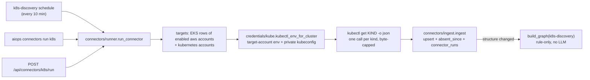

# MVP-2.6.1 — Plan B: 连接器 Implementation Plan

> **For agentic workers:** REQUIRED SUB-SKILL: Use superpowers:subagent-driven-development (recommended) or superpowers:executing-plans to implement this plan task-by-task. Steps use checkbox (`- [ ]`) syntax for tracking.

**Goal:** 把 K8s 对象变成一等库存：一个只读、按账户寻址、不用 LLM 的拉取式连接器，把 spec 列的 12 类 K8s 对象，外加没有 owner 的裸 Pod（`K8s_Pod`），写进 `cloud_resources`。消失的对象只标 `absent_since`，从不删除。Plan A 的规则层据此推出 Deployment → Pod → Node 这类关系。kubectl 只带目标账户的凭证和一个私有 kubeconfig，不再碰 `~/.kube/config` 或进程的 `KUBECONFIG`。六个告警解析器补上身份提示（`hints`）和源端故障时间（`observed_at`），webhook 入口加上共享 token / HMAC 校验。Plan C 的 RCA 补采就站在这一层上。

**Architecture:** `connectors/base.py` 定义连接器契约（`Target` → `CollectResult`）。`connectors/ingest.py` 是唯一的写入方：按 `(account_id, provider, resource_id)` upsert，只在"完整列出"的种类里标缺席，每个目标记一行 `connector_runs`。`credentials/kube.py` 给每个 kubectl 子进程造 env：aws 账户走 `get_subprocess_env_for_account`，再加上登记的或生成的私有 kubeconfig；kubernetes 账户走 `KubernetesProvider._kubectl_env`。`connectors/k8s.py` 每个种类跑一次 `kubectl get <kind> -o json`，输出有字节上限，`raw_data` 严格按 Plan A 的 `K8S_RAW_DATA_CONTRACT` 白名单。`connectors/runner.py` 串起 targets → collect → ingest，结构有变化时跑一次 rule-only 图刷新。它由 `k8s-discovery` 调度、CLI、`/api/connectors` 调用，Plan C 的补采也用它。`integrations/parsers.py` 只填源端自己带的身份字段。`web/routers/webhooks.require_webhook_token` 校验 token 或 HMAC，HMAC 助手在 `auth/signatures.py`，Plan D 的变更入口复用它。

**Tech Stack:** Python 3.11、SQLAlchemy 2.x（SQLite 默认 / PostgreSQL）、FastAPI、Typer + Rich、kubectl / AWS CLI 子进程、pytest；本计划没有前端改动。

**Spec:** `docs/superpowers/specs/2026-09-28-mvp-2.6.1-graph-rca-loop-and-issue-change-design.md`。本计划覆盖：
- §3.B 全部；
- §4 的 `connector_runs` 一行；
- §5 的 `k8s_kubeconfig_max_age_seconds`、`k8s_connector_max_output_bytes`、`k8s_connector_enabled`、`k8s_discovery_interval_minutes`、`webhook_secret`、`intake_signature_window_seconds`；
- §6 的三行：K8s 某种类失败或超限、凭证或 kubeconfig 失败、webhook 401；
- §7 中连接器、ingest、kube 凭证、解析器 hints、webhook 鉴权的单测；
- §8 验收标准 6、7。

依赖 Plan A 全部完成。

## Global Constraints

- **Python 环境**
  - 一律在项目 `.venv` 里跑：`source /Users/malibo/MyDev/AgenticOps/.venv/bin/activate`。**不要用** `/Users/malibo/MyDev/venv`（starlette 版本坏）。
  - worktree 里没有 `.venv` 和数据库。单个测试这样跑：`cd /Users/malibo/MyDev/AgenticOps/.worktrees/mvp-2.6.1 && source /Users/malibo/MyDev/AgenticOps/.venv/bin/activate && PYTHONPATH=src python -m pytest tests/<file> -v`。下文的 `Run:` 都省略了这段前缀。
- **全量测试**
  - 约 2–4 分钟：`PYTHONPATH=src python -m pytest tests/ -q > /tmp/pytest-full.log 2>&1; tail -20 /tmp/pytest-full.log`。不要把 pytest 直接管进 `tail`。
  - 基线以 Plan A 完成后的全量结果为准。写计划时，在"Plan A Task 1–8、12 + 本计划"的演练树上实测为 5749 passed、85 skipped、0 failed。
  - 唯一可能出现的已知假失败是 `tests/test_web_tools.py`（本机 DNS 把 example.com 解析到 198.18.x 时）。
  - **每次**全量回归之前，先在 worktree 里跑一次 `PYTHONPATH=src python -c "from agenticops.models import init_db; init_db()"`（`data/` 在 `.gitignore` 里）。本计划新增的 `connector_runs` 表由它的 `create_all` 建出来。
  - 已知的环境噪音，只报告不处理：跑完全量后，worktree 下会多出 `MagicMock/…/.scheduler.lock`。这是某个既有测试把 `settings.data_dir` mock 成 `MagicMock` 泄漏的，早于本计划；它在 `.gitignore` 之外，**不要** `git add` 它。
- **本地库只读**：`sqlite3 "file:/Users/malibo/MyDev/AgenticOps/data/agenticops.db?mode=ro" "<sql>"`。任何任务都不写这个库。
- **配置**：`config.py` 只定义 schema（`Field(default=…, description="… (AIOPS_X)")`）。值同时写进 `config/settings.yaml`，CLAUDE.md 配置表加行。`webhook_secret` 在 `settings.yaml` 里**只能是** `''`。真实值走环境变量 `AIOPS_WEBHOOK_SECRET`，任何文件、测试或文档里都不出现真实 token。
- **凭证铁律**
  - kubectl 和 `aws eks update-kubeconfig` 子进程的 env 只能来自 `credentials/resolver.get_subprocess_env_for_account` 加 `credentials/kube.kubectl_env_for_cluster`。
  - 失败就显式报错，没有任何 ambient 回退：不读写 `~/.kube/config`，不用进程的 `KUBECONFIG`，不用默认凭证链。
  - 账户解析顺序遵守铁律第 3 条：显式 → 库存反查 → `resolve_default_account` → fail-closed 列出账户名。
  - 连接器只发 `kubectl get`。
- **提交**
  - 每个 Task 一个 commit，只 `git add` 本 Task 列出的文件。`agent-memory/`、`skills/*/SKILL.md`、`RAW-Idea-latest-v3.md` **绝不**加进来。commit message 末尾加 `Co-Authored-By: Claude Opus 5.5 <noreply@anthropic.com>`。
  - 受保护文件 `RAW-Idea-latest-v3.md`、`RAW-Creative-Idea.md`、`docs/use-cases/*`、`docs/MVP-1.0.0-RELEASE.md` 不碰。
- **云中立**：提示词和面向 agent 的文案按概念类别写，AWS 服务名只作例子。
- **行号**：文中行号是在"Plan A Task 1–8、12 已落地"的树上量的。Plan A Task 9–11 还会改 `alert_processor.py`、`graph/`、`CLAUDE.md` 和 `docs/WORKFLOW.md`，所以行号只是估计，**以文字锚点为准**。
- Spec §9 原文：「每个任务一个 commit，**不 push**，直到 E 的联合 E2E 通过且用户确认。执行中发现计划与代码不符时，修计划里的锚点，不改契约名。」

## Review Focus

以下五类输入 spec 隐含要求，但按字面实现时最容易漏掉。每条对应的测试写在所属 Task 里：

1. **某个种类没列全，就绝不标缺席。** kubectl 失败、超时、输出超过字节上限、返回的不是 item 列表，都算这个种类 partial。ingest 只在 `completeness[(scope, kind)] is True` 的种类里标 `absent_since`。否则一次 RBAC 缺权或输出超限，就会把整类对象"删掉"。→ Task 1 `test_partial_kind_never_marks_absent`、Task 3 `test_partial_kind_is_never_marked_absent_end_to_end`
2. **AWS 扫描和 K8s 连接器各管各的行。** 两者写同一张 `cloud_resources`。AWS 扫描经 `save_resources` 写库，按 provider 建键：即使 `resource_id` 撞上，也只会新建一行 aws 行，绝不改 `provider=kubernetes` 的行。连接器也只标自己 `provider` 下、自己 `scope/` 前缀下的行。→ Task 1 `test_aws_scan_never_touches_kubernetes_rows`
3. **kubectl 的 env 里只有目标账户。** 进程里残留的 `AWS_*`、`KUBECONFIG` 都不能漏进子进程；登记的 kubeconfig 不能是 `~/.kube/config`、相对路径或不存在的文件。→ Task 2 `test_aws_env_carries_only_the_target_account_and_a_private_kubeconfig`、`tests/test_execution_skills.py::TestExecuteKubectl::test_ambient_kubeconfig_is_no_shortcut`、`test_bad_registered_kubeconfig_is_refused`
4. **Secret 不带数据，超限不装完整。** Secret 行只留 `type`，ConfigMap 只留键名和哈希，任何注解都不存（`last-applied-configuration` 里可能是整个 Secret）。一次 kubectl 的输出超过上限就截停、标 partial。错误文本要写成 DB 脱敏不会整句吞掉的形式。→ Task 3 `test_secret_rows_never_carry_data_or_annotations`、`test_failed_or_oversized_kind_is_partial_and_its_error_survives_redaction`
5. **超长告警名和"读事件"两条边界。**
   - CloudWatch 告警名最长 255 字符，而 `health_issues.alarm_name` 列只有 200。超长的名字整名参与锚定，但不落库：截断后的名字下次重新锚定时可能锚到别的集群。
   - 设了 `webhook_secret` 之后，中间件只对两条 POST 入口放行，读 `/api/webhooks/alert/events` 仍然要 Bearer。

   → Task 6 `test_an_alarm_name_longer_than_the_column_anchors_whole_and_is_not_stored`、Task 7 `test_with_a_secret_the_middleware_lets_the_intake_through_to_the_token_check`、`test_reading_alert_events_is_not_a_webhook_intake`

## 跨计划接口契约

### 本计划产出（Plan C–E 依赖这些名字，不可改）

| 符号 | 位置 | 说明 |
|---|---|---|
| `EntityObservation(provider, resource_type, resource_id, name, region, raw_data, tags, status)`、`SignalObservation`（= `SignalInput`）、`CollectResult(entities, signals, completeness, errors)`、`Target(account, scope, region, refused="")`、`Connector`（Protocol：`name`、`provider`、`targets(session)`、`collect(target, *, timeout_seconds=None)`） | `agenticops.connectors.base` | 连接器契约。`completeness` 的键是 `(scope, resource_type)`；`Target.account` 是 `credentials.resolver` 的账户快照 |
| `ingest(connector, target, result, *, trigger, started_at=None) -> IngestResult`、`IngestResult(run_id, status, changed, counts)`、`run_status(result)`、`last_success_at(session, connector, account_id, scope)`、`SUCCESS_STATUSES = ("complete", "partial")` | `agenticops.connectors.ingest` | C 用 `last_success_at` 判断集群数据够不够新 |
| `ConnectorRun`（表 `connector_runs`：`connector`、`account_id`、`scope`、`trigger`、`started_at`、`finished_at`、`status`、`counts`、`per_kind`、`error`） | `agenticops.models` | `status` ∈ complete / partial / failed；`trigger` ∈ schedule / manual / rca |
| `kubectl_env_for_cluster(account, cluster, region) -> dict`、`KubeconfigError`、`kubeconfig_path(account_pk, region, cluster)` | `agenticops.credentials.kube` | kubectl 唯一的 env 来源；`run_kubectl` 和连接器共用 |
| `run_connector(name, *, account="", scope="", trigger="manual", timeout_seconds=None) -> ConnectorRunResult`、`ConnectorRunResult(connector, status, targets, changed, graph_build_id)`、`TargetRun`、`connector_status(name, *, limit=10)`、`is_enabled`、`is_running`、`disabled_message`、`check_known`、`UnknownConnector`、`CONNECTORS`、`TRIGGERS`、`SCHEDULE_NAME = "k8s-discovery"`、`PIPELINE_NAME = "K8sDiscovery"`、`seed_discovery_schedule()` | `agenticops.connectors.runner` | C 调 `run_connector("k8s", account=…, scope=…, trigger="rca", timeout_seconds=…)`，然后自己调 `build_graph("rca-recollect", llm=False)`；trigger 为 rca 时 runner 不刷新图 |
| `GET /api/connectors?limit=` → `{"connectors": [{"name", "enabled", "running", "schedule": {"name", "cron_expression", "is_enabled"} \| null, "recent_runs": [{"id", "account", "scope", "trigger", "status", "started_at", "finished_at", "counts", "error"}]}]}`；`POST /api/connectors/{name}/run` → 202 `{"connector", "status": "accepted"}` / 404 未知 / 409 关闭或已在运行 | `agenticops.web.routers.connectors` | E 的 Settings 连接器卡片消费 |
| `sign(secret, timestamp, body)`、`verify_hmac_signature(secret, timestamp, signature, body, *, window_seconds, now=None)`、`token_matches(secret, candidate)` | `agenticops.auth.signatures` | D 的变更入口 HMAC 复用 |
| `is_webhook_intake(method, path)`、`require_webhook_token(request)`、`warn_if_unauthenticated()` | `agenticops.web.routers.webhooks` | webhook 入口鉴权 |
| `AlertPayload.hints` / `.observed_at` / `.alarm_name`、`HINT_KEYS` | `agenticops.integrations.base` | 解析器产出，`alert_processor` 原样交给 `SignalInput` |
| settings：`k8s_kubeconfig_max_age_seconds`、`k8s_connector_max_output_bytes`、`k8s_connector_enabled`、`k8s_discovery_interval_minutes`、`webhook_secret`（已有字段，本计划启用）、`intake_signature_window_seconds` | `agenticops.config` | D 复用 `intake_signature_window_seconds` |

### 本计划消费（Plan A 与既有代码）

- `agenticops.services.signal_gate`：`SignalInput.hints` / `.observed_at` / `.alarm_name`、`process_signal`。
- `agenticops.models.CloudResource.absent_since`。
- `agenticops.galaxy.rules`：`K8S_KIND_TYPES`、`k8s_resource_id`、`physical_key`、`dedup_physical`、`K8S_RAW_DATA_CONTRACT`、`arn_region`。
- `agenticops.galaxy.hashing`：`content_hash`、`VOLATILE_KEYS`（含 `pod_summary`、`unresolved_refs`）。
- `agenticops.galaxy.builder`：`build_graph(trigger, full, llm)`、`RULE_ONLY_TRIGGERS`。
- `agenticops.services.identity_resolver`：`resolve(…, alarm_name=)`、`reanchor_open_issues`。
- `agenticops.security.posture_snapshot.cron_from_interval`。
- `settings.identity_type_families`。
- `agenticops.credentials.resolver`：`list_enabled_accounts`、`get_subprocess_env_for_account`、`find_cluster_account`、`resolve_default_account`、`get_account_snapshot`。
- `agenticops.providers.kubernetes.KubernetesProvider._kubectl_env`。
- `agenticops.run_context`（kubernetes 账户的运行绑定校验）。
- `agenticops.cli.main._safe_text`。

## 可达面（六个面逐行）

| 面 | Plan B |
|---|---|
| CLI | 做：`aiops connectors list [--limit/-l 5] [--json]` 列出开关、调度行、最近运行；`aiops connectors run <name> [--account/-a NAME] [--json]` 立即跑一次（trigger=manual），失败时退出码 1 |
| Web API | 做：新增 `GET /api/connectors?limit=`、`POST /api/connectors/{name}/run`（202 / 404 / 409）；`POST /api/webhooks/alert` 与 `POST /api/webhooks/alert/{source}` 在设了 `webhook_secret` 时要求 token 或 HMAC，否则 401 |
| Web UI | 无 UI，理由：连接器卡片（开关状态、最近运行、立即运行）放在 Plan E 的 Settings 页，本计划的两个端点就是它的数据源。`pages/Schedules.tsx` 非目标：它从 `/api/schedules` 取 pipeline 列表，`K8sDiscovery` 会自动出现 |
| Agent tool | 非目标：不新增工具。只有 `run_kubectl` 的行为变了：它必须带 `cluster_name`，并且只用目标账户的 env 加私有 kubeconfig |
| Schedule | 做：启动时种一次 `k8s-discovery`（pipeline `K8sDiscovery`，间隔 `k8s_discovery_interval_minutes`）。已有的行，哪怕被用户改过或停用，都不覆盖 |
| Notification | 非目标 |
| Webhook（附加行） | 做：六个解析器填 `hints` / `observed_at` / `alarm_name`；入口的 token / HMAC 校验 |

## 与 spec 的偏差（执行前知悉，已在 Task 里落实）

**凭证与 kubeconfig**

1. **aws 账户可以登记现成的 kubeconfig：`credentials.kubeconfigs[<cluster>] = <绝对路径>`**（写计划时比较过三个方案，这是第 3 个）。登记了就用它，否则在 `<data_dir>/kube/` 下生成私有文件。原因：spec 让集群内部署（chaos-lab）用 kubernetes 类型账户，但这类账户目前经 API、UI、CLI 都建不出来。而 chaos-lab 的 pod 里本来就有 init container 写好的 service-account kubeconfig。chaos-lab 的 RBAC 不授予读 secrets，所以它的 `K8s_Secret` 种类会一直是 partial，这是正确行为。
2. **同一账户下、不同区域里有同名集群时，拒绝采集**，而不是合并成一个 scope：K8s 的 resource_id 里没有区域。拒绝原因放在 `Target.refused` 里，每个区域各记一行 failed 的运行。
3. **`SignalObservation` 就是 `SignalInput` 的别名**，不另定义类型。spec 说"交给 process_signal 的 SignalInput"。
4. **kubeconfig 路径用账户主键**（`cloud_accounts.id`），不用 12 位 `account_id`。主键总是有而且唯一，没配 `account_id` 的账户也能用。
5. **不新增 `connector.run` 权限。** `POST /api/connectors/{name}/run` 只读目标、写库存，和 `POST /api/schedules/{id}/run`、`POST /api/galaxy/rebuild` 一样，挡在 APIAuthMiddleware 后面，不单独做 RBAC。
6. **去掉 `configmap.yaml` 里的 `AIOPS_EKS_CLUSTER_NAME` 和 `KUBECONFIG`。** 代码从不读前者，它只出现在一条错误消息里。`run_kubectl` 改为必须带 `cluster_name`。`find_cluster_account` 仍然只查 EKS 行、只查 aws 账户。

**ingest**

7. **`changed` 不看易变键。** 内容哈希排除 `VOLATILE_KEYS`，所以 `pod_summary` 每 10 分钟的抖动不会触发图刷新。只有新建、缺席翻转、回归、哈希变化才算结构变化。
8. **`last_success_at` 把 partial 也算成功**（`SUCCESS_STATUSES`）：partial 的运行已经刷新了每个完整的种类。
9. **scope 前缀用 `substr(resource_id, 1, len(prefix)) = prefix` 比较，不用 `LIKE`。** 集群名里的 `_` 是 LIKE 通配符，会误匹配别的集群。
10. **ingest 直接用 `target.account.id`，不调 `identity_resolver.account_pk`。** Plan A 契约写的是"B 的 ingest 和 C 都用它"，但 `Target.account` 本身就是 `list_enabled_accounts` 的快照，已经带主键，不需要从名字或 12 位账号换算。`account_pk` 仍由 C 使用。
11. **AWS 扫描不碰 kubernetes 行，这一点只靠测试守住**（`test_aws_scan_never_touches_kubernetes_rows`）：现有的 `save_resources` 本来就按 `(account_id, provider, resource_id)` 建键，所以不改扫描代码。

**K8s 连接器**

12. **错误文本写成 `"<type> not collected — <why>"`**，整个目标失败时写成 `"cluster <name> not collected — <why>"`。DB 脱敏会把 `<label>: <value>` 形式的值遮掉，写成 `K8s_Secret: …` 就会被整句吞掉。
13. **每次 kubectl 调用超时 60 秒**（`CALL_TIMEOUT_SECONDS`）。调用方给的 `timeout_seconds` 预算只能缩短它；预算用完后，剩下的种类直接记为没采集，不再等。
14. **`-A` 只加在带命名空间的种类上**，`Namespace`、`Node` 不加。
15. **K8s 行的 `tags` 是 `{}`**：labels 放在 `raw_data.labels`（Plan A 契约）。
16. **连接器不产出信号。** `CollectResult.signals` 留给以后的连接器；K8s 的异常由 Plan A 的健康叠加从 `raw_data` 读。终止原因为 `Completed` 的不算异常。
17. **spec 列 12 类，`_CALLS` 有 14 次调用。** 多出来的两次是：`ReplicaSet` 只用来把 pod 映射回 Deployment，不存行；`Pod` 这次调用里，带 owner 的只汇总进工作负载的 `pod_summary`，只有没有 owner 的裸 Pod 存成 `K8s_Pod` 行（spec 在 LLM 排除类型里另列的就是它）。所以存储类型一共 13 个，正好是 Plan A 的 `K8S_KIND_TYPES`。
18. **Protocol 的 `collect` 带 `timeout_seconds`，并且有 `provider` 属性。** 前者给 C 的补采预算用，后者让 ingest 的缺席标记不越出自己的 provider。spec 的签名里两者都没有。

**runner、调度、CLI**

19. **进程内锁。** 同一进程里同一个连接器同时只跑一次，第二个调用等待，或在预算内等不到时返回 `busy`。多个 worker 进程之间不互斥：`cloud_resources` 有 `(account_id, provider, resource_id)` 唯一约束，所以最坏情况是后到的进程这一轮插入撞约束、整轮失败，下一轮再补，不会出现重复行。
20. **`account` 过滤接受账户名或 12 位账号。**
21. **`connector_runs.trigger` 记 `rca`，图刷新的 trigger 是 `rca-recollect`**（Plan A 的 `RULE_ONLY_TRIGGERS`）。runner 只在 schedule / manual 时自己刷新图；rca 时由 C 在自己的 trigger 下刷新。
22. **`ConnectorRunResult.status` 比 spec 多两个值**：`busy`（等锁超时）和 `no_targets`（没有可采的集群）。
23. **一次 discovery 整体 failed 时，调度执行也记 failed**，错误截到 4000 字符。
24. **CLI 按行打印，不画 Rich 表格**。用户可控的文本一律经过 `_safe_text`：集群名、错误里的 `[...]` 会被 Rich 当成标记吞掉。
25. **Web UI 无 UI**（见可达面）。

**告警解析器**

26. **`alarm_name` 从 webhook 这条路也填上**（`AlertPayload.alarm_name` → `SignalInput.alarm_name`）。spec 只在 CloudWatch 的锚定规则里提到它。
27. **超过 200 字符的 `alarm_name` 不落库**，但整名仍参与锚定（Review Focus 第 5 条）。
28. **Prometheus 的 `service` label 不映射成 hint。** 它通常是抓取目标（例如 kube-state-metrics）的 Service，而不是出问题的服务。
29. **CloudWatch 的 K8s hints 只在 `ContainerInsights` 命名空间下取**（`ClusterName` / `Namespace` / `FullPodName` 或 `PodName` / `Service` 维度）。其他命名空间的同名维度不是 K8s 语义，ECS 用的是 `ECS/ContainerInsights`。
30. **CloudWatch 的 region 只取自 `AlarmArn`。** `Region` 字段是显示名（"Asia Pacific (Singapore)"），不是区域代码。

**webhook 鉴权**

31. **APIAuthMiddleware 提到模块级。** 原来类定义在 `if settings.api_auth_enabled:` 里面，测试无法在开关为 false 的进程里构造它。现在只有 `add_middleware` 留在 if 里。设了 `webhook_secret` 时，中间件对两条入口 POST 放行，交给路由上的 token 校验。
32. **设了 secret 之后，用户的会话 Bearer 不再能通过入口校验**：入口只认共享 token（放在 Bearer 里也行）或 HMAC。chaos E2E 的客户端相应地同时发两者。
33. **`intake_signature_window_seconds` 由 B 定义，D 复用。**
34. **`?token=` 会出现在访问日志里。** 它只是给无法设请求头的发送方（SNS 订阅 URL）用的，文档里写明了；能设请求头时用 `X-AIOps-Token` 或 Bearer。
35. **不改 `infra/eks-lab` 的 Alertmanager values**（那是另一个实验环境），只在 WORKFLOW.md 写明配置方法。chaos-lab 的 `e2e/conftest.py` 调 `ensure_account` 时会把 kubeconfig 登记上：已有账户就用 PUT 按参数重建 `credentials`，账户信息已是最新时不发请求。

`connector_runs` 是新表，由 `init_db` 的 `create_all` 建出，不需要往 Plan A 的 `_ADD_COLUMNS_2_6_1` 里加东西（spec §4："新表用 create_all"）。

## File Structure

| 文件 | 责任 | Task |
|---|---|---|
| `src/agenticops/connectors/__init__.py`、`base.py`、`ingest.py`（新） | 连接器契约；确定性 ingest 与缺席标记 | 1 |
| `src/agenticops/models.py` | `ConnectorRun` | 1 |
| `src/agenticops/credentials/kube.py`（新） | 账户寻址的 kubectl env 与私有 kubeconfig | 2 |
| `src/agenticops/skills/execution.py` | `_execute_kubectl` 改用 `kubectl_env_for_cluster`，去掉 ambient `KUBECONFIG` 捷径 | 2 |
| `infra/eks-chaos-lab/agenticops/configmap.yaml`、`infra/eks-chaos-lab/e2e/client.py`、`e2e/conftest.py` | chaos-lab 登记集群内 kubeconfig；去掉 ambient 变量 | 2, 7 |
| `src/agenticops/connectors/k8s.py`（新） | K8s 连接器 | 3 |
| `infra/eks-chaos-lab/agenticops/rbac.yaml` | 补 `poddisruptionbudgets` 读权限 | 3 |
| `src/agenticops/connectors/runner.py`（新） | runner、调度种子、状态查询 | 4, 5 |
| `src/agenticops/scheduler/scheduler.py`、`src/agenticops/web/routers/schedules.py` | `K8sDiscovery` pipeline | 4 |
| `src/agenticops/web/routers/connectors.py`（新）、`src/agenticops/cli/main.py` | `/api/connectors`、`aiops connectors` | 5 |
| `src/agenticops/integrations/base.py`、`parsers.py`、`alert_processor.py`、`src/agenticops/services/signal_gate.py` | hints / observed_at / alarm_name | 6 |
| `src/agenticops/auth/signatures.py`（新）、`src/agenticops/web/routers/webhooks.py` | 共享 token / HMAC | 7 |
| `src/agenticops/web/app.py` | 调度种子、connectors 路由、中间件上提、启动告警 | 4, 5, 7 |
| `infra/eks-chaos-lab/agenticops/deploy-app.sh`、`secret.example.yaml`、`infra/eks-chaos-lab/e2e/README.md` | `--webhook-secret` | 7 |
| `src/agenticops/config.py`、`config/settings.yaml` | 六个配置项 | 2, 3, 4, 7 |
| `CLAUDE.md` | 铁律第 3 条补充、配置表、模块表 | 2, 3, 4, 7, 8 |
| `docs/WORKFLOW.md`、`README.md`、`README_CN.md` | 文档 | 2, 8 |

---

### Task 1: 连接器契约、确定性 ingest 与 `connector_runs`

**Files:**
- Create: `src/agenticops/connectors/__init__.py`、`src/agenticops/connectors/base.py`、`src/agenticops/connectors/ingest.py`
- Modify: `src/agenticops/models.py:223`（`CloudResource` 之后加 `ConnectorRun`）
- Test: `tests/test_connector_ingest.py`（新）

**Interfaces:**
- Consumes:
  - `services.signal_gate.SignalInput`、`process_signal`；
  - `models.CloudResource`（含 Plan A 加的 `absent_since`）；
  - `galaxy.hashing.content_hash`（它本身排除 `VOLATILE_KEYS`，所以 `pod_summary` 的抖动不算内容变化）。
- Produces:
  - `connectors.base`：`EntityObservation`、`SignalObservation`（= `SignalInput`）、`Target`、`CollectResult`、`Connector`（Protocol）；
  - `connectors.ingest`：`ingest(connector, target, result, *, trigger, started_at=None) -> IngestResult`、`IngestResult(run_id, status, changed, counts)`、`run_status(result) -> str`、`last_success_at(session, connector, account_id, scope) -> datetime | None`、`SUCCESS_STATUSES = ("complete", "partial")`；
  - `models.ConnectorRun`（表 `connector_runs`，由 `init_db` 的 `create_all` 建出）。

- [ ] **Step 1: 写失败测试**

`tests/test_connector_ingest.py`：

```python
"""connectors.ingest (MVP-2.6.1 spec §3.B.2): the one writer for connector observations. Upserts, marks
absent only what a complete listing no longer sees (never deletes, never a partial kind, never outside the
target's account / provider / scope), keeps the build-written unresolved_refs, records one connector_runs
row per call."""
import json
from datetime import datetime, timedelta, timezone
from types import SimpleNamespace

import pytest

from agenticops.connectors.base import CollectResult, EntityObservation, Target
from agenticops.connectors.ingest import ingest, last_success_at
from agenticops.models import Base, CloudAccount, CloudResource, ConnectorRun, get_session

ACCT, OTHER = 1, 2
T0 = datetime(2026, 9, 1, 12, 0)


class _Conn:
    name = "k8s"
    provider = "kubernetes"


CONN = _Conn()


@pytest.fixture
def db(tmp_path):
    import agenticops.models as models_mod
    from agenticops.config import settings

    saved_url = settings.database_url
    models_mod._engine = None
    settings.database_url = f"sqlite:///{tmp_path}/ingest.db"
    Base.metadata.create_all(models_mod.get_engine())
    s = get_session()
    s.add_all([CloudAccount(id=ACCT, name="global", provider="aws", is_enabled=True, credentials={}),
               CloudAccount(id=OTHER, name="cn", provider="aws", is_enabled=True, credentials={})])
    s.commit()
    yield s
    s.close()
    models_mod._engine = None
    settings.database_url = saved_url


def _target(scope="lab", account=ACCT):
    return Target(account=SimpleNamespace(id=account, name="global", provider="aws"), scope=scope, region="us-east-1")


def _obs(kind, name, ns="default", scope="lab", raw=None):
    return EntityObservation(provider="kubernetes", resource_type=f"K8s_{kind}",
                             resource_id=f"{scope}/{kind}/{ns}/{name}", name=name, region="us-east-1",
                             raw_data=raw if raw is not None else {"cluster": scope, "namespace": ns},
                             tags={}, status="active")


def _row(s, kind, name, ns="default", scope="lab", account=ACCT, provider="kubernetes", raw=None):
    r = CloudResource(account_id=account, provider=provider, region="us-east-1", resource_type=f"K8s_{kind}",
                      resource_id=f"{scope}/{kind}/{ns}/{name}", name=name, tags={},
                      raw_data=raw if raw is not None else {"cluster": scope, "namespace": ns},
                      status="active", scanned_at=T0)
    s.add(r)
    s.commit()
    return r.id


def _get(s, pk):
    s.expire_all()
    return s.get(CloudResource, pk)


def _complete(*kinds, scope="lab", value=True):
    return {(scope, f"K8s_{k}"): value for k in kinds}


def test_first_ingest_creates_rows_and_a_complete_run(db):
    res = ingest(CONN, _target(), CollectResult(entities=[_obs("Deployment", "web"), _obs("Service", "web")],
                                                completeness=_complete("Deployment", "Service")), trigger="manual")
    assert (res.status, res.changed) == ("complete", True)
    assert res.counts["created"] == 2
    rows = db.query(CloudResource).order_by(CloudResource.resource_id).all()
    assert [(r.provider, r.resource_id, r.absent_since) for r in rows] == [
        ("kubernetes", "lab/Deployment/default/web", None), ("kubernetes", "lab/Service/default/web", None)]
    run = db.get(ConnectorRun, res.run_id)
    assert (run.connector, run.account_id, run.scope, run.trigger, run.status) == ("k8s", ACCT, "lab", "manual",
                                                                                  "complete")
    assert run.per_kind == {"K8s_Deployment": {"complete": True, "count": 1},
                            "K8s_Service": {"complete": True, "count": 1}}
    assert run.error is None


def test_unchanged_reingest_is_not_a_structure_change_but_refreshes_scanned_at(db):
    pk = _row(db, "Deployment", "web")
    res = ingest(CONN, _target(), CollectResult(entities=[_obs("Deployment", "web")],
                                                completeness=_complete("Deployment")), trigger="schedule")
    assert (res.changed, res.counts["updated"]) == (False, 1)
    assert _get(db, pk).scanned_at > T0


def test_pod_summary_churn_is_not_a_structure_change(db):
    pk = _row(db, "Deployment", "web", raw={"cluster": "lab", "namespace": "default", "pod_summary": {"ready": 1}})
    raw = {"cluster": "lab", "namespace": "default", "pod_summary": {"ready": 0, "restarts": 7}}
    res = ingest(CONN, _target(), CollectResult(entities=[_obs("Deployment", "web", raw=raw)],
                                                completeness=_complete("Deployment")), trigger="schedule")
    assert res.changed is False
    assert _get(db, pk).raw_data["pod_summary"] == {"ready": 0, "restarts": 7}


def test_content_change_is_a_structure_change(db):
    _row(db, "Deployment", "web")
    raw = {"cluster": "lab", "namespace": "default", "selector": {"app": "web"}}
    res = ingest(CONN, _target(), CollectResult(entities=[_obs("Deployment", "web", raw=raw)],
                                                completeness=_complete("Deployment")), trigger="schedule")
    assert res.changed is True


def test_complete_kind_marks_unseen_rows_absent_and_never_deletes(db):
    gone = _row(db, "Deployment", "old")
    res = ingest(CONN, _target(), CollectResult(entities=[_obs("Deployment", "web")],
                                                completeness=_complete("Deployment")), trigger="schedule")
    assert (res.changed, res.counts["absent"]) == (True, 1)
    assert _get(db, gone).absent_since is not None
    assert db.query(CloudResource).count() == 2


def test_partial_kind_never_marks_absent(db):
    secret = _row(db, "Secret", "db-password")
    unlisted = _row(db, "ConfigMap", "app-config")  # kind missing from completeness entirely counts as partial
    res = ingest(CONN, _target(), CollectResult(entities=[], completeness=_complete("Secret", value=False),
                                                errors=["K8s_Secret not collected — forbidden"]), trigger="schedule")
    assert res.status == "failed"
    assert _get(db, secret).absent_since is None
    assert _get(db, unlisted).absent_since is None


def test_absent_marking_stays_inside_account_provider_and_scope(db):
    other_cluster = _row(db, "Deployment", "web", scope="lab-2")   # "lab" is a string prefix of "lab-2"
    underscore = _row(db, "Deployment", "web", scope="laXb")       # LIKE would treat "_" as a wildcard
    other_account = _row(db, "Deployment", "web", account=OTHER)
    other_provider = _row(db, "Deployment", "web", provider="aws")
    ingest(CONN, _target(scope="la_b"), CollectResult(entities=[], completeness=_complete("Deployment", scope="la_b")),
           trigger="schedule")
    ingest(CONN, _target(), CollectResult(entities=[_obs("Deployment", "api")], completeness=_complete("Deployment")),
           trigger="schedule")
    for pk in (other_cluster, underscore, other_account, other_provider):
        assert _get(db, pk).absent_since is None


def test_returning_row_clears_absent_and_counts_as_change(db):
    pk = _row(db, "Deployment", "web")
    db.query(CloudResource).filter_by(id=pk).update({"absent_since": T0})
    db.commit()
    res = ingest(CONN, _target(), CollectResult(entities=[_obs("Deployment", "web")],
                                                completeness=_complete("Deployment")), trigger="schedule")
    assert (res.changed, res.counts["returned"]) == (True, 1)
    assert _get(db, pk).absent_since is None


def test_build_written_unresolved_refs_survive_the_overwrite(db):
    refs = [{"kind": "ConfigMap", "name": "missing"}]
    pk = _row(db, "Deployment", "web", raw={"cluster": "lab", "namespace": "default", "unresolved_refs": refs})
    ingest(CONN, _target(), CollectResult(entities=[_obs("Deployment", "web")], completeness=_complete("Deployment")),
           trigger="schedule")
    assert _get(db, pk).raw_data["unresolved_refs"] == refs


def test_partial_run_records_errors_verbatim(db):
    """The DB write boundary masks "secret: <value>" (security/db_redaction), so a connector error must never
    read "K8s_Secret: ..." — the connector's "<kind> not collected — <why>" shape survives the round trip."""
    err = "K8s_Secret not collected — kubectl exit 1: secrets is forbidden"
    res = ingest(CONN, _target(), CollectResult(entities=[_obs("Deployment", "web")],
                                                completeness={**_complete("Deployment"), **_complete("Secret", value=False)},
                                                errors=[err]), trigger="manual")
    run = db.get(ConnectorRun, res.run_id)
    assert run.status == "partial"
    assert run.per_kind["K8s_Secret"] == {"complete": False, "count": 0}
    assert run.error == err


def test_signals_go_through_the_gate_and_a_bad_one_does_not_lose_the_run(db, monkeypatch):
    import agenticops.services.signal_gate as gate

    seen = []

    def fake(sig):
        seen.append(sig.title)
        if sig.title == "bad":
            raise RuntimeError("boom")

    monkeypatch.setattr(gate, "process_signal", fake)
    sigs = [gate.SignalInput(source="k8s", title=t, description="", severity="high") for t in ("ok", "bad")]
    res = ingest(CONN, _target(), CollectResult(signals=sigs, completeness=_complete("Deployment")), trigger="manual")
    assert seen == ["ok", "bad"]
    assert (res.counts["signals"], res.counts["signal_errors"]) == (1, 1)
    assert db.get(ConnectorRun, res.run_id) is not None


def test_last_success_at_skips_failed_runs_and_is_aware_utc(db):
    assert last_success_at(db, "k8s", ACCT, "lab") is None
    ok = ingest(CONN, _target(), CollectResult(entities=[_obs("Deployment", "web")],
                                               completeness=_complete("Deployment")), trigger="schedule")
    ingest(CONN, _target(), CollectResult(errors=["cluster unreachable"]), trigger="schedule")
    ingest(CONN, _target(scope="lab-2"), CollectResult(entities=[_obs("Deployment", "web", scope="lab-2")],
                                                       completeness=_complete("Deployment", scope="lab-2")),
           trigger="schedule")
    finished = db.get(ConnectorRun, ok.run_id).finished_at
    got = last_success_at(db, "k8s", ACCT, "lab")
    assert got.tzinfo is timezone.utc
    assert got == finished.replace(tzinfo=timezone.utc)
    assert datetime.now(timezone.utc) - got < timedelta(minutes=1)


def test_aws_scan_never_touches_kubernetes_rows(db):
    """spec §3.B.2: the AWS scan writes through save_resources, which is keyed on provider — guard it."""
    from agenticops.tools.metadata_tools import save_resources

    pk = _row(db, "Deployment", "web")
    before = db.query(CloudResource).count()
    out = save_resources(json.dumps([{"resource_id": "lab/Deployment/default/web", "resource_type": "EKS",
                                      "region": "us-east-1", "name": "clash"},
                                     {"resource_id": "i-0abc", "resource_type": "EC2", "region": "us-east-1"}]),
                         account_id=ACCT, provider="aws")
    assert "Saved 2 new" in out
    row = _get(db, pk)
    assert (row.provider, row.resource_type, row.scanned_at, row.absent_since) == ("kubernetes", "K8s_Deployment",
                                                                                   T0, None)
    assert db.query(CloudResource).count() == before + 2
```

- [ ] **Step 2: 跑测试确认失败**

Run: `PYTHONPATH=src python -m pytest tests/test_connector_ingest.py -v`
Expected: FAIL，收集阶段就报 `ModuleNotFoundError: No module named 'agenticops.connectors'`（1 error）。

- [ ] **Step 3: 加 `ConnectorRun` 模型**

`src/agenticops/models.py`，在 `CloudResource` 的最后一行 `account: Mapped["CloudAccount"] = relationship(back_populates="resources")`（:223）之后插入：

```python


class ConnectorRun(Base):
    """One pull-connector run over one target (MVP-2.6.1 spec §3.B.2), written by connectors.ingest.

    status: complete (every kind listed completely) | partial (some kind failed or hit the byte cap) |
    failed (nothing collected). per_kind: {resource_type: {"complete": bool, "count": int}}."""

    __tablename__ = "connector_runs"
    __table_args__ = (Index("idx_connector_run_target", "connector", "account_id", "scope", "finished_at"),)

    id: Mapped[int] = mapped_column(primary_key=True)
    connector: Mapped[str] = mapped_column(String(50))
    account_id: Mapped[Optional[int]] = mapped_column(nullable=True)  # cloud_accounts.id
    scope: Mapped[str] = mapped_column(String(200), default="")      # e.g. the cluster name
    trigger: Mapped[str] = mapped_column(String(20))                 # schedule | manual | rca
    started_at: Mapped[datetime] = mapped_column(DateTime)
    finished_at: Mapped[datetime] = mapped_column(DateTime)
    status: Mapped[str] = mapped_column(String(10))
    counts: Mapped[dict] = mapped_column(JSON, default=dict)
    per_kind: Mapped[dict] = mapped_column(JSON, default=dict)
    error: Mapped[Optional[str]] = mapped_column(Text, nullable=True)
```

- [ ] **Step 4: 写连接器契约与 ingest**

`src/agenticops/connectors/__init__.py`：

```python
"""Pull connectors (MVP-2.6.1 spec §3.B): read-only, account-addressed, LLM-free collectors whose observations
reach the database only through connectors.ingest.ingest()."""
```

`src/agenticops/connectors/base.py`：

```python
"""Connector contract (MVP-2.6.1 spec §3.B.1).

A connector is read-only, account-addressed (credentials only through the provider layer, never ambient) and
LLM-free. It turns one Target into a CollectResult; connectors.ingest.ingest() is the only writer.

RelationObservation (trace / APM / CMDB edges) is specified here but not implemented: the first connector that
observes relations (2.6.2) adds
    RelationObservation(src_resource_id, dst_resource_id, relation_type, evidence: dict, observed_at)
plus a CollectResult.relations list, and ingest() writes them. No code until then (spec §3.B.1).
"""
from __future__ import annotations

from dataclasses import dataclass, field
from types import SimpleNamespace
from typing import Optional, Protocol

from agenticops.services.signal_gate import SignalInput

# A pulled signal goes to process_signal unchanged, so it is a SignalInput (spec: "交给 process_signal 的 SignalInput").
SignalObservation = SignalInput


@dataclass
class EntityObservation:
    """One inventory row as observed: upserted into cloud_resources by (account_id, provider, resource_id)."""

    provider: str
    resource_type: str
    resource_id: str
    name: str
    region: str
    raw_data: dict
    tags: dict
    status: str


@dataclass
class Target:
    """One collection unit. ``account`` is a credentials.resolver snapshot (id, name, provider, credentials,
    regions); ``scope`` is the resource_id prefix this target owns (for K8s the cluster name: every id is
    '<cluster>/<Kind>/...'), which bounds absent-marking to what this target could have seen."""

    account: SimpleNamespace
    scope: str
    region: str
    refused: str = ""  # non-empty: targets() already knows this unit cannot be collected; collect() returns
    #                    this reason as its only error, so the run is recorded as failed


@dataclass
class CollectResult:
    entities: list[EntityObservation] = field(default_factory=list)
    signals: list[SignalObservation] = field(default_factory=list)
    # (scope, resource_type) → True only when that kind was listed completely (call succeeded, under the byte
    # cap). Only complete kinds take part in absent-marking; a kind missing here counts as partial.
    completeness: dict[tuple[str, str], bool] = field(default_factory=dict)
    errors: list[str] = field(default_factory=list)


class Connector(Protocol):
    name: str       # connector_runs.connector, CLI / API name
    provider: str   # cloud_resources.provider of the rows it owns (absent-marking never leaves it)

    def targets(self, session) -> list[Target]:
        """Account-addressed collection targets, deduplicated to one per physical scope."""
        ...

    def collect(self, target: Target, *, timeout_seconds: Optional[float] = None) -> CollectResult:
        """Read-only, no LLM. Failures are reported in errors / completeness, not raised. `timeout_seconds` is
        what is left of the caller's budget (None = none): a kind the budget cannot reach is reported, not waited on."""
        ...
```

`src/agenticops/connectors/ingest.py`：

```python
"""The only writer for pull-connector observations (MVP-2.6.1 spec §3.B.2). Deterministic, no LLM.

- entities: upsert into cloud_resources by (account_id, provider, resource_id); scanned_at = now,
  absent_since cleared. The build-written raw_data["unresolved_refs"] survives the overwrite.
- absent: only for a (scope, kind) the connector listed completely, rows of that kind under the scope that
  were not seen get absent_since = now. Never deletes; a partial kind is never touched.
- signals: each through signal_gate.process_signal (fail-soft per signal).
- one connector_runs row per call.
"""
from __future__ import annotations

import logging
from dataclasses import dataclass
from datetime import datetime, timezone
from typing import Optional

from sqlalchemy import func

from agenticops.connectors.base import CollectResult, Connector, Target
from agenticops.galaxy.hashing import content_hash
from agenticops.models import CloudResource, ConnectorRun, get_db_session

logger = logging.getLogger(__name__)

SUCCESS_STATUSES = ("complete", "partial")  # a partial run still refreshed every complete kind
_PRESERVED_RAW_KEYS = ("unresolved_refs",)  # written by the Galaxy build (Plan A), not by the connector
_IN_CHUNK = 500


@dataclass
class IngestResult:
    run_id: int
    status: str     # complete | partial | failed
    changed: bool   # structure changed: a row created, absent-flipped, returned, or its content hash moved
    counts: dict    # created / updated / absent / returned / signals / signal_errors


def _utc(dt: Optional[datetime]) -> Optional[datetime]:
    if dt is None:
        return None
    return dt.replace(tzinfo=timezone.utc) if dt.tzinfo is None else dt.astimezone(timezone.utc)


def _hash(rtype: str, rid: str, name: str, tags: dict, raw: dict) -> str:
    return content_hash({"resource_type": rtype, "resource_id": rid, "name": name, "tags": tags, "raw_data": raw})


def run_status(result: CollectResult) -> str:
    kinds = result.completeness.values()
    if not any(kinds) and not result.entities:
        return "failed"
    if kinds and all(kinds) and not result.errors:
        return "complete"
    return "partial"


def ingest(connector: Connector, target: Target, result: CollectResult, *, trigger: str,
           started_at: Optional[datetime] = None) -> IngestResult:
    now = datetime.now(timezone.utc)
    acct = target.account.id
    status = run_status(result)
    counts = {"created": 0, "updated": 0, "absent": 0, "returned": 0, "signals": 0, "signal_errors": 0}
    per_kind: dict[str, dict] = {}
    for (scope, kind), complete in result.completeness.items():
        if scope == target.scope:
            per_kind[kind] = {"complete": bool(complete), "count": 0}
    changed = False

    obs = {e.resource_id: e for e in result.entities if e.resource_id}  # last one wins on a repeated id
    for e in obs.values():
        per_kind.setdefault(e.resource_type, {"complete": False, "count": 0})["count"] += 1

    with get_db_session() as s:
        ids = list(obs)
        existing: dict[str, CloudResource] = {}
        for i in range(0, len(ids), _IN_CHUNK):
            for row in s.query(CloudResource).filter(
                    CloudResource.account_id == acct, CloudResource.provider == connector.provider,
                    CloudResource.resource_id.in_(ids[i:i + _IN_CHUNK])):
                existing[row.resource_id] = row
        for rid, e in obs.items():
            row = existing.get(rid)
            if row is None:
                s.add(CloudResource(account_id=acct, provider=connector.provider, region=e.region,
                                    resource_type=e.resource_type, resource_id=rid, name=e.name, tags=dict(e.tags),
                                    raw_data=dict(e.raw_data), status=e.status, managed=True, scanned_at=now))
                counts["created"] += 1
                changed = True
                continue
            old_raw = row.raw_data if isinstance(row.raw_data, dict) else {}
            raw = dict(e.raw_data)
            for key in _PRESERVED_RAW_KEYS:
                if key in old_raw and key not in raw:
                    raw[key] = old_raw[key]
            before = _hash(row.resource_type, rid, row.name, row.tags or {}, old_raw)
            after = _hash(e.resource_type, rid, e.name, e.tags, raw)
            if row.absent_since is not None:
                counts["returned"] += 1
                changed = True
            if before != after:
                changed = True
            row.resource_type, row.name, row.region = e.resource_type, e.name, e.region
            row.tags, row.raw_data, row.status = dict(e.tags), raw, e.status
            row.scanned_at, row.absent_since = now, None
            counts["updated"] += 1

        prefix = f"{target.scope}/"
        for (scope, kind), complete in result.completeness.items():
            if not complete or scope != target.scope:
                continue
            q = s.query(CloudResource).filter(
                CloudResource.account_id == acct, CloudResource.provider == connector.provider,
                CloudResource.resource_type == kind, CloudResource.absent_since.is_(None),
                func.substr(CloudResource.resource_id, 1, len(prefix)) == prefix)
            for row in q:
                if row.resource_id not in obs:
                    row.absent_since = now
                    counts["absent"] += 1
                    changed = True

    for sig in result.signals:
        try:
            from agenticops.services.signal_gate import process_signal

            process_signal(sig)
            counts["signals"] += 1
        except Exception as exc:  # one bad signal must not lose the run record
            counts["signal_errors"] += 1
            logger.warning("connector %s: signal %r failed: %s", connector.name, sig.title, exc)

    with get_db_session() as s:
        run = ConnectorRun(connector=connector.name, account_id=acct, scope=target.scope, trigger=trigger,
                           started_at=started_at or now, finished_at=datetime.now(timezone.utc), status=status,
                           counts=counts, per_kind=per_kind,
                           error="; ".join(result.errors)[:4000] or None)
        s.add(run)
        s.flush()
        run_id = run.id
    return IngestResult(run_id=run_id, status=status, changed=changed, counts=counts)


def last_success_at(session, connector: str, account_id: int, scope: str) -> Optional[datetime]:
    """finished_at (aware UTC) of the newest complete-or-partial run for this target, or None. Plan C's RCA
    recollect reads it to decide whether the cluster data is fresh enough."""
    value = (session.query(func.max(ConnectorRun.finished_at))
             .filter(ConnectorRun.connector == connector, ConnectorRun.account_id == account_id,
                     ConnectorRun.scope == scope, ConnectorRun.status.in_(SUCCESS_STATUSES))
             .scalar())
    return _utc(value)
```

- [ ] **Step 5: 跑测试确认通过**

Run: `PYTHONPATH=src python -m pytest tests/test_connector_ingest.py -v`
Expected: PASS（13 passed）。

- [ ] **Step 6: 全量回归**

先在 worktree 里跑一次 `PYTHONPATH=src python -c "from agenticops.models import init_db; init_db()"`（Global Constraints），然后：

Run: `PYTHONPATH=src python -m pytest tests/ -q > /tmp/pytest-full.log 2>&1; tail -20 /tmp/pytest-full.log`
Expected: 全绿（演练树上实测 5614 passed、85 skipped、3 warnings in 261.81s (0:04:21)；本机 DNS 把 example.com 解析到 198.18.x 时，`tests/test_web_tools.py` 有一个已知假失败）。

- [ ] **Step 7: Commit**

```bash
git -C /Users/malibo/MyDev/AgenticOps/.worktrees/mvp-2.6.1 add src/agenticops/models.py src/agenticops/connectors/__init__.py src/agenticops/connectors/base.py \
  src/agenticops/connectors/ingest.py tests/test_connector_ingest.py
git -C /Users/malibo/MyDev/AgenticOps/.worktrees/mvp-2.6.1 commit -m "feat(connectors): connector contracts, deterministic ingest and connector_runs

Co-Authored-By: Claude Opus 5.5 <noreply@anthropic.com>"
```

---

### Task 2: kubectl 按账户取 env 和私有 kubeconfig；`run_kubectl` 去掉 ambient 捷径

**Files:**
- Create: `src/agenticops/credentials/kube.py`
- Modify: `src/agenticops/skills/execution.py:451`（docstring）、`:514-598`（`_execute_kubectl` 整个函数）
- Modify: `infra/eks-chaos-lab/agenticops/configmap.yaml:14`、`:16`
- Modify: `infra/eks-chaos-lab/e2e/client.py:50-60`（新增 `put`，`ensure_account` 带 `kubeconfigs`）、`infra/eks-chaos-lab/e2e/conftest.py:40`
- Modify: `src/agenticops/config.py:600`、`config/settings.yaml:296`（`k8s_kubeconfig_max_age_seconds`）
- Modify: `CLAUDE.md:56`（铁律第 3 条末尾）、`:216`（配置表）、`docs/WORKFLOW.md:198`
- Test: `tests/test_kube_credentials.py`（新）、`tests/test_connector_config.py`（新）、`tests/test_execution_skills.py:263-331`、`tests/test_execution_tools.py:335-423`（两处 `TestExecuteKubectl` 都在文件末尾）、`tests/test_chaos_e2e_client.py:59`（文件末尾）

**Interfaces:**
- Consumes:
  - `credentials.resolver`：`get_subprocess_env_for_account(account, region)`、`AccountResolutionError`、`get_account_snapshot`、`find_cluster_account`、`resolve_default_account`、`list_enabled_accounts`、`ERR_UNKNOWN_ACCOUNT`；
  - `providers.kubernetes.KubernetesProvider`（`resolve_credentials()`、`_kubectl_env()`）；
  - `run_context.get_run_context().bound_account_id`（kubernetes 账户这条路不经 `resolve_account_session`，所以自己校验运行绑定）；
  - `settings.data_dir`。
- Produces:
  - `credentials.kube`：`kubectl_env_for_cluster(account, cluster, region) -> dict`、`KubeconfigError`、`kubeconfig_path(account_pk, region, cluster) -> Path`、`UPDATE_TIMEOUT = 15`；
  - `skills.execution._execute_kubectl(cluster_name, command, region, namespace, account="")`：`cluster_name` 必填，env 只来自 `kubectl_env_for_cluster`；
  - `settings.k8s_kubeconfig_max_age_seconds`（3600）；
  - chaos-lab 客户端：`AgenticOpsClient.put(path, json=None)`、`ensure_account(name, account_id, regions, kubeconfigs=None)`。

- [ ] **Step 1: 写失败测试**

四处测试：新的 kube 凭证测试、两个 `TestExecuteKubectl` 重写、chaos 客户端登记 kubeconfig、配置项。

`tests/test_kube_credentials.py`：

```python
"""credentials/kube.kubectl_env_for_cluster (MVP-2.6.1 spec §3.B.4): only the target account's credentials,
a private kubeconfig, never ~/.kube/config, and no ambient fallback."""
import os
import stat
from types import SimpleNamespace
from unittest.mock import MagicMock, patch

import pytest

from agenticops.config import settings
from agenticops.credentials.kube import KubeconfigError, kubeconfig_path, kubectl_env_for_cluster
from agenticops.credentials.resolver import AccountResolutionError
from agenticops.run_context import run_context

AMBIENT = {"AWS_ACCESS_KEY_ID": "ambient-access-key-id", "AWS_SECRET_ACCESS_KEY": "ambient-secret",
           "AWS_SESSION_TOKEN": "ambient-token", "AWS_PROFILE": "default", "PATH": "/usr/bin"}


def _aws(pk=1, name="prod", kubeconfigs=None):
    creds = {"account_id": "111111111111"}
    if kubeconfigs is not None:
        creds["kubeconfigs"] = kubeconfigs
    return SimpleNamespace(id=pk, name=name, provider="aws", credentials=creds, regions=["us-east-1"], labels={},
                           credential_source_type="assume_role")


def _session(access="target-access-key-id", secret="target-secret", token="target-token"):
    frozen = SimpleNamespace(access_key=access, secret_key=secret, token=token)
    session = MagicMock()
    session.get_credentials.return_value.get_frozen_credentials.return_value = frozen
    return session


@pytest.fixture
def home(tmp_path, monkeypatch):
    """data_dir and HOME both under tmp_path; the process env holds another account's credentials."""
    monkeypatch.setattr(settings, "data_dir", tmp_path / "data")
    (tmp_path / "data").mkdir()
    monkeypatch.setattr(settings, "k8s_kubeconfig_max_age_seconds", 3600)
    fake_home = tmp_path / "home"
    fake_home.mkdir()
    monkeypatch.setattr(os, "environ", {**AMBIENT, "HOME": str(fake_home)})
    return tmp_path


class _FakeAws:
    """Stands in for `aws eks update-kubeconfig`: writes the --kubeconfig file, records argv and env."""

    def __init__(self, returncode=0, stderr=""):
        self.calls, self.returncode, self.stderr = [], returncode, stderr

    def __call__(self, args, **kwargs):
        self.calls.append((args, kwargs))
        if self.returncode == 0:
            target = args[args.index("--kubeconfig") + 1]
            with open(target, "w") as f:
                f.write("apiVersion: v1\nkind: Config\n")
        return MagicMock(returncode=self.returncode, stdout="", stderr=self.stderr)


def _patch_resolution(session=None):
    return patch("agenticops.credentials.resolver.resolve_account_session", return_value=session or _session())


def test_aws_env_carries_only_the_target_account_and_a_private_kubeconfig(home):
    fake = _FakeAws()
    with _patch_resolution(), patch("agenticops.credentials.kube.subprocess.run", side_effect=fake):
        env = kubectl_env_for_cluster(_aws(), "lab", "us-east-1")

    path = home / "data" / "kube" / "1" / "us-east-1" / "lab.kubeconfig"
    assert env["KUBECONFIG"] == str(path) and path.is_file()
    assert env["AWS_ACCESS_KEY_ID"] == "target-access-key-id" and env["AWS_SESSION_TOKEN"] == "target-token"
    assert "AWS_PROFILE" not in env and "ambient" not in " ".join(env.values())
    assert env["AWS_DEFAULT_REGION"] == "us-east-1"
    (args, kwargs), = fake.calls
    assert args[:3] == ["aws", "eks", "update-kubeconfig"] and args[args.index("--name") + 1] == "lab"
    assert args[args.index("--region") + 1] == "us-east-1"
    assert os.path.dirname(args[args.index("--kubeconfig") + 1]) == str(path.parent)
    assert kwargs["env"]["AWS_ACCESS_KEY_ID"] == "target-access-key-id" and "AWS_PROFILE" not in kwargs["env"]
    assert kwargs["shell"] is False
    assert stat.S_IMODE(path.stat().st_mode) == 0o600
    for d in (path.parent, path.parent.parent, path.parent.parent.parent):
        assert stat.S_IMODE(d.stat().st_mode) == 0o700
    assert not (home / "home" / ".kube").exists()                       # ~/.kube/config never touched
    assert [p.name for p in path.parent.iterdir()] == ["lab.kubeconfig"]  # no tmp left behind


def test_fresh_kubeconfig_is_reused_and_a_stale_one_regenerated(home):
    fake = _FakeAws()
    with _patch_resolution(), patch("agenticops.credentials.kube.subprocess.run", side_effect=fake):
        kubectl_env_for_cluster(_aws(), "lab", "us-east-1")
        kubectl_env_for_cluster(_aws(), "lab", "us-east-1")
        assert len(fake.calls) == 1
        path = kubeconfig_path(1, "us-east-1", "lab")
        old = path.stat().st_mtime - 3601
        os.utime(path, (old, old))
        kubectl_env_for_cluster(_aws(), "lab", "us-east-1")
    assert len(fake.calls) == 2


def test_accounts_regions_and_clusters_get_separate_files(home):
    fake = _FakeAws()
    with _patch_resolution(), patch("agenticops.credentials.kube.subprocess.run", side_effect=fake):
        paths = {kubectl_env_for_cluster(_aws(pk), cluster, region)["KUBECONFIG"]
                 for pk, cluster, region in [(1, "lab", "us-east-1"), (2, "lab", "us-east-1"),
                                             (1, "lab", "us-west-2"), (1, "lab-2", "us-east-1")]}
    assert len(paths) == 4


def test_generation_failure_raises_and_leaves_nothing(home):
    fake = _FakeAws(returncode=254, stderr="An error occurred (ResourceNotFoundException): No cluster found")
    with _patch_resolution(), patch("agenticops.credentials.kube.subprocess.run", side_effect=fake):
        with pytest.raises(KubeconfigError, match="No cluster found"):
            kubectl_env_for_cluster(_aws(), "lab", "us-east-1")
    assert list(kubeconfig_path(1, "us-east-1", "lab").parent.iterdir()) == []


def test_resolution_failure_propagates_before_any_subprocess(home):
    with patch("agenticops.credentials.resolver.resolve_account_session",
               side_effect=AccountResolutionError("AssumeRole denied")), \
         patch("agenticops.credentials.kube.subprocess.run") as run:
        with pytest.raises(AccountResolutionError, match="AssumeRole denied"):
            kubectl_env_for_cluster(_aws(), "lab", "us-east-1")
    assert not run.called


@pytest.mark.parametrize("cluster,region", [("../etc", "us-east-1"), ("lab", "../../x"), ("", "us-east-1"),
                                            ("lab", ""), ("a/b", "us-east-1")])
def test_unsafe_or_empty_path_components_are_refused(home, cluster, region):
    with _patch_resolution(), patch("agenticops.credentials.kube.subprocess.run") as run:
        with pytest.raises(KubeconfigError):
            kubectl_env_for_cluster(_aws(), cluster, region)
    assert not run.called


def test_registered_kubeconfig_is_used_with_the_account_env(home):
    kc = home / "incluster.kubeconfig"
    kc.write_text("apiVersion: v1\n")
    with _patch_resolution(), patch("agenticops.credentials.kube.subprocess.run") as run:
        env = kubectl_env_for_cluster(_aws(kubeconfigs={"lab": str(kc)}), "lab", "us-east-1")
    assert env["KUBECONFIG"] == str(kc) and env["AWS_ACCESS_KEY_ID"] == "target-access-key-id"
    assert not run.called


def test_registered_kubeconfig_is_only_for_its_cluster(home):
    kc = home / "incluster.kubeconfig"
    kc.write_text("apiVersion: v1\n")
    fake = _FakeAws()
    with _patch_resolution(), patch("agenticops.credentials.kube.subprocess.run", side_effect=fake):
        env = kubectl_env_for_cluster(_aws(kubeconfigs={"lab": str(kc)}), "other", "us-east-1")
    assert env["KUBECONFIG"] == str(kubeconfig_path(1, "us-east-1", "other")) and len(fake.calls) == 1


@pytest.mark.parametrize("value", ["relative/kubeconfig", "/nonexistent/kubeconfig", "~/.kube/config"])
def test_bad_registered_kubeconfig_is_refused(home, value):
    shared = home / "home" / ".kube" / "config"
    if value.startswith("~"):
        shared.parent.mkdir()
        shared.write_text("apiVersion: v1\n")
        value = str(shared)
    with _patch_resolution(), patch("agenticops.credentials.kube.subprocess.run") as run:
        with pytest.raises(KubeconfigError, match="kubeconfigs"):
            kubectl_env_for_cluster(_aws(kubeconfigs={"lab": value}), "lab", "us-east-1")
    assert not run.called


def _k8s(pk=5, kubeconfig=""):
    return SimpleNamespace(id=pk, name="onprem", provider="kubernetes",
                           credentials={"kubeconfig_path": kubeconfig, "context": "ctx"}, regions=[], labels={},
                           credential_source_type="")


def test_kubernetes_account_uses_its_own_kubeconfig_without_cloud_credentials(home):
    kc = home / "onprem.kubeconfig"
    kc.write_text("apiVersion: v1\n")
    env = kubectl_env_for_cluster(_k8s(kubeconfig=str(kc)), "onprem", "")
    assert env["KUBECONFIG"] == str(kc)
    assert not any(k.startswith("AWS_") for k in env)


def test_kubernetes_account_with_a_missing_kubeconfig_fails(home):
    with pytest.raises(KubeconfigError, match="onprem"):
        kubectl_env_for_cluster(_k8s(kubeconfig=str(home / "missing")), "onprem", "")


def test_a_bound_run_refuses_another_kubernetes_account(home):
    kc = home / "onprem.kubeconfig"
    kc.write_text("apiVersion: v1\n")
    with run_context(bound_account_id=1):
        with pytest.raises(AccountResolutionError, match="bound to account id=1"):
            kubectl_env_for_cluster(_k8s(pk=5, kubeconfig=str(kc)), "onprem", "")


def test_other_providers_are_refused(home):
    acct = SimpleNamespace(id=9, name="az", provider="azure", credentials={}, regions=[], labels={},
                           credential_source_type="")
    with pytest.raises(AccountResolutionError, match="azure"):
        kubectl_env_for_cluster(acct, "aks", "eastus")
```

`tests/test_execution_skills.py`，从`class TestExecuteKubectl:`（:263）起直到文件末尾（原 69 行），整段换成：

```python
class TestExecuteKubectl:
    """kubectl runs ONLY with the resolved account's env + private kubeconfig (MVP-2.6.1 spec §3.B.4)."""

    ENV = {"PATH": "/usr/bin", "AWS_ACCESS_KEY_ID": "target-access-key-id", "KUBECONFIG": "/data/kube/1/us-east-1/c1.kubeconfig"}

    def _run(self, mock_run, command="get pods", namespace="default"):
        with patch("agenticops.credentials.resolver.find_cluster_account", return_value=(_SNAP, "us-east-1")), \
             patch("agenticops.credentials.kube.kubectl_env_for_cluster", return_value=dict(self.ENV)) as env_for:
            result = _execute_kubectl("c1", command, "", namespace)
        return result, env_for

    @patch("agenticops.skills.execution.subprocess.run")
    def test_kubectl_gets_the_account_env_and_private_kubeconfig(self, mock_run):
        mock_run.return_value = MagicMock(returncode=0, stdout="pod/nginx Running", stderr="")
        result, env_for = self._run(mock_run)
        assert "nginx" in result
        env_for.assert_called_once_with(_SNAP, "c1", "us-east-1")
        (args,), kwargs = mock_run.call_args
        assert args == ["kubectl", "-n", "default", "get", "pods"]
        assert kwargs["env"] == self.ENV and kwargs["shell"] is False
        assert mock_run.call_count == 1  # kubeconfig generation is kubectl_env_for_cluster's job

    @patch("agenticops.skills.execution.subprocess.run")
    def test_ambient_kubeconfig_is_no_shortcut(self, mock_run, tmp_path):
        ambient = tmp_path / "ambient.kubeconfig"
        ambient.write_text("apiVersion: v1\n")
        with patch.dict("os.environ", {"KUBECONFIG": str(ambient)}):
            result = _execute_kubectl("", "get pods", "", "default")
        assert "No cluster_name" in result
        assert not mock_run.called

    @patch("agenticops.skills.execution.subprocess.run")
    def test_kubeconfig_failure_is_reported_not_bypassed(self, mock_run):
        from agenticops.credentials.kube import KubeconfigError
        with patch("agenticops.credentials.resolver.find_cluster_account", return_value=(_SNAP, "us-east-1")), \
             patch("agenticops.credentials.kube.kubectl_env_for_cluster", side_effect=KubeconfigError("aws error")):
            result = _execute_kubectl("bad-cluster", "get pods", "us-east-1", "default")
        assert result == "Failed to update kubeconfig: aws error"
        assert not mock_run.called

    @patch("agenticops.skills.execution.subprocess.run")
    def test_account_resolution_failure_is_reported(self, mock_run):
        from agenticops.credentials.resolver import AccountResolutionError
        with patch("agenticops.credentials.resolver.find_cluster_account", return_value=None), \
             patch("agenticops.credentials.resolver.resolve_default_account",
                   side_effect=AccountResolutionError("Multiple enabled aws accounts")):
            result = _execute_kubectl("c1", "get pods", "", "default")
        assert result == "Error: Multiple enabled aws accounts"
        assert not mock_run.called

    @patch("agenticops.skills.execution.subprocess.run")
    def test_kubectl_error(self, mock_run):
        mock_run.return_value = MagicMock(
            returncode=1, stdout="", stderr="error: the server doesn't have resource type"
        )
        result, _ = self._run(mock_run, command="get widgets")
        assert "kubectl error" in result

    @patch("agenticops.skills.execution.subprocess.run")
    def test_kubectl_timeout(self, mock_run):
        mock_run.side_effect = subprocess.TimeoutExpired(cmd="kubectl", timeout=30)
        result, _ = self._run(mock_run)
        assert "timed out" in result

    @patch("agenticops.skills.execution.subprocess.run")
    def test_kubectl_not_found(self, mock_run):
        mock_run.side_effect = FileNotFoundError()
        result, _ = self._run(mock_run)
        assert "kubectl not found" in result

    @patch("agenticops.skills.execution.subprocess.run")
    def test_empty_output(self, mock_run):
        mock_run.return_value = MagicMock(returncode=0, stdout="", stderr="")
        result, _ = self._run(mock_run, namespace="empty-ns")
        assert "(no output)" in result

    @patch("agenticops.skills.execution.subprocess.run")
    def test_output_truncation(self, mock_run):
        mock_run.return_value = MagicMock(
            returncode=0, stdout="z" * (MAX_OUTPUT_CHARS + 200), stderr=""
        )
        result, _ = self._run(mock_run)
        assert "truncated" in result
```

`tests/test_execution_tools.py`，从`class TestExecuteKubectl:`（:335）起直到文件末尾（原 89 行），整段换成：

```python
class TestExecuteKubectl:
    """_execute_kubectl: account-scoped env only (MVP-2.6.1 spec §3.B.4); the transport error shapes."""

    ENV = {"PATH": "/usr/bin", "KUBECONFIG": "/data/kube/1/us-east-1/c1.kubeconfig"}

    def _run(self, mock_run, command="get pods", namespace="default"):
        from agenticops.skills.execution import _execute_kubectl

        with patch("agenticops.credentials.resolver.find_cluster_account", return_value=(_SNAP, "us-east-1")), \
             patch("agenticops.credentials.kube.kubectl_env_for_cluster", return_value=dict(self.ENV)):
            return _execute_kubectl("c1", command, "", namespace)

    @patch("agenticops.skills.execution.subprocess.run")
    def test_kubectl_runs_with_the_resolved_env(self, mock_run):
        mock_run.return_value = MagicMock(returncode=0, stdout="pod/app Running")
        assert "pod/app" in self._run(mock_run)
        assert mock_run.call_args.kwargs["env"] == self.ENV

    @patch("agenticops.skills.execution.subprocess.run")
    def test_kubectl_no_cluster_even_with_ambient_kubeconfig(self, mock_run, tmp_path):
        from agenticops.skills.execution import _execute_kubectl

        ambient = tmp_path / "kubeconfig"
        ambient.write_text("apiVersion: v1\n")
        with patch.dict("os.environ", {"KUBECONFIG": str(ambient)}):
            result = _execute_kubectl("", "get pods", "", "default")
        assert "No cluster_name" in result
        assert not mock_run.called

    @patch("agenticops.skills.execution.subprocess.run")
    def test_kubectl_update_kubeconfig_failure(self, mock_run):
        from agenticops.credentials.kube import KubeconfigError
        from agenticops.skills.execution import _execute_kubectl

        with patch("agenticops.credentials.resolver.find_cluster_account", return_value=(_SNAP, "us-east-1")), \
             patch("agenticops.credentials.kube.kubectl_env_for_cluster", side_effect=KubeconfigError("cluster not found")):
            result = _execute_kubectl("bad-cluster", "get pods", "us-east-1", "default")
        assert "Failed to update kubeconfig" in result
        assert not mock_run.called

    @patch("agenticops.skills.execution.subprocess.run")
    def test_kubectl_error_exit_code(self, mock_run):
        mock_run.return_value = MagicMock(returncode=1, stdout="", stderr="not found")
        assert "kubectl error" in self._run(mock_run, command="get pods -n nope", namespace="nope")

    @patch("agenticops.skills.execution.subprocess.run")
    def test_kubectl_timeout(self, mock_run):
        mock_run.side_effect = subprocess.TimeoutExpired(cmd="kubectl", timeout=30)
        assert "timed out" in self._run(mock_run)

    @patch("agenticops.skills.execution.subprocess.run")
    def test_kubectl_not_found(self, mock_run):
        mock_run.side_effect = FileNotFoundError()
        assert "kubectl not found" in self._run(mock_run)

    @patch("agenticops.skills.execution.subprocess.run")
    def test_kubectl_generic_exception(self, mock_run):
        mock_run.side_effect = RuntimeError("oops")
        assert "kubectl error" in self._run(mock_run, command="version")

    @patch("agenticops.skills.execution.subprocess.run")
    def test_kubectl_empty_output(self, mock_run):
        mock_run.return_value = MagicMock(returncode=0, stdout="  ", stderr="")
        assert self._run(mock_run) == "(no output)"
```

`tests/test_chaos_e2e_client.py`，在文件最后一行 `return clock`（:59，`_fake_clock` 的结尾）之后插入下面这段，与前面的原文之间空 2 行：

```python
def _record(monkeypatch, c, accounts):
    """client.get returns `accounts`; post / put calls are recorded as (method, path, json)."""
    calls = []
    monkeypatch.setattr(c, "get", lambda path: accounts)
    monkeypatch.setattr(c, "post", lambda path, json=None, headers=None: calls.append(("POST", path, json)))
    monkeypatch.setattr(c, "put", lambda path, json=None: calls.append(("PUT", path, json)))
    return calls


def test_ensure_account_registers_the_cluster_kubeconfig(monkeypatch):
    """MVP-2.6.1: kubectl uses only a kubeconfig registered on the account, so the chaos-lab account carries it —
    on create, and added to an account created before 2.6.1; an up-to-date account is left alone."""
    kc = {"agenticops-chaos-lab": "/var/run/agenticops/kubeconfig"}
    creds = {"account_id": "111111111111", "kubeconfigs": kc}
    c = AgenticOpsClient("http://x")

    calls = _record(monkeypatch, c, [])
    c.ensure_account("chaos-lab", "111111111111", ["us-east-1"], kubeconfigs=kc)
    assert calls == [("POST", "/api/accounts", {"name": "chaos-lab", "provider": "aws",
                                                "credential_source_type": "environment", "credentials": creds,
                                                "regions": ["us-east-1"], "is_enabled": True})]

    calls = _record(monkeypatch, c, [{"id": 7, "name": "chaos-lab", "credentials": {"account_id": "111111111111"}}])
    c.ensure_account("chaos-lab", "111111111111", ["us-east-1"], kubeconfigs=kc)
    assert calls == [("PUT", "/api/accounts/7", {"credentials": creds})]

    calls = _record(monkeypatch, c, [{"id": 7, "name": "chaos-lab", "credentials": creds}])
    c.ensure_account("chaos-lab", "111111111111", ["us-east-1"], kubeconfigs=kc)
    c.ensure_account("chaos-lab", "111111111111", ["us-east-1"])
    assert calls == []
```

`tests/test_connector_config.py`（Task 3、4 会往 `KEYS` 和 `test_defaults` 里各加项）：

```python
"""MVP-2.6.1 Plan B config surface: values live in settings.yaml, config.py is schema only."""
import yaml

from agenticops.config import PROJECT_ROOT, settings

KEYS = (
    "k8s_kubeconfig_max_age_seconds",
)


def test_defaults():
    assert settings.k8s_kubeconfig_max_age_seconds == 3600


def test_yaml_carries_the_values_not_only_the_schema():
    data = yaml.safe_load((PROJECT_ROOT / "config" / "settings.yaml").read_text(encoding="utf-8"))
    for key in KEYS:
        assert key in data, f"{key} missing from config/settings.yaml"
        assert data[key] == getattr(settings, key), (
            f"{key}: settings.yaml has {data[key]!r} but settings resolves to {getattr(settings, key)!r}"
        )
```

- [ ] **Step 2: 跑测试确认失败**

Run: `PYTHONPATH=src python -m pytest tests/test_kube_credentials.py -v`
Expected: FAIL，收集阶段就报 `ModuleNotFoundError: No module named 'agenticops.credentials.kube'`（1 error）。

Run: `PYTHONPATH=src python -m pytest tests/test_execution_skills.py::TestExecuteKubectl tests/test_execution_tools.py::TestExecuteKubectl tests/test_chaos_e2e_client.py tests/test_connector_config.py -v`
Expected: FAIL（19 failed、3 passed）：
- 两个 `TestExecuteKubectl` 的 16 个用例都失败在 patch `agenticops.credentials.kube.…` 上（`AttributeError: module 'agenticops.credentials' has no attribute 'kube'` 或 `ModuleNotFoundError`）；
- `test_ensure_account_registers_the_cluster_kubeconfig` 失败在 `AttributeError: … has no attribute 'put'`；
- `test_connector_config.py` 的两个用例失败：`k8s_kubeconfig_max_age_seconds` 还不存在，`settings.yaml` 里也没有。

通过的 3 个：chaos 客户端原有的 2 个用例，以及 `tests/test_execution_skills.py::TestExecuteKubectl::test_account_resolution_failure_is_reported`（旧代码对账户解析失败也是返回 `Error: …`，这个用例用来守住新代码不退化）。

- [ ] **Step 3: 写 `credentials/kube.py`**

`src/agenticops/credentials/kube.py`：

```python
"""Account-addressed kubectl credentials (MVP-2.6.1 spec §3.B.4), shared by run_kubectl and the K8s connector.

kubectl_env_for_cluster() builds the only env a kubectl subprocess may run with:

- aws account: get_subprocess_env_for_account (every ambient AWS_* stripped, the target account's frozen
  credentials injected) plus KUBECONFIG=<a private file>. The file is either the one registered on the account
  (credentials.kubeconfigs[<cluster>], e.g. an in-cluster service-account kubeconfig) or
  <data_dir>/kube/<account pk>/<region>/<cluster>.kubeconfig, written by `aws eks update-kubeconfig --kubeconfig`
  under that same env. The kubeconfig's `aws eks get-token` exec plugin inherits the env, so the token is the
  target account's too.
- kubernetes account: KubernetesProvider._kubectl_env (the account's own kubeconfig_path).

~/.kube/config is never read or written and no shared current-context is switched. Every failure raises
(KubeconfigError / AccountResolutionError); there is no ambient fallback.
"""
from __future__ import annotations

import os
import re
import subprocess
import threading
import time
from pathlib import Path
from types import SimpleNamespace

from agenticops.config import settings
from agenticops.credentials.resolver import AccountResolutionError, get_subprocess_env_for_account

UPDATE_TIMEOUT = 15
_SAFE = re.compile(r"^[A-Za-z0-9][A-Za-z0-9._-]{0,99}$")
_SHARED = Path("~/.kube/config")


class KubeconfigError(RuntimeError):
    """No private kubeconfig could be produced. Callers report it; nothing falls back to ambient."""


def kubeconfig_path(account_pk: int, region: str, cluster: str) -> Path:
    """<data_dir>/kube/<account pk>/<region>/<cluster>.kubeconfig. Region and cluster become path
    components, so anything that could climb out of the directory is refused."""
    for part in (region, cluster):
        if not _SAFE.match(part or ""):
            raise KubeconfigError(f"unsafe kubeconfig path component {part!r}")
    return Path(settings.data_dir) / "kube" / str(int(account_pk)) / region / f"{cluster}.kubeconfig"


def kubectl_env_for_cluster(account: SimpleNamespace, cluster: str, region: str) -> dict:
    """The env for one kubectl subprocess against `cluster`, carrying only `account`'s credentials.

    `account` is a credentials.resolver snapshot. Raises AccountResolutionError when the account cannot be
    resolved (or the current run is bound to another account) and KubeconfigError when no kubeconfig can be
    produced."""
    if account.provider == "kubernetes":
        return _kubernetes_env(account)
    if account.provider != "aws":
        raise AccountResolutionError(
            f"kubectl credentials are not supported for {account.provider} account '{account.name}'")
    env = get_subprocess_env_for_account(account, region)
    registered = (account.credentials.get("kubeconfigs") or {}).get(cluster)
    path = _registered(account, cluster, registered) if registered else _generated(account, cluster, region, env)
    env["KUBECONFIG"] = str(path)
    return env


def _kubernetes_env(account: SimpleNamespace) -> dict:
    # resolve_account_session checks the run binding for aws accounts; this path does not go through it.
    from agenticops.run_context import get_run_context
    bound = get_run_context().bound_account_id
    if bound is not None and account.id != bound:
        raise AccountResolutionError(
            f"this run is bound to account id={bound}; refusing to resolve account "
            f"'{account.name}' (id={account.id})")
    from agenticops.providers.kubernetes import KubernetesProvider
    provider = KubernetesProvider(account)
    if not provider.resolve_credentials():
        raise KubeconfigError(f"kubernetes account '{account.name}': kubeconfig not found")
    return provider._kubectl_env()


def _registered(account: SimpleNamespace, cluster: str, value) -> Path:
    path = Path(str(value))
    if not path.is_absolute() or not path.is_file():
        raise KubeconfigError(
            f"account '{account.name}': kubeconfigs[{cluster!r}] must be an absolute path to an existing file, "
            f"got {value!r}")
    if path.resolve() == _SHARED.expanduser().resolve():
        raise KubeconfigError(f"account '{account.name}': kubeconfigs[{cluster!r}] may not be the shared ~/.kube/config")
    return path


def _generated(account: SimpleNamespace, cluster: str, region: str, env: dict) -> Path:
    path = kubeconfig_path(account.id, region, cluster)
    try:
        if time.time() - path.stat().st_mtime < settings.k8s_kubeconfig_max_age_seconds:
            return path
    except FileNotFoundError:
        pass
    root = Path(settings.data_dir) / "kube"
    root.parent.mkdir(parents=True, exist_ok=True)
    for d in (root, path.parent.parent, path.parent):
        d.mkdir(mode=0o700, exist_ok=True)
    # Unique per writer, then os.replace: concurrent generators never see a half-written file.
    tmp = path.with_name(f".{path.name}.{os.getpid()}.{threading.get_ident()}.tmp")
    try:
        try:
            result = subprocess.run(
                ["aws", "eks", "update-kubeconfig", "--name", cluster, "--region", region, "--kubeconfig", str(tmp)],
                capture_output=True, text=True, timeout=UPDATE_TIMEOUT, shell=False, env=env)
        except subprocess.TimeoutExpired:
            raise KubeconfigError(f"aws eks update-kubeconfig timed out after {UPDATE_TIMEOUT}s") from None
        except FileNotFoundError:
            raise KubeconfigError("aws CLI not found on PATH") from None
        if result.returncode != 0:
            raise KubeconfigError(result.stderr.strip()[:2000] or f"aws eks update-kubeconfig exit {result.returncode}")
        os.chmod(tmp, 0o600)
        os.replace(tmp, path)
    finally:
        tmp.unlink(missing_ok=True)
    return path
```

- [ ] **Step 4: `run_kubectl` 改用 `kubectl_env_for_cluster`**

`src/agenticops/skills/execution.py`（第 451 行），把：

```python
        cluster_name: EKS cluster name. Leave empty to use the default cluster from config.
```

改成：

```python
        cluster_name: EKS cluster name (required).
```

`src/agenticops/skills/execution.py`，从`def _execute_kubectl(`（:514）起直到文件末尾（原 85 行），整段换成：

```python
def _execute_kubectl(
    cluster_name: str, command: str, region: str, namespace: str, account: str = ""
) -> str:
    """Execute kubectl on one EKS cluster with that cluster's account-scoped env and private kubeconfig
    (credentials.kube.kubectl_env_for_cluster): never ~/.kube/config, never ambient credentials."""
    if not cluster_name:
        return "Error: No cluster_name provided. Pass cluster_name (the EKS cluster name)."
    try:
        from agenticops.credentials.kube import KubeconfigError, kubectl_env_for_cluster
        from agenticops.credentials.resolver import (
            AccountResolutionError,
            get_account_snapshot,
            find_cluster_account,
            resolve_default_account,
            ERR_UNKNOWN_ACCOUNT,
            list_enabled_accounts,
        )
        # Registered account only: explicit → inventory by cluster → single-account default.
        try:
            if account:
                snap = get_account_snapshot(account, "aws")
                if snap is None:
                    names = ", ".join(sorted(a.name for a in list_enabled_accounts("aws"))) or "(none)"
                    return f"Error: {ERR_UNKNOWN_ACCOUNT.format(ref=account, provider='aws', names=names)}"
                eff_region = region or (snap.regions[0] if snap.regions else "")
            else:
                found = find_cluster_account(cluster_name, region)
                if found:
                    snap, inv_region = found
                    eff_region = region or inv_region or (snap.regions[0] if snap.regions else "")
                else:
                    snap = resolve_default_account("aws")
                    eff_region = region or (snap.regions[0] if snap.regions else "")
            if not eff_region:
                return "Error: No region resolved for EKS update-kubeconfig — pass region= or scan inventory."
            env = kubectl_env_for_cluster(snap, cluster_name, eff_region)
        except AccountResolutionError as e:
            return f"Error: {e}"
        except KubeconfigError as e:
            return f"Failed to update kubeconfig: {e}"

        # Build kubectl command
        kubectl_cmd = f"kubectl -n {shlex.quote(namespace)} {command}"
        args = shlex.split(kubectl_cmd)

        result = subprocess.run(
            args,
            capture_output=True,
            text=True,
            timeout=KUBECTL_TIMEOUT,
            shell=False,
            env=env,
        )

        if result.returncode != 0:
            stderr = result.stderr.strip()
            if len(stderr) > MAX_OUTPUT_CHARS:
                stderr = stderr[:MAX_OUTPUT_CHARS] + "\n... (output truncated)"
            return f"kubectl error (exit {result.returncode}): {stderr}"

        output = result.stdout.strip()
        if len(output) > MAX_OUTPUT_CHARS:
            output = output[:MAX_OUTPUT_CHARS] + "\n... (output truncated)"
        return output if output else "(no output)"

    except subprocess.TimeoutExpired:
        return f"kubectl command timed out after {KUBECTL_TIMEOUT} seconds."
    except FileNotFoundError:
        return "Error: kubectl not found. Ensure 'kubectl' is installed and on PATH."
    except Exception as e:
        logger.exception("kubectl execution failed for cluster %s", cluster_name)
        return f"kubectl error: {e}"
```

- [ ] **Step 5: chaos-lab 登记集群内 kubeconfig，去掉 ambient 变量**

`infra/eks-chaos-lab/agenticops/configmap.yaml`（第 14 行），删掉：

```yaml
  AIOPS_EKS_CLUSTER_NAME: "agenticops-chaos-lab"
```

`infra/eks-chaos-lab/agenticops/configmap.yaml`（第 15 行），把：

```yaml
  KUBECONFIG: "/var/run/agenticops/kubeconfig"
```

改成：

```yaml
  # No KUBECONFIG here: kubectl never uses an ambient kubeconfig (MVP-2.6.1). The in-cluster file the
  # init container writes is registered on the chaos-lab account as credentials.kubeconfigs by e2e/conftest.py.
```

`infra/eks-chaos-lab/e2e/client.py`，在`# ---- account registration (idempotent, environment source) ----`（:50）之前插入下面这段，与后面的原文之间空 1 行：

```python
    def put(self, path: str, json: Optional[dict] = None) -> Any:
        r = requests.put(f"{self.base_url}{path}", headers=self._headers(),
                         json=json or {}, timeout=self.timeout)
        r.raise_for_status()
        return r.json() if r.content else {}
```

`infra/eks-chaos-lab/e2e/client.py`（第 57–66 行），把：

```python
    def ensure_account(self, name: str, account_id: str, regions: list[str]) -> None:
        existing = self.get("/api/accounts")
        if any(a.get("name") == name for a in existing):
            return
        self.post("/api/accounts", json={
            "name": name, "provider": "aws",
            "credential_source_type": "environment",
            "credentials": {"account_id": account_id},
            "regions": regions, "is_enabled": True,
        })
```

改成：

```python
    def ensure_account(self, name: str, account_id: str, regions: list[str],
                       kubeconfigs: Optional[dict] = None) -> None:
        """kubeconfigs: {cluster: absolute path on the app host}. kubectl only ever uses a kubeconfig registered on
        the account (or one it generates privately), so an account created before 2.6.1 gets it added here. The
        credentials are rebuilt from the arguments, never from GET (which masks sensitive values)."""
        creds = {"account_id": account_id, **({"kubeconfigs": kubeconfigs} if kubeconfigs else {})}
        existing = next((a for a in self.get("/api/accounts") if a.get("name") == name), None)
        if existing is None:
            self.post("/api/accounts", json={
                "name": name, "provider": "aws",
                "credential_source_type": "environment",
                "credentials": creds,
                "regions": regions, "is_enabled": True,
            })
        elif kubeconfigs and (existing.get("credentials") or {}).get("kubeconfigs") != kubeconfigs:
            self.put(f"/api/accounts/{existing['id']}", json={"credentials": creds})
```

`infra/eks-chaos-lab/e2e/conftest.py`（第 40 行），把：

```python
        c.ensure_account("chaos-lab", acct, ["us-east-1"])
```

改成：

```python
        # The app's in-cluster service-account kubeconfig (deployment.yaml init container), bound to this account.
        cluster = os.environ.get("AIOPS_CHAOS_CLUSTER", "agenticops-chaos-lab")
        kubeconfig = os.environ.get("AIOPS_CHAOS_KUBECONFIG", "/var/run/agenticops/kubeconfig")
        c.ensure_account("chaos-lab", acct, ["us-east-1"], kubeconfigs={cluster: kubeconfig})
```

- [ ] **Step 6: 配置项**

`src/agenticops/config.py`，在`# ── Cloud Security Review (MVP-2.5.0) ──────────────────────────`（:600）之前插入下面这段，与后面的原文之间空 1 行：

```python
    # ── Pull connectors (MVP-2.6.1 Plan B) ─────────────────────────
    k8s_kubeconfig_max_age_seconds: int = Field(
        default=3600,
        description="Reuse a generated private kubeconfig (<data_dir>/kube/...) younger than this; older is "
        "regenerated (AIOPS_K8S_KUBECONFIG_MAX_AGE_SECONDS)",
    )
```

`config/settings.yaml`，在`# ── Cloud Security Review (MVP-2.5.0) ──────────────────────────`（:296）之前插入下面这段，与后面的原文之间空 1 行：

```yaml
# ── Pull connectors (MVP-2.6.1) ────────────────────────────────
# kubectl runs with a private per-account/region/cluster kubeconfig under <data_dir>/kube/, never ~/.kube/config.
k8s_kubeconfig_max_age_seconds: 3600
```

- [ ] **Step 7: 文档**

`CLAUDE.md` 凭证安全铁律第 3 条，在它的最后一行（以 `   工具内的 ContextVar 写入跨不出工具边界)` 开头，:56）之后插入。第 3 条的其余行不动（Plan A Task 11 改的是它的第二、三行）：

```markdown
   kubectl 本身(`run_kubectl` 与 K8s 连接器)的 env 只来自 `credentials/kube.kubectl_env_for_cluster(account, cluster,
   region)`:上面那份目标账户 env,再加一个私有 kubeconfig —— 账户上登记的 `credentials.kubeconfigs[<cluster>]`(绝对路径),
   否则在同一 env 下用 `aws eks update-kubeconfig --kubeconfig` 生成 `<data_dir>/kube/<账户主键>/<region>/<cluster>.kubeconfig`
   (0600);kubernetes 账户用它自己的 `kubeconfig_path`。从不读写 `~/.kube/config`,不用进程的 `KUBECONFIG`,不切换
   current-context;失败抛 `KubeconfigError` / `AccountResolutionError`,没有回退(MVP-2.6.1)。
```

`CLAUDE.md` 配置表，在 `rca_topology_window_before_minutes` 这一行（:221）之后插入：

```markdown
| `k8s_kubeconfig_max_age_seconds` | `3600` | A generated private kubeconfig (`<data_dir>/kube/<account pk>/<region>/<cluster>.kubeconfig`) younger than this is reused; older is regenerated with `aws eks update-kubeconfig` under the target account's env |
```

`docs/WORKFLOW.md`（:198，`**Unified exec entry:**` 那一段），在这一句

```markdown
all resolve their subprocess env through `credentials/resolver.get_subprocess_env_for_account()`.
```

后面紧接着（同一行，不换行）加上：

```markdown
 kubectl itself (`run_kubectl` and the K8s connector) runs under `credentials/kube.kubectl_env_for_cluster(account, cluster, region)`: that env plus a private kubeconfig — the one registered on the account (`credentials.kubeconfigs[<cluster>]`) or `<data_dir>/kube/<account pk>/<region>/<cluster>.kubeconfig`, generated by `aws eks update-kubeconfig --kubeconfig` under the same env. `~/.kube/config` and the process `KUBECONFIG` are never used (MVP-2.6.1).
```

- [ ] **Step 8: 跑测试确认通过**

Run: `PYTHONPATH=src python -m pytest tests/test_kube_credentials.py tests/test_execution_skills.py tests/test_execution_tools.py tests/test_chaos_e2e_client.py tests/test_connector_config.py -v`
Expected: PASS（94 passed）。

- [ ] **Step 9: 全量回归**

先在 worktree 里跑一次 `PYTHONPATH=src python -c "from agenticops.models import init_db; init_db()"`（Global Constraints），然后：

Run: `PYTHONPATH=src python -m pytest tests/ -q > /tmp/pytest-full.log 2>&1; tail -20 /tmp/pytest-full.log`
Expected: 全绿（演练树上实测 5637 passed、85 skipped、3 warnings in 180.09s (0:03:00)；本机 DNS 把 example.com 解析到 198.18.x 时，`tests/test_web_tools.py` 有一个已知假失败）。

- [ ] **Step 10: Commit**

```bash
git -C /Users/malibo/MyDev/AgenticOps/.worktrees/mvp-2.6.1 add src/agenticops/credentials/kube.py src/agenticops/skills/execution.py \
  infra/eks-chaos-lab/agenticops/configmap.yaml infra/eks-chaos-lab/e2e/client.py \
  infra/eks-chaos-lab/e2e/conftest.py src/agenticops/config.py config/settings.yaml CLAUDE.md \
  docs/WORKFLOW.md tests/test_kube_credentials.py tests/test_execution_skills.py \
  tests/test_execution_tools.py tests/test_chaos_e2e_client.py tests/test_connector_config.py
git -C /Users/malibo/MyDev/AgenticOps/.worktrees/mvp-2.6.1 commit -m "feat(credentials): account-scoped kubectl env with a private kubeconfig; run_kubectl drops the ambient shortcut

Co-Authored-By: Claude Opus 5.5 <noreply@anthropic.com>"
```

---

### Task 3: 只读 K8s 连接器（12 类对象加裸 Pod、白名单 `raw_data`、kubectl 输出有字节上限）

**Files:**
- Create: `src/agenticops/connectors/k8s.py`
- Modify: `infra/eks-chaos-lab/agenticops/rbac.yaml:19`（补 `poddisruptionbudgets` 读权限）
- Modify: `src/agenticops/config.py:605`、`config/settings.yaml:298`（`k8s_connector_max_output_bytes`）
- Modify: `CLAUDE.md:222`（配置表）
- Test: `tests/test_k8s_connector.py`（新）、`tests/test_connector_config.py`

**Interfaces:**
- Consumes:
  - Task 1 的 `connectors.base`；Task 2 的 `kube.kubectl_env_for_cluster`、`KubeconfigError`；
  - `credentials.resolver.list_enabled_accounts`、`AccountResolutionError`；
  - Plan A 的 `galaxy.rules`：`K8S_KIND_TYPES`、`dedup_physical`、`physical_key`、`k8s_resource_id`，以及 `raw_data` 要对齐的 `K8S_RAW_DATA_CONTRACT`；
  - `settings.identity_type_families`。
- Produces:
  - `connectors.k8s.K8sConnector`：`name = "k8s"`、`provider = "kubernetes"`、`targets(session) -> list[Target]`、`collect(target, *, timeout_seconds=None) -> CollectResult`；
  - 模块常量 `NAME`、`PROVIDER`、`CALL_TIMEOUT_SECONDS = 60`；
  - `settings.k8s_connector_max_output_bytes`（20000000）。

- [ ] **Step 1: 写失败测试**

`tests/test_k8s_connector.py`：

```python
"""connectors.k8s (MVP-2.6.1 spec §3.B.3): one kubectl listing per kind under the target account's env, raw_data
exactly the galaxy.rules.K8S_RAW_DATA_CONTRACT whitelist (a Secret never keeps data / stringData), pods rolled up
into their workload, and every failure a partial kind or a failed target, never a guess."""
import hashlib
import json
import sys
import time
from types import SimpleNamespace
from unittest.mock import patch

import pytest

from agenticops.config import settings
from agenticops.connectors.base import Target
from agenticops.connectors.ingest import ingest, run_status
from agenticops.connectors.k8s import K8sConnector, _run_capped
from agenticops.credentials.kube import KubeconfigError
from agenticops.models import Base, CloudAccount, CloudResource, ConnectorRun, get_session
from agenticops.security.redaction import redact_obj

ENV = {"PATH": "/usr/bin", "AWS_ACCESS_KEY_ID": "target-access-key-id", "KUBECONFIG": "/data/kube/1/us-east-1/lab"}
TYPES = {"K8s_Namespace", "K8s_Deployment", "K8s_StatefulSet", "K8s_DaemonSet", "K8s_Pod", "K8s_Service",
         "K8s_Ingress", "K8s_Node", "K8s_ConfigMap", "K8s_Secret", "K8s_PVC", "K8s_PDB", "K8s_NetworkPolicy"}


def _md(name, ns=None, labels=None, owner=None, **extra):
    md = {"name": name, "labels": labels or {}, "uid": f"uid-{name}", "resourceVersion": "42", **extra}
    if ns:
        md["namespace"] = ns
    if owner:
        md["ownerReferences"] = [{"kind": owner[0], "name": owner[1], "controller": True}]
    return md


def _pod(name, owner=None, node="n1", ready=True, labels=None, containers=None, spec=None):
    return {"metadata": _md(name, "shop", labels, owner),
            "spec": {"nodeName": node, **(spec or {})},
            "status": {"phase": "Running", "conditions": [{"type": "Ready", "status": "True" if ready else "False"}],
                       "containerStatuses": containers or [{"name": "c", "restartCount": 0,
                                                            "state": {"running": {}}}]}}


def _listing():
    return {
        "namespaces": [{"metadata": _md("shop", labels={"kubernetes.io/metadata.name": "shop"}),
                        "status": {"phase": "Active"}}],
        "deployments.apps": [{
            "metadata": _md("web", "shop", {"app": "web"}),
            "spec": {"replicas": 2, "selector": {"matchLabels": {"app": "web"}},
                     "template": {"metadata": {"labels": {"app": "web", "tier": "front"}}, "spec": {
                         "volumes": [{"name": "cfg", "configMap": {"name": "web-config"}},
                                     {"name": "data", "persistentVolumeClaim": {"claimName": "web-data"}},
                                     {"name": "p", "projected": {"sources": [{"secret": {"name": "tls"}}]}}],
                         "containers": [{"name": "app", "image": "web:1",
                                         "envFrom": [{"secretRef": {"name": "db-creds"}}],
                                         "env": [{"name": "MODE", "valueFrom": {
                                                     "configMapKeyRef": {"name": "flags", "key": "mode"}}},
                                                 {"name": "PLAIN", "value": "x"}]}]}}},
            "status": {"conditions": [
                {"type": "Progressing", "status": "True", "reason": "NewReplicaSetAvailable", "message": "m",
                 "lastUpdateTime": "2026-09-29T10:00:00Z"},
                {"type": "Available", "status": "False", "reason": "MinimumReplicasUnavailable"}]}}],
        "statefulsets.apps": [{"metadata": _md("db", "shop", {"app": "db"}),
                               "spec": {"replicas": 1, "selector": {"matchLabels": {"app": "db"}},
                                        "template": {"metadata": {"labels": {"app": "db"}},
                                                     "spec": {"containers": [{"name": "pg"}]}}},
                               "status": {}}],
        "daemonsets.apps": [{"metadata": _md("agent", "shop"),
                             "spec": {"selector": {"matchLabels": {"app": "agent"}},
                                      "template": {"metadata": {"labels": {"app": "agent"}},
                                                   "spec": {"containers": [{"name": "a"}]}}},
                             "status": {"desiredNumberScheduled": 2}}],
        "replicasets.apps": [{"metadata": _md("web-5d4f", "shop", owner=("Deployment", "web"))}],
        "pods": [
            _pod("web-5d4f-a", ("ReplicaSet", "web-5d4f"), node="n1", containers=[
                {"name": "app", "restartCount": 3, "state": {"running": {}},
                 "lastState": {"terminated": {"reason": "OOMKilled", "finishedAt": "2026-09-29T10:00:00Z"}}}]),
            _pod("web-5d4f-b", ("ReplicaSet", "web-5d4f"), node="n2", ready=False, containers=[
                {"name": "app", "restartCount": 0, "state": {"waiting": {"reason": "ImagePullBackOff"}}}]),
            _pod("db-0", ("StatefulSet", "db"), node="n1"),
            _pod("stress-test", labels={"run": "stress-test"}, node="n2",
                 spec={"containers": [{"name": "s", "env": [{"name": "K", "valueFrom": {
                     "secretKeyRef": {"name": "api", "key": "k"}}}]}]},
                 containers=[{"name": "s", "restartCount": 1, "state": {"running": {}},
                              "lastState": {"terminated": {"reason": "Error",
                                                           "finishedAt": "2026-09-29T09:00:00Z"}}}]),
            _pod("job-x", ("Job", "batch-1")),
        ],
        "services": [{"metadata": _md("web", "shop"),
                      "spec": {"type": "LoadBalancer", "selector": {"app": "web"}, "clusterIP": "10.0.0.1"},
                      "status": {"loadBalancer": {"ingress": [{"hostname": "abc.elb.amazonaws.com"},
                                                              {"ip": "1.2.3.4"}]}}},
                     {"metadata": _md("ext", "shop"), "spec": {"type": "ExternalName"}, "status": {}}],
        "ingresses.networking.k8s.io": [{"metadata": _md("web", "shop"), "spec": {
            "defaultBackend": {"service": {"name": "fallback"}},
            "rules": [{"http": {"paths": [{"backend": {"service": {"name": "web"}}},
                                          {"backend": {"resource": {"kind": "Bucket", "name": "b"}}}]}}]}}],
        "nodes": [{"metadata": _md("n1"), "spec": {"providerID": "aws:///us-east-1a/i-0abc"},
                   "status": {"conditions": [{"type": "Ready", "status": "True"}]}}],
        "configmaps": [{"metadata": _md("web-config", "shop"), "data": {"b": "2", "a": "1"},
                        "binaryData": {"c": "AA=="}}],
        "secrets": [{"metadata": _md("db-creds", "shop", annotations={
                        "kubectl.kubernetes.io/last-applied-configuration":
                            '{"stringData":{"password":"hunter2-leak"}}'}),
                     "type": "Opaque", "data": {"password": "aHVudGVyMi1sZWFr"},
                     "stringData": {"password": "hunter2-leak"}}],
        "persistentvolumeclaims": [{"metadata": _md("web-data", "shop"),
                                    "spec": {"storageClassName": "gp3", "volumeName": "pvc-1"},
                                    "status": {"phase": "Bound"}}],
        "poddisruptionbudgets.policy": [{"metadata": _md("web", "shop"),
                                         "spec": {"selector": {"matchLabels": {"app": "web"}}}}],
        "networkpolicies.networking.k8s.io": [{"metadata": _md("deny", "shop"), "spec": {"podSelector": {
            "matchLabels": {"app": "web"},
            "matchExpressions": [{"key": "tier", "operator": "In", "values": ["front"]}]}}}],
    }


class _FakeKubectl:
    """Stands in for _run_capped: answers `kubectl ... get <resource> ...` from a listing, records every call."""

    def __init__(self, listing=None, fail=None, missing=False):
        self.listing = _listing() if listing is None else listing
        self.fail = fail or {}   # resource -> (returncode, stdout, stderr, problem)
        self.missing = missing
        self.calls = []

    def __call__(self, args, env, timeout, cap):
        self.calls.append((args, env, timeout, cap))
        if self.missing:
            raise FileNotFoundError("kubectl")
        resource = args[args.index("get") + 1]
        if resource in self.fail:
            return self.fail[resource]
        return 0, json.dumps({"kind": "List", "items": self.listing.get(resource, [])}).encode(), "", ""


def _aws_account(pk=1, name="global"):
    return SimpleNamespace(id=pk, name=name, provider="aws", credentials={"account_id": "111111111111"},
                           regions=["us-east-1"], labels={}, credential_source_type="assume_role")


def _target(**kw):
    return Target(account=kw.pop("account", _aws_account()), scope=kw.pop("scope", "lab"),
                  region=kw.pop("region", "us-east-1"), **kw)


def _collect(fake=None, target=None, env_error=None, **kw):
    fake = fake or _FakeKubectl()
    env_patch = (patch("agenticops.credentials.kube.kubectl_env_for_cluster", side_effect=env_error) if env_error
                 else patch("agenticops.credentials.kube.kubectl_env_for_cluster", return_value=ENV))
    with env_patch as env_for, patch("agenticops.connectors.k8s._run_capped", side_effect=fake):
        result = K8sConnector().collect(target or _target(), **kw)
    return result, fake, env_for


def _by_id(result):
    return {e.resource_id: e for e in result.entities}


def test_every_kind_becomes_a_whitelisted_row():
    result, fake, env_for = _collect()

    env_for.assert_called_once()
    assert env_for.call_args.args[1:] == ("lab", "us-east-1")
    assert result.errors == [] and result.signals == []
    assert result.completeness == {("lab", t): True for t in TYPES}
    rows = _by_id(result)
    assert set(rows) == {
        "lab/Namespace/shop", "lab/Deployment/shop/web", "lab/StatefulSet/shop/db", "lab/DaemonSet/shop/agent",
        "lab/Pod/shop/stress-test", "lab/Service/shop/web", "lab/Service/shop/ext", "lab/Ingress/shop/web",
        "lab/Node/n1", "lab/ConfigMap/shop/web-config", "lab/Secret/shop/db-creds",
        "lab/PersistentVolumeClaim/shop/web-data", "lab/PodDisruptionBudget/shop/web",
        "lab/NetworkPolicy/shop/deny"}
    assert {e.provider for e in result.entities} == {"kubernetes"}
    assert {e.region for e in result.entities} == {"us-east-1"}
    assert {e.tags == {} for e in result.entities} == {True}

    assert rows["lab/Deployment/shop/web"].raw_data == {
        "cluster": "lab", "namespace": "shop", "labels": {"app": "web"},
        "template_labels": {"app": "web", "tier": "front"}, "selector": {"app": "web"},
        "refs": {"configmap": ["flags", "web-config"], "secret": ["db-creds", "tls"], "pvc": ["web-data"]},
        "replicas": 2,
        "conditions": [{"type": "Available", "status": "False", "reason": "MinimumReplicasUnavailable"},
                       {"type": "Progressing", "status": "True", "reason": "NewReplicaSetAvailable"}],
        "pod_summary": {"ready": 1, "desired": 2, "restarts": 3, "last_termination_reason": "OOMKilled",
                        "waiting_reasons": ["ImagePullBackOff"], "nodes": ["n1", "n2"]},
    }
    assert rows["lab/Namespace/shop"].raw_data == {
        "cluster": "lab", "namespace": None, "labels": {"kubernetes.io/metadata.name": "shop"}}
    assert rows["lab/Namespace/shop"].status == "Active"
    assert rows["lab/Service/shop/web"].raw_data == {
        "cluster": "lab", "namespace": "shop", "labels": {}, "selector": {"app": "web"}, "type": "LoadBalancer",
        "load_balancer_hostnames": ["abc.elb.amazonaws.com"]}
    assert rows["lab/Service/shop/ext"].raw_data["selector"] is None
    assert rows["lab/Ingress/shop/web"].raw_data["backends"] == ["fallback", "web"]
    assert rows["lab/Node/n1"].raw_data == {"cluster": "lab", "namespace": None, "labels": {},
                                            "provider_id": "aws:///us-east-1a/i-0abc"}
    assert rows["lab/Node/n1"].status == "Ready"
    assert rows["lab/PersistentVolumeClaim/shop/web-data"].raw_data == {
        "cluster": "lab", "namespace": "shop", "labels": {}, "storage_class": "gp3", "volume_name": "pvc-1"}
    assert rows["lab/PodDisruptionBudget/shop/web"].raw_data == {
        "cluster": "lab", "namespace": "shop", "labels": {}, "selector": {"app": "web"},
        "selector_has_expressions": False}
    assert rows["lab/NetworkPolicy/shop/deny"].raw_data == {
        "cluster": "lab", "namespace": "shop", "labels": {}, "pod_selector": {"app": "web"},
        "selector_has_expressions": True}
    assert rows["lab/DaemonSet/shop/agent"].raw_data["replicas"] == 2


def test_secret_rows_never_carry_data_or_annotations():
    result, _, _ = _collect()
    secret = _by_id(result)["lab/Secret/shop/db-creds"]
    assert secret.raw_data == {"cluster": "lab", "namespace": "shop", "labels": {}, "type": "Opaque"}
    dumped = json.dumps([e.__dict__ for e in result.entities])
    assert "hunter2-leak" not in dumped and "aHVudGVyMi1sZWFr" not in dumped
    assert "stringData" not in dumped and "last-applied-configuration" not in dumped


def test_configmap_keeps_key_names_and_an_order_independent_hash_only():
    result, _, _ = _collect()
    cm = _by_id(result)["lab/ConfigMap/shop/web-config"].raw_data
    canonical = json.dumps({"data": {"a": "1", "b": "2"}, "binaryData": {"c": "AA=="}}, sort_keys=True,
                           separators=(",", ":"))
    assert cm == {"cluster": "lab", "namespace": "shop", "labels": {}, "keys": ["a", "b", "c"],
                  "data_sha256": hashlib.sha256(canonical.encode()).hexdigest()}


def test_owned_pods_roll_up_and_only_a_bare_pod_is_stored():
    result, _, _ = _collect()
    rows = _by_id(result)
    assert [e.resource_id for e in result.entities if e.resource_type == "K8s_Pod"] == ["lab/Pod/shop/stress-test"]
    assert rows["lab/StatefulSet/shop/db"].raw_data["pod_summary"] == {
        "ready": 1, "desired": 1, "restarts": 0, "last_termination_reason": None, "waiting_reasons": [],
        "nodes": ["n1"]}
    assert rows["lab/DaemonSet/shop/agent"].raw_data["pod_summary"]["ready"] == 0   # no pods: 0 of 2
    bare = rows["lab/Pod/shop/stress-test"].raw_data
    assert bare["template_labels"] == {"run": "stress-test"} and bare["selector"] == {}
    assert bare["refs"] == {"configmap": [], "secret": ["api"], "pvc": []} and bare["replicas"] == 1
    assert bare["pod_summary"] == {"ready": 1, "desired": 1, "restarts": 1, "last_termination_reason": "Error",
                                   "waiting_reasons": [], "nodes": ["n2"]}
    assert rows["lab/Pod/shop/stress-test"].status == "Running"


def test_failed_or_oversized_kind_is_partial_and_its_error_survives_redaction():
    fake = _FakeKubectl(fail={
        "secrets": (1, b"", 'Error from server (Forbidden): secrets is forbidden: User "system:serviceaccount:'
                            'agenticops:agenticops" cannot list resource "secrets"', ""),
        "configmaps": (-9, b"x" * 101, "", "output exceeded 100 bytes"),
    })
    result, _, _ = _collect(fake)

    assert result.completeness[("lab", "K8s_Secret")] is False
    assert result.completeness[("lab", "K8s_ConfigMap")] is False
    assert all(v for (scope, t), v in result.completeness.items() if t not in ("K8s_Secret", "K8s_ConfigMap"))
    assert result.errors == [
        "K8s_ConfigMap not collected — output exceeded 100 bytes",
        'K8s_Secret not collected — kubectl exit 1: Error from server (Forbidden): secrets is forbidden: User '
        '"system:serviceaccount:agenticops:agenticops" cannot list resource "secrets"',
    ]
    assert redact_obj(result.errors) == result.errors        # the DB write boundary keeps them verbatim
    assert not [e for e in result.entities if e.resource_type in ("K8s_Secret", "K8s_ConfigMap")]
    assert run_status(result) == "partial"


@pytest.mark.parametrize("failing,without", [
    ("replicasets.apps", {"lab/Deployment/shop/web"}),
    ("pods", {"lab/Deployment/shop/web", "lab/StatefulSet/shop/db", "lab/DaemonSet/shop/agent"}),
])
def test_a_missing_pod_or_replicaset_listing_drops_pod_summary_instead_of_reporting_zero(failing, without):
    result, _, _ = _collect(_FakeKubectl(fail={failing: (1, b"", "boom", "")}))
    rows = _by_id(result)
    workloads = {rid for rid, e in rows.items() if e.resource_type in ("K8s_Deployment", "K8s_StatefulSet",
                                                                        "K8s_DaemonSet")}
    assert {rid for rid in workloads if "pod_summary" not in rows[rid].raw_data} == without
    label = {"replicasets.apps": "ReplicaSet", "pods": "K8s_Pod"}[failing]
    assert result.errors == [f"{label} not collected — kubectl exit 1: boom"]
    assert result.completeness.get(("lab", "K8s_Pod")) is (failing != "pods")
    assert ("lab", "ReplicaSet") not in result.completeness


def test_credential_failure_fails_the_target_before_any_kubectl():
    result, fake, _ = _collect(env_error=KubeconfigError("No cluster found for name: lab"))
    assert fake.calls == []
    assert result.errors == ["cluster lab not collected — No cluster found for name: lab"]
    assert result.completeness == {} and result.entities == []
    assert run_status(result) == "failed"


def test_missing_kubectl_fails_the_target_once():
    result, fake, _ = _collect(_FakeKubectl(missing=True))
    assert len(fake.calls) == 1
    assert result.errors == ["cluster lab not collected — kubectl not found on PATH"]
    assert run_status(result) == "failed"


def test_refused_target_collects_nothing():
    reason = "cluster twin not collected — refused"
    result, fake, env_for = _collect(target=_target(scope="twin", refused=reason))
    assert result.errors == [reason] and fake.calls == [] and not env_for.called
    assert run_status(result) == "failed"


def test_kubectl_args_env_and_context():
    result, fake, _ = _collect()
    by_resource = {args[args.index("get") + 1]: (args, env, cap) for args, env, _t, cap in fake.calls}
    assert len(fake.calls) == 14 and len(by_resource) == 14
    assert by_resource["deployments.apps"][0] == ["kubectl", "get", "deployments.apps", "-A", "-o", "json"]
    assert by_resource["nodes"][0] == ["kubectl", "get", "nodes", "-o", "json"]
    assert by_resource["namespaces"][0] == ["kubectl", "get", "namespaces", "-o", "json"]
    assert {id(env) for _a, env, _c in by_resource.values()} == {id(ENV)}
    assert {cap for _a, _e, cap in by_resource.values()} == {settings.k8s_connector_max_output_bytes}

    onprem = SimpleNamespace(id=5, name="onprem", provider="kubernetes",
                             credentials={"kubeconfig_path": "/k", "context": "edge-ctx"}, regions=["dc1"],
                             labels={}, credential_source_type="")
    _, fake, _ = _collect(target=_target(account=onprem, scope="edge", region="dc1"))
    assert fake.calls[0][0][:3] == ["kubectl", "--context", "edge-ctx"]


def test_time_budget_caps_every_call_and_exhaustion_is_partial():
    _, fake, _ = _collect(timeout_seconds=5)
    assert fake.calls and all(0 < timeout <= 5 for _a, _e, timeout, _c in fake.calls)

    result, fake, _ = _collect(timeout_seconds=0)
    assert fake.calls == []
    assert result.completeness == {("lab", t): False for t in TYPES}
    assert "K8s_Deployment not collected — time budget of 0s exhausted" in result.errors
    assert run_status(result) == "failed"


# ── _run_capped: a real child process ─────────────────────────────────────────


def _py(code):
    return [sys.executable, "-c", code]


def test_run_capped_stops_reading_at_the_byte_cap():
    rc, out, _stderr, problem = _run_capped(_py("import sys; sys.stdout.write('x' * 1000000)"), None, 10, 1000)
    assert problem == "output exceeded 1000 bytes" and len(out) <= 1001


def test_run_capped_kills_a_hung_child_at_the_timeout():
    start = time.monotonic()
    rc, out, _stderr, problem = _run_capped(_py("import time; time.sleep(30)"), None, 0.5, 1000)
    assert problem == "timed out after 0.5s" and time.monotonic() - start < 10


def test_run_capped_returns_exit_code_stderr_and_uses_the_given_env():
    rc, out, stderr, problem = _run_capped(
        _py("import os, sys; print(os.environ['ONLY']); sys.stderr.write('boom'); sys.exit(3)"),
        {"ONLY": "target", "PATH": "/usr/bin"}, 10, 1000)
    assert (rc, out.strip(), stderr, problem) == (3, b"target", "boom", "")


def test_run_capped_raises_file_not_found_for_a_missing_binary():
    with pytest.raises(FileNotFoundError):         # collect() turns this into "kubectl not found on PATH"
        _run_capped(["aiops-no-such-kubectl"], {"PATH": "/nonexistent"}, 5, 1000)


# ── targets(): account-addressed, one per physical cluster ─────────────────────


@pytest.fixture
def db(tmp_path):
    import agenticops.models as models_mod

    saved_url = settings.database_url
    models_mod._engine = None
    settings.database_url = f"sqlite:///{tmp_path}/k8s.db"
    Base.metadata.create_all(models_mod.get_engine())
    s = get_session()
    s.add_all([
        CloudAccount(id=1, name="global", provider="aws", is_enabled=True, credentials={}, regions=["us-east-1"]),
        CloudAccount(id=2, name="old", provider="aws", is_enabled=False, credentials={}, regions=["us-east-1"]),
        CloudAccount(id=3, name="onprem", provider="kubernetes", is_enabled=True,
                     credentials={"cluster_name": "edge", "kubeconfig_path": "/k"}, regions=["dc1"]),
        CloudAccount(id=4, name="bad name", provider="kubernetes", is_enabled=True, credentials={}, regions=[]),
    ])
    s.flush()
    for acct, rtype, rid, region in [
        (1, "EKS", "lab", "us-east-1"),
        (1, "EKS_Cluster", "arn:aws:eks:us-east-1:111111111111:cluster/lab", "us-east-1"),
        (1, "EKS", "twin", "us-east-1"),
        (1, "EKS_Cluster", "arn:aws:eks:us-west-2:111111111111:cluster/twin", "us-west-2"),
        (1, "EC2", "i-1", "us-east-1"),
        (2, "EKS", "retired", "us-east-1"),
    ]:
        s.add(CloudResource(account_id=acct, provider="aws", region=region, resource_type=rtype, resource_id=rid,
                            name=rid, tags={}, raw_data={}))
    s.commit()
    yield s
    s.close()
    models_mod._engine = None
    settings.database_url = saved_url


def test_targets_are_one_per_physical_cluster_and_refuse_what_ids_cannot_tell_apart(db):
    targets = K8sConnector().targets(db)
    got = [(t.account.id, t.scope, t.region, t.refused) for t in targets]
    twin = ("cluster twin not collected — account 'global' has 2 clusters by that name (us-east-1, us-west-2) "
            "and K8s ids carry no region")
    assert got == [
        (1, "lab", "us-east-1", ""),
        (1, "twin", "us-east-1", twin),
        (1, "twin", "us-west-2", twin),
        (3, "edge", "dc1", ""),
        (4, "bad name", "", "cluster 'bad name' not collected — not a safe id segment"),
    ]
    assert targets[0].account.name == "global" and targets[0].account.provider == "aws"


def test_partial_kind_is_never_marked_absent_end_to_end(db):
    for kind, name in (("Secret", "old-secret"), ("Deployment", "gone")):
        db.add(CloudResource(account_id=1, provider="kubernetes", region="us-east-1", resource_type=f"K8s_{kind}",
                             resource_id=f"lab/{kind}/shop/{name}", name=name, tags={},
                             raw_data={"cluster": "lab", "namespace": "shop"}))
    db.commit()
    result, _, _ = _collect(_FakeKubectl(fail={"secrets": (1, b"", "secrets is forbidden", "")}))
    res = ingest(K8sConnector(), _target(), result, trigger="manual")

    db.expire_all()
    rows = {r.resource_id: r for r in db.query(CloudResource).filter_by(provider="kubernetes")}
    assert rows["lab/Secret/shop/old-secret"].absent_since is None      # partial kind: untouched
    assert rows["lab/Deployment/shop/gone"].absent_since is not None    # complete kind: marked, not deleted
    assert rows["lab/Deployment/shop/web"].raw_data["pod_summary"]["desired"] == 2
    run = db.get(ConnectorRun, res.run_id)
    assert run.status == "partial" and run.error == "K8s_Secret not collected — kubectl exit 1: secrets is forbidden"
```

`tests/test_connector_config.py`，在`"k8s_kubeconfig_max_age_seconds",`（:7）之后插入：

```python
    "k8s_connector_max_output_bytes",
```

`tests/test_connector_config.py`，在`assert settings.k8s_kubeconfig_max_age_seconds == 3600`（:13）之后插入：

```python
    assert settings.k8s_connector_max_output_bytes == 20000000
```

- [ ] **Step 2: 跑测试确认失败**

Run: `PYTHONPATH=src python -m pytest tests/test_k8s_connector.py -v`
Expected: FAIL，收集阶段就报 `ModuleNotFoundError: No module named 'agenticops.connectors.k8s'`（1 error）。

Run: `PYTHONPATH=src python -m pytest tests/test_connector_config.py -v`
Expected: FAIL（2 failed）：`AttributeError: 'Settings' object has no attribute 'k8s_connector_max_output_bytes'`，以及 `AssertionError: k8s_connector_max_output_bytes missing from config/settings.yaml`。

- [ ] **Step 3: 写 K8s 连接器**

`src/agenticops/connectors/k8s.py`：

```python
"""K8s pull connector (MVP-2.6.1 spec §3.B.3): cluster objects into cloud_resources, read-only, no LLM.

- targets(): one per physical cluster — every EKS / EKS_Cluster inventory row of an enabled aws account,
  collapsed by galaxy.rules.dedup_physical, plus every enabled kubernetes account. K8s ids carry no region, so an
  account with two same-named clusters in different regions is refused rather than merged into one scope.
- collect(): one `kubectl get <kind> -o json` per kind, under credentials.kube.kubectl_env_for_cluster (only the
  target account's credentials, a private kubeconfig). A kind is complete only when kubectl exited 0, stayed under
  k8s_connector_max_output_bytes and returned an item list; anything else makes it partial, and ingest never marks
  a partial kind absent.
- raw_data is exactly galaxy.rules.K8S_RAW_DATA_CONTRACT: a Secret keeps its type only, a ConfigMap its key names
  and a hash, and no annotation is ever stored (last-applied-configuration can carry a whole Secret).
- Pods owned by a workload are not stored; they are rolled up into that workload's pod_summary. A workload gets
  no pod_summary at all when the listings it needs failed — never a false 0/N.
- Errors read "<type> not collected — <why>" (and "cluster <name> not collected — <why>" for the whole target):
  the DB redaction masks "<label>: <value>", and "K8s_Secret: …" would be masked.
"""
from __future__ import annotations

import hashlib
import json
import os
import re
import signal
import subprocess
import tempfile
import threading
import time
from typing import Optional

from agenticops.config import settings
from agenticops.connectors.base import CollectResult, EntityObservation, Target
from agenticops.credentials import kube
from agenticops.credentials.resolver import AccountResolutionError, list_enabled_accounts
from agenticops.galaxy.rules import K8S_KIND_TYPES, dedup_physical, k8s_resource_id, physical_key
from agenticops.models import CloudResource

NAME = "k8s"
PROVIDER = "kubernetes"
CALL_TIMEOUT_SECONDS = 60   # one kubectl listing; the caller's timeout_seconds budget can only shorten it
_STDERR_TAIL = 2000
_CLUSTER_TYPES = ("EKS", "EKS_Cluster")
_SAFE_SCOPE = re.compile(r"^[A-Za-z0-9][A-Za-z0-9._-]{0,99}$")  # a scope is a resource_id segment

# (Kind, kubectl resource) in call order. ReplicaSet is listed only to map pods to their Deployment.
_CALLS = (
    ("Namespace", "namespaces"),
    ("Deployment", "deployments.apps"),
    ("StatefulSet", "statefulsets.apps"),
    ("DaemonSet", "daemonsets.apps"),
    ("ReplicaSet", "replicasets.apps"),
    ("Pod", "pods"),
    ("Service", "services"),
    ("Ingress", "ingresses.networking.k8s.io"),
    ("Node", "nodes"),
    ("ConfigMap", "configmaps"),
    ("Secret", "secrets"),
    ("PersistentVolumeClaim", "persistentvolumeclaims"),
    ("PodDisruptionBudget", "poddisruptionbudgets.policy"),
    ("NetworkPolicy", "networkpolicies.networking.k8s.io"),
)
_CLUSTER_SCOPED = {"Namespace", "Node"}
_WORKLOADS = ("Deployment", "StatefulSet", "DaemonSet")


class K8sConnector:
    name = NAME
    provider = PROVIDER

    def targets(self, session) -> list[Target]:
        families = settings.identity_type_families
        aws = {a.id: a for a in list_enabled_accounts("aws")}
        rows = []
        if aws:
            q = session.query(CloudResource.id, CloudResource.account_id, CloudResource.region,
                              CloudResource.resource_id, CloudResource.resource_type, CloudResource.scanned_at
                              ).filter(CloudResource.account_id.in_(list(aws)),
                                       CloudResource.resource_type.in_(_CLUSTER_TYPES))
            rows = [dict(r._mapping) for r in q]
        canon, _dups = dedup_physical(rows, families)
        regions: dict[tuple, set] = {}
        for row in canon:
            acct_id, region, cluster, _family = physical_key(row, families)
            regions.setdefault((acct_id, cluster), set()).add(region)

        out = []
        for (acct_id, cluster), found in regions.items():
            found = sorted(found)
            refused = ""
            if len(found) > 1:
                refused = (f"cluster {cluster} not collected — account '{aws[acct_id].name}' has {len(found)} "
                           f"clusters by that name ({', '.join(found)}) and K8s ids carry no region")
            out += [Target(account=aws[acct_id], scope=cluster, region=r, refused=refused) for r in found]
        for acct in list_enabled_accounts("kubernetes"):
            out.append(Target(account=acct, scope=str(acct.credentials.get("cluster_name") or acct.name),
                              region=(acct.regions or [""])[0]))
        for t in out:
            if not t.refused and not _SAFE_SCOPE.match(t.scope):
                t.refused = f"cluster {t.scope!r} not collected — not a safe id segment"
        return sorted(out, key=lambda t: (t.account.id, t.scope, t.region))

    def collect(self, target: Target, *, timeout_seconds: Optional[float] = None) -> CollectResult:
        if target.refused:
            return CollectResult(errors=[target.refused])
        scope = target.scope
        try:
            env = kube.kubectl_env_for_cluster(target.account, scope, target.region)
        except (AccountResolutionError, kube.KubeconfigError) as exc:
            return CollectResult(errors=[f"cluster {scope} not collected — {exc}"])

        base = ["kubectl"]
        context = target.account.credentials.get("context") if target.account.provider == "kubernetes" else ""
        if context:
            base += ["--context", str(context)]
        deadline = None if timeout_seconds is None else time.monotonic() + timeout_seconds
        cap = settings.k8s_connector_max_output_bytes
        listings: dict[str, Optional[list]] = {}
        errors: list[str] = []
        for kind, resource in _CALLS:
            listings[kind] = None
            label = K8S_KIND_TYPES.get(kind, kind)
            call_timeout = CALL_TIMEOUT_SECONDS
            if deadline is not None:
                remaining = deadline - time.monotonic()
                if remaining <= 0:
                    errors.append(f"{label} not collected — time budget of {timeout_seconds:g}s exhausted")
                    continue
                call_timeout = min(call_timeout, remaining)
            args = base + ["get", resource] + ([] if kind in _CLUSTER_SCOPED else ["-A"]) + ["-o", "json"]
            try:
                items, why = _list(args, env, call_timeout, cap)
            except FileNotFoundError:
                return CollectResult(errors=[f"cluster {scope} not collected — kubectl not found on PATH"])
            if why:
                errors.append(f"{label} not collected — {why}")
            else:
                listings[kind] = items
        return _build(scope, target.region, listings, errors)


# ── kubectl ───────────────────────────────────────────────────────────────────


def _run_capped(args: list, env: Optional[dict], timeout: float, cap: int) -> tuple[int, bytes, str, str]:
    """(returncode, stdout, stderr tail, problem). Reads at most cap + 1 bytes of stdout; over the cap or past the
    timeout the child's whole process group is killed and problem says why. stderr goes to a temp file, so a
    chatty stderr can never block the child."""
    expired = threading.Event()
    with tempfile.TemporaryFile() as err:
        proc = subprocess.Popen(args, stdin=subprocess.DEVNULL, stdout=subprocess.PIPE, stderr=err, env=env,
                                shell=False, start_new_session=True)

        def _kill():
            if proc.poll() is None:
                try:
                    os.killpg(proc.pid, signal.SIGKILL)
                except (ProcessLookupError, PermissionError):
                    pass

        def _expire():
            expired.set()
            _kill()

        timer = threading.Timer(timeout, _expire)
        timer.start()
        try:
            out = proc.stdout.read(cap + 1)
            over = len(out) > cap
            if over:
                _kill()
            proc.stdout.close()
            rc = proc.wait()
        finally:
            timer.cancel()
        size = err.seek(0, os.SEEK_END)
        err.seek(max(0, size - _STDERR_TAIL))
        stderr = err.read().decode("utf-8", errors="replace").strip()
    if expired.is_set():
        return rc, out, stderr, f"timed out after {round(timeout, 1):g}s"
    if over:
        return rc, out, stderr, f"output exceeded {cap} bytes"
    return rc, out, stderr, ""


def _list(args: list, env: dict, timeout: float, cap: int) -> tuple[list, str]:
    """(items, "") on a complete listing, ([], why) otherwise."""
    rc, out, stderr, problem = _run_capped(args, env, timeout, cap)
    if problem:
        return [], problem
    if rc != 0:
        return [], f"kubectl exit {rc}: {stderr}" if stderr else f"kubectl exit {rc}"
    try:
        doc = json.loads(out)
    except ValueError:
        return [], "kubectl returned invalid JSON"
    items = doc.get("items") if isinstance(doc, dict) else None
    if not isinstance(items, list):
        return [], "kubectl returned no item list"
    return [i for i in items if isinstance(i, dict)], ""


# ── observations ──────────────────────────────────────────────────────────────


def _build(scope: str, region: str, listings: dict, errors: list) -> CollectResult:
    result = CollectResult(errors=errors)
    for kind, _resource in _CALLS:
        if kind != "ReplicaSet":
            result.completeness[(scope, K8S_KIND_TYPES[kind])] = listings[kind] is not None

    pods, replicasets = listings["Pod"], listings["ReplicaSet"]
    rs_deployment = {}
    for rs in replicasets or []:
        md = rs.get("metadata") or {}
        owner = _controller(md)
        if owner.get("kind") == "Deployment":
            rs_deployment[(md.get("namespace"), md.get("name"))] = owner.get("name")
    owned: dict[tuple, list] = {}
    for pod in pods or []:
        md = pod.get("metadata") or {}
        owner = _controller(md)
        ns = md.get("namespace")
        if owner.get("kind") == "ReplicaSet":
            workload = ("Deployment", rs_deployment.get((ns, owner.get("name"))))
        elif owner.get("kind") in ("StatefulSet", "DaemonSet"):
            workload = (owner["kind"], owner.get("name"))
        else:
            continue
        if workload[1]:
            owned.setdefault((ns, *workload), []).append(pod)
    summarise = {"Deployment": pods is not None and replicasets is not None,
                 "StatefulSet": pods is not None, "DaemonSet": pods is not None}

    for kind, _resource in _CALLS:
        if kind == "ReplicaSet":
            continue
        for obj in listings[kind] or []:
            md = obj.get("metadata") or {}
            if kind == "Pod" and md.get("ownerReferences"):
                continue  # rolled up into its workload
            name = md.get("name")
            if not name:
                continue
            ns = None if kind in _CLUSTER_SCOPED else md.get("namespace")
            raw = {"cluster": scope, "namespace": ns, "labels": dict(md.get("labels") or {}), **_fields(kind, obj)}
            if summarise.get(kind):
                raw["pod_summary"] = _pod_summary(owned.get((ns, kind, name), []), raw["replicas"])
            result.entities.append(EntityObservation(
                provider=PROVIDER, resource_type=K8S_KIND_TYPES[kind],
                resource_id=k8s_resource_id(scope, kind, name, ns), name=name, region=region, raw_data=raw,
                tags={}, status=_status(kind, obj)))
    return result


def _controller(md: dict) -> dict:
    for ref in md.get("ownerReferences") or []:
        if ref.get("controller"):
            return ref
    return {}


def _fields(kind: str, obj: dict) -> dict:
    """The kind-specific raw_data fields (K8S_RAW_DATA_CONTRACT); everything else is dropped."""
    spec, status = obj.get("spec") or {}, obj.get("status") or {}
    if kind in _WORKLOADS:
        template = spec.get("template") or {}
        if kind == "DaemonSet":
            replicas = status.get("desiredNumberScheduled") or 0
        else:
            replicas = 1 if spec.get("replicas") is None else spec["replicas"]   # 0 is a real value
        return {"template_labels": dict((template.get("metadata") or {}).get("labels") or {}),
                "selector": dict((spec.get("selector") or {}).get("matchLabels") or {}),
                "refs": _refs(template.get("spec") or {}), "replicas": replicas,
                "conditions": _conditions(status)}
    if kind == "Pod":
        return {"template_labels": dict((obj.get("metadata") or {}).get("labels") or {}), "selector": {},
                "refs": _refs(spec), "replicas": 1, "conditions": _conditions(status),
                "pod_summary": _pod_summary([obj], 1)}
    if kind == "Service":
        hostnames = {i.get("hostname") for i in (status.get("loadBalancer") or {}).get("ingress") or []}
        return {"selector": dict(spec["selector"]) if spec.get("selector") else None,
                "type": spec.get("type") or "ClusterIP",
                "load_balancer_hostnames": sorted(h for h in hostnames if h)}
    if kind == "Ingress":
        backends = {((spec.get("defaultBackend") or {}).get("service") or {}).get("name")}
        for rule in spec.get("rules") or []:
            for path in (rule.get("http") or {}).get("paths") or []:
                backends.add(((path.get("backend") or {}).get("service") or {}).get("name"))
        return {"backends": sorted(b for b in backends if b)}
    if kind == "Node":
        return {"provider_id": spec.get("providerID")}
    if kind == "ConfigMap":
        data, binary = obj.get("data") or {}, obj.get("binaryData") or {}
        canonical = json.dumps({"data": data, "binaryData": binary}, sort_keys=True, separators=(",", ":"))
        return {"keys": sorted({*data, *binary}), "data_sha256": hashlib.sha256(canonical.encode()).hexdigest()}
    if kind == "Secret":
        return {"type": obj.get("type")}
    if kind == "PersistentVolumeClaim":
        return {"storage_class": spec.get("storageClassName"), "volume_name": spec.get("volumeName")}
    if kind == "PodDisruptionBudget":
        selector, has_expressions = _selector(spec.get("selector"))
        return {"selector": selector, "selector_has_expressions": has_expressions}
    if kind == "NetworkPolicy":
        selector, has_expressions = _selector(spec.get("podSelector"))
        return {"pod_selector": selector, "selector_has_expressions": has_expressions}
    return {}


def _selector(value) -> tuple[Optional[dict], bool]:
    """(matchLabels, has matchExpressions). An absent selector is None; a present empty one ({}) selects all."""
    if value is None:
        return None, False
    return dict(value.get("matchLabels") or {}), bool(value.get("matchExpressions"))


def _conditions(status: dict) -> list:
    return sorted(({"type": c.get("type"), "status": c.get("status"), "reason": c.get("reason")}
                   for c in status.get("conditions") or []), key=lambda c: str(c["type"]))


def _refs(pod_spec: dict) -> dict:
    """ConfigMap / Secret / PVC names a pod spec mounts or reads (volumes, projected sources, envFrom, env)."""
    found = {"configmap": set(), "secret": set(), "pvc": set()}

    def add(key, value):
        if value:
            found[key].add(value)

    for vol in pod_spec.get("volumes") or []:
        add("configmap", (vol.get("configMap") or {}).get("name"))
        add("secret", (vol.get("secret") or {}).get("secretName"))
        add("pvc", (vol.get("persistentVolumeClaim") or {}).get("claimName"))
        for src in (vol.get("projected") or {}).get("sources") or []:
            add("configmap", (src.get("configMap") or {}).get("name"))
            add("secret", (src.get("secret") or {}).get("name"))
    for container in (pod_spec.get("containers") or []) + (pod_spec.get("initContainers") or []):
        for env_from in container.get("envFrom") or []:
            add("configmap", (env_from.get("configMapRef") or {}).get("name"))
            add("secret", (env_from.get("secretRef") or {}).get("name"))
        for env in container.get("env") or []:
            value_from = env.get("valueFrom") or {}
            add("configmap", (value_from.get("configMapKeyRef") or {}).get("name"))
            add("secret", (value_from.get("secretKeyRef") or {}).get("name"))
    return {key: sorted(names) for key, names in found.items()}


def _pod_summary(pods: list, desired) -> dict:
    ready = restarts = 0
    waiting, nodes, terminated = set(), set(), []
    for pod in pods:
        status = pod.get("status") or {}
        if any(c.get("type") == "Ready" and c.get("status") == "True" for c in status.get("conditions") or []):
            ready += 1
        if (pod.get("spec") or {}).get("nodeName"):
            nodes.add(pod["spec"]["nodeName"])
        for cs in (status.get("containerStatuses") or []) + (status.get("initContainerStatuses") or []):
            restarts += int(cs.get("restartCount") or 0)
            reason = ((cs.get("state") or {}).get("waiting") or {}).get("reason")
            if reason:
                waiting.add(reason)
            for which in ("state", "lastState"):
                term = (cs.get(which) or {}).get("terminated") or {}
                if term.get("reason") and term["reason"] != "Completed":   # a finished init container is normal
                    terminated.append((str(term.get("finishedAt") or ""), term["reason"]))
    return {"ready": ready, "desired": desired, "restarts": restarts,
            "last_termination_reason": max(terminated)[1] if terminated else None,
            "waiting_reasons": sorted(waiting), "nodes": sorted(nodes)}


def _status(kind: str, obj: dict) -> str:
    status = obj.get("status") or {}
    if kind == "Node":
        for c in status.get("conditions") or []:
            if c.get("type") == "Ready":
                return {"True": "Ready", "False": "NotReady"}.get(c.get("status"), "Unknown")
        return "Unknown"
    return str(status.get("phase") or "active")[:30]
```

`infra/eks-chaos-lab/agenticops/rbac.yaml`，在下面这段（第 17–18 行）之后：

```
    resources: [horizontalpodautoscalers]
    verbs: [get, list, watch]
```

插入：

```yaml
  - apiGroups: ["policy"]
    resources: [poddisruptionbudgets]
    verbs: [get, list, watch]      # K8s connector; no secrets read, so its Secret kind stays partial
```

- [ ] **Step 4: 配置项**

`src/agenticops/config.py`，在下面这段（第 604–605 行）之后：

```
        "regenerated (AIOPS_K8S_KUBECONFIG_MAX_AGE_SECONDS)",
    )
```

插入：

```python
    k8s_connector_max_output_bytes: int = Field(
        default=20000000,
        description="Byte cap on one kubectl call of the K8s connector; a kind whose output exceeds it is partial "
        "(AIOPS_K8S_CONNECTOR_MAX_OUTPUT_BYTES)",
    )
```

`config/settings.yaml`，在`k8s_kubeconfig_max_age_seconds: 3600`（:298）之后插入：

```yaml
# One kubectl call of the K8s connector may return at most this many bytes; above it the kind is partial.
k8s_connector_max_output_bytes: 20000000
```

`CLAUDE.md` 配置表，在 `k8s_kubeconfig_max_age_seconds` 这一行（:222）之后插入：

```markdown
| `k8s_connector_max_output_bytes` | `20000000` | Byte cap on one `kubectl get <kind>` of the K8s connector; above it the kind is partial (never marked absent) |
```

- [ ] **Step 5: 跑测试确认通过**

Run: `PYTHONPATH=src python -m pytest tests/test_k8s_connector.py tests/test_connector_config.py tests/test_connector_ingest.py -v`
Expected: PASS（33 passed）。

- [ ] **Step 6: 全量回归**

先在 worktree 里跑一次 `PYTHONPATH=src python -c "from agenticops.models import init_db; init_db()"`（Global Constraints），然后：

Run: `PYTHONPATH=src python -m pytest tests/ -q > /tmp/pytest-full.log 2>&1; tail -20 /tmp/pytest-full.log`
Expected: 全绿（演练树上实测 5655 passed、85 skipped、3 warnings in 181.40s (0:03:01)；本机 DNS 把 example.com 解析到 198.18.x 时，`tests/test_web_tools.py` 有一个已知假失败）。

- [ ] **Step 7: Commit**

```bash
git -C /Users/malibo/MyDev/AgenticOps/.worktrees/mvp-2.6.1 add src/agenticops/connectors/k8s.py infra/eks-chaos-lab/agenticops/rbac.yaml src/agenticops/config.py \
  config/settings.yaml CLAUDE.md tests/test_k8s_connector.py tests/test_connector_config.py
git -C /Users/malibo/MyDev/AgenticOps/.worktrees/mvp-2.6.1 commit -m "feat(connectors): read-only K8s connector (12 kinds plus bare pods, whitelisted raw_data, byte-capped kubectl)

Co-Authored-By: Claude Opus 5.5 <noreply@anthropic.com>"
```

---

### Task 4: runner、`k8s-discovery` 调度与 rule-only 图刷新

**Files:**
- Create: `src/agenticops/connectors/runner.py`（Task 5 再补状态查询）
- Modify: `src/agenticops/scheduler/scheduler.py:369`（`K8sDiscovery` 分支）、`src/agenticops/web/routers/schedules.py:37`（pipeline 列表）
- Modify: `src/agenticops/web/app.py:175`（启动时种调度）
- Modify: `src/agenticops/config.py:610`、`config/settings.yaml:300`（`k8s_connector_enabled`、`k8s_discovery_interval_minutes`）
- Modify: `CLAUDE.md:223`（配置表）
- Test: `tests/test_connector_runner.py`（新）、`tests/test_connector_config.py`

**Interfaces:**
- Consumes:
  - Task 1 的 `ingest`、`connectors.base.Target` / `CollectResult`；Task 3 的 `K8sConnector`；
  - Plan A 的 `galaxy.builder.build_graph(trigger, full, llm)`（`"k8s-discovery"` 在 `RULE_ONLY_TRIGGERS` 里）；
  - `security.posture_snapshot.cron_from_interval`、`models.Schedule`、`settings.galaxy_enabled`。
- Produces（`agenticops.connectors.runner`）：
  - `run_connector(name, *, account="", scope="", trigger="manual", timeout_seconds=None) -> ConnectorRunResult`；
  - `ConnectorRunResult(connector, status, targets, changed, graph_build_id)`，`status` ∈ disabled / busy / no_targets / complete / partial / failed；
  - `TargetRun(account, scope, run_id, status, changed, counts, error)`；
  - `UnknownConnector`、`check_known(name)`、`is_enabled(name)`、`CONNECTORS`、`TRIGGERS`、`SCHEDULE_NAME = "k8s-discovery"`、`PIPELINE_NAME = "K8sDiscovery"`、`seed_discovery_schedule() -> bool`；
  - scheduler 的 `K8sDiscovery` pipeline；`settings.k8s_connector_enabled`（true）、`settings.k8s_discovery_interval_minutes`（10）。

- [ ] **Step 1: 写失败测试**

`tests/test_connector_runner.py`：

```python
"""connectors.runner (MVP-2.6.1 spec §3.B.6): targets → collect → ingest per target, one connector_runs row
each; a structure change on a schedule / manual run refreshes the graph rule-only; the k8s-discovery schedule is
seeded once and dispatched by the scheduler; a disabled connector says so instead of running."""
import threading
from types import SimpleNamespace

import pytest

import agenticops.connectors.runner as runner
from agenticops.config import settings
from agenticops.connectors.base import CollectResult, EntityObservation, Target
from agenticops.models import Base, CloudAccount, CloudResource, ConnectorRun, get_session


@pytest.fixture
def db(tmp_path, monkeypatch):
    import agenticops.models as models_mod
    import agenticops.scheduler.scheduler  # noqa: F401 — register schedules / schedule_executions

    saved_url = settings.database_url
    models_mod._engine = None
    settings.database_url = f"sqlite:///{tmp_path}/runner.db"
    Base.metadata.create_all(models_mod.get_engine())
    s = get_session()
    s.add_all([CloudAccount(id=1, name="global", provider="aws", is_enabled=True,
                            credentials={"account_id": "111111111111"}),
               CloudAccount(id=2, name="cn", provider="aws", is_enabled=True,
                            credentials={"account_id": "222222222222"})])
    s.commit()
    monkeypatch.setattr(settings, "k8s_connector_enabled", True)
    monkeypatch.setattr(settings, "galaxy_enabled", True)
    yield s
    s.close()
    models_mod._engine = None
    settings.database_url = saved_url


def _acct(pk, name, aws_id):
    return SimpleNamespace(id=pk, name=name, provider="aws", credentials={"account_id": aws_id}, regions=[],
                           labels={}, credential_source_type="")


GLOBAL, CN = _acct(1, "global", "111111111111"), _acct(2, "cn", "222222222222")


def _deployment(scope, name="web"):
    return EntityObservation(provider="kubernetes", resource_type="K8s_Deployment",
                             resource_id=f"{scope}/Deployment/default/{name}", name=name, region="us-east-1",
                             raw_data={"cluster": scope, "namespace": "default"}, tags={}, status="active")


class _Fake:
    """A scripted connector: results[scope] is a CollectResult or an exception to raise."""

    name, provider = "k8s", "kubernetes"

    def __init__(self, targets, results):
        self._targets, self.results, self.budgets = targets, results, []

    def targets(self, session):
        return list(self._targets)

    def collect(self, target, *, timeout_seconds=None):
        self.budgets.append(timeout_seconds)
        outcome = self.results[target.scope]
        if isinstance(outcome, Exception):
            raise outcome
        return outcome


def _complete(scope):
    return CollectResult(entities=[_deployment(scope)], completeness={(scope, "K8s_Deployment"): True})


def _install(monkeypatch, fake):
    monkeypatch.setattr(runner, "CONNECTORS", {"k8s": lambda: fake})


@pytest.fixture
def builds(monkeypatch):
    calls = []

    def fake_build(trigger="manual", full=False, llm=True):
        calls.append((trigger, llm))
        return 41
    monkeypatch.setattr("agenticops.galaxy.builder.build_graph", fake_build)
    return calls


def test_every_target_gets_its_own_run_row_and_a_change_refreshes_the_graph_once(db, monkeypatch, builds):
    fake = _Fake([Target(GLOBAL, "lab", "us-east-1"), Target(CN, "prod", "cn-north-1")],
                 {"lab": _complete("lab"), "prod": _complete("prod")})
    _install(monkeypatch, fake)

    res = runner.run_connector("k8s", trigger="schedule")

    assert (res.connector, res.status, res.changed, res.graph_build_id) == ("k8s", "complete", True, 41)
    assert [(t.account, t.scope, t.status, t.changed) for t in res.targets] == [
        ("global", "lab", "complete", True), ("cn", "prod", "complete", True)]
    assert builds == [("k8s-discovery", False)]
    rows = db.query(ConnectorRun).order_by(ConnectorRun.id).all()
    assert [(r.connector, r.account_id, r.scope, r.trigger, r.status) for r in rows] == [
        ("k8s", 1, "lab", "schedule", "complete"), ("k8s", 2, "prod", "schedule", "complete")]
    assert [t.run_id for t in res.targets] == [r.id for r in rows]

    res = runner.run_connector("k8s", trigger="manual")          # nothing moved: no second refresh
    assert res.changed is False and res.graph_build_id is None and builds == [("k8s-discovery", False)]


def test_an_rca_run_leaves_the_graph_refresh_to_its_caller(db, monkeypatch, builds):
    _install(monkeypatch, _Fake([Target(GLOBAL, "lab", "us-east-1")], {"lab": _complete("lab")}))
    res = runner.run_connector("k8s", account="global", scope="lab", trigger="rca", timeout_seconds=30)
    assert res.changed is True and res.graph_build_id is None and builds == []


def test_no_graph_refresh_while_galaxy_is_off_and_a_failed_refresh_does_not_lose_the_runs(db, monkeypatch):
    fake = _Fake([Target(GLOBAL, "lab", "us-east-1")], {"lab": _complete("lab")})
    _install(monkeypatch, fake)
    monkeypatch.setattr("agenticops.galaxy.builder.build_graph",
                        lambda *a, **k: (_ for _ in ()).throw(RuntimeError("graph down")))
    res = runner.run_connector("k8s")
    assert res.status == "complete" and res.changed is True and res.graph_build_id is None
    assert db.query(ConnectorRun).count() == 1

    monkeypatch.setattr(settings, "galaxy_enabled", False)
    monkeypatch.setattr("agenticops.galaxy.builder.build_graph", lambda *a, **k: pytest.fail("galaxy is off"))
    fake.results["lab"] = CollectResult(entities=[_deployment("lab", "api")],
                                        completeness={("lab", "K8s_Deployment"): True})
    res = runner.run_connector("k8s")
    assert res.changed is True and res.graph_build_id is None


def test_account_and_scope_select_targets_by_name_or_cloud_account_id(db, monkeypatch, builds):
    fake = _Fake([Target(GLOBAL, "lab", "us-east-1"), Target(GLOBAL, "edge", "us-east-1"),
                  Target(CN, "lab", "cn-north-1")],
                 {"lab": _complete("lab"), "edge": _complete("edge")})
    _install(monkeypatch, fake)
    assert [(t.account, t.scope) for t in runner.run_connector("k8s", account="global", scope="lab").targets] == [
        ("global", "lab")]
    assert [(t.account, t.scope) for t in runner.run_connector("k8s", account="222222222222").targets] == [
        ("cn", "lab")]
    res = runner.run_connector("k8s", account="global", scope="nope")
    assert (res.status, res.targets) == ("no_targets", [])


def test_a_raising_collector_is_a_failed_run_and_the_next_target_still_runs(db, monkeypatch, builds):
    fake = _Fake([Target(GLOBAL, "bad", "us-east-1"), Target(GLOBAL, "lab", "us-east-1")],
                 {"bad": KeyError("items"), "lab": _complete("lab")})
    _install(monkeypatch, fake)
    res = runner.run_connector("k8s")
    assert [(t.scope, t.status) for t in res.targets] == [("bad", "failed"), ("lab", "complete")]
    assert res.status == "partial"
    assert res.targets[0].error == "bad not collected — collector raised KeyError: 'items'"
    row = db.get(ConnectorRun, res.targets[0].run_id)
    assert (row.status, row.error) == ("failed", "bad not collected — collector raised KeyError: 'items'")


def test_status_rolls_up_over_targets(db, monkeypatch, builds):
    failed = CollectResult(errors=["cluster x not collected — no kubeconfig"])
    _install(monkeypatch, _Fake([Target(GLOBAL, "a", "r"), Target(GLOBAL, "b", "r")], {"a": failed, "b": failed}))
    assert runner.run_connector("k8s").status == "failed"


def test_the_time_budget_is_shared_by_every_target(db, monkeypatch, builds):
    fake = _Fake([Target(GLOBAL, "lab", "us-east-1"), Target(CN, "prod", "cn-north-1")],
                 {"lab": _complete("lab"), "prod": _complete("prod")})
    _install(monkeypatch, fake)
    runner.run_connector("k8s", timeout_seconds=20)
    assert 0 < fake.budgets[1] <= fake.budgets[0] <= 20
    runner.run_connector("k8s")
    assert fake.budgets[2:] == [None, None]


def test_a_second_run_of_the_same_connector_waits_and_gives_up_as_busy_within_its_budget(db, monkeypatch, builds):
    _install(monkeypatch, _Fake([Target(GLOBAL, "lab", "us-east-1")], {"lab": _complete("lab")}))
    with runner._LOCKS["k8s"]:
        res = runner.run_connector("k8s", trigger="rca", timeout_seconds=0.2)
    assert (res.status, res.targets) == ("busy", [])
    assert db.query(ConnectorRun).count() == 0


def test_disabled_connector_runs_nothing_and_says_so(db, monkeypatch, builds):
    monkeypatch.setattr(settings, "k8s_connector_enabled", False)
    _install(monkeypatch, _Fake([], {}))
    monkeypatch.setattr(_Fake, "targets", lambda self, s: pytest.fail("a disabled connector must not look for targets"))
    res = runner.run_connector("k8s")
    assert (res.status, res.targets) == ("disabled", [])
    assert db.query(ConnectorRun).count() == 0


def test_unknown_connector_and_trigger_are_refused(db):
    with pytest.raises(runner.UnknownConnector, match="known: k8s"):
        runner.run_connector("cmdb")
    with pytest.raises(ValueError, match="trigger"):
        runner.run_connector("k8s", trigger="auto")


# ── schedule ──────────────────────────────────────────────────────────────────


def test_discovery_schedule_is_seeded_once_and_a_user_edit_survives(db, monkeypatch):
    from agenticops.scheduler.scheduler import Schedule

    monkeypatch.setattr(settings, "k8s_discovery_interval_minutes", 10)
    assert runner.seed_discovery_schedule() is True
    row = db.query(Schedule).filter_by(name="k8s-discovery").one()
    assert (row.pipeline_name, row.cron_expression, row.config) == ("K8sDiscovery", "*/10 * * * *", {})

    row.cron_expression, row.is_enabled = "*/30 * * * *", False
    db.commit()
    assert runner.seed_discovery_schedule() is False
    db.expire_all()
    row = db.query(Schedule).filter_by(name="k8s-discovery").one()
    assert (row.cron_expression, row.is_enabled) == ("*/30 * * * *", False)


def test_no_seed_while_the_connector_is_off(db, monkeypatch):
    from agenticops.scheduler.scheduler import Schedule

    monkeypatch.setattr(settings, "k8s_connector_enabled", False)
    assert runner.seed_discovery_schedule() is False
    assert db.query(Schedule).count() == 0


@pytest.mark.parametrize("status,expected", [("complete", "completed"), ("partial", "completed"),
                                             ("disabled", "completed"), ("failed", "failed")])
def test_scheduler_dispatches_k8s_discovery(db, monkeypatch, status, expected):
    from agenticops.scheduler.scheduler import Schedule, ScheduleExecution, Scheduler

    db.add(Schedule(id=9, name="k8s-discovery", pipeline_name="K8sDiscovery", cron_expression="*/10 * * * *",
                    config={}))
    db.commit()
    calls = []
    target = runner.TargetRun(account="global", scope="lab", run_id=3, status=status, changed=False, counts={},
                              error="cluster lab not collected — no kubeconfig" if status == "failed" else "")

    def fake_run(name, **kw):
        calls.append((name, kw))
        return runner.ConnectorRunResult(connector=name, status=status,
                                         targets=[] if status == "disabled" else [target])
    monkeypatch.setattr(runner, "run_connector", fake_run)

    Scheduler()._execute_schedule_by_info({"id": 9, "name": "k8s-discovery", "pipeline_name": "K8sDiscovery",
                                           "account_name": None, "config": {}})

    assert calls == [("k8s", {"trigger": "schedule"})]
    execution = db.query(ScheduleExecution).filter_by(schedule_id=9).one()
    assert execution.status == expected and execution.completed_at is not None
    assert execution.result == {"pipeline": "K8sDiscovery", "status": status,
                                "targets": 0 if status == "disabled" else 1, "changed": False,
                                "graph_build_id": None}
    assert execution.error == ("cluster lab not collected — no kubeconfig" if status == "failed" else None)


def test_pipeline_options_include_k8s_discovery(db):
    from starlette.testclient import TestClient
    from agenticops.web.app import app

    assert "K8sDiscovery" in TestClient(app).get("/api/schedules/pipeline-options").json()["pipelines"]
```

`tests/test_connector_config.py`，在`"k8s_connector_max_output_bytes",`（:8）之后插入：

```python
    "k8s_connector_enabled",
    "k8s_discovery_interval_minutes",
```

`tests/test_connector_config.py`，在`assert settings.k8s_connector_max_output_bytes == 20000000`（:16）之后插入：

```python
    assert settings.k8s_connector_enabled is True
    assert settings.k8s_discovery_interval_minutes == 10
```

- [ ] **Step 2: 跑测试确认失败**

Run: `PYTHONPATH=src python -m pytest tests/test_connector_runner.py -v`
Expected: FAIL，收集阶段就报 `ModuleNotFoundError: No module named 'agenticops.connectors.runner'`（1 error）。

Run: `PYTHONPATH=src python -m pytest tests/test_connector_config.py -v`
Expected: FAIL（2 failed）：`AttributeError: 'Settings' object has no attribute 'k8s_connector_enabled'`，以及 `AssertionError: k8s_connector_enabled missing from config/settings.yaml`。

- [ ] **Step 3: 写 runner**

`src/agenticops/connectors/runner.py`（`is_running`、`disabled_message`、`connector_status` 在 Task 5 随 CLI / API 一起加）：

```python
"""Runs a pull connector: targets → collect → ingest, one connector_runs row per target (MVP-2.6.1 spec §3.B.6).

Callers: the k8s-discovery schedule (trigger="schedule"), CLI `aiops connectors run` and
POST /api/connectors/{name}/run (trigger="manual"), and the RCA recollect (trigger="rca": one account + scope and a
time budget). When a schedule / manual run changes structure, the graph is refreshed once with a rule-only build;
an rca run leaves that to its caller, which refreshes under its own trigger.
"""
from __future__ import annotations

import logging
import threading
import time
from dataclasses import dataclass, field
from datetime import datetime, timezone
from typing import Optional

from agenticops.config import settings
from agenticops.connectors.base import CollectResult, Target
from agenticops.connectors.ingest import ingest
from agenticops.connectors.k8s import K8sConnector
from agenticops.models import get_db_session

logger = logging.getLogger(__name__)

CONNECTORS = {"k8s": K8sConnector}
_ENABLED_FLAG = {"k8s": "k8s_connector_enabled"}
# Two runs of one connector in this process would race on inserting the same new rows; the second waits.
_LOCKS = {name: threading.Lock() for name in CONNECTORS}
TRIGGERS = ("schedule", "manual", "rca")
_GRAPH_TRIGGERS = ("schedule", "manual")
SCHEDULE_NAME = "k8s-discovery"
PIPELINE_NAME = "K8sDiscovery"


class UnknownConnector(ValueError):
    pass


@dataclass
class TargetRun:
    account: str    # account name
    scope: str
    run_id: int     # connector_runs.id
    status: str     # complete | partial | failed
    changed: bool
    counts: dict
    error: str      # "; "-joined collect errors, "" when none


@dataclass
class ConnectorRunResult:
    connector: str
    status: str     # disabled | busy | no_targets | complete | partial | failed
    targets: list[TargetRun] = field(default_factory=list)
    changed: bool = False
    graph_build_id: Optional[int] = None


def is_enabled(name: str) -> bool:
    return bool(getattr(settings, _ENABLED_FLAG[name]))


def check_known(name: str) -> None:
    if name not in CONNECTORS:
        raise UnknownConnector(f"unknown connector {name!r}; known: {', '.join(sorted(CONNECTORS))}")


def run_connector(name: str, *, account: str = "", scope: str = "", trigger: str = "manual",
                  timeout_seconds: Optional[float] = None) -> ConnectorRunResult:
    """Collect and ingest every target of connector `name`, or only those of `account` (name or cloud account
    id) and / or `scope`. `timeout_seconds` bounds the whole call, including waiting for a run already in
    progress (then status "busy"); None means no budget."""
    check_known(name)
    if trigger not in TRIGGERS:
        raise ValueError(f"connector trigger must be one of {TRIGGERS}, got {trigger!r}")
    if not is_enabled(name):
        return ConnectorRunResult(connector=name, status="disabled")
    deadline = None if timeout_seconds is None else time.monotonic() + timeout_seconds
    lock = _LOCKS[name]
    if not lock.acquire(timeout=-1 if deadline is None else max(0.0, deadline - time.monotonic())):
        return ConnectorRunResult(connector=name, status="busy")
    try:
        return _run(name, account, scope, trigger, deadline)
    finally:
        lock.release()


def _run(name: str, account: str, scope: str, trigger: str, deadline: Optional[float]) -> ConnectorRunResult:
    connector = CONNECTORS[name]()
    with get_db_session() as s:
        targets = [t for t in connector.targets(s) if _selected(t, account, scope)]
    if not targets:
        return ConnectorRunResult(connector=name, status="no_targets")

    runs = []
    for target in targets:
        started = datetime.now(timezone.utc)
        budget = None if deadline is None else max(0.0, deadline - time.monotonic())
        try:
            result = connector.collect(target, timeout_seconds=budget)
        except Exception as exc:  # one broken target must not stop the others or lose its run record
            logger.exception("connector %s: collect(%s) raised", name, target.scope)
            result = CollectResult(errors=[f"{target.scope} not collected — collector raised "
                                           f"{type(exc).__name__}: {exc}"])
        res = ingest(connector, target, result, trigger=trigger, started_at=started)
        runs.append(TargetRun(account=target.account.name, scope=target.scope, run_id=res.run_id,
                              status=res.status, changed=res.changed, counts=res.counts,
                              error="; ".join(result.errors)))

    statuses = {r.status for r in runs}
    status = statuses.pop() if len(statuses) == 1 else "partial"
    changed = any(r.changed for r in runs)
    build_id = None
    if changed and trigger in _GRAPH_TRIGGERS and settings.galaxy_enabled:
        try:
            from agenticops.galaxy.builder import build_graph

            build_id = build_graph(trigger="k8s-discovery", full=False, llm=False)
        except Exception as exc:  # the runs are recorded; the next change retries the refresh
            logger.warning("connector %s: graph refresh failed: %s", name, exc)
    return ConnectorRunResult(connector=name, status=status, targets=runs, changed=changed, graph_build_id=build_id)


def _selected(target: Target, account: str, scope: str) -> bool:
    if account and account not in (target.account.name, str(target.account.credentials.get("account_id") or "")):
        return False
    return not scope or target.scope == scope


def seed_discovery_schedule() -> bool:
    """Create the k8s-discovery schedule once (startup, scheduler worker). An existing row — even one a user
    edited or disabled — is left alone. True when it was created."""
    if not settings.k8s_connector_enabled:
        return False
    from agenticops.scheduler.scheduler import Schedule, Scheduler
    from agenticops.security.posture_snapshot import cron_from_interval

    with get_db_session() as s:
        if s.query(Schedule.id).filter_by(name=SCHEDULE_NAME).first():
            return False
    cron = cron_from_interval(settings.k8s_discovery_interval_minutes)
    Scheduler.add_schedule(name=SCHEDULE_NAME, pipeline_name=PIPELINE_NAME, cron_expression=cron, config={})
    logger.info("k8s: seeded %s schedule (cron=%s)", SCHEDULE_NAME, cron)
    return True
```

- [ ] **Step 4: 调度：`K8sDiscovery` pipeline 与启动种子**

`src/agenticops/scheduler/scheduler.py`，在 GalaxyBuild 分支的 `return` 之后、`# SecurityPostureSnapshot / SecurityIncrementalPoll: account-agnostic`（:369）之前插入下面这段，与后面的原文之间空 1 行：

```python
        # K8sDiscovery: every K8s connector target — account-addressed inside the connector, run once.
        if pipeline_name == "K8sDiscovery":
            from agenticops.connectors import runner as connector_runner
            try:
                res = connector_runner.run_connector("k8s", trigger="schedule")
                errors = "; ".join(t.error for t in res.targets if t.error)
                with get_db_session() as session:
                    execution = session.query(ScheduleExecution).filter_by(id=execution_id).first()
                    if execution:
                        execution.status = "failed" if res.status == "failed" else "completed"
                        execution.completed_at = datetime.now(timezone.utc)
                        execution.result = {"pipeline": "K8sDiscovery", "status": res.status,
                                            "targets": len(res.targets), "changed": res.changed,
                                            "graph_build_id": res.graph_build_id}
                        execution.error = errors[:4000] if res.status == "failed" else None
            except Exception as e:
                logger.error(f"K8sDiscovery schedule '{schedule_name}' failed: {e}")
                with get_db_session() as session:
                    execution = session.query(ScheduleExecution).filter_by(id=execution_id).first()
                    if execution:
                        execution.status = "failed"
                        execution.completed_at = datetime.now(timezone.utc)
                        execution.error = str(e)
            return
```

`src/agenticops/web/routers/schedules.py`（第 37 行），把：

```python
        "pipelines": ["FullScan", "Monitoring", "DailyReport", "HealthPatrol", "GalaxyBuild",
```

改成：

```python
        "pipelines": ["FullScan", "Monitoring", "DailyReport", "HealthPatrol", "GalaxyBuild", "K8sDiscovery",
```

`src/agenticops/web/app.py`，在`logger.debug("galaxy: auto schedule seed skipped", exc_info=True)`（:175）之后插入：

```python
        try:
            from agenticops.connectors.runner import seed_discovery_schedule
            seed_discovery_schedule()   # no-op while k8s_connector_enabled is false or the row exists
        except Exception:
            logger.debug("k8s: discovery schedule seed skipped", exc_info=True)
```

- [ ] **Step 5: 配置项**

`src/agenticops/config.py`，在下面这段（第 609–610 行）之后：

```
        "(AIOPS_K8S_CONNECTOR_MAX_OUTPUT_BYTES)",
    )
```

插入：

```python
    k8s_connector_enabled: bool = Field(
        default=True,
        description="K8s pull connector: seeds the k8s-discovery schedule; off makes CLI / API runs return "
        "'disabled' (AIOPS_K8S_CONNECTOR_ENABLED)",
    )
    k8s_discovery_interval_minutes: int = Field(
        default=10,
        description="Interval of the seeded k8s-discovery schedule (AIOPS_K8S_DISCOVERY_INTERVAL_MINUTES)",
    )
```

`config/settings.yaml`，在`k8s_connector_max_output_bytes: 20000000`（:300）之后插入：

```yaml
# The k8s-discovery schedule (seeded once at startup) collects every cluster target this often. Off: no seed, and
# `aiops connectors run k8s` / POST /api/connectors/k8s/run answer "disabled".
k8s_connector_enabled: true
k8s_discovery_interval_minutes: 10
```

`CLAUDE.md` 配置表，在 `k8s_connector_max_output_bytes` 这一行（:223）之后插入：

```markdown
| `k8s_connector_enabled` / `k8s_discovery_interval_minutes` | `true` / `10` | K8s pull connector: seeds the `k8s-discovery` schedule (pipeline `K8sDiscovery`) once at startup — an existing row, even one a user edited or disabled, is never overwritten. Off = no seed, and a run returns status `disabled` |
```

- [ ] **Step 6: 跑测试确认通过**

Run: `PYTHONPATH=src python -m pytest tests/test_connector_runner.py tests/test_connector_config.py tests/test_k8s_connector.py tests/test_connector_ingest.py -v`
Expected: PASS（50 passed）。

- [ ] **Step 7: 全量回归**

先在 worktree 里跑一次 `PYTHONPATH=src python -c "from agenticops.models import init_db; init_db()"`（Global Constraints），然后：

Run: `PYTHONPATH=src python -m pytest tests/ -q > /tmp/pytest-full.log 2>&1; tail -20 /tmp/pytest-full.log`
Expected: 全绿（演练树上实测 5672 passed、85 skipped、3 warnings in 202.37s (0:03:22)；本机 DNS 把 example.com 解析到 198.18.x 时，`tests/test_web_tools.py` 有一个已知假失败）。

- [ ] **Step 8: Commit**

```bash
git -C /Users/malibo/MyDev/AgenticOps/.worktrees/mvp-2.6.1 add src/agenticops/connectors/runner.py src/agenticops/scheduler/scheduler.py \
  src/agenticops/web/routers/schedules.py src/agenticops/web/app.py src/agenticops/config.py \
  config/settings.yaml CLAUDE.md tests/test_connector_runner.py tests/test_connector_config.py
git -C /Users/malibo/MyDev/AgenticOps/.worktrees/mvp-2.6.1 commit -m "feat(connectors): runner, k8s-discovery schedule and rule-only graph refresh

Co-Authored-By: Claude Opus 5.5 <noreply@anthropic.com>"
```

---

### Task 5: `aiops connectors list|run` 与 `/api/connectors`

**Files:**
- Create: `src/agenticops/web/routers/connectors.py`
- Modify: `src/agenticops/connectors/runner.py:21`、`:63`、`:130`（`is_running`、`disabled_message`、`connector_status`）
- Modify: `src/agenticops/web/app.py:331`（挂路由）
- Modify: `src/agenticops/cli/main.py:237`、`:247`、`:5286`（`# Main Entry Point` 之前加命令）
- Test: `tests/test_connectors_cli_api.py`（新）

**Interfaces:**
- Consumes：Task 4 的 `run_connector`、`check_known`、`is_enabled`、`UnknownConnector`、`SCHEDULE_NAME`、`_LOCKS`；`models.ConnectorRun`、`models.CloudAccount`、`models.Schedule`；`cli.main._safe_text`。
- Produces：
  - `runner.is_running(name)`、`runner.disabled_message(name)`、`runner.connector_status(name, *, limit=10) -> dict`；
  - `GET /api/connectors?limit=`（1–100，默认 10）→ `{"connectors": [connector_status(...)]}`；
  - `POST /api/connectors/{name}/run` → 202 `{"connector", "status": "accepted"}`，未知 404，关闭或已在运行 409，在 `BackgroundTasks` 里跑 `run_connector(name, trigger="manual")`；
  - CLI：`aiops connectors list [--limit/-l 5] [--json]`、`aiops connectors run <name> [--account/-a NAME] [--json]`（结果不是 complete / partial 时退出码 1）。

- [ ] **Step 1: 写失败测试**

`tests/test_connectors_cli_api.py`：

```python
"""Connector CLI + Web API (MVP-2.6.1 spec §2 surfaces, §3.B.6): `aiops connectors list|run`,
GET /api/connectors and POST /api/connectors/{name}/run. A disabled connector says so on both surfaces."""
from datetime import datetime, timezone

import pytest
from starlette.testclient import TestClient
from typer.testing import CliRunner

import agenticops.connectors.runner as runner
from agenticops.config import settings
from agenticops.models import Base, CloudAccount, ConnectorRun, get_session


@pytest.fixture
def db(tmp_path, monkeypatch):
    import agenticops.models as models_mod
    import agenticops.scheduler.scheduler  # noqa: F401 — register schedules / schedule_executions

    saved_url = settings.database_url
    models_mod._engine = None
    settings.database_url = f"sqlite:///{tmp_path}/connectors.db"
    Base.metadata.create_all(models_mod.get_engine())
    s = get_session()
    s.add(CloudAccount(id=1, name="global", provider="aws", is_enabled=True,
                       credentials={"account_id": "111111111111"}))
    s.commit()
    monkeypatch.setattr(settings, "k8s_connector_enabled", True)
    yield s
    s.close()
    models_mod._engine = None
    settings.database_url = saved_url


def _run_row(session, i, status="complete", error=None, account_id=1):
    at = datetime(2026, 9, 29, 8, i, tzinfo=timezone.utc)
    session.add(ConnectorRun(id=i, connector="k8s", account_id=account_id, scope="lab", trigger="schedule",
                             started_at=at, finished_at=at, status=status, error=error,
                             counts={"created": i, "updated": 0, "absent": 0, "returned": 0}, per_kind={}))
    session.commit()


@pytest.fixture
def client():
    from agenticops.web.app import app
    return TestClient(app)


@pytest.fixture
def cli():
    from agenticops.cli.main import app
    return lambda *args: CliRunner().invoke(app, list(args))


def _result(status, error=""):
    target = runner.TargetRun(account="global", scope="lab", run_id=7, status=status, changed=status != "failed",
                              counts={"created": 1, "updated": 0, "absent": 0, "returned": 0}, error=error)
    return runner.ConnectorRunResult(connector="k8s", status=status, targets=[target],
                                     changed=status != "failed", graph_build_id=None)


# ── status (shared by CLI + API) ──────────────────────────────────────────────


def test_status_lists_newest_runs_first_with_the_account_name_and_the_schedule(db):
    from agenticops.scheduler.scheduler import Schedule

    for i in (1, 2, 3):
        _run_row(db, i, status="failed" if i == 3 else "complete",
                 error="cluster lab not collected — no kubeconfig" if i == 3 else None)
    _run_row(db, 4, account_id=None)                        # account row since deleted
    db.add(Schedule(name="k8s-discovery", pipeline_name="K8sDiscovery", cron_expression="*/10 * * * *", config={}))
    db.commit()

    st = runner.connector_status("k8s", limit=3)

    assert (st["name"], st["enabled"], st["running"]) == ("k8s", True, False)
    assert st["schedule"] == {"name": "k8s-discovery", "cron_expression": "*/10 * * * *", "is_enabled": True}
    assert [(r["id"], r["account"], r["status"]) for r in st["recent_runs"]] == [
        (4, None, "complete"), (3, "global", "failed"), (2, "global", "complete")]
    run = st["recent_runs"][1]
    assert run == {"id": 3, "account": "global", "scope": "lab", "trigger": "schedule", "status": "failed",
                   "started_at": "2026-09-29T08:03:00+00:00", "finished_at": "2026-09-29T08:03:00+00:00",
                   "counts": {"created": 3, "updated": 0, "absent": 0, "returned": 0},
                   "error": "cluster lab not collected — no kubeconfig"}


def test_status_of_a_disabled_connector_with_no_schedule_and_no_runs(db, monkeypatch):
    monkeypatch.setattr(settings, "k8s_connector_enabled", False)
    assert runner.connector_status("k8s") == {"name": "k8s", "enabled": False, "running": False,
                                              "schedule": None, "recent_runs": []}
    with pytest.raises(runner.UnknownConnector):
        runner.connector_status("cmdb")


def test_running_reflects_a_run_in_progress(db):
    with runner._LOCKS["k8s"]:
        assert runner.connector_status("k8s")["running"] is True
        assert runner.is_running("k8s") is True
    assert runner.is_running("k8s") is False


# ── Web API ───────────────────────────────────────────────────────────────────


def test_api_lists_connectors(db, client):
    _run_row(db, 1)
    body = client.get("/api/connectors").json()
    assert [c["name"] for c in body["connectors"]] == ["k8s"]
    assert [r["id"] for r in body["connectors"][0]["recent_runs"]] == [1]
    assert client.get("/api/connectors?limit=0").status_code == 422


def test_api_run_is_accepted_and_runs_in_the_background_as_manual(db, client, monkeypatch):
    calls = []
    monkeypatch.setattr(runner, "run_connector", lambda name, **kw: calls.append((name, kw)) or _result("complete"))
    r = client.post("/api/connectors/k8s/run")
    assert (r.status_code, r.json()) == (202, {"connector": "k8s", "status": "accepted"})
    assert calls == [("k8s", {"trigger": "manual"})]         # TestClient runs background tasks before returning


def test_api_run_refuses_unknown_disabled_and_busy(db, client, monkeypatch):
    monkeypatch.setattr(runner, "run_connector", lambda *a, **k: pytest.fail("must not run"))
    r = client.post("/api/connectors/cmdb/run")
    assert r.status_code == 404 and "known: k8s" in r.json()["detail"]

    with runner._LOCKS["k8s"]:
        r = client.post("/api/connectors/k8s/run")
    assert (r.status_code, r.json()["detail"]) == (409, "connector k8s is already running")

    monkeypatch.setattr(settings, "k8s_connector_enabled", False)
    r = client.post("/api/connectors/k8s/run")
    assert (r.status_code, r.json()["detail"]) == (
        409, "connector k8s is disabled — set k8s_connector_enabled: true in config/settings.yaml")


def test_a_failing_background_run_is_logged_not_raised(db, client, monkeypatch, caplog):
    monkeypatch.setattr(runner, "run_connector", lambda *a, **k: (_ for _ in ()).throw(RuntimeError("db gone")))
    assert client.post("/api/connectors/k8s/run").status_code == 202
    assert "connector k8s: manual run failed: db gone" in caplog.text


# ── CLI ───────────────────────────────────────────────────────────────────────


def test_cli_list_prints_state_schedule_and_runs(db, cli):
    _run_row(db, 1, status="partial", error="Secret not collected — kubectl exit 1: forbidden")
    res = cli("connectors", "list")
    assert res.exit_code == 0, res.output
    assert "k8s" in res.output and "enabled" in res.output and "no schedule" in res.output
    assert "partial" in res.output and "Secret not collected" in res.output


def test_cli_shows_kubectl_stderr_literally(db, cli, monkeypatch):
    stderr = "Secret not collected — kubectl exit 1: Error from server [/forbidden] [bold]x"
    _run_row(db, 1, status="partial", error=stderr)
    res = cli("connectors", "list")
    assert res.exit_code == 0, res.output
    assert "[/forbidden] [bold]x" in " ".join(res.output.split())       # shown, not parsed as markup

    monkeypatch.setattr(runner, "run_connector", lambda name, **kw: _result("partial", stderr))
    res = cli("connectors", "run", "k8s")
    assert res.exit_code == 0 and "[/forbidden] [bold]x" in " ".join(res.output.split())


def test_cli_list_json(db, cli):
    import json

    _run_row(db, 1)
    res = cli("connectors", "list", "--json")
    assert res.exit_code == 0, res.output
    assert [c["name"] for c in json.loads(res.output)] == ["k8s"]


@pytest.mark.parametrize("status,code", [("complete", 0), ("partial", 0), ("failed", 1)])
def test_cli_run_prints_each_target_and_exits_nonzero_only_on_failure(db, cli, monkeypatch, status, code):
    calls = []
    error = "cluster lab not collected — no kubeconfig" if status != "complete" else ""
    monkeypatch.setattr(runner, "run_connector", lambda name, **kw: calls.append((name, kw)) or _result(status, error))
    res = cli("connectors", "run", "k8s", "--account", "global")
    assert res.exit_code == code, res.output
    assert calls == [("k8s", {"account": "global", "trigger": "manual"})]
    assert "global" in res.output and "lab" in res.output and status in res.output
    assert (error in res.output) if error else True


@pytest.mark.parametrize("status,text", [
    ("disabled", "connector k8s is disabled — set k8s_connector_enabled: true in config/settings.yaml"),
    ("no_targets", "no targets for account 'global'"),
    ("busy", "connector k8s is already running")])
def test_cli_run_says_why_nothing_ran(db, cli, monkeypatch, status, text):
    monkeypatch.setattr(runner, "run_connector",
                        lambda name, **kw: runner.ConnectorRunResult(connector=name, status=status))
    res = cli("connectors", "run", "k8s", "--account", "global")
    assert res.exit_code == 1 and text in " ".join(res.output.split())


def test_cli_run_unknown_connector(db, cli):
    res = cli("connectors", "run", "cmdb")
    assert res.exit_code == 1 and "unknown connector 'cmdb'; known: k8s" in res.output
```

- [ ] **Step 2: 跑测试确认失败**

Run: `PYTHONPATH=src python -m pytest tests/test_connectors_cli_api.py -v`
Expected: FAIL（17 failed，全部）：
- 3 个状态用例：`AttributeError: module 'agenticops.connectors.runner' has no attribute 'connector_status'`（或 `is_running`）；
- 4 个 API 用例：路由还没挂，`/api/connectors` 返回 404（`KeyError: 'connectors'` 或状态码断言失败）；
- 10 个 CLI 用例：`connectors` 子命令还不存在，Typer 打出 `Usage: aiops [OPTIONS] COMMAND [ARGS]...`。

- [ ] **Step 3: runner 补状态查询**

`src/agenticops/connectors/runner.py`（:21），把

```python
from agenticops.models import get_db_session
```

改成：

```python
from agenticops.models import CloudAccount, ConnectorRun, get_db_session
```

`src/agenticops/connectors/runner.py`，在`def check_known(name: str) -> None:`（:63）之前插入下面这段，与后面的原文之间空 2 行：

```python
def is_running(name: str) -> bool:
    """A run of `name` is in progress in THIS process (the lock is per process)."""
    return _LOCKS[name].locked()


def disabled_message(name: str) -> str:
    return f"connector {name} is disabled — set {_ENABLED_FLAG[name]}: true in config/settings.yaml"
```

`src/agenticops/connectors/runner.py`，在`def seed_discovery_schedule() -> bool:`（:139）之前插入下面这段，与后面的原文之间空 2 行：

```python
def connector_status(name: str, *, limit: int = 10) -> dict:
    """What CLI `aiops connectors list` and GET /api/connectors show: the switch, whether a run is in progress,
    the discovery schedule row (None until seeded) and the newest `limit` runs, newest first."""
    check_known(name)
    from agenticops.scheduler.scheduler import Schedule

    with get_db_session() as s:
        names = dict(s.query(CloudAccount.id, CloudAccount.name).all())
        rows = (s.query(ConnectorRun).filter_by(connector=name)
                .order_by(ConnectorRun.id.desc()).limit(limit).all())
        runs = [{"id": r.id, "account": names.get(r.account_id), "scope": r.scope, "trigger": r.trigger,
                 "status": r.status, "started_at": _iso(r.started_at), "finished_at": _iso(r.finished_at),
                 "counts": r.counts or {}, "error": r.error} for r in rows]
        sched = s.query(Schedule).filter_by(name=SCHEDULE_NAME).first()
        schedule = sched and {"name": sched.name, "cron_expression": sched.cron_expression,
                              "is_enabled": bool(sched.is_enabled)}
    return {"name": name, "enabled": is_enabled(name), "running": is_running(name), "schedule": schedule,
            "recent_runs": runs}


def _iso(value: Optional[datetime]) -> Optional[str]:
    if value is None:
        return None
    return (value if value.tzinfo else value.replace(tzinfo=timezone.utc)).isoformat()
```

- [ ] **Step 4: Web API**

`src/agenticops/web/routers/connectors.py`：

```python
"""Pull-connector API (MVP-2.6.1 spec §3.B.6): the Settings connector card lists recent runs and runs one now.

A run only reads the target (kubectl get) and writes the inventory, like POST /api/schedules/{id}/run and
POST /api/galaxy/rebuild — it sits behind APIAuthMiddleware and carries no RBAC permission of its own.
"""
import logging

from fastapi import APIRouter, BackgroundTasks, HTTPException, Query

from agenticops.connectors import runner

logger = logging.getLogger(__name__)

router = APIRouter(prefix="/api/connectors", tags=["connectors"])


@router.get("")
async def api_list_connectors(limit: int = Query(10, ge=1, le=100)):
    return {"connectors": [runner.connector_status(name, limit=limit) for name in sorted(runner.CONNECTORS)]}


@router.post("/{name}/run", status_code=202)
async def api_run_connector(name: str, background_tasks: BackgroundTasks):
    """Run every target of `name` now in the background (trigger=manual); the runs land in GET /api/connectors."""
    try:
        runner.check_known(name)
    except runner.UnknownConnector as e:
        raise HTTPException(status_code=404, detail=str(e))
    if not runner.is_enabled(name):
        raise HTTPException(status_code=409, detail=runner.disabled_message(name))
    if runner.is_running(name):
        raise HTTPException(status_code=409, detail=f"connector {name} is already running")

    def _run_in_background():
        try:
            runner.run_connector(name, trigger="manual")
        except Exception as e:
            logger.error("connector %s: manual run failed: %s", name, e)

    background_tasks.add_task(_run_in_background)
    return {"connector": name, "status": "accepted"}
```

`src/agenticops/web/app.py`，在`app.include_router(_plans_router.router)`（:331）之后插入：

```python
from agenticops.web.routers import connectors as _connectors_router
app.include_router(_connectors_router.router)
```

- [ ] **Step 5: CLI**

`src/agenticops/cli/main.py`，在`skills_app = typer.Typer(help="Manage Agent Skills (import from URL / git repo / zip)")`（:237）之后插入：

```python
connectors_app = typer.Typer(help="Pull connectors (K8s discovery): recent runs, run now")
```

`src/agenticops/cli/main.py`，在`app.add_typer(skills_app, name="skills")`（:248）之后插入：

```python
app.add_typer(connectors_app, name="connectors")
```

`src/agenticops/cli/main.py`，在文件末尾 `# Main Entry Point` 那个分节标题（:5286–5288）之前插入下面这段，与后面的原文之间空 2 行：

```python
# ============================================================================
# Connectors
# ============================================================================


def _print_connector_run(status: str, where: str, run_id: int, counts: dict, error: str, extra: str = ""):
    """One run line; `where` and `error` carry account names and kubectl stderr, so they are shown literally."""
    color = {"complete": "green", "partial": "yellow"}.get(status, "red")
    console.print(f"  [{color}]{status}[/{color}]  {_safe_text(where)}  run {run_id}  "
                  f"[dim]{extra + '  ' if extra else ''}created {counts.get('created', 0)}, "
                  f"updated {counts.get('updated', 0)}, absent {counts.get('absent', 0)}[/dim]")
    if error:
        console.print(f"    [dim]{_safe_text(error)}[/dim]")


@connectors_app.command("list")
def connectors_list(
    limit: int = typer.Option(5, "--limit", "-l", help="Recent runs shown per connector"),
    as_json: bool = typer.Option(False, "--json", help="Print the raw status as JSON"),
):
    """Show each connector's switch, discovery schedule and most recent runs."""
    from agenticops.connectors import runner

    data = [runner.connector_status(name, limit=limit) for name in sorted(runner.CONNECTORS)]
    if as_json:
        console.print_json(data=data)
        return
    for c in data:
        state = "[green]enabled[/green]" if c["enabled"] else "[yellow]disabled[/yellow]"
        sched = c["schedule"]
        where = (f"schedule {sched['name']} ({sched['cron_expression']}{'' if sched['is_enabled'] else ', paused'})"
                 if sched else "no schedule")
        console.print(f"[bold]{c['name']}[/bold]  {state}  [dim]{where}{'  · running' if c['running'] else ''}[/dim]")
        if not c["recent_runs"]:
            console.print("  [dim]no runs yet[/dim]")
        for r in c["recent_runs"]:
            finished = (r["finished_at"] or "-")[:16].replace("T", " ")
            _print_connector_run(r["status"], f"{r['account'] or '-'}/{r['scope']}", r["id"], r["counts"],
                                 r["error"], f"{r['trigger']} · {finished} UTC")


@connectors_app.command("run")
def connectors_run(
    name: str = typer.Argument(..., help="Connector name, e.g. k8s"),
    account: str = typer.Option("", "--account", "-a", help="Only this account (name or cloud account id)"),
    as_json: bool = typer.Option(False, "--json", help="Print the raw result as JSON"),
):
    """Run a connector now (trigger=manual) and print one line per target. Exit 1 when nothing was collected."""
    from dataclasses import asdict

    from agenticops.connectors import runner

    try:
        res = runner.run_connector(name, account=account, trigger="manual")
    except runner.UnknownConnector as e:
        console.print(f"[red]{_safe_text(e)}[/red]")
        raise typer.Exit(1)
    if as_json:
        console.print_json(data=asdict(res))
    elif res.status == "disabled":
        console.print(f"[yellow]{runner.disabled_message(name)}[/yellow]")
    elif res.status == "busy":
        console.print(f"[yellow]connector {name} is already running[/yellow]")
    elif res.status == "no_targets":
        console.print(f"[yellow]no targets{_safe_text(f' for account {account!r}') if account else ''}[/yellow]")
    else:
        for t in res.targets:
            _print_connector_run(t.status, f"{t.account}/{t.scope}", t.run_id, t.counts, t.error)
        if res.graph_build_id:
            console.print(f"[dim]graph refreshed (build {res.graph_build_id})[/dim]")
    if res.status not in ("complete", "partial"):
        raise typer.Exit(1)
```

- [ ] **Step 6: 跑测试确认通过**

Run: `PYTHONPATH=src python -m pytest tests/test_connectors_cli_api.py tests/test_connector_runner.py -v`
Expected: PASS（34 passed）。

- [ ] **Step 7: 全量回归**

先在 worktree 里跑一次 `PYTHONPATH=src python -c "from agenticops.models import init_db; init_db()"`（Global Constraints），然后：

Run: `PYTHONPATH=src python -m pytest tests/ -q > /tmp/pytest-full.log 2>&1; tail -20 /tmp/pytest-full.log`
Expected: 全绿（演练树上实测 5689 passed、85 skipped、3 warnings in 187.54s (0:03:07)；本机 DNS 把 example.com 解析到 198.18.x 时，`tests/test_web_tools.py` 有一个已知假失败）。

- [ ] **Step 8: Commit**

```bash
git -C /Users/malibo/MyDev/AgenticOps/.worktrees/mvp-2.6.1 add src/agenticops/connectors/runner.py src/agenticops/web/routers/connectors.py \
  src/agenticops/web/app.py src/agenticops/cli/main.py tests/test_connectors_cli_api.py
git -C /Users/malibo/MyDev/AgenticOps/.worktrees/mvp-2.6.1 commit -m "feat(connectors): aiops connectors list|run and /api/connectors

Co-Authored-By: Claude Opus 5.5 <noreply@anthropic.com>"
```

---

### Task 6: 解析器填身份提示、源端故障时间和 `alarm_name`

**Files:**
- Modify: `src/agenticops/integrations/base.py:54`（`AlertPayload` 三个字段 + `HINT_KEYS`）
- Modify: `src/agenticops/integrations/parsers.py`（导入、`:128` 前的 helper 段，六个解析器各补几行）
- Modify: `src/agenticops/integrations/alert_processor.py:99`（交给 `SignalInput`）
- Modify: `src/agenticops/services/signal_gate.py:411`（超长 `alarm_name` 不落库）
- Test: `tests/test_alert_hints.py`（新）

**Interfaces:**
- Consumes：Plan A 的 `SignalInput.hints` / `.observed_at` / `.alarm_name`、`identity_resolver.resolve(…, alarm_name=)`；`models.HealthIssue.alarm_name`（`String(200)`）。
- Produces：
  - `integrations.base.AlertPayload.hints: dict[str, str]`、`.observed_at: Optional[datetime]`（aware UTC）、`.alarm_name: str`；
  - `integrations.base.HINT_KEYS = ("account", "region", "cluster", "namespace", "workload", "pod", "service")`；
  - `parsers._observed_at(value)`（ISO 8601 / epoch 秒或毫秒 → aware UTC；Go 零时间和不可解析的值 → `None`）；
  - `signal_gate` 新建 issue 时，`alarm_name` 超过列宽就存 `None`（锚定仍用整名）。

- [ ] **Step 1: 写失败测试**

`tests/test_alert_hints.py`：

```python
"""Webhook field enrichment (MVP-2.6.1 spec §3.B.5): each of the six parsers fills `observed_at` (when the source
says the fault happened, aware UTC) and `hints` ({account, region, cluster, namespace, workload, pod, service}, only
what the source itself carries); CloudWatch also hands over its alarm name. alert_processor passes all three to
SignalInput, so an issue from a webhook anchors like one from the agent."""
from datetime import datetime, timezone
from unittest.mock import patch

import pytest

from agenticops.integrations.parsers import _observed_at, parse_alerts

UTC = timezone.utc


def _one(body, source):
    alerts = parse_alerts(body, source=source)
    assert len(alerts) == 1
    return alerts[0]


# ── CloudWatch ────────────────────────────────────────────────────────────────

CI_ALARM = {
    "AlarmName": "EKS-shop-prod-PodRestarts-High",
    "AlarmArn": "arn:aws:cloudwatch:ap-southeast-1:111111111111:alarm:EKS-shop-prod-PodRestarts-High",
    "AWSAccountId": "111111111111",
    "Region": "Asia Pacific (Singapore)",                    # a display name, never a region hint
    "NewStateValue": "ALARM",
    "NewStateReason": "restarts > 5",
    "StateChangeTime": "2026-09-29T08:01:02.123+0000",
    "Trigger": {"MetricName": "pod_number_of_container_restarts", "Namespace": "ContainerInsights",
                "Dimensions": [{"name": "ClusterName", "value": "shop-prod"},
                               {"name": "Namespace", "value": "shop"},
                               {"name": "PodName", "value": "checkout"},
                               {"name": "FullPodName", "value": "checkout-7d9f8b6c5-x2k4q"},
                               {"name": "Service", "value": "checkout-svc"}]},
}


def test_cloudwatch_container_insights_alarm_carries_the_k8s_identity():
    a = _one(CI_ALARM, "cloudwatch")
    assert a.hints == {"account": "111111111111", "region": "ap-southeast-1", "cluster": "shop-prod",
                       "namespace": "shop", "pod": "checkout-7d9f8b6c5-x2k4q", "service": "checkout-svc"}
    assert a.observed_at == datetime(2026, 9, 29, 8, 1, 2, 123000, tzinfo=UTC)
    assert a.alarm_name == "EKS-shop-prod-PodRestarts-High"


def test_cloudwatch_pod_falls_back_to_pod_name():
    body = {**CI_ALARM, "Trigger": {**CI_ALARM["Trigger"], "Dimensions": [
        {"name": "ClusterName", "value": "shop-prod"}, {"name": "Namespace", "value": "shop"},
        {"name": "PodName", "value": "checkout"}]}}
    assert _one(body, "cloudwatch").hints["pod"] == "checkout"


@pytest.mark.parametrize("namespace", ["AWS/EC2", "ECS/ContainerInsights", "AWS/ECS"])
def test_cloudwatch_cluster_dimensions_outside_k8s_container_insights_are_not_k8s_hints(namespace):
    """An ECS ClusterName is not an EKS cluster; only the ContainerInsights (EKS/K8s) namespace means K8s."""
    body = {**CI_ALARM, "Trigger": {"MetricName": "CPUUtilization", "Namespace": namespace,
                                    "Dimensions": [{"name": "ClusterName", "value": "shop-prod"},
                                                   {"name": "ServiceName", "value": "api"}]}}
    assert _one(body, "cloudwatch").hints == {"account": "111111111111", "region": "ap-southeast-1"}


def test_cloudwatch_without_arn_account_or_time_leaves_them_out():
    body = {"AlarmName": "EKS-agenticops-chaos-lab-RunningPods-Low", "NewStateValue": "ALARM",
            "Trigger": {"MetricName": "pod_number_of_running_pods", "Namespace": "ContainerInsights"}}
    a = _one(body, "cloudwatch")
    assert (a.hints, a.observed_at, a.alarm_name) == ({}, None, "EKS-agenticops-chaos-lab-RunningPods-Low")


# ── Alertmanager / Grafana ────────────────────────────────────────────────────


def _am_alert(fp, starts, **labels):
    return {"status": "firing", "fingerprint": fp, "startsAt": starts, "endsAt": "0001-01-01T00:00:00Z",
            "labels": {"alertname": "KubePodCrashLooping", "severity": "critical", **labels},
            "annotations": {"description": "crash looping"}}


def test_prometheus_labels_become_hints_and_each_entry_keeps_its_own_start():
    body = {"status": "firing", "alerts": [
        _am_alert("fp1", "2026-09-29T08:00:00.123456789Z", cluster="shop-prod", namespace="shop",
                  pod="checkout-7d9f8b6c5-x2k4q", service="kube-state-metrics", job="kube-state-metrics"),
        _am_alert("fp2", "2026-09-29T09:30:00+08:00", namespace="db", statefulset="redis")]}
    first, second = parse_alerts(body, source="prometheus")
    # `service` is the scrape target that kube-prometheus relabels onto every series, not the faulty object
    assert first.hints == {"cluster": "shop-prod", "namespace": "shop", "pod": "checkout-7d9f8b6c5-x2k4q"}
    assert first.observed_at == datetime(2026, 9, 29, 8, 0, 0, 123456, tzinfo=UTC)
    assert second.hints == {"namespace": "db", "workload": "redis"}
    assert second.observed_at == datetime(2026, 9, 29, 1, 30, tzinfo=UTC)
    assert first.alarm_name == ""                            # an alert rule name is not a CloudWatch alarm


@pytest.mark.parametrize("label", ["deployment", "statefulset", "daemonset"])
def test_kube_state_metrics_workload_labels(label):
    body = {"alerts": [_am_alert("fp", "2026-09-29T08:00:00Z", namespace="shop", **{label: "checkout"})]}
    assert _one(body, "prometheus").hints == {"namespace": "shop", "workload": "checkout"}


def test_grafana_labels_and_start():
    body = {"state": "alerting", "title": "checkout down", "alerts": [
        {"status": "firing", "fingerprint": "g1", "startsAt": "2026-09-29T08:00:00Z",
         "labels": {"cluster": "shop-prod", "namespace": "shop", "deployment": "checkout", "region": "us-east-1"}}]}
    a = _one(body, "grafana")
    assert a.hints == {"region": "us-east-1", "cluster": "shop-prod", "namespace": "shop", "workload": "checkout"}
    assert a.observed_at == datetime(2026, 9, 29, 8, 0, tzinfo=UTC)


# ── Datadog / PagerDuty / generic ─────────────────────────────────────────────


def test_datadog_standard_tags_and_epoch_seconds():
    body = {"id": "dd1", "title": "checkout restarts", "alert_type": "error", "date_happened": 1790668862,
            "tags": ["kube_cluster_name:shop-prod", "kube_namespace:shop", "pod_name:checkout-7d9f8b6c5-x2k4q",
                     "kube_deployment:checkout", "kube_service:checkout-svc", "region:ap-southeast-1",
                     "aws_account:111111111111", "env:prod"]}
    a = _one(body, "datadog")
    assert a.hints == {"account": "111111111111", "region": "ap-southeast-1", "cluster": "shop-prod",
                       "namespace": "shop", "workload": "checkout", "pod": "checkout-7d9f8b6c5-x2k4q",
                       "service": "checkout-svc"}
    assert a.observed_at == datetime.fromtimestamp(1790668862, tz=UTC)


def test_datadog_epoch_milliseconds_from_a_webhook_template():
    body = {"id": "dd2", "title": "x", "alert_type": "error", "last_updated": "1790668862000"}
    assert _one(body, "datadog").observed_at == datetime.fromtimestamp(1790668862, tz=UTC)


def test_pagerduty_timestamp_and_hint_keys_in_custom_details():
    body = {"routing_key": "k", "dedup_key": "pd1", "payload": {
        "summary": "checkout down", "severity": "critical", "source": "checkout",
        "timestamp": "2026-09-29T08:00:00.000Z",
        "custom_details": {"cluster": "shop-prod", "namespace": "shop", "workload": "checkout", "owner": "team-a"}}}
    a = _one(body, "pagerduty")
    assert a.hints == {"cluster": "shop-prod", "namespace": "shop", "workload": "checkout"}
    assert a.observed_at == datetime(2026, 9, 29, 8, 0, tzinfo=UTC)


def test_generic_hints_are_filtered_to_the_known_keys_and_plain_values():
    body = {"title": "x", "observed_at": "2026-09-29 08:00:00", "hints": {
        "cluster": " shop-prod ", "namespace": "shop", "account": 111111111111, "pod": "", "service": None,
        "workload": True, "region": {"nested": 1}, "owner": "team-a"}}
    a = _one(body, "generic")
    assert a.hints == {"cluster": "shop-prod", "namespace": "shop", "account": "111111111111"}
    assert a.observed_at == datetime(2026, 9, 29, 8, 0, tzinfo=UTC)       # naive text is read as UTC
    assert _one({"title": "x", "hints": ["cluster"]}, "generic").hints == {}


# ── time parsing ──────────────────────────────────────────────────────────────


@pytest.mark.parametrize("value", [None, "", "  ", "yesterday", True, False, "0001-01-01T00:00:00Z",
                                   "1999-12-31T23:59:59Z", 10 ** 20, -1, [], {}, "2026-13-01T00:00:00Z"])
def test_anything_that_is_not_a_plausible_time_is_none(value):
    assert _observed_at(value) is None


def test_every_time_is_aware_utc():
    for value in ("2026-09-29T16:00:00+08:00", "2026-09-29T08:00:00Z", "2026-09-29T08:00:00", 1790668800,
                  1790668800.5, 1790668800000, "1790668800"):
        dt = _observed_at(value)
        assert dt.tzinfo == UTC and dt.replace(microsecond=0) == datetime(2026, 9, 29, 8, 0, tzinfo=UTC), value


# ── alert_processor → SignalInput → HealthIssue ───────────────────────────────


def test_alert_processor_hands_hints_time_and_alarm_name_to_the_signal_gate():
    from agenticops.integrations.alert_processor import process_alert
    from agenticops.services.signal_gate import GateDecision

    alert = _one(CI_ALARM, "cloudwatch")
    seen = []
    with patch("agenticops.services.signal_gate.process_signal",
               side_effect=lambda sig: seen.append(sig) or GateDecision(disposition="noise", reason="test")):
        process_alert(alert)
    (sig,) = seen
    assert (sig.hints, sig.observed_at, sig.alarm_name) == (alert.hints, alert.observed_at, alert.alarm_name)
    assert sig.hints is not alert.hints                      # the gate may keep it; the parser's dict stays ours


@pytest.fixture
def gate_db(tmp_path, monkeypatch):
    import agenticops.models as models_mod
    from agenticops.config import settings
    from agenticops.models import Base, CloudAccount, get_session

    saved_url = settings.database_url
    models_mod._engine = None
    settings.database_url = f"sqlite:///{tmp_path}/hints.db"
    Base.metadata.create_all(models_mod.get_engine())
    for key, value in (("signal_gate_enabled", True), ("signal_gate_llm_enabled", False),
                       ("webhook_auto_create_issue", True), ("issue_exclude_patterns", [])):
        monkeypatch.setattr(settings, key, value)
    s = get_session()
    s.add(CloudAccount(id=1, name="global", provider="aws", is_enabled=True,
                       credentials={"account_id": "111111111111"}))
    s.commit()
    yield s
    s.close()
    models_mod._engine = None
    settings.database_url = saved_url


def test_a_webhook_issue_stores_hints_and_the_source_time(gate_db):
    from agenticops.integrations.alert_processor import process_alert
    from agenticops.models import HealthIssue

    with patch("agenticops.services.rca_service.trigger_auto_rca"), \
         patch("agenticops.services.notification_service.notify_issue_created"):
        result = process_alert(_one(CI_ALARM, "cloudwatch"))
    assert result.action == "created"
    issue = gate_db.get(HealthIssue, result.health_issue_id)
    assert issue.metric_data["hints"]["cluster"] == "shop-prod"
    assert issue.alarm_name == "EKS-shop-prod-PodRestarts-High"
    assert issue.observed_at.replace(tzinfo=UTC) == datetime(2026, 9, 29, 8, 1, 2, 123000, tzinfo=UTC)


def test_the_chaos_lab_alarm_anchors_to_its_cluster_by_name_alone(gate_db):
    """The chaos-lab scenarios send only AlarmName (no Dimensions, no AlarmArn): rule 7 must see it."""
    from agenticops.integrations.alert_processor import process_alert
    from agenticops.models import CloudResource, HealthIssue

    gate_db.add(CloudResource(id=1355, account_id=1, provider="aws", region="ap-southeast-1", resource_type="EKS",
                              resource_id="agenticops-chaos-lab", name="agenticops-chaos-lab", tags={}, raw_data={}))
    gate_db.commit()
    with patch("agenticops.services.rca_service.trigger_auto_rca"), \
         patch("agenticops.services.notification_service.notify_issue_created"):
        result = process_alert(_one({"AlarmName": "EKS-agenticops-chaos-lab-RunningPods-Low",
                                     "NewStateValue": "ALARM"}, "cloudwatch"))
    issue = gate_db.get(HealthIssue, result.health_issue_id)
    assert (issue.anchor_status, issue.resource_ref, issue.account_id) == ("anchored", 1355, 1)


def test_an_alarm_name_longer_than_the_column_anchors_whole_and_is_not_stored(gate_db, monkeypatch):
    """CloudWatch allows 255 characters, the column holds 200. A cut copy could later re-anchor to a wrong cluster
    (reanchor_open_issues reads the column), so the whole name anchors once and the column stays empty."""
    from agenticops.integrations.alert_processor import process_alert
    from agenticops.models import HealthIssue
    from agenticops.services import identity_resolver

    name = "EKS-" + "c" * 240 + "-Pod-High"
    seen = []
    real = identity_resolver.resolve
    monkeypatch.setattr(identity_resolver, "resolve", lambda s, **kw: seen.append(kw["alarm_name"]) or real(s, **kw))
    with patch("agenticops.services.rca_service.trigger_auto_rca"), \
         patch("agenticops.services.notification_service.notify_issue_created"):
        result = process_alert(_one({"AlarmName": name, "NewStateValue": "ALARM"}, "cloudwatch"))
    issue = gate_db.get(HealthIssue, result.health_issue_id)
    assert seen == [name] and issue.alarm_name is None
    assert gate_db.get(HealthIssue, result.health_issue_id).title.startswith("EKS-cccc")   # still readable
```

- [ ] **Step 2: 跑测试确认失败**

Run: `PYTHONPATH=src python -m pytest tests/test_alert_hints.py -v`
Expected: FAIL，收集阶段就报 `ImportError: cannot import name '_observed_at' from 'agenticops.integrations.parsers'`（1 error）。

- [ ] **Step 3: `AlertPayload` 加字段**

`src/agenticops/integrations/base.py`，在`issue_type: str = "other"  # Signal Gate taxonomy (classify_issue_type)`（:54）之后插入：

```python
    hints: dict[str, str] = field(default_factory=dict)  # HINT_KEYS subset the source itself carries
    observed_at: Optional[datetime] = None  # when the source says the fault happened (aware UTC)
    alarm_name: str = ""  # CloudWatch alarm name (identity_alarm_name_patterns input)


# Identity hints a parser may fill (MVP-2.6.1 spec §3.B.5); the identity resolver reads them.
HINT_KEYS = ("account", "region", "cluster", "namespace", "workload", "pod", "service")
```

- [ ] **Step 4: 解析器**

`src/agenticops/integrations/parsers.py`（第 6 行），把：

```python
from typing import Callable
```

改成：

```python
from datetime import datetime, timezone
from typing import Callable, Optional
```

`src/agenticops/integrations/parsers.py`（第 9 行），把：

```python
from agenticops.integrations.base import AlertPayload
```

改成：

```python
from agenticops.galaxy.rules import arn_region
from agenticops.integrations.base import HINT_KEYS, AlertPayload
```

`src/agenticops/integrations/parsers.py`，在 `# Source parsers` 分节标题（:128–130）之前插入下面这段，与后面的原文之间空 2 行：

```python
# ---------------------------------------------------------------------------
# Identity hints + fault time (MVP-2.6.1 spec §3.B.5) — only what the source itself carries
# ---------------------------------------------------------------------------

_EPOCH_MS_FLOOR = 1e11  # an epoch above this is milliseconds (1e11 seconds is the year 5138)
_OLDEST_PLAUSIBLE_YEAR = 2000  # Go's zero time 0001-01-01 (Alertmanager endsAt) means "not set"
_NUMERIC_RE = re.compile(r"\d+(\.\d+)?")


def _observed_at(value) -> Optional[datetime]:
    """When the source says the fault happened, as aware UTC; None for anything that is not a plausible time.

    Accepts ISO-8601 text (Alertmanager's nanosecond fractions are cut to microseconds, naive text is UTC)
    and epoch seconds or milliseconds as a number or a digit string (Datadog webhook templates).
    """
    if value is None or isinstance(value, bool):
        return None
    try:
        if isinstance(value, (int, float)) or (isinstance(value, str) and _NUMERIC_RE.fullmatch(value.strip())):
            seconds = float(value)
            if seconds > _EPOCH_MS_FLOOR:
                seconds /= 1000
            dt = datetime.fromtimestamp(seconds, tz=timezone.utc)
        elif isinstance(value, str) and value.strip():
            dt = datetime.fromisoformat(re.sub(r"(\.\d{6})\d+", r"\1", value.strip()))
        else:
            return None
    except (ValueError, OverflowError, OSError):
        return None
    dt = dt.replace(tzinfo=timezone.utc) if dt.tzinfo is None else dt.astimezone(timezone.utc)
    return dt if dt.year >= _OLDEST_PLAUSIBLE_YEAR else None


def _hints(**values) -> dict[str, str]:
    """The hints a source filled: plain str/int values, stripped; empty, bool and nested values are dropped."""
    out: dict[str, str] = {}
    for key, value in values.items():
        if isinstance(value, bool) or not isinstance(value, (str, int)):
            continue
        if str(value).strip():
            out[key] = str(value).strip()
    return out


def _known_hints(values) -> dict[str, str]:
    """A free-form dict (generic `hints`, PagerDuty custom_details) filtered to HINT_KEYS."""
    return _hints(**{k: values.get(k) for k in HINT_KEYS}) if isinstance(values, dict) else {}


def _label_hints(labels: dict) -> dict[str, str]:
    """Prometheus / Grafana labels (kube-state-metrics names). `service` is left out: kube-prometheus relabels
    the scrape target's Service onto every series, so it names the exporter, not the faulty object."""
    return _hints(account=labels.get("account"), region=labels.get("region"), cluster=labels.get("cluster"),
                  namespace=labels.get("namespace"), pod=labels.get("pod"),
                  workload=labels.get("deployment") or labels.get("statefulset") or labels.get("daemonset"))
```

`src/agenticops/integrations/parsers.py`，在`tags = _tags_list_to_dict(raw_tags)`（:221）之后插入：

```python
    hints = _hints(account=tags.get("aws_account"), region=tags.get("region"),
                   cluster=tags.get("kube_cluster_name"), namespace=tags.get("kube_namespace"),
                   workload=(tags.get("kube_deployment") or tags.get("kube_stateful_set")
                             or tags.get("kube_daemon_set")),
                   pod=tags.get("pod_name"), service=tags.get("kube_service"))
```

`src/agenticops/integrations/parsers.py`，在下面这段（第 229–236 行）之后：

```
        source="datadog",
        external_id=str(external_id),
        severity=severity,
        title=title,
        description=description,
        resource_hint=resource_hint,
        tags=tags,
        raw=body,
```

插入：

```python
        hints=hints,
        observed_at=_observed_at(body.get("date_happened") or body.get("date") or body.get("last_updated")),
```

`src/agenticops/integrations/parsers.py`，在下面这段（第 285–286 行）之后：

```
        tags={},
        raw=body,
```

插入：

```python
        hints=_known_hints(custom_details),
        observed_at=_observed_at(payload.get("timestamp")),
```

`src/agenticops/integrations/parsers.py`，在`issue_type=classify_issue_type(title, alertname=alertname),`（:359）之后插入：

```python
            hints=_label_hints(labels),
            observed_at=_observed_at(alert.get("startsAt")),
```

`src/agenticops/integrations/parsers.py`，在`issue_type=classify_issue_type(title, alertname=title),`（:440）之后插入：

```python
            hints=_label_hints(labels),
            observed_at=_observed_at(alert.get("startsAt")),
```

`src/agenticops/integrations/parsers.py`，在`trigger_dict = trigger if isinstance(trigger, dict) else {}`（:511）之后插入：

```python
    # "Region" is a display name ("Asia Pacific (Singapore)"); the region code lives in the AlarmArn.
    hints = _hints(account=body.get("AWSAccountId"), region=arn_region(str(body.get("AlarmArn") or "")))
    if trigger_dict.get("Namespace") == "ContainerInsights":  # EKS / K8s; ECS uses ECS/ContainerInsights
        dims = {d.get("name"): d.get("value") for d in trigger_dict.get("Dimensions") or [] if isinstance(d, dict)}
        hints.update(_hints(cluster=dims.get("ClusterName"), namespace=dims.get("Namespace"),
                            pod=dims.get("FullPodName") or dims.get("PodName"), service=dims.get("Service")))
```

`src/agenticops/integrations/parsers.py`，在`),`（:532）之后插入：

```python
        hints=hints,
        observed_at=_observed_at(body.get("StateChangeTime")),
        alarm_name=str(alarm_name or ""),
```

`src/agenticops/integrations/parsers.py`，在下面这段（第 581–582 行）之后：

```
        tags=raw_tags,
        raw=body,
```

插入：

```python
        hints=_known_hints(body.get("hints")),
        observed_at=_observed_at(body.get("observed_at") or body.get("timestamp")),
```

- [ ] **Step 5: 交给 Signal Gate**

`src/agenticops/integrations/alert_processor.py`，在`detected_by="webhook",`（:99）之后插入：

```python
            hints=dict(alert.hints or {}),
            observed_at=alert.observed_at,
            alarm_name=alert.alarm_name or "",
```

`src/agenticops/services/signal_gate.py`（第 411 行），把：

```python
        alarm_name=(sig.alarm_name or None),
```

改成：

```python
        # CloudWatch allows 255 characters, the column 200: a cut name could re-anchor to the wrong cluster later
        # (reanchor_open_issues reads the column), so it anchors once above, whole, and is not stored.
        alarm_name=(sig.alarm_name if sig.alarm_name and len(sig.alarm_name) <= HealthIssue.alarm_name.type.length
                    else None),
```

- [ ] **Step 6: 跑测试确认通过**

Run: `PYTHONPATH=src python -m pytest tests/test_alert_hints.py -v`
Expected: PASS（33 passed）。

- [ ] **Step 7: 全量回归**

先在 worktree 里跑一次 `PYTHONPATH=src python -c "from agenticops.models import init_db; init_db()"`（Global Constraints），然后：

Run: `PYTHONPATH=src python -m pytest tests/ -q > /tmp/pytest-full.log 2>&1; tail -20 /tmp/pytest-full.log`
Expected: 全绿（演练树上实测 5722 passed、85 skipped、3 warnings in 192.36s (0:03:12)；本机 DNS 把 example.com 解析到 198.18.x 时，`tests/test_web_tools.py` 有一个已知假失败）。

- [ ] **Step 8: Commit**

```bash
git -C /Users/malibo/MyDev/AgenticOps/.worktrees/mvp-2.6.1 add src/agenticops/integrations/base.py src/agenticops/integrations/parsers.py \
  src/agenticops/integrations/alert_processor.py src/agenticops/services/signal_gate.py \
  tests/test_alert_hints.py
git -C /Users/malibo/MyDev/AgenticOps/.worktrees/mvp-2.6.1 commit -m "feat(webhooks): parsers fill identity hints, source fault time and alarm_name

Co-Authored-By: Claude Opus 5.5 <noreply@anthropic.com>"
```

---

### Task 7: webhook 入口的共享 token / HMAC 校验（`webhook_secret`）

**Files:**
- Create: `src/agenticops/auth/signatures.py`
- Modify: `src/agenticops/web/routers/webhooks.py:1`、`:6`、`:16-19`、`:30`
- Modify: `src/agenticops/web/app.py:90`（启动告警）、`:4312-4365`（中间件上提到模块级）
- Modify: `src/agenticops/config.py:978`、`config/settings.yaml:154`
- Modify: `infra/eks-chaos-lab/e2e/client.py`、`infra/eks-chaos-lab/agenticops/deploy-app.sh`、`infra/eks-chaos-lab/agenticops/secret.example.yaml`、`infra/eks-chaos-lab/e2e/README.md`
- Modify: `CLAUDE.md:250`（配置表）
- Test: `tests/test_webhook_auth.py`（新）、`tests/test_chaos_e2e_client.py:59`

**Interfaces:**
- Consumes：`settings.webhook_secret`（已有字段，本 Task 启用）；`web.app.APIAuthMiddleware`、`_PUBLIC_PATHS`、`_PUBLIC_PREFIXES`。
- Produces：
  - `auth.signatures`：`sign(secret, timestamp, body) -> "sha256=<hex>"`、`verify_hmac_signature(secret, timestamp, signature, body, *, window_seconds, now=None) -> bool`、`token_matches(secret, candidate) -> bool`（常数时间）；
  - `web.routers.webhooks`：`is_webhook_intake(method, path)`、`warn_if_unauthenticated()`、`async require_webhook_token(request)`（两条入口 POST 的 `Depends`），失败 401 `"webhook token or signature required"`；
  - `web.app.APIAuthMiddleware` 在模块级（只有 `add_middleware` 留在 `if settings.api_auth_enabled:` 里）；
  - `settings.intake_signature_window_seconds`（300，Plan D 复用）；
  - chaos-lab：`deploy-app.sh --webhook-secret`，客户端发告警时带 `X-AIOps-Token`。

- [ ] **Step 1: 写失败测试**

`tests/test_webhook_auth.py`：

```python
"""Alert-webhook token check (MVP-2.6.1 spec §3.B.5). With `webhook_secret` set, POST /api/webhooks/alert[/{source}]
needs the shared token (Bearer / X-AIOps-Token / ?token=) or an X-AIOps-Signature HMAC inside the time window, and
is exempt from APIAuthMiddleware's Bearer check; unset, nothing changes and startup logs a WARNING."""
import json
import time

import pytest
from fastapi import FastAPI
from starlette.testclient import TestClient

from agenticops.auth.signatures import sign, token_matches, verify_hmac_signature
from agenticops.config import settings
from agenticops.integrations.alert_processor import AlertProcessResult

SECRET = "s3cret-token"
BODY = {"AlarmName": "EKS-shop-prod-PodRestarts-High", "NewStateValue": "ALARM"}
RAW = json.dumps(BODY).encode()
NOW = 1_790_668_800


# ── auth/signatures ───────────────────────────────────────────────────────────


def test_a_signature_over_the_timestamp_and_body_verifies_inside_the_window():
    sig = sign(SECRET, str(NOW), RAW)
    assert sig.startswith("sha256=") and len(sig) == 7 + 64
    for now in (NOW, NOW + 300, NOW - 300):                      # the window is inclusive, both directions
        assert verify_hmac_signature(SECRET, str(NOW), sig, RAW, window_seconds=300, now=now)


@pytest.mark.parametrize("secret,timestamp,signature,body,now", [
    ("other", str(NOW), None, RAW, NOW),                          # wrong secret
    (SECRET, str(NOW), None, RAW + b" ", NOW),                    # body changed after signing
    (SECRET, str(NOW), None, RAW, NOW + 301),                     # replayed too late
    (SECRET, str(NOW), None, RAW, NOW - 301),                     # clock far ahead of ours
    (SECRET, str(NOW + 1), None, RAW, NOW),                       # timestamp changed after signing
    (SECRET, "not-a-number", None, RAW, NOW),
    (SECRET, "", None, RAW, NOW),
    ("", str(NOW), None, RAW, NOW),                               # no secret configured never verifies
    (SECRET, str(NOW), "", RAW, NOW),
    (SECRET, str(NOW), "deadbeef", RAW, NOW),                     # no sha256= prefix
])
def test_a_signature_that_does_not_match_or_is_stale_is_refused(secret, timestamp, signature, body, now):
    signature = sign(SECRET, str(NOW), RAW) if signature is None else signature
    assert verify_hmac_signature(secret, timestamp, signature, body, window_seconds=300, now=now) is False


def test_token_comparison():
    assert token_matches(SECRET, SECRET)
    assert not token_matches(SECRET, SECRET + "x")
    assert not token_matches(SECRET, "")
    assert not token_matches("", "")                              # an unset secret never matches anything
    assert not token_matches(SECRET, "tökén")                     # non-ASCII input is a mismatch, not a crash


# ── the two intake routes ─────────────────────────────────────────────────────


@pytest.fixture
def intake(monkeypatch):
    """The webhooks router on its own app; process_alert stubbed (the Signal Gate has its own tests)."""
    from agenticops.integrations import alert_processor
    from agenticops.web.routers import webhooks

    calls = []
    monkeypatch.setattr(alert_processor, "process_alert", lambda alert, **kw: calls.append(alert) or
                        AlertProcessResult(action="created", health_issue_id=1, alert_event_id=1, message="ok"))
    monkeypatch.setattr(settings, "alert_pipeline_mode", "event_driven")
    monkeypatch.setattr(settings, "intake_signature_window_seconds", 300)
    app = FastAPI()
    app.include_router(webhooks.router)
    client = TestClient(app)
    client.calls = calls
    return client


def _post(client, path="/api/webhooks/alert/cloudwatch", headers=None, body=RAW):
    return client.post(path, content=body, headers={"Content-Type": "application/json", **(headers or {})})


def test_without_a_secret_nothing_changes(intake, monkeypatch):
    monkeypatch.setattr(settings, "webhook_secret", "")
    assert _post(intake).status_code == 201
    assert _post(intake, "/api/webhooks/alert").status_code == 201


@pytest.mark.parametrize("path", ["/api/webhooks/alert", "/api/webhooks/alert/cloudwatch"])
def test_with_a_secret_a_request_without_a_token_is_401(intake, monkeypatch, path):
    monkeypatch.setattr(settings, "webhook_secret", SECRET)
    for headers in ({}, {"X-AIOps-Token": "wrong"}, {"Authorization": "Bearer wrong"}):
        r = _post(intake, path, headers)
        assert (r.status_code, r.json()["detail"]) == (401, "webhook token or signature required"), headers
    assert intake.calls == []                                     # nothing parsed, nothing reached the gate


@pytest.mark.parametrize("where", ["bearer", "header", "query"])
def test_the_token_is_accepted_in_any_of_the_three_places(intake, monkeypatch, where):
    monkeypatch.setattr(settings, "webhook_secret", SECRET)
    path, headers = "/api/webhooks/alert/cloudwatch", {}
    if where == "bearer":
        headers = {"Authorization": f"Bearer {SECRET}"}
    elif where == "header":
        headers = {"X-AIOps-Token": SECRET}
    else:
        path += f"?token={SECRET}"
    assert _post(intake, path, headers).status_code == 201
    assert [a.alarm_name for a in intake.calls] == ["EKS-shop-prod-PodRestarts-High"]


def test_a_user_bearer_token_next_to_the_webhook_token_still_passes(intake, monkeypatch):
    """The chaos-lab client sends its session Bearer on every call and the webhook token beside it."""
    monkeypatch.setattr(settings, "webhook_secret", SECRET)
    assert _post(intake, headers={"Authorization": "Bearer user-session", "X-AIOps-Token": SECRET}).status_code == 201


def test_an_hmac_signature_is_accepted_and_a_stale_or_forged_one_is_not(intake, monkeypatch):
    monkeypatch.setattr(settings, "webhook_secret", SECRET)
    ts = str(int(time.time()))
    good = {"X-AIOps-Timestamp": ts, "X-AIOps-Signature": sign(SECRET, ts, RAW)}
    assert _post(intake, headers=good).status_code == 201

    stale_ts = str(int(time.time()) - 301)
    stale = {"X-AIOps-Timestamp": stale_ts, "X-AIOps-Signature": sign(SECRET, stale_ts, RAW)}
    other_body = json.dumps({**BODY, "NewStateValue": "OK"}).encode()
    for headers, body in ((stale, RAW), (good, other_body), ({"X-AIOps-Signature": good["X-AIOps-Signature"]}, RAW)):
        assert _post(intake, headers=headers, body=body).status_code == 401
    assert len(intake.calls) == 1


def test_the_check_runs_before_source_validation(intake, monkeypatch):
    """An unauthenticated caller learns nothing about which sources exist."""
    monkeypatch.setattr(settings, "webhook_secret", SECRET)
    assert _post(intake, "/api/webhooks/alert/nagios").status_code == 401
    assert _post(intake, "/api/webhooks/alert/nagios", {"X-AIOps-Token": SECRET}).status_code == 400


def test_reading_alert_events_is_not_a_webhook_intake(intake, monkeypatch):
    from agenticops.web.routers.webhooks import is_webhook_intake

    assert is_webhook_intake("POST", "/api/webhooks/alert")
    assert is_webhook_intake("POST", "/api/webhooks/alert/prometheus")
    assert not is_webhook_intake("GET", "/api/webhooks/alert/events")
    assert not is_webhook_intake("GET", "/api/webhooks/alert/events/7")
    assert not is_webhook_intake("POST", "/api/webhooks/alertx")
    assert not is_webhook_intake("POST", "/api/changes/intake")


# ── APIAuthMiddleware exemption ───────────────────────────────────────────────


@pytest.fixture
def guarded(intake):
    """The same app behind APIAuthMiddleware, as api_auth_enabled=true installs it."""
    from agenticops.web.app import APIAuthMiddleware

    intake.app.add_middleware(APIAuthMiddleware)
    return TestClient(intake.app)


def test_with_a_secret_the_middleware_lets_the_intake_through_to_the_token_check(guarded, monkeypatch):
    monkeypatch.setattr(settings, "webhook_secret", SECRET)
    assert _post(guarded, headers={"X-AIOps-Token": SECRET}).status_code == 201
    r = _post(guarded)
    assert (r.status_code, r.json()["detail"]) == (401, "webhook token or signature required")
    r = guarded.get("/api/webhooks/alert/events")                  # still a Bearer-protected read
    assert r.status_code == 401 and r.json()["detail"].startswith("Authentication required")


def test_without_a_secret_the_middleware_still_demands_a_bearer(guarded, monkeypatch):
    monkeypatch.setattr(settings, "webhook_secret", "")
    r = _post(guarded)
    assert r.status_code == 401 and r.json()["detail"].startswith("Authentication required")


# ── startup ───────────────────────────────────────────────────────────────────


def test_startup_warns_only_when_no_secret_is_set(monkeypatch, caplog):
    from agenticops.web.routers.webhooks import warn_if_unauthenticated

    monkeypatch.setattr(settings, "webhook_secret", "")
    warn_if_unauthenticated()
    assert "webhook_secret is not set" in caplog.text
    caplog.clear()
    monkeypatch.setattr(settings, "webhook_secret", SECRET)
    warn_if_unauthenticated()
    assert caplog.text == ""


def test_the_settings_keys_exist():
    import yaml

    with open("config/settings.yaml") as f:
        doc = yaml.safe_load(f)
    assert doc["webhook_secret"] == "" and doc["intake_signature_window_seconds"] == 300
```

`tests/test_chaos_e2e_client.py`，在 `_fake_clock` 的最后一行 `return clock`（:59）之后插入下面这段，与前面的原文之间空 2 行（它和 Task 2 加的 `def _record(` 之间保持原来的 2 个空行）：

```python
@pytest.mark.parametrize("secret,expected", [("s3cret", {"Authorization": "Bearer sess", "X-AIOps-Token": "s3cret"}),
                                             ("", {"Authorization": "Bearer sess"})])
def test_alerts_carry_the_webhook_token_from_the_environment(monkeypatch, secret, expected):
    """MVP-2.6.1: the app checks AIOPS_WEBHOOK_SECRET on alert intake; the session Bearer alone no longer passes."""
    monkeypatch.setenv("AIOPS_WEBHOOK_SECRET", secret)
    c = AgenticOpsClient("http://x")
    c._token = "sess"
    sent = []
    monkeypatch.setattr(client_mod.requests, "post",
                        lambda url, headers, json, timeout: sent.append((url, headers)) or
                        types.SimpleNamespace(content=b"", raise_for_status=lambda: None))
    c.send_cloudwatch_alert({"AlarmName": "EKS-agenticops-chaos-lab-RunningPods-Low"})
    assert sent == [("http://x/api/webhooks/alert/cloudwatch", expected)]
```

- [ ] **Step 2: 跑测试确认失败**

Run: `PYTHONPATH=src python -m pytest tests/test_webhook_auth.py -v`
Expected: FAIL，收集阶段就报 `ModuleNotFoundError: No module named 'agenticops.auth.signatures'`（1 error）。

Run: `PYTHONPATH=src python -m pytest tests/test_chaos_e2e_client.py -v`
Expected: FAIL（1 failed、4 passed）：`test_alerts_carry_the_webhook_token_from_the_environment[s3cret-expected0]` 失败，客户端现在只发 `Authorization: Bearer sess`，没有 `X-AIOps-Token`。

通过的 4 个：原有的 2 个用例、Task 2 的 `test_ensure_account_registers_the_cluster_kubeconfig`，以及 secret 为空的那一组参数 `[-expected1]`（没设 secret 时本来就只发 Bearer）。

- [ ] **Step 3: HMAC 助手**

`src/agenticops/auth/signatures.py`：

```python
"""Shared-secret checks for machine intake (MVP-2.6.1 spec §3.B.5 alert webhooks, §3.D change intake).

The signature is `sha256=` + hex HMAC-SHA256(secret, timestamp + "." + raw body), sent as X-AIOps-Signature beside
X-AIOps-Timestamp (epoch seconds). Every comparison is constant-time.
"""
import hashlib
import hmac
import time
from typing import Optional


def sign(secret: str, timestamp: str, body: bytes) -> str:
    """The X-AIOps-Signature value a sender computes for `body` at `timestamp`."""
    mac = hmac.new(secret.encode(), timestamp.encode() + b"." + body, hashlib.sha256)
    return "sha256=" + mac.hexdigest()


def verify_hmac_signature(secret: str, timestamp: str, signature: str, body: bytes, *,
                          window_seconds: int, now: Optional[float] = None) -> bool:
    """True only for a signature by `secret` over this exact timestamp + body, with the timestamp no more than
    `window_seconds` away from `now` in either direction. An unset secret never verifies."""
    if not (secret and timestamp and signature):
        return False
    try:
        ts = int(timestamp)
    except ValueError:
        return False
    if abs((time.time() if now is None else now) - ts) > window_seconds:
        return False
    return hmac.compare_digest(sign(secret, timestamp, body).encode(), signature.strip().encode())


def token_matches(secret: str, candidate: str) -> bool:
    """`candidate` is the shared token. An unset secret never matches, not even an empty candidate."""
    return bool(secret and candidate) and hmac.compare_digest(secret.encode(), candidate.encode())
```

- [ ] **Step 4: 入口校验**

`src/agenticops/web/routers/webhooks.py`（第 1 行），把：

```python
"""Webhook API endpoints — extracted from app.py (no logic change)."""
```

改成：

```python
"""Webhook API endpoints — extracted from app.py.

With `webhook_secret` set, the two alert-intake routes need the shared token or an HMAC signature (MVP-2.6.1
spec §3.B.5) instead of APIAuthMiddleware's Bearer: CloudWatch-via-SNS and Alertmanager cannot log in.
"""
```

`src/agenticops/web/routers/webhooks.py`（第 10 行），把：

```python
from fastapi import APIRouter, HTTPException, Query
```

改成：

```python
from fastapi import APIRouter, Depends, HTTPException, Query
```

`src/agenticops/web/routers/webhooks.py`，从 `router = APIRouter()`（:20）起，到 `@router.post("/api/webhooks/alert")`（:23）止，共 4 行（含首尾两行），整段换成：

```python
router = APIRouter()

_INTAKE_PATH = "/api/webhooks/alert"


def is_webhook_intake(method: str, path: str) -> bool:
    """POST to one of the two alert-intake routes. Reading /api/webhooks/alert/events stays behind Bearer auth."""
    return method == "POST" and (path == _INTAKE_PATH or path.startswith(_INTAKE_PATH + "/"))


def warn_if_unauthenticated() -> None:
    """Startup: say so when the intake routes take alerts from anyone who can reach them."""
    if not settings.webhook_secret:
        logger.warning("webhook: webhook_secret is not set — POST %s[/{source}] is not token-checked "
                       "(set AIOPS_WEBHOOK_SECRET)", _INTAKE_PATH)


async def require_webhook_token(request: Request) -> None:
    """The shared token as `Authorization: Bearer`, `X-AIOps-Token` or `?token=`, or an X-AIOps-Signature HMAC
    over X-AIOps-Timestamp + "." + body inside intake_signature_window_seconds. No secret set = no check."""
    from agenticops.auth.signatures import token_matches, verify_hmac_signature

    secret = settings.webhook_secret
    if not secret:
        return
    auth = request.headers.get("authorization", "")
    candidates = (auth[7:] if auth.startswith("Bearer ") else "", request.headers.get("x-aiops-token", ""),
                  request.query_params.get("token", ""))
    if any(token_matches(secret, c) for c in candidates):
        return
    if verify_hmac_signature(secret, request.headers.get("x-aiops-timestamp", ""),
                             request.headers.get("x-aiops-signature", ""), await request.body(),
                             window_seconds=settings.intake_signature_window_seconds):
        return
    raise HTTPException(status_code=401, detail="webhook token or signature required")


@router.post("/api/webhooks/alert", dependencies=[Depends(require_webhook_token)])
```

`src/agenticops/web/routers/webhooks.py`（第 68 行），把：

```python
@router.post("/api/webhooks/alert/{source}")
```

改成：

```python
@router.post("/api/webhooks/alert/{source}", dependencies=[Depends(require_webhook_token)])
```

- [ ] **Step 5: 中间件上提、启动告警**

`src/agenticops/web/app.py`，在`# Seed default admin user if auth is enabled and no users exist`（:90）之前插入下面这段，与后面的原文之间空 1 行：

```python
    _webhooks_router.warn_if_unauthenticated()
```

`src/agenticops/web/app.py`，从 `if settings.api_auth_enabled:`（:4314）起，到 `logger.info("API authentication enabled — all /api/* endpoints require Bearer token")`（:4367）止，共 54 行（含首尾两行），整段换成：

```python
from starlette.middleware.base import BaseHTTPMiddleware  # noqa: E402


class APIAuthMiddleware(BaseHTTPMiddleware):
    """Enforce Bearer token auth on /api/* endpoints when enabled."""

    async def dispatch(self, request, call_next):
        path = request.url.path

        # Skip non-API and public paths
        if not path.startswith("/api/") or path in _PUBLIC_PATHS:
            return await call_next(request)
        if any(path.startswith(p) for p in _PUBLIC_PREFIXES):
            return await call_next(request)
        # Allow OPTIONS for CORS preflight
        if request.method == "OPTIONS":
            return await call_next(request)
        # Alert intake carries its own shared-token / HMAC check once webhook_secret is set
        if settings.webhook_secret and _webhooks_router.is_webhook_intake(request.method, path):
            return await call_next(request)

        auth_header = request.headers.get("authorization", "")
        if not auth_header.startswith("Bearer "):
            return JSONResponse(
                status_code=401,
                content={"detail": "Authentication required. Use 'Authorization: Bearer <token>' header."},
                headers={"WWW-Authenticate": "Bearer"},
            )

        token = auth_header[7:]
        from agenticops.auth import AuthService

        # Try API key (aiops_*) or session token
        user = None
        if token.startswith("aiops_"):
            result = AuthService.validate_api_key(token)
            if result:
                user, api_key = result
                # The key's scoped permissions cap the owner's: actor_from_request intersects them.
                request.state.api_key = api_key
        else:
            user = AuthService.validate_session(token)

        if not user:
            return JSONResponse(
                status_code=401,
                content={"detail": "Invalid or expired token."},
                headers={"WWW-Authenticate": "Bearer"},
            )

        # Attach user to request state for downstream use
        request.state.user = user
        return await call_next(request)


if settings.api_auth_enabled:
    app.add_middleware(APIAuthMiddleware)
    logger.info("API authentication enabled — all /api/* endpoints require Bearer token")
```

这段只是把 `APIAuthMiddleware` 从 `if` 里提到模块级（整体去掉一层缩进）。真正新增的有三处：`# Alert intake carries its own …` 那条放行判断；末尾的 `if settings.api_auth_enabled:` 只剩 `add_middleware` 和日志；原来 `if` 里的 `from starlette.responses import JSONResponse` 删掉，`app.py` 顶部（:9）已经从 `fastapi.responses` 导入了它。

- [ ] **Step 6: 配置项**

`src/agenticops/config.py`（第 978–981 行），把：

```python
    webhook_secret: str = Field(
        default="",
        description="HMAC secret for webhook signature verification (empty = disabled)",
    )
```

改成：

```python
    webhook_secret: str = Field(
        default="",
        description="Alert-webhook shared token (Bearer / X-AIOps-Token / ?token=, or X-AIOps-Signature HMAC); "
                    "empty = unchecked",
    )
    intake_signature_window_seconds: int = Field(
        default=300,
        description="Accepted X-AIOps-Timestamp skew for HMAC-signed intake (alert webhooks, change intake)",
    )
```

`config/settings.yaml`，在`alert_pipeline_mode: both`（:154）之后插入：

```yaml
# Alert-webhook token (MVP-2.6.1). Set the real value via AIOPS_WEBHOOK_SECRET — never commit one here.
# Empty = POST /api/webhooks/alert* is not token-checked (startup WARNING).
webhook_secret: ''
intake_signature_window_seconds: 300
```

- [ ] **Step 7: chaos-lab 发 token**

`infra/eks-chaos-lab/e2e/client.py`，在下面这段（第 6–7 行）之后：

```
from __future__ import annotations

```

插入：

```python
import os
```

`infra/eks-chaos-lab/e2e/client.py`，在`self._token: Optional[str] = None`（:28）之后插入：

```python
        # The app's webhook_secret (MVP-2.6.1): sent beside the session Bearer on alert posts; empty = not sent.
        self.webhook_secret = os.environ.get("AIOPS_WEBHOOK_SECRET", "")
```

`infra/eks-chaos-lab/e2e/client.py`（第 47–48 行），把：

```python
    def post(self, path: str, json: Optional[dict] = None) -> Any:
        r = requests.post(f"{self.base_url}{path}", headers=self._headers(),
```

改成：

```python
    def post(self, path: str, json: Optional[dict] = None, headers: Optional[dict] = None) -> Any:
        r = requests.post(f"{self.base_url}{path}", headers={**self._headers(), **(headers or {})},
```

`infra/eks-chaos-lab/e2e/client.py`（第 79 行），把：

```python
        return self.post("/api/webhooks/alert/cloudwatch", json=payload)
```

改成：

```python
        token = {"X-AIOps-Token": self.webhook_secret} if self.webhook_secret else {}
        return self.post("/api/webhooks/alert/cloudwatch", json=payload, headers=token)
```

`infra/eks-chaos-lab/agenticops/deploy-app.sh`（第 4 行），把：

```bash
# Usage: bash deploy-app.sh [--admin-password PW]
```

改成：

```bash
# Usage: bash deploy-app.sh [--admin-password PW] [--webhook-secret S]
#   The webhook secret defaults to $AIOPS_WEBHOOK_SECRET; export the same value before running e2e/.
```

`infra/eks-chaos-lab/agenticops/deploy-app.sh`，在`ADMIN_PW="aiops2026"`（:15）之后插入：

```bash
WEBHOOK_SECRET="${AIOPS_WEBHOOK_SECRET:-}"
```

`infra/eks-chaos-lab/agenticops/deploy-app.sh`，在`--admin-password) ADMIN_PW="$2"; shift 2;;`（:20）之后插入：

```bash
    --webhook-secret) WEBHOOK_SECRET="$2"; shift 2;;
```

`infra/eks-chaos-lab/agenticops/deploy-app.sh`，在`--from-literal=AIOPS_ADMIN_PASSWORD="${ADMIN_PW}" \`（:65）之后插入：

```bash
  --from-literal=AIOPS_WEBHOOK_SECRET="${WEBHOOK_SECRET}" \
```

`infra/eks-chaos-lab/agenticops/secret.example.yaml`，在`AIOPS_ADMIN_PASSWORD: "CHANGE_ME"`（:10）之后插入：

```yaml
  AIOPS_WEBHOOK_SECRET: "CHANGE_ME"   # alert-webhook token; e2e/ reads the same value from its env
```

`infra/eks-chaos-lab/e2e/README.md`，在`export AIOPS_ADMIN_PASSWORD=...        # matches deploy-app.sh --admin-password`（:17）之后插入：

```markdown
export AIOPS_WEBHOOK_SECRET=...        # matches deploy-app.sh --webhook-secret (alert posts send it as X-AIOps-Token)
```

- [ ] **Step 8: 文档**

`CLAUDE.md` 配置表，在 `rbac_file` 这一行（:250）之后插入：

```markdown
| `webhook_secret` | `''` (real value only via `AIOPS_WEBHOOK_SECRET`) | Alert-webhook shared token. Set: `POST /api/webhooks/alert[/{source}]` needs it as `Authorization: Bearer`, `X-AIOps-Token` or `?token=`, or an `X-AIOps-Signature: sha256=<hmac>` over `X-AIOps-Timestamp` + "." + body — else 401; APIAuthMiddleware then lets only those two POSTs through to that check. Empty = unchecked, with a startup WARNING |
| `intake_signature_window_seconds` | `300` | Accepted `X-AIOps-Timestamp` skew for HMAC-signed intake (alert webhooks; reused by change intake) |
```

- [ ] **Step 9: 跑测试确认通过**

Run: `PYTHONPATH=src python -m pytest tests/test_webhook_auth.py tests/test_chaos_e2e_client.py tests/test_changes_api.py tests/test_fix_plan_hardening_api.py -v`
Expected: PASS（81 passed）。

后两个文件用 `api_auth_enabled=true` 构造应用，用来确认中间件上提之后 Bearer 鉴权没变。

- [ ] **Step 10: 全量回归**

先在 worktree 里跑一次 `PYTHONPATH=src python -c "from agenticops.models import init_db; init_db()"`（Global Constraints），然后：

Run: `PYTHONPATH=src python -m pytest tests/ -q > /tmp/pytest-full.log 2>&1; tail -20 /tmp/pytest-full.log`
Expected: 全绿（演练树上实测 5750 passed、85 skipped、3 warnings in 188.00s (0:03:08)；本机 DNS 把 example.com 解析到 198.18.x 时，`tests/test_web_tools.py` 有一个已知假失败）。

- [ ] **Step 11: Commit**

```bash
git -C /Users/malibo/MyDev/AgenticOps/.worktrees/mvp-2.6.1 add src/agenticops/auth/signatures.py src/agenticops/web/routers/webhooks.py src/agenticops/web/app.py \
  src/agenticops/config.py config/settings.yaml infra/eks-chaos-lab/e2e/client.py \
  infra/eks-chaos-lab/agenticops/deploy-app.sh infra/eks-chaos-lab/agenticops/secret.example.yaml \
  infra/eks-chaos-lab/e2e/README.md CLAUDE.md tests/test_webhook_auth.py \
  tests/test_chaos_e2e_client.py
git -C /Users/malibo/MyDev/AgenticOps/.worktrees/mvp-2.6.1 commit -m "feat(webhooks): shared-token / HMAC check on alert intake (webhook_secret)

Co-Authored-By: Claude Opus 5.5 <noreply@anthropic.com>"
```

---

### Task 8: 文档：连接器与 webhook 入口鉴权

**Files:**
- Modify: `CLAUDE.md:77`（`web/` 行）、`:81`（`auth/` 行）、`:94`（`integrations/` 行，并在它后面、`security/` 行之前加 `connectors/` 行）
- Modify: `docs/WORKFLOW.md:1222`（新章节）、`:352`（mermaid 里过期的路径）、`:1302`（过期的 curl）、`:1337`、`:1341`、`:1423`、`:1431`
- Modify: `README.md` 与 `README_CN.md`（两份同一处：:115、:178、:190、:214、:284、:320）

> WORKFLOW.md 里 `POST /api/webhooks/prometheus` 这个路径早就不存在了（真实路由是 `/api/webhooks/alert/{source}`），mermaid 和 curl 示例两处顺手改对，curl 同时带上 token。Plan A Task 11 也改 CLAUDE.md，但改的是铁律第 3 条，和这里的模块表不冲突。

**Interfaces:**
- Consumes：Task 1–7 的全部产出（只写文档，不改代码）。
- Produces：CLAUDE.md 模块表的 `web/`、`auth/`、`integrations/` 三行更新和新的 `connectors/` 行；WORKFLOW.md 的 `## Pull Connectors (K8s) & Webhook Intake Auth (MVP-2.6.1)` 一节；README 中英两份的同一组改动。

- [ ] **Step 1: CLAUDE.md 模块表**

`CLAUDE.md`（:77），把

```
routers/{cost,changes,plans,audit}.py
```

改成：

```
routers/{cost,changes,plans,audit,connectors}.py
```

`CLAUDE.md`（:77），在这一句

```
global search gains a `change_requests` group
```

后面紧接着（同一行，不换行）加上：

```
; **Pull connectors (MVP-2.6.1)**: `routers/connectors.py` — `GET /api/connectors` (switch, schedule row, recent `connector_runs`) + `POST /api/connectors/{name}/run` (202 / 404 / 409); alert intake `POST /api/webhooks/alert[/{source}]` checks the shared `webhook_secret` token or HMAC (`routers/webhooks.require_webhook_token`)
```

`CLAUDE.md`（:81），把

```
`actor.py`, `authz.py`, `service.py`, `models.py` |
```

改成：

```
`actor.py`, `authz.py`, `service.py`, `models.py`, `signatures.py` |
```

`CLAUDE.md`（:81），在这一句

```
Approvers are identity-bound (never client-supplied)
```

后面紧接着（同一行，不换行）加上：

```
. `signatures.py` (MVP-2.6.1): `sign` / `verify_hmac_signature` (timestamp + "." + body, `intake_signature_window_seconds`) / constant-time `token_matches` — shared by alert-webhook intake and change intake
```

`CLAUDE.md`（:94），把 `integrations/` 这一行换成下面两行（第二行是新的 `connectors/` 行，排在 `security/` 行之前）：

旧：

```markdown
| `integrations/` | `alert_processor.py`, `parsers.py` | Webhook alert processing, source parsers |
```

改成：

```markdown
| `integrations/` | `alert_processor.py`, `parsers.py`, `base.py` | Webhook alert processing, source parsers. Parsers fill only what the source itself carries (MVP-2.6.1): `AlertPayload.hints` (`HINT_KEYS`: account/region/cluster/namespace/workload/pod/service), `observed_at` (source fault time, aware UTC) and `alarm_name`; `alert_processor` hands them to `SignalInput` unchanged. A CloudWatch alarm name longer than the 200-char column anchors whole but is not stored |
| `connectors/` | `base.py`, `ingest.py`, `k8s.py`, `runner.py` | **Pull connectors (MVP-2.6.1)** — read-only, account-addressed, no LLM. `base.py` contract (`Target` → `CollectResult`: entities + per-`(scope, kind)` completeness); `ingest.py` the only writer: upsert on `(account_id, provider, resource_id)`, `absent_since` marked ONLY inside kinds listed complete (partial never deletes), one `connector_runs` row per target; `k8s.py` one `kubectl get <kind> -o json` per kind (12 kinds + bare pods as `K8s_Pod`; byte-capped; `raw_data` whitelisted to `K8S_RAW_DATA_CONTRACT`: Secret keeps only `type`, ConfigMap key names + hash, no annotations) under `credentials/kube.kubectl_env_for_cluster`; `runner.py` targets → collect → ingest, rule-only graph refresh (`k8s-discovery` trigger) when structure changed, in-process lock per connector. Entry points: `k8s-discovery` schedule, `aiops connectors`, `/api/connectors` |
```

- [ ] **Step 2: WORKFLOW.md**

`docs/WORKFLOW.md`，在 `## CLI Slash Command Quick Reference`（:1222）之前插入新的一节（它前面已经有一条 `---` 分隔线；新节末尾自带一条），与后面的原文之间空 1 行：

````markdown
## Pull Connectors (K8s) & Webhook Intake Auth (MVP-2.6.1)

K8s objects are first-class inventory: a read-only pull connector writes them into `cloud_resources` (`provider=kubernetes`), and the Galaxy rule layer derives Deployment → Pod → Node edges from them. Nothing on this path calls an LLM.



- **What is collected**: Namespace, Deployment, StatefulSet, DaemonSet, Service, Ingress, Node, ConfigMap, Secret, PersistentVolumeClaim, PodDisruptionBudget, NetworkPolicy — plus owner-less (bare) pods as `K8s_Pod`. A pod that has an owner is only summarized into its workload's `pod_summary`.
- **Partial never deletes**: a kind whose `kubectl get` fails, times out, exceeds `k8s_connector_max_output_bytes` or returns no item list is *partial*. Only a completely listed kind marks vanished objects `absent_since`; rows are never deleted.
- **No secrets stored**: a Secret row keeps only its `type`, a ConfigMap only its key names and a hash, and no object keeps its annotations.
- **Credentials**: see *Unified exec entry* above. The in-cluster chaos-lab account registers its service-account kubeconfig; that RBAC grants no read on secrets, so its Secret kind stays partial by design.
- **See it**: `aiops connectors list` (switch, schedule, recent runs) · `aiops connectors run k8s [--account NAME]` (exits 1 unless the result is complete or partial) · `GET /api/connectors`. With `k8s_connector_enabled: false` no schedule is seeded and a run answers `disabled`.

### Webhook intake auth

With `AIOPS_WEBHOOK_SECRET` set, `POST /api/webhooks/alert` and `POST /api/webhooks/alert/{source}` take the shared token as `Authorization: Bearer <token>`, `X-AIOps-Token: <token>` or `?token=<token>` — or an HMAC signature: `X-AIOps-Timestamp: <unix seconds>` plus `X-AIOps-Signature: sha256=<hex HMAC-SHA256 of timestamp + "." + body>`, within `intake_signature_window_seconds` (300). Anything else is 401. With `api_auth_enabled` on, the middleware lets only those two POSTs through to this check; reading `/api/webhooks/alert/events` still needs a Bearer session. Unset, intake is unchecked and a startup WARNING says so.

```yaml
# Alertmanager
receivers:
  - name: agenticops
    webhook_configs:
      - url: http://<agenticops>:8000/api/webhooks/alert/prometheus
        http_config:
          authorization:
            credentials: <AIOPS_WEBHOOK_SECRET>
```

SNS (CloudWatch alarms) cannot set headers: put `?token=<AIOPS_WEBHOOK_SECRET>` in the subscription URL. It will show up in access logs, so use a header wherever the sender allows one.

**Identity hints**: parsers fill only what the source itself carries — `hints` (account / region / cluster / namespace / workload / pod / service), `observed_at` (the source's fault time, UTC) and `alarm_name` — and `alert_processor` hands them to the Signal Gate unchanged. Prometheus' `service` label is not a hint (it is usually the scrape target's Service); CloudWatch K8s hints come only from `ContainerInsights` dimensions, and its region only from `AlarmArn`.

---
````

`docs/WORKFLOW.md`（:352），把

```
POST /api/webhooks/prometheus"]
```

改成：

```
POST /api/webhooks/alert/prometheus"]
```

`docs/WORKFLOW.md`（第 1345 行），把：

```markdown
curl -X POST $BASE/webhooks/prometheus -H 'Content-Type: application/json' \
```

改成：

```markdown
curl -X POST $BASE/webhooks/alert/prometheus -H 'Content-Type: application/json' \
  -H "X-AIOps-Token: $AIOPS_WEBHOOK_SECRET" \
```

`docs/WORKFLOW.md`，在`-d '{"alerts":[{"status":"firing","labels":{"alertname":"KubePodOOMKilled"}}]}'`（:1347）之后插入：

```markdown

# Pull connectors: recent runs, run K8s discovery now
curl "$BASE/connectors?limit=5"
curl -X POST $BASE/connectors/k8s/run
```

`docs/WORKFLOW.md`，在`export AIOPS_EMBEDDING_ENABLED=true    # Enable vector embeddings (default: true)`（:1385）之后插入：

```markdown
export AIOPS_K8S_CONNECTOR_ENABLED=true # K8s pull connector + k8s-discovery schedule (default: true)
```

`docs/WORKFLOW.md`，在`export AIOPS_API_AUTH_ENABLED=false     # API key auth middleware (default: false)`（:1390）之后插入：

```markdown
export AIOPS_WEBHOOK_SECRET=YOUR_SECRET # Alert-webhook token (Bearer / X-AIOps-Token / ?token= / HMAC); unset = unchecked
```

`docs/WORKFLOW.md`（:1473），把

```bash
bash deploy-app.sh --admin-password YOUR_PASSWORD
```

改成：

```bash
bash deploy-app.sh --admin-password YOUR_PASSWORD --webhook-secret YOUR_SECRET
```

`docs/WORKFLOW.md`，在`export AIOPS_ADMIN_PASSWORD=YOUR_PASSWORD`（:1481）之后插入：

```markdown
export AIOPS_WEBHOOK_SECRET=YOUR_SECRET     # same value as deploy-app.sh --webhook-secret
```

- [ ] **Step 3: README.md 与 README_CN.md（同一提交，逐处对应）**

`README.md`（第 115 行），把：

```markdown
| **Webhook** | Prometheus/CloudWatch/Datadog → `alert_processor` → HealthIssue → RCA pipeline | None |
```

改成：

```markdown
| **Webhook** | Prometheus/CloudWatch/Datadog → `alert_processor` (shared-token / HMAC check when `AIOPS_WEBHOOK_SECRET` is set; parsers fill identity hints + source fault time) → HealthIssue → RCA pipeline | None |
```

`README_CN.md`（第 115 行），把：

```markdown
| **Webhook** | Prometheus/CloudWatch/Datadog → `alert_processor` → HealthIssue → RCA 流水线 | 无 |
```

改成：

```markdown
| **Webhook** | Prometheus/CloudWatch/Datadog → `alert_processor`(设了 `AIOPS_WEBHOOK_SECRET` 时校验共享 token / HMAC;解析器填身份提示与源端故障时间)→ HealthIssue → RCA 流水线 | 无 |
```

`README.md`，在下面这一行（第 178 行）之后：

```
| `aiops run scan\|detect\|analyze\|report\|schedule\|notify` | Run a pipeline step |
```

插入：

```markdown
| `aiops connectors list` / `aiops connectors run <name>` | Pull connectors (K8s discovery): recent runs, run now |
```

`README_CN.md`，在下面这一行（第 178 行）之后：

```
| `aiops run scan\|detect\|analyze\|report\|schedule\|notify` | 运行某个流水线步骤 |
```

插入：

```markdown
| `aiops connectors list` / `aiops connectors run <name>` | 拉取式连接器(K8s 发现):最近运行、立即运行 |
```

`README.md`（:191），把

```
`/api/cost`, `/api/settings`
```

改成：

```
`/api/cost`, `/api/connectors`, `/api/settings`
```

`README_CN.md`（:191），把

```
`/api/cost`、`/api/settings`
```

改成：

```
`/api/cost`、`/api/connectors`、`/api/settings`
```

`README.md`，在下面这一行（第 215 行）之后：

```
| `AIOPS_COMMAND_AUDIT_ENABLED` | `true` | Tool-layer ledger of write-tier command attempts (`command_audits`); read-only commands are not recorded |
```

插入：

```markdown
| `AIOPS_K8S_CONNECTOR_ENABLED` | `true` | K8s pull connector (read-only `kubectl get`, account-scoped private kubeconfig) + the `k8s-discovery` schedule (`AIOPS_K8S_DISCOVERY_INTERVAL_MINUTES`, default 10) |
| `AIOPS_WEBHOOK_SECRET` | *(empty)* | Alert-webhook shared token: `POST /api/webhooks/alert*` then needs it (Bearer / `X-AIOps-Token` / `?token=`) or an `X-AIOps-Signature` HMAC, else 401. Empty = unchecked (startup warning). Never put it in `settings.yaml` |
```

`README_CN.md`，在下面这一行（第 215 行）之后：

```
| `AIOPS_COMMAND_AUDIT_ENABLED` | `true` | 工具层写级命令账本(`command_audits`);只读命令不记录 |
```

插入：

```markdown
| `AIOPS_K8S_CONNECTOR_ENABLED` | `true` | K8s 拉取式连接器(只读 `kubectl get`,按账户的私有 kubeconfig)+ `k8s-discovery` 调度(`AIOPS_K8S_DISCOVERY_INTERVAL_MINUTES`,默认 10) |
| `AIOPS_WEBHOOK_SECRET` | *(空)* | 告警 webhook 共享 token:设了之后 `POST /api/webhooks/alert*` 必须带它(Bearer / `X-AIOps-Token` / `?token=`)或 `X-AIOps-Signature` HMAC,否则 401。为空 = 不校验(启动告警)。不要写进 `settings.yaml` |
```

`README.md`（:287），在这一句

```
all `/api/*` protected except `/api/health` and `/api/auth/login`.
```

后面紧接着（同一行，不换行）加上：

```
 Alert-webhook intake (`POST /api/webhooks/alert*`) instead takes the shared `AIOPS_WEBHOOK_SECRET` token or an HMAC signature — senders like Alertmanager or SNS cannot log in; unset, intake is unchecked and a startup warning says so.
```

`README_CN.md`（:287），在这一句

```
除 `/api/health` 与 `/api/auth/login` 外所有 `/api/*` 均受保护。
```

后面紧接着（同一行，不换行）加上：

```
告警 webhook 入口(`POST /api/webhooks/alert*`)改用共享的 `AIOPS_WEBHOOK_SECRET` token 或 HMAC 签名 —— Alertmanager、SNS 这类发送方无法登录;不设时入口不校验,启动时会告警。
```

`README.md`，在`├── integrations/ # Alert processor, source parsers`（:323）之后插入：

```markdown
├── connectors/   # Pull connectors (K8s discovery), deterministic ingest
```

`README_CN.md`，在`├── integrations/ # 告警处理器, 源解析器`（:323）之后插入：

```markdown
├── connectors/   # 拉取式连接器 (K8s 发现), 确定性 ingest
```

- [ ] **Step 4: 核对**

两份 README 的表格行数必须相同，文档里写的路由必须真实存在，过期的 `webhooks/prometheus` 必须一处不剩：

Run: `grep -c '^|' README.md README_CN.md`
Expected:

```
README.md:87
README_CN.md:87
```

Run: `PYTHONPATH=src python -c "from agenticops.web.app import app; print(sorted(r.path for r in app.routes if 'connectors' in r.path or 'webhooks/alert' in r.path))"`
Expected:

```
['/api/connectors', '/api/connectors/{name}/run', '/api/webhooks/alert', '/api/webhooks/alert/events', '/api/webhooks/alert/events/{event_id}', '/api/webhooks/alert/{source}']
```

Run: `grep -c 'webhooks/prometheus' docs/WORKFLOW.md`
Expected: `0`（grep 在没有匹配时退出码为 1，这是预期的）。

只改文档，不需要再跑测试；Task 7 的全量回归就是本计划代码的最终结果。

- [ ] **Step 5: Commit**

```bash
git -C /Users/malibo/MyDev/AgenticOps/.worktrees/mvp-2.6.1 add CLAUDE.md docs/WORKFLOW.md README.md README_CN.md
git -C /Users/malibo/MyDev/AgenticOps/.worktrees/mvp-2.6.1 commit -m "docs(connectors): Plan B — pull connectors and webhook intake auth

Co-Authored-By: Claude Opus 5.5 <noreply@anthropic.com>"
```

---
