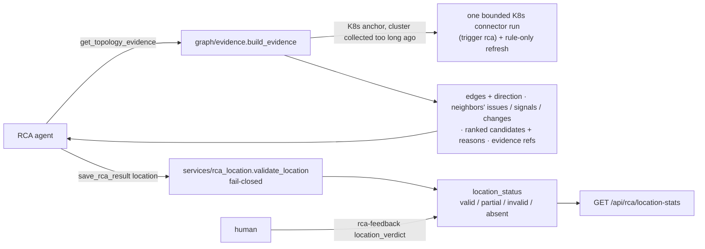

# MVP-2.6.1 — Plan C: RCA 根因定位闭环与评测 Implementation Plan

> **For agentic workers:** REQUIRED SUB-SKILL: Use superpowers:subagent-driven-development (recommended) or superpowers:executing-plans to implement this plan task-by-task. Steps use checkbox (`- [ ]`) syntax for tracking.

**Goal:** RCA 不只说根因"是什么"，也说它"在哪"。
- 新工具 `get_topology_evidence(issue_id)` 按需读已发布的关系图，给出一份确定性的证据包：锚点、带方向标签的边、邻居在时间窗内自己的 Issue / 信号 / 变更、排好序的根因候选和理由。K8s 侧锚点的集群数据太旧时，先做一次有上限的定向重采。
- `save_rca_result` 新增可选的 `location`：最多 3 个带排名的库存资源，加一条从根因到锚点的因果路径。代码按 fail-closed 校验后才入库，并且**只观察**：critic、置信度门槛、auto-fix 都不读它。
- 人工判定（`location_verdict`）和统计端点（`GET /api/rca/location-stats`）形成反馈闭环。
- 策略的爆炸半径改用图的潜在影响计数，默认影子模式：只记录，不参与规则匹配。
- 用 chaos-lab 的 13 个带真值的场景评测，开关 off / on 各跑一批。

**Architecture:**
- `graph/evidence.py` 组装证据包。它只读 Plan A 的 `graph.query_service`（`neighborhood`、`rank_key`、`_observed_refs`），重采走 Plan B 的 `connectors.runner.run_connector(trigger="rca")`，然后调 `build_graph("rca-recollect", llm=False)`。锚点读取和证据组装分在两个会话里，中间夹着重采。
- `services/rca_location.py` 是唯一的校验方：候选必须是本 Issue 同账户的库存行；证据标签 `E<n>` 必须指向本次 RCA 的证据条目；path 的每条边必须是所引构建里的 rule/observed 关系，否则整条 path 丢弃。它同时提供 `location_stats`。
- `tools/metadata_tools.save_rca_result` 调它，结果存进 `RCAResult` 的新列。校验本身出错时记为 invalid，RCA 照常保存。
- `agents/rca_agent.py` 用同一个开关 `rca_topology_context_enabled` 同步注入工具和提示词段落。
- `services/policy_engine.estimate_blast_radius` 改走 `qs.potential_impact`。`policy_blast_radius` 按 `policy_graph_impact_enforce` 决定这个数是喂给规则，还是只记成 `shadow_blast_radius`。修复方案和变更请求两条路都用它。
- 评测 harness 在 `infra/eks-chaos-lab/e2e/`：`ground_truth.yaml`、`location_eval.py`（纯函数）、`test_e2e_location.py`，由 `run-e2e.sh --location-only` 驱动。

**Tech Stack:** Python 3.11、SQLAlchemy 2.x（SQLite 默认 / PostgreSQL）、FastAPI、Strands `@tool`、pytest、bash + kubectl（chaos-lab）。本计划没有前端改动。

**Spec:** `docs/superpowers/specs/2026-09-28-mvp-2.6.1-graph-rca-loop-and-issue-change-design.md`。本计划覆盖：
- §3.C 全部；
- §4 的两处：`rca_results` 的 6 个新列和回填 3；另外加了一列 `cloud_resources.content_changed_at`（见偏差 1）；
- §5 的 `rca_k8s_recollect_min_age_seconds`、`rca_k8s_recollect_timeout_seconds`、`policy_graph_impact_enforce`，以及 `rca_topology_context_enabled` 的新语义；
- §6 的三行：图没有已发布的构建、RCA 定向重采失败、定位引用不合法；
- §7 中证据包、定位校验、人工判定与统计、策略影子模式、`location_eval` 的单测；
- §8 验收标准 3–5（在 Plan E 的联合 E2E 里实测，本计划只交付 harness 和报告模板）。

依赖 Plan A、B 全部完成。

## Global Constraints

- **Python 环境**
  - 一律在项目 `.venv` 里跑：`source /Users/malibo/MyDev/AgenticOps/.venv/bin/activate`。**不要用** `/Users/malibo/MyDev/venv`（starlette 版本坏）。
  - worktree 里没有 `.venv` 和数据库。单个测试这样跑：`cd /Users/malibo/MyDev/AgenticOps/.worktrees/mvp-2.6.1 && source /Users/malibo/MyDev/AgenticOps/.venv/bin/activate && PYTHONPATH=src python -m pytest tests/<file> -v`。下文的 `Run:` 都省略了这段前缀。
- **全量测试**
  - 约 3–4 分钟：`PYTHONPATH=src python -m pytest tests/ -q > /tmp/pytest-full.log 2>&1; tail -20 /tmp/pytest-full.log`。不要把 pytest 直接管进 `tail`。
  - 基线以 Plan A + B 完成后的全量结果为准：Plan B Task 7 在演练树上实测 5750 passed、85 skipped、0 failed。
  - 唯一可能出现的已知假失败是 `tests/test_web_tools.py`（本机 DNS 把 example.com 解析到 198.18.x 时）。
  - **每次**全量回归之前，先在 worktree 里跑一次 `PYTHONPATH=src python -c "from agenticops.models import init_db; init_db()"`（`data/` 在 `.gitignore` 里）。
  - 本计划不建新表：新列都经 Plan A 的 `_ADD_COLUMNS_2_6_1` 加到已有库上，回填是新函数 `_backfill_location_status_2_6_1`。
  - 已知的环境噪音，只报告不处理：跑完全量后，worktree 下会多出 `MagicMock/…/.scheduler.lock`。这是某个既有测试把 `settings.data_dir` mock 成 `MagicMock` 泄漏的，早于本计划；它在 `.gitignore` 之外，**不要** `git add` 它。
- **本地库只读**：`sqlite3 "file:/Users/malibo/MyDev/AgenticOps/data/agenticops.db?mode=ro" "<sql>"`。任何任务都不写这个库。
- **配置**：`config.py` 只定义 schema（`Field(default=…, description="… (AIOPS_X)")`）。值同时写进 `config/settings.yaml`，CLAUDE.md 配置表加行。
- **凭证铁律**
  - RCA 重采只经 `connectors.runner.run_connector`，也就是 Plan B 的 `kubectl_env_for_cluster`，不另起任何 kubectl / boto3 调用。
  - 账户用锚点行自己的账户名寻址（`account=row["account_name"]`），不靠默认账户。
- **提交**
  - 每个 Task 一个 commit，只 `git add` 本 Task 列出的文件。`agent-memory/`、`skills/*/SKILL.md`、`RAW-Idea-latest-v3.md` **绝不**加进来。commit message 末尾加 `Co-Authored-By: Claude Opus 5.5 <noreply@anthropic.com>`。
  - 受保护文件 `RAW-Idea-latest-v3.md`、`RAW-Creative-Idea.md`、`docs/use-cases/*`、`docs/MVP-1.0.0-RELEASE.md` 不碰。
- **云中立**：提示词和面向 agent 的文案（工具 docstring、`TOPOLOGY_EVIDENCE_PROMPT`）只用英文，按概念类别写（cluster / namespace / network），AWS 服务名只作例子。`tests/test_rca_topology_injection.py` 守住这一条。
- **行号**：文中行号是在"Plan A、B 全部落地"的树上量的，**以文字锚点为准**。
- Spec §9 原文：「每个任务一个 commit，**不 push**，直到 E 的联合 E2E 通过且用户确认。执行中发现计划与代码不符时，修计划里的锚点，不改契约名。」

## Review Focus

以下八类输入 spec 隐含要求，但按字面实现时最容易漏掉。每条对应的测试写在所属 Task 里：

1. **定位校验 fail-closed，丢的只是不合法的部分。** 以下情况只丢对应的那一项：候选 ref 不存在、不在 Issue 的账户里、不是 int（`True` 也不算）、排名重复或越界；证据标签不是本次 RCA 的 `E<n>`。
   - path 只要有一条边不合法，就整条丢弃。边合法的条件是：属于所引构建，provenance 为 rule/observed，同账户。Issue 没锚定或没有已发布的构建时，path 也丢弃。
   - 一个候选都没剩下时状态为 invalid，但 RCA 本身照常保存；校验代码自己抛异常也一样。

   → Task 3 `test_foreign_missing_and_non_int_refs_are_dropped`、`test_ranks_must_be_distinct_one_to_three_and_are_not_renumbered`、`test_evidence_labels_must_name_this_rcas_evidence`、`test_one_bad_edge_drops_the_whole_path`、`test_path_is_checked_against_the_given_build`、`test_a_failed_check_never_loses_the_rca`
2. **RCA 不能用自己要保存的文本给自己 grounding。** evidence check 之前把 `save_rca_result` 的输入也算成工具轨迹。这份输入里就有正在被检查的证据列表，结果任何 ref 都能"命中"。新的 `graph` 证据类型会让这个洞变得很显眼。→ Task 3 `tests/test_rca_quality.py::…::test_save_rca_result_input_does_not_ground_itself`
3. **图说不了话，不等于没问题。**
   - 以下情况都返回 `available:false` 加原因，并且原文写明 "this is not 'no problem found'"：未锚定、`ambiguous`（同时列出候选）、锚点行不在了或属于别的账户（`stale_ref`）、没有已发布的构建。
   - 工具内部抛异常也转成 `available:false`，不中断 RCA。

   → Task 2 `test_not_anchored_is_never_no_problem_found`、`test_ambiguous_lists_the_candidates`、`test_gone_or_foreign_anchor_row_is_stale_ref`、`test_no_published_build`、`test_tool_turns_an_exception_into_unavailable`
4. **重采有上限、有限流，失败不中断。**
   - 只在集群上次成功采集早于 min age 时才跑。min age 同时就是同一集群的限流。
   - 结构有变化时才刷新图；刷新只用规则，不调 LLM。
   - 失败时 freshness 标为 `stale` 并写明原因，然后用已有数据继续。
   - 锚点读取和证据组装分在两个会话里：SQLite 上一个打开的读事务会挡住重采的写。

   → Task 2 `test_old_collection_triggers_a_bounded_recollect_and_a_rule_only_refresh`、`test_unchanged_recollect_skips_the_graph_refresh`、`test_recent_collection_is_not_recollected`、`test_failed_recollect_marks_the_evidence_stale_and_goes_on`
5. **工具和提示词同开同关。** 开关关掉时，RCA 既看不到工具，也看不到提示词段落（一个 agent 绝不能看到它用不了的工具）。但基础提示词里"给出可校验的 location"这一句两批都在，否则 off 批就没有可比的基线。→ Task 4 `test_prompt_follows_flag`、`test_tool_follows_flag`、`test_rca_agent_composition_flag_on` / `_off`、`test_base_prompt_asks_for_a_checked_location_either_way`
6. **人工判定：判定人取自会话，没有可判的定位就拒绝。**
   - `location_verdict` 的判定人是 `actor.key`，请求体里写什么都不用；匿名 Web 用户记为 `web:anonymous`。
   - 最新 RCA 的 `location_status` 不是 valid / partial 时返回 409。
   - 两个 verdict 都没给时返回 422。单给 `location_verdict` 不改结论的 verdict。

   → Task 5 `test_location_verdict_alone_names_the_anonymous_judge`、`test_the_judge_is_the_session_actor`、`test_a_location_with_no_candidate_cannot_be_judged`、`test_a_body_without_a_legal_verdict_is_rejected`
7. **影子模式真的是影子。** 默认情况下，喂给 `blast_radius_gte` 的仍是 None，算出的数只进 `shadow_blast_radius`。变更请求取最宽的那个目标，避免一个小的首目标掩盖一次大范围变更。→ Task 6 `test_shadow_mode_records_the_count_and_feeds_none`、`test_fix_path_shadow_mode_leaves_the_rule_asleep`、`test_change_path_uses_the_widest_target`
8. **评测里每次运行都必须新建 Issue。** 被 Signal Gate 合并或判为重复的运行无效：重试一次，仍无效就记录下来，不计入比率，并让这条用例失败。它不能悄悄变成一次"未命中"。→ Task 7 `test_summarize`（无效运行不进分母）、`test_e2e_location.py::_attempt`

## 跨计划接口契约

### 本计划产出（Plan D、E 依赖这些名字，不可改）

| 符号 | 位置 | 说明 |
|---|---|---|
| `get_topology_evidence(issue_id, depth=None, window_minutes=None) -> str`（`@tool`，JSON）、`build_evidence(issue_id, *, depth=None, window_minutes=None) -> dict`、`EDGE_PREFIX = "graph:edge:"`、`NODE_PREFIX = "graph:node:"`、`edge_ref(src, dst, relation_type)`、`node_ref(ref)`、`CONTAINER_TYPES`、`K8S_CONNECTOR = "k8s"` | `agenticops.graph.evidence` | 证据包的键：`available`、`anchor`、`build_id`、`depth`、`window`、`edges[]`（`direction_label`、`evidence_ref`）、`neighbors[]`、`candidates[]`（`rank`、`reasons`、`evidence_ref`）、`truncated`、`truncated_reason`、`freshness`；`available:false` 时是 `reason` + `detail` |
| `validate_location(session, issue, location, evidence_count) -> (location, status, build_id)`、`location_stats(session, days) -> dict`、`VALID` / `PARTIAL` / `INVALID` / `ABSENT`、`LOCATION_STATUSES`、`LOCATION_VERDICTS = ("correct", "partial", "incorrect")`、`MAX_CANDIDATES = 3`、`PATH_PROVENANCE` | `agenticops.services.rca_location` | `location_stats` 的键：`days`、`top1`、`judged`、`anchoring_rate`、`issues_with_resource_id`、`anchor_status_counts`、`location_status_counts` |
| `RCAResult.location`（`{"candidates": [{ref, rank, type, name, resource_id, supporting, refuting}], "path": [{src_ref, src_name, dst_ref, dst_name, relation_type, provenance}], "dropped": [str]}`）、`location_status`、`location_build_id`、`location_verdict`、`location_verdict_by`、`location_verdict_at` | `agenticops.models` | E 的 IssueDetail 读它们；`RCAResultResponse`（`web/schemas.py`）同名字段 |
| `CloudResource.content_changed_at` | `agenticops.models` | ingest 在已有行内容哈希变化时写 |
| `POST /api/health-issues/{id}/rca-feedback` body `{verdict?, location_verdict?, note?}` → `{rca_id, verdict, location_verdict, message}`（422 两者都缺 / 404 无 RCA / 409 无可判定位）；`GET /api/rca/location-stats?days=`（1–365，默认 30）→ `location_stats(...)` | `agenticops.web.app` | E 的 IssueDetail 定位卡片和统计消费 |
| `estimate_blast_radius(ref, account_id, session=None) -> int \| None`（参数改成库存主键 + 我方账户主键）、`policy_blast_radius(refs, account_id, session=None) -> (blast_radius, shadow_blast_radius)`、`PolicyDecision.shadow_blast_radius` | `agenticops.services.policy_engine` | E 的审批卡展示 `shadow_blast_radius`；D 的变更入口经 `change_service.evaluate_policy` 自动带上 |
| `TOPOLOGY_EVIDENCE_PROMPT`、`topology_evidence_prompt()`、`topology_evidence_tools()` | `agenticops.agents.rca_agent` | 同一开关 |
| settings：`rca_k8s_recollect_min_age_seconds`（120）、`rca_k8s_recollect_timeout_seconds`（60）、`policy_graph_impact_enforce`（false） | `agenticops.config` | |
| `AgenticOpsClient.post(path, json=None, headers=None, timeout=None)`、`run_chaos(rel_cmd, capture=False) -> str`、`location_eval`（`parse_k8s_id`、`accept_keys`、`dynamic_keys`、`hit_rank`、`graph_recall`、`load_cases`、`load_default_cases`、`summarize`、`render`、`main`） | `infra/eks-chaos-lab/e2e/` | E 的联合 E2E 用 `run-e2e.sh --location-only` 跑两批 |

### 本计划消费（Plan A、B 与既有代码）

- Plan B：
  - `connectors.runner.run_connector(name, *, account, scope, trigger, timeout_seconds)`，返回的 `ConnectorRunResult` 的 `status`、`targets[].error`、`changed`；
  - `connectors.ingest.last_success_at(session, connector, account_id, scope)`，以及它认作成功的 `SUCCESS_STATUSES`；
  - `ingest` 里内容哈希变化的分支（本计划在这里写 `content_changed_at`）；
  - K8s 连接器的 `raw_data` 契约（本计划加 `created_at`）。
- Plan A：
  - `galaxy.builder.build_graph(trigger, full, llm)`，`"rca-recollect"` 在 `RULE_ONLY_TRIGGERS` 里；
  - `graph.query_service`：`neighborhood`、`potential_impact`、`published_build_id`、`rank_key`、`_observed_refs`、`_naive_utc`，以及 `Subgraph.nodes` / `.edges` / `.build_id` / `.truncated` / `.truncated_reason`；
  - `graph.relations.default_relations`；`galaxy.rules.short_id`；`galaxy.models.ResourceRelation`；
  - `services.identity_resolver.ANCHORED` / `ACCOUNT_LEVEL` / `AMBIGUOUS` / `UNANCHORED`；
  - `HealthIssue.resource_ref` / `anchor_status` / `anchor_candidates` / `observed_at`；
  - `models._ADD_COLUMNS_2_6_1` 与 `_backfill_anchor_2_6_1`（本计划的回填紧跟其后）。
- 既有：
  - `services.rca_quality._tool_trace_text`（evidence check 的轨迹）；
  - `auth.actor.current_actor` / `Actor.key`；
  - `PolicyDecision.to_dict`；
  - chaos-lab 的 `scenarios.yaml`、`faults-l2/l2-faults.sh`、`e2e/scenarios/*.sh`。

## 可达面（六个面逐行）

| 面 | Plan C |
|---|---|
| CLI | 非目标：定位、判定和统计都不加命令。`aiops chat` 里的 RCA 自动获得新工具，但这不算一个新面 |
| Web API | 做：`POST /api/health-issues/{id}/rca-feedback` 新增可选 `location_verdict`（`verdict` 改为可选，两者至少给一个）；新增 `GET /api/rca/location-stats?days=`（1–365）；`GET /api/health-issues/{id}/rca` 的响应多出 6 个 `location*` 字段 |
| Web UI | 无 UI，理由：定位卡片（候选、路径、判定按钮）和统计在 Plan E 的 IssueDetail / Dashboard 上做，本计划的端点就是它们的数据源。审批卡上的 `shadow_blast_radius` 同样放在 Plan E |
| Agent tool | 做：RCA agent 新增 `get_topology_evidence`，由 `rca_topology_context_enabled` 控制，和提示词段落同开同关；`save_rca_result` 新增可选参数 `location`，证据类型新增 `graph` |
| Schedule | 非目标：不新增调度。RCA 重采用的是 Plan B 的 runner（trigger `rca`），不经调度器 |
| Notification | 非目标 |

## 与 spec 的偏差（执行前知悉，已在 Task 里落实）

**变更检测（Task 1）**

1. **新增 `cloud_resources.content_changed_at`**，spec §4 没有列这一列。spec 要求"结构内容哈希在窗口内变过"算变更，但哈希只存在当前值里，没有时间。ingest 在一行已有数据的哈希变化时写上当前时间，新建行不写。只写扫描路径的行保持 NULL。
2. **K8s 行的 `raw_data` 多一个 `created_at`**（`metadata.creationTimestamp`，只在有值时写）。它加进 `VOLATILE_KEYS`，不影响内容哈希，也没有规则读它。证据包自己读它，判断"窗口内新建"。

**证据包（Task 2）**

3. **fresh 的含义是"采集时间不早于时间窗起点"**。spec 只说了 `fresh` / `stale`。K8s 侧锚点取集群最近一次成功采集的时间；其他锚点取这一行自己的 `scanned_at`。从没采集过也算 stale。
4. **重采**：`run_connector("k8s", account=<锚点账户名>, scope=<集群>, trigger="rca", timeout_seconds=…)`，结构有变化并且 `galaxy_enabled` 时才调 `build_graph(trigger="rca-recollect", full=False, llm=False)`。
   - min age 同时就是限流：上次成功采集还在 min age 以内时不重采。
   - 锚点读取、重采、证据组装各用各的会话。原因是 SQLite 上一个打开的读事务会挡住重采的写（Review Focus 第 4 条）。
5. **`window_minutes` 只移动窗口起点**，向后仍取配置的 `rca_topology_window_after_minutes`；小于 1 的值按配置默认处理。`depth` 夹在 `1..graph_query_max_depth` 之间。
6. **锚点自己也可以是候选**（理由里写 "the anchor itself"）。例如 Deployment 锚点自己的 pod 起不来时，它本身就是根因。
7. **证据引用写成 `graph:edge:<src>><dst>:<relation_type>` 和 `graph:node:<ref>`**。RCA 引用时证据类型写 `graph`，ref 写这个字符串；evidence check 在工具输出里找得到它，所以能 grounding。

**定位校验（Task 3）**

8. **证据标签是 `E<n>`，从 1 开始**，对应 `evidence` 列表的第 n 项。大小写和首尾空格都容忍，存储时统一成规范形式。
9. **path 按 `build_id` 校验**：用调用方给的 `location.build_id`；没给时用当前已发布的构建。
   - 边的 provenance 只接受 rule 和 observed，并且边必须和 Issue 同账户。
   - 老 Issue 只有 `resource_ref`、没有 `anchor_status` 时算已锚定，和证据包的判定一致。
   - 存下来的每条边都内联两端名称，构建被清理后照样可读。
10. **Task 3 排在 Task 4 之前**：先让 `save_rca_result` 接受并校验 `location`，再让提示词去要它。反过来，中间那个提交会让 agent 被要求交一个工具不认的参数。
11. **自 grounding 修复**：`_tool_trace_text` 不再包含 `save_rca_result` 自己的输入（Review Focus 第 2 条）。这是在写计划时发现的既有缺陷，spec 没提，但 `graph` 证据类型让它无法回避。
12. **校验出错不丢 RCA**：`validate_location` 抛异常时记为 invalid，`dropped` 里写 `location check failed — <异常类型>`，RCA 照常保存。`save_rca_result` 的回复会带上 location 状态，以及最多 3 条被丢原因（多出的写 `(+N more)`）。

**注入（Task 4）**

13. **提示词预算从 8000 调到 10500 token**（`tests/test_prompt_budget.py`），按开关打开时最大的提示词量。新增的内容是 `save_rca_result` 的 location 说明和 `TOPOLOGY_EVIDENCE_PROMPT`。

**判定与统计（Task 5）**

14. **`top1 = correct / 已判定`，partial 判定不算命中**。`anchoring_rate` 的分子是 anchored + account_level，分母是有 `resource_id` 的 Issue，分母为 0 时返回 None。时间窗过滤方式：RCA 按 `created_at`，Issue 按 `detected_at`。
15. **409 / 422**：最新 RCA 没有 valid / partial 的定位时，`location_verdict` 返回 409；两个 verdict 都没给时返回 422。审计记录多了 `location_verdict` 和 `by`。

**策略（Task 6）**

16. **影子模式是默认**：`policy_blast_radius` 返回 `(None, count)`，打开 `policy_graph_impact_enforce` 后才返回 `(count, None)`。`shadow_blast_radius` 只在影子模式下有值。
17. **变更请求取最宽的目标**（所有 `target_resources[].db_id` 里计数最大的），不再只看第一个。修复方案看 Issue 的 `resource_ref`。
18. **`estimate_blast_radius` 的签名变了**：参数从云原生 `resource_id` + 12 位账号，改成库存主键 + 我方账户主键。旧实现读的 `GraphStore` 是空的，实际上一直返回 None，所以不存在"旧行为"需要兼容。`_find_graph_node` 和 `simulate_fix_impact` 不动（spec：非目标）。
19. **已知缺口**：打开 enforce 后，`blast-radius-escalation` 规则生效，但决策的 `reasons` 里不会写"图算出的计数是多少"，只有规则名。影子期间用 `shadow_blast_radius` 观察；打开前在 Plan E 的审批卡上补展示。

**评测（Task 7）**

20. **锚点和召回用两次不同的 focus 查询**：锚点用 `issue_id=…&depth=1&node_cap=1`；召回用 `resource_id=<锚点 ref>&depth=2&node_cap=10000&edge_cap=50000&include_llm=false`。原因是 `issue_id` 形式会按 Issue 类别过滤关系，K8s 的 contains 边可能被滤掉，召回就会系统性偏低。
21. **ref → (kind, namespace, name) 的映射取自 `/api/resources?q=<集群>/`**，只认 K8s 形式的 resource_id。
22. **每个用例最多两次尝试**（`ATTEMPTS = 2`）。无效运行记录进结果文件，不进分母，并让用例失败（Review Focus 第 8 条）。
23. **Issue 用 resolved 关闭，不用 dismissed**：dismissed 会让 detect agent 把这个故障学成误报。描述末尾追加 "eval teardown"。
24. **评测环境比 spec 多两个变量**：`AIOPS_AUTO_FIX_ENABLED=false`、`AIOPS_RAG_PIPELINE_ENABLED=false`。这样一次运行既不会改集群，也不会写知识库。preflight 断言 `auto_fix_enabled` 确实为 false。
25. **批次切换用 `kubectl set env` 加 `rollout status`，并且在建隧道之前做**：重启会换掉 port-forward 绑定的那个 pod。清理时 unset 这些变量。
26. **每次重启都会清空 app 的数据库**（emptyDir），所以模块级 preflight 每批都重新接入：先扫描资源，再跑 K8s 连接器，最后构建图（409 时重试）。
27. **RCA 完成后再跑一次连接器，然后才测召回**：故障期间创建或删除的对象要先进库存、进图。
28. **动态真值**有两种：`from_stdout`（node-drained：用正则从注入脚本输出里取节点名）和 `from_pod_node`（resource-stress：stress-test pod 所在的 Node）。
29. **L2 场景的 `settle_s` 是 60 秒**，其他默认 10 秒。**resource-stress 的真值 kind 写 `Pod`**：真值匹配 resource_id 里的 Kind 段，而 K8s 的 resource_id 用的是 K8s kind，不是 `K8s_Pod` 这个库存类型。
30. **清理时恢复 L2 故障、CoreDNS 和被删的 Service**，不只是 `restore-all.sh`。
31. **新增 `located` 指标**：`location_status ∈ {valid, partial}` 的比例，对应验收标准 4。
32. **spec §10 风险 7（L2 脚本是否产生与声明一致的真实告警）不再是风险**：harness 总是自己发声明的告警，不依赖脚本触发真实告警。

**文档（Task 8）**

33. **文档集中在一个提交里**。Task 4 已经顺手改了 `rca_topology_context_enabled` 在 CLAUDE.md / WORKFLOW.md 里的说明，因为那是这个开关的语义变化。
34. **Web UI 无 UI**（见可达面）。`docs/README.md` 文档地图里 2.6.1 的那一行留给 Plan E，和发布说明一起写。

## File Structure

| 文件 | 责任 | Task |
|---|---|---|
| `src/agenticops/models.py` | `CloudResource.content_changed_at`；`RCAResult` 的 6 个 location 列；迁移表项与回填 | 1, 3 |
| `src/agenticops/connectors/ingest.py`、`connectors/k8s.py`、`galaxy/hashing.py`、`galaxy/rules.py` | 写 `content_changed_at`；`raw_data.created_at`（易变键） | 1 |
| `src/agenticops/graph/evidence.py`（新） | 证据包、定向重采、`get_topology_evidence` | 2 |
| `src/agenticops/services/rca_location.py`（新） | 定位校验（Task 3）；`location_stats`（Task 5） | 3, 5 |
| `src/agenticops/tools/metadata_tools.py`、`services/rca_quality.py`、`web/schemas.py` | `save_rca_result(location=)`；自 grounding 修复；响应字段 | 3 |
| `src/agenticops/agents/rca_agent.py` | 工具与提示词同开同关 | 4 |
| `src/agenticops/web/app.py` | `location_verdict`、`/api/rca/location-stats` | 5 |
| `src/agenticops/services/policy_engine.py`、`change_service.py`、`pipeline_service.py`、`config/policies.yaml` | 潜在影响爆炸半径、影子模式 | 6 |
| `src/agenticops/config.py`、`config/settings.yaml` | 三个配置项 | 2, 6 |
| `infra/eks-chaos-lab/e2e/ground_truth.yaml`、`location_eval.py`、`test_e2e_location.py`（新）、`client.py`、`conftest.py`、`run-e2e.sh`、`README.md` | 评测 harness | 7 |
| `docs/MVP-2.6.1-LOCATION-EVAL-REPORT.md`（新） | 评测报告模板 | 7 |
| `CLAUDE.md` | 配置表（2、4、6）；架构与模块表（8） | 2, 4, 6, 8 |
| `docs/WORKFLOW.md` | 开关语义（4）；新章节、curl、runbook（8） | 4, 8 |
| `README.md`、`README_CN.md` | 文档 | 8 |

---

### Task 1: 变更检测：`content_changed_at` 与 K8s 的 `created_at`

**Files:**
- Modify: `src/agenticops/models.py:220`（`CloudResource` 加列）、`:1414`（`_ADD_COLUMNS_2_6_1`）
- Modify: `src/agenticops/connectors/ingest.py:4`（docstring）、`:100`（内容哈希变化的分支）
- Modify: `src/agenticops/connectors/k8s.py:244`、`src/agenticops/galaxy/hashing.py:14`（`VOLATILE_KEYS`）、`src/agenticops/galaxy/rules.py:228`（`K8S_RAW_DATA_CONTRACT` 注释）
- Test: `tests/test_connector_ingest.py`、`tests/test_k8s_connector.py`、`tests/test_migration_2_6_1.py`

**Interfaces:**
- Consumes:
  - Plan B 的 `connectors.ingest`：已有行内容哈希变化的那个分支（`if before != after:`）；
  - Plan B 的 K8s 连接器 `raw_data` 契约，以及 `galaxy.hashing.VOLATILE_KEYS`；
  - Plan A 的 `models._ADD_COLUMNS_2_6_1`（新列经它加到已有库上）。
- Produces:
  - `CloudResource.content_changed_at`：只在已有行的内容哈希变化时由 ingest 写成当前时间，新建行和扫描路径的行保持 NULL；
  - K8s 行的 `raw_data["created_at"]`（`metadata.creationTimestamp`，只在有值时写），它在 `VOLATILE_KEYS` 里，不影响内容哈希；
  - 这两个都供 Task 2 的证据包判断"窗口内变过 / 窗口内新建"。

- [ ] **Step 1: 写失败测试**

三处：ingest 只在哈希变化时写 `content_changed_at`；K8s 连接器写 `created_at` 且它不影响哈希；迁移把新列加到已有库上。

`tests/test_connector_ingest.py`，在下面这段（第 114–116 行）之后：

```
    assert res.changed is True


```

插入：

```python
def test_content_changed_at_moves_only_with_the_content_hash(db):
    """Plan C reads content_changed_at as "changed in the RCA window": set when an existing row's hash moves,
    never on create, never for volatile churn (pod_summary, created_at)."""
    same = _row(db, "Deployment", "same")
    moved = _row(db, "Deployment", "moved")
    churn = _row(db, "Deployment", "churn")
    raw_moved = {"cluster": "lab", "namespace": "default", "selector": {"app": "moved"}}
    raw_churn = {"cluster": "lab", "namespace": "default", "pod_summary": {"ready": 0},
                 "created_at": "2026-09-29T09:00:00Z"}
    ingest(CONN, _target(), CollectResult(
        entities=[_obs("Deployment", "same"), _obs("Deployment", "moved", raw=raw_moved),
                  _obs("Deployment", "churn", raw=raw_churn), _obs("Deployment", "new")],
        completeness=_complete("Deployment")), trigger="schedule")
    assert _get(db, same).content_changed_at is None
    assert _get(db, churn).content_changed_at is None
    changed_at = _get(db, moved).content_changed_at
    assert datetime.now(timezone.utc).replace(tzinfo=None) - changed_at < timedelta(minutes=1)
    new = db.query(CloudResource).filter_by(resource_id="lab/Deployment/default/new").one()
    assert new.content_changed_at is None


```

`tests/test_k8s_connector.py`，在`assert rows["lab/DaemonSet/shop/agent"].raw_data["replicas"] == 2`（:207）之后插入：

```python


def test_created_at_is_the_creation_timestamp_only_when_present():
    listing = _listing()
    listing["deployments.apps"][0]["metadata"]["creationTimestamp"] = "2026-09-29T09:55:00Z"
    result, _, _ = _collect(_FakeKubectl(listing))
    rows = _by_id(result)
    assert rows["lab/Deployment/shop/web"].raw_data["created_at"] == "2026-09-29T09:55:00Z"
    assert "created_at" not in rows["lab/Service/shop/web"].raw_data
```

`tests/test_migration_2_6_1.py`（:36，`_MIGRATION_DDL`），把：

```python
    r"ADD COLUMN (IF NOT EXISTS )?(resource_ref|anchor_status|anchor_candidates|observed_at|absent_since|rules_published_at)"
```

改成：

```python
    r"ADD COLUMN (IF NOT EXISTS )?(resource_ref|anchor_status|anchor_candidates|observed_at|absent_since"
    r"|content_changed_at|rules_published_at)"
```

`tests/test_migration_2_6_1.py`（第 101 行），把：

```python
    assert "absent_since" in _cols(engine, "cloud_resources")
```

改成：

```python
    assert {"absent_since", "content_changed_at"} <= _cols(engine, "cloud_resources")
```

`tests/test_migration_2_6_1.py`，在下面这一行（第 163 行）之后：

```
    assert "ALTER TABLE cloud_resources ADD COLUMN IF NOT EXISTS absent_since TIMESTAMP WITHOUT TIME ZONE" in stmts
```

插入：

```python
    assert "ALTER TABLE cloud_resources ADD COLUMN IF NOT EXISTS content_changed_at TIMESTAMP WITHOUT TIME ZONE" in stmts
```

- [ ] **Step 2: 跑测试确认失败**

Run: `PYTHONPATH=src python -m pytest tests/test_connector_ingest.py tests/test_k8s_connector.py tests/test_migration_2_6_1.py -v`
Expected: FAIL（4 failed、37 passed）：
- `test_content_changed_at_moves_only_with_the_content_hash`：`AttributeError: 'CloudResource' object has no attribute 'content_changed_at'`；
- `test_created_at_is_the_creation_timestamp_only_when_present`：`KeyError: 'created_at'`；
- `test_migration_2_6_1.py` 的两个用例：列集合里没有 `content_changed_at`，PG 语句里也没有 `ALTER TABLE cloud_resources ADD COLUMN IF NOT EXISTS content_changed_at …`。

通过的 37 个是这三个文件里的既有用例。

- [ ] **Step 3: 加列并写入**

`src/agenticops/models.py`，在`absent_since: Mapped[Optional[datetime]] = mapped_column(DateTime, nullable=True)`（:220）之后插入：

```python
    # MVP-2.6.1: set by connectors/ingest when an existing row's content hash moves (never on create); read by
    # graph/evidence as "changed in the RCA window". Rows written only by the scan path stay NULL.
    content_changed_at: Mapped[Optional[datetime]] = mapped_column(DateTime, nullable=True)
```

`src/agenticops/models.py`（第 1417 行），把：

```python
    "cloud_resources": {"absent_since": None},
```

改成：

```python
    "cloud_resources": {"absent_since": None, "content_changed_at": None},
```

`src/agenticops/connectors/ingest.py`（第 4 行），把：

```python
  absent_since cleared. The build-written raw_data["unresolved_refs"] survives the overwrite.
```

改成：

```python
  absent_since cleared. The build-written raw_data["unresolved_refs"] survives the overwrite. An existing row
  whose content hash moved gets content_changed_at = now (the RCA evidence reads it; Plan C).
```

`src/agenticops/connectors/ingest.py`，在下面这段（第 101–102 行）之后：

```
            if before != after:
                changed = True
```

插入：

```python
                row.content_changed_at = now
```

`src/agenticops/connectors/k8s.py`，在`raw = {"cluster": scope, "namespace": ns, "labels": dict(md.get("labels") or {}), **_fields(kind, obj)}`（:244）之后插入：

```python
            if md.get("creationTimestamp"):
                raw["created_at"] = str(md["creationTimestamp"])
```

`src/agenticops/galaxy/hashing.py`（第 13–14 行），把：

```python
    # K8s (MVP-2.6.1): rolled-up pod status changes every collection; unresolved_refs is written by the build.
    "pod_summary", "unresolved_refs",
```

改成：

```python
    # K8s (MVP-2.6.1): rolled-up pod status changes every collection; unresolved_refs is written by the build;
    # created_at (metadata.creationTimestamp) is read on its own by the RCA evidence, like CreateTime above.
    "pod_summary", "unresolved_refs", "created_at",
```

`src/agenticops/galaxy/rules.py`（第 228 行），把：

```python
#                        labels: {str: str}
```

改成：

```python
#                        labels: {str: str}; created_at: str  metadata.creationTimestamp, only when present
#                                                     (volatile: not in the content hash; no rule reads it)
```

- [ ] **Step 4: 跑测试确认通过**

Run: `PYTHONPATH=src python -m pytest tests/test_connector_ingest.py tests/test_k8s_connector.py tests/test_migration_2_6_1.py -v`
Expected: PASS（41 passed）。

- [ ] **Step 5: 全量回归**

先在 worktree 里跑一次 `PYTHONPATH=src python -c "from agenticops.models import init_db; init_db()"`（Global Constraints），然后：

Run: `PYTHONPATH=src python -m pytest tests/ -q > /tmp/pytest-full.log 2>&1; tail -20 /tmp/pytest-full.log`
Expected: 全绿（演练树上实测 5748 passed、85 skipped、3 warnings in 206.73s (0:03:26)；本机 DNS 把 example.com 解析到 198.18.x 时，`tests/test_web_tools.py` 有一个已知假失败）。

- [ ] **Step 6: Commit**

```bash
git -C /Users/malibo/MyDev/AgenticOps/.worktrees/mvp-2.6.1 add src/agenticops/models.py src/agenticops/connectors/ingest.py src/agenticops/connectors/k8s.py \
  src/agenticops/galaxy/hashing.py src/agenticops/galaxy/rules.py tests/test_connector_ingest.py \
  tests/test_k8s_connector.py tests/test_migration_2_6_1.py
git -C /Users/malibo/MyDev/AgenticOps/.worktrees/mvp-2.6.1 commit -m "feat(connectors): content_changed_at on a moved content hash; K8s rows keep created_at (volatile)

Co-Authored-By: Claude Opus 5.5 <noreply@anthropic.com>"
```

---

### Task 2: 拓扑证据包 `get_topology_evidence` 与有上限的 K8s 定向重采

**Files:**
- Create: `src/agenticops/graph/evidence.py`
- Modify: `src/agenticops/config.py:598`、`config/settings.yaml:298`（`rca_k8s_recollect_min_age_seconds`、`rca_k8s_recollect_timeout_seconds`）
- Modify: `CLAUDE.md:225`（配置表）
- Test: `tests/test_topology_evidence.py`（新）、`tests/test_rca_graph_config.py`（新）

**Interfaces:**
- Consumes:
  - Plan A 的 `graph.query_service`：`published_build_id`、`neighborhood(ref, depth=, relation_types=)`、`rank_key`、`_observed_refs`、`_naive_utc`，以及 `Subgraph` 的 `nodes` / `edges` / `build_id` / `truncated` / `truncated_reason`；
  - Plan A 的 `graph.relations.default_relations`、`galaxy.rules.short_id`、`services.identity_resolver` 的四个锚定状态、`HealthIssue.resource_ref` / `anchor_status` / `anchor_candidates` / `observed_at`；
  - Plan A 的 `galaxy.builder.build_graph(trigger="rca-recollect", full=False, llm=False)`（`"rca-recollect"` 在 `RULE_ONLY_TRIGGERS` 里）；
  - Plan B 的 `connectors.runner.run_connector(...)` 与 `ConnectorRunResult` / `TargetRun`、`connectors.ingest.last_success_at`；
  - Task 1 的 `CloudResource.content_changed_at`、`raw_data["created_at"]`；
  - 既有的 `ChangeRequest`、`FixPlan`、`FixExecution`、`HealthIssue`、`AlertEvent`（窗口内的变更与信号），`settings.rca_topology_window_before_minutes` / `_after_minutes`、`graph_query_max_depth`、`galaxy_enabled`。
- Produces（`agenticops.graph.evidence`）：
  - `build_evidence(issue_id, *, depth=None, window_minutes=None) -> dict`，`@tool get_topology_evidence(issue_id, depth=None, window_minutes=None) -> str`（JSON）；
  - `EDGE_PREFIX = "graph:edge:"`、`NODE_PREFIX = "graph:node:"`、`edge_ref(src, dst, relation_type)`、`node_ref(ref)`、`CONTAINER_TYPES`、`K8S_CONNECTOR = "k8s"`；
  - `settings.rca_k8s_recollect_min_age_seconds`（120）、`settings.rca_k8s_recollect_timeout_seconds`（60）。

- [ ] **Step 1: 写失败测试**

`tests/test_topology_evidence.py`：

```python
"""get_topology_evidence (MVP-2.6.1 Plan C Task 2): the RCA's graph evidence package around an issue's anchor."""
import json
from datetime import datetime, timedelta, timezone

import pytest

from agenticops.config import settings
from agenticops.connectors.runner import ConnectorRunResult, TargetRun
from agenticops.galaxy.models import GalaxyBuild, ResourceRelation
from agenticops.graph import evidence as ev
from agenticops.graph import query_service as qs
from agenticops.models import (Base, ChangeRequest, CloudAccount, CloudResource, ConnectorRun, FixExecution, FixPlan,
                               HealthIssue, RCAResult, get_session)

NOW = datetime.now(timezone.utc).replace(tzinfo=None, microsecond=0) - timedelta(seconds=5)
CLUSTER_ARN = "arn:aws:eks:us-east-1:111111111111:cluster/prod"


@pytest.fixture
def db(tmp_path):
    import agenticops.models as models_mod
    models_mod._engine = None
    settings.database_url = f"sqlite:///{tmp_path}/evidence.db"
    engine = models_mod.get_engine()
    Base.metadata.create_all(engine)
    qs.clear_cache()
    s = get_session()
    yield s
    s.close()
    qs.clear_cache()
    models_mod._engine = None


def _res(s, rid, acct, rtype, resource_id, provider="aws", **kw):
    s.add(CloudResource(id=rid, account_id=acct, provider=provider, region="us-east-1", resource_type=rtype,
                        resource_id=resource_id, name=resource_id, tags={}, raw_data=kw.pop("raw_data", {}),
                        scanned_at=kw.pop("scanned_at", NOW - timedelta(minutes=1)), **kw))


def _rel(s, src, dst, rtype, *, acct=1):
    s.add(ResourceRelation(build_id=1, account_id=acct, src_ref=src, dst_ref=dst, relation_type=rtype,
                           provenance="rule", evidence={"text": f"{src}-{dst}"}))


def _issue(s, ref, severity="high", acct=1, issue_type="cpu_spike", **kw):
    kw.setdefault("anchor_status", "anchored" if ref else None)
    issue = HealthIssue(resource_id=f"r-{ref}", resource_ref=ref, account_id=acct, severity=severity, status="open",
                        source="test", title="t", description="d", issue_type=issue_type, **kw)
    s.add(issue)
    s.flush()
    return issue.id


@pytest.fixture
def seed(db):
    """acct-a: VPC(1) contains Subnet(2) contains EC2(3); EC2 secured_by SG(4); ELB(5) routes_to EC2;
    EKS cluster prod(10) contains Deployment web(11). acct-b: EC2(7). Issue #1 is on the EC2."""
    db.add_all([CloudAccount(id=1, name="acct-a", provider="aws", credentials={}),
                CloudAccount(id=2, name="acct-b", provider="aws", credentials={})])
    for rid, acct, rtype, name in [(1, 1, "VPC", "vpc-1"), (2, 1, "Subnet", "subnet-1"), (3, 1, "EC2", "i-1"),
                                   (4, 1, "SecurityGroup", "sg-1"), (5, 1, "ELB", "alb"), (7, 2, "EC2", "i-7"),
                                   (10, 1, "EKS", CLUSTER_ARN)]:
        _res(db, rid, acct, rtype, name)
    _res(db, 11, 1, "K8s_Deployment", "prod/default/Deployment/web", provider="kubernetes",
         raw_data={"cluster": "prod", "created_at": (NOW - timedelta(minutes=4)).isoformat() + "Z",
                   "pod_summary": {"ready": 1, "desired": 3, "waiting_reasons": ["ImagePullBackOff"]}})
    db.add(GalaxyBuild(id=1, status="completed", trigger="manual", rules_published_at=NOW))
    db.flush()
    _rel(db, 1, 2, "contains")
    _rel(db, 2, 3, "contains")
    _rel(db, 3, 4, "secured_by")
    _rel(db, 5, 3, "routes_to")
    _rel(db, 10, 11, "contains")
    _issue(db, 3, observed_at=NOW, first_seen=NOW - timedelta(minutes=5))
    db.commit()
    return db


def _run(db, at, status="complete", acct=1, scope="prod"):
    db.add(ConnectorRun(connector="k8s", account_id=acct, scope=scope, trigger="schedule", started_at=at,
                        finished_at=at, status=status, counts={}, per_kind={}))
    db.commit()


@pytest.fixture
def no_recollect(monkeypatch):
    def _boom(*args, **kwargs):
        raise AssertionError("no recollect expected")

    monkeypatch.setattr("agenticops.connectors.runner.run_connector", _boom)


# ── unavailable ───────────────────────────────────────────────────────


def test_missing_issue(seed):
    out = ev.build_evidence(999)
    assert out == {"available": False, "reason": "issue_not_found", "detail": "issue #999 does not exist"}


@pytest.mark.parametrize("status", ["unanchored", "account_level"])
def test_not_anchored_is_never_no_problem_found(seed, status):
    iid = _issue(seed, None, anchor_status=status)
    seed.commit()
    out = ev.build_evidence(iid)
    assert (out["available"], out["reason"], out["anchor_status"]) == (False, status, status)
    assert "not 'no problem found'" in out["detail"]


def test_legacy_issue_without_anchor_status_counts_as_unanchored(seed):
    iid = _issue(seed, None, anchor_status=None)
    seed.commit()
    assert ev.build_evidence(iid)["reason"] == "unanchored"


def test_ambiguous_lists_the_candidates(seed):
    audit = {"rule": "name", "candidates": [{"ref": 3, "account_id": 1, "reason": "name"},
                                            {"ref": 5, "account_id": 1, "reason": "name"}]}
    iid = _issue(seed, None, anchor_status="ambiguous", anchor_candidates=audit)
    seed.commit()
    out = ev.build_evidence(iid)
    assert (out["available"], out["reason"]) == (False, "ambiguous")
    assert [c["ref"] for c in out["anchor_candidates"]] == [3, 5]
    assert "not 'no problem found'" in out["detail"]


@pytest.mark.parametrize("ref,acct", [(999, 1), (3, 2)])
def test_gone_or_foreign_anchor_row_is_stale_ref(seed, ref, acct):
    iid = _issue(seed, ref, acct=acct)
    seed.commit()
    assert ev.build_evidence(iid)["reason"] == "stale_ref"


def test_no_published_build(seed, no_recollect):
    seed.query(GalaxyBuild).update({"rules_published_at": None})
    seed.commit()
    out = ev.build_evidence(1)
    assert (out["available"], out["reason"]) == (False, "no_published_build")
    assert out["anchor"]["ref"] == 3 and out["freshness"]["status"] == "fresh"


# ── the package ───────────────────────────────────────────────────────


def test_edges_carry_direction_and_evidence_refs(seed, no_recollect):
    out = ev.build_evidence(1)
    assert out["available"] and out["build_id"] == 1 and out["depth"] == 1
    assert out["anchor"] == {"ref": 3, "type": "EC2", "name": "i-1", "anchor_status": "anchored",
                             "evidence_ref": "graph:node:3", "health": "warning", "issue_ids": [1], "changes": []}
    edges = {e["evidence_ref"]: (e["direction_label"], e["src_name"], e["dst_name"]) for e in out["edges"]}
    assert edges == {"graph:edge:2>3:contains": ("upstream", "subnet-1", "i-1"),
                     "graph:edge:3>4:secured_by": ("upstream", "i-1", "sg-1"),
                     "graph:edge:5>3:routes_to": ("downstream", "alb", "i-1")}
    assert sorted(n["ref"] for n in out["neighbors"]) == [2, 4, 5]
    assert all(n["evidence_ref"] == f"graph:node:{n['ref']}" for n in out["neighbors"])
    assert out["truncated"] is False
    start = datetime.fromisoformat(out["window"]["start"])
    assert start == NOW - timedelta(minutes=settings.rca_topology_window_before_minutes)


def test_candidates_rank_anomalous_then_changed_then_earlier_signal(seed, no_recollect):
    _issue(seed, 4, severity="critical", first_seen=NOW - timedelta(minutes=20))
    seed.get(CloudResource, 5).content_changed_at = NOW - timedelta(minutes=3)
    seed.commit()
    out = ev.build_evidence(1)
    assert [(c["rank"], c["ref"]) for c in out["candidates"]] == [(1, 4), (2, 3), (3, 5)]
    sg, anchor, elb = out["candidates"]
    assert sg["reasons"] == ["open issue #2 (critical)",
                             f"first signal at {(NOW - timedelta(minutes=20)).isoformat()}", "1 hop(s) from the anchor"]
    assert anchor["reasons"][-1] == "the anchor itself"
    assert elb["reasons"] == [f"content_changed at {(NOW - timedelta(minutes=3)).isoformat()}",
                              "1 hop(s) from the anchor"]
    assert elb["evidence_ref"] == "graph:node:5"


def test_a_changed_anchor_outranks_an_unchanged_anomalous_neighbor(seed, no_recollect):
    _issue(seed, 4, severity="critical", first_seen=NOW - timedelta(minutes=20))
    seed.get(CloudResource, 3).content_changed_at = NOW - timedelta(minutes=2)
    seed.commit()
    assert [c["ref"] for c in ev.build_evidence(1)["candidates"]] == [3, 4]


def test_changes_inside_the_window_only(seed, no_recollect):
    seed.get(CloudResource, 5).content_changed_at = NOW - timedelta(minutes=3)
    seed.get(CloudResource, 4).absent_since = NOW - timedelta(minutes=1)
    seed.get(CloudResource, 2).content_changed_at = NOW - timedelta(hours=2)
    seed.commit()
    views = {n["ref"]: n["changes"] for n in ev.build_evidence(1)["neighbors"]}
    assert views[5] == [{"kind": "content_changed", "at": (NOW - timedelta(minutes=3)).isoformat()}]
    assert views[4] == [{"kind": "absent", "at": (NOW - timedelta(minutes=1)).isoformat()}]
    assert views[2] == []
    widened = {n["ref"]: n["changes"] for n in ev.build_evidence(1, window_minutes=180)["neighbors"]}
    assert widened[2] == [{"kind": "content_changed", "at": (NOW - timedelta(hours=2)).isoformat()}]


def _fix_plan(s, issue_id):
    rca = RCAResult(health_issue_id=issue_id, root_cause="x", confidence=0.9)
    s.add(rca)
    s.flush()
    plan = FixPlan(plan_kind="fix", health_issue_id=issue_id, rca_result_id=rca.id, risk_level="L1", title="p",
                   summary="s", status="executed")
    s.add(plan)
    s.flush()
    return plan.id


def _change_plan(s, acct, db_ids):
    cr = ChangeRequest(title="c", description="d", requested_by="user:a@b", account_id=acct, status="completed",
                       target_resources=[{"resource_id": f"r{i}", "resource_type": "ELB", "db_id": i,
                                          "region": "us-east-1", "evidence": "id"} for i in db_ids])
    s.add(cr)
    s.flush()
    plan = FixPlan(plan_kind="change", change_request_id=cr.id, risk_level="L1", title="p", summary="s",
                   status="executed")
    s.add(plan)
    s.flush()
    return plan.id


def _execution(s, plan_id, at, issue_id=None):
    e = FixExecution(fix_plan_id=plan_id, health_issue_id=issue_id, status="succeeded", started_at=at)
    s.add(e)
    s.flush()
    return e.id


def test_our_own_executions_are_changes(seed, no_recollect):
    fix = _fix_plan(seed, 1)
    e1 = _execution(seed, fix, NOW - timedelta(minutes=2), issue_id=1)
    _execution(seed, fix, NOW - timedelta(hours=3), issue_id=1)  # outside the window
    change = _change_plan(seed, 1, [5])
    e3 = _execution(seed, change, NOW - timedelta(minutes=1))
    foreign = _change_plan(seed, 2, [4])  # another account's request naming the same db id
    _execution(seed, foreign, NOW - timedelta(minutes=1))
    seed.commit()
    out = ev.build_evidence(1)
    assert out["anchor"]["changes"] == [{"kind": "execution", "at": (NOW - timedelta(minutes=2)).isoformat(),
                                         "detail": f"fix plan #{fix}, execution #{e1} (succeeded)"}]
    views = {n["ref"]: n["changes"] for n in out["neighbors"]}
    assert views[5] == [{"kind": "execution", "at": (NOW - timedelta(minutes=1)).isoformat(),
                         "detail": f"change plan #{change}, execution #{e3} (succeeded)"}]
    assert views[4] == []
    assert [c["ref"] for c in out["candidates"]] == [3, 5]


def test_container_anchor_defaults_to_two_hops_and_depth_is_clamped(seed, no_recollect, monkeypatch):
    iid = _issue(seed, 1, issue_type="connectivity", observed_at=NOW)
    seed.commit()
    out = ev.build_evidence(iid)
    assert out["depth"] == 2 and sorted(n["ref"] for n in out["neighbors"]) == [2, 3]
    assert ev.build_evidence(iid, depth=9)["depth"] == settings.graph_query_max_depth
    monkeypatch.setattr(settings, "graph_query_max_depth", 1)
    assert ev.build_evidence(iid)["depth"] == 1


def test_non_k8s_anchor_freshness_comes_from_its_scan(seed, no_recollect):
    assert ev.build_evidence(1)["freshness"] == {"status": "fresh", "reason": "",
                                                 "collected_at": (NOW - timedelta(minutes=1)).isoformat()}
    seed.get(CloudResource, 3).scanned_at = NOW - timedelta(hours=2)
    seed.commit()
    fresh = ev.build_evidence(1)["freshness"]
    assert fresh["status"] == "stale" and "the anchored resource last collected at" in fresh["reason"]


# ── K8s recollect ─────────────────────────────────────────────────────


@pytest.mark.parametrize("row,scope", [
    ({"provider": "kubernetes", "type": "K8s_Pod", "cluster": "prod", "resource_id": "x"}, "prod"),
    ({"provider": "aws", "type": "EKS", "cluster": None, "resource_id": CLUSTER_ARN}, "prod"),
    ({"provider": "aws", "type": "EKS_Cluster", "cluster": None, "resource_id": "prod"}, "prod"),
    ({"provider": "aws", "type": "EC2", "cluster": None, "resource_id": "i-1"}, None),
    ({"provider": "kubernetes", "type": "K8s_Pod", "cluster": None, "resource_id": "x"}, None),
])
def test_k8s_scope(row, scope):
    assert ev._k8s_scope(row) == scope


def _k8s_issue(s):
    iid = _issue(s, 11, issue_type="availability", observed_at=NOW)
    s.commit()
    return iid


def test_old_collection_triggers_a_bounded_recollect_and_a_rule_only_refresh(seed, monkeypatch):
    _run(seed, NOW - timedelta(hours=1))
    iid = _k8s_issue(seed)
    calls, builds = [], []

    def _fake_run(name, **kwargs):
        calls.append((name, kwargs))
        _run(seed, datetime.now(timezone.utc).replace(tzinfo=None), status="partial")  # the recollect writes
        return ConnectorRunResult(connector=name, status="partial", changed=True, targets=[
            TargetRun(account="acct-a", scope="prod", run_id=2, status="partial", changed=True, counts={},
                      error="secrets: forbidden")])

    monkeypatch.setattr("agenticops.connectors.runner.run_connector", _fake_run)
    monkeypatch.setattr("agenticops.galaxy.builder.build_graph", lambda **kw: builds.append(kw) or 1)
    monkeypatch.setattr(settings, "galaxy_enabled", True)
    out = ev.build_evidence(iid)
    assert calls == [("k8s", {"account": "acct-a", "scope": "prod", "trigger": "rca",
                              "timeout_seconds": settings.rca_k8s_recollect_timeout_seconds})]
    assert builds == [{"trigger": "rca-recollect", "full": False, "llm": False}]
    assert out["freshness"]["status"] == "fresh"
    assert out["freshness"]["reason"] == "recollect of cluster prod was partial — secrets: forbidden"
    anchor = out["candidates"][0]
    assert anchor["ref"] == 11 and anchor["reasons"][:3] == [
        "open issue #2 (warning)", "pods waiting: ImagePullBackOff", "1/3 pods ready"]
    assert f"created at {(NOW - timedelta(minutes=4)).isoformat()}" in anchor["reasons"]


def test_unchanged_recollect_skips_the_graph_refresh(seed, monkeypatch):
    iid = _k8s_issue(seed)

    def _fake_run(name, **kwargs):
        _run(seed, datetime.now(timezone.utc).replace(tzinfo=None))
        return ConnectorRunResult(connector=name, status="complete", changed=False)

    monkeypatch.setattr("agenticops.connectors.runner.run_connector", _fake_run)
    monkeypatch.setattr("agenticops.galaxy.builder.build_graph",
                        lambda **kw: (_ for _ in ()).throw(AssertionError("no refresh expected")))
    fresh = ev.build_evidence(iid)["freshness"]
    assert (fresh["status"], fresh["reason"]) == ("fresh", "")


def test_recent_collection_is_not_recollected(seed, no_recollect):
    _run(seed, datetime.now(timezone.utc).replace(tzinfo=None) - timedelta(seconds=30))
    out = ev.build_evidence(_k8s_issue(seed))
    assert out["available"] and out["freshness"]["status"] == "fresh"


def test_failed_recollect_marks_the_evidence_stale_and_goes_on(seed, monkeypatch):
    _run(seed, NOW - timedelta(hours=1))
    iid = _k8s_issue(seed)

    def _boom(name, **kwargs):
        raise RuntimeError("kubectl timed out")

    monkeypatch.setattr("agenticops.connectors.runner.run_connector", _boom)
    out = ev.build_evidence(iid)
    assert out["available"] and out["candidates"][0]["ref"] == 11
    assert out["freshness"]["status"] == "stale"
    assert out["freshness"]["reason"].startswith(
        "recollect of cluster prod failed — RuntimeError: kubectl timed out; cluster prod last collected at ")


def test_never_collected_cluster_with_a_failed_recollect(seed, monkeypatch):
    iid = _k8s_issue(seed)
    monkeypatch.setattr("agenticops.connectors.runner.run_connector",
                        lambda name, **kw: ConnectorRunResult(connector=name, status="failed", targets=[
                            TargetRun(account="acct-a", scope="prod", run_id=1, status="failed", changed=False,
                                      counts={}, error="no kubeconfig")]))
    fresh = ev.build_evidence(iid)["freshness"]
    assert fresh == {"status": "stale", "collected_at": None,
                     "reason": "recollect of cluster prod was failed — no kubeconfig; cluster prod never collected"}


# ── the tool ──────────────────────────────────────────────────────────


def test_tool_returns_json(seed, no_recollect):
    out = json.loads(ev.get_topology_evidence._tool_func(issue_id=1))
    assert out["available"] and out["anchor"]["ref"] == 3


def test_tool_turns_an_exception_into_unavailable(monkeypatch):
    monkeypatch.setattr(ev, "build_evidence", lambda *a, **k: (_ for _ in ()).throw(ValueError("bad")))
    out = json.loads(ev.get_topology_evidence._tool_func(issue_id=1))
    assert out == {"available": False, "reason": "error", "detail": "ValueError: bad"}
```

`tests/test_rca_graph_config.py`（Task 6 会往 `KEYS` 和 `test_defaults` 里各加一项）：

```python
"""MVP-2.6.1 Plan C config surface: values live in settings.yaml, config.py is schema only."""
import yaml

from agenticops.config import PROJECT_ROOT, settings

KEYS = (
    "rca_k8s_recollect_min_age_seconds",
    "rca_k8s_recollect_timeout_seconds",
)


def test_defaults():
    assert settings.rca_k8s_recollect_min_age_seconds == 120
    assert settings.rca_k8s_recollect_timeout_seconds == 60


def test_yaml_carries_the_values_not_only_the_schema():
    data = yaml.safe_load((PROJECT_ROOT / "config" / "settings.yaml").read_text(encoding="utf-8"))
    for key in KEYS:
        assert key in data, f"{key} missing from config/settings.yaml"
        assert data[key] == getattr(settings, key), (
            f"{key}: settings.yaml has {data[key]!r} but settings resolves to {getattr(settings, key)!r}"
        )
```

- [ ] **Step 2: 跑测试确认失败**

Run: `PYTHONPATH=src python -m pytest tests/test_topology_evidence.py -v`
Expected: FAIL，收集阶段就报 `ImportError: cannot import name 'evidence' from 'agenticops.graph'`（1 error）。

Run: `PYTHONPATH=src python -m pytest tests/test_rca_graph_config.py -v`
Expected: FAIL（2 failed）：`AttributeError: 'Settings' object has no attribute 'rca_k8s_recollect_min_age_seconds'`，以及 `AssertionError: rca_k8s_recollect_min_age_seconds missing from config/settings.yaml`。

- [ ] **Step 3: 写证据包**

`src/agenticops/graph/evidence.py`：

```python
"""RCA topology evidence (MVP-2.6.1 Plan C, spec §3.C.1–3.C.2).

build_evidence(issue_id) assembles what the published relation layer says around an issue's anchor: the
edges (with direction labels), every neighbor's own open issues, signals and changes inside the RCA window,
and deterministic root-cause candidates with their reasons. Every edge and node carries an evidence ref
(`graph:edge:<src>><dst>:<relation_type>`, `graph:node:<ref>`); save_rca_result cites it with evidence type
`graph`, so the post-RCA evidence check grounds it in this tool's output.

A K8s-side anchor (a cluster row or a K8s entity) whose cluster was last collected more than
rca_k8s_recollect_min_age_seconds ago is recollected first: one bounded K8s connector run for that cluster
(trigger rca), then a rule-only graph refresh when the structure changed. The anchor is read, and the
evidence assembled, in two separate sessions around it — an open read transaction would hold SQLite's
shared lock against the recollect's writes. A failed recollect marks the evidence stale and goes on with
the data at hand. No LLM; nothing else is written.
"""
from __future__ import annotations

import json
import logging
from datetime import datetime, timedelta, timezone
from typing import Optional

from sqlalchemy import select
from strands import tool

from agenticops.config import settings
from agenticops.galaxy.rules import short_id
from agenticops.graph import query_service as qs
from agenticops.graph.relations import default_relations
from agenticops.models import (ChangeRequest, CloudAccount, CloudResource, FixExecution, FixPlan, HealthIssue,
                               get_db_session)
from agenticops.services import identity_resolver as ir

logger = logging.getLogger(__name__)

EDGE_PREFIX = "graph:edge:"
NODE_PREFIX = "graph:node:"
# One hop around these reaches only child containers, not workloads: they default to two (spec §3.C.1).
CONTAINER_TYPES = frozenset({"EKS", "EKS_Cluster", "K8s_Namespace", "VPC"})
_CLUSTER_TYPES = frozenset({"EKS", "EKS_Cluster"})
K8S_CONNECTOR = "k8s"


def edge_ref(src: int, dst: int, relation_type: str) -> str:
    return f"{EDGE_PREFIX}{src}>{dst}:{relation_type}"


def node_ref(ref: int) -> str:
    return f"{NODE_PREFIX}{ref}"


def _iso(value) -> Optional[str]:
    return value.isoformat() if isinstance(value, datetime) else value


def _when(value) -> Optional[datetime]:
    """A stored timestamp (naive UTC datetime, or an ISO string such as K8s creationTimestamp) → naive UTC."""
    if isinstance(value, str):
        try:
            value = datetime.fromisoformat(value.replace("Z", "+00:00"))
        except ValueError:
            return None
    return qs._naive_utc(value) if isinstance(value, datetime) else None


# ── phase 1: the anchor ──────────────────────────────────────────────


def _subject(issue_id: int) -> dict:
    """Plain data about the issue and its anchor row; no ORM object leaves the session."""
    with get_db_session() as s:
        issue = s.get(HealthIssue, issue_id)
        if issue is None:
            return {"missing": True}
        audit = issue.anchor_candidates if isinstance(issue.anchor_candidates, dict) else {}
        subject = {"missing": False, "issue_type": issue.issue_type, "account_id": issue.account_id,
                   "center": issue.observed_at or issue.first_seen or issue.detected_at or datetime.now(timezone.utc),
                   "status": issue.anchor_status or (ir.ANCHORED if issue.resource_ref else ir.UNANCHORED),
                   "anchor_candidates": audit.get("candidates") or [], "row": None}
        row = s.get(CloudResource, issue.resource_ref) if issue.resource_ref else None
        if row is not None and (issue.account_id is None or row.account_id == issue.account_id):
            account = s.get(CloudAccount, row.account_id)
            subject["row"] = {"ref": row.id, "type": row.resource_type, "name": row.name or "",
                              "provider": row.provider, "resource_id": row.resource_id,
                              "account_id": row.account_id, "account_name": account.name if account else "",
                              "cluster": (row.raw_data or {}).get("cluster"), "scanned_at": row.scanned_at}
        return subject


def _k8s_scope(row: dict) -> Optional[str]:
    """The K8s connector scope (cluster name) an anchor belongs to, or None when it is not K8s-side."""
    if row["provider"] == "kubernetes":
        return row["cluster"] or None
    if row["type"] in _CLUSTER_TYPES:
        return short_id(row["resource_id"]) or None
    return None


def _recollect(row: dict, scope: str) -> tuple[Optional[datetime], str]:
    """(last successful collection of the cluster, note). Runs the connector only when that collection is
    older than rca_k8s_recollect_min_age_seconds — which also rate-limits RCAs on the same cluster."""
    from agenticops.connectors import ingest, runner

    with get_db_session() as s:
        last = ingest.last_success_at(s, K8S_CONNECTOR, row["account_id"], scope)
    if last is not None and (datetime.now(timezone.utc) - last).total_seconds() < \
            settings.rca_k8s_recollect_min_age_seconds:
        return last, ""
    try:
        res = runner.run_connector(K8S_CONNECTOR, account=row["account_name"], scope=scope, trigger="rca",
                                   timeout_seconds=settings.rca_k8s_recollect_timeout_seconds)
    except Exception as exc:  # the RCA goes on with the data at hand
        logger.warning("rca recollect of cluster %s failed: %s", scope, exc)
        note = f"recollect of cluster {scope} failed — {type(exc).__name__}: {exc}"
    else:
        errors = "; ".join(t.error for t in res.targets if t.error)
        note = "" if res.status == "complete" else \
            f"recollect of cluster {scope} was {res.status}" + (f" — {errors}" if errors else "")
        if res.changed and settings.galaxy_enabled:
            try:
                from agenticops.galaxy.builder import build_graph

                build_graph(trigger="rca-recollect", full=False, llm=False)
            except Exception as exc:
                logger.warning("rca recollect graph refresh failed: %s", exc)
                note = "; ".join(filter(None, [note, f"graph refresh after the recollect failed — {exc}"]))
    with get_db_session() as s:
        return ingest.last_success_at(s, K8S_CONNECTOR, row["account_id"], scope), note


def _freshness(collected_at, window_start: datetime, note: str, what: str) -> dict:
    """fresh = the data was collected no earlier than the window start."""
    at = _when(collected_at)
    if at is None:
        return {"status": "stale", "reason": "; ".join(filter(None, [note, f"{what} never collected"])),
                "collected_at": None}
    if at >= window_start:
        return {"status": "fresh", "reason": note, "collected_at": at.isoformat()}
    return {"status": "stale", "collected_at": at.isoformat(), "reason": "; ".join(filter(None, [
        note, f"{what} last collected at {at.isoformat()}, before the window start {window_start.isoformat()}"]))}


# ── phase 2: the evidence ────────────────────────────────────────────


def _facts(s, refs: list) -> dict[int, dict]:
    q = select(CloudResource.id, CloudResource.raw_data["created_at"], CloudResource.raw_data["pod_summary"],
               CloudResource.content_changed_at, CloudResource.absent_since).where(CloudResource.id.in_(refs))
    return {rid: {"created_at": created, "pod_summary": pods, "content_changed_at": changed, "absent_since": absent}
            for rid, created, pods, changed, absent in s.execute(q)}


def _executions(s, refs: list, account_id: int, start: datetime, end: datetime) -> dict[int, list]:
    """Our own executions that started in the window, per targeted ref: a fix plan targets its issue's
    anchor, a change plan its request's resolved targets."""
    q = (select(FixExecution.id, FixExecution.started_at, FixExecution.status, FixPlan.id, FixPlan.plan_kind,
                HealthIssue.resource_ref, HealthIssue.account_id, ChangeRequest.target_resources,
                ChangeRequest.account_id)
         .join(FixPlan, FixPlan.id == FixExecution.fix_plan_id)
         .outerjoin(HealthIssue, HealthIssue.id == FixPlan.health_issue_id)
         .outerjoin(ChangeRequest, ChangeRequest.id == FixPlan.change_request_id)
         .where(FixExecution.started_at >= start, FixExecution.started_at <= end)
         .order_by(FixExecution.id))
    wanted, out = set(refs), {}
    for eid, at, status, pid, kind, issue_ref, issue_acct, targets, cr_acct in s.execute(q):
        if kind == "change":
            hit = {t.get("db_id") for t in targets or [] if isinstance(t, dict)} if cr_acct == account_id else set()
        else:
            hit = {issue_ref} if issue_acct == account_id else set()
        for ref in hit & wanted:
            out.setdefault(ref, []).append({"kind": "execution", "at": _iso(at),
                                            "detail": f"{kind} plan #{pid}, execution #{eid} ({status})"})
    return out


def _changes(fact: dict, executions: list, start: datetime, end: datetime) -> list:
    out = [{"kind": kind, "at": at.isoformat()}
           for kind, at in (("created", _when(fact.get("created_at"))),
                            ("content_changed", _when(fact.get("content_changed_at"))),
                            ("absent", _when(fact.get("absent_since"))))
           if at is not None and start <= at <= end]
    return sorted(out + executions, key=lambda c: (c["at"], c["kind"]))


def _reasons(node: dict, fact: dict, changes: list, observed: bool) -> list[str]:
    out = []
    if node["issue_ids"]:
        out.append(f"open issue {', '.join(f'#{i}' for i in node['issue_ids'])} ({node['health']})")
    pods = fact.get("pod_summary")
    if isinstance(pods, dict):
        if pods.get("waiting_reasons"):
            out.append("pods waiting: " + ", ".join(str(r) for r in pods["waiting_reasons"]))
        if pods.get("last_termination_reason"):
            out.append(f"last pod termination: {pods['last_termination_reason']}")
        ready, desired = pods.get("ready"), pods.get("desired")
        if isinstance(ready, int) and isinstance(desired, int) and ready < desired:
            out.append(f"{ready}/{desired} pods ready")
    out += [f"{c['kind']} at {c['at']}" + (f": {c['detail']}" if c.get("detail") else "") for c in changes]
    if observed and not node["issue_ids"]:
        out.append("own signal in the window")
    if node["signal_at"] is not None:
        out.append(f"first signal at {_iso(node['signal_at'])}")
    out.append("the anchor itself" if node["hops"] == 0 else f"{node['hops']} hop(s) from the anchor")
    return out


def _unavailable(reason: str, detail: str, **extra) -> dict:
    return {"available": False, "reason": reason, "detail": detail, **extra}


def build_evidence(issue_id: int, *, depth: Optional[int] = None, window_minutes: Optional[int] = None) -> dict:
    """The evidence package of spec §3.C.1 for one issue (see the module docstring)."""
    subject = _subject(issue_id)
    if subject["missing"]:
        return _unavailable("issue_not_found", f"issue #{issue_id} does not exist")
    status, row = subject["status"], subject["row"]
    if status == ir.AMBIGUOUS:
        return _unavailable(status, "the signal matched several resources, so the graph cannot pick one; this is "
                            "not 'no problem found' — investigate the listed candidates",
                            anchor_status=status, anchor_candidates=subject["anchor_candidates"])
    if status != ir.ANCHORED:
        return _unavailable(status, "the issue is not anchored to one resource, so the graph cannot speak for it; "
                            "this is not 'no problem found'", anchor_status=status)
    if row is None:
        return _unavailable("stale_ref", "the anchored resource row is gone or belongs to another account",
                            anchor_status=status)

    center = qs._naive_utc(subject["center"])
    before = window_minutes if window_minutes is not None and window_minutes >= 1 else \
        settings.rca_topology_window_before_minutes
    start = center - timedelta(minutes=before)
    end = center + timedelta(minutes=settings.rca_topology_window_after_minutes)
    scope = _k8s_scope(row)
    if scope is not None:
        collected_at, note = _recollect(row, scope)
        freshness = _freshness(collected_at, start, note, f"cluster {scope}")
    else:
        freshness = _freshness(row["scanned_at"], start, "", "the anchored resource")
    if depth is None:
        depth = 2 if row["type"] in CONTAINER_TYPES else 1
    depth = max(1, min(depth, settings.graph_query_max_depth))
    window = {"start": start.isoformat(), "end": end.isoformat()}
    anchor = {"ref": row["ref"], "type": row["type"], "name": row["name"], "anchor_status": status,
              "evidence_ref": node_ref(row["ref"])}

    with get_db_session() as s:
        if qs.published_build_id(s) is None:
            return _unavailable("no_published_build", "no graph build has been published yet", anchor=anchor,
                                freshness=freshness, window=window)
        sub = qs.neighborhood(row["ref"], depth=depth, relation_types=default_relations(
            subject["issue_type"], row["type"]), session=s)
        refs = [n["ref"] for n in sub.nodes]
        facts = _facts(s, refs) if refs else {}
        executions = _executions(s, refs, row["account_id"], start, end) if refs else {}
        observed = qs._observed_refs(s, refs, row["account_id"], start, end) if refs else set()

    names = {n["ref"]: n["name"] for n in sub.nodes}
    views, changed = {}, set()
    for n in sub.nodes:
        changes = _changes(facts.get(n["ref"], {}), executions.get(n["ref"], []), start, end)
        if changes:
            changed.add(n["ref"])
        views[n["ref"]] = {"ref": n["ref"], "type": n["type"], "name": n["name"], "hops": n["hops"],
                           "health": n["health"], "issue_ids": n["issue_ids"], "signal_at": _iso(n["signal_at"]),
                           "anomalous": n["anomalous"], "absent": n["absent"],
                           "observed_in_window": n["ref"] in observed, "changes": changes,
                           "evidence_ref": node_ref(n["ref"])}
    ranked = sorted((n for n in sub.nodes if n["anomalous"] or n["ref"] in changed or n["ref"] in observed),
                    key=lambda n: qs.rank_key(n, frozenset(changed)))
    if row["ref"] in views:
        anchor.update({k: views[row["ref"]][k] for k in ("health", "issue_ids", "changes")})
    return {
        "available": True,
        "anchor": anchor,
        "build_id": sub.build_id,
        "depth": depth,
        "window": window,
        "edges": [{"src": e["src"], "src_name": names.get(e["src"], ""), "dst": e["dst"],
                   "dst_name": names.get(e["dst"], ""), "relation_type": e["relation_type"],
                   "direction_label": e["direction_label"], "provenance": e["provenance"],
                   "evidence": e["evidence"], "evidence_ref": edge_ref(e["src"], e["dst"], e["relation_type"])}
                  for e in sub.edges],
        "neighbors": [v for r, v in views.items() if r != row["ref"]],
        "candidates": [{"rank": i, "ref": n["ref"], "type": n["type"], "name": n["name"],
                        "reasons": _reasons(n, facts.get(n["ref"], {}), views[n["ref"]]["changes"],
                                            n["ref"] in observed),
                        "evidence_ref": node_ref(n["ref"])} for i, n in enumerate(ranked, 1)],
        "truncated": sub.truncated,
        "truncated_reason": sub.truncated_reason,
        "freshness": freshness,
    }


@tool
def get_topology_evidence(issue_id: int, depth: Optional[int] = None, window_minutes: Optional[int] = None) -> str:
    """Topology evidence around an issue's anchored resource, read from the published relation graph.

    Returns JSON: the anchor; edges with direction_label (upstream = the far end is something the near end
    depends on, i.e. the root-cause side; downstream = the blast side); neighbors with their own open issues,
    signals and changes (created / content_changed / absent / our executions) inside the time window; ranked
    root-cause candidates with reasons; build_id, truncated and freshness. Cite an edge or a candidate in
    save_rca_result as evidence type "graph" with its evidence_ref as the ref, and pass
    location.build_id = build_id. available=false says why the graph cannot speak for this issue — it never
    means "no problem found".

    Args:
        issue_id: The HealthIssue id.
        depth: Hops around the anchor. Default 1, or 2 when the anchor is a container (a cluster, a
            namespace, a network); capped at the configured maximum.
        window_minutes: Minutes before the issue's observed time to search for changes and signals
            (default from config); the window always runs the configured minutes past it.
    """
    try:
        return json.dumps(build_evidence(issue_id, depth=depth, window_minutes=window_minutes), default=str)
    except Exception as exc:  # a broken evidence read must not end the RCA
        logger.exception("get_topology_evidence(%s) failed", issue_id)
        return json.dumps(_unavailable("error", f"{type(exc).__name__}: {exc}"))
```

- [ ] **Step 4: 配置项**

`src/agenticops/config.py`，在下面这段（第 597–598 行）之后：

```
        "(AIOPS_RCA_TOPOLOGY_WINDOW_AFTER_MINUTES)",
    )
```

插入：

```python
    rca_k8s_recollect_min_age_seconds: int = Field(
        default=120,
        description="get_topology_evidence recollects a K8s-side anchor's cluster when its last successful "
        "collection is older than this; also rate-limits RCAs on one cluster "
        "(AIOPS_RCA_K8S_RECOLLECT_MIN_AGE_SECONDS)",
    )
    rca_k8s_recollect_timeout_seconds: int = Field(
        default=60,
        description="Time budget of that recollect; past it the evidence is stale and the RCA goes on "
        "(AIOPS_RCA_K8S_RECOLLECT_TIMEOUT_SECONDS)",
    )
```

`config/settings.yaml`，在`rca_topology_window_after_minutes: 10`（:298）之后插入：

```yaml
# RCA evidence recollect (MVP-2.6.1 Plan C): a K8s-side anchor's cluster is re-collected before the evidence
# is assembled when its last successful collection is older than this; the recollect has this time budget.
rca_k8s_recollect_min_age_seconds: 120
rca_k8s_recollect_timeout_seconds: 60
```

`CLAUDE.md` 配置表，在 `k8s_connector_enabled` 这一行（:225）之后插入：

```markdown
| `rca_k8s_recollect_min_age_seconds` / `rca_k8s_recollect_timeout_seconds` | `120` / `60` | A K8s-side anchor's cluster is re-collected (one bounded K8s connector run, trigger `rca`) before the evidence pack is built when its last successful collection is older than the min age — which also rate-limits RCAs on one cluster; failure → evidence `stale`, the RCA goes on |
```

- [ ] **Step 5: 跑测试确认通过**

Run: `PYTHONPATH=src python -m pytest tests/test_topology_evidence.py tests/test_rca_graph_config.py -v`
Expected: PASS（29 passed）。

- [ ] **Step 6: 全量回归**

先在 worktree 里跑一次 `PYTHONPATH=src python -c "from agenticops.models import init_db; init_db()"`（Global Constraints），然后：

Run: `PYTHONPATH=src python -m pytest tests/ -q > /tmp/pytest-full.log 2>&1; tail -20 /tmp/pytest-full.log`
Expected: 全绿（演练树上实测 5777 passed、85 skipped、3 warnings in 210.73s (0:03:30)；本机 DNS 把 example.com 解析到 198.18.x 时，`tests/test_web_tools.py` 有一个已知假失败）。

- [ ] **Step 7: Commit**

```bash
git -C /Users/malibo/MyDev/AgenticOps/.worktrees/mvp-2.6.1 add src/agenticops/graph/evidence.py src/agenticops/config.py config/settings.yaml CLAUDE.md \
  tests/test_topology_evidence.py tests/test_rca_graph_config.py
git -C /Users/malibo/MyDev/AgenticOps/.worktrees/mvp-2.6.1 commit -m "feat(graph): get_topology_evidence — deterministic evidence pack with a bounded K8s recollect

Co-Authored-By: Claude Opus 5.5 <noreply@anthropic.com>"
```

---

### Task 3: `save_rca_result(location=)`：fail-closed 定位校验、6 个新列、自 grounding 修复

**Files:**
- Create: `src/agenticops/services/rca_location.py`（Task 5 再补 `location_stats`）
- Modify: `src/agenticops/models.py:386`（`RCAResult` 的 6 列）、`:1418`（`_ADD_COLUMNS_2_6_1`）、`:1474`（回填）
- Modify: `src/agenticops/tools/metadata_tools.py:645`（`save_rca_result` 整段：参数、docstring、校验、回复）
- Modify: `src/agenticops/services/rca_quality.py:165`、`src/agenticops/web/schemas.py:150`（`RCAResultResponse`）
- Test: `tests/test_rca_location.py`（新）、`tests/test_rca_quality.py`、`tests/test_migration_2_6_1.py`

**Interfaces:**
- Consumes:
  - Plan A 的 `galaxy.models.ResourceRelation`（`build_id`、`src_ref`、`dst_ref`、`relation_type`、`provenance`、`account_id`）、`graph.query_service.published_build_id`、`identity_resolver.ANCHORED` / `UNANCHORED`；
  - Plan A 的 `_ADD_COLUMNS_2_6_1` 与 `_backfill_anchor_2_6_1`（本 Task 的回填紧跟其后）；
  - 既有的 `save_rca_result`、`services.rca_quality._tool_trace_text`、`web/schemas.RCAResultResponse`。
- Produces:
  - `agenticops.services.rca_location`：`validate_location(session, issue, location, evidence_count) -> (location, status, build_id)`、`VALID` / `PARTIAL` / `INVALID` / `ABSENT`、`LOCATION_STATUSES`、`LOCATION_VERDICTS`、`MAX_CANDIDATES = 3`、`PATH_PROVENANCE`；
  - `RCAResult` 的 `location`、`location_status`、`location_build_id`、`location_verdict`、`location_verdict_by`、`location_verdict_at`，`RCAResultResponse` 同名字段；
  - 回填 `_backfill_location_status_2_6_1`：已有 RCA 的 `location_status` 记为 `absent`；
  - `save_rca_result(..., location="")`，证据类型新增 `graph`；`_tool_trace_text` 不再含 `save_rca_result` 自己的输入。

- [ ] **Step 1: 写失败测试**

三处：定位校验和 `save_rca_result` 的新测试；evidence check 不能被 `save_rca_result` 自己的输入 grounding；迁移加 `rca_results` 的 6 列并回填。

`tests/test_rca_location.py`：

```python
"""save_rca_result(location=…) (MVP-2.6.1 Plan C Task 3): fail-closed validation of the root-cause location."""
import json
from datetime import datetime

import pytest

from agenticops.config import settings
from agenticops.galaxy.models import GalaxyBuild, ResourceRelation
from agenticops.graph import query_service as qs
from agenticops.models import Base, CloudAccount, CloudResource, HealthIssue, RCAResult, get_session
from agenticops.services import rca_location as rl
from agenticops.tools import metadata_tools

EVIDENCE = [{"type": "metric", "ref": "CPUUtilization", "summary": "92%"},
            {"type": "graph", "ref": "graph:edge:3>4:secured_by", "summary": "sg in front"}]


@pytest.fixture
def db(tmp_path):
    import agenticops.models as models_mod
    models_mod._engine = None
    settings.database_url = f"sqlite:///{tmp_path}/location.db"
    engine = models_mod.get_engine()
    Base.metadata.create_all(engine)
    qs.clear_cache()
    s = get_session()
    yield s
    s.close()
    qs.clear_cache()
    models_mod._engine = None


@pytest.fixture
def seed(db):
    """acct-a: Subnet(2) contains EC2(3); EC2 secured_by SG(4) (rule); ELB(5) routes_to EC2 (llm).
    acct-b: EC2(7), with a relation 7 routes_to 3 recorded under acct-b. Build 1 is published."""
    db.add_all([CloudAccount(id=1, name="acct-a", provider="aws", credentials={}),
                CloudAccount(id=2, name="acct-b", provider="aws", credentials={})])
    for rid, acct, rtype, name in [(2, 1, "Subnet", "subnet-1"), (3, 1, "EC2", "i-1"), (4, 1, "SecurityGroup", "sg-1"),
                                   (5, 1, "ELB", "alb"), (7, 2, "EC2", "i-7")]:
        db.add(CloudResource(id=rid, account_id=acct, provider="aws", region="us-east-1", resource_type=rtype,
                             resource_id=name, name=name, tags={}, raw_data={}))
    db.add_all([GalaxyBuild(id=1, status="completed", trigger="manual", rules_published_at=datetime(2026, 9, 1)),
                GalaxyBuild(id=2, status="completed", trigger="manual")])
    db.flush()
    for src, dst, rtype, prov, acct in [(2, 3, "contains", "rule", 1), (3, 4, "secured_by", "rule", 1),
                                        (5, 3, "routes_to", "llm", 1), (7, 3, "routes_to", "rule", 2)]:
        db.add(ResourceRelation(build_id=1, account_id=acct, src_ref=src, dst_ref=dst, relation_type=rtype,
                                provenance=prov, evidence={}))
    db.add(HealthIssue(id=1, resource_id="i-1", resource_ref=3, anchor_status="anchored", account_id=1,
                       severity="high", status="investigating", source="test", title="t", description="d",
                       issue_type="cpu_spike"))
    db.commit()
    return db


def _check(s, location, evidence_count=2, issue_id=1):
    return rl.validate_location(s, s.get(HealthIssue, issue_id), location, evidence_count)


def _cand(ref, rank, supporting=None, refuting=None):
    c = {"ref": ref, "rank": rank}
    if supporting is not None:
        c["supporting"] = supporting
    if refuting is not None:
        c["refuting"] = refuting
    return c


# ── absent / invalid input ────────────────────────────────────────────


@pytest.mark.parametrize("location", ["", "  ", "{}", "null", None, {}])
def test_nothing_given_is_absent(seed, location):
    assert _check(seed, location) == (None, "absent", None)


@pytest.mark.parametrize("location,reason", [("{not json", "location: not valid JSON"),
                                             ("[1, 2]", "location: not an object"),
                                             ('"x"', "location: not an object")])
def test_unreadable_location_is_invalid(seed, location, reason):
    assert _check(seed, location) == ({"candidates": [], "path": [], "dropped": [reason]}, "invalid", None)


# ── candidates ────────────────────────────────────────────────────────


def test_valid_location_is_stored_enriched_against_the_published_build(seed):
    loc = {"candidates": [_cand(4, 1, ["E2"], ["e1"]), _cand(3, 2, ["E1"])],
           "path": [{"src_ref": 3, "dst_ref": 4, "relation_type": "secured_by"}]}
    stored, status, build = _check(seed, json.dumps(loc))
    assert (status, build) == ("valid", 1)
    assert stored == {
        "candidates": [
            {"ref": 4, "rank": 1, "type": "SecurityGroup", "name": "sg-1", "resource_id": "sg-1",
             "supporting": ["E2"], "refuting": ["E1"]},
            {"ref": 3, "rank": 2, "type": "EC2", "name": "i-1", "resource_id": "i-1", "supporting": ["E1"],
             "refuting": []}],
        "path": [{"src_ref": 3, "src_name": "i-1", "dst_ref": 4, "dst_name": "sg-1", "relation_type": "secured_by",
                  "provenance": "rule"}],
        "dropped": []}


def test_foreign_missing_and_non_int_refs_are_dropped(seed):
    loc = {"candidates": [_cand(7, 1), _cand(999, 2), _cand(True, 3), _cand("4", 3), _cand(4, 3)]}
    stored, status, _ = _check(seed, loc)
    assert status == "partial" and [c["ref"] for c in stored["candidates"]] == [4]
    assert stored["dropped"] == ["candidate 7: not in the issue's account", "candidate 999: no such resource",
                                 "candidate True: ref is not a resource id", "candidate '4': ref is not a resource id"]


def test_ranks_must_be_distinct_one_to_three_and_are_not_renumbered(seed):
    loc = {"candidates": [_cand(4, 2), _cand(3, 2), _cand(2, 4), _cand(5, 0), _cand(2, None), _cand(5, 3)]}
    stored, status, _ = _check(seed, loc)
    assert status == "partial"
    assert [(c["rank"], c["ref"]) for c in stored["candidates"]] == [(2, 4), (3, 5)]
    assert len(stored["dropped"]) == 4 and all("is not a free rank 1..3" in d for d in stored["dropped"])


def test_evidence_labels_must_name_this_rcas_evidence(seed):
    loc = {"candidates": [_cand(4, 1, ["E1", "E3", "X1", "E0", " e2 "], "E1")]}
    stored, status, _ = _check(seed, loc)
    assert status == "partial"
    assert stored["candidates"][0]["supporting"] == ["E1", "E2"] and stored["candidates"][0]["refuting"] == []
    assert stored["dropped"] == ["candidate 4 supporting: 'E3' is not an evidence item of this RCA",
                                 "candidate 4 supporting: 'X1' is not an evidence item of this RCA",
                                 "candidate 4 supporting: 'E0' is not an evidence item of this RCA",
                                 "candidate 4 refuting: not a list"]


def test_no_candidate_left_is_invalid(seed):
    stored, status, build = _check(seed, {"candidates": [_cand(7, 1)]})
    assert (status, build, stored["candidates"]) == ("invalid", 1, [])
    assert _check(seed, {"candidates": "4"})[1] == "invalid"


def test_an_issue_without_an_account_keeps_no_candidate(seed):
    seed.get(HealthIssue, 1).account_id = None
    seed.commit()
    stored, status, _ = _check(seed, {"candidates": [_cand(3, 1)]})
    assert status == "invalid" and stored["dropped"] == ["candidate 3: not in the issue's account"]


# ── path ──────────────────────────────────────────────────────────────


GOOD_EDGE = {"src_ref": 2, "dst_ref": 3, "relation_type": "contains"}


@pytest.mark.parametrize("bad", [
    {"src_ref": 3, "dst_ref": 2, "relation_type": "contains"},     # reversed: no such relation
    {"src_ref": 2, "dst_ref": 3, "relation_type": "routes_to"},    # wrong type
    {"src_ref": 5, "dst_ref": 3, "relation_type": "routes_to"},    # llm provenance
    {"src_ref": 7, "dst_ref": 3, "relation_type": "routes_to"},    # another account's relation
    {"src_ref": "2", "dst_ref": 3, "relation_type": "contains"},   # not an id
    "2>3",
])
def test_one_bad_edge_drops_the_whole_path(seed, bad):
    stored, status, _ = _check(seed, {"candidates": [_cand(2, 1)], "path": [GOOD_EDGE, bad]})
    assert status == "partial" and stored["path"] == [] and [c["ref"] for c in stored["candidates"]] == [2]
    assert stored["dropped"][0].startswith("path: edge ") and "is not a rule/observed relation of build 1" in \
        stored["dropped"][0]


def test_path_is_checked_against_the_given_build(seed):
    stored, status, build = _check(seed, {"candidates": [_cand(2, 1)], "path": [GOOD_EDGE], "build_id": 2})
    assert (status, build, stored["path"]) == ("partial", 2, [])
    stored, status, build = _check(seed, {"candidates": [_cand(2, 1)], "path": [GOOD_EDGE], "build_id": True})
    assert (status, build, len(stored["path"])) == ("valid", 1, 1)


def test_no_published_build_drops_the_path(seed):
    seed.query(GalaxyBuild).update({"rules_published_at": None})
    seed.commit()
    stored, status, build = _check(seed, {"candidates": [_cand(2, 1)], "path": [GOOD_EDGE]})
    assert (status, build, stored["path"]) == ("partial", None, [])
    assert stored["dropped"] == ["path: no published graph build to check it against"]


@pytest.mark.parametrize("anchor_status,ref", [("unanchored", None), ("ambiguous", None), ("account_level", None),
                                               (None, None)])
def test_an_unanchored_issue_has_no_path(seed, anchor_status, ref):
    issue = seed.get(HealthIssue, 1)
    issue.anchor_status, issue.resource_ref = anchor_status, ref
    seed.commit()
    stored, status, _ = _check(seed, {"candidates": [_cand(2, 1)], "path": [GOOD_EDGE]})
    assert (status, stored["path"]) == ("partial", [])
    assert stored["dropped"] == ["path: the issue is not anchored, so it has no path"]
    assert _check(seed, {"candidates": [_cand(2, 1)], "path": []})[1] == "valid"


def test_a_legacy_issue_with_a_ref_counts_as_anchored(seed):
    seed.get(HealthIssue, 1).anchor_status = None
    seed.commit()
    assert _check(seed, {"candidates": [_cand(2, 1)], "path": [GOOD_EDGE]})[1] == "valid"


# ── save_rca_result ───────────────────────────────────────────────────


def _save(**kw):
    return metadata_tools.save_rca_result._tool_func(
        health_issue_id=1, root_cause="sg change", confidence=0.8, contributing_factors="[]",
        recommendations="[]", evidence=json.dumps(EVIDENCE), **kw)


def test_save_without_location_is_absent(seed):
    msg = _save()
    assert "saved" in msg and "Location" not in msg
    rca = seed.query(RCAResult).one()
    assert (rca.location, rca.location_status, rca.location_build_id) == (None, "absent", None)


def test_save_stores_the_validated_location_and_says_what_was_dropped(seed):
    loc = {"candidates": [_cand(4, 1, ["E2"]), _cand(7, 2), _cand(999, 3)], "path": [GOOD_EDGE], "build_id": 1}
    msg = _save(location=json.dumps(loc))
    assert msg.endswith(" Location: partial. Dropped: candidate 7: not in the issue's account; "
                        "candidate 999: no such resource.")
    rca = seed.query(RCAResult).one()
    assert (rca.location_status, rca.location_build_id) == ("partial", 1)
    assert [c["ref"] for c in rca.location["candidates"]] == [4] and len(rca.location["path"]) == 1
    assert seed.get(HealthIssue, 1).status == "root_cause_identified"


def test_save_caps_the_dropped_list_in_its_reply(seed):
    msg = _save(location=json.dumps({"candidates": [_cand(999, 1), _cand(998, 2), _cand(997, 3), _cand(996, 3)]}))
    assert " Location: invalid. " in msg and msg.endswith("(+1 more).")


def test_a_failed_check_never_loses_the_rca(seed, monkeypatch):
    monkeypatch.setattr(rl, "validate_location", lambda *a: (_ for _ in ()).throw(RuntimeError("db gone")))
    msg = _save(location='{"candidates": [{"ref": 4, "rank": 1}]}')
    assert "saved" in msg and "Location: invalid." in msg
    rca = seed.query(RCAResult).one()
    assert (rca.location_status, rca.location) == (
        "invalid", {"candidates": [], "path": [], "dropped": ["location check failed — RuntimeError"]})


def test_rca_response_carries_the_location(seed):
    from agenticops.web.schemas import RCAResponse

    _save(location=json.dumps({"candidates": [_cand(4, 1)]}))
    out = RCAResponse.model_validate(seed.query(RCAResult).one()).model_dump()
    assert out["location_status"] == "valid" and out["location"]["candidates"][0]["ref"] == 4
    assert (out["location_build_id"], out["location_verdict"]) == (1, None)
```

`tests/test_rca_quality.py`，在下面这段（第 194–195 行）之后：

```
        assert rca.confidence == pytest.approx(0.54)  # 0.9 * 0.6

```

插入：

```python
    def test_save_rca_result_input_does_not_ground_itself(self, db_session, rca_settings):
        """The evidence list rides in save_rca_result's own input; it must not count as a tool trace."""
        issue_id = _seed_issue(db_session)
        evidence = [{"type": "graph", "ref": "graph:edge:9>8:routes_to", "summary": "made up"}]
        _save_rca(db_session, issue_id, confidence=0.9, evidence=evidence)
        messages = _messages_with_tool_trace("No events found in the window.") + [
            {"role": "assistant", "content": [
                {"toolUse": {"toolUseId": "t2", "name": "save_rca_result",
                             "input": {"health_issue_id": issue_id, "evidence": json.dumps(evidence)}}},
            ]},
        ]
        _run_pipeline(issue_id, messages)
        rca = db_session.query(RCAResult).one()
        db_session.refresh(rca)
        assert rca.evidence_verified is False

```

`tests/test_migration_2_6_1.py`（第 1–3 行），把：

```python
"""init_db adds the MVP-2.6.1 graph-anchoring columns to an existing database in place: rows preserved,
indexes added, idempotent (once per process per URL, and no DDL left once migrated), PostgreSQL DDL
guarded with IF NOT EXISTS and typed for the dialect."""
```

改成：

```python
"""init_db adds the MVP-2.6.1 graph-anchoring and RCA-location columns to an existing database in place:
rows preserved, indexes added, idempotent (once per process per URL, and no DDL left once migrated),
PostgreSQL DDL guarded with IF NOT EXISTS and typed for the dialect."""
```

`tests/test_migration_2_6_1.py`，在`rule_graph JSON, llm_graph JSON, error TEXT);`（:24）之后插入：

```python
CREATE TABLE rca_results (id INTEGER PRIMARY KEY, health_issue_id INTEGER, root_cause TEXT, confidence FLOAT,
  contributing_factors JSON, recommendations JSON, fix_plan JSON, fix_risk_level VARCHAR(20), sop_used VARCHAR(200),
  similar_cases JSON, model_id VARCHAR(100), created_at DATETIME, evidence JSON, evidence_verified BOOLEAN,
  critic_verdict VARCHAR(30), critic_notes TEXT, human_verdict VARCHAR(10), human_note TEXT, verified_at DATETIME);
```

`tests/test_migration_2_6_1.py`，在`VALUES (1, 'i-0abc', 'aws', 'high', 'test', 't', 'd', '{}', '[]', 'open', 'test', 'cpu_spike', 1, NULL);`（:35）之后插入：

```python
INSERT INTO rca_results (id, health_issue_id, root_cause, confidence, contributing_factors, recommendations, fix_plan,
  fix_risk_level, similar_cases, model_id, evidence)
  VALUES (1, 1, 'rc', 0.8, '[]', '[]', '{}', 'unknown', '[]', '', '[]');
```

`tests/test_migration_2_6_1.py`，在`_NEW_HEALTH_COLUMNS = {"resource_ref", "anchor_status", "anchor_candidates", "observed_at"}`（:41）之后插入：

```python
_NEW_RCA_COLUMNS = {"location", "location_status", "location_build_id", "location_verdict", "location_verdict_by",
                    "location_verdict_at"}
```

`tests/test_migration_2_6_1.py`（:46），把

```python
|content_changed_at|rules_published_at)"
```

改成：

```python
|content_changed_at|rules_published_at|location\w*)"
```

`tests/test_migration_2_6_1.py`，在`assert "rules_published_at" in _cols(engine, "galaxy_builds")`（:111）之后插入：

```python
    assert _NEW_RCA_COLUMNS <= _cols(engine, "rca_results")
```

`tests/test_migration_2_6_1.py`（第 166 行），把：

```python
        {"health_issues": [{"name": "id"}], "cloud_resources": [{"name": "id"}], "galaxy_builds": [{"name": "id"}]},
```

改成：

```python
        {"health_issues": [{"name": "id"}], "cloud_resources": [{"name": "id"}], "galaxy_builds": [{"name": "id"}],
         "rca_results": [{"name": "id"}]},
```

`tests/test_migration_2_6_1.py`，在下面这一行（第 175 行）之后：

```
    assert "ALTER TABLE cloud_resources ADD COLUMN IF NOT EXISTS content_changed_at TIMESTAMP WITHOUT TIME ZONE" in stmts
```

插入：

```python
    assert "ALTER TABLE rca_results ADD COLUMN IF NOT EXISTS location JSON" in stmts
    assert "ALTER TABLE rca_results ADD COLUMN IF NOT EXISTS location_verdict_at TIMESTAMP WITHOUT TIME ZONE" in stmts
```

`tests/test_migration_2_6_1.py`，在下面这段（第 201–202 行）之后：

```
    assert _NEW_HEALTH_COLUMNS <= _cols(engine, "health_issues")

```

插入：

```python

def test_backfill_marks_existing_rcas_location_absent(old_db):
    """Spec §4 backfill 3: an RCA saved before 2.6.1 gave no location."""
    engine = _run_init_db(old_db)
    with engine.connect() as c:
        row = c.execute(text("SELECT location, location_status, location_build_id FROM rca_results WHERE id = 1")).one()
    assert tuple(row) == (None, "absent", None)

```

- [ ] **Step 2: 跑测试确认失败**

Run: `PYTHONPATH=src python -m pytest tests/test_rca_location.py -v`
Expected: FAIL，收集阶段就报 `ImportError: cannot import name 'rca_location' from 'agenticops.services'`（1 error）。

Run: `PYTHONPATH=src python -m pytest tests/test_rca_quality.py tests/test_migration_2_6_1.py -v`
Expected: FAIL（4 failed、22 passed）：
- `TestEvidenceGate::test_save_rca_result_input_does_not_ground_itself`：`evidence_verified` 是 True。旧的 `_tool_trace_text` 把 `save_rca_result` 自己的输入也算进轨迹，编出来的 `graph:edge:9>8:routes_to` 就这样“命中”了；
- `test_migration_2_6_1.py` 的三个用例：`rca_results` 的列集合里没有 `location` 等 6 列；PG 语句里没有 `ALTER TABLE rca_results ADD COLUMN IF NOT EXISTS location JSON`；`test_backfill_marks_existing_rcas_location_absent` 失败，因为回填还不存在。

通过的 22 个是两个文件里的既有用例。

- [ ] **Step 3: 写定位校验**

`src/agenticops/services/rca_location.py`（Task 5 在文件末尾补 `location_stats`，并补它要的 import）：

```python
"""Root-cause location validation for save_rca_result (MVP-2.6.1 Plan C, spec §3.C.3).

The RCA agent may name up to three ranked candidate resources and a causal path from the root cause to
the symptom's anchor. Everything is checked against the database, fail-closed: a candidate that is not
an inventory row of the issue's own account is dropped; so is an evidence label that is not one of this
RCA's evidence items; one path edge that is not a rule/observed relation of the checked build drops the
whole path. The stored location keeps only what survived, with both ends' names inline, so it reads the
same after the build is pruned. It is observed only — the critic, the confidence gate and auto-fix never
read it.
"""
from __future__ import annotations

import json
import re
from typing import Optional

from agenticops.galaxy.models import ResourceRelation
from agenticops.graph import query_service as qs
from agenticops.models import CloudResource, HealthIssue
from agenticops.services import identity_resolver as ir

VALID, PARTIAL, INVALID, ABSENT = "valid", "partial", "invalid", "absent"
LOCATION_STATUSES = (VALID, PARTIAL, INVALID, ABSENT)
LOCATION_VERDICTS = ("correct", "partial", "incorrect")
MAX_CANDIDATES = 3
PATH_PROVENANCE = frozenset({"rule", "observed"})
_LABEL = re.compile(r"E(\d+)")


def _int(value) -> Optional[int]:
    return value if isinstance(value, int) and not isinstance(value, bool) else None


def _labels(value, evidence_count: int, where: str, dropped: list) -> list[str]:
    """The E<n> labels that name one of this RCA's evidence items (1-based); the rest are dropped."""
    if value is None:
        return []
    if not isinstance(value, list):
        dropped.append(f"{where}: not a list")
        return []
    out = []
    for item in value:
        m = _LABEL.fullmatch(str(item).strip().upper())
        if m and 1 <= int(m.group(1)) <= evidence_count:
            out.append(f"E{int(m.group(1))}")
        else:
            dropped.append(f"{where}: {item!r} is not an evidence item of this RCA")
    return out


def _candidates(session, issue: HealthIssue, raw, evidence_count: int, dropped: list) -> list[dict]:
    if not isinstance(raw, list):
        if raw is not None:
            dropped.append("candidates: not a list")
        return []
    out, ranks = [], set()
    for c in raw:
        if not isinstance(c, dict):
            dropped.append(f"candidate {c!r}: not an object")
            continue
        ref, rank = _int(c.get("ref")), _int(c.get("rank"))
        if ref is None:
            dropped.append(f"candidate {c.get('ref')!r}: ref is not a resource id")
            continue
        if rank is None or not 1 <= rank <= MAX_CANDIDATES or rank in ranks:
            dropped.append(f"candidate {ref}: rank {c.get('rank')!r} is not a free rank 1..{MAX_CANDIDATES}")
            continue
        row = session.get(CloudResource, ref)
        if row is None:
            dropped.append(f"candidate {ref}: no such resource")
            continue
        if issue.account_id is None or row.account_id != issue.account_id:
            dropped.append(f"candidate {ref}: not in the issue's account")
            continue
        ranks.add(rank)
        out.append({"ref": ref, "rank": rank, "type": row.resource_type, "name": row.name or "",
                    "resource_id": row.resource_id,
                    "supporting": _labels(c.get("supporting"), evidence_count, f"candidate {ref} supporting",
                                          dropped),
                    "refuting": _labels(c.get("refuting"), evidence_count, f"candidate {ref} refuting", dropped)})
    return sorted(out, key=lambda c: c["rank"])


def _path(session, issue: HealthIssue, raw, build_id: Optional[int], dropped: list) -> list[dict]:
    """The whole path, or [] when any edge fails (spec: one bad edge drops the path)."""
    if not raw:
        return []
    if not isinstance(raw, list):
        dropped.append("path: not a list")
        return []
    # A legacy issue with a ref but no anchor_status counts as anchored, as in the topology evidence.
    if (issue.anchor_status or (ir.ANCHORED if issue.resource_ref else ir.UNANCHORED)) != ir.ANCHORED \
            or not issue.resource_ref:
        dropped.append("path: the issue is not anchored, so it has no path")
        return []
    if build_id is None:
        dropped.append("path: no published graph build to check it against")
        return []
    out = []
    for e in raw:
        src, dst = (_int(e.get("src_ref")), _int(e.get("dst_ref"))) if isinstance(e, dict) else (None, None)
        rtype = e.get("relation_type") if isinstance(e, dict) else None
        rel = None
        if src is not None and dst is not None and isinstance(rtype, str):
            rel = session.query(ResourceRelation).filter_by(build_id=build_id, src_ref=src, dst_ref=dst,
                                                            relation_type=rtype).first()
        if rel is None or rel.provenance not in PATH_PROVENANCE or rel.account_id != issue.account_id:
            dropped.append(f"path: edge {e!r} is not a rule/observed relation of build {build_id} in the "
                           "issue's account")
            return []
        names = {r.id: r.name or "" for r in session.query(CloudResource).filter(CloudResource.id.in_([src, dst]))}
        out.append({"src_ref": src, "src_name": names.get(src, ""), "dst_ref": dst, "dst_name": names.get(dst, ""),
                    "relation_type": rtype, "provenance": rel.provenance})
    return out


def validate_location(session, issue: HealthIssue, location, evidence_count: int) -> tuple[Optional[dict], str,
                                                                                            Optional[int]]:
    """(stored location, location_status, location_build_id) for one save_rca_result call.

    `location` is the tool argument: a JSON string or an already-parsed object. Nothing given → absent.
    """
    if isinstance(location, str):
        if not location.strip():
            return None, ABSENT, None
        try:
            location = json.loads(location)
        except json.JSONDecodeError:
            return {"candidates": [], "path": [], "dropped": ["location: not valid JSON"]}, INVALID, None
    if location is None or location == {}:
        return None, ABSENT, None
    if not isinstance(location, dict):
        return {"candidates": [], "path": [], "dropped": ["location: not an object"]}, INVALID, None
    dropped: list[str] = []
    build_id = _int(location.get("build_id"))
    if build_id is None:
        build_id = qs.published_build_id(session)
    candidates = _candidates(session, issue, location.get("candidates"), evidence_count, dropped)
    path = _path(session, issue, location.get("path"), build_id, dropped)
    status = INVALID if not candidates else PARTIAL if dropped else VALID
    return {"candidates": candidates, "path": path, "dropped": dropped}, status, build_id
```

- [ ] **Step 4: `RCAResult` 的 6 列、迁移与回填**

`src/agenticops/models.py`，在下面这段（第 385–386 行）之后：

```
    human_note: Mapped[Optional[str]] = mapped_column(Text, nullable=True)
    verified_at: Mapped[Optional[datetime]] = mapped_column(DateTime, nullable=True)
```

插入：

```python
    # ── Root-cause location (MVP-2.6.1) — observed only: the critic, the gate and auto-fix never read it ──
    location: Mapped[Optional[dict]] = mapped_column(JSON, nullable=True)  # validated candidates + inline path
    location_status: Mapped[Optional[str]] = mapped_column(String(10), nullable=True, default="absent")  # valid|partial|invalid|absent
    location_build_id: Mapped[Optional[int]] = mapped_column(nullable=True)  # the graph build the path was checked against
    location_verdict: Mapped[Optional[str]] = mapped_column(String(10), nullable=True)  # correct|partial|incorrect
    location_verdict_by: Mapped[Optional[str]] = mapped_column(String(255), nullable=True)
    location_verdict_at: Mapped[Optional[datetime]] = mapped_column(DateTime, nullable=True)
```

`src/agenticops/models.py`，在`"galaxy_builds": {"rules_published_at": None},`（:1425）之后插入：

```python
    "rca_results": {"location": None, "location_status": None, "location_build_id": None, "location_verdict": None,
                    "location_verdict_by": None, "location_verdict_at": None},
```

`src/agenticops/models.py`，在`def _run_migrate_2_6_1(engine) -> None:`（:1483）之前插入下面这段，与后面的原文之间空 2 行：

```python
def _backfill_location_status_2_6_1(engine) -> None:
    """Spec §4 backfill 3: an RCA saved before 2.6.1 gave no location. Fail-soft like the anchor backfill."""
    try:
        with engine.begin() as conn:
            conn.execute(text("UPDATE rca_results SET location_status = 'absent' WHERE location_status IS NULL"))
    except Exception as exc:
        logger.warning("MVP-2.6.1 location_status backfill skipped: %s", exc)
```

`src/agenticops/models.py`，在`_backfill_anchors_2_6_1(engine)`（:1499）之后插入：

```python
    _backfill_location_status_2_6_1(engine)
```

`src/agenticops/web/schemas.py`，在`human_verdict: Optional[str] = None`（:150）之后插入：

```python
    # Root-cause location (MVP-2.6.1)
    location: Optional[dict] = None
    location_status: Optional[str] = None
    location_build_id: Optional[int] = None
    location_verdict: Optional[str] = None
    location_verdict_by: Optional[str] = None
    location_verdict_at: Optional[datetime] = None
```

- [ ] **Step 5: `save_rca_result` 接受并校验 `location`**

`src/agenticops/tools/metadata_tools.py`，在下面这段（第 639–643 行）之后：

```
        return f"Error updating health issue: {e}"
    finally:
        session.close()


```

插入：

```python
def _location_note(status: str, location: Optional[dict]) -> str:
    if status == "absent":
        return ""
    dropped = (location or {}).get("dropped") or []
    more = f" (+{len(dropped) - 3} more)" if len(dropped) > 3 else ""
    return f" Location: {status}." + (f" Dropped: {'; '.join(dropped[:3])}{more}." if dropped else "")


```

`src/agenticops/tools/metadata_tools.py`，在`evidence: str = "[]",`（:664）之后插入：

```python
    location: str = "",
```

`src/agenticops/tools/metadata_tools.py`（第 685–688 行），把：

```python
            [{"type": "cloudtrail|metric|log|kb|trace|cli", "ref": "<exact event
            name / metric name / log snippet / case id you cited>", "summary":
            "<one line>"}]. Each ref is verified against your real tool calls —
            uncited or fabricated refs reduce the stored confidence.
```

改成：

```python
            [{"type": "cloudtrail|metric|log|kb|trace|cli|graph", "ref": "<exact event
            name / metric name / log snippet / case id / graph evidence_ref you
            cited>", "summary": "<one line>"}]. Each ref is verified against your
            real tool calls — uncited or fabricated refs reduce the stored
            confidence. Item n of this list is evidence label "E<n>" (1-based).
        location: Optional JSON object naming where the root cause is:
            {"candidates": [{"ref": <resource db id>, "rank": 1, "supporting":
            ["E1"], "refuting": ["E3"]}], "path": [{"src_ref": <id>, "dst_ref":
            <id>, "relation_type": "<type>"}], "build_id": <graph build id>}.
            At most 3 candidates with distinct ranks 1-3; path runs from the root
            cause to the issue's anchored resource, using only edges returned by
            the topology evidence (leave it empty when the issue is not
            anchored). Checked against the inventory and the graph: whatever
            fails is dropped and the rest is kept. Empty = no location.
```

`src/agenticops/tools/metadata_tools.py`，在下面这段（第 748–749 行）之后：

```
            evidence=evidence_parsed,
        )
```

插入：

```python
        from agenticops.services.rca_location import INVALID, validate_location
        try:
            rca.location, rca.location_status, rca.location_build_id = validate_location(
                session, issue, location, len(evidence_parsed))
        except Exception as exc:  # the location is observed only: a failed check never loses the RCA
            logger.warning("location check failed for issue #%s: %s", health_issue_id, exc)
            rca.location, rca.location_status, rca.location_build_id = (
                {"candidates": [], "path": [], "dropped": [f"location check failed — {type(exc).__name__}"]},
                INVALID, None)
```

`src/agenticops/tools/metadata_tools.py`，在`f"Issue status updated to 'root_cause_identified'.{status_note}"`（:789）之后插入：

```python
            f"{_location_note(rca.location_status, rca.location)}"
```

- [ ] **Step 6: evidence check 不再用 `save_rca_result` 自己的输入**

`src/agenticops/services/rca_quality.py`（第 166 行），把：

```python
    """Flatten every toolUse input and toolResult content in the run to text."""
```

改成：

```python
    """Flatten every toolUse input and toolResult content in the run to text.

    save_rca_result's own input is left out: it carries the evidence list being checked, and would
    otherwise ground every ref it cites (MVP-2.6.1)."""
```

`src/agenticops/services/rca_quality.py`（第 178 行），把：

```python
            if "toolUse" in block:
```

改成：

```python
            if "toolUse" in block and block["toolUse"].get("name") != "save_rca_result":
```

- [ ] **Step 7: 跑测试确认通过**

Run: `PYTHONPATH=src python -m pytest tests/test_rca_location.py tests/test_rca_quality.py tests/test_migration_2_6_1.py -v`
Expected: PASS（59 passed）。

- [ ] **Step 8: 全量回归**

先在 worktree 里跑一次 `PYTHONPATH=src python -c "from agenticops.models import init_db; init_db()"`（Global Constraints），然后：

Run: `PYTHONPATH=src python -m pytest tests/ -q > /tmp/pytest-full.log 2>&1; tail -20 /tmp/pytest-full.log`
Expected: 全绿（演练树上实测 5812 passed、85 skipped、3 warnings in 230.11s (0:03:50)；本机 DNS 把 example.com 解析到 198.18.x 时，`tests/test_web_tools.py` 有一个已知假失败）。

- [ ] **Step 9: Commit**

```bash
git -C /Users/malibo/MyDev/AgenticOps/.worktrees/mvp-2.6.1 add src/agenticops/services/rca_location.py src/agenticops/models.py src/agenticops/web/schemas.py \
  src/agenticops/tools/metadata_tools.py src/agenticops/services/rca_quality.py \
  tests/test_rca_location.py tests/test_rca_quality.py tests/test_migration_2_6_1.py
git -C /Users/malibo/MyDev/AgenticOps/.worktrees/mvp-2.6.1 commit -m "feat(rca): save_rca_result takes a fail-closed checked location; evidence check stops grounding itself

Co-Authored-By: Claude Opus 5.5 <noreply@anthropic.com>"
```

---

### Task 4: RCA 注入：`get_topology_evidence` 与提示词段落同开同关

**Files:**
- Modify: `src/agenticops/agents/rca_agent.py:49`（import）、`:139`（基础提示词第 8 步）、`:190`（新段落和两个 gate 函数）、`:395`、`:431`（工具列表）
- Modify: `CLAUDE.md:208`、`docs/WORKFLOW.md:380`、`:393`（开关的新语义）
- Test: `tests/test_rca_topology_injection.py`（新）、`tests/test_prompt_budget.py:20`

**Interfaces:**
- Consumes:
  - Task 2 的 `get_topology_evidence` 和证据包里的 `evidence_ref`、`build_id`、`freshness`、`truncated`、`available`；
  - Task 3 的 `save_rca_result(location=)`、`E<n>` 证据标签、`graph` 证据类型；
  - 既有的 `settings.rca_topology_context_enabled`、`build_system_prompt`。
- Produces（`agenticops.agents.rca_agent`）：
  - `TOPOLOGY_EVIDENCE_PROMPT`、`topology_evidence_prompt() -> str`、`topology_evidence_tools() -> list`，两个函数读同一个开关；
  - 基础提示词第 8 步里的 location 说明，开关开和关时都在（off 批的可比基线）。

- [ ] **Step 1: 写失败测试**

新测试守住：开关同时决定工具和段落；基础提示词两种状态都要 location；提示词里没有 CJK、云服务名只作例子。提示词预算按开关打开时最大的提示词量重新定基线。

`tests/test_rca_topology_injection.py`：

```python
"""RCA topology evidence injection (MVP-2.6.1 Plan C Task 4): the prompt section and the tool share one gate."""
import importlib
import re
from unittest.mock import MagicMock, patch

import pytest

from agenticops.config import settings

# The module, not the rca_agent tool that agenticops.agents re-exports under the same name.
ra = importlib.import_module("agenticops.agents.rca_agent")

_CJK_RE = re.compile(r"[\u3000-\u303f\u3400-\u4dbf\u4e00-\u9fff\uff00-\uffef]")


def _name(t):
    return getattr(t, "tool_name", None) or getattr(t, "__name__", str(t))


@pytest.fixture
def db(tmp_path, monkeypatch):
    import agenticops.models as models_mod
    monkeypatch.setattr(models_mod, "_engine", None)
    monkeypatch.setattr(settings, "database_url", f"sqlite:///{tmp_path}/inject.db")
    models_mod.Base.metadata.create_all(models_mod.get_engine())
    yield
    models_mod._engine = None


def _build_rca(flag: bool):
    with patch.object(settings, "rca_topology_context_enabled", flag), \
         patch("agenticops.agents.rca_agent.Agent", side_effect=RuntimeError("stop")) as MockAgent, \
         patch("agenticops.agents.rca_agent.BedrockModel"), \
         patch("agenticops.agents.rca_agent.build_system_prompt", side_effect=lambda p, **kw: p), \
         patch("agenticops.config.get_bedrock_boto_session", return_value=MagicMock()):
        assert ra.rca_agent._tool_func(issue_id=1) == "RCA agent error: stop"
    kw = MockAgent.call_args.kwargs
    return kw["system_prompt"], {_name(t) for t in kw["tools"]}


def test_prompt_follows_flag():
    with patch.object(settings, "rca_topology_context_enabled", True):
        assert ra.topology_evidence_prompt() == ra.TOPOLOGY_EVIDENCE_PROMPT
    with patch.object(settings, "rca_topology_context_enabled", False):
        assert ra.topology_evidence_prompt() == ""


def test_tool_follows_flag():
    with patch.object(settings, "rca_topology_context_enabled", True):
        assert [_name(t) for t in ra.topology_evidence_tools()] == ["get_topology_evidence"]
    with patch.object(settings, "rca_topology_context_enabled", False):
        assert ra.topology_evidence_tools() == []


def test_rca_agent_composition_flag_on(db):
    prompt, names = _build_rca(True)
    assert prompt == ra.RCA_SYSTEM_PROMPT + ra.TOPOLOGY_EVIDENCE_PROMPT
    assert {"get_topology_evidence", "save_rca_result"} <= names


def test_rca_agent_composition_flag_off(db):
    prompt, names = _build_rca(False)
    assert prompt == ra.RCA_SYSTEM_PROMPT and "TOPOLOGY EVIDENCE" not in prompt
    assert "get_topology_evidence" not in names and "save_rca_result" in names


def test_base_prompt_asks_for_a_checked_location_either_way():
    # save_rca_result(location) is always a tool argument, so the base prompt describes it with the flag off too.
    assert "pass location:" in ra.RCA_SYSTEM_PROMPT and "never guess an id" in ra.RCA_SYSTEM_PROMPT
    assert "get_topology_evidence" not in ra.RCA_SYSTEM_PROMPT


def test_topology_prompt_is_english_and_cloud_neutral():
    assert _CJK_RE.search(ra.TOPOLOGY_EVIDENCE_PROMPT) is None
    for word in ("AWS", "EC2", "EKS", "VPC", "CloudWatch", "Bedrock"):
        assert word not in ra.TOPOLOGY_EVIDENCE_PROMPT, word
```

`tests/test_prompt_budget.py`（第 20 行），把：

```python
    "rca": 8_000,
```

改成：

```python
    "rca": 10_500,  # MVP-2.6.1: + save_rca_result location + topology evidence
```

`tests/test_prompt_budget.py`（第 35 行），把：

```python
    from agenticops.agents.rca_agent import RCA_SYSTEM_PROMPT
```

改成：

```python
    from agenticops.agents.rca_agent import RCA_SYSTEM_PROMPT, TOPOLOGY_EVIDENCE_PROMPT
```

`tests/test_prompt_budget.py`（第 45 行），把：

```python
        "rca": RCA_SYSTEM_PROMPT,
```

改成：

```python
        # Measured with the topology-evidence tool on — the largest prompt RCA can get.
        "rca": RCA_SYSTEM_PROMPT + TOPOLOGY_EVIDENCE_PROMPT,
```

- [ ] **Step 2: 跑测试确认失败**

Run: `PYTHONPATH=src python -m pytest tests/test_rca_topology_injection.py tests/test_prompt_budget.py -v`
Expected: FAIL（22 failed、11 passed）：
- `tests/test_rca_topology_injection.py` 的 5 个用例：`AttributeError: module 'agenticops.agents.rca_agent' has no attribute 'topology_evidence_prompt'`（或 `topology_evidence_tools`、`TOPOLOGY_EVIDENCE_PROMPT`）。`test_base_prompt_asks_for_a_checked_location_either_way` 失败，因为基础提示词里还没有 `pass location:`；
- `tests/test_prompt_budget.py` 里经 `_base_prompts()` 取提示词的 17 个用例（`TestBasePromptSizes` 7 个、`TestPromptHygiene` 3 个、`TestAssembledPromptBudget` 7 个）：`ImportError: cannot import name 'TOPOLOGY_EVIDENCE_PROMPT' from 'agenticops.agents.rca_agent'`。

通过的 11 个：`test_rca_agent_composition_flag_off`（旧代码本来就没有这个工具和段落，这个用例用来守住开关关掉时不退化），以及 `test_prompt_budget.py` 里不经 `_base_prompts()` 的 10 个用例。日志里的 `ERROR agenticops.agents.rca_agent … RCA agent failed` 是测试故意让 `Agent(...)` 抛出的 `RuntimeError("stop")`，不是失败。

- [ ] **Step 3: 注入工具和段落**

`src/agenticops/agents/rca_agent.py`，在下面这段（第 47–48 行）之后：

```
    detect_network_anomalies,
)
```

插入：

```python
from agenticops.graph.evidence import get_topology_evidence
```

`src/agenticops/agents/rca_agent.py`，基础提示词第 8 步（:140）这一行之后，接着插入（缩进 3 格，和第 8 步同属一段）：

```python
   When you can say where the root cause sits, also pass location: up to 3
   inventory resources (their db ids) ranked by likelihood, each with the labels
   of the evidence items that support or refute it ("E<n>" = item n of your
   evidence list), and the causal path from the root cause to the issue's
   resource — only edges given to you as topology evidence, else leave it empty.
   The location is checked against the inventory and the graph; what fails is
   dropped, so never guess an id.
```

`src/agenticops/agents/rca_agent.py`，在`RCA_SYSTEM_PROMPT = RCA_SYSTEM_PROMPT.replace("__LOCAL_FILE_BLOCK__", LOCAL_FILE_INSPECTION_BLOCK)`（:198）之后插入：

```python

# MVP-2.6.1: appended only while get_topology_evidence is in the tool list (same gate, rca_topology_context_enabled).
TOPOLOGY_EVIDENCE_PROMPT = """
TOPOLOGY EVIDENCE (the published relation graph around the issue's resource):
- After step 2 (READ ISSUE), call get_topology_evidence(issue_id). It returns the anchored
  resource, the edges around it (upstream = something it depends on, the root-cause side;
  downstream = the blast side), each neighbor's own issues, signals and changes inside the
  time window, and ranked root-cause candidates with their reasons.
- Candidates are leads, not conclusions: confirm or rule out each one with your other tools.
- Cite an edge or a candidate you rely on as evidence type "graph" with its evidence_ref as
  the ref. In save_rca_result's location, set build_id to the returned build_id and build the
  path only from the returned edges.
- freshness "stale" means the graph may lag reality: say so, and check the live state.
- truncated=true means the neighborhood was cut at the node cap: a missing neighbor proves nothing.
- available=false says why the graph cannot speak for this issue. It NEVER means "no problem
  found" — investigate with the other tools as usual.
"""


def topology_evidence_prompt() -> str:
    """The topology-evidence prompt section — empty when the tool is off (same gate as
    topology_evidence_tools())."""
    return TOPOLOGY_EVIDENCE_PROMPT if settings.rca_topology_context_enabled else ""


def topology_evidence_tools() -> list:
    """get_topology_evidence for the RCA agent — absent entirely when rca_topology_context_enabled is off
    (an agent must never see a tool it cannot use)."""
    return [get_topology_evidence] if settings.rca_topology_context_enabled else []
```

`src/agenticops/agents/rca_agent.py`（第 432 行），把：

```python
                system_prompt=build_system_prompt(RCA_SYSTEM_PROMPT, include_account=False, agent_type="rca", agent_name="rca"),
```

改成：

```python
                system_prompt=build_system_prompt(RCA_SYSTEM_PROMPT + topology_evidence_prompt(), include_account=False,
                                                  agent_type="rca", agent_name="rca"),
```

`src/agenticops/agents/rca_agent.py`，在`detect_network_anomalies,`（:469）之后插入：

```python
                    *topology_evidence_tools(),
```

- [ ] **Step 4: 开关的说明跟着改**

`CLAUDE.md`（第 208 行），把：

```markdown
| `rca_topology_context_enabled` | `true` | Gate for the RCA `get_topology_evidence` tool (MVP-2.6.1 Plan C). The pre-fetched TOPOLOGY CONTEXT prompt block was retired in 2.6.1; until Plan C lands this flag has no effect |
```

改成：

```markdown
| `rca_topology_context_enabled` | `true` | Gates the RCA `get_topology_evidence` tool and its TOPOLOGY EVIDENCE prompt section in lockstep (MVP-2.6.1 Plan C); off = RCA never sees the tool. The pre-fetched TOPOLOGY CONTEXT prompt block was retired in 2.6.1 |
```

`docs/WORKFLOW.md`（第 380 行），把：

```markdown
- **RCA topology context** — the pre-fetched TOPOLOGY CONTEXT prompt block was retired in MVP-2.6.1: it read `graph/context.py`, whose up/downstream labels were inverted. Topology now comes from the published relation layer — `GET /api/graph/focus` returns an issue's local graph with a structural / potential / observed blast radius — and RCA will pull it on demand through the `get_topology_evidence` tool (MVP-2.6.1 Plan C). Gate (reserved for that tool, no effect until then): `rca_topology_context_enabled`.
```

改成：

```markdown
- **RCA topology context** — the pre-fetched TOPOLOGY CONTEXT prompt block was retired in MVP-2.6.1: it read `graph/context.py`, whose up/downstream labels were inverted. Topology now comes from the published relation layer — `GET /api/graph/focus` returns an issue's local graph with a structural / potential / observed blast radius — and RCA pulls it on demand through the `get_topology_evidence` tool (MVP-2.6.1 Plan C). Gate: `rca_topology_context_enabled` — the tool and its prompt section come and go together.
```

`docs/WORKFLOW.md`（第 393 行），把：

```markdown
| `AIOPS_RCA_TOPOLOGY_CONTEXT_ENABLED` | `true` | Gate for the RCA `get_topology_evidence` tool (Plan C; no effect until then) |
```

改成：

```markdown
| `AIOPS_RCA_TOPOLOGY_CONTEXT_ENABLED` | `true` | Gates the RCA `get_topology_evidence` tool and its prompt section together |
```

- [ ] **Step 5: 跑测试确认通过**

Run: `PYTHONPATH=src python -m pytest tests/test_rca_topology_injection.py tests/test_prompt_budget.py -v`
Expected: PASS（33 passed）。

- [ ] **Step 6: 全量回归**

先在 worktree 里跑一次 `PYTHONPATH=src python -c "from agenticops.models import init_db; init_db()"`（Global Constraints），然后：

Run: `PYTHONPATH=src python -m pytest tests/ -q > /tmp/pytest-full.log 2>&1; tail -20 /tmp/pytest-full.log`
Expected: 全绿（演练树上实测 5818 passed、85 skipped、3 warnings in 238.65s (0:03:58)；本机 DNS 把 example.com 解析到 198.18.x 时，`tests/test_web_tools.py` 有一个已知假失败）。

- [ ] **Step 7: Commit**

```bash
git -C /Users/malibo/MyDev/AgenticOps/.worktrees/mvp-2.6.1 add src/agenticops/agents/rca_agent.py CLAUDE.md docs/WORKFLOW.md tests/test_rca_topology_injection.py \
  tests/test_prompt_budget.py
git -C /Users/malibo/MyDev/AgenticOps/.worktrees/mvp-2.6.1 commit -m "feat(rca): get_topology_evidence and its prompt section behind one gate; the base prompt asks for a checked location

Co-Authored-By: Claude Opus 5.5 <noreply@anthropic.com>"
```

---

### Task 5: 人工判定 `location_verdict` 与 `GET /api/rca/location-stats`

**Files:**
- Modify: `src/agenticops/services/rca_location.py:14`（import）、`:141`（文件末尾补 `location_stats`）
- Modify: `src/agenticops/web/app.py:4871`（`RcaFeedbackRequest`、`api_rca_feedback`，新端点紧跟其后）
- Test: `tests/test_rca_location_feedback.py`（新）

**Interfaces:**
- Consumes:
  - Task 3 的 `RCAResult.location_status` 与三个 `location_verdict*` 列、`LOCATION_STATUSES`、`LOCATION_VERDICTS`；
  - Plan A 的 `HealthIssue.anchor_status` / `resource_ref`、`identity_resolver` 的四个锚定状态；
  - 既有的 `web.deps.current_actor`、`Actor.key`、`pipeline_events.log_event`。
- Produces:
  - `rca_location.location_stats(session, days) -> dict`，键见契约表；
  - `POST /api/health-issues/{id}/rca-feedback` 接受可选的 `location_verdict`（`verdict` 改为可选），返回多一个 `location_verdict`；
  - `GET /api/rca/location-stats?days=`（1–365，默认 30）。

- [ ] **Step 1: 写失败测试**

`tests/test_rca_location_feedback.py`：

```python
"""Location verdict + location stats (MVP-2.6.1 Plan C Task 5, spec §3.C.4)."""
from datetime import datetime, timedelta, timezone

import pytest
from fastapi.testclient import TestClient

from agenticops.auth.actor import Actor
from agenticops.config import settings
from agenticops.models import Base, HealthIssue, RCAResult, get_session
from agenticops.services import rca_location as rl
from agenticops.web.app import app
from agenticops.web.deps import current_actor

NOW = datetime.now(timezone.utc).replace(tzinfo=None)
LOCATION = {"candidates": [{"ref": 3, "rank": 1, "type": "EC2", "name": "i-1", "resource_id": "i-1",
                            "supporting": ["E1"], "refuting": []}], "path": [], "dropped": []}


@pytest.fixture
def db(tmp_path):
    import agenticops.models as models_mod
    models_mod._engine = None
    settings.database_url = f"sqlite:///{tmp_path}/feedback.db"
    Base.metadata.create_all(models_mod.get_engine())
    s = get_session()
    yield s
    s.close()
    app.dependency_overrides.pop(current_actor, None)
    models_mod._engine = None


def _issue(s, *, resource_id="i-1", ref=3, anchor_status="anchored", detected_at=None):
    issue = HealthIssue(resource_id=resource_id, resource_ref=ref, anchor_status=anchor_status, account_id=1,
                        severity="high", status="root_cause_identified", source="test", title="t",
                        description="d", issue_type="cpu_spike", detected_at=detected_at or NOW)
    s.add(issue)
    s.flush()
    return issue.id


def _rca(s, issue_id, status="valid", verdict=None, created_at=None):
    rca = RCAResult(health_issue_id=issue_id, root_cause="sg change", confidence=0.8,
                    location=LOCATION if status in ("valid", "partial") else None, location_status=status,
                    location_verdict=verdict, created_at=created_at or NOW)
    s.add(rca)
    s.commit()
    return rca.id


def _post(issue_id, **body):
    return TestClient(app).post(f"/api/health-issues/{issue_id}/rca-feedback", json=body)


# ── the verdict ───────────────────────────────────────────────────────


def test_location_verdict_alone_names_the_anonymous_judge(db):
    iid = _issue(db)
    rid = _rca(db, iid)
    resp = _post(iid, location_verdict="correct", location_verdict_by="user:someone-else")
    assert resp.status_code == 201
    assert resp.json() == {"rca_id": rid, "verdict": None, "location_verdict": "correct",
                           "message": f"Human location verdict 'correct' recorded on RCA #{rid}"}
    db.expire_all()
    rca = db.get(RCAResult, rid)
    assert (rca.location_verdict, rca.location_verdict_by) == ("correct", "web:anonymous")
    assert rca.location_verdict_at is not None
    assert (rca.human_verdict, rca.verified_at) == (None, None)


def test_the_judge_is_the_session_actor(db):
    iid = _issue(db)
    rid = _rca(db, iid, status="partial")
    app.dependency_overrides[current_actor] = lambda: Actor("user", "ops@example.com")
    resp = _post(iid, verdict="correct", location_verdict="partial")
    assert resp.status_code == 201
    assert resp.json()["message"] == f"Human verdict 'correct' and location verdict 'partial' recorded on RCA #{rid}"
    db.expire_all()
    rca = db.get(RCAResult, rid)
    assert (rca.human_verdict, rca.location_verdict, rca.location_verdict_by) == (
        "correct", "partial", "user:ops@example.com")


def test_the_verdict_alone_leaves_the_location_untouched(db):
    iid = _issue(db)
    rid = _rca(db, iid, status="absent")
    assert _post(iid, verdict="correct").status_code == 201
    db.expire_all()
    rca = db.get(RCAResult, rid)
    assert (rca.human_verdict, rca.location_verdict, rca.location_verdict_by) == ("correct", None, None)


@pytest.mark.parametrize("body", [{}, {"note": "x"}, {"location_verdict": "maybe"}, {"verdict": "partial"}])
def test_a_body_without_a_legal_verdict_is_rejected(db, body):
    iid = _issue(db)
    _rca(db, iid)
    assert _post(iid, **body).status_code == 422


@pytest.mark.parametrize("status", ["absent", "invalid"])
def test_a_location_with_no_candidate_cannot_be_judged(db, status):
    iid = _issue(db)
    rid = _rca(db, iid, status=status)
    resp = _post(iid, verdict="correct", location_verdict="correct")
    assert resp.status_code == 409 and f"RCA #{rid} has no root-cause location to judge" in resp.json()["detail"]
    db.expire_all()
    assert db.get(RCAResult, rid).human_verdict is None  # nothing is written


# ── the stats ─────────────────────────────────────────────────────────


def test_stats_with_nothing_to_divide_by(db):
    out = rl.location_stats(db, 30)
    assert out == {"days": 30, "top1": None, "judged": 0, "anchoring_rate": None, "issues_with_resource_id": 0,
                   "anchor_status_counts": {"anchored": 0, "account_level": 0, "ambiguous": 0, "unanchored": 0},
                   "location_status_counts": {"valid": 0, "partial": 0, "invalid": 0, "absent": 0}}


def test_stats_count_the_window_only(db):
    a = _issue(db)
    _issue(db, anchor_status=None)                                  # legacy with a ref → anchored
    _issue(db, ref=None, anchor_status="account_level")
    _issue(db, ref=None, anchor_status="ambiguous")
    _issue(db, ref=None, anchor_status=None)                        # legacy without a ref → unanchored
    _issue(db, resource_id="", ref=None, anchor_status="unanchored")  # names no resource: not in the rate
    old = _issue(db, detected_at=NOW - timedelta(days=40))
    _rca(db, a, "valid", "correct")
    _rca(db, a, "valid", "correct")
    _rca(db, a, "partial", "partial")
    _rca(db, a, "partial", "incorrect")
    _rca(db, a, "invalid")
    _rca(db, a, "absent")
    _rca(db, old, "valid", "incorrect", created_at=NOW - timedelta(days=40))
    out = rl.location_stats(db, 30)
    assert (out["judged"], out["top1"]) == (4, 0.5)
    assert out["location_status_counts"] == {"valid": 2, "partial": 2, "invalid": 1, "absent": 1}
    assert out["anchor_status_counts"] == {"anchored": 2, "account_level": 1, "ambiguous": 1, "unanchored": 2}
    assert (out["issues_with_resource_id"], out["anchoring_rate"]) == (5, 0.6)
    wide = rl.location_stats(db, 60)
    assert (wide["judged"], wide["top1"], wide["anchor_status_counts"]["anchored"]) == (5, 0.4, 3)


def test_stats_endpoint(db):
    _rca(db, _issue(db), "valid", "correct")
    resp = TestClient(app).get("/api/rca/location-stats", params={"days": 7})
    assert resp.status_code == 200 and resp.json() == rl.location_stats(db, 7)
    assert resp.json()["top1"] == 1.0
    assert TestClient(app).get("/api/rca/location-stats").json()["days"] == 30
    for bad in (0, 366):
        assert TestClient(app).get("/api/rca/location-stats", params={"days": bad}).status_code == 422
```

- [ ] **Step 2: 跑测试确认失败**

Run: `PYTHONPATH=src python -m pytest tests/test_rca_location_feedback.py -v`
Expected: FAIL（7 failed、5 passed）：
- `test_location_verdict_alone_names_the_anonymous_judge`：`assert 422 == 201`，旧请求体的 `verdict` 是必填；
- `test_the_judge_is_the_session_actor`：回复消息是 `Human verdict 'correct' recorded on RCA #1`，没有 `and location verdict 'partial'`；
- `test_a_location_with_no_candidate_cannot_be_judged[absent]` 和 `[invalid]`：`assert (201 == 409)`，旧端点忽略 `location_verdict`，照常写入；
- `test_stats_with_nothing_to_divide_by`、`test_stats_count_the_window_only`：`AttributeError: module 'agenticops.services.rca_location' has no attribute 'location_stats'`；
- `test_stats_endpoint`：`assert (404 == 200)`，路由还没挂。

通过的 5 个：`test_the_verdict_alone_leaves_the_location_untouched`，以及 `test_a_body_without_a_legal_verdict_is_rejected` 的 4 组参数（旧端点对这些请求体本来就返回 422，这两个用例用来守住新代码不退化）。

- [ ] **Step 3: `location_stats`**

`src/agenticops/services/rca_location.py`（:14），把

```python
import re
from typing import Optional
```

改成：

```python
import re
from datetime import datetime, timedelta, timezone
from typing import Optional

from sqlalchemy import case, func
```

`src/agenticops/services/rca_location.py`（:22），把

```python
from agenticops.models import CloudResource, HealthIssue

```

改成：

```python
from agenticops.models import CloudResource, HealthIssue, RCAResult

```

`src/agenticops/services/rca_location.py` 文件末尾，`validate_location` 的最后一行（:144）之后，空 2 行接上：

```python
def location_stats(session, days: int) -> dict:
    """GET /api/rca/location-stats (spec §3.C.4): the RCAs created in the last `days` days — their location
    status and the human verdicts on their location — and how the issues detected in that window were
    anchored. top1 = correct / judged (a "partial" verdict is not a top-1 hit); anchoring_rate = (anchored +
    account_level) / issues that name a resource_id. Both are None when there is nothing to divide by.
    """
    since = datetime.now(timezone.utc) - timedelta(days=days)
    location_counts = dict.fromkeys(LOCATION_STATUSES, 0)
    verdicts = dict.fromkeys(LOCATION_VERDICTS, 0)
    for status, verdict, n in (session.query(RCAResult.location_status, RCAResult.location_verdict,
                                             func.count(RCAResult.id))
                               .filter(RCAResult.created_at >= since)
                               .group_by(RCAResult.location_status, RCAResult.location_verdict)):
        location_counts[status if status in location_counts else ABSENT] += n
        if verdict in verdicts:
            verdicts[verdict] += n

    anchor_counts = dict.fromkeys((ir.ANCHORED, ir.ACCOUNT_LEVEL, ir.AMBIGUOUS, ir.UNANCHORED), 0)
    named, anchored_named = 0, 0
    has_ref = HealthIssue.resource_ref.isnot(None)
    has_id = case((func.coalesce(HealthIssue.resource_id, "") != "", 1), else_=0)
    for status, ref, with_id, n in (session.query(HealthIssue.anchor_status, has_ref, has_id,
                                                  func.count(HealthIssue.id))
                                    .filter(HealthIssue.detected_at >= since)
                                    .group_by(HealthIssue.anchor_status, has_ref, has_id)):
        # A legacy issue without anchor_status counts as anchored when it has a ref, as in the topology evidence.
        status = status or (ir.ANCHORED if ref else ir.UNANCHORED)
        anchor_counts[status] = anchor_counts.get(status, 0) + n
        if with_id:
            named += n
            anchored_named += n if status in (ir.ANCHORED, ir.ACCOUNT_LEVEL) else 0

    judged = sum(verdicts.values())
    return {"days": days,
            "top1": round(verdicts["correct"] / judged, 4) if judged else None,
            "judged": judged,
            "anchoring_rate": round(anchored_named / named, 4) if named else None,
            "issues_with_resource_id": named,
            "anchor_status_counts": anchor_counts,
            "location_status_counts": location_counts}
```

- [ ] **Step 4: 反馈端点加 `location_verdict`，新增统计端点**

`src/agenticops/web/app.py`，`RcaFeedbackRequest` 的类体（:4872–4874），把：

```python
    """Schema for RCA-level human verdict (MVP-2.2.0 ground-truth capture)."""
    verdict: str = Field(..., pattern="^(correct|incorrect)$")
    note: str = ""
```

改成：

```python
    """Schema for RCA-level human verdict (MVP-2.2.0 ground-truth capture).

    location_verdict (MVP-2.6.1) judges the root-cause location on its own; at least one of the two is given.
    """
    verdict: Optional[str] = Field(None, pattern="^(correct|incorrect)$")
    note: str = ""
    location_verdict: Optional[str] = Field(None, pattern="^(correct|partial|incorrect)$")
```

`src/agenticops/web/app.py`（第 4882 行），把：

```python
async def api_rca_feedback(issue_id: int, data: RcaFeedbackRequest):
```

改成：

```python
async def api_rca_feedback(issue_id: int, data: RcaFeedbackRequest, actor: Actor = Depends(current_actor)):
```

`src/agenticops/web/app.py`（第 4886 行），把：

```python
    same pattern see the correction (ground-truth flywheel start).
```

改成：

```python
    same pattern see the correction (ground-truth flywheel start). A location
    verdict needs a location with a candidate left (valid or partial); its
    judge is the session actor, never the request body.
```

`src/agenticops/web/app.py`，在下面这段（第 4890–4891 行）之后：

```
    from datetime import timezone as _tz

```

插入：

```python
    if data.verdict is None and data.location_verdict is None:
        raise HTTPException(status_code=422, detail="Give verdict, location_verdict, or both")
```

`src/agenticops/web/app.py`（第 4906–4908 行），把：

```python
        rca.human_verdict = data.verdict
        rca.human_note = data.note or None
        rca.verified_at = datetime.now(_tz.utc)
```

改成：

```python
        if data.location_verdict is not None:
            if rca.location_status not in ("valid", "partial"):
                raise HTTPException(status_code=409, detail=(
                    f"RCA #{rca.id} has no root-cause location to judge (location {rca.location_status or 'absent'})"))
            rca.location_verdict = data.location_verdict
            rca.location_verdict_by = actor.key
            rca.location_verdict_at = datetime.now(_tz.utc)
        if data.verdict is not None:
            rca.human_verdict = data.verdict
            rca.human_note = data.note or None
            rca.verified_at = datetime.now(_tz.utc)
```

`src/agenticops/web/app.py`（第 4925–4926 行），把：

```python
                  detail={"rca_id": rca_id, "verdict": data.verdict,
                          "note": (data.note or "")[:200]})
```

改成：

```python
                  detail={"rca_id": rca_id, "verdict": data.verdict, "location_verdict": data.location_verdict,
                          "by": actor.key, "note": (data.note or "")[:200]})
```

`src/agenticops/web/app.py`（第 4950–4951 行），把：

```python
    return {"rca_id": rca_id, "verdict": data.verdict,
            "message": f"Human verdict '{data.verdict}' recorded on RCA #{rca_id}"}
```

改成：

```python
    recorded = " and ".join(f"{what} '{v}'" for what, v in (("verdict", data.verdict),
                                                           ("location verdict", data.location_verdict)) if v)
    return {"rca_id": rca_id, "verdict": data.verdict, "location_verdict": data.location_verdict,
            "message": f"Human {recorded} recorded on RCA #{rca_id}"}


@app.get("/api/rca/location-stats")
async def api_rca_location_stats(days: int = Query(30, ge=1, le=365)):
    """Root-cause location quality over the last `days` days (what each figure counts: services/rca_location)."""
    from agenticops.services.rca_location import location_stats

    with get_db_session() as session:
        return location_stats(session, days)
```

- [ ] **Step 5: 跑测试确认通过**

Run: `PYTHONPATH=src python -m pytest tests/test_rca_location_feedback.py tests/test_rca_location.py -v`
Expected: PASS（45 passed）。

- [ ] **Step 6: 全量回归**

先在 worktree 里跑一次 `PYTHONPATH=src python -c "from agenticops.models import init_db; init_db()"`（Global Constraints），然后：

Run: `PYTHONPATH=src python -m pytest tests/ -q > /tmp/pytest-full.log 2>&1; tail -20 /tmp/pytest-full.log`
Expected: 全绿（演练树上实测 5830 passed、85 skipped、3 warnings in 225.66s (0:03:45)；本机 DNS 把 example.com 解析到 198.18.x 时，`tests/test_web_tools.py` 有一个已知假失败）。

- [ ] **Step 7: Commit**

```bash
git -C /Users/malibo/MyDev/AgenticOps/.worktrees/mvp-2.6.1 add src/agenticops/services/rca_location.py src/agenticops/web/app.py \
  tests/test_rca_location_feedback.py
git -C /Users/malibo/MyDev/AgenticOps/.worktrees/mvp-2.6.1 commit -m "feat(rca): human location verdict judged by the session actor; GET /api/rca/location-stats

Co-Authored-By: Claude Opus 5.5 <noreply@anthropic.com>"
```

---

### Task 6: 策略爆炸半径改走图的潜在影响，默认影子模式

**Files:**
- Modify: `src/agenticops/services/policy_engine.py:60`（`PolicyDecision` 与 `to_dict`）、`:853`（`estimate_blast_radius` 整段，后接新函数 `policy_blast_radius`）
- Modify: `src/agenticops/services/change_service.py:690`、`src/agenticops/services/pipeline_service.py:219`（两个调用方）
- Modify: `config/policies.yaml:45`（注释）、`src/agenticops/config.py:609`、`config/settings.yaml:302`、`CLAUDE.md:226`（`policy_graph_impact_enforce`）
- Test: `tests/test_policy_graph_impact.py`（新）、`tests/test_rca_graph_config.py`

**Interfaces:**
- Consumes:
  - Plan A 的 `graph.query_service.potential_impact(ref, session=)`（`Subgraph.nodes[]` 的 `ref` / `account_id`，`build_id`）；
  - Plan A 的 `HealthIssue.resource_ref`（修复方案路径）；既有的 `ChangeRequest.target_resources[].db_id` 与 `account_id`（变更路径）；
  - 既有的 `PolicyDecision`、`PolicyEngine.evaluate(blast_radius=)`、`config/policies.yaml` 的 `blast-radius-escalation` 规则。
- Produces（`agenticops.services.policy_engine`）：
  - `estimate_blast_radius(ref, account_id, session=None) -> int | None`（参数改成库存主键 + 我方账户主键）；
  - `policy_blast_radius(refs, account_id, session=None) -> (blast_radius, shadow_blast_radius)`，取 `refs` 里最大的计数；
  - `PolicyDecision.shadow_blast_radius`，并进 `to_dict()`；`settings.policy_graph_impact_enforce`（false）。

- [ ] **Step 1: 写失败测试**

`tests/test_rca_graph_config.py` 在 Task 2 建好，这里各加一项。

`tests/test_policy_graph_impact.py`：

```python
"""Policy blast radius over the published graph, shadow mode by default (MVP-2.6.1 Plan C Task 6, spec §3.C.5)."""
import json
from datetime import datetime, timezone
from unittest.mock import patch

import pytest

from agenticops.config import settings
from agenticops.galaxy.models import GalaxyBuild, ResourceRelation
from agenticops.graph import query_service as qs
from agenticops.models import (Base, ChangeRequest, CloudAccount, CloudResource, FixPlan, HealthIssue,
                               PipelineEvent, RCAResult, get_session)
from agenticops.services import policy_engine as pe

NOW = datetime.now(timezone.utc)


@pytest.fixture
def db(tmp_path, monkeypatch):
    import agenticops.audit.models  # noqa: F401
    import agenticops.models as models_mod
    monkeypatch.setattr(models_mod, "_engine", None)
    monkeypatch.setattr(settings, "database_url", f"sqlite:///{tmp_path}/policy_graph.db")
    Base.metadata.create_all(models_mod.get_engine())
    qs.clear_cache()
    s = get_session()
    yield s
    s.close()
    qs.clear_cache()
    models_mod._engine = None


def _res(s, rid, acct, rtype, name):
    s.add(CloudResource(id=rid, account_id=acct, provider="aws", region="us-east-1", resource_type=rtype,
                        resource_id=name, name=name, tags={}, raw_data={}))


def _rel(s, src, dst, rtype, *, acct=1, prov="rule"):
    s.add(ResourceRelation(build_id=1, account_id=acct, src_ref=src, dst_ref=dst, relation_type=rtype,
                           provenance=prov, evidence={"text": "x"}))


@pytest.fixture
def seed(db):
    """acct-a: VPC(1) ⊃ Subnet(2) ⊃ EC2(3); EC2 and RDS(6) secured_by SG(4); ELB(5) routes_to EC2;
    llm EC2 references RDS. acct-b: EC2(7). Downstream of SG 4: EC2 3, RDS 6, ELB 5."""
    db.add_all([CloudAccount(id=1, name="acct-a", provider="aws", credentials={}),
                CloudAccount(id=2, name="acct-b", provider="aws", credentials={})])
    for rid, acct, rtype, name in [(1, 1, "VPC", "vpc-1"), (2, 1, "Subnet", "subnet-1"), (3, 1, "EC2", "i-1"),
                                   (4, 1, "SecurityGroup", "sg-1"), (5, 1, "ELB", "alb"), (6, 1, "RDS", "db-1"),
                                   (7, 2, "EC2", "i-7")]:
        _res(db, rid, acct, rtype, name)
    db.add(GalaxyBuild(id=1, status="completed", trigger="manual", rules_published_at=NOW))
    db.flush()
    _rel(db, 1, 2, "contains")
    _rel(db, 2, 3, "contains")
    _rel(db, 3, 4, "secured_by")
    _rel(db, 5, 3, "routes_to")
    _rel(db, 6, 4, "secured_by")
    _rel(db, 3, 6, "references", prov="llm")
    db.commit()
    return db


# ── the count ─────────────────────────────────────────────────────────


def test_counts_the_potential_impact_without_the_resource_itself(seed):
    assert pe.estimate_blast_radius(4, 1, session=seed) == 3
    assert pe.estimate_blast_radius(4, 1, session=seed) == len(qs.potential_impact(4, session=seed).nodes) - 1


def test_nothing_downstream_counts_zero(seed):
    assert pe.estimate_blast_radius(5, 1, session=seed) == 0


def test_opens_its_own_session_when_given_none(seed):
    assert pe.estimate_blast_radius(4, 1) == 3


@pytest.mark.parametrize("ref, account_id", [
    (None, 1), ("4", 1), (True, 1), (4, None),
    (4, 2),        # the ref belongs to another account
    (99, 1),       # no such inventory row
])
def test_unknown_is_none(seed, ref, account_id):
    assert pe.estimate_blast_radius(ref, account_id, session=seed) is None


def test_no_published_build_is_none(db):
    _res(db, 4, 1, "SecurityGroup", "sg-1")
    db.commit()
    assert pe.estimate_blast_radius(4, 1, session=db) is None


def test_an_error_is_none(seed):
    with patch.object(qs, "potential_impact", side_effect=RuntimeError("boom")):
        assert pe.estimate_blast_radius(4, 1, session=seed) is None


# ── shadow / enforce ──────────────────────────────────────────────────


def test_shadow_mode_records_the_count_and_feeds_none(seed, monkeypatch):
    monkeypatch.setattr(settings, "policy_graph_impact_enforce", False)
    assert pe.policy_blast_radius([4], 1, session=seed) == (None, 3)


def test_enforce_mode_feeds_the_count(seed, monkeypatch):
    monkeypatch.setattr(settings, "policy_graph_impact_enforce", True)
    assert pe.policy_blast_radius([4], 1, session=seed) == (3, None)


def test_the_widest_ref_wins_and_unknown_refs_are_skipped(seed, monkeypatch):
    monkeypatch.setattr(settings, "policy_graph_impact_enforce", True)
    assert pe.policy_blast_radius([5, None, 99, 4, 3], 1, session=seed) == (3, None)
    assert pe.policy_blast_radius([None, 99], 1, session=seed) == (None, None)
    assert pe.policy_blast_radius([], 1, session=seed) == (None, None)


def test_the_decision_carries_the_shadow_value():
    d = pe.PolicyDecision(action="auto_approve", rule_name="r", shadow_blast_radius=3)
    assert d.to_dict()["shadow_blast_radius"] == 3
    assert pe.PolicyDecision(action="auto_approve", rule_name="r").to_dict()["shadow_blast_radius"] is None


# ── the fix path ──────────────────────────────────────────────────────


def _fix_plan(s, ref):
    issue = HealthIssue(resource_id="sg-1", resource_ref=ref, anchor_status="anchored", account_id=1,
                        provider="aws", severity="medium", status="fix_planned", source="test", title="t",
                        description="d", issue_type="config")
    s.add(issue)
    s.flush()
    rca = RCAResult(health_issue_id=issue.id, root_cause="sg change", confidence=0.8)
    s.add(rca)
    s.flush()
    plan = FixPlan(health_issue_id=issue.id, rca_result_id=rca.id, risk_level="L1", title="p", summary="s",
                   steps=[], status="draft")
    s.add(plan)
    s.commit()
    return plan


def _evaluate_fix(s, plan):
    from agenticops.services import pipeline_service
    with patch.object(pe, "simulate_fix_impact", return_value=None):
        return pipeline_service._evaluate_policy_for_plan(s, plan)


def test_fix_path_shadow_mode_leaves_the_rule_asleep(seed, monkeypatch):
    monkeypatch.setattr(settings, "policy_graph_impact_enforce", False)
    d = _evaluate_fix(seed, _fix_plan(seed, 4))
    assert (d.action, d.rule_name, d.escalated_from) == ("auto_approve", "auto-approve-low-risk", None)
    assert d.to_dict()["shadow_blast_radius"] == 3


def test_fix_path_enforce_mode_wakes_blast_radius_escalation(seed, monkeypatch):
    monkeypatch.setattr(settings, "policy_graph_impact_enforce", True)
    d = _evaluate_fix(seed, _fix_plan(seed, 4))
    # The same plan auto-approves in shadow mode, so the flag alone woke the rule. (evaluate() keeps only the
    # final tier's reasons, so the escalation itself is visible as the tier move.)
    assert (d.action, d.escalated_from, d.effective_risk_level) == ("require_human", "L1", "L2")
    assert d.shadow_blast_radius is None


def test_fix_path_small_impact_stays_below_the_rule(seed, monkeypatch):
    monkeypatch.setattr(settings, "policy_graph_impact_enforce", True)
    d = _evaluate_fix(seed, _fix_plan(seed, 3))
    assert (d.action, d.escalated_from) == ("auto_approve", None)


# ── the change path ───────────────────────────────────────────────────


def _change(s, db_ids):
    cr = ChangeRequest(source="cli", requested_by="cli:test", title="t", description="d", account_id=1,
                       requested_change_type="normal", status="under_review",
                       target_resources=[{"resource_id": f"r-{i}", "db_id": i} for i in db_ids])
    s.add(cr)
    s.commit()
    return cr.id


def test_change_path_uses_the_widest_target(seed, monkeypatch):
    from agenticops.services import change_service as cs
    monkeypatch.setattr(settings, "policy_graph_impact_enforce", False)
    cr_id = _change(seed, [5, None, 4])     # the first target has nothing downstream; SG 4 has 3
    d = cs.evaluate_policy(cr_id, "L1", "tag")
    assert (d.action, d.shadow_blast_radius) == ("auto_approve", 3)
    event = seed.query(PipelineEvent).filter_by(change_request_id=cr_id, event_type="policy_decision").one()
    assert json.loads(event.detail)["policy_decision"]["shadow_blast_radius"] == 3


def test_change_path_enforce_mode_escalates(seed, monkeypatch):
    from agenticops.services import change_service as cs
    monkeypatch.setattr(settings, "policy_graph_impact_enforce", True)
    d = cs.evaluate_policy(_change(seed, [4]), "L1", "tag")
    # L1 tag would be change-standard-low-risk; one tier up it is change-normal-human.
    assert (d.action, d.rule_name, d.escalated_from) == ("require_human", "change-normal-human", "L1")
```

`tests/test_rca_graph_config.py`，在`"rca_k8s_recollect_timeout_seconds",`（:8）之后插入：

```python
    "policy_graph_impact_enforce",
```

`tests/test_rca_graph_config.py`，在`assert settings.rca_k8s_recollect_timeout_seconds == 60`（:15）之后插入：

```python
    assert settings.policy_graph_impact_enforce is False
```

- [ ] **Step 2: 跑测试确认失败**

Run: `PYTHONPATH=src python -m pytest tests/test_policy_graph_impact.py -v`
Expected: FAIL（20 failed，全部）：
- 11 个 `estimate_blast_radius` 用例（含 `test_unknown_is_none` 的 6 组参数）：`TypeError: estimate_blast_radius() got an unexpected keyword argument 'session'`；
- 8 个 `policy_blast_radius`、修复方案路径、变更路径的用例：`monkeypatch.setattr(settings, "policy_graph_impact_enforce", …)` 报 `AttributeError`，这个配置项还不存在；
- `test_the_decision_carries_the_shadow_value`：`TypeError: PolicyDecision.__init__() got an unexpected keyword argument 'shadow_blast_radius'`。

Run: `PYTHONPATH=src python -m pytest tests/test_rca_graph_config.py -v`
Expected: FAIL（2 failed）：`AttributeError: 'Settings' object has no attribute 'policy_graph_impact_enforce'`，以及 `AssertionError: policy_graph_impact_enforce missing from config/settings.yaml`。

- [ ] **Step 3: `PolicyDecision.shadow_blast_radius`**

`src/agenticops/services/policy_engine.py`，在`escalated_from: Optional[str] = None`（:68）之后插入：

```python
    # The graph's potential-impact count when policy_graph_impact_enforce is off: recorded, never matched.
    shadow_blast_radius: Optional[int] = None
```

`src/agenticops/services/policy_engine.py`，在`"escalated_from": self.escalated_from,`（:79）之后插入：

```python
            "shadow_blast_radius": self.shadow_blast_radius,
```

- [ ] **Step 4: 潜在影响计数与影子模式**

`src/agenticops/services/policy_engine.py`，把 `estimate_blast_radius`（:856–878）整个换成：

```python
def estimate_blast_radius(ref: Optional[int], account_id: Optional[int], session=None) -> Optional[int]:
    """How many resources depend on inventory row `ref` in the published relationship graph — downstream,
    rule relations only, at most 3 hops, `ref` itself not counted (GraphQueryService.potential_impact).

    `account_id` is our CloudAccount id; a ref outside it counts as unknown. None when there is nothing to
    count (no ref, wrong account, no published build, any error) — blast_radius_gte rules then don't match.
    """
    if not isinstance(ref, int) or isinstance(ref, bool) or account_id is None:
        return None
    try:
        from agenticops.graph import query_service as qs

        sub = qs.potential_impact(ref, session=session)
        start = next((n for n in sub.nodes if n["ref"] == ref), None)
        if sub.build_id is None or start is None or start["account_id"] != account_id:
            return None
        return len(sub.nodes) - 1
    except Exception:
        logger.debug("blast-radius estimation unavailable for resource #%s", ref, exc_info=True)
        return None


def policy_blast_radius(refs, account_id: Optional[int], session=None) -> tuple[Optional[int], Optional[int]]:
    """(blast_radius for evaluate(), shadow_blast_radius for the decision): the largest count over `refs`,
    fed to the rules only when policy_graph_impact_enforce is on."""
    from agenticops.config import settings

    counts = [c for c in (estimate_blast_radius(r, account_id, session=session) for r in refs) if c is not None]
    count = max(counts) if counts else None
    return (count, None) if settings.policy_graph_impact_enforce else (None, count)
```

旧实现读的 `GraphStore` 是空的，实际上一直返回 None（偏差 18），所以没有旧行为需要兼容；`_find_graph_node` 和 `simulate_fix_impact` 不动。

- [ ] **Step 5: 两个调用方**

`src/agenticops/services/change_service.py`，把 `evaluate_policy`（:690–715）整个换成：

```python
def evaluate_policy(cr_id: int, risk_level: str, action_type: Optional[str]):
    """Deterministic policy decision for a change (plan_kind=change, emergency, freeze, blast radius).
    Only during THIS review (require_live_review): a stale run is refused before its policy_decision event."""
    from agenticops.services.policy_engine import get_policy_engine, policy_blast_radius
    with _session() as s:
        cr = _load(s, cr_id)
        require_live_review(cr, "policy is evaluated only during review")
        provider = None
        if cr.account_id:
            acct = s.get(CloudAccount, cr.account_id)
            if acct:
                provider = acct.provider
        targets = list(cr.target_resources or [])
        emergency = cr.requested_change_type == "emergency"
        trace_id = cr.trace_id
        # The widest target sets the blast radius, so one small first target cannot hide a wide change.
        blast_radius, shadow_blast_radius = policy_blast_radius(
            [t.get("db_id") for t in targets], cr.account_id, session=s)
    first = targets[0]["resource_id"] if targets else None
    decision = get_policy_engine().evaluate(
        risk_level=risk_level, provider=provider, resource_id=first,
        blast_radius=blast_radius, plan_kind="change",
        emergency=emergency, action_type=action_type,
    )
    decision.shadow_blast_radius = shadow_blast_radius
    _event(cr_id, "policy_decision", "approval", decision.action,
           detail={"risk_level": risk_level, "action_type": action_type, "policy_decision": decision.to_dict()},
           actor="policy-engine", trace_id=trace_id)
    return decision
```

`src/agenticops/services/pipeline_service.py`，把 `_evaluate_policy_for_plan`（:219–260）整个换成：

```python
def _evaluate_policy_for_plan(session, plan):
    """Build policy-engine inputs from the plan's issue context and evaluate.

    Runs an account-scoped blast-radius estimate (the published relationship
    graph's potential impact of the issue's anchor; shadow mode by default,
    see policy_blast_radius) AND a pre-execution impact simulation (graph
    engine, zero AWS calls) so policies can gate on what the fix would break,
    not just how risky the change class is. Both are fail-soft: no graph
    data → None → those rules simply don't match.
    """
    from agenticops.models import CloudAccount, HealthIssue
    from agenticops.services.policy_engine import (
        get_policy_engine,
        policy_blast_radius,
        simulate_fix_impact,
    )

    severity = provider = resource_id = native_account_id = None
    blast_radius = shadow_blast_radius = None
    issue = session.query(HealthIssue).filter_by(id=plan.health_issue_id).first()
    if issue:
        severity = issue.severity
        provider = issue.provider
        resource_id = issue.resource_id
        blast_radius, shadow_blast_radius = policy_blast_radius(
            [issue.resource_ref], issue.account_id, session=session)
        # Graph nodes are keyed by the cloud-native account number, not our FK
        if issue.account_id:
            account = session.query(CloudAccount).filter_by(id=issue.account_id).first()
            if account:
                native_account_id = (account.credentials or {}).get("account_id") or None

    impact = simulate_fix_impact(resource_id, native_account_id)
    decision = get_policy_engine().evaluate(
        risk_level=plan.risk_level,
        severity=severity,
        provider=provider,
        resource_id=resource_id,
        blast_radius=blast_radius,
        impact_severity=impact["severity"] if impact else None,
    )
    decision.shadow_blast_radius = shadow_blast_radius
    if impact:
        decision.reasons.append(
            f"pre-execution simulation: {impact['affected_nodes']} nodes affected, "
            f"{impact['isolated_subnets']} subnets isolated, severity={impact['severity']}"
        )
    return decision
```

- [ ] **Step 6: 配置项**

`config/policies.yaml`（第 45 行），把：

```yaml
  # (graph-engine blast radius: number of downstream-affected nodes).
```

改成：

```yaml
  # (blast radius: resources downstream of the target in the published
  # relationship graph, rule relations, <= 3 hops). Asleep while
  # settings.policy_graph_impact_enforce is false (shadow mode: the count is
  # only recorded on the decision as shadow_blast_radius).
```

`src/agenticops/config.py`，在下面这段（第 608–609 行）之后：

```
        "(AIOPS_RCA_K8S_RECOLLECT_TIMEOUT_SECONDS)",
    )
```

插入：

```python
    policy_graph_impact_enforce: bool = Field(
        default=False,
        description="Feed the graph's potential-impact count to blast_radius_gte policy rules; false = shadow "
        "mode, the count is only recorded as shadow_blast_radius (AIOPS_POLICY_GRAPH_IMPACT_ENFORCE)",
    )
```

`config/settings.yaml`，在`rca_k8s_recollect_timeout_seconds: 60`（:302）之后插入：

```yaml
# Policy blast radius (MVP-2.6.1 Plan C): the published graph's potential-impact count. false = shadow mode —
# recorded on the policy decision as shadow_blast_radius, never fed to blast_radius_gte rules.
policy_graph_impact_enforce: false
```

`CLAUDE.md` 配置表，在 Task 2 加的 `rca_k8s_recollect_min_age_seconds` 这一行（:226）之后插入：

```markdown
| `policy_graph_impact_enforce` | `false` | Policy blast radius = the published graph's potential impact of the target (`estimate_blast_radius`: downstream, rule relations, ≤ 3 hops, itself not counted; a change takes its widest target). false = **shadow mode**: the count is recorded on the decision as `shadow_blast_radius` and `blast_radius_gte` rules never see it; true = it feeds `blast-radius-escalation` |
```

- [ ] **Step 7: 跑测试确认通过**

Run: `PYTHONPATH=src python -m pytest tests/test_policy_graph_impact.py tests/test_rca_graph_config.py -v`
Expected: PASS（22 passed）。

- [ ] **Step 8: 全量回归**

先在 worktree 里跑一次 `PYTHONPATH=src python -c "from agenticops.models import init_db; init_db()"`（Global Constraints），然后：

Run: `PYTHONPATH=src python -m pytest tests/ -q > /tmp/pytest-full.log 2>&1; tail -20 /tmp/pytest-full.log`
Expected: 全绿（演练树上实测 5850 passed、85 skipped、3 warnings in 221.74s (0:03:41)；本机 DNS 把 example.com 解析到 198.18.x 时，`tests/test_web_tools.py` 有一个已知假失败）。

- [ ] **Step 9: Commit**

```bash
git -C /Users/malibo/MyDev/AgenticOps/.worktrees/mvp-2.6.1 add src/agenticops/services/policy_engine.py src/agenticops/services/change_service.py \
  src/agenticops/services/pipeline_service.py config/policies.yaml src/agenticops/config.py \
  config/settings.yaml CLAUDE.md tests/test_policy_graph_impact.py tests/test_rca_graph_config.py
git -C /Users/malibo/MyDev/AgenticOps/.worktrees/mvp-2.6.1 commit -m "feat(policy): blast radius from the graph's potential impact, shadow mode by default

Co-Authored-By: Claude Opus 5.5 <noreply@anthropic.com>"
```

---

### Task 7: 定位评测：13 个带真值的场景，off / on 两批

**Files:**
- Create: `infra/eks-chaos-lab/e2e/ground_truth.yaml`、`infra/eks-chaos-lab/e2e/location_eval.py`、`infra/eks-chaos-lab/e2e/test_e2e_location.py`
- Create: `docs/MVP-2.6.1-LOCATION-EVAL-REPORT.md`（报告模板，Plan E 的联合 E2E 填数）
- Modify: `infra/eks-chaos-lab/e2e/client.py:47`、`infra/eks-chaos-lab/e2e/conftest.py:47`
- Modify: `infra/eks-chaos-lab/e2e/run-e2e.sh`（用法、`--location-only`、:44 起的评测环境与 cleanup）、`infra/eks-chaos-lab/e2e/README.md`
- Test: `tests/test_location_eval.py`（新）、`tests/test_chaos_e2e_client.py`

**Interfaces:**
- Consumes:
  - Task 3 的 `RCAResult.location` / `location_status`（经 `GET /api/health-issues/{id}/rca`）；
  - Plan A 的 `GET /api/graph/focus`（锚点用 `issue_id=` 形式，召回用 `resource_id=` 形式，见偏差 20）、`POST /api/galaxy/rebuild`；
  - Plan B 的 `GET /api/connectors`、`POST /api/connectors/k8s/run`；
  - 既有的 `/api/scan`、`/api/resources?q=`、`/api/settings`、`/api/accounts`、`PUT /api/health-issues/{id}`，以及 chaos-lab 的 `scenarios.yaml`、`faults-l2/l2-faults.sh`、`e2e/scenarios/*.sh`、`chaos/restore-all.sh`。
- Produces（`infra/eks-chaos-lab/e2e/`）：
  - `location_eval`：`parse_k8s_id`、`accept_keys`、`dynamic_keys`、`hit_rank`、`graph_recall`、`load_cases`、`load_default_cases`、`summarize`、`render`、`main`；
  - `AgenticOpsClient.post(path, json=None, headers=None, timeout=None)`、`run_chaos(rel_cmd, capture=False) -> str`；
  - `LOCATION_BATCH=off|on bash run-e2e.sh --location-only`，结果写到 `results/location-<ts>.json`。

- [ ] **Step 1: 写失败测试**

评测打分是纯函数，离线测；`client.post` 要能按次给 timeout（同步扫描和图构建会超过默认的 30 秒）。

`tests/test_location_eval.py`：

```python
"""Location eval metrics, offline (MVP-2.6.1 Plan C Task 7, spec §3.C.6)."""
import importlib.util
import json
import pathlib

import pytest

# Load location_eval.py from infra/ (not a package) by path.
_E2E = pathlib.Path(__file__).resolve().parents[1] / "infra/eks-chaos-lab/e2e"
_spec = importlib.util.spec_from_file_location("location_eval", _E2E / "location_eval.py")
le = importlib.util.module_from_spec(_spec)
_spec.loader.exec_module(le)

CLUSTER = "agenticops-chaos-lab"
FRONTEND = ("Deployment", "chaos-lab", "frontend")
NODE = ("Node", None, "ip-10-0-1-5.ec2.internal")


def _cand(rank, resource_id):
    return {"ref": rank, "rank": rank, "resource_id": resource_id}


# ── ids and keys ──────────────────────────────────────────────────────


@pytest.mark.parametrize("resource_id, key", [
    (f"{CLUSTER}/Deployment/chaos-lab/frontend", FRONTEND),
    (f"{CLUSTER}/Node/ip-10-0-1-5.ec2.internal", NODE),
    (f"arn:aws:eks:us-east-1:111111111111:cluster/{CLUSTER}", None),
    ("i-0abc", None), (f"{CLUSTER}//frontend", None), (f"{CLUSTER}/a/b/c/d", None), (None, None), (3, None),
])
def test_parse_k8s_id(resource_id, key):
    assert le.parse_k8s_id(resource_id) == key


def test_accept_keys_leave_a_cluster_scoped_object_without_a_namespace():
    assert le.accept_keys([{"kind": "Deployment", "namespace": "chaos-lab", "name": "frontend"},
                           {"kind": "Node", "name": "n1"}]) == {FRONTEND, ("Node", None, "n1")}
    assert le.accept_keys(None) == set()


def test_dynamic_keys():
    case = {"root_cause_dynamic": [{"kind": "Node", "from_stdout": r"Target node: (\S+)"},
                                   {"kind": "Node", "from_pod_node": "chaos-lab/stress-test"}]}
    assert le.dynamic_keys(case, "Draining...\nTarget node: n1\n", {"chaos-lab/stress-test": "n2"}) == {
        ("Node", None, "n1"), ("Node", None, "n2")}
    assert le.dynamic_keys(case, "no match", {}) == set()
    assert le.dynamic_keys({}, "Target node: n1", {}) == set()


# ── scoring one run ───────────────────────────────────────────────────


def test_hit_rank_is_the_best_matching_rank():
    location = {"candidates": [_cand(1, f"{CLUSTER}/Pod/chaos-lab/frontend-7d9"),
                               _cand(2, f"{CLUSTER}/Deployment/chaos-lab/frontend"),
                               _cand(3, f"{CLUSTER}/Deployment/chaos-lab/frontend")]}
    assert le.hit_rank(location, {FRONTEND}) == 2
    assert le.hit_rank(location, {NODE}) is None
    assert le.hit_rank(None, {FRONTEND}) is None
    assert le.hit_rank({"candidates": []}, {FRONTEND}) is None


def test_graph_recall():
    focus = {"truncated": False, "nodes": [{"ref": 1}, {"ref": 2, "absent": True}]}
    ref_keys = {1: ("EKS", None, "x"), 2: FRONTEND}
    assert le.graph_recall(focus, ref_keys, {FRONTEND}) is True       # an absent node counts
    assert le.graph_recall(focus, ref_keys, {NODE}) is False
    assert le.graph_recall({**focus, "truncated": True}, ref_keys, {FRONTEND}) is False
    assert le.graph_recall(None, ref_keys, {FRONTEND}) is False


# ── the cases ─────────────────────────────────────────────────────────


SCENARIOS = [{"id": "s", "inject": "a.sh inject", "restore": "a.sh restore", "perceive": {"alert": {"AlarmName": "A"}}},
             {"id": "e", "inject": "b.sh break", "restore": "b.sh restore"}]
ROOT = [{"kind": "Deployment", "namespace": "chaos-lab", "name": "frontend"}]


def test_load_cases_fills_from_the_scenario_and_the_entry_wins():
    cases = le.load_cases([{"id": "s", "scenario": "s", "root_cause": ROOT},
                           {"id": "e", "scenario": "e", "root_cause": ROOT, "alert": {"AlarmName": "B"}},
                           {"id": "n", "inject": "c.sh x", "restore": "c.sh y", "alert": {"AlarmName": "C"},
                            "root_cause": ROOT}], SCENARIOS)
    assert [(c["inject"], c["restore"], c["alert"]["AlarmName"]) for c in cases] == [
        ("a.sh inject", "a.sh restore", "A"), ("b.sh break", "b.sh restore", "B"), ("c.sh x", "c.sh y", "C")]


@pytest.mark.parametrize("entry, error", [
    ({"id": "x", "scenario": "nope", "root_cause": ROOT}, "no scenario"),
    ({"id": "x", "scenario": "e", "root_cause": ROOT}, "missing alert"),
    ({"id": "x", "scenario": "s"}, "missing root_cause"),
])
def test_load_cases_rejects_an_incomplete_entry(entry, error):
    with pytest.raises(ValueError, match=error):
        le.load_cases([entry], SCENARIOS)


def test_the_shipped_ground_truth_has_13_complete_cases():
    cases = le.load_default_cases()
    assert len(cases) == 13 and len({c["id"] for c in cases}) == 13
    for c in cases:
        assert c["fault_type"] and c["alert"]["AlarmName"].startswith(f"EKS-{CLUSTER}-")
        assert "Dimensions" not in c["alert"]
        assert le.accept_keys(c.get("root_cause")) or c["root_cause_dynamic"]
        for script in (c["inject"], c["restore"]):
            assert (_E2E.parent / script.split()[0]).is_file(), script


# ── the batch summary ─────────────────────────────────────────────────


def _run(batch, rank, recall, valid=True, status="valid"):
    return {"batch": batch, "case": "c", "valid": valid, "rank": rank, "graph_recall": recall,
            "location_status": status}


def test_summarize():
    runs = [_run("on", 1, True), _run("on", 2, True, status="partial"), _run("on", None, False, status="invalid"),
            _run("on", 5, True, status=None),
            _run("on", None, None, valid=False), _run("off", None, None, valid=False)]
    out = le.summarize(runs)
    assert out["on"] == {"runs": 5, "valid": 4, "invalid": 1, "ac1": 0.25, "ac3": 0.5,
                         "mrr": round((1 + 0.5 + 0.2) / 4, 4), "located": 0.5, "graph_recall": 0.75}
    assert out["off"] == {"runs": 1, "valid": 0, "invalid": 1, "ac1": None, "ac3": None, "mrr": None,
                          "located": None, "graph_recall": None}


def test_main_prints_the_tables(tmp_path, capsys):
    path = tmp_path / "location-1.json"
    path.write_text(json.dumps({"batch": "on", "runs": [_run("on", 1, True)]}))
    assert le.main([str(path)]) == 0
    out = capsys.readouterr().out
    assert "| on | 1 | 1 | 0 | 1.00 | 1.00 | 1.00 | 1.00 | 1.00 |" in out
    assert "| c | rank 1 · valid · recall yes |" in out
```

`tests/test_chaos_e2e_client.py`，在下面这段（第 106–107 行）之后：

```
    assert calls == []

```

插入：

```python

def test_post_takes_a_per_call_timeout(monkeypatch):
    """MVP-2.6.1 location eval: a synchronous scan or graph build outlasts the default timeout."""
    c = AgenticOpsClient("http://x")
    seen = []
    monkeypatch.setattr(client_mod.requests, "post",
                        lambda url, headers, json, timeout: seen.append(timeout) or
                        types.SimpleNamespace(content=b"", raise_for_status=lambda: None))
    c.post("/api/scan", json={})
    c.post("/api/scan", json={}, timeout=1800)
    assert seen == [30, 1800]

```

- [ ] **Step 2: 跑测试确认失败**

Run: `PYTHONPATH=src python -m pytest tests/test_location_eval.py -v`
Expected: FAIL，收集阶段就报 `FileNotFoundError: … infra/eks-chaos-lab/e2e/location_eval.py`（1 error）。

Run: `PYTHONPATH=src python -m pytest tests/test_chaos_e2e_client.py -v`
Expected: FAIL（1 failed、5 passed）：`test_post_takes_a_per_call_timeout` 报 `TypeError: AgenticOpsClient.post() got an unexpected keyword argument 'timeout'`。

通过的 5 个是这个文件里的既有用例：最早的 2 个，以及 Plan B 加的 webhook token 2 组参数和 `test_ensure_account_registers_the_cluster_kubeconfig`。

- [ ] **Step 3: 真值与打分**

`infra/eks-chaos-lab/e2e/ground_truth.yaml`：

```yaml
# Root-cause ground truth for the location eval (MVP-2.6.1 spec §3.C.6), 13 scenarios.
#
# root_cause:         the accept list — any of these objects is the root cause. {kind, namespace, name}: kind is the
#                     Kubernetes kind (the Kind segment of a K8s resource_id); a cluster-scoped object has no namespace.
# root_cause_dynamic: objects named only after the injection — from_stdout is matched against the inject script's
#                     output, from_pod_node is the node a pod ("<namespace>/<name>") runs on.
# scenario:           reuse inject / restore and, unless `alert` is given here, perceive.alert from scenarios.yaml.
# settle_s:           seconds between the injection and the alert (default 10, as in the assert scenarios).
#
# Declared alerts have the same CloudWatch shape as the synthetic ones in scenarios.yaml and no Dimensions, so
# every issue anchors on the cluster (the alarm name) and the root cause is 2 hops away (a Node is 1).
- id: scale-to-zero
  scenario: scale-to-zero
  fault_type: scale_to_zero
  root_cause:
    - { kind: Deployment, namespace: chaos-lab, name: frontend }
    - { kind: Deployment, namespace: chaos-lab, name: backend }

- id: bad-image
  scenario: bad-image
  fault_type: bad_image
  root_cause:
    - { kind: Deployment, namespace: chaos-lab, name: frontend }

- id: crashloop-config
  scenario: crashloop-config
  fault_type: bad_config
  root_cause:
    - { kind: Deployment, namespace: chaos-lab, name: frontend }
    - { kind: ConfigMap, namespace: chaos-lab, name: nginx-config }

- id: node-drained
  scenario: node-drained
  fault_type: node_drained
  root_cause_dynamic:
    - { kind: Node, from_stdout: 'Target node: (\S+)' }

- id: resource-stress
  scenario: resource-stress
  fault_type: resource_stress
  root_cause:
    - { kind: Pod, namespace: chaos-lab, name: stress-test }
  root_cause_dynamic:
    - { kind: Node, from_pod_node: chaos-lab/stress-test }

- id: netpol-block
  scenario: netpol-block
  fault_type: network_policy
  root_cause:
    - { kind: NetworkPolicy, namespace: chaos-lab, name: chaos-block-backend }
    - { kind: Deployment, namespace: chaos-lab, name: backend }

- id: coredns-down
  scenario: coredns-down
  fault_type: dns_down
  alert:
    AlarmName: "EKS-agenticops-chaos-lab-APIServer-HighLatency"
    NewStateValue: "ALARM"
    NewStateReason: "Threshold Crossed: API server request latency above threshold in cluster agenticops-chaos-lab"
    Trigger: { MetricName: "apiserver_request_duration_seconds", Namespace: "ContainerInsights" }
  root_cause:
    - { kind: Deployment, namespace: kube-system, name: coredns }

- id: service-deleted
  scenario: service-deleted
  fault_type: service_deleted
  alert:
    AlarmName: "EKS-agenticops-chaos-lab-RunningPods-Low"
    NewStateValue: "ALARM"
    NewStateReason: "Threshold Crossed: running pod count below threshold in chaos-lab"
    Trigger: { MetricName: "pod_number_of_running_pods", Namespace: "ContainerInsights" }
  root_cause:
    - { kind: Service, namespace: chaos-lab, name: backend }    # absent after the delete

- id: l2-payment-svc
  fault_type: oom
  inject:  "faults-l2/l2-faults.sh inject oom"
  restore: "faults-l2/l2-faults.sh restore oom"
  settle_s: 60
  alert:
    AlarmName: "EKS-agenticops-chaos-lab-PodRestarts-High"
    NewStateValue: "ALARM"
    NewStateReason: "Threshold Crossed: container restart count above threshold in chaos-lab"
    Trigger: { MetricName: "pod_number_of_container_restarts", Namespace: "ContainerInsights" }
  root_cause:
    - { kind: Deployment, namespace: chaos-lab, name: payment-svc }

- id: l2-checkout-api
  fault_type: liveness_probe
  inject:  "faults-l2/l2-faults.sh inject liveness"
  restore: "faults-l2/l2-faults.sh restore liveness"
  settle_s: 60
  alert:
    AlarmName: "EKS-agenticops-chaos-lab-PodRestarts-High"
    NewStateValue: "ALARM"
    NewStateReason: "Threshold Crossed: container restart count above threshold in chaos-lab"
    Trigger: { MetricName: "pod_number_of_container_restarts", Namespace: "ContainerInsights" }
  root_cause:
    - { kind: Deployment, namespace: chaos-lab, name: checkout-api }

- id: l2-session-store
  fault_type: missing_secret
  inject:  "faults-l2/l2-faults.sh inject secret"
  restore: "faults-l2/l2-faults.sh restore secret"
  settle_s: 60
  alert:
    AlarmName: "EKS-agenticops-chaos-lab-RunningPods-Low"
    NewStateValue: "ALARM"
    NewStateReason: "Threshold Crossed: running pod count below threshold in chaos-lab"
    Trigger: { MetricName: "pod_number_of_running_pods", Namespace: "ContainerInsights" }
  root_cause:
    - { kind: Deployment, namespace: chaos-lab, name: session-store }  # its unresolved_refs name the Secret

- id: l2-inventory-db
  fault_type: pvc_pending
  inject:  "faults-l2/l2-faults.sh inject pvc"
  restore: "faults-l2/l2-faults.sh restore pvc"
  settle_s: 60
  alert:
    AlarmName: "EKS-agenticops-chaos-lab-RunningPods-Low"
    NewStateValue: "ALARM"
    NewStateReason: "Threshold Crossed: running pod count below threshold in chaos-lab"
    Trigger: { MetricName: "pod_number_of_running_pods", Namespace: "ContainerInsights" }
  root_cause:
    - { kind: PersistentVolumeClaim, namespace: chaos-lab, name: inventory-db-data }
    - { kind: Deployment, namespace: chaos-lab, name: inventory-db }

- id: l2-notification-worker
  fault_type: pdb_deadlock
  inject:  "faults-l2/l2-faults.sh inject pdb"
  restore: "faults-l2/l2-faults.sh restore pdb"
  settle_s: 60
  alert:
    AlarmName: "EKS-agenticops-chaos-lab-RunningPods-Low"
    NewStateValue: "ALARM"
    NewStateReason: "Threshold Crossed: running pod count below threshold in chaos-lab"
    Trigger: { MetricName: "pod_number_of_running_pods", Namespace: "ContainerInsights" }
  root_cause:
    - { kind: PodDisruptionBudget, namespace: chaos-lab, name: notification-worker-pdb }
    - { kind: Deployment, namespace: chaos-lab, name: notification-worker }
```

`infra/eks-chaos-lab/e2e/location_eval.py`：

```python
"""Root-cause location eval metrics (MVP-2.6.1 spec §3.C.6).

Pure: no network, no cluster, no clock — `test_e2e_location.py` collects, this scores. Run it on result files
to print the report tables:

    python location_eval.py results/location-<off>.json results/location-<on>.json
"""
from __future__ import annotations

import json
import re
import sys
from pathlib import Path
from typing import Optional

import yaml

E2E_DIR = Path(__file__).resolve().parent


def parse_k8s_id(resource_id) -> Optional[tuple]:
    """'<cluster>/<Kind>/<ns>/<name>' → (Kind, ns, name); '<cluster>/<Kind>/<name>' → (Kind, None, name)."""
    parts = resource_id.split("/") if isinstance(resource_id, str) else []
    if len(parts) not in (3, 4) or not all(parts):
        return None
    return (parts[1], parts[2], parts[3]) if len(parts) == 4 else (parts[1], None, parts[2])


def accept_keys(root_cause) -> set:
    return {(r["kind"], r.get("namespace"), r["name"]) for r in root_cause or []}


def dynamic_keys(case: dict, stdout: str, pod_nodes: dict) -> set:
    """The objects a case names only after its injection; a pattern that does not match adds nothing."""
    out = set()
    for d in case.get("root_cause_dynamic") or []:
        if "from_stdout" in d:
            m = re.search(d["from_stdout"], stdout or "")
            if m:
                out.add((d["kind"], None, m.group(1)))
        elif pod_nodes.get(d.get("from_pod_node")):
            out.add((d["kind"], None, pod_nodes[d["from_pod_node"]]))
    return out


def hit_rank(location, accept: set) -> Optional[int]:
    """The best rank among the stored candidates that are a root cause; None when none is."""
    ranks = [c["rank"] for c in (location or {}).get("candidates") or []
             if parse_k8s_id(c.get("resource_id")) in accept]
    return min(ranks) if ranks else None


def graph_recall(focus, ref_keys: dict, accept: set) -> bool:
    """Whether a root cause is within the focus neighbourhood; a truncated neighbourhood is a miss."""
    if not focus or focus.get("truncated"):
        return False
    return any(ref_keys.get(n["ref"]) in accept for n in focus.get("nodes") or [])


def load_cases(truth: list, scenarios: list) -> list:
    """The ground-truth entries with inject / restore / alert filled in from their scenario; the entry wins."""
    by_id = {s["id"]: s for s in scenarios}
    cases = []
    for entry in truth:
        case = dict(entry)
        if "scenario" in entry:
            if entry["scenario"] not in by_id:
                raise ValueError(f"{entry['id']}: no scenario {entry['scenario']!r}")
            s = by_id[entry["scenario"]]
            case.setdefault("inject", s["inject"])
            case.setdefault("restore", s["restore"])
            if "alert" not in case and "alert" in s.get("perceive", {}):
                case["alert"] = s["perceive"]["alert"]
        missing = [k for k in ("inject", "restore", "alert") if not case.get(k)]
        if missing or not (case.get("root_cause") or case.get("root_cause_dynamic")):
            raise ValueError(f"{entry['id']}: missing {', '.join(missing) or 'root_cause'}")
        cases.append(case)
    return cases


def load_default_cases() -> list:
    truth = yaml.safe_load((E2E_DIR / "ground_truth.yaml").read_text())
    scenarios = yaml.safe_load((E2E_DIR / "scenarios.yaml").read_text())
    return load_cases(truth, scenarios)


def summarize(runs: list) -> dict:
    """Per batch. Invalid runs (no new issue after every attempt) are counted but not scored; a rate is None
    when the batch has no valid run. `located`: the share whose stored location is valid or partial."""
    out = {}
    for batch in sorted({r["batch"] for r in runs}):
        mine = [r for r in runs if r["batch"] == batch]
        valid = [r for r in mine if r["valid"]]
        n = len(valid)

        def rate(hits):
            return round(hits / n, 4) if n else None

        out[batch] = {"runs": len(mine), "valid": n, "invalid": len(mine) - n,
                      "ac1": rate(sum(1 for r in valid if r["rank"] == 1)),
                      "ac3": rate(sum(1 for r in valid if r["rank"] is not None and r["rank"] <= 3)),
                      "mrr": rate(sum(1 / r["rank"] for r in valid if r["rank"])),
                      "located": rate(sum(1 for r in valid if r["location_status"] in ("valid", "partial"))),
                      "graph_recall": rate(sum(1 for r in valid if r["graph_recall"]))}
    return out


def _fmt(v) -> str:
    return "—" if v is None else f"{v:.2f}" if isinstance(v, float) else str(v)


def render(runs: list) -> str:
    batches = sorted({r["batch"] for r in runs})
    lines = ["| batch | runs | valid | invalid | AC@1 | AC@3 | MRR | located | graph recall |",
             "|---|---|---|---|---|---|---|---|---|"]
    for b, s in summarize(runs).items():
        lines.append(f"| {b} | {s['runs']} | {s['valid']} | {s['invalid']} | {_fmt(s['ac1'])} | {_fmt(s['ac3'])} | "
                     f"{_fmt(s['mrr'])} | {_fmt(s['located'])} | {_fmt(s['graph_recall'])} |")
    lines += ["", "| case | " + " | ".join(batches) + " |", "|---|" + "---|" * len(batches)]
    for case in dict.fromkeys(r["case"] for r in runs):
        cells = []
        for b in batches:
            r = next((r for r in runs if r["case"] == case and r["batch"] == b), None)
            cells.append("—" if r is None else "invalid" if not r["valid"]
                         else f"rank {_fmt(r['rank'])} · {r['location_status'] or 'no RCA'} · "
                              f"recall {'yes' if r['graph_recall'] else 'no'}")
        lines.append(f"| {case} | " + " | ".join(cells) + " |")
    return "\n".join(lines)


def main(argv: list) -> int:
    paths = argv or sorted(str(p) for p in (E2E_DIR / "results").glob("location-*.json"))
    runs = [r for p in paths for r in json.loads(Path(p).read_text())["runs"]]
    print(render(runs) if runs else "no location runs")
    return 0


if __name__ == "__main__":
    sys.exit(main(sys.argv[1:]))
```

- [ ] **Step 4: 客户端与 `run_chaos`**

`infra/eks-chaos-lab/e2e/client.py`（第 47 行），把：

```python
    def post(self, path: str, json: Optional[dict] = None, headers: Optional[dict] = None) -> Any:
```

改成：

```python
    def post(self, path: str, json: Optional[dict] = None, headers: Optional[dict] = None,
             timeout: Optional[int] = None) -> Any:
        """timeout: seconds for this call only (a synchronous scan or graph build outlasts the default)."""
```

`infra/eks-chaos-lab/e2e/client.py`（第 51 行），把：

```python
                          json=json or {}, timeout=self.timeout)
```

改成：

```python
                          json=json or {}, timeout=timeout or self.timeout)
```

`infra/eks-chaos-lab/e2e/conftest.py`（第 47 行），把：

```python
def run_chaos(rel_cmd: str) -> None:
```

改成：

```python
def run_chaos(rel_cmd: str, capture: bool = False) -> str:
    """Run a lab script; with capture=True its stdout is returned (and still printed), else ''."""
```

`infra/eks-chaos-lab/e2e/conftest.py`（第 51–52 行），把：

```python
    subprocess.run(["bash", str(script), *parts[1:]], check=True,
                   cwd=str(CHAOS_LAB_DIR), timeout=300)
```

改成：

```python
    out = subprocess.run(["bash", str(script), *parts[1:]], check=True,
                         cwd=str(CHAOS_LAB_DIR), timeout=300, capture_output=capture, text=True)
    if capture:
        print(out.stdout, end="")
    return out.stdout or ""
```

- [ ] **Step 5: 评测用例**

`infra/eks-chaos-lab/e2e/test_e2e_location.py`：

```python
"""Root-cause location eval (MVP-2.6.1 spec §3.C.6): one batch per invocation, 13 cases.

`run-e2e.sh --location-only` gives the app the eval environment (LOCATION_BATCH=off|on picks
rca_topology_context_enabled; auto-fix and the RAG pipeline are off so nothing touches the cluster or the KB)
and restarts it. The app's database is an emptyDir, so the module preflight onboards the cluster again: resource
scan → K8s connector → graph build.

Per case: inject → settle → alert → the alert must open a NEW issue (a merge makes the run invalid; retried
once) → wait for the RCA → score its location → resolve the issue as the eval teardown → restore. Scoring and
the report tables are location_eval.py; runs go to results/location-<ts>.json after every case.
"""
from __future__ import annotations

import json
import os
import time
from datetime import datetime, timezone

import pytest
import requests

import location_eval as le
from conftest import E2E_DIR, kubectl_json, restore_and_wait, run_chaos

BATCH = os.environ.get("LOCATION_BATCH", "")
CLUSTER = os.environ.get("AIOPS_CHAOS_CLUSTER", "agenticops-chaos-lab")
ATTEMPTS = 2
RCA_TIMEOUT_S = 960          # the RCA watchdog is 900 s
TEARDOWN = "eval teardown"
CASES = le.load_default_cases()
SEEN_ISSUES: set = set()

pytestmark = pytest.mark.skipif(BATCH not in ("off", "on"),
                                reason="the location eval runs only via run-e2e.sh --location-only")


def _retry_409(call, timeout_s: int):
    """POST until it is not refused as busy (409)."""
    deadline = time.monotonic() + timeout_s
    while True:
        try:
            return call()
        except requests.HTTPError as e:
            if e.response is None or e.response.status_code != 409 or time.monotonic() > deadline:
                raise
            time.sleep(15)


def _k8s_connector(client) -> dict:
    return next(c for c in client.get("/api/connectors")["connectors"] if c["name"] == "k8s")


def _run_k8s_connector(client) -> list:
    """One manual K8s connector run, waited for; its run rows (one per cluster). A manual run that changed
    anything also refreshes the graph (rule layer) before it stops running."""
    before = {r["id"] for r in _k8s_connector(client)["recent_runs"]}
    _retry_409(lambda: client.post("/api/connectors/k8s/run"), 900)
    deadline = time.monotonic() + 900
    while True:
        c = _k8s_connector(client)
        new = [r for r in c["recent_runs"] if r["id"] not in before and r["trigger"] == "manual"]
        if new and not c["running"]:
            return new
        assert time.monotonic() < deadline, "the K8s connector run did not finish in 900 s"
        time.sleep(10)


@pytest.fixture(scope="module")
def onboarded(client):
    assert client.get("/api/settings")["auto_fix_enabled"] is False, "the eval environment is not applied"
    account = next(a for a in client.get("/api/accounts") if a.get("name") == "chaos-lab")
    client.post("/api/scan", json={"account_ids": [account["id"]], "focus": "computing"}, timeout=1800)
    runs = _run_k8s_connector(client)
    assert {r["status"] for r in runs} <= {"complete", "partial"}, runs
    # The post-scan build may have been running when the connector tried to refresh the graph.
    _retry_409(lambda: client.post("/api/galaxy/rebuild", timeout=1800), 1800)


@pytest.fixture(scope="module")
def results():
    runs: list = []
    path = E2E_DIR / "results" / f"location-{datetime.now(timezone.utc):%Y%m%dT%H%M%SZ}.json"
    path.parent.mkdir(exist_ok=True)

    def record(run: dict) -> None:
        runs.append(run)
        path.write_text(json.dumps({"batch": BATCH, "runs": runs, "summary": le.summarize(runs)}, indent=2))

    return record


def _wait_rca(client, issue_id: int) -> list:
    deadline = time.monotonic() + RCA_TIMEOUT_S
    while time.monotonic() < deadline:
        rcas = client.get(f"/api/health-issues/{issue_id}/rca")
        if rcas:
            return rcas
        time.sleep(15)
    return []


def _teardown(client, issue_id: int) -> None:
    """Resolve, not dismiss: a dismissal would teach the detect agent that the fault was a false positive."""
    try:
        issue = client.get(f"/api/health-issues/{issue_id}")
        client.put(f"/api/health-issues/{issue_id}",
                   json={"status": "resolved",
                         "description": f"{issue['description']}\n\n[closed by the location eval: {TEARDOWN}]"})
    except requests.HTTPError as e:  # already terminal, or gone: nothing to close; the run stays scored
        print(f"[teardown] issue {issue_id}: {e}")


def _attempt(client, case: dict) -> dict:
    restore_and_wait(case)
    stdout = run_chaos(case["inject"], capture=True)
    time.sleep(case.get("settle_s", 10))
    pod_nodes = {}
    for d in case.get("root_cause_dynamic") or []:
        if d.get("from_pod_node"):
            ns, name = d["from_pod_node"].split("/", 1)
            pod_nodes[d["from_pod_node"]] = kubectl_json(f"get pod {name} -n {ns}").get("spec", {}).get("nodeName")
    accept = le.accept_keys(case.get("root_cause")) | le.dynamic_keys(case, stdout, pod_nodes)

    resp = client.send_cloudwatch_alert(case["alert"])
    issue_id = resp.get("health_issue_id")
    if not issue_id or resp.get("deduplicated") or issue_id in SEEN_ISSUES:
        return {"valid": False, "reason": f"no new issue (health_issue_id={issue_id}, "
                                          f"deduplicated={resp.get('deduplicated')}): {resp.get('message')}"}
    SEEN_ISSUES.add(issue_id)
    try:
        started = time.monotonic()
        rcas = _wait_rca(client, issue_id)
        rca = rcas[0] if rcas else {}
        # The location is scored as stored. Graph recall is a property of the graph, and objects the injection
        # created reach the graph only through discovery, so it is measured on a graph refreshed now.
        refresh = [r["status"] for r in _run_k8s_connector(client)]
        anchor = client.get(f"/api/graph/focus?issue_id={issue_id}&depth=1&node_cap=1")["anchor"]
        ref = anchor["refs"][0] if anchor.get("status") == "anchored" and anchor.get("refs") else None
        # All rule relations within 2 hops, both ways: resource_id, because issue_id filters by the issue class.
        focus = client.get(f"/api/graph/focus?resource_id={ref}&depth=2&node_cap=10000&edge_cap=50000"
                           "&include_llm=false") if ref else None
        ref_keys = {r["id"]: le.parse_k8s_id(r["resource_id"])
                    for r in client.get(f"/api/resources?q={CLUSTER}/")["items"]}
        location = rca.get("location")
        return {"valid": True, "issue_id": issue_id, "rca_id": rca.get("id"),
                "rca_wait_s": round(time.monotonic() - started),
                "note": None if rcas else f"no RCA in {RCA_TIMEOUT_S} s",
                "location_status": rca.get("location_status"),
                "candidates": [[c["rank"], c.get("resource_id")] for c in (location or {}).get("candidates", [])],
                "rank": le.hit_rank(location, accept),
                "anchor_status": anchor.get("status"), "anchor_ref": ref,
                "graph_refresh": refresh, "focus_truncated": bool(focus and focus.get("truncated")),
                "graph_recall": le.graph_recall(focus, ref_keys, accept),
                "accept": sorted((list(k) for k in accept), key=str), "teardown": TEARDOWN}
    finally:
        _teardown(client, issue_id)


@pytest.mark.parametrize("case", CASES, ids=[c["id"] for c in CASES])
def test_location(client, onboarded, results, case):
    run = {"batch": BATCH, "case": case["id"], "fault_type": case["fault_type"], "valid": False,
           "rank": None, "graph_recall": None, "location_status": None}
    reasons = []
    try:
        for attempt in range(1, ATTEMPTS + 1):
            run["attempts"] = attempt
            try:
                outcome = _attempt(client, case)
            except Exception as e:  # noqa: BLE001 — recorded as an invalid attempt, never lost
                outcome = {"valid": False, "reason": f"{type(e).__name__}: {e}"}
            if outcome["valid"]:
                run.update(outcome)
                break
            reasons.append(outcome["reason"])
    finally:
        restore_and_wait(case)
    run["invalid_reason"] = None if run["valid"] else "; ".join(reasons)
    results(run)
    assert run["valid"], run["invalid_reason"]
```

- [ ] **Step 6: `run-e2e.sh --location-only`**

`infra/eks-chaos-lab/e2e/run-e2e.sh`，在`# Usage: bash run-e2e.sh [--assert-only|--evidence-only] [-- <pytest args>]`（:4）之后插入：

```bash
#        LOCATION_BATCH=off|on bash run-e2e.sh --location-only   # root-cause location eval, one batch
```

`infra/eks-chaos-lab/e2e/run-e2e.sh`，在`SELECT=""`（:11）之后插入：

```bash
LOCATION=""
```

`infra/eks-chaos-lab/e2e/run-e2e.sh`，在`--evidence-only) SELECT="test_e2e_evidence.py"; shift;;`（:33）之后插入：

```bash
    --location-only) SELECT="test_e2e_location.py"; LOCATION=1; shift;;
```

`infra/eks-chaos-lab/e2e/run-e2e.sh`，从 `echo "[tunnel] …"`（:47）起到 `trap cleanup EXIT`（:54）止，也就是建隧道和原来的 cleanup，共 8 行，整段换成下面这段。顺序变了：先定义评测环境变量和扩展后的 cleanup；`--location-only` 时先切换批次、等 rollout，再建隧道，因为重启会换掉 port-forward 绑定的那个 pod（偏差 25）：

```bash
# The location eval environment (MVP-2.6.1 spec §3.C.6). Every scenario shares the cluster anchor, so cooldown
# and flapping must not merge or drop them; auto-fix and the RAG pipeline stay off so a run neither changes the
# cluster nor writes the knowledge base. The container env overrides the configmap; cleanup removes it again.
EVAL_ENV_KEYS=(AIOPS_RCA_TOPOLOGY_CONTEXT_ENABLED AIOPS_DEDUP_RESOLVED_COOLDOWN_MINUTES AIOPS_NOISE_FLAP_THRESHOLD
               AIOPS_AUTO_FIX_ENABLED AIOPS_RAG_PIPELINE_ENABLED)
PF_PID=""
cleanup() {
  [[ -n "${PF_PID}" ]] && kill "${PF_PID}" 2>/dev/null || true
  bash "${CHAOS_LAB_DIR}/chaos/restore-all.sh" || true
  if [[ -n "${LOCATION}" ]]; then
    bash "${CHAOS_LAB_DIR}/faults-l2/l2-faults.sh" restore all || true
    bash "${CHAOS_LAB_DIR}/e2e/scenarios/coredns-down.sh" restore || true
    bash "${CHAOS_LAB_DIR}/e2e/scenarios/service-deleted.sh" restore || true
    kubectl set env deployment/agenticops -n "${NS}" "${EVAL_ENV_KEYS[@]/%/-}" || true
  fi
}
trap cleanup EXIT

if [[ -n "${LOCATION}" ]]; then
  case "${LOCATION_BATCH:-}" in
    off) TOPOLOGY=false;;
    on)  TOPOLOGY=true;;
    *)   echo "--location-only needs LOCATION_BATCH=off|on"; exit 2;;
  esac
  export LOCATION_BATCH
  # Before the tunnel: the restart replaces the pod a port-forward would be bound to (and empties its database).
  echo "[eval] batch ${LOCATION_BATCH}: restarting the app with the eval environment"
  kubectl set env deployment/agenticops -n "${NS}" AIOPS_RCA_TOPOLOGY_CONTEXT_ENABLED="${TOPOLOGY}" \
    AIOPS_DEDUP_RESOLVED_COOLDOWN_MINUTES=0 AIOPS_NOISE_FLAP_THRESHOLD=1000 \
    AIOPS_AUTO_FIX_ENABLED=false AIOPS_RAG_PIPELINE_ENABLED=false
  kubectl rollout status deployment/agenticops -n "${NS}" --timeout=300s
fi

echo "[tunnel] kubectl port-forward svc/agenticops ${LOCAL_PORT}:8000"
kubectl port-forward "svc/agenticops" -n "${NS}" "${LOCAL_PORT}:8000" >/tmp/agenticops-pf.log 2>&1 &
PF_PID=$!
```

`infra/eks-chaos-lab/e2e/README.md`，在`bash run-e2e.sh --evidence-only        # chat + report capture only`（:21）之后插入：

```markdown
LOCATION_BATCH=off bash run-e2e.sh --location-only   # root-cause location eval, one batch (see below)
```

`infra/eks-chaos-lab/e2e/README.md`，在下面这一行（第 38 行）之后：

```
Add more by appending to `scenarios.yaml`.
```

插入：

````markdown

## Root-cause location eval (MVP-2.6.1)
Scores where the RCA says the root cause is, not whether the loop closes. 13 cases
(`ground_truth.yaml`: the 8 scenarios above + the 5 L2 faults of `../faults-l2/`),
each naming the objects that count as the root cause. Two batches, one per
invocation — `off` is the baseline without topology context in the RCA prompt, `on` is
with it:

```bash
LOCATION_BATCH=off bash run-e2e.sh --location-only
LOCATION_BATCH=on  bash run-e2e.sh --location-only
python location_eval.py results/location-<off>.json results/location-<on>.json
```

- **The eval environment.** `run-e2e.sh` sets it on the app with `kubectl set env` and
  waits for the rollout: `AIOPS_RCA_TOPOLOGY_CONTEXT_ENABLED` from the batch, auto-fix and
  the RAG pipeline off (nothing touches the cluster or the KB), resolved-cooldown 0 and
  the flapping threshold out of reach (every alert may open a new issue). The exit
  cleanup unsets the variables, which restarts the app once more.
- **Each restart empties the app's database** (an emptyDir), so the module preflight
  onboards the cluster again: resource scan → K8s connector run → graph build. The
  results JSON is the only record that survives.
- **Per case:** inject → settle (`settle_s`, 60 s for L2) → alert → the alert must open a
  NEW issue, else the attempt is invalid (retried once) → wait for the RCA (≤ 960 s) →
  score the stored location → refresh the graph with a manual connector run and measure
  graph recall → resolve the issue (resolved, not dismissed: a dismissal would teach the
  detect agent the fault was a false positive) → restore. An invalid run is recorded,
  excluded from the rates, and fails its test.
- **Metrics** (`location_eval.py`, pure): AC@1, AC@3 and MRR over the rank of the best
  root-cause candidate, and graph recall — a root cause within 2 hops of the issue
  anchor, rule relations only, both directions. Results land in
  `results/location-<utc>.json` (gitignored) after every case; the tables go into
  `docs/MVP-2.6.1-LOCATION-EVAL-REPORT.md`.
- **Budget:** about 1¾ h per batch (13 RCAs), about 3½ h for both. Cleanup also restores
  the L2 faults, CoreDNS and the deleted Service.
````

- [ ] **Step 7: 报告模板**

`docs/MVP-2.6.1-LOCATION-EVAL-REPORT.md`：

```markdown
# MVP-2.6.1 Root-Cause Location Eval — Live Report

> **Status: template — filled in during the joint live E2E with the user.**
> **Date:** _run date_ · **Branch:** `MVP-2.6.1` · **Deployed commit:** _sha_ · **Scope:** design §3.C.6 eval + §8 acceptance 3–5
> (`docs/superpowers/specs/2026-09-28-mvp-2.6.1-graph-rca-loop-and-issue-change-design.md`)
>
> Method, eval environment and budget: `infra/eks-chaos-lab/e2e/README.md` → «Root-cause location eval».
> Ground truth: `infra/eks-chaos-lab/e2e/ground_truth.yaml` (13 cases). Scoring: `infra/eks-chaos-lab/e2e/location_eval.py`.

---

## Environment

| Item | Value |
|------|-------|
| Cluster | `agenticops-chaos-lab` (us-east-1), nodes: _n_ |
| App | in-cluster, ClusterIP-only, image _tag_, SQLite on emptyDir (re-onboarded by each batch's preflight) |
| Models | rca _model_, critic _model_ |
| Eval env | `AIOPS_RCA_TOPOLOGY_CONTEXT_ENABLED` = batch · `AIOPS_DEDUP_RESOLVED_COOLDOWN_MINUTES=0` · `AIOPS_NOISE_FLAP_THRESHOLD=1000` · `AIOPS_AUTO_FIX_ENABLED=false` · `AIOPS_RAG_PIPELINE_ENABLED=false` |
| Result files | `results/location-<off>.json`, `results/location-<on>.json` (gitignored; tables below are `python location_eval.py <off> <on>`) |
| Cost / time | _per batch: wall time, `GET /api/cost/summary` delta_ |

## Results

_Paste the batch table from `location_eval.py`._

| batch | runs | valid | invalid | AC@1 | AC@3 | MRR | located | graph recall |
|---|---|---|---|---|---|---|---|---|
| off | | | | | | | | |
| on | | | | | | | | |

_Paste the per-case table from `location_eval.py`._

| case | off | on |
|---|---|---|
| | | |

## Acceptance (design §8)

| # | Criterion | Result |
|---|-----------|--------|
| 3 | Graph recall ≥ 12/13 (deterministic, hard gate) | _x/13 — pass/fail_ |
| 4 | `on` batch: `location_status ∈ {valid, partial}` ≥ 90%; no invalid reference stored as `valid` | _located %, spot-check_ |
| 5 | AC@1 / AC@3 / MRR off vs on, reported as measured (no threshold — 13 samples) | _see Results_ |

## Invalid runs

_Each run whose alert did not open a new issue after both attempts: case, batch, the recorded `invalid_reason`. None → write "none"._

## Findings

_Per miss: case, what the RCA located instead, whether the root cause was in the graph (recall), and the likely reason
(no inventory row, no rule edge, wrong anchor, model choice)._
```

- [ ] **Step 8: 跑测试确认通过**

Run: `PYTHONPATH=src python -m pytest tests/test_location_eval.py tests/test_chaos_e2e_client.py -v`
Expected: PASS（25 passed）。

脚本语法检查，以及评测用例在没有 `LOCATION_BATCH` 时整体跳过（它只能经 `run-e2e.sh --location-only` 跑）：

Run: `bash -n infra/eks-chaos-lab/e2e/run-e2e.sh && echo OK`
Expected: `OK`

Run: `cd infra/eks-chaos-lab/e2e && python -m pytest test_e2e_location.py -q -p no:cacheprovider`
Expected: `13 skipped`，没有 failed / error。

- [ ] **Step 9: 全量回归**

先在 worktree 里跑一次 `PYTHONPATH=src python -c "from agenticops.models import init_db; init_db()"`（Global Constraints），然后：

Run: `PYTHONPATH=src python -m pytest tests/ -q > /tmp/pytest-full.log 2>&1; tail -20 /tmp/pytest-full.log`
Expected: 全绿（演练树上实测 5870 passed、85 skipped、3 warnings in 227.37s (0:03:47)；本机 DNS 把 example.com 解析到 198.18.x 时，`tests/test_web_tools.py` 有一个已知假失败）。

- [ ] **Step 10: Commit**

```bash
git -C /Users/malibo/MyDev/AgenticOps/.worktrees/mvp-2.6.1 add infra/eks-chaos-lab/e2e/ground_truth.yaml infra/eks-chaos-lab/e2e/location_eval.py \
  infra/eks-chaos-lab/e2e/test_e2e_location.py docs/MVP-2.6.1-LOCATION-EVAL-REPORT.md \
  infra/eks-chaos-lab/e2e/client.py infra/eks-chaos-lab/e2e/conftest.py \
  infra/eks-chaos-lab/e2e/run-e2e.sh infra/eks-chaos-lab/e2e/README.md tests/test_location_eval.py \
  tests/test_chaos_e2e_client.py
git -C /Users/malibo/MyDev/AgenticOps/.worktrees/mvp-2.6.1 commit -m "test(e2e): root-cause location eval — 13 ground-truth cases, off/on batches via run-e2e.sh --location-only

Co-Authored-By: Claude Opus 5.5 <noreply@anthropic.com>"
```

---

### Task 8: 文档：拓扑证据、根因定位与策略影子模式

**Files:**
- Modify: `CLAUDE.md:34`（架构段）、`:77`、`:79`、`:80`、`:86`、`:95`（模块表五行）
- Modify: `docs/WORKFLOW.md:1353`（API 例子，在它之前加 curl）、`:1357` 所在代码块之后（新章节）、`:1491`、`:1494`（Chaos E2E Runbook）
- Modify: `README.md` 与 `README_CN.md`（两份同一处：:46、:90、:217 之后、:316）

> `docs/README.md` 文档地图里 2.6.1 的那一行留给 Plan E，和发布说明一起写（偏差 34）。Task 2、4、6 已经各自改了 CLAUDE.md 配置表和 WORKFLOW.md 里开关的说明，这里不重复。

**Interfaces:**
- Consumes：Task 1–7 的全部产出（只写文档，不改代码）。
- Produces：
  - CLAUDE.md 架构段 Auto-fix pipeline 的一句，模块表 `web/`、`tools/`、`services/`、`graph/`、`connectors/` 五行；
  - WORKFLOW.md 的 curl 例子、`## RCA Topology Evidence & Root-Cause Location (MVP-2.6.1)` 一节、Chaos E2E Runbook 的评测命令与结果说明；
  - README 中英两份的同一组改动：功能表、agent 表、环境变量表、目录树。

- [ ] **Step 1: CLAUDE.md 架构段与模块表**

都是在长行末尾或中间追加，其余原文不动。

`CLAUDE.md`（:34），在这一句

```
Low-confidence/refuted RCA → `needs_review`, no auto-fix
```

后面紧接着（同一行，不换行）加上：

```
. The RCA's root-cause location (≤ 3 ranked inventory resources + a causal path, MVP-2.6.1) is validated fail-closed and **observed only** — the critic, the confidence gate and auto-fix never read it
```

`CLAUDE.md`（:77），在这一句

```
(`routers/webhooks.require_webhook_token`)
```

后面紧接着（同一行，不换行）加上：

```
; **RCA location (MVP-2.6.1)**: `POST /api/health-issues/{id}/rca-feedback` takes `verdict` and/or `location_verdict` (correct|partial|incorrect; the judge is the session actor, never the body; 409 when the latest RCA has no valid/partial location) + `GET /api/rca/location-stats?days=`
```

`CLAUDE.md`（:79），在这一句

```
`list_change_requests`/`execute_change`)
```

后面紧接着（同一行，不换行）加上：

```
. `save_rca_result` takes an optional `location` (MVP-2.6.1), checked by `services/rca_location`: a failed check stores `invalid`, the RCA itself is never lost
```

`CLAUDE.md`（:80），把

```
`plan_stats_service.py` |
```

改成：

```
`plan_stats_service.py`, `rca_location.py` |
```

`CLAUDE.md`（:80），在这一句

```
pure aggregation behind `GET /api/plans/stats`
```

后面紧接着（同一行，不换行）加上：

```
. **RCA location + policy blast radius (MVP-2.6.1)**: `rca_location` validates the RCA's location fail-closed (a candidate must be an inventory row of the issue's account, an evidence label one of this RCA's `E<n>` items; one path edge that is not a rule/observed relation of the cited build drops the whole path → `valid`/`partial`/`invalid`/`absent`) + `location_stats`; `rca_quality`'s evidence check never grounds on `save_rca_result`'s own input; `policy_engine.estimate_blast_radius` = the published graph's potential impact, **shadow by default** (`policy_graph_impact_enforce`: recorded as `shadow_blast_radius`, rules never see it)
```

`CLAUDE.md`（:86），把

```
`query_service.py` |
```

改成：

```
`query_service.py`, `evidence.py` |
```

`CLAUDE.md`（:86），在这一句

```
The old `graph/context.py` (inverted up/downstream) is gone
```

后面紧接着（同一行，不换行）加上：

```
. `evidence.py` = the RCA tool `get_topology_evidence` (MVP-2.6.1 Plan C): the edges around the anchor with direction labels, each neighbor's open issues / signals / changes inside the RCA window, deterministic root-cause candidates with reasons, evidence refs `graph:edge:<src>><dst>:<type>` / `graph:node:<ref>`; a K8s anchor whose cluster was collected too long ago is recollected first (bounded, trigger `rca`; failure → `stale`); no LLM, fail-soft to `available: false`
```

`CLAUDE.md`（:95），在这一句

```
(partial never deletes)
```

后面紧接着（同一行，不换行）加上：

```
, `content_changed_at` moves only with the content hash
```

- [ ] **Step 2: WORKFLOW.md**

`docs/WORKFLOW.md`，在下面这段（第 1351–1352 行）之后：

```
curl -X POST $BASE/connectors/k8s/run

```

插入：

```markdown
# RCA root-cause location: judge it; quality over the last 30 days
curl -X POST $BASE/health-issues/{id}/rca-feedback -H 'Content-Type: application/json' \
  -d '{"location_verdict": "correct"}'
curl "$BASE/rca/location-stats?days=30"

```

`docs/WORKFLOW.md`，在下面这段（第 1363–1364 行）之后：

````
curl $BASE/security/summary
```
````

插入：

````markdown

---

## RCA Topology Evidence & Root-Cause Location (MVP-2.6.1)

RCA reads the published relation graph on demand and names *where* the root cause is, not only *what* it is. The graph side is deterministic (no LLM); the location is checked against the database before it is stored, and nothing downstream acts on it.



- **The evidence pack** (`get_topology_evidence(issue_id)`): the anchored resource, the rule/observed edges around it with direction labels (upstream = what it depends on, the root-cause side; downstream = the blast side), each neighbor's own open issues, signals and changes inside the RCA window, and deterministic root-cause candidates with their reasons. Containers (cluster, namespace, VPC) default to two hops, so a workload is in reach. Every edge and node carries an evidence ref — `graph:edge:<src>><dst>:<type>`, `graph:node:<ref>` — which the RCA cites as evidence type `graph`, so the post-RCA evidence check grounds it in this tool's output. `freshness: stale` = the graph may lag reality; `truncated: true` = a missing neighbor proves nothing; `available: false` says why the graph cannot speak for this issue and never means "no problem found".
- **Recollect before reading**: a K8s-side anchor whose cluster was last collected more than `rca_k8s_recollect_min_age_seconds` (120) ago gets one K8s connector run for that cluster (trigger `rca`, `rca_k8s_recollect_timeout_seconds` 60), then a rule-only graph refresh when the structure changed. The min age also rate-limits RCAs on one cluster. Failure marks the evidence `stale`; the RCA goes on.
- **The location** (`save_rca_result(..., location=…)`): up to three ranked candidates plus a causal path from the root cause to the anchor. A candidate that is not an inventory row of the issue's account is dropped, and so is an `E<n>` evidence label that is not one of this RCA's evidence items. One path edge that is not a rule/observed relation of the cited build drops the whole path. The result is `valid` (nothing dropped), `partial` (something dropped, a candidate left), `invalid` (no candidate left, or the check itself failed — the RCA is still saved) or `absent` (not given). Names are stored inline, so the location reads the same after the build is pruned. **Observed only**: the critic, the confidence gate and auto-fix never read it.
- **Self-grounding fix**: the evidence check no longer counts `save_rca_result`'s own input as tool output; before, an RCA could ground its claims in the text it was saving.
- **Human verdict + stats**: `POST /api/health-issues/{id}/rca-feedback` takes `verdict` (the conclusion) and/or `location_verdict` (`correct` / `partial` / `incorrect`, the location only). The judge is the session actor, never the request body. A `location_verdict` is refused (409) when the latest RCA has no `valid`/`partial` location to judge. `GET /api/rca/location-stats?days=30` returns the location-status counts, `top1` = correct / judged (a `partial` verdict is not a hit), and the anchoring rate over issues that name a resource. No UI yet (Plan E).
- **Policy blast radius (shadow)**: fix plans (the issue's anchored resource) and change requests (their widest target) get `estimate_blast_radius` = how many resources depend on the target in the published graph (downstream, rule relations, ≤ 3 hops). With `policy_graph_impact_enforce: false` (default) the count is only recorded on the decision as `shadow_blast_radius` and `blast_radius_gte` rules never see it. With `true` it feeds `blast-radius-escalation`. The old graph-store path always counted nothing.
- **Gate**: `rca_topology_context_enabled` — off means RCA sees neither the tool nor its prompt section.
- **Eval**: 13 chaos cases with declared ground truth, run once with the gate off and once with it on (AC@1 / AC@3 / MRR, `located`, graph recall). See *Chaos E2E Runbook* below and the [report](MVP-2.6.1-LOCATION-EVAL-REPORT.md).
````

`docs/WORKFLOW.md`，在`bash run-e2e.sh --evidence-only`（:1523）之后插入：

```markdown

# Root-cause location eval, one batch per run (off, then on; ~1¾ h each)
LOCATION_BATCH=off bash run-e2e.sh --location-only
LOCATION_BATCH=on  bash run-e2e.sh --location-only
```

`docs/WORKFLOW.md`，在`- **记录 (Record)**: pipeline timeline contains fix/resolve events`（:1537）之后插入：

```markdown
- **Location eval**: `results/location-<utc>.json` per batch; `python location_eval.py <off>.json <on>.json` prints the tables for the [report](MVP-2.6.1-LOCATION-EVAL-REPORT.md)
```

- [ ] **Step 3: README.md 与 README_CN.md（同一组改动，段落和表格行一一对应）**

`README.md`（:46），在这一句

```
or refuted conclusions to `needs_review` instead of auto-fix
```

后面紧接着（同一行，不换行）加上：

```
. RCA pulls topology evidence from the published relation graph on demand and names a root-cause location (≤ 3 ranked resources + a causal path), validated fail-closed against inventory and the graph and judged by humans separately (observed only — never drives a fix)
```

`README.md`（:90），把

```
the infrastructure graph (neighbors + blast radius), Knowledge Base cases, and domain Skills to produce a grounded root cause + confidence.
```

改成：

```
topology evidence from the published relation graph (`get_topology_evidence`: neighbors, direction, blast radius), Knowledge Base cases, and domain Skills to produce a grounded root cause + confidence + a validated root-cause location.
```

`README.md`，在下面这一行（第 217 行）之后：

```
| `AIOPS_WEBHOOK_SECRET` | *(empty)* | Alert-webhook shared token: `POST /api/webhooks/alert*` then needs it (Bearer / `X-AIOps-Token` / `?token=`) or an `X-AIOps-Signature` HMAC, else 401. Empty = unchecked (startup warning). Never put it in `settings.yaml` |
```

插入：

```markdown
| `AIOPS_POLICY_GRAPH_IMPACT_ENFORCE` | `false` | Policy blast radius from the published graph: `false` = shadow (recorded on the decision as `shadow_blast_radius`, rules never see it); `true` = it feeds `blast-radius-escalation` |
```

`README.md`（:317），在这一句

```
SRE algorithms
```

后面紧接着（同一行，不换行）加上：

```
, relation queries, RCA topology evidence
```

`README_CN.md`（:46），在这一句

```
而不是自动修复
```

后面紧接着（同一行，不换行）加上：

```
。RCA 按需从已发布的关系图取拓扑证据,并给出根因定位(≤ 3 个排序资源 + 因果路径),定位对照库存与关系图 fail-closed 校验、由人单独评判(只观测 —— 从不驱动修复)
```

`README_CN.md`（:90），把

```
基础设施图(邻居 + 爆炸半径)、知识库案例和领域技能,产出有据可循的根因 + 置信度。
```

改成：

```
已发布关系图的拓扑证据(`get_topology_evidence`:邻居、方向、爆炸半径)、知识库案例和领域技能,产出有据可循的根因 + 置信度 + 经校验的根因定位。
```

`README_CN.md`，在下面这一行（第 217 行）之后：

```
| `AIOPS_WEBHOOK_SECRET` | *(空)* | 告警 webhook 共享 token:设了之后 `POST /api/webhooks/alert*` 必须带它(Bearer / `X-AIOps-Token` / `?token=`)或 `X-AIOps-Signature` HMAC,否则 401。为空 = 不校验(启动告警)。不要写进 `settings.yaml` |
```

插入：

```markdown
| `AIOPS_POLICY_GRAPH_IMPACT_ENFORCE` | `false` | 基于已发布关系图的策略爆炸半径:`false` = 影子模式(只作为 `shadow_blast_radius` 记在决策上,规则看不到);`true` = 喂给 `blast-radius-escalation` |
```

`README_CN.md`（:317），在这一句

```
SRE 算法
```

后面紧接着（同一行，不换行）加上：

```
、关系查询、RCA 拓扑证据
```

- [ ] **Step 4: 核对**

两份 README 的表格行数必须相同，文档里写的两个路由必须真实存在：

Run: `grep -c '^|' README.md README_CN.md`
Expected:

```
README.md:88
README_CN.md:88
```

Run: `PYTHONPATH=src python -c "from agenticops.web.app import app; print(sorted(r.path for r in app.routes if '/rca' in r.path))"`
Expected:

```
['/api/anomalies/{issue_id}/rca', '/api/anomalies/{issue_id}/rca', '/api/health-issues/{issue_id}/rca', '/api/health-issues/{issue_id}/rca', '/api/health-issues/{issue_id}/rca-feedback', '/api/issues/{issue_id}/rca', '/api/issues/{issue_id}/rca', '/api/rca/location-stats']
```

只改文档，不需要再跑测试；Task 7 的全量回归就是本计划代码的最终结果。

- [ ] **Step 5: Commit**

```bash
git -C /Users/malibo/MyDev/AgenticOps/.worktrees/mvp-2.6.1 add CLAUDE.md docs/WORKFLOW.md README.md README_CN.md
git -C /Users/malibo/MyDev/AgenticOps/.worktrees/mvp-2.6.1 commit -m "docs(rca): Plan C — topology evidence, root-cause location, policy shadow mode

Co-Authored-By: Claude Opus 5.5 <noreply@anthropic.com>"
```

---
