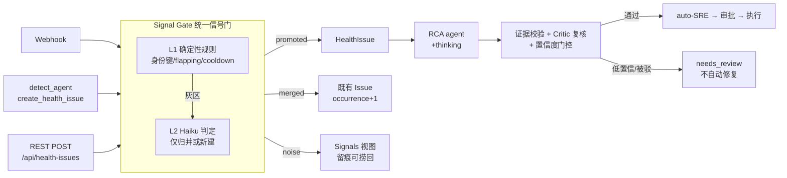

# MVP-2.2.0 设计：Signal Gate 降噪 + RCA 质量四件套 + Agent 架构清理

- **日期**: 2026-07-10
- **分支**: `MVP-2.2.0`（从 main HEAD `c8979d0` 起，无历史包袱）
- **时间盒**: 1 周
- **来源**: RAW-Idea-latest-v3.md `2026.7.10 - 下一代功能增强`（两个持续迭代目标：① RCA 质量与噪音消除；② Agent 架构/Harness/Prompt 职责审计）

---

## 0. 现状诊断（探索结论摘要）

一句话：**去重机器存在但三条入口各行其是，"噪音判定"作为流水线阶段完全缺失；RCA 是单次直出、自评置信度、无任何校验/反馈回路，且低置信度照样驱动自动修复。**

### 0.1 Issue 重复定位的根因（为什么用户一直看到重复 Issue）

HealthIssue 有 3 条创建路径，去重逻辑互不相通：

| 路径 | 位置 | 现有去重 | 漏洞 |
|---|---|---|---|
| Agent 工具路径 | `tools/metadata_tools.py:345-534` | fingerprint 去重 + 60min resolved cooldown + 同资源合并 + 正则排除 | fingerprint = sha256(source+resource_id+去数字标题)，**依赖 LLM 生成文本**，措辞一变即失效 |
| Webhook 路径 | `integrations/alert_processor.py:166-178` | AlertEvent (source, external_id) 去重 + 仅 open/investigating 状态标题匹配 | **不写 fingerprint**（与路径1完全隔离）；**无 resolved cooldown** → 抖动告警每次 flap 都新建 Issue + 触发一次完整 Opus RCA；Prometheus 多告警 payload 只取 `alerts[0]` |
| REST API | `web/app.py:2134-2146` | **零去重** | 直插 DB + 触发 auto-RCA |

其他事实：上游 dedup key（Prometheus fingerprint / CloudWatch AlarmArn / PagerDuty dedup_key）被存进 `AlertEvent.external_id` 后**从未用于 HealthIssue 身份**；HealthIssue **没有 issue_type 列**，"同一问题"只能靠标题文本；同资源合并不分类型（CPU 告警可被并进安全 Issue）；webhook 的 resolve/OK 事件被当作新告警解析而不是恢复信号。

### 0.2 RCA 质量的根因

- 单次 Opus 4.6 直出（`agents/rca_agent.py:270-279`），**未开 extended thinking**。
- confidence 由 LLM 自评（prompt 量表 `rca_agent.py:149-154`），服务端仅 clamp 到 [0,1]（`metadata_tools.py:815`）——**无任何校验**。
- **confidence 不门控任何事**：0.2 置信度的 RCA 照样 `save_rca_result → trigger_auto_sre → 自动批准(L0/L1) → 自动执行`（`metadata_tools.py:839-840`）。
- 证据不落库：RCAResult 只存结论，不存证据链，无法审计"引用的 CloudTrail 事件是否真实存在"。
- **无人工反馈**：现有 feedback 端点只有 issue 级 false_positive（喂 detect memory），RCA 对错从不采集，ground truth 无从积累。
- **修复失败不回馈**：FixExecution 失败后，(可能错误的) RCAResult 原样保留，不标记不重审。
- 无超时看门狗：RCA 线程挂起 → Issue 永远停在 investigating 且无事件。
- 状态机缺 `root_cause_identified→investigating` 回边 → 重跑 RCA 时协议第3步被拒（`models.py:359-369`）。

### 0.3 Agent 架构问题（分两档）

**卫生类**（低风险，纯 prompt/配置）：main 路由规则编号错乱（两个 9.7，9.6 排在 9.7 后，`main_agent.py:141-169`）+ "ADDITIONAL TASKS" 劣化重述；GuardDuty 同时路由到 detect 和 sre_query（`main_agent.py:91,122,172`）；detect prompt 残留伪注释行（`detect_agent.py:142`）；`agent_sre_model_id=claude-fable-5` 无 token_cost_table 条目 → **SRE 成本永远 $0**（`settings.yaml:13` vs `settings.yaml:28-48`）；CLAUDE.md 模型表与 settings.yaml 不符（实际 executor=Opus 4.6、sre=fable-5）；`rca_started` 事件记录的是默认层模型而非实际 RCA 模型（`rca_service.py:58`）；RCA prompt 重复 "b." 编号；reporter prompt 要求"服务安全聚焦"但它没有任何 AWS 工具（只能编造或跳过，自相矛盾）；create_health_issue 工具 docstring 声称"5 分钟窗口"但代码无此窗口。

**结构类**：① RCA 写 fix_plan 后 SRE 再写一份权威 FixPlan（双重修复作者，`rca_agent.py:133-134` + `metadata_tools.py:759`；且 KB 案例蒸馏存的是这份从未执行的草稿 `kb_tools.py:491`）——**本次做**，已验证为纯 prompt 级最小改动（见 4.2）；② scan_agent 携带 `check_health` 干 detect 的活，docstring 又声明 "NOT FOR: health checks"（`scan_agent.py:42-44,107-145,154`）——**经用户确认保留不动**（纯角色清晰度问题，不影响降噪）。**推迟**：check_health 归属整理、sre_agent/sre_query 双重身份拆分、legacy orchestrator 重复栈（`analyze/rca.py` RCAEngine 等）删除 → 见 §6 Future。

---

## 1. 总体方案（已确认的三个方向性决策）

1. **产品形态：Signal 收件箱-lite** — 所有事件先落 Signal 记录（泛化现有 `alert_events` 表），统一判定：归并 / 噪音留痕 / 晋升新 Issue。Issue 列表只收真正的新问题；每个判定必留痕迹可审计、可一键捞回。只加一个轻量 Signals 视图，不做完整收件箱页。
2. **判定引擎：确定性为主 + LLM 兜底** — L1 纯代码规则（结构化身份键、flapping、cooldown）处理 ~80% 重复，$0、可测试、可解释；仅"规则拿不准的灰区"走一次 Haiku 判定。LLM 只能**归并**，永远不能**丢弃**；不确定 → 宁可新建 Issue（fail-open）。与 Galaxy L3 fail-closed 哲学一致。
3. **RCA 四件套全上** — 开启 thinking、证据门禁+置信度门控、Critic 对抗复核、人工反馈+失败回馈。

架构图（新增部分加粗）：



---

## 2. Section A — Signal Gate（统一信号门 + Signals 视图）

### 2.1 数据模型

**复用 `alert_events` 表**（类名 `AlertEvent` 保留、表名不变，UI/API 概念名为 "Signal"），新增列：

| 列 | 类型 | 说明 |
|---|---|---|
| `kind` | String(20) | `alert` / `detection` / `resolution` / `manual`（webhook OK/resolved 事件记为 resolution，喂 flapping 计数，本期不做自动 resolve） |
| `fingerprint` | String(64), indexed | 结构化身份键 v2（见 2.2） |
| `resource_id` | String(500) | 归一化资源 ID |
| `account_id` | String(50) | 账户 |
| `issue_type` | String(40) | 问题类型分类（见 2.2） |
| `disposition` | String(20), indexed | `promoted` / `merged` / `noise` / `error` |
| `disposition_reason` | String(200) | 如 `exact_fingerprint`、`flapping_3in30m`、`llm_merge_conf_0.85`、`excluded_pattern` |
| `gate_evidence` | JSON | 命中的规则、候选 Issue 及分数、LLM 判定原文 |

**HealthIssue 新增列**：`issue_type` String(40), indexed（存量数据 backfill 为 `other`）。迁移沿用 models.py 现有的 ensure-column 内联迁移模式。

Signal 保留策略：`signal_retention_days`（默认 30）后台清理，防表膨胀。

### 2.2 身份键 v2 与 issue_type 分类

```
fingerprint_v2 = sha256(account_id | provider | resource_id_norm | issue_type | upstream_key)
```

- `upstream_key`：webhook 源用上游 dedup 键（Prometheus alert fingerprint / CloudWatch **AlarmArn**（两条摄入路线统一用 ARN）/ Datadog id / PagerDuty dedup_key）；agent 检测路径用 `alarm_name`（有则用），否则空。
- `issue_type` 分类表（起步 16 类，可配置扩展）：`cpu_spike, memory_pressure, disk_full, network_flap, connectivity, security_exposure, security_finding, iam_risk, cert_expiry, availability, capacity_risk, spof, cost_anomaly, config_drift, performance_degradation, other`。
  - detect 路径：`create_health_issue` 工具新增 `issue_type` 参数（枚举，prompt 中给出分类表，LLM 必填；未知给 `other`）。
  - webhook 路径：确定性映射表（CloudWatch namespace/metric → type；Prometheus alertname 关键词 → type；兜底 `other`），纯代码可扩展。
  - graph patrol：直接传 `spof` / `capacity_risk`。
- **标题不再参与身份**。仅当 `resource_id` 为空/unknown 且无 upstream_key 时，回退用去数字标题作 key 成分（保底，与今天等价）。

### 2.3 L1 确定性规则（同步、$0、按序短路）

统一入口 `services/signal_gate.py::process_signal(signal) -> GateDecision`，**三条创建路径全部改经此门**（webhook `alert_processor`、agent `_create_health_issue_impl`、REST `POST /api/health-issues`——修掉 REST 零去重漏洞）。门内用进程级锁串行化判定+写入（当前单进程部署足够；多 worker 部署的 DB 唯一约束方案见 §6）。

1. **排除模式**（沿用 `issue_exclude_patterns` 正则）→ `noise / excluded_pattern`。
2. **fingerprint_v2 精确命中活跃 Issue**（活跃 = 除 resolved 外全部状态，含 dismissed）→ `merged`：occurrence_count+1、last_seen、严重度上抬、merged_alerts 追加（复用现逻辑，收敛为一份实现）。
3. **Resolved cooldown**（`dedup_resolved_cooldown_minutes` 默认 60，**首次覆盖 webhook 路径**）→ `merged` 到已 resolved Issue，reason=`resolved_cooldown`。
4. **Flapping 判定**：同 fingerprint 在 `noise_flap_window_minutes`（默认 30）内累计 ≥ `noise_flap_threshold`（默认 3）条信号（resolution 信号也计入抖动）→ 本条及窗口内后续信号 `noise / flapping`，不再新建 Issue；窗口静默后恢复正常判定。
5. **同资源合并（收紧）**：同 `resource_id` **且同 `issue_type`** 的活跃 Issue（前 4 个早期状态，同现状）→ `merged`。修掉"CPU 告警并进安全 Issue"的过度合并。
6. 都未命中 → 进入 2.4 灰区检测，或直接 `promoted`。

### 2.4 L2 Haiku 灰区判定（仅在有疑似近邻时）

**触发条件**（满足其一才调用，告警风暴时天然限流于灰区）：
- 同 `resource_id` 存在不同措辞/类型的活跃 Issue；
- 同 `account + issue_type` 在近 `noise_flap_window_minutes` 内有活跃 Issue（跨资源同根因嫌疑）；
- 与活跃 Issue 标题 token-Jaccard ≥ 0.5（廉价预筛）。

**调用**：一次 cheap-tier 调用（`signal_gate_llm_model` 空 → `bedrock_model_id_cheap`，temp=0，结构化 JSON）。输入 = 新信号摘要 + ≤`signal_gate_candidate_cap`(5) 个候选活跃 Issue（id/type/resource/title/last_seen/occurrence）。输出 = `{action: merge|new, target_issue_id, confidence, reason}`。

**信任规则**（硬约束）：
- 仅 `action=merge` 且 `confidence ≥ signal_gate_confidence_min`(0.7) 才归并，判定原文写入 `gate_evidence`；
- 其余一律 `promoted`（fail-open：宁多建不误吞）；
- **LLM 永远不能输出 noise** —— 噪音判定只属于确定性规则；
- `signal_gate_llm_enabled=false` 时跳过 L2，纯 L1 运行。

### 2.5 行为收敛与修复的旧缺陷

- Prometheus 多告警 payload：**逐条**生成 Signal（修掉只取 `alerts[0]`）。
- webhook OK/resolved：记 `kind=resolution` 信号归并到对应 Issue（时间线可见、喂 flapping），**不**自动 resolve（future）。
- 通知：只有 `promoted` 触发 `notify_issue_created`；merged/noise 静默（消灭重复通知风暴）。
- alert_processor 里 `{"resolved","fix_executed","closed"}` 这类与状态机不一致的终态集合随重写消亡，统一引用 models.py 的状态定义。
- `create_health_issue` docstring 按新门禁行为重写（消灭"5 分钟窗口"文档漂移）。

### 2.6 API 与前端（轻量）

- `GET /api/signals?disposition=&issue_type=&window=&limit=`（游标分页）
- `POST /api/signals/{id}/promote` — 人工捞回：绕过 gate 直接建 Issue，signal 改记 `promoted/manual_override`。
- 前端：Signals 轻量视图（放入 IssuesAndPlans 页一个新 Tab，表格 + disposition 徽标 + 理由列 + 捞回按钮；遵守 popup house rule）。Issue 列表行加 `×N` occurrence 徽标（数据已有）。
- PipelineEvent 新增 `signal_gated` 事件（仅 merged/noise 时记录，挂在目标 Issue 时间线上）。

---

## 3. Section B — RCA 质量四件套

### 3.1 开启 extended thinking

- config 新增通用 `agent_{name}_thinking_budget`（默认 0=off）；settings.yaml 仅为 `rca` 开启（默认 4096）。
- 实现：`preamble.py` 增加共享 helper 构造 BedrockModel 的 `additional_request_fields`（thinking 开启时校验 `max_tokens > budget`）；具体字段名/与工具调用的交互按 Strands/Bedrock 文档在实现时用 strands docs MCP 核准。
- SRE/main 暂不开（fable-5/opus-4.8 推理已强，先测 RCA 收益再扩）。

### 3.2 证据门禁（fail-closed，纯代码）+ 置信度门控

- `RCAResult` 新增列：`evidence` JSON、`evidence_verified` bool(nullable)。
- `save_rca_result` 新增 `evidence` 参数：LLM 必须列出证据项 `[{type: cloudtrail|metric|log|kb|trace|cli, ref, summary}]`（prompt 第 7/8 步同步改写）。
- **后置校验（rca_agent 运行结束后，纯代码）**：遍历本次 `agent.messages` 的 toolUse 痕迹，逐条核对 evidence.ref 是否真的出现在本次工具调用/结果中。任一证据无痕迹支撑 → `evidence_verified=false`、confidence ×0.6 并记事件。与 Galaxy L3 的"证据必须落在 raw_data"同一哲学。
- **置信度门控**：最终 confidence（含惩罚后）< `rca_min_confidence_for_autofix`（默认 0.6）→ **不触发 auto-SRE**，Issue 打 `needs_review`（存 metric_data.needs_review + PipelineEvent `rca_needs_review` + 通知一次）。人工仍可经 chat/API 触发 SRE。

### 3.3 Critic 对抗复核（廉价模型）

- `RCAResult` 新增列：`critic_verdict` String(20)（`supported|weak|refuted|disputed_by_execution`）、`critic_notes` Text。
- RCA 保存后、auto-SRE 触发前，一次 cheap-tier 调用（`rca_critic_model_id` 空 → cheap tier；`rca_critic_enabled` 默认 true）：输入 = Issue 摘要 + root_cause + evidence（含 verified 标记），指令 = "试图反驳该根因；证据是否支撑？有何替代解释？"，输出 JSON verdict+notes。
- `refuted` → confidence ×0.5 并走 needs_review 分支（同 3.2）。

### 3.4 管线重排（关键结构变化）+ 看门狗

- **`save_rca_result` 变纯持久化**：移除其中的 `trigger_auto_sre` 和通知副作用。
- **后置管线收拢到 `rca_agent` 运行结束处**（所有入口——chat 工具、rca_service、REST 手动端点、CLI——都经 rca_agent，天然全覆盖）：`证据校验 → Critic → 门控判定 → (通过) trigger_auto_sre + 通知 / (不通过) needs_review 事件`。若整轮跑完没有产生 RCAResult → 记 `rca_completed(status=failed)` 事件（修"卡在 investigating 无声"）。
- **超时**：`rca_timeout_seconds`（默认 900）——线程无法强杀，超时即记 `rca_failed` 事件 + needs_review，保证可观测不悬挂。
- 状态机补 `root_cause_identified → investigating` 回边（重跑 RCA 合法化）；`save_rca_result` 改走 `validate_status_transition`。

### 3.5 人工反馈 + 失败回馈（ground truth 起点）

- `RCAResult` 新增列：`human_verdict` String(10)（`correct|incorrect`，nullable）、`human_note` Text、`verified_at` DateTime。
- API：`POST /api/health-issues/{id}/rca-feedback {verdict, note}` → 写最新 RCAResult；`incorrect` 时同步生成一条 rca agent-memory（直接调 memory 模块写 `agent-memory/rca/`，模式："对 <issue_type>@<resource类型>，结论 X 被人工否定，原因…"）。
- UI：IssueDetail 的 RCA 卡片加 👍/👎 + 备注；显示 evidence_verified / critic_verdict / needs_review 徽标。
- **失败回馈**：executor 路径 `mark_fix_failed` / 失败的 `save_execution_result` → 将对应 RCAResult `critic_verdict='disputed_by_execution'` + PipelineEvent。本期**不**自动重跑 RCA（future，避免执行失败→无限重跑环）。

---

## 4. Section C — Agent 架构清理

### 4.1 卫生类（全修，约半天）

1. main 路由规则重新编号、合并 "ADDITIONAL TASKS" 劣化段；GuardDuty 歧义裁决：**"列出/查询 findings" → sre_query；"安全审计/合规扫描（产出 Issue）" → detect scope=security**，同步改两处 docstring + 规则文案；"check" 碰撞同法澄清（受管资源健康 → detect；任意服务即席查询 → sre_query）。
2. 删 `detect_agent.py:142` 残留伪注释行（保留 143 行真实规则；CPU sustained 类噪音此后由 Signal Gate 的 issue_type+flapping 承接）。
3. token_cost_table 增 `claude-fable-5` 条目（`normalize_model_key` 对无双数字版本号的 id 会原样返回 key，故只需加表项、无需改正则；费率先按 Opus 4.8 档录入，官方费率公布后修正）；`MODEL_WINDOW_DEFAULTS` 增 fable 家族（消 validate 警告）。
4. CLAUDE.md 模型表与 settings.yaml 对齐（sre=fable-5、executor=Opus 4.6）。
5. `rca_started` 事件改记实际解析出的 RCA 模型。
6. 子 agent `track_agent(parent_agent=...)` 不再硬编码 "main"，按实际调用方（main/pipeline/patrol/api）传参。
7. RCA prompt 重复 "b." 编号修正；reporter prompt 删除其无工具支撑的 "Service Security Focus" 段（防编造）。

### 4.2 结构类（只做一个：RCA 不再产 fix_plan——纯 prompt 级最小改动）

**范围已核实（前端 0 改动，DB/API/工具参数全部保留兼容）**：

- 改 `rca_agent.py` prompt 第 7/8 步：只产出 root cause + 证据 + recommendations，删去"Create a fix plan / Assess fix risk"指令（修复规划全权归 SRE）。
- 改 `save_rca_result` 的 docstring：不再引导传 `fix_plan/fix_risk_level`；**参数、DB 列、API schema（`web/schemas.py:138`）原样保留**——旧数据照常展示，无迁移。
- `kb_tools.py:491` 案例蒸馏改读该 Issue 的真实 SRE FixPlan（fallback 旧字段）：修掉"案例库存的是从未执行的 RCA 草稿方案"这一 KB 质量问题——今后 search_similar_cases 检回的是被批准/执行过的方案。
- SRE prompt 已读 RCAResult（含 recommendations），无需改动。

**收益**：消灭双重修复作者（职责单一）；RCA 的 token/注意力集中于根因与证据（配合 B 节的证据门禁方向一致）；KB 飞轮存真实方案。预计总成本约半小时 + 测试。

**scan_agent 的 `check_health` 经用户确认保留不动**（scan 兼任多账户健康检查入口的现状接受；其产出的 Issue 同样经过 Signal Gate，不影响降噪主线）。仅做一行 docstring 澄清：scan_agent 的 "NOT FOR: health checks" 改为如实声明"含 check_health 多账户并行健康检查包装器"。

### 4.3 明确不做（本周）

sre_query 拆分独立 agent、legacy orchestrator/RCAEngine 双重栈删除、statement-level 唯一约束、noise 按 issue_type 的策略引擎、Signals 完整收件箱页、自动 re-RCA——全部进 §6。

---

## 5. 配置、迁移、测试与验收

### 5.1 新增配置（config.py schema + settings.yaml 默认值；遵守"不硬编码"铁律）

| 配置 | 默认 | 说明 |
|---|---|---|
| `signal_gate_enabled` | true | 总开关（false = 维持旧行为，回滚阀） |
| `signal_gate_llm_enabled` | true | L2 灰区判定开关 |
| `signal_gate_llm_model` | "" | 空 = cheap tier |
| `signal_gate_confidence_min` | 0.7 | L2 归并置信度下限 |
| `signal_gate_candidate_cap` | 5 | L2 候选 Issue 上限 |
| `noise_flap_threshold` | 3 | flapping 判定条数 |
| `noise_flap_window_minutes` | 30 | flapping 窗口 |
| `signal_retention_days` | 30 | Signal 行保留 |
| `agent_{name}_thinking_budget` | 0 | yaml 中仅 rca=4096 |
| `rca_min_confidence_for_autofix` | 0.6 | 置信度门控 |
| `rca_critic_enabled` | true | Critic 复核 |
| `rca_critic_model_id` | "" | 空 = cheap tier |
| `rca_timeout_seconds` | 900 | RCA 看门狗 |

### 5.2 DB 迁移（沿用 models.py 内联 ensure-column 模式）

- `alert_events`：+kind, fingerprint, resource_id, account_id, issue_type, disposition, disposition_reason, gate_evidence
- `health_issues`：+issue_type（backfill `other`）
- `rca_results`：+evidence, evidence_verified, critic_verdict, critic_notes, human_verdict, human_note, verified_at

### 5.3 一周排期

| 天 | 交付 |
|---|---|
| D1 | A：迁移 + `signal_gate.py` L1 规则 + fingerprint_v2 + issue_type 分类/映射表 + 单测 |
| D2 | A：三条路径接入 gate（重写 alert_processor 判定段 / metadata_tools 建单段 / REST 端点）+ flapping + Prometheus 逐条解析 + 单测 |
| D3 | A：L2 Haiku 判定（mock 测试）+ /api/signals + promote 端点 + Signals Tab + ×N 徽标 |
| D4 | B：thinking 配置 + save_rca_result 纯化 + rca_agent 后置管线（证据校验→Critic→门控→auto-SRE）+ RCAResult 迁移 + 单测 |
| D5 | B：rca-feedback API+UI + 失败回馈标记 + 超时看门狗 + 状态机回边 + 事件 |
| D6 | C：卫生 7 项 + 结构 1 项（RCA 去 fix_plan，prompt 级）+ prompt-budget/路由测试更新 + CLAUDE.md·WORKFLOW.md 同步 |
| D7 | E2E（见 5.4）+ 回归全量测试 + 文档收尾 + buffer |

### 5.4 验收标准（可量化）

1. 同一 webhook 告警 5 分钟内重放 10 次 → **1** 个 HealthIssue、10 条 Signal（1 promoted + 9 merged）、**1** 次 RCA 运行。
2. 抖动告警（firing/resolved ×3 / 30min）→ 达阈值后不再新建 Issue；Signals 视图可见 `noise/flapping` + 理由；`promote` 可捞回成 Issue。
3. 同一问题先 webhook 后 detect（措辞不同、同资源同类型）→ 单一 Issue（L1 身份键或 L2 归并，gate_evidence 留 LLM 判定原文）。
4. REST POST 重复创建 → 被归并（REST 零去重漏洞关闭）。
5. RCA confidence<0.6 或 critic=refuted → **无** auto-SRE；时间线可见 `rca_needs_review`。
6. RCA 引用不存在的 CloudTrail 事件 → `evidence_verified=false` + 置信度惩罚可见。
7. 修复执行失败 → 对应 RCAResult 显示 `disputed_by_execution`。
8. SRE 运行成本不再为 $0（fable-5 费率生效）；L2 判定成本计入 cost summary（cheap tier）。
9. `signal_gate_enabled=false` 回退旧行为；全量既有测试通过。
10. 提交前完成 E2E 并经主人确认后才 push（遵守全局规约）。

### 5.5 业界对齐（设计依据，简）

- L1/L2 分层 = Prometheus Alertmanager 的 grouping/inhibition/silence + PagerDuty/Datadog Event Intelligence 的 dedup-key 优先、语义聚类兜底的通行结构；我们补上了它们普遍缺的"判定痕迹可审计 + 一键捞回"。
- 证据门禁/Critic = LLM-as-judge 与 adversarial verification 的最小可行版，且与本 repo Galaxy L3 fail-closed 验证同源，工程上已有先例可抄。

---

## 6. Future（明确记录，不在本周）

1. sre_query 拆分为独立 query agent（还 SRE 单一职责）。
1b. check_health 归属整理（scan↔detect 双入口收敛；用户当前选择保留现状）。
2. 删除 legacy orchestrator 重复栈（`analyze/rca.py` RCAEngine、`detect/detector.py` Anomaly 线）。
3. fingerprint 活跃唯一性的 DB 级约束（多 worker 部署前置条件）。
4. 按 issue_type 的噪音策略引擎（如 security_finding 低危默认聚合日报）。
5. webhook resolution 信号自动 resolve Issue（带回滚保护）。
6. 修复失败自动 re-RCA（带上次结论 + 失败证据，防无限环设计）。
7. RCA 准确率仪表盘（human_verdict/critic/evidence 三源汇总，喂 AgentMetrics 页）。
8. detect 深查与 RCA 的边界收缩（detect 只判"有无问题"，取证全归 RCA）。
